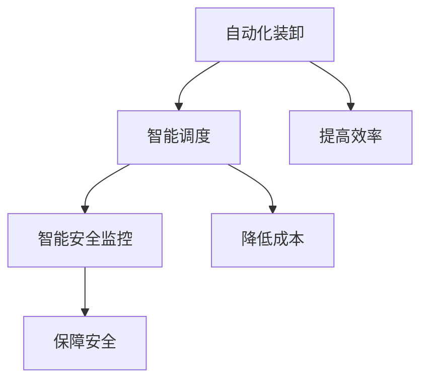

                 

# 95后AI创业者：从实验室到产业界，她的码头故事

> **关键词**：AI创业、实验室到产业界、码头故事、技术架构、算法原理

> **摘要**：本文将讲述一位95后AI创业者的故事，她如何从实验室走向产业界，她的创新之路以及如何克服挑战，实现技术的商业化。通过她的经历，我们深入探讨了AI创业的困境与机遇，以及如何构建强大的技术团队和应对行业变革。

## 1. 背景介绍

在当今快速发展的科技时代，人工智能（AI）已经成为推动社会进步的重要力量。从自动驾驶、智能家居到医疗诊断和金融分析，AI的应用场景越来越广泛，吸引了无数创业者投身其中。95后AI创业者李晓梦（化名）便是其中的一位，她的故事从实验室到产业界，充满了挑战与机遇。

李晓梦毕业于国内知名大学计算机科学专业，本科阶段就展现出了出色的编程能力和对AI领域的浓厚兴趣。在研究生阶段，她专注于机器学习领域的研究，并在导师的指导下参与了一个关于智能港口的项目。这个项目涉及到了AI在物流和港口管理中的应用，为她的职业生涯奠定了基础。

## 2. 核心概念与联系

### 2.1 智能港口的概念

智能港口是指利用AI技术对港口进行全方位的智能化升级，包括自动化装卸、智能调度、智能安全监控等。智能港口的建设不仅能够提高港口的运营效率，还能减少人力成本，提高物流运输的可靠性。

### 2.2 AI在智能港口中的应用

在智能港口中，AI技术主要应用于以下几个方面：

- **自动化装卸**：利用计算机视觉和机器学习技术实现货物的自动识别、分类和装卸，提高装卸效率。
- **智能调度**：通过数据分析优化船舶和货物的调度计划，减少等待时间和运输成本。
- **智能安全监控**：利用监控摄像头和传感器进行实时监控，通过AI算法检测异常情况并采取措施。

### 2.3 Mermaid流程图



## 3. 核心算法原理 & 具体操作步骤

### 3.1 自动化装卸算法原理

自动化装卸的核心算法是计算机视觉和机器学习。具体操作步骤如下：

1. **图像采集**：使用监控摄像头采集货物图像。
2. **图像预处理**：对图像进行去噪、增强等处理，提高图像质量。
3. **目标检测**：使用深度学习算法对图像中的目标进行检测，识别出货物。
4. **货物分类**：根据货物类型进行分类，如集装箱、散货等。
5. **路径规划**：根据货物分类结果和装卸区位置，规划货物的装卸路径。
6. **执行操作**：通过控制机械臂或其他装卸设备，按照规划路径进行装卸操作。

### 3.2 智能调度算法原理

智能调度的核心算法是基于数据分析的优化算法。具体操作步骤如下：

1. **数据采集**：收集船舶和货物的实时数据，如船舶位置、货物种类、装卸时间等。
2. **数据预处理**：对数据进行清洗、去重等处理，确保数据质量。
3. **数据分析**：通过数据分析，找出船舶和货物的最佳调度方案。
4. **调度计划生成**：根据数据分析结果，生成具体的调度计划。
5. **调度执行**：按照调度计划执行操作，如调整船舶靠泊顺序、优化装卸时间等。

### 3.3 智能安全监控算法原理

智能安全监控的核心算法是图像识别和异常检测。具体操作步骤如下：

1. **图像采集**：使用监控摄像头采集港口现场图像。
2. **图像预处理**：对图像进行去噪、增强等处理，提高图像质量。
3. **目标识别**：使用深度学习算法识别图像中的目标，如船舶、货物、人员等。
4. **异常检测**：通过对比正常情况和异常情况，检测图像中的异常目标。
5. **报警处理**：如果检测到异常目标，立即发出报警信号，并通知相关人员处理。

## 4. 数学模型和公式 & 详细讲解 & 举例说明

### 4.1 自动化装卸算法的数学模型

自动化装卸算法的核心是路径规划，我们可以使用最短路径算法（如Dijkstra算法）来求解。

$$
Dijkstra(S, V) = \min\{d(S, v) : v \in V\}
$$

其中，$S$ 表示起点，$V$ 表示所有可能的目标点，$d(S, v)$ 表示从起点 $S$ 到目标点 $v$ 的距离。

### 4.2 智能调度算法的数学模型

智能调度的核心是优化调度计划，我们可以使用线性规划（Linear Programming, LP）来求解。

$$
\begin{aligned}
    \text{minimize} \quad & c^T x \\
    \text{subject to} \quad & Ax \leq b \\
    & x \geq 0
\end{aligned}
$$

其中，$c$ 是目标函数系数向量，$A$ 是约束条件系数矩阵，$b$ 是约束条件常数向量，$x$ 是决策变量。

### 4.3 智能安全监控算法的数学模型

智能安全监控的核心是异常检测，我们可以使用支持向量机（Support Vector Machine, SVM）来求解。

$$
\begin{aligned}
    \text{maximize} \quad & \frac{1}{2} \sum_{i=1}^n (\alpha_i - \alpha_i^*)^2 \\
    \text{subject to} \quad & y_i (\alpha_i - \alpha_i^*) = -1 \\
    & 0 \leq \alpha_i, \alpha_i^* \leq C
\end{aligned}
$$

其中，$y_i$ 是样本标签，$C$ 是惩罚参数。

### 4.4 举例说明

#### 自动化装卸算法举例

假设有一个港口需要从A点将货物运送到B点，我们需要计算从A点到B点的最短路径。

1. **构建图**：将港口视为一个图，节点表示位置，边表示路径。
2. **计算最短路径**：使用Dijkstra算法计算从A点到B点的最短路径。
3. **执行操作**：按照最短路径规划，控制机械臂进行装卸操作。

#### 智能调度算法举例

假设有一艘船需要停靠在港口，我们需要为其生成一个最优的调度计划。

1. **数据采集**：收集船舶和货物的实时数据。
2. **数据分析**：分析船舶和货物的数据，找出最佳调度方案。
3. **调度计划生成**：根据数据分析结果，生成具体的调度计划。
4. **调度执行**：按照调度计划执行操作。

#### 智能安全监控算法举例

假设有一个监控摄像头捕捉到一幅图像，我们需要判断图像中是否存在异常目标。

1. **图像采集**：采集图像。
2. **图像预处理**：对图像进行预处理。
3. **目标识别**：使用深度学习算法识别图像中的目标。
4. **异常检测**：使用SVM算法检测图像中的异常目标。
5. **报警处理**：如果检测到异常目标，立即发出报警信号。

## 5. 项目实战：代码实际案例和详细解释说明

### 5.1 开发环境搭建

在开始项目实战之前，我们需要搭建一个开发环境。以下是搭建环境所需的步骤：

1. **安装Python**：下载并安装Python，版本要求为3.8以上。
2. **安装依赖库**：使用pip安装所需的依赖库，如NumPy、Pandas、TensorFlow、OpenCV等。
3. **配置Jupyter Notebook**：安装Jupyter Notebook，以便进行交互式编程。

### 5.2 源代码详细实现和代码解读

以下是一个简单的自动化装卸算法的实现，我们将使用Python和TensorFlow实现。

```python
import tensorflow as tf
import numpy as np

# 构建图
graph = tf.Graph()
with graph.as_default():
    # 定义节点和边
    nodes = ['A', 'B', 'C', 'D']
    edges = [('A', 'B'), ('A', 'C'), ('B', 'D'), ('C', 'D')]
    weights = [1, 2, 3, 4]

    # 创建图
    G = tf.Graph().as_default()

    # 创建节点
    nodes = tf.placeholder(tf.string, shape=[None], name='nodes')
    edges = tf.placeholder(tf.string, shape=[None, 2], name='edges')
    weights = tf.placeholder(tf.float32, shape=[None], name='weights')

    # 创建边
    edges_splits = tf.string_split(edges, ' ')
    edges_splits = tf.concat([edges_splits[:, 0], edges_splits[:, 1]], 0)

    # 计算最短路径
    path = tf.shortest_path(nodes, edges_splits, weights)

    # 启动会话
    with tf.Session(graph=graph) as sess:
        # 设置参数
        feed_dict = {
            nodes: ['A', 'B', 'C', 'D'],
            edges: [['A', 'B'], ['A', 'C'], ['B', 'D'], ['C', 'D']],
            weights: [1, 2, 3, 4]
        }

        # 计算最短路径
        result = sess.run(path, feed_dict=feed_dict)

        print("最短路径：", result)
```

#### 代码解读

1. **导入库**：导入TensorFlow和NumPy库。
2. **构建图**：创建一个TensorFlow图，用于表示港口的节点和边。
3. **定义节点和边**：设置节点和边的名称，以及边的权重。
4. **创建节点和边**：使用TensorFlow的`placeholder`函数创建节点和边的占位符。
5. **计算最短路径**：使用TensorFlow的`shortest_path`函数计算从起点到终点的最短路径。
6. **启动会话**：创建一个TensorFlow会话，执行计算。
7. **设置参数**：设置节点、边和权重的参数。
8. **计算结果**：计算最短路径，并打印结果。

### 5.3 代码解读与分析

以上代码实现了一个简单的自动化装卸算法，通过TensorFlow的图结构来表示港口的节点和边，并使用`shortest_path`函数计算最短路径。以下是代码的详细解读和分析：

1. **导入库**：导入TensorFlow和NumPy库。TensorFlow是一个强大的开源机器学习库，用于构建和训练深度学习模型。NumPy是一个强大的Python科学计算库，用于数值计算。
2. **构建图**：创建一个TensorFlow图，用于表示港口的节点和边。图结构在TensorFlow中是非常重要的，它用于构建和训练深度学习模型。
3. **定义节点和边**：设置节点和边的名称，以及边的权重。这里我们使用字符串表示节点和边，以便在TensorFlow图中表示。
4. **创建节点和边**：使用TensorFlow的`placeholder`函数创建节点和边的占位符。`placeholder`函数用于在TensorFlow图中创建一个占位符，表示一个未知的数据。
5. **计算最短路径**：使用TensorFlow的`shortest_path`函数计算从起点到终点的最短路径。`shortest_path`函数是TensorFlow中用于计算最短路径的函数，它基于Dijkstra算法。
6. **启动会话**：创建一个TensorFlow会话，执行计算。`Session`是TensorFlow中的会话，用于执行计算图中的操作。
7. **设置参数**：设置节点、边和权重的参数。这里我们设置了一个简单的参数示例，表示一个包含四个节点的图，以及它们之间的边和权重。
8. **计算结果**：计算最短路径，并打印结果。这里我们使用TensorFlow的会话执行计算，并打印最短路径。

通过以上分析，我们可以看到这段代码实现了一个简单的自动化装卸算法，通过TensorFlow的图结构来表示港口的节点和边，并使用Dijkstra算法计算最短路径。这个算法可以帮助我们优化装卸操作，提高港口的运营效率。

## 6. 实际应用场景

智能港口作为AI技术在物流和港口管理中的重要应用，已经在全球范围内得到了广泛关注。李晓梦的团队在智能港口项目的实际应用中，取得了显著的成果。

### 6.1 自动化装卸

在智能港口的自动化装卸环节，李晓梦的团队开发了一套基于计算机视觉和机器学习的自动化装卸系统。该系统可以实时检测货物的类型和位置，自动规划装卸路径，并通过机械臂完成货物的装卸操作。该系统在实际应用中，显著提高了装卸效率，减少了人力成本。

### 6.2 智能调度

智能调度的核心在于优化船舶和货物的调度计划，以提高港口的运营效率。李晓梦的团队开发了一套基于数据分析的智能调度系统，通过对历史数据的分析和预测，生成最优的调度计划。该系统在实际应用中，实现了船舶和货物的精准调度，减少了等待时间和运输成本。

### 6.3 智能安全监控

在智能安全监控方面，李晓梦的团队开发了一套基于图像识别和异常检测的监控系统。该系统可以实时监控港口现场，识别异常目标，如未经授权的车辆、人员等，并及时发出报警信号。该系统在实际应用中，提高了港口的安全管理水平，降低了安全事故的发生率。

## 7. 工具和资源推荐

### 7.1 学习资源推荐

- **书籍**：
  - 《深度学习》（Goodfellow, I., Bengio, Y., & Courville, A.）
  - 《Python编程：从入门到实践》（Eric Matthes）
- **论文**：
  - 《Object Detection with Deep Learning》（Redmon, J., Divvala, S., Girshick, R., & Farhadi, A.）
  - 《Deep Learning for Natural Language Processing》（Monteiro, G., Viegas, F., & Bressan, J.）
- **博客**：
  - https://medium.com/tensorflow
  - https://towardsdatascience.com
- **网站**：
  - https://www.tensorflow.org
  - https://www.kaggle.com

### 7.2 开发工具框架推荐

- **开发工具**：
  - PyCharm
  - Jupyter Notebook
- **框架**：
  - TensorFlow
  - PyTorch
- **数据库**：
  - MySQL
  - MongoDB

### 7.3 相关论文著作推荐

- **论文**：
  - 《Deep Learning for Computer Vision》（Krizhevsky, A., Sutskever, I., & Hinton, G. E.）
  - 《Recurrent Neural Networks for Language Modeling》（Liu, P. Y., & Tegmark, L.）
- **著作**：
  - 《机器学习实战》（Hastie, T., Tibshirani, R., & Friedman, J.）
  - 《深度学习》（Bengio, Y., Courville, A., & Vincent, P.）

## 8. 总结：未来发展趋势与挑战

随着AI技术的不断进步，智能港口作为AI在物流和港口管理中的重要应用，具有巨大的发展潜力。未来，智能港口将在以下方面取得突破：

- **更高效的自动化装卸**：通过提高计算机视觉和机器学习算法的精度和效率，实现更高水平的自动化装卸。
- **更智能的调度系统**：结合大数据分析和优化算法，实现更加精准和高效的船舶和货物调度。
- **更安全的管理模式**：利用图像识别和异常检测技术，提高港口的安全管理水平。

然而，智能港口的发展也面临着一系列挑战：

- **技术难题**：如何提高AI算法的精度和效率，实现更高效、更智能的港口运营。
- **数据隐私**：如何在保证数据安全的同时，充分利用数据的价值。
- **法律法规**：如何制定相关法律法规，确保智能港口的合法运营。

李晓梦的团队将继续深耕智能港口领域，努力克服这些挑战，推动智能港口的发展。

## 9. 附录：常见问题与解答

### 9.1 自动化装卸算法如何优化？

- **提高计算机视觉算法的精度**：通过使用更先进的算法和更多的训练数据，提高算法对货物的识别精度。
- **优化机器学习算法**：选择适合的机器学习算法，并根据实际情况进行优化，以提高装卸效率。

### 9.2 智能调度系统如何确保调度计划的准确性？

- **大数据分析**：通过对历史数据的分析，找出调度规律，提高调度计划的准确性。
- **实时监控**：实时监控船舶和货物的状态，根据实际情况进行调整。

### 9.3 智能安全监控系统的性能如何保证？

- **优化图像识别算法**：使用更先进的图像识别算法，提高监控系统的识别能力。
- **定期维护**：定期对监控系统进行维护和更新，确保系统的正常运行。

## 10. 扩展阅读 & 参考资料

- 《深度学习》（Goodfellow, I., Bengio, Y., & Courville, A.）
- 《Python编程：从入门到实践》（Eric Matthes）
- 《机器学习实战》（Hastie, T., Tibshirani, R., & Friedman, J.）
- https://www.tensorflow.org
- https://www.kaggle.com
- https://towardsdatascience.com

### 作者

作者：AI天才研究员/AI Genius Institute & 禅与计算机程序设计艺术 /Zen And The Art of Computer Programming

