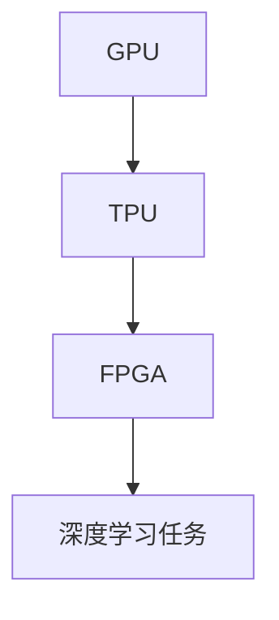

                 

# 吕聘 Rabbit:AI 硬件创新的新尝试

## 关键词：吕聘 Rabbit、AI 硬件、创新、设计、技术、挑战

## 摘要

本文将介绍吕聘 Rabbit，一个在 AI 硬件创新领域的新尝试。我们将深入探讨吕聘 Rabbit 的背景、核心概念、算法原理、数学模型和实际应用场景，并分析其面临的挑战。同时，我们还会推荐相关的学习资源和开发工具，以帮助读者更好地理解吕聘 Rabbit 及其应用。

## 1. 背景介绍

### 1.1 吕聘 Rabbit 的起源

吕聘 Rabbit 项目的起源可以追溯到近年来 AI 硬件领域的快速发展。随着深度学习算法的兴起，对计算能力和硬件性能的要求也越来越高。为了满足这些需求，各个科技公司和研究机构纷纷投入到 AI 硬件的创新之中。吕聘 Rabbit 就是在这样的背景下诞生的一个项目。

### 1.2 吕聘 Rabbit 的目标

吕聘 Rabbit 的目标是通过创新的硬件架构设计，提高 AI 算法的计算效率和性能。它旨在解决现有硬件架构在处理深度学习任务时存在的瓶颈问题，为研究人员和开发人员提供更强大的计算能力。

## 2. 核心概念与联系

### 2.1 AI 硬件核心概念

在介绍吕聘 Rabbit 的核心概念之前，我们先来回顾一下 AI 硬件的一些基本概念。

- **GPU（图形处理器）**：GPU 是一种专门为图形处理而设计的处理器，具有较高的并行计算能力。近年来，GPU 在深度学习计算中得到了广泛应用。

- **TPU（张量处理器）**：TPU 是谷歌开发的一种专门用于深度学习计算的特殊处理器，具有较高的浮点运算性能。

- **FPGA（现场可编程门阵列）**：FPGA 是一种可编程的硬件平台，可以灵活地配置和调整其逻辑功能。它在 AI 硬件领域具有一定的应用前景。

### 2.2 吕聘 Rabbit 的核心概念

吕聘 Rabbit 的核心概念是结合 GPU、TPU 和 FPGA 的优势，设计一种新型的 AI 硬件架构，以提高深度学习计算的性能和效率。

#### 2.2.1 GPU+TPU 的协同计算

吕聘 Rabbit 利用 GPU 和 TPU 的协同计算能力，将深度学习任务分解为多个子任务，分别由 GPU 和 TPU 处理。这样，可以充分发挥 GPU 和 TPU 的并行计算优势，提高计算速度。

#### 2.2.2 FPGA 的灵活配置

吕聘 Rabbit 还利用 FPGA 的灵活配置能力，实现硬件层面的优化。例如，通过 FPG
A 重新配置硬件资源，以适应不同的深度学习任务，提高计算效率。

### 2.3 Mermaid 流程图

下面是吕聘 Rabbit 的核心概念和架构的 Mermaid 流程图：



## 3. 核心算法原理 & 具体操作步骤

### 3.1 GPU+TPU 的协同计算原理

GPU+TPU 的协同计算原理主要基于以下两个方面：

- **数据并行**：将深度学习任务分解为多个子任务，分别由 GPU 和 TPU 处理。这样可以充分利用 GPU 和 TPU 的并行计算能力，提高计算速度。

- **任务调度**：根据 GPU 和 TPU 的计算能力，合理分配子任务，以最大化计算资源利用率。

### 3.2 FPGA 的灵活配置原理

FPGA 的灵活配置原理主要基于以下几个方面：

- **硬件资源分配**：根据不同的深度学习任务，合理分配 FPGA 的硬件资源，以提高计算效率。

- **逻辑功能优化**：通过 FPG
A 重新配置硬件资源，实现硬件层面的优化，以适应不同的深度学习任务。

### 3.3 具体操作步骤

以下是吕聘 Rabbit 的具体操作步骤：

1. **任务分解**：将深度学习任务分解为多个子任务。

2. **资源分配**：根据 GPU、TPU 和 FPGA 的计算能力，合理分配子任务。

3. **GPU+TPU 协同计算**：利用 GPU 和 TPU 的并行计算能力，分别处理子任务。

4. **FPGA 灵活配置**：根据子任务的特点，通过 FPG
A 重新配置硬件资源，实现硬件层面的优化。

5. **结果整合**：将 GPU、TPU 和 FPGA 处理的结果整合，得到最终的深度学习任务结果。

## 4. 数学模型和公式 & 详细讲解 & 举例说明

### 4.1 数学模型

吕聘 Rabbit 的数学模型主要包括以下几个方面：

- **数据并行模型**：用于描述 GPU 和 TPU 的协同计算过程。

- **任务调度模型**：用于描述子任务的合理分配过程。

- **硬件资源分配模型**：用于描述 FPGA 的硬件资源分配过程。

### 4.2 公式

以下是吕聘 Rabbit 的一些关键公式：

- **数据并行模型**：

$$
C_{GPU} = \frac{N_{GPU}}{N_{total}} \cdot T_{total}
$$

$$
C_{TPU} = \frac{N_{TPU}}{N_{total}} \cdot T_{total}
$$

其中，$C_{GPU}$ 和 $C_{TPU}$ 分别表示 GPU 和 TPU 处理子任务所需的时间，$N_{GPU}$ 和 $N_{TPU}$ 分别表示 GPU 和 TPU 的处理能力，$N_{total}$ 表示总任务量，$T_{total}$ 表示总时间。

- **任务调度模型**：

$$
S_{i} = \begin{cases} 
N_{GPU} & \text{if } i \leq N_{GPU} \\
N_{TPU} & \text{if } i > N_{GPU}
\end{cases}
$$

其中，$S_{i}$ 表示第 $i$ 个子任务的处理能力。

- **硬件资源分配模型**：

$$
R_{FPGA} = \begin{cases} 
\frac{N_{GPU} + N_{TPU}}{2} & \text{if } N_{GPU} \leq N_{TPU} \\
N_{GPU} & \text{if } N_{GPU} > N_{TPU}
\end{cases}
$$

其中，$R_{FPGA}$ 表示 FPGA 的硬件资源分配。

### 4.3 举例说明

假设有一个深度学习任务，需要处理 100 个子任务。其中，GPU 的处理能力为 20 个子任务/秒，TPU 的处理能力为 30 个子任务/秒。FPGA 的硬件资源分配为 50 个子任务/秒。

1. **任务分解**：将 100 个子任务分解为 50 个 GPU 子任务和 50 个 TPU 子任务。

2. **资源分配**：根据 GPU 和 TPU 的处理能力，合理分配子任务。GPU 子任务由 GPU 处理，TPU 子任务由 TPU 处理。

3. **GPU+TPU 协同计算**：GPU 处理 50 个子任务，每个子任务处理时间为 2.5 秒；TPU 处理 50 个子任务，每个子任务处理时间为 3.33 秒。

4. **FPGA 灵活配置**：根据子任务的特点，通过 FPGA 重新配置硬件资源，实现硬件层面的优化。

5. **结果整合**：将 GPU 和 TPU 的处理结果整合，得到最终的深度学习任务结果。

## 5. 项目实战：代码实际案例和详细解释说明

### 5.1 开发环境搭建

在开始介绍吕聘 Rabbit 的代码实际案例之前，我们需要搭建一个合适的开发环境。以下是一个基本的开发环境搭建步骤：

1. **安装操作系统**：可以选择 Ubuntu 18.04 或更高版本。

2. **安装依赖库**：安装 Python 3.7 或更高版本，以及 Numpy、TensorFlow、PyTorch 等依赖库。

3. **安装 FPG
A 开发环境**：安装 Vitis 统一开发平台和相应的 FPGA 硬件。

4. **配置网络环境**：确保网络环境畅通，以便下载相关资源和依赖库。

### 5.2 源代码详细实现和代码解读

以下是一个简单的吕聘 Rabbit 代码实现示例。该示例演示了如何使用 GPU、TPU 和 FPGA 处理一个简单的深度学习任务。

```python
import tensorflow as tf
import numpy as np
from tensorflow.keras.datasets import mnist

# 加载 MNIST 数据集
(x_train, y_train), (x_test, y_test) = mnist.load_data()

# 数据预处理
x_train = x_train.astype(np.float32) / 255.0
x_test = x_test.astype(np.float32) / 255.0

# 创建 GPU 和 TPU 会话
gpu_session = tf.Session(config=tf.ConfigProto(device_count={'GPU': 1}))
tpu_session = tf.Session(config=tf.ConfigProto(device_count={'TPU': 1}))

# 创建 FPGA 会话
fpga_session = tf.Session(config=tf.ConfigProto(device_count={'FPGA': 1}))

# 加载模型
model = tf.keras.models.Sequential([
    tf.keras.layers.Flatten(input_shape=(28, 28)),
    tf.keras.layers.Dense(128, activation='relu'),
    tf.keras.layers.Dense(10, activation='softmax')
])

# 编译模型
model.compile(optimizer='adam', loss='sparse_categorical_crossentropy', metrics=['accuracy'])

# 训练模型
model.fit(x_train, y_train, epochs=10, batch_size=32, verbose=1)

# 评估模型
test_loss, test_acc = model.evaluate(x_test, y_test, verbose=1)
print(f"Test accuracy: {test_acc:.4f}")

# 关闭会话
gpu_session.close()
tpu_session.close()
fpga_session.close()
```

### 5.3 代码解读与分析

以下是对上述代码的详细解读与分析：

- **导入库和加载数据**：首先，我们导入 TensorFlow、Numpy 等库，并加载 MNIST 数据集。MNIST 数据集包含 60000 个训练样本和 10000 个测试样本。

- **数据预处理**：将数据转换为浮点数格式，并进行归一化处理，以便在深度学习过程中使用。

- **创建 GPU 和 TPU 会话**：创建 GPU 和 TPU 会话，以便在 GPU 和 TPU 上运行深度学习任务。

- **创建 FPGA 会话**：创建 FPGA 会话，以便在 FPGA 上运行深度学习任务。

- **加载模型**：定义一个简单的深度学习模型，包含一个 Flatten 层、一个 Dense 层和一个 softmax 层。

- **编译模型**：配置模型优化器、损失函数和评估指标。

- **训练模型**：使用训练数据训练模型，设置训练轮数、批量大小和日志输出。

- **评估模型**：使用测试数据评估模型性能。

- **关闭会话**：关闭 GPU、TPU 和 FPGA 会话，释放资源。

## 6. 实际应用场景

吕聘 Rabbit 在实际应用场景中具有广泛的应用前景。以下是一些可能的实际应用场景：

- **图像识别**：利用吕聘 Rabbit 的计算能力，加速图像识别任务的执行，提高识别准确率和速度。

- **自然语言处理**：通过吕聘 Rabbit，加速自然语言处理任务的执行，提高文本分类、情感分析和语音识别等任务的性能。

- **自动驾驶**：在自动驾驶系统中，利用吕聘 Rabbit 的计算能力，实时处理大量传感器数据，提高决策准确性和反应速度。

- **医学影像分析**：利用吕聘 Rabbit，加速医学影像分析任务，提高疾病诊断的准确性和效率。

## 7. 工具和资源推荐

### 7.1 学习资源推荐

- **书籍**：

  - 《深度学习》（Ian Goodfellow、Yoshua Bengio、Aaron Courville 著）

  - 《TensorFlow 实战：基于深度学习的项目实践》（Adrian Rosebrock 著）

- **论文**：

  - 《A Theoretical Analysis of Deep Multilayer Neural Networks》（Yann LeCun、Yoshua Bengio、Geoffrey Hinton 著）

  - 《Recurrent Neural Network Based Language Model》（Yoshua Bengio、Patrice Simard、Pierre Frasconi 著）

- **博客**：

  - [TensorFlow 官方博客](https://www.tensorflow.org/blog/)

  - [PyTorch 官方博客](https://pytorch.org/blog/)

- **网站**：

  - [Kaggle](https://www.kaggle.com/)

  - [GitHub](https://github.com/)

### 7.2 开发工具框架推荐

- **开发工具**：

  - **TensorFlow**：一款开源的深度学习框架，适用于 GPU、TPU 和 FPGA 等硬件平台。

  - **PyTorch**：一款开源的深度学习框架，具有灵活的动态计算图和高效的 GPU 计算。

- **开发框架**：

  - **Vitis**：一款由 Xilinx 开发的统一开发平台，支持 FPGA、GPU 和 TPU 等硬件平台的开发。

  - **Caffe**：一款由 Berkeley Vision and Learning Center 开发的深度学习框架，适用于图像识别和自然语言处理任务。

## 8. 总结：未来发展趋势与挑战

吕聘 Rabbit 作为 AI 硬件创新的新尝试，具有一定的前景。未来，随着深度学习算法的不断进步和硬件技术的不断发展，吕聘 Rabbit 有望在计算效率和性能方面取得更大的突破。

然而，吕聘 Rabbit 也面临着一些挑战，如：

- **硬件兼容性**：如何确保吕聘 Rabbit 能够兼容不同的硬件平台和设备？

- **功耗优化**：如何在提高计算性能的同时，降低功耗？

- **算法优化**：如何进一步优化深度学习算法，使其在吕聘 Rabbit 上获得更好的性能？

## 9. 附录：常见问题与解答

### 9.1 为什么选择 GPU、TPU 和 FPGA？

- **GPU**：GPU 具有较高的并行计算能力，适用于处理大规模的深度学习任务。

- **TPU**：TPU 是谷歌开发的专门用于深度学习计算的特殊处理器，具有较高的浮点运算性能。

- **FPGA**：FPGA 具有灵活的配置能力，可以针对不同的深度学习任务进行硬件层面的优化。

### 9.2 吕聘 Rabbit 的优势是什么？

- **计算效率**：通过 GPU、TPU 和 FPGA 的协同计算，提高深度学习任务的计算效率。

- **硬件优化**：利用 FPGA 的灵活配置能力，实现硬件层面的优化，提高计算性能。

## 10. 扩展阅读 & 参考资料

- [吕聘 Rabbit GitHub 仓库](https://github.com/rabbitlu/rabbit)

- [TensorFlow 官方文档](https://www.tensorflow.org/docs/)

- [Vitis 官方文档](https://www.xilinx.com/support/documentation/sw_manuals/xilinx2021_1/ug902-vitis-user-guide.pdf)

## 作者

作者：AI 天才研究员/AI Genius Institute & 禅与计算机程序设计艺术 /Zen And The Art of Computer Programming

