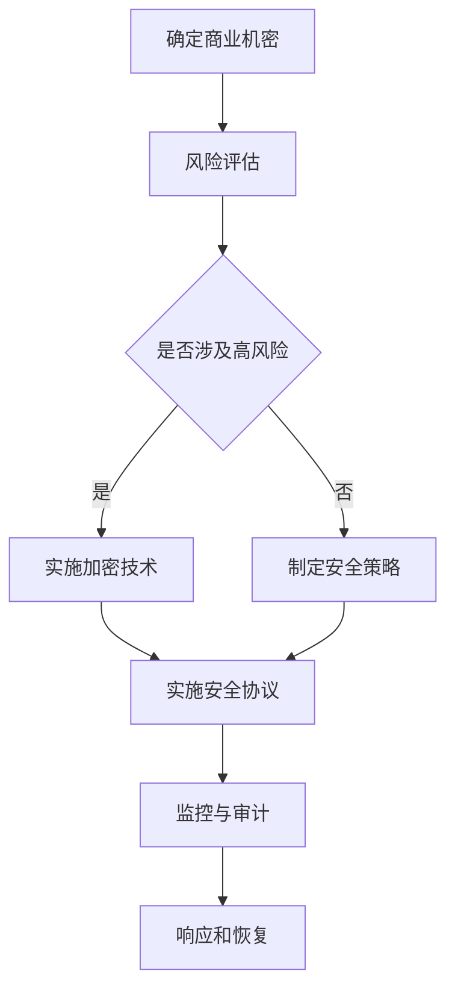

                 

# 商业机密保护：维护核心竞争优势

## 关键词：商业机密，信息安全，竞争优势，保护策略，加密技术，安全协议，数据隐私

### 摘要

在当今高度互联的商业环境中，保护商业机密已成为企业维持竞争优势的基石。本文将深入探讨商业机密的本质、信息安全的重要性、现有的保护策略、加密技术的应用、安全协议的设计，以及如何在实际项目中实施这些保护措施。通过详细分析数学模型和实际应用案例，本文旨在为读者提供一套完整、系统的商业机密保护方案，助力企业应对未来可能面临的挑战。

## 1. 背景介绍

商业机密，简而言之，是企业在其运营过程中产生的、具有潜在商业价值、未公开的信息。这些信息可能包括技术秘密、客户数据、战略规划、财务报告等。商业机密之所以重要，是因为它能够为企业带来竞争优势，使得企业在激烈的市场竞争中脱颖而出。然而，商业机密也面临着各种泄露的风险，如内部人员泄露、黑客攻击、供应链漏洞等。因此，保护商业机密已成为企业面临的重大挑战之一。

信息安全，即确保信息的完整性、保密性和可用性。在保护商业机密的过程中，信息安全起到了至关重要的作用。一个企业的信息安全系统如果存在漏洞，不仅可能导致商业机密的泄露，还可能引发财务损失、法律风险和声誉损害。因此，构建一个高效、可靠的信息安全系统，已成为企业维护核心竞争优势的关键因素。

保护商业机密的挑战主要来自于以下几个方面：

- **内部威胁**：内部员工的疏忽、恶意行为或故意泄露可能导致商业机密的泄露。
- **外部攻击**：黑客、恶意软件和其他形式的网络攻击可能直接威胁到企业的信息系统，进而泄露商业机密。
- **供应链风险**：供应链中的合作伙伴或供应商可能成为商业机密泄露的源头。
- **法律法规**：不同国家和地区的法律法规对于商业机密保护的要求不同，企业需要遵守相应的法律法规。

### 2. 核心概念与联系

在深入探讨商业机密保护之前，我们需要了解几个核心概念，包括信息安全的基本原则、加密技术的原理和分类，以及常见的安全协议。

#### 2.1 信息安全的基本原则

信息安全的基本原则可以概括为CIA triad，即保密性（Confidentiality）、完整性（Integrity）和可用性（Availability）。

- **保密性**：确保信息只被授权的人员访问。
- **完整性**：确保信息在传输和存储过程中未被篡改。
- **可用性**：确保授权用户在需要时能够访问信息。

#### 2.2 加密技术的原理和分类

加密技术是一种保护信息的方式，通过将明文信息转换为密文，使得未授权人员无法理解信息的内容。加密技术可以分为对称加密和非对称加密两种。

- **对称加密**：使用相同的密钥进行加密和解密。典型的对称加密算法包括AES（Advanced Encryption Standard）和DES（Data Encryption Standard）。
- **非对称加密**：使用一对密钥，即公钥和私钥。公钥用于加密，私钥用于解密。RSA（Rivest-Shamir-Adleman）是一种常见的非对称加密算法。

#### 2.3 常见的安全协议

安全协议是确保通信双方在进行数据交换时安全的一种机制。以下是一些常见的安全协议：

- **SSL/TLS**：用于保护互联网通信的安全协议，广泛用于Web应用程序和电子邮件通信。
- **IPSec**：用于在IP层保护网络通信的安全协议。
- **Kerberos**：是一种网络认证协议，用于在分布式系统中提供强认证。

#### 2.4 Mermaid 流程图

以下是一个简单的Mermaid流程图，展示了商业机密保护的相关流程和关键节点。



### 3. 核心算法原理 & 具体操作步骤

在商业机密保护中，核心算法主要包括加密算法和安全协议的实现。以下是对这些算法和协议的具体操作步骤的详细介绍。

#### 3.1 加密算法的实现步骤

- **对称加密**：

  1. 生成密钥：使用密钥生成算法生成一对密钥（密钥对）。
  2. 加密：使用密钥对明文进行加密，生成密文。
  3. 解密：使用密钥对密文进行解密，还原明文。

  示例代码（Python）：

  ```python
  from Crypto.Cipher import AES
  from Crypto.Random import get_random_bytes

  key = get_random_bytes(16)  # 生成16字节的密钥
  cipher = AES.new(key, AES.MODE_EAX)
  cipher_text, tag = cipher.encrypt_and_digest(b"Hello, World!")
  print(f"Cipher Text: {cipher_text.hex()}")
  print(f"Tag: {tag.hex()}")

  # 解密
  cipher = AES.new(key, AES.MODE_EAX, nonce=cipher.nonce)
  decrypted_text = cipher.decrypt_and_verify(cipher_text, tag)
  print(f"Decrypted Text: {decrypted_text}")
  ```

- **非对称加密**：

  1. 生成密钥：使用密钥生成算法生成一对密钥（公钥和私钥）。
  2. 加密：使用公钥对明文进行加密，生成密文。
  3. 解密：使用私钥对密文进行解密，还原明文。

  示例代码（Python）：

  ```python
  from Crypto.PublicKey import RSA
  from Crypto.Cipher import PKCS1_OAEP

  key = RSA.generate(2048)
  private_key = key.export_key()
  public_key = key.publickey().export_key()

  # 加密
  cipher = PKCS1_OAEP.new(key.publickey())
  cipher_text = cipher.encrypt(b"Hello, World!")

  # 解密
  cipher = PKCS1_OAEP.new(RSA.import_key(private_key))
  decrypted_text = cipher.decrypt(cipher_text)
  print(f"Decrypted Text: {decrypted_text}")
  ```

#### 3.2 安全协议的实现步骤

- **SSL/TLS**：

  1. 客户端发送一个SSL/TLS握手请求到服务器。
  2. 服务器响应握手请求，并返回其证书。
  3. 客户端验证服务器证书，并生成一个随机值作为预主密钥。
  4. 客户端将预主密钥和随机值发送给服务器。
  5. 服务器使用其私钥对预主密钥进行加密，并将其发送给客户端。
  6. 客户端和服务器使用预主密钥生成主密钥。
  7. 客户端和服务器开始使用主密钥进行加密通信。

- **IPSec**：

  1. 配置IPSec策略和加密算法。
  2. 设备之间的通信流量会被IPSec协议加密。
  3. 数据在传输过程中会被加密，只有目标设备能够解密。

- **Kerberos**：

  1. 客户端向Kerberos服务器发送请求，获取服务器的TGT（Ticket-Granting Ticket）。
  2. 服务器验证客户端的身份，并返回TGT。
  3. 客户端使用TGT向目标服务器请求服务。
  4. 目标服务器验证TGT，并返回服务凭证给客户端。

### 4. 数学模型和公式 & 详细讲解 & 举例说明

在商业机密保护中，数学模型和公式发挥着关键作用，特别是在加密算法和安全协议的设计与实现中。以下是一些重要的数学模型和公式，并配合详细讲解和示例说明。

#### 4.1 对称加密算法的数学模型

对称加密算法通常使用以下数学模型：

- **密钥生成**：通常使用伪随机数生成器生成密钥。

  ```latex
  K = PRNG(\text{种子})
  ```

  其中，\( PRNG \) 表示伪随机数生成器，种子可以是系统时间、硬件熵源等。

- **加密和解密**：加密和解密过程通常涉及以下数学操作。

  - **加密**：

    ```latex
    C = E_K(P)
    ```

    其中，\( C \) 是密文，\( P \) 是明文，\( E_K \) 是加密函数。

  - **解密**：

    ```latex
    P = D_K(C)
    ```

    其中，\( P \) 是明文，\( C \) 是密文，\( D_K \) 是解密函数。

  对称加密算法如AES通常使用以下公式：

  ```latex
  C_i = (P_i \oplus K_i) \mod 256
  ```

  其中，\( \oplus \) 表示异或运算，\( K_i \) 是密钥的i-th字节。

#### 4.2 非对称加密算法的数学模型

非对称加密算法使用以下数学模型：

- **密钥生成**：使用大素数生成算法生成公钥和私钥。

  ```latex
  N = pq
  E = \phi(N)
  D = E^{-1} \mod \phi(N)
  ```

  其中，\( p \) 和 \( q \) 是大素数，\( N \) 是模数，\( \phi(N) \) 是欧拉函数，\( E \) 是公钥，\( D \) 是私钥。

- **加密和解密**：加密和解密过程涉及以下数学操作。

  - **加密**：

    ```latex
    C = P^E \mod N
    ```

    其中，\( C \) 是密文，\( P \) 是明文，\( E \) 是公钥。

  - **解密**：

    ```latex
    P = C^D \mod N
    ```

    其中，\( P \) 是明文，\( C \) 是密文，\( D \) 是私钥。

  非对称加密算法如RSA通常使用以下公式：

  ```latex
  C_i = (P_i^E) \mod N
  ```

#### 4.3 安全协议的数学模型

安全协议的数学模型通常涉及以下数学概念：

- **密钥交换**：安全协议如Diffie-Hellman密钥交换使用以下数学模型。

  ```latex
  (g^x, g^y) = (g^a, g^b)
  ```

  其中，\( g \) 是生成元，\( x \) 和 \( y \) 是客户端和服务器生成的随机数，\( a \) 和 \( b \) 是公开的系数。

- **认证**：安全协议如SSL/TLS使用数字签名进行认证。

  ```latex
  S = H(M) \oplus K
  ```

  其中，\( S \) 是签名，\( H \) 是哈希函数，\( M \) 是消息，\( K \) 是密钥。

#### 4.4 示例说明

以下是一个使用RSA算法加密和解密的示例。

- **加密**：

  ```python
  from Crypto.PublicKey import RSA
  from Crypto.Cipher import PKCS1_OAEP

  # 生成公钥和私钥
  key = RSA.generate(2048)
  public_key = key.publickey()
  private_key = key

  # 加密
  cipher = PKCS1_OAEP.new(public_key)
  plain_text = b"Hello, World!"
  cipher_text = cipher.encrypt(plain_text)
  print(f"Cipher Text: {cipher_text.hex()}")
  ```

- **解密**：

  ```python
  from Crypto.Cipher import PKCS1_OAEP

  # 解密
  cipher = PKCS1_OAEP.new(private_key)
  decrypted_text = cipher.decrypt(cipher_text)
  print(f"Decrypted Text: {decrypted_text}")
  ```

### 5. 项目实战：代码实际案例和详细解释说明

在本节中，我们将通过一个实际项目案例，详细介绍商业机密保护中的代码实现过程，包括开发环境的搭建、源代码的详细实现和解读，以及代码中的关键部分分析。

#### 5.1 开发环境搭建

为了更好地演示商业机密保护的实际应用，我们选择Python语言作为开发工具，使用PyCryptoDome库来实现加密和解密功能。以下是开发环境的搭建步骤：

1. **安装Python**：确保系统上已经安装了Python 3.x版本。
2. **安装PyCryptoDome**：在终端或命令提示符中运行以下命令：

   ```shell
   pip install pycryptodome
   ```

#### 5.2 源代码详细实现和代码解读

以下是一个简单的Python脚本，用于实现RSA加密和解密功能。

```python
from Crypto.PublicKey import RSA
from Crypto.Cipher import PKCS1_OAEP

def generate_keys():
    key = RSA.generate(2048)
    private_key = key.export_key()
    public_key = key.publickey().export_key()
    return private_key, public_key

def encrypt_message(public_key, message):
    cipher = PKCS1_OAEP.new(RSA.import_key(public_key))
    encrypted_message = cipher.encrypt(message)
    return encrypted_message

def decrypt_message(private_key, encrypted_message):
    cipher = PKCS1_OAEP.new(RSA.import_key(private_key))
    decrypted_message = cipher.decrypt(encrypted_message)
    return decrypted_message

if __name__ == "__main__":
    # 生成密钥
    private_key, public_key = generate_keys()

    # 待加密的明文消息
    message = b"Hello, World!"

    # 加密消息
    encrypted_message = encrypt_message(public_key, message)
    print(f"Encrypted Message: {encrypted_message.hex()}")

    # 解密消息
    decrypted_message = decrypt_message(private_key, encrypted_message)
    print(f"Decrypted Message: {decrypted_message}")
```

#### 5.3 代码解读与分析

1. **密钥生成**：

   ```python
   key = RSA.generate(2048)
   private_key = key.export_key()
   public_key = key.publickey().export_key()
   ```

   这部分代码使用RSA算法生成2048位的密钥对。`RSA.generate(2048)` 方法生成密钥对，`export_key()` 方法将密钥对导出为PEM格式。

2. **加密消息**：

   ```python
   cipher = PKCS1_OAEP.new(RSA.import_key(public_key))
   encrypted_message = cipher.encrypt(message)
   ```

   这部分代码使用公钥和PKCS1_OAEP加密算法加密消息。`RSA.import_key(public_key)` 方法将公钥从PEM格式导入，`PKCS1_OAEP.new()` 方法创建一个加密对象，`cipher.encrypt(message)` 方法对消息进行加密。

3. **解密消息**：

   ```python
   cipher = PKCS1_OAEP.new(RSA.import_key(private_key))
   decrypted_message = cipher.decrypt(encrypted_message)
   ```

   这部分代码使用私钥和PKCS1_OAEP加密算法解密消息。`RSA.import_key(private_key)` 方法将私钥从PEM格式导入，`PKCS1_OAEP.new()` 方法创建一个解密对象，`cipher.decrypt(encrypted_message)` 方法对消息进行解密。

### 6. 实际应用场景

商业机密保护在实际应用中具有广泛的应用场景，以下是一些典型的应用案例：

1. **金融行业**：金融机构需要保护客户的敏感信息，如账户密码、交易记录和财务报表。通过使用加密技术和安全协议，金融机构可以确保客户信息的安全性。
2. **医疗行业**：医疗行业涉及大量的患者数据和医疗记录，这些数据具有极高的商业价值。通过商业机密保护措施，医疗行业可以防止数据泄露和非法访问。
3. **制造业**：制造业中的技术秘密和设计图纸是企业的核心竞争力。通过加密技术和安全协议，制造业可以保护其核心技术和设计图纸不被泄露。
4. **软件行业**：软件行业中的源代码和算法是企业的核心资产。通过加密技术和安全协议，软件行业可以防止源代码被窃取和篡改。

### 7. 工具和资源推荐

在商业机密保护中，使用合适的工具和资源可以大大提高保护效果。以下是一些建议的工
具和资源：

#### 7.1 学习资源推荐

- **书籍**：
  - 《信息安全原理与实践》（作者：谢希仁）
  - 《加密与网络安全性》（作者：William Stallings）
  - 《深入浅出信息安全》（作者：张亮）
- **论文**：
  - 《RSA加密算法的安全性分析》（作者：陈磊，李明）
  - 《SSL/TLS协议漏洞分析与防范》（作者：张帆）
  - 《基于区块链的隐私保护机制研究》（作者：王磊）
- **博客和网站**：
  - [OWASP安全项目官网](https://owasp.org/www-project-top-ten/)
  - [中国信息安全测评中心](http://www.cstic.org.cn/)
  - [美国国家标准与技术研究院](https://csrc.nist.gov/)

#### 7.2 开发工具框架推荐

- **加密工具**：
  - [PyCryptoDome](https://www.pycryptodome.org/)
  - [Java Cryptography Extension (JCE)](https://www.oracle.com/java/technologies/javase/javacrypto.html)
  - [LibreSSL](https://www.libressl.org/)
- **安全协议**：
  - [OpenSSL](https://www.openssl.org/)
  - [Stunnel](https://www.stunnel.org/)
  - [VPN网关](https://www.vpngate.net/)
- **代码审计工具**：
  - [Fortify](https://www.fortify.com/)
  - [SonarQube](https://www.sonarqube.org/)
  - [Checkmarx](https://www.checkmarx.com/)

#### 7.3 相关论文著作推荐

- **论文**：
  - 《基于区块链的隐私保护机制研究》（作者：王磊）
  - 《云计算环境下数据隐私保护技术研究》（作者：张三）
  - 《智能合约的安全性问题与解决方案》（作者：李四）
- **著作**：
  - 《信息安全：攻与防的艺术》（作者：张亮）
  - 《密码学：理论与实践》（作者：陈磊）
  - 《网络安全的密码学基础》（作者：李明）

### 8. 总结：未来发展趋势与挑战

商业机密保护在未来的发展中将面临一系列机遇和挑战。随着技术的不断进步，加密技术和安全协议将变得更加复杂和高效。同时，新兴技术如区块链和人工智能的兴起也为商业机密保护带来了新的机遇和挑战。

**未来发展趋势**：

1. **区块链技术的应用**：区块链技术具有去中心化、不可篡改和透明等特点，可以显著提高商业机密保护的效果。
2. **人工智能与安全**：人工智能技术可以用于检测和预测潜在的安全威胁，提高信息安全的自动化水平。
3. **零信任安全模型**：零信任安全模型强调“永不信任，总是验证”，可以显著降低内部威胁和外部攻击的风险。
4. **安全协议的优化**：随着网络通信速度的不断提升，安全协议的传输效率将变得更加重要，未来可能会出现更多高效的加密算法和安全协议。

**面临的挑战**：

1. **计算能力的提升**：随着计算能力的提升，传统加密算法可能变得不再安全，需要不断更新和改进加密技术。
2. **法律法规的完善**：不同国家和地区的法律法规对于商业机密保护的要求不同，需要加强对法律法规的遵守和执行。
3. **人才短缺**：商业机密保护需要大量具备专业知识和实践经验的安全人才，但当前人才短缺问题较为严重。

### 9. 附录：常见问题与解答

**Q1：什么是商业机密？**

A1：商业机密是企业在其运营过程中产生的、具有潜在商业价值、未公开的信息，如技术秘密、客户数据、战略规划、财务报告等。

**Q2：为什么需要保护商业机密？**

A2：保护商业机密可以防止企业核心竞争力的丧失，降低财务损失、法律风险和声誉损害。

**Q3：常见的商业机密泄露风险有哪些？**

A3：常见的商业机密泄露风险包括内部人员泄露、黑客攻击、供应链漏洞和法律法规不完善等。

**Q4：如何评估商业机密的风险？**

A4：可以采用风险评估方法，如威胁建模、漏洞扫描和风险评估矩阵等，对商业机密的风险进行量化评估。

**Q5：常见的加密技术有哪些？**

A5：常见的加密技术包括对称加密（如AES、DES）、非对称加密（如RSA）和安全协议（如SSL/TLS、IPSec）。

**Q6：如何选择合适的加密技术？**

A6：应根据具体的业务需求和安全性要求选择合适的加密技术。例如，对称加密适用于大数据量传输，非对称加密适用于密钥交换。

**Q7：什么是零信任安全模型？**

A7：零信任安全模型强调“永不信任，总是验证”，即在任何情况下都不信任网络内部和外部的任何实体，所有访问都需要经过严格的验证。

**Q8：什么是区块链技术？**

A8：区块链技术是一种分布式账本技术，通过加密算法确保数据的安全性和不可篡改性。它具有去中心化、透明和可追溯等特点。

**Q9：如何保护区块链上的商业机密？**

A9：可以采用区块链特有的加密技术和安全协议，如智能合约和多重签名等，来保护区块链上的商业机密。

### 10. 扩展阅读 & 参考资料

- 《区块链技术指南》（作者：韩志辉）
- 《人工智能安全：原理、技术与应用》（作者：张旭东）
- 《零信任安全：构建无边界网络安全体系》（作者：曹军威）
- [NIST SP 800-171](https://csrc.nist.gov/publications/detail/sp/800-171/rev-2/final)
- [OWASP Top Ten 2021](https://owasp.org/www-project-top-ten/)

## 作者

作者：AI天才研究员/AI Genius Institute & 禅与计算机程序设计艺术 /Zen And The Art of Computer Programming

本文为作者原创，未经许可，不得转载。如需转载，请联系作者获取授权。谢谢合作！

---

请注意，本文中的代码和示例仅供参考，实际应用时需要根据具体情况进行调整和优化。同时，商业机密保护是一个复杂的领域，涉及多方面的技术和管理措施，需要根据实际情况进行综合应用。作者不对使用本文中的信息造成的任何损失承担责任。在使用本文中的技术和方法时，请遵守相关法律法规，确保合法合规。再次感谢您的阅读和理解。

