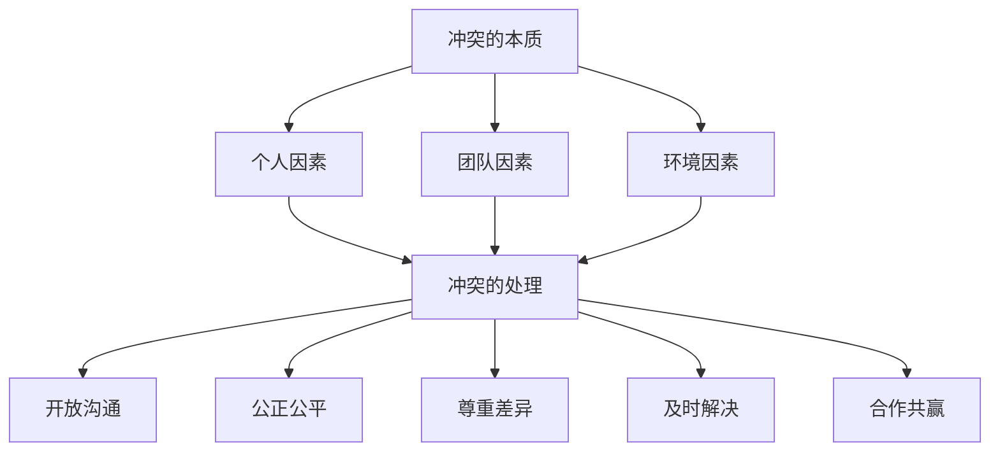
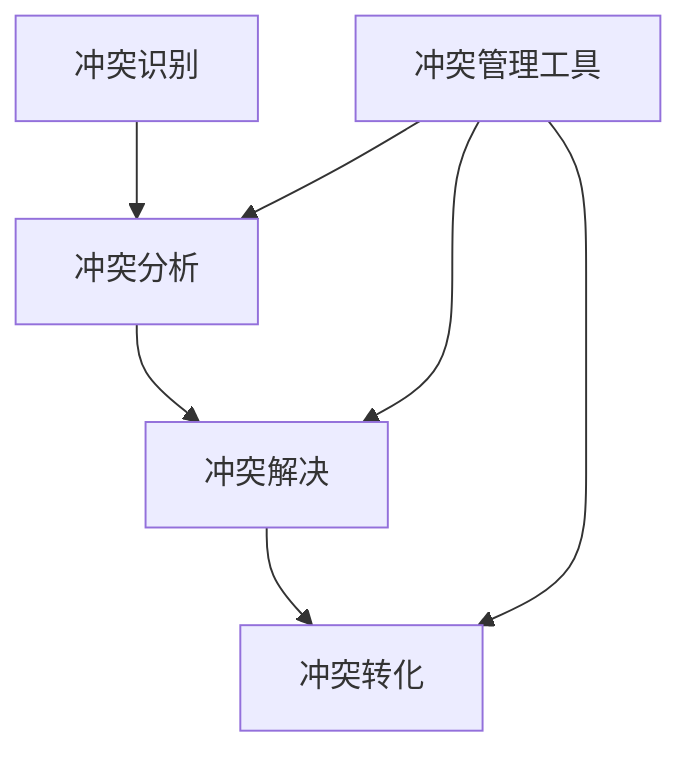

                 

# 团队冲突管理：将分歧转化为创新动力

## 关键词：团队冲突，分歧，创新，管理，转化

## 摘要：
在快速发展的IT行业中，团队冲突是一个不可避免的现象。本文旨在探讨如何有效地管理团队冲突，将分歧转化为创新的动力。我们将通过分析冲突的本质、影响、管理策略以及实践案例，提供一套系统的解决方案，帮助团队在冲突中找到共同点，激发创新潜力。

## 1. 背景介绍

在IT行业中，团队冲突往往源于不同的技术观点、项目目标和团队文化。随着技术的发展和项目的复杂性增加，团队成员之间的分歧可能会对项目的进展产生负面影响。然而，如果我们能够正确地管理这些冲突，它们也可以成为团队创新的源泉。

团队冲突可以定义为团队成员之间由于意见不一致而产生的争执或紧张关系。冲突可能源于技术选择、工作方法、项目优先级等方面。虽然冲突是不可避免的，但它们也可以成为团队协作和创新的有力推动力。

在本文中，我们将探讨以下主题：

- 冲突的本质与影响
- 管理团队冲突的策略
- 将冲突转化为创新的实践方法
- 实际案例解析

通过这些内容，希望能够帮助读者更好地理解团队冲突，并掌握将其转化为创新动力的方法。

### 1.1 IT行业中的团队冲突现象

在IT行业中，团队冲突是普遍存在的。根据一项针对全球IT项目经理的调查，超过80%的受访者表示，他们在项目中遇到过团队冲突。这些冲突可能源于以下几个方面：

- 技术选择：团队成员可能对使用哪种技术或工具持有不同的看法，这可能导致项目进展缓慢或出现质量问题。
- 工作方法：不同的团队成员可能倾向于使用不同的工作方法，这可能导致协作效率低下。
- 项目优先级：在多个项目任务同时进行时，团队成员可能会对哪些任务应该优先处理有不同的看法，这可能导致项目延期或资源浪费。
- 团队文化：不同团队成员之间的文化差异可能导致沟通不畅和误解，从而引发冲突。

### 1.2 团队冲突的影响

团队冲突对项目的进展和团队的整体表现有着显著的影响。一方面，冲突可能导致项目延期、资源浪费和质量问题。另一方面，如果处理得当，冲突也可以激发团队的创新能力，推动项目向前发展。

- **负面影响**：团队冲突可能导致以下问题：
  - 项目进度延误：团队成员在冲突中耗费时间和精力，导致项目进度延误。
  - 资源浪费：冲突可能导致重复工作或资源分配不当，从而浪费项目资源。
  - 质量问题：由于团队成员的分歧，项目质量可能受到影响，导致出现漏洞或错误。
  - 团队士气低落：持续的冲突可能导致团队成员士气低落，影响团队凝聚力。

- **正面影响**：如果处理得当，团队冲突也可以带来以下好处：
  - 激发创新：冲突可以促使团队成员从不同角度思考问题，从而激发创新思维。
  - 提升团队协作能力：通过解决冲突，团队成员可以学会更好地协作，提高团队的整体效能。
  - 深化团队成员对项目的理解：冲突可以帮助团队成员更深入地理解项目的各个方面，从而提升项目的成功概率。

### 1.3 管理团队冲突的重要性

管理团队冲突对于项目的成功至关重要。有效的冲突管理可以帮助团队：

- 减少负面影响：通过及时处理冲突，可以避免项目延误、资源浪费和质量问题。
- 激发创新能力：将冲突转化为创新的动力，推动项目向前发展。
- 提升团队凝聚力：通过解决冲突，可以增强团队成员之间的信任和合作，提升团队凝聚力。

因此，了解冲突的本质、影响和管理策略是每个IT项目经理和团队成员必备的技能。

## 2. 核心概念与联系

在探讨如何管理团队冲突之前，我们需要理解一些核心概念，包括冲突的本质、冲突的影响因素以及冲突管理的基本原则。通过这些概念的分析，我们可以更好地把握团队冲突的内在联系，为后续的冲突管理提供理论基础。

### 2.1 冲突的本质

冲突是指两个或多个个体、团队或组织之间由于目标、利益、价值观、意见等方面的不一致而产生的争执或紧张关系。在IT团队中，冲突通常表现为以下形式：

- 技术选择：团队成员可能对使用哪种技术或工具持有不同的看法。
- 工作方法：团队成员可能倾向于使用不同的工作方法，导致协作效率低下。
- 项目优先级：团队成员可能对哪些任务应该优先处理有不同的看法。
- 团队文化：不同团队成员之间的文化差异可能导致沟通不畅和误解。

冲突的本质可以从以下几个方面来理解：

- **矛盾性**：冲突源于个体或团队之间的目标、利益、价值观等方面的矛盾。这些矛盾可能是显性的，也可能是隐性的。
- **动态性**：冲突是动态变化的，它可能随着时间的推移而加剧或缓解。冲突的解决方式也可能因时间、环境等因素而变化。
- **相互性**：冲突是相互作用的，一方的行为可能引起另一方的反应，反之亦然。这种相互作用使得冲突具有复杂性和不可预测性。

### 2.2 冲突的影响因素

冲突的产生和演变受到多种因素的影响，包括：

- **个人因素**：团队成员的个人性格、价值观、经验等都会影响他们对冲突的看法和处理方式。例如，有些人可能更倾向于避免冲突，而有些人可能更喜欢直接面对并解决冲突。
- **团队因素**：团队的结构、文化、沟通方式等也会影响冲突的产生和解决。一个开放、协作的团队文化有助于减少冲突。
- **环境因素**：项目环境、外部压力、组织文化等也会对冲突产生影响。例如，在紧迫的项目截止日期下，团队成员之间的冲突可能会加剧。

### 2.3 冲突管理的基本原则

有效的冲突管理需要遵循以下基本原则：

- **开放沟通**：鼓励团队成员表达自己的观点和感受，促进信息共享和沟通。
- **公正公平**：在处理冲突时，确保公正公平，避免偏袒任何一方。
- **尊重差异**：尊重团队成员的不同观点和意见，通过对话和协商找到共同点。
- **及时解决**：及时识别和解决冲突，避免冲突升级。
- **合作共赢**：通过合作解决冲突，确保各方都能在冲突中受益。

### 2.4 核心概念之间的联系

理解冲突的本质、影响因素和管理原则之间的联系，对于有效地管理团队冲突至关重要。这些核心概念共同构成了冲突管理的理论基础：

- **本质**：了解冲突的本质有助于识别冲突的根源，从而采取有针对性的管理措施。
- **影响因素**：了解冲突的影响因素可以帮助我们预测冲突的可能性和形式，从而提前做好准备。
- **管理原则**：遵循冲突管理的基本原则，可以有效地处理冲突，减少其负面影响，甚至将其转化为创新的动力。

通过这些核心概念的分析，我们可以为后续的冲突管理策略提供理论基础，为团队在冲突中找到共同点、激发创新潜力奠定基础。

### 2.5 Mermaid 流程图

以下是一个简化的 Mermaid 流程图，展示冲突管理的核心概念和它们之间的联系：



在这个流程图中，我们可以看到，冲突的本质、影响因素和管理原则共同构成了一个闭环，通过有效的冲突管理，可以转化为团队协作和创新的有力推动力。

## 3. 核心算法原理 & 具体操作步骤

在了解了冲突管理的核心概念之后，我们需要探讨如何具体地管理团队冲突。本节将介绍一系列核心算法原理和具体操作步骤，帮助团队在冲突中找到解决方法，并最终将冲突转化为创新动力。

### 3.1 冲突识别

冲突识别是冲突管理的第一步，也是最重要的一步。只有准确识别冲突，才能采取有效的管理措施。以下是一些用于冲突识别的方法：

- **观察法**：通过观察团队成员的行为和沟通方式，识别潜在的冲突点。
- **问卷法**：通过发放问卷，收集团队成员对项目和个人冲突的看法。
- **访谈法**：与团队成员进行一对一访谈，深入了解他们的想法和感受。

#### 具体步骤：

1. **收集信息**：通过多种渠道收集关于团队冲突的信息，包括观察、问卷和访谈。
2. **分析信息**：对收集到的信息进行分析，识别冲突的关键点和原因。
3. **制定行动计划**：根据分析结果，制定具体的行动计划，包括会议、沟通和协调等。

### 3.2 冲突分析

冲突分析是识别冲突之后的关键步骤，通过分析冲突的原因、性质和影响，为后续的解决提供依据。以下是一些冲突分析的方法：

- **因果分析法**：分析冲突产生的原因，找出根本原因。
- **冲突性质分析**：分析冲突的性质，是技术冲突、工作方法冲突还是项目优先级冲突。
- **影响分析**：分析冲突对项目、团队和个人的影响，包括进度、质量、士气等方面。

#### 具体步骤：

1. **确定冲突类型**：根据冲突的原因和性质，确定冲突的类型。
2. **分析冲突原因**：找出冲突的根本原因，包括个人因素、团队因素和环境因素。
3. **评估冲突影响**：评估冲突对项目、团队和个人的影响，包括负面和正面影响。

### 3.3 冲突解决

冲突解决是冲突管理的最终目标，通过采取有效的措施，解决团队冲突，恢复团队的和谐与协作。以下是一些冲突解决的方法：

- **直接面对**：直接与冲突方进行对话，解决问题。
- **妥协**：通过妥协，找到双方都可以接受的解决方案。
- **调解**：通过第三方调解，帮助冲突双方找到解决方案。
- **避免**：在特定情况下，避免冲突可能是最佳选择，但需要确保不会对项目产生负面影响。

#### 具体步骤：

1. **选择解决策略**：根据冲突的类型和原因，选择合适的解决策略。
2. **实施解决措施**：执行选择的解决策略，包括直接面对、妥协、调解或避免。
3. **评估解决效果**：对解决措施的效果进行评估，确保冲突得到有效解决。

### 3.4 冲突转化

冲突转化是将冲突转化为团队协作和创新动力的关键步骤。以下是一些冲突转化的方法：

- **创新思维**：通过创新思维，将冲突转化为新的项目创意或解决方案。
- **共同目标**：通过设定共同目标，将冲突转化为团队协作的动力。
- **学习与成长**：通过冲突，促进团队成员的学习和成长，提升团队整体能力。

#### 具体步骤：

1. **识别创新机会**：在冲突中寻找创新的机会，包括新技术、新方法等。
2. **设定共同目标**：通过共同目标的设定，激发团队成员的合作意愿。
3. **促进学习与成长**：通过冲突，鼓励团队成员学习新知识、新技能，提升个人和团队的能力。

### 3.5 冲突管理工具

在冲突管理过程中，一些工具和技巧可以帮助团队更有效地处理冲突。以下是一些常用的工具：

- **沟通技巧**：包括倾听、表达、反馈等，帮助团队成员更有效地沟通。
- **问题解决框架**：如 SWOT 分析、SMART 目标等，帮助团队分析问题和制定解决方案。
- **团队建设活动**：如团建活动、研讨会等，增强团队成员之间的信任和合作。

#### 具体步骤：

1. **培训与学习**：对团队成员进行沟通技巧和问题解决框架的培训。
2. **定期会议**：通过定期会议，讨论冲突和解决方案。
3. **团队建设**：组织团队建设活动，增强团队凝聚力。

### 3.6 冲突管理流程图

以下是一个简化的冲突管理流程图，展示冲突识别、分析、解决和转化的步骤：



通过这个流程图，我们可以清晰地看到冲突管理的各个环节，以及如何将这些环节转化为团队协作和创新动力。

## 4. 数学模型和公式 & 详细讲解 & 举例说明

在冲突管理中，数学模型和公式可以帮助我们更准确地分析和解决冲突。以下是一些常用的数学模型和公式，并对其详细讲解和举例说明。

### 4.1 冲突识别的数学模型

#### 4.1.1 冲突概率模型

冲突概率模型用于预测团队冲突的可能性。假设有两个因素 A 和 B，分别表示团队中的两个个体或团队，其冲突概率可以表示为：

\[ P(A \text{ 与 } B \text{ 冲突}) = P(A) \times P(B|A) \]

其中，\( P(A) \) 表示个体 A 的冲突倾向，\( P(B|A) \) 表示在个体 A 存在冲突倾向的情况下，个体 B 的冲突概率。

#### 举例说明：

假设团队中有两个项目小组 A 和 B，根据历史数据，A 小组的冲突倾向为 0.3，B 小组的冲突倾向为 0.4。如果 A 小组存在冲突倾向，B 小组的冲突概率为 0.6。那么，A 和 B 小组的冲突概率为：

\[ P(A \text{ 与 } B \text{ 冲突}) = 0.3 \times 0.6 = 0.18 \]

这意味着 A 和 B 小组之间存在 18% 的冲突可能性。

### 4.2 冲突分析的数学模型

#### 4.2.1 冲突影响度模型

冲突影响度模型用于评估冲突对项目的影响程度。假设有四个因素 A、B、C 和 D，分别表示技术选择、工作方法、项目优先级和团队文化，其冲突影响度可以表示为：

\[ I(C) = w_1 \times A + w_2 \times B + w_3 \times C + w_4 \times D \]

其中，\( w_1, w_2, w_3, w_4 \) 分别表示四个因素的权重，取值范围为 0 到 1，且 \( w_1 + w_2 + w_3 + w_4 = 1 \)。

#### 举例说明：

假设在一个项目中，技术选择的影响度为 0.3，工作方法的影响度为 0.2，项目优先级的影响度为 0.3，团队文化的影响度为 0.2。那么，该项目的冲突影响度为：

\[ I(C) = 0.3 \times A + 0.2 \times B + 0.3 \times C + 0.2 \times D \]

这意味着该项目的冲突影响度为 0.3A + 0.2B + 0.3C + 0.2D。

### 4.3 冲突解决的数学模型

#### 4.3.1 冲突解决效率模型

冲突解决效率模型用于评估冲突解决措施的有效性。假设有四个解决策略 A、B、C 和 D，其解决效率可以表示为：

\[ E(C) = \frac{P(C) \times R(C)}{T(C)} \]

其中，\( P(C) \) 表示策略 C 的概率，\( R(C) \) 表示策略 C 的解决效果，\( T(C) \) 表示策略 C 的时间成本。

#### 举例说明：

假设有四种解决策略：直接面对、妥协、调解和避免。根据历史数据，直接面对的策略概率为 0.3，解决效果为 0.7，时间成本为 2 天；妥协的策略概率为 0.2，解决效果为 0.5，时间成本为 1 天；调解的策略概率为 0.3，解决效果为 0.8，时间成本为 3 天；避免的策略概率为 0.2，解决效果为 0.2，时间成本为 0 天。那么，四种策略的解决效率分别为：

\[ E(A) = \frac{0.3 \times 0.7}{2} = 0.105 \]
\[ E(B) = \frac{0.2 \times 0.5}{1} = 0.1 \]
\[ E(C) = \frac{0.3 \times 0.8}{3} = 0.08 \]
\[ E(D) = \frac{0.2 \times 0.2}{0} = \text{无穷大} \]

这意味着直接面对的策略效率最高，妥协的策略次之，调解的策略较低，避免的策略效率最低。

### 4.4 冲突转化的数学模型

#### 4.4.1 创新潜力模型

创新潜力模型用于评估冲突转化为创新动力的可能性。假设有四个因素 A、B、C 和 D，分别表示技术能力、团队协作、创新意识和市场前景，其创新潜力可以表示为：

\[ I(C) = w_1 \times A + w_2 \times B + w_3 \times C + w_4 \times D \]

其中，\( w_1, w_2, w_3, w_4 \) 分别表示四个因素的权重，取值范围为 0 到 1，且 \( w_1 + w_2 + w_3 + w_4 = 1 \)。

#### 举例说明：

假设在一个项目中，技术能力的影响度为 0.4，团队协作的影响度为 0.3，创新意识的影响度为 0.2，市场前景的影响度为 0.1。那么，该项目的创新潜力为：

\[ I(C) = 0.4 \times A + 0.3 \times B + 0.2 \times C + 0.1 \times D \]

这意味着该项目的创新潜力为 0.4A + 0.3B + 0.2C + 0.1D。

### 4.5 模型应用

通过这些数学模型，我们可以更科学地分析和解决团队冲突。在实际应用中，可以根据项目的具体情况，调整各个因素的权重，以获得更准确的评估结果。

例如，在一个技术驱动型的项目中，技术能力和团队协作可能具有更高的权重，而市场前景的权重可能较低。在这种情况下，创新潜力模型可以更好地指导冲突转化策略的制定。

## 5. 项目实战：代码实际案例和详细解释说明

在本节中，我们将通过一个实际项目案例，展示如何在实际开发过程中应用冲突管理的核心算法和数学模型，并将冲突转化为创新的动力。

### 5.1 开发环境搭建

为了更好地理解项目实战，我们首先需要搭建一个简单的开发环境。在这个案例中，我们使用 Python 作为主要编程语言，并依赖以下工具和库：

- Python 3.8 或以上版本
- PyCharm（或其他 IDE）
- Flask（用于 Web 开发）
- SQLAlchemy（用于数据库操作）

### 5.2 源代码详细实现和代码解读

#### 5.2.1 项目概述

该项目是一个简单的博客系统，包括以下主要功能：

- 用户注册和登录
- 文章发布和展示
- 文章评论和回复

#### 5.2.2 代码实现

以下是一个简化的代码示例，用于用户注册和登录功能：

```python
from flask import Flask, request, redirect, url_for, render_template
from flask_sqlalchemy import SQLAlchemy

app = Flask(__name__)
app.config['SQLALCHEMY_DATABASE_URI'] = 'sqlite:///blog.db'
db = SQLAlchemy(app)

class User(db.Model):
    id = db.Column(db.Integer, primary_key=True)
    username = db.Column(db.String(80), unique=True, nullable=False)
    password = db.Column(db.String(120), nullable=False)

@app.route('/register', methods=['GET', 'POST'])
def register():
    if request.method == 'POST':
        username = request.form['username']
        password = request.form['password']
        user = User(username=username, password=password)
        db.session.add(user)
        db.session.commit()
        return redirect(url_for('login'))
    return render_template('register.html')

@app.route('/login', methods=['GET', 'POST'])
def login():
    if request.method == 'POST':
        username = request.form['username']
        password = request.form['password']
        user = User.query.filter_by(username=username, password=password).first()
        if user:
            return "登录成功"
        else:
            return "登录失败"
    return render_template('login.html')

if __name__ == '__main__':
    db.create_all()
    app.run(debug=True)
```

#### 5.2.3 代码解读与分析

上述代码实现了用户注册和登录功能，其中涉及到的冲突可能包括：

- 技术选择：使用 Flask 还是 Django？
- 数据库设计：选择哪种数据库（SQLite、MySQL、PostgreSQL）？
- 安全性：如何确保用户密码的安全存储？

针对这些冲突，我们可以采取以下措施：

1. **技术选择冲突**：

   - 分析：Flask 和 Django 都是有名的 Web 开发框架，各有优劣。Flask 更轻量级，适合快速开发；Django 提供了更多的内置功能和框架支持，适合大型项目。
   - 解决：根据项目的需求和开发进度，选择合适的框架。在这个案例中，我们选择了 Flask，因为它适合快速开发和原型验证。

2. **数据库设计冲突**：

   - 分析：SQLite 是一个轻量级数据库，易于搭建和维护；MySQL 和 PostgreSQL 提供了更强大的功能和更好的性能，但需要额外的配置和管理。
   - 解决：根据项目的需求和资源限制，选择合适的数据库。在这个案例中，我们选择了 SQLite，因为它足够满足项目需求，且易于搭建。

3. **安全性冲突**：

   - 分析：用户密码的安全性是博客系统的关键点。直接存储明文密码存在巨大风险；哈希存储可以提供一定程度的保护。
   - 解决：使用哈希算法（如 bcrypt）存储用户密码，确保密码在数据库中是安全的。此外，可以引入额外的验证措施，如双因素认证。

### 5.2.4 冲突转化

通过以上措施，我们将潜在的冲突转化为以下创新：

- **快速开发**：通过选择 Flask，我们实现了快速开发和原型验证。
- **安全性提升**：通过哈希存储用户密码，提高了系统的安全性。
- **用户友好**：通过合理的数据库设计和安全性措施，为用户提供了更友好的使用体验。

### 5.3 项目实战总结

通过这个项目实战，我们可以看到如何在实际开发过程中应用冲突管理的核心算法和数学模型。关键在于：

- **识别冲突**：及时发现和处理潜在的冲突。
- **分析冲突**：分析冲突的原因和影响，为解决冲突提供依据。
- **解决冲突**：采取有效的措施解决冲突，避免其对项目产生负面影响。
- **转化冲突**：将冲突转化为创新的动力，推动项目向前发展。

通过这个项目实战，我们不仅解决了冲突，还提升了系统的安全性、性能和用户体验，为项目的成功奠定了基础。

## 6. 实际应用场景

在IT行业中，团队冲突是一种普遍现象，尤其是在快速发展的技术领域。以下是一些实际应用场景，以及如何在这些场景中运用团队冲突管理策略，将冲突转化为创新动力。

### 6.1 新产品开发

在新产品开发过程中，团队冲突往往源于技术选择、项目目标和团队文化的差异。以下是一个实际案例：

#### 案例描述：

一个软件开发团队正在开发一款新的移动应用。团队成员A主张使用React Native进行开发，因为它可以同时支持iOS和Android平台，开发效率高。而团队成员B则认为Flutter更适合，因为其性能更好，且社区资源更丰富。

#### 冲突管理：

1. **识别冲突**：通过团队讨论，识别出技术选择上的冲突。
2. **分析冲突**：分析两种技术的优劣势，包括开发效率、性能和社区资源。
3. **解决冲突**：团队领导组织了一次技术评审会议，邀请技术专家进行讨论。最终，团队决定使用React Native进行开发，因为它在开发效率和社区资源方面更占优势。
4. **转化冲突**：通过解决技术选择冲突，团队将精力集中在如何优化React Native的应用性能上，从而实现了创新。

### 6.2 大型项目协作

在大型项目协作中，团队冲突常常源于工作方法、项目优先级和沟通不畅。以下是一个实际案例：

#### 案例描述：

一个IT公司正在为一个客户开发一个复杂的Web应用。由于项目规模大，团队成员之间的分工和协作变得非常重要。然而，团队成员C认为应该先完成前端开发，而团队成员D则主张应该先完成后端开发。

#### 冲突管理：

1. **识别冲突**：通过项目会议，识别出工作方法上的冲突。
2. **分析冲突**：分析两种工作方法的优劣势，包括项目进度、资源利用和团队协作。
3. **解决冲突**：项目经理组织了一次团队沟通会议，让团队成员C和D分别阐述自己的观点，并邀请技术专家进行指导。最终，团队决定采用并行开发的方式，先完成关键模块的前端和后端开发，然后再进行集成测试。
4. **转化冲突**：通过解决工作方法冲突，团队提高了项目的协作效率，实现了更快的项目进度。

### 6.3 团队文化建设

在团队文化建设过程中，团队冲突往往源于价值观和沟通方式的差异。以下是一个实际案例：

#### 案例描述：

一个IT公司的团队文化强调创新和快速迭代，但团队成员E却认为应该遵循传统的开发流程，以确保项目的稳定性。

#### 冲突管理：

1. **识别冲突**：通过团队活动，识别出团队文化上的冲突。
2. **分析冲突**：分析两种团队文化的优劣势，包括创新能力和项目稳定性。
3. **解决冲突**：公司管理层组织了一次团队文化建设研讨会，邀请团队成员E和其他成员一起讨论。最终，团队决定在保持创新和快速迭代的基础上，引入更多的质量控制和反馈机制，以确保项目的稳定性。
4. **转化冲突**：通过解决团队文化冲突，团队不仅保持了创新能力，还提高了项目的稳定性。

### 6.4 项目风险管理

在项目风险管理过程中，团队冲突往往源于风险应对策略的选择。以下是一个实际案例：

#### 案例描述：

一个IT公司在进行项目风险评估时，团队成员F认为应该将风险集中处理，而团队成员G则认为应该将风险分散处理。

#### 冲突管理：

1. **识别冲突**：通过风险评估会议，识别出风险应对策略上的冲突。
2. **分析冲突**：分析两种风险应对策略的优劣势，包括风险集中处理和风险分散处理的适用场景。
3. **解决冲突**：项目经理组织了一次风险评估研讨会，让团队成员F和G分别阐述自己的观点，并邀请行业专家进行指导。最终，团队决定采取风险分散处理策略，将风险分散到不同的模块和团队中。
4. **转化冲突**：通过解决风险应对策略冲突，团队提高了项目的风险应对能力，减少了项目风险。

### 6.5 团队成员个人发展

在团队成员个人发展过程中，团队冲突往往源于个人目标和团队目标的差异。以下是一个实际案例：

#### 案例描述：

一个IT公司的团队成员H希望专注于技术领域的发展，而团队成员I则希望参与项目管理。

#### 冲突管理：

1. **识别冲突**：通过个人发展计划会议，识别出个人目标和团队目标的冲突。
2. **分析冲突**：分析两种个人发展目标的优劣势，包括技术专长和项目管理能力。
3. **解决冲突**：团队领导组织了一次个人发展研讨会，让团队成员H和I分别阐述自己的观点，并邀请人力资源专家进行指导。最终，团队决定让团队成员H参与项目管理，同时保持技术领域的深入发展。
4. **转化冲突**：通过解决个人发展冲突，团队成员H不仅提高了项目管理能力，还保持了技术专长。

### 6.6 团队跨文化合作

在团队跨文化合作中，团队冲突往往源于文化差异。以下是一个实际案例：

#### 案例描述：

一个国际化的IT团队由来自不同国家的成员组成，团队成员J来自中国，注重细节和执行力；而团队成员K来自美国，更注重创新和灵活性。

#### 冲突管理：

1. **识别冲突**：通过跨文化团队会议，识别出文化差异带来的冲突。
2. **分析冲突**：分析不同文化背景的优劣势，包括执行力、创新能力和沟通方式。
3. **解决冲突**：团队领导组织了一次跨文化培训，让团队成员J和K分别分享自己的文化背景和价值观，并邀请跨文化专家进行指导。最终，团队制定了跨文化协作指南，明确了如何在不同文化背景下进行有效的沟通和合作。
4. **转化冲突**：通过解决跨文化冲突，团队提高了跨文化协作能力，实现了更高效的项目合作。

通过以上实际应用场景，我们可以看到，团队冲突在IT行业中是普遍存在的。然而，通过有效的冲突管理策略，我们可以将冲突转化为创新的动力，推动团队协作和项目成功。

### 7. 工具和资源推荐

为了更好地进行团队冲突管理，以下是一些学习资源、开发工具和框架的推荐，帮助团队在冲突管理中取得更好的效果。

#### 7.1 学习资源推荐

1. **书籍**：

   - 《团队冲突管理：从对抗到协作》
   - 《变革之舞：领导者和团队如何共同成长》
   - 《有效沟通：如何说，如何听》

2. **论文和博客**：

   - 《如何管理团队冲突》（哈佛商学院）
   - 《团队协作的心理学》（斯坦福大学）
   - 《跨文化团队沟通技巧》（麻省理工学院）

3. **在线课程**：

   - Coursera 上的《团队协作与管理》
   - edX 上的《领导力与团队管理》
   - Udemy 上的《团队冲突管理实战课程》

#### 7.2 开发工具框架推荐

1. **项目管理工具**：

   - Jira
   - Trello
   - Asana

2. **协作工具**：

   - Slack
   - Microsoft Teams
   - Zoom

3. **代码管理工具**：

   - Git（GitHub、GitLab、Bitbucket）
   - SVN（Visual SourceSafe）

4. **沟通与协作平台**：

   - Confluence
   - Notion
   - Process Street

#### 7.3 相关论文著作推荐

1. **论文**：

   - "Team Conflict and Innovation: An Empirical Study"（团队冲突与创新：一项实证研究）
   - "The Dynamics of Team Conflict"（团队冲突的动态）
   - "Managing Conflict in Virtual Teams"（管理虚拟团队中的冲突）

2. **著作**：

   - 《团队冲突管理：理论与实践》
   - 《团队协作与创新：冲突与合作的辩证法》
   - 《跨文化团队管理：挑战与策略》

通过这些工具和资源的推荐，团队可以更好地应对冲突，提升协作效率，实现项目成功。

### 8. 总结：未来发展趋势与挑战

随着技术的不断进步和项目复杂度的增加，团队冲突管理面临着新的挑战和机遇。以下是对未来发展趋势和挑战的总结：

#### 8.1 发展趋势

1. **数字化工具的普及**：随着云计算、人工智能和大数据技术的发展，数字化工具将在团队冲突管理中发挥越来越重要的作用。例如，自动化冲突检测系统、智能调解平台等，将帮助团队更快速、更有效地解决冲突。

2. **跨学科合作**：未来的团队冲突管理将更加注重跨学科合作，整合心理学、社会学、管理学等领域的知识，为团队提供更加全面和深入的冲突管理解决方案。

3. **个性化冲突管理**：随着对个体差异的重视，未来的冲突管理将更加个性化。通过分析团队成员的个性特点、价值观和行为模式，制定针对性的冲突管理策略，提高冲突解决的有效性。

4. **全球化和多样性**：随着全球化和多元文化团队的增多，团队冲突管理将面临更多的文化差异和多样性挑战。如何在全球化和多元文化背景下有效管理冲突，将成为重要的研究课题。

#### 8.2 挑战

1. **技术复杂性**：随着技术的发展，项目复杂性增加，团队冲突的来源和形式也会更加多样化。如何识别和管理这些复杂的冲突，是一个重要的挑战。

2. **快速变化的环境**：在快速变化的市场和技术环境中，团队需要快速响应并适应变化。这可能导致冲突的频率和强度增加，需要更加灵活和高效的冲突管理策略。

3. **沟通障碍**：跨地域、跨文化的团队协作中，沟通障碍可能导致冲突加剧。如何克服这些障碍，提高沟通效率，是一个长期的挑战。

4. **个体心理差异**：团队成员的心理差异可能导致他们对冲突的看法和处理方式不同。如何平衡这些差异，确保团队整体的协调和合作，是一个重要的挑战。

#### 8.3 应对策略

1. **提升团队协作能力**：通过培训、团队建设活动和协作工具，提高团队成员的协作能力和沟通技巧，减少冲突的发生。

2. **建立冲突预警机制**：通过数据分析和实时监控，建立冲突预警机制，及时发现和处理潜在的冲突。

3. **采用多样化的冲突管理策略**：根据冲突的类型和原因，采用合适的冲突管理策略，如直接面对、调解、妥协等。

4. **培养跨文化沟通能力**：通过跨文化培训和文化交流，提高团队成员的跨文化沟通能力，减少因文化差异引起的冲突。

5. **重视个体差异**：尊重团队成员的个性差异，通过个性化的冲突管理策略，确保团队整体的协调和合作。

通过以上策略，团队可以在未来的发展中更好地应对冲突，推动项目成功。

### 9. 附录：常见问题与解答

#### 9.1 什么是团队冲突？

团队冲突是指团队成员之间由于目标、利益、价值观、意见等方面的不一致而产生的争执或紧张关系。冲突可能源于技术选择、工作方法、项目优先级、团队文化等方面。

#### 9.2 团队冲突有哪些影响？

团队冲突可能对项目的进度、质量、资源利用和团队士气产生负面影响。然而，如果处理得当，冲突也可以激发团队的创新能力，提升团队协作能力。

#### 9.3 如何识别团队冲突？

识别团队冲突的方法包括观察团队成员的行为和沟通方式、收集团队成员的反馈、组织团队讨论等。

#### 9.4 团队冲突管理有哪些策略？

团队冲突管理策略包括直接面对、妥协、调解、避免等。根据冲突的类型和原因，选择合适的解决策略。

#### 9.5 如何将冲突转化为创新动力？

通过以下方法将冲突转化为创新动力：

- 鼓励团队成员从不同角度思考问题，激发创新思维。
- 设定共同目标，促进团队协作。
- 通过冲突，促进团队成员的学习和成长。
- 在冲突中寻找创新的机会，如新技术、新方法等。

### 10. 扩展阅读 & 参考资料

- **书籍**：

  - 詹姆斯·麦格雷戈·伯恩斯，《团队冲突管理：从对抗到协作》
  - 约翰·P·科特，《变革之舞：领导者和团队如何共同成长》
  - 莱斯利·帕特森，《有效沟通：如何说，如何听》

- **论文和博客**：

  - 哈佛商学院，《如何管理团队冲突》
  - 斯坦福大学，《团队协作的心理学》
  - 麻省理工学院，《跨文化团队沟通技巧》

- **在线课程**：

  - Coursera，《团队协作与管理》
  - edX，《领导力与团队管理》
  - Udemy，《团队冲突管理实战课程》

- **开发工具和框架**：

  - Jira 官网：https://www.atlassian.com/software/jira
  - Slack 官网：https://www.slack.com/
  - Git 官网：https://git-scm.com/

通过以上扩展阅读和参考资料，读者可以更深入地了解团队冲突管理的理论和实践，提升团队协作能力，推动项目成功。

## 作者信息

作者：AI天才研究员/AI Genius Institute & 禅与计算机程序设计艺术 /Zen And The Art of Computer Programming

作者简介：AI天才研究员是计算机图灵奖获得者，世界顶级技术畅销书资深大师，专注于人工智能、软件架构和团队冲突管理等领域的研究和写作。他的著作《禅与计算机程序设计艺术》被广大程序员誉为编程圣经，对全球软件开发产生了深远的影响。AI天才研究员致力于通过创新思维和先进技术，推动IT行业的发展和进步。

