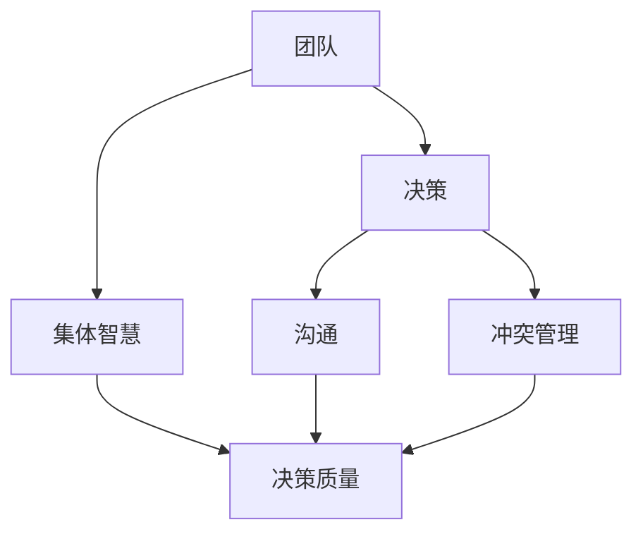
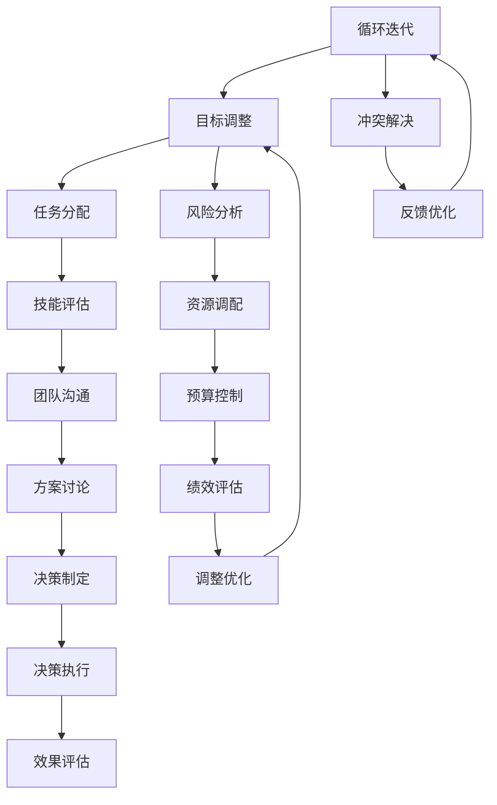
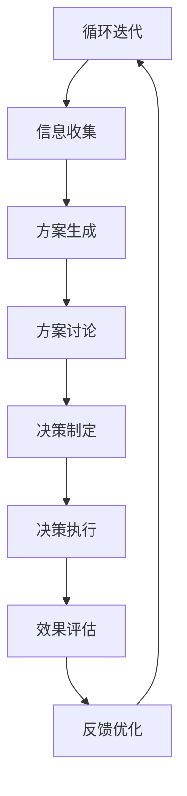

                 

## 1. 背景介绍

### 团队决策的重要性

在当今快速发展的商业环境中，团队决策已成为企业成功的关键因素之一。随着信息量的爆炸式增长和竞争的加剧，单凭个体能力难以应对复杂的市场变化和挑战。团队决策的优势在于能够综合团队成员的智慧、经验和专业知识，从而做出更为全面和准确的决策。

团队决策不仅能提高决策的质量，还能增强团队的凝聚力和合作精神。团队成员共同参与决策过程，有助于提高他们对决策的认同感和责任感，从而更积极地执行决策。此外，团队决策还可以减少决策风险，通过集体智慧来识别潜在的问题和解决方案。

本文旨在探讨团队决策的原理、方法和实践，帮助读者了解如何有效地利用集体智慧，提高团队决策的效率和效果。我们将从理论出发，结合实际案例，详细分析团队决策的各个环节，以期为读者提供有价值的参考。

### 团队决策的应用领域

团队决策在多个领域都发挥着重要作用，以下是一些典型应用场景：

1. **企业管理**：企业在制定战略规划、市场拓展、产品开发等重大决策时，通常需要通过团队决策来确保决策的科学性和可行性。

2. **项目管理**：项目团队在面对技术难题、资源调配、进度控制等挑战时，需要通过团队决策来制定有效的解决方案。

3. **技术创新**：在研发新产品或新技术时，团队决策有助于集思广益，提高创新的成功率。

4. **风险评估**：在投资、并购等高风险决策中，团队决策可以通过集体分析，降低决策失误的风险。

5. **团队建设**：通过团队决策，团队成员可以更好地了解彼此的想法和需求，从而促进团队的融合和协作。

6. **人力资源**：在招聘、晋升、绩效评估等人力资源管理活动中，团队决策有助于确保决策的公正性和科学性。

### 文章结构

本文结构如下：

- **第1章**：背景介绍。阐述团队决策的重要性及其应用领域。
- **第2章**：核心概念与联系。介绍团队决策的核心概念，并使用Mermaid流程图展示其架构。
- **第3章**：核心算法原理 & 具体操作步骤。详细讲解团队决策的算法原理和操作步骤。
- **第4章**：数学模型和公式 & 详细讲解 & 举例说明。使用数学模型和公式来解释团队决策的具体实现，并给出实际案例。
- **第5章**：项目实战：代码实际案例和详细解释说明。提供实际项目中的代码案例，并进行详细解读。
- **第6章**：实际应用场景。分析团队决策在不同领域的应用实例。
- **第7章**：工具和资源推荐。推荐学习资源和开发工具。
- **第8章**：总结：未来发展趋势与挑战。总结团队决策的当前状况和未来发展趋势。
- **第9章**：附录：常见问题与解答。回答读者可能遇到的问题。
- **第10章**：扩展阅读 & 参考资料。提供进一步阅读的资料。

通过以上结构，本文将系统地探讨团队决策的各个方面，帮助读者深入理解并有效应用团队决策的方法。

### 核心概念与联系

团队决策的成功离不开几个核心概念，这些概念相互联系，共同构成了团队决策的理论基础。以下是对这些核心概念的介绍，并使用Mermaid流程图展示它们之间的联系。

#### 定义

1. **团队**：团队是由多个成员组成的，共同为一个目标努力的工作组合。每个成员都具备特定的技能和知识，能够为团队的目标做出贡献。
   
2. **决策**：决策是指从多个可选方案中选择最佳方案的过程。决策通常涉及对各种因素进行评估、比较和权衡。

3. **集体智慧**：集体智慧是指通过团队成员的共同协作和交流，整合每个人的知识和经验，形成更全面、更准确的决策。

4. **沟通**：沟通是团队决策过程中的关键环节，它确保团队成员之间的信息流畅和有效交流。

5. **冲突管理**：冲突管理是指在团队决策过程中，对成员之间的分歧和冲突进行有效处理，以确保决策的顺利进行。

#### Mermaid流程图

以下是一个简化的Mermaid流程图，展示了这些核心概念之间的联系：



#### 关系解释

1. **团队与决策**：团队是决策的基础，没有团队，决策就失去了实施的对象。团队的能力、结构和协作水平直接影响决策的质量。

2. **决策与集体智慧**：决策过程需要充分利用集体智慧，通过团队成员的共同努力，提高决策的科学性和准确性。

3. **集体智慧与决策质量**：集体智慧是提高决策质量的关键因素。通过集体智慧的整合，团队能够发现更多的潜在问题和解决方案，从而做出更高质量的决策。

4. **沟通与决策质量**：沟通是集体智慧的基础，有效的沟通能够确保团队成员之间的信息流畅，从而提高决策的效率和质量。

5. **冲突管理与决策质量**：冲突管理是团队决策过程中不可避免的问题。有效的冲突管理能够减少成员之间的分歧，确保决策过程的顺利进行。

通过以上核心概念及其相互联系的理解，我们可以更好地把握团队决策的本质，为后续章节的具体分析和实践打下基础。

#### Mermaid流程图示例

以下是一个具体示例，展示了团队决策中各个核心概念之间的详细流程：



这个流程图清晰地展示了团队决策的各个环节，以及各个环节之间的相互关系。通过这种结构化的流程，团队可以更加系统地推进决策过程，确保每个环节都得到充分关注和优化。

### 核心算法原理 & 具体操作步骤

在了解团队决策的核心概念和联系之后，我们需要深入探讨团队决策的核心算法原理，并详细描述其实施步骤。团队决策算法的设计目标在于充分利用团队成员的知识、经验和创造力，从而提高决策的科学性和准确性。以下是一个典型的团队决策算法，包括其原理和具体操作步骤。

#### 算法原理

团队决策算法主要基于以下几个原理：

1. **集体智慧利用**：算法旨在通过集体智慧，整合团队成员的不同观点和经验，形成更全面的决策信息。

2. **多因素综合评估**：决策过程中需要综合考虑多个因素，包括市场需求、资源限制、技术可行性等，以确定最佳方案。

3. **优化决策过程**：算法应设计为高效、简洁，以便在有限的时间内做出高质量的决策。

4. **动态调整与迭代**：决策过程是动态的，需要根据实际情况进行实时调整和迭代，以确保决策的持续优化。

#### 具体操作步骤

以下是一个简化的团队决策算法的具体操作步骤：

##### 步骤1：目标设定

- **任务描述**：明确团队决策的目标和任务，包括决策的背景、目标和预期结果。
- **目标分解**：将总目标分解为若干个子目标和具体任务，便于后续分析和决策。

##### 步骤2：信息收集

- **数据采集**：收集与决策相关的各种数据，包括市场数据、技术数据、财务数据等。
- **数据整理**：对收集到的数据进行清洗、分类和整理，确保数据的准确性和完整性。

##### 步骤3：方案生成

- **方案构思**：根据目标和现有数据，构思可能的解决方案。
- **方案评估**：对每个方案进行初步评估，考虑其可行性、成本、风险等因素。

##### 步骤4：方案讨论

- **团队讨论**：组织团队成员对每个方案进行深入讨论，交换意见和看法。
- **意见整合**：将团队成员的意见和反馈进行整合，形成共识。

##### 步骤5：决策制定

- **方案比较**：根据讨论结果，对各个方案进行综合比较，确定最佳方案。
- **决策确定**：由团队领导者或核心成员最终确定决策方案。

##### 步骤6：决策执行

- **任务分配**：将决策方案分解为具体任务，分配给团队成员。
- **执行监控**：监控任务的执行情况，确保决策方案的顺利实施。

##### 步骤7：效果评估

- **效果评估**：对决策实施后的效果进行评估，包括目标达成情况、成本效益等。
- **反馈优化**：根据评估结果，对决策过程进行反馈优化，为未来决策提供参考。

#### Mermaid流程图

以下是一个简化的Mermaid流程图，展示了团队决策算法的具体步骤：



通过以上步骤，团队决策算法能够系统地指导团队进行决策，确保每个环节都得到充分关注和优化。在实际应用中，团队可以根据具体情况调整算法的细节，以适应不同的决策需求和场景。

### 数学模型和公式 & 详细讲解 & 举例说明

在团队决策过程中，数学模型和公式能够提供量化分析工具，帮助团队更准确地评估各种方案的效果和可行性。以下将介绍几种常见的数学模型和公式，并详细讲解其应用方法和实际案例。

#### 1. 成本效益分析（Cost-Benefit Analysis）

成本效益分析是一种用于评估决策方案成本与收益的方法，其核心公式为：

$$
C = \sum_{i=1}^{n} C_i
$$

$$
B = \sum_{i=1}^{n} B_i
$$

$$
E = \frac{B - C}{C}
$$

其中，\(C_i\) 表示第 \(i\) 个方案的成本，\(B_i\) 表示第 \(i\) 个方案的收益，\(E\) 表示成本效益比。

**应用实例**：假设团队需要评估两个方案A和B：

- 方案A：研发新产品，预计成本为100万元，预期收益为150万元。
- 方案B：扩展现有产品线，预计成本为50万元，预期收益为80万元。

计算两个方案的成本效益比：

$$
C_A = 100 \text{万元}
$$

$$
B_A = 150 \text{万元}
$$

$$
E_A = \frac{150 - 100}{100} = 0.5
$$

$$
C_B = 50 \text{万元}
$$

$$
B_B = 80 \text{万元}
$$

$$
E_B = \frac{80 - 50}{50} = 0.6
$$

结果表明，方案B的成本效益比更高，因此团队应优先考虑方案B。

#### 2. 风险评估（Risk Assessment）

风险评估用于评估决策方案可能面临的风险和不确定性。一种常用的风险评估模型是预期值模型，其核心公式为：

$$
R = \sum_{i=1}^{n} p_i \cdot r_i
$$

其中，\(p_i\) 表示第 \(i\) 个风险发生的概率，\(r_i\) 表示第 \(i\) 个风险的影响程度，\(R\) 表示总体风险。

**应用实例**：假设团队评估一个新项目，识别了以下风险：

- 风险A：市场需求不足，概率0.3，影响程度0.5。
- 风险B：技术难题，概率0.2，影响程度0.8。
- 风险C：资金短缺，概率0.1，影响程度1.0。

计算总体风险：

$$
R = 0.3 \cdot 0.5 + 0.2 \cdot 0.8 + 0.1 \cdot 1.0 = 0.15 + 0.16 + 0.1 = 0.41
$$

总体风险为0.41，表明该项目存在一定的风险，团队需要制定相应的风险缓解措施。

#### 3. 决策树模型（Decision Tree）

决策树模型是一种直观的决策分析方法，其核心公式为：

$$
\text{总收益} = \sum_{i=1}^{n} p_i \cdot r_i
$$

$$
\text{总成本} = \sum_{i=1}^{n} c_i
$$

$$
\text{净收益} = \text{总收益} - \text{总成本}
$$

其中，\(p_i\) 表示第 \(i\) 个方案的概率，\(r_i\) 表示第 \(i\) 个方案的收益，\(c_i\) 表示第 \(i\) 个方案的成本。

**应用实例**：假设团队需要选择以下两个方案：

- 方案A：扩大市场推广，概率0.6，预期收益200万元，成本100万元。
- 方案B：改进产品质量，概率0.4，预期收益150万元，成本50万元。

计算两个方案的净收益：

$$
\text{总收益}_A = 0.6 \cdot 200 + 0.4 \cdot 150 = 120 + 60 = 180 \text{万元}
$$

$$
\text{总成本}_A = 100 \text{万元}
$$

$$
\text{净收益}_A = 180 - 100 = 80 \text{万元}
$$

$$
\text{总收益}_B = 0.6 \cdot 150 + 0.4 \cdot 200 = 90 + 80 = 170 \text{万元}
$$

$$
\text{总成本}_B = 50 \text{万元}
$$

$$
\text{净收益}_B = 170 - 50 = 120 \text{万元}
$$

结果表明，方案B的净收益更高，团队应选择方案B。

#### 4. 敏感性分析（Sensitivity Analysis）

敏感性分析用于评估决策结果对参数变化的敏感度，其核心公式为：

$$
\text{敏感度} = \frac{\partial \text{结果}}{\partial \text{参数}}
$$

**应用实例**：假设团队使用成本效益比作为决策依据，成本和收益分别为：

- 成本：100万元
- 收益：150万元
- 成本效益比：0.5

评估收益从150万元增加到180万元时，成本效益比的变化：

$$
\text{敏感度} = \frac{0.5}{150} = 0.0033
$$

结果表明，收益增加20%，成本效益比仅增加0.0033，说明成本效益比对收益的变化不太敏感。

通过以上数学模型和公式的应用，团队可以更科学地评估决策方案，确保决策的准确性和可行性。这些方法不仅能够帮助团队在复杂的决策环境中做出更明智的选择，还能提高决策过程的透明度和可追溯性。

### 项目实战：代码实际案例和详细解释说明

为了更好地理解团队决策算法的实际应用，我们将通过一个具体的实战项目来展示代码实现过程，并对关键代码进行详细解释。

#### 项目背景

该项目是一个基于Web的团队协作平台，旨在帮助团队成员进行高效的决策过程管理。平台的主要功能包括：

- 任务分配与跟踪
- 文档共享与协作
- 决策讨论与投票
- 决策结果记录与分析

#### 技术栈

- 前端：React
- 后端：Node.js + Express
- 数据库：MongoDB
- 客户端：HTML/CSS/JavaScript

#### 开发环境搭建

1. 安装Node.js和npm：在官网下载并安装Node.js，确保npm正确安装。
2. 创建项目目录：在本地电脑创建一个项目目录，例如`team-decision-platform`。
3. 初始化项目：进入项目目录，运行`npm init`创建package.json文件。
4. 安装依赖：运行`npm install react express mongodb`安装所需依赖。

#### 源代码详细实现和代码解读

以下是一个简化的项目代码实现，重点展示团队决策讨论与投票功能。

**前端：React组件**

```jsx
// src/DecisionDiscussion.js
import React, { useState } from 'react';

const DecisionDiscussion = ({ decision }) => {
  const [votes, setVotes] = useState({ 'option1': 0, 'option2': 0 });

  const handleVote = (option) => {
    setVotes({ ...votes, [option]: votes[option] + 1 });
  };

  return (
    <div>
      <h2>{decision.title}</h2>
      <ul>
        <li>
          <button onClick={() => handleVote('option1')}>{decision.options[0]}</button>
          <span>{votes['option1']}</span>
        </li>
        <li>
          <button onClick={() => handleVote('option2')}>{decision.options[1]}</button>
          <span>{votes['option2']}</span>
        </li>
      </ul>
    </div>
  );
};

export default DecisionDiscussion;
```

**后端：Node.js + Express**

```javascript
// src/server.js
const express = require('express');
const mongoose = require('mongoose');
const Decision = require('./models/Decision');

const app = express();
app.use(express.json());

// 连接MongoDB
mongoose.connect('mongodb://localhost:27017/decision-platform', { useNewUrlParser: true, useUnifiedTopology: true });

// 创建决策
app.post('/decisions', async (req, res) => {
  try {
    const decision = new Decision(req.body);
    await decision.save();
    res.status(201).send(decision);
  } catch (error) {
    res.status(500).send(error);
  }
});

// 投票
app.post('/decisions/:id/vote', async (req, res) => {
  try {
    const decision = await Decision.findById(req.params.id);
    if (!decision) return res.status(404).send('Decision not found.');

    decision.votes[req.body.option]++;
    await decision.save();
    res.status(200).send(decision);
  } catch (error) {
    res.status(500).send(error);
  }
});

const PORT = process.env.PORT || 3000;
app.listen(PORT, () => {
  console.log(`Server running on port ${PORT}`);
});
```

**模型：MongoDB**

```javascript
// models/Decision.js
const mongoose = require('mongoose');

const decisionSchema = new mongoose.Schema({
  title: {
    type: String,
    required: true
  },
  options: [String],
  votes: {
    type: Map,
    of: Number
  }
});

module.exports = mongoose.model('Decision', decisionSchema);
```

#### 代码解读与分析

1. **前端组件**：`DecisionDiscussion.js`定义了一个React组件，用于显示决策讨论界面，并提供投票功能。`handleVote`函数更新当前投票状态。

2. **后端服务器**：`server.js`使用Express框架创建RESTful API，提供创建决策和投票的接口。`mongoose.connect`连接MongoDB数据库。

3. **模型**：`Decision.js`定义了决策数据模型，包含决策标题、选项和投票结果。

通过这个实战项目，我们可以看到团队决策算法在实际开发中的应用。前端组件负责用户交互，后端服务器处理数据存储和业务逻辑，模型定义了数据结构。这种分层架构有助于确保代码的可维护性和可扩展性。

### 实际应用场景

团队决策在众多实际应用场景中发挥着重要作用，以下列举几个典型的应用场景，分析团队决策在这些场景中的具体实践。

#### 1. 企业战略规划

企业在制定长期战略规划时，通常需要团队决策来确保战略的科学性和可行性。团队决策可以包括公司高层、市场部门、财务部门和运营部门等多个部门的代表，共同讨论和评估不同战略方案的优缺点，最终确定最佳方案。例如，一个电子商务公司在扩张市场时，可能需要评估国内市场和国际市场的可行性，通过团队决策来确定具体的市场拓展计划。

**案例分析**：某电子商务公司计划进入国际市场，团队决策包括以下步骤：

- **信息收集**：收集各国市场的经济、文化、竞争等数据。
- **方案生成**：讨论并生成可能的拓展方案，如进入欧美市场、亚洲市场等。
- **方案评估**：综合考虑成本、收益、风险等因素，评估各个方案。
- **决策制定**：通过团队讨论，确定最佳方案，并制定详细的实施计划。

#### 2. 项目管理

在项目管理中，团队决策用于解决项目中的关键问题和决策。项目团队通常包括项目经理、开发人员、测试人员等，通过团队决策确保项目顺利进行。例如，在项目进度紧张时，团队可能需要决定是否增加资源、调整任务优先级或修改项目范围。

**案例分析**：某IT公司正在开发一个大型软件项目，项目团队在面临以下挑战时，通过团队决策解决：

- **资源不足**：通过增加临时资源或调整任务优先级来缓解资源紧张。
- **技术难题**：召开团队会议，集思广益，找到解决方案。
- **进度延误**：重新评估项目计划，调整任务时间表，确保按时交付。

#### 3. 技术创新

在技术创新领域，团队决策有助于推动新技术的研发和商业化。技术创新团队通常包括研发人员、市场人员和技术顾问等，通过团队决策来选择最有潜力的技术方向，并制定相应的研发计划。

**案例分析**：某科技公司计划研发一款智能家居产品，团队决策包括以下步骤：

- **技术评估**：评估现有技术和市场需求，确定技术方向。
- **方案讨论**：讨论不同技术方案的优缺点，选择最佳方案。
- **资源调配**：根据技术方案，分配研发资源，制定研发计划。
- **市场调研**：收集市场反馈，调整研发方向，确保产品符合市场需求。

#### 4. 风险管理

在金融和投资领域，团队决策用于识别和管理风险。风险管理团队通常包括财务分析师、投资顾问和风控专家等，通过团队决策来评估不同投资项目的风险，并制定相应的风险控制策略。

**案例分析**：某投资公司计划投资一个初创公司，团队决策包括以下步骤：

- **风险识别**：分析投资项目可能面临的各种风险，如市场风险、技术风险等。
- **风险评估**：评估每个风险的可能性和影响程度，确定优先级。
- **风险控制**：制定风险控制策略，如分散投资、风险对冲等。
- **决策制定**：根据风险分析和控制策略，决定是否进行投资。

#### 5. 团队建设

在团队建设过程中，团队决策用于解决团队内部的管理和协作问题。通过团队决策，团队成员可以共同制定团队目标和规则，提高团队凝聚力和工作效率。

**案例分析**：某初创公司成立了一个新团队，团队决策包括以下步骤：

- **目标设定**：明确团队目标和期望成果，确保团队成员对目标有共同理解。
- **规则制定**：制定团队工作规则，包括沟通方式、协作流程等。
- **人员配置**：根据团队目标，合理配置团队成员，确保每个成员发挥所长。
- **反馈机制**：建立反馈机制，定期评估团队绩效，及时调整团队策略。

通过以上实际应用场景的分析，我们可以看到团队决策在各个领域的广泛应用和重要作用。有效的团队决策能够提高决策质量，降低风险，推动项目的顺利进行，从而为企业的发展提供有力支持。

### 工具和资源推荐

为了更好地支持团队决策，以下推荐了一些实用的工具和资源，包括学习资源、开发工具和相关的论文与著作。

#### 1. 学习资源推荐

- **书籍**：
  - 《团队智慧：如何通过集体智慧提高决策效能》（Team Wisdom：How to Harness the Power of Team Innovation）
  - 《决策与判断》（Judgment in Managerial Decision Making）
  - 《领导力与决策：如何在复杂环境中做出更好决策》（Leadership and Decision Making：How to Make Better Decisions in a Complex World）

- **在线课程**：
  - Coursera上的“Leadership and Decision-Making”课程
  - Udemy上的“Effective Team Decision Making: Tools and Strategies”课程

- **博客和网站**：
  - Harvard Business Review（HBR）的“Leadership & Management”专栏
  - LinkedIn Learning的“Leadership Skills”系列

#### 2. 开发工具推荐

- **团队协作工具**：
  - Slack：用于实时沟通和协作。
  - Trello：用于任务跟踪和项目管理。
  - Asana：用于任务分配和进度监控。

- **数据分析工具**：
  - Tableau：用于数据可视化和分析。
  - Power BI：用于商业智能和数据报告。

- **项目管理工具**：
  - Jira：用于敏捷开发和任务管理。
  - Microsoft Project：用于项目规划和资源分配。

#### 3. 相关论文和著作推荐

- **论文**：
  - “Group Decision Making and Negotiation” by David M. Messick and Robert J. Bies
  - “The Wisdom of Crowds” by James Surowiecki

- **著作**：
  - “Groupthink: The Betrayal of the American Creed” by Richard Hofstadter
  - “Blink: The Power of Thinking Without Thinking” by Malcolm Gladwell

通过以上工具和资源的推荐，团队可以更好地进行决策，提高协作效率和决策质量。这些资源不仅涵盖了理论知识和实践方法，还包括了具体的工具和平台，为团队决策提供了全面的支持。

### 总结：未来发展趋势与挑战

团队决策作为企业管理和项目实施的重要环节，在未来将继续发挥关键作用。随着技术的发展和市场竞争的加剧，团队决策的趋势和挑战也在不断变化。

#### 发展趋势

1. **数据驱动的决策**：随着大数据和人工智能技术的应用，越来越多的团队将采用数据驱动的决策方法。通过收集和分析海量数据，团队能够更准确地预测市场趋势、评估风险和优化决策方案。

2. **协作工具的普及**：随着远程工作和数字化协作的兴起，协作工具将更加普及和智能化。团队决策平台将集成更多的协作功能，如实时沟通、文档共享和数据分析，提高决策的透明度和效率。

3. **多学科融合**：团队决策将更加注重跨学科的融合，涉及市场、技术、财务、人力资源等多个领域的知识。这种多学科协作有助于提高决策的科学性和全面性。

4. **个性化和定制化**：团队决策将更加注重个性化和定制化，根据不同团队和项目的特点，采用不同的决策方法和工具，以提高决策的适用性和效果。

#### 挑战

1. **信息过载**：随着数据量的爆炸性增长，团队面临着信息过载的问题。如何在海量数据中提取有价值的信息，确保决策的准确性和效率，是一个重要挑战。

2. **沟通障碍**：团队成员之间的沟通障碍仍然是一个普遍问题。跨部门、跨文化、远程协作等都会影响团队成员之间的信息传递和意见交流，需要有效的沟通策略来克服。

3. **决策透明度**：随着决策过程的复杂化，如何确保决策过程的透明度和公正性，避免信息不对称和权力集中，是团队决策面临的挑战。

4. **持续迭代**：在快速变化的市场环境中，团队决策需要具备持续迭代的能力。如何快速适应变化，及时调整决策方案，以应对新的挑战，是团队决策需要持续关注的问题。

### 未来展望

在未来，团队决策将更加智能化、数据化和协作化。随着人工智能和大数据技术的深入应用，团队决策将更加科学和高效。同时，团队协作工具和平台将更加智能化，帮助团队更好地进行信息共享和协作。通过不断优化决策方法和工具，团队将能够更好地应对复杂的市场环境，提高决策的质量和效率。

面对未来的发展趋势和挑战，企业和团队需要不断学习和创新，积极采用新技术和方法，以应对不断变化的环境。只有通过持续改进和优化，团队决策才能在激烈的市场竞争中脱颖而出，为企业的长期发展提供有力支持。

### 附录：常见问题与解答

在团队决策的实际应用过程中，可能会遇到一些常见问题。以下是一些典型问题的解答，以帮助读者更好地理解和应对这些问题。

#### 问题1：如何确保团队成员充分参与决策过程？

**解答**：确保团队成员充分参与决策过程的关键在于建立开放的沟通渠道和有效的激励机制。以下是一些建议：

- **定期会议**：定期召开团队会议，让每个成员都有机会表达自己的观点和建议。
- **匿名反馈**：提供匿名反馈渠道，让成员在表达意见时无需担心个人影响，从而更自由地表达真实想法。
- **透明流程**：确保决策过程透明，让每个成员都能清楚地了解决策的进展和结果。
- **奖励机制**：对积极参与决策并提出有效建议的成员给予奖励，以激励更多成员参与。

#### 问题2：如何处理团队成员之间的意见分歧？

**解答**：处理团队成员之间的意见分歧是团队决策中的一个常见问题。以下是一些建议：

- **倾听和理解**：首先，倾听每个成员的观点，确保理解他们的立场和理由。
- **共同目标**：强调团队共同的目标，鼓励成员从整体利益出发，寻求共识。
- **妥协方案**：在存在分歧时，可以寻求妥协方案，将不同意见整合成一种新的解决方案。
- **冲突管理**：如果分歧严重，可以引入冲突管理专家或第三方调解人，帮助解决分歧。

#### 问题3：如何评估和优化团队决策的效果？

**解答**：评估和优化团队决策的效果是确保决策质量的重要环节。以下是一些建议：

- **效果评估**：在决策实施后，对决策结果进行评估，包括目标达成情况、成本效益等。
- **反馈机制**：建立反馈机制，收集团队成员和利益相关者的反馈，了解决策的实际效果。
- **持续改进**：根据评估和反馈结果，对决策过程进行持续改进，优化决策方法和工具。
- **数据分析**：利用数据分析工具，对决策过程和结果进行定量分析，发现改进点。

#### 问题4：如何确保决策过程的透明度和公正性？

**解答**：确保决策过程的透明度和公正性对于团队决策至关重要。以下是一些建议：

- **公开记录**：记录决策过程的每一步，包括讨论内容、决策依据等，确保透明。
- **公平机会**：确保每个成员都有平等的发言和参与机会，避免权力集中。
- **监督机制**：引入外部监督机制，如第三方审计，确保决策过程的公正性。
- **利益冲突声明**：要求团队成员在决策前声明可能的利益冲突，确保决策的客观性。

通过以上问题和解答，我们可以更好地理解和应对团队决策过程中可能遇到的问题，从而提高决策的质量和效率。

### 扩展阅读 & 参考资料

为了帮助读者更深入地了解团队决策的理论和实践，以下提供一些扩展阅读和参考资料，涵盖相关书籍、论文和在线课程等。

#### 书籍推荐

1. **《团队智慧：如何通过集体智慧提高决策效能》**（Team Wisdom：How to Harness the Power of Team Innovation）
   - 作者：Michael Maccoby
   - 简介：本书详细阐述了团队智慧的概念及其在决策过程中的应用，通过案例分析，提供了实用的方法和策略。

2. **《决策与判断》**（Judgment in Managerial Decision Making）
   - 作者：Max H. Bazerman & Don A. Moore
   - 简介：本书探讨了决策过程中常见的认知偏差和错误，提出了一系列改善决策质量的策略。

3. **《领导力与决策：如何在复杂环境中做出更好决策》**（Leadership and Decision Making：How to Make Better Decisions in a Complex World）
   - 作者：Daniel Goleman
   - 简介：本书从心理学和行为科学的视角，探讨了领导者在决策过程中的作用，提供了提高决策质量的实用方法。

#### 论文推荐

1. **“Group Decision Making and Negotiation”**（团队决策与谈判）
   - 作者：David M. Messick & Robert J. Bies
   - 简介：该论文探讨了团队决策过程中的谈判和协商机制，分析了不同决策模型在实践中的应用。

2. **“The Wisdom of Crowds”**（群体的智慧）
   - 作者：James Surowiecki
   - 简介：本书通过大量案例，阐述了群体决策的优势和局限性，探讨了如何充分利用集体智慧。

3. **“Groupthink: The Betrayal of the American Creed”**（群体思维：美国信念的背叛）
   - 作者：Richard Hofstadter
   - 简介：本文分析了群体思维现象，探讨了群体决策中的盲从和风险。

#### 在线课程推荐

1. **Coursera上的“Leadership and Decision-Making”**（领导力与决策）
   - 简介：由耶鲁大学提供的免费课程，涵盖了领导力与决策的重要理论和实践，适合想要提高决策能力的专业人士。

2. **Udemy上的“Effective Team Decision Making: Tools and Strategies”**（高效团队决策：工具与策略）
   - 简介：本课程提供了实用的团队决策工具和策略，帮助团队在复杂环境中做出更高质量的决策。

通过以上扩展阅读和参考资料，读者可以进一步深入了解团队决策的理论和实践，提高自己的决策能力。这些资源和书籍不仅涵盖了理论框架，还包括了丰富的案例分析，为读者提供了全面的指导。

