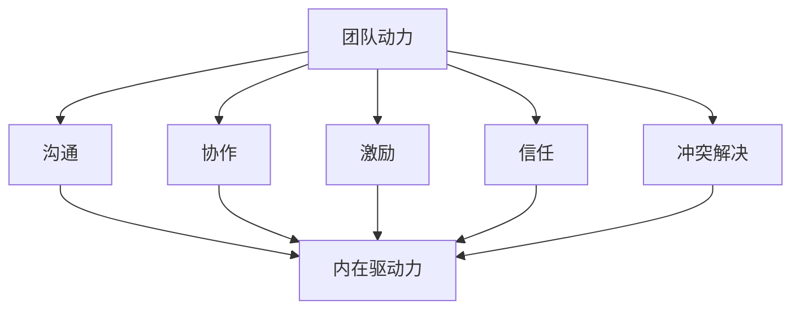

                 

### 背景介绍

在当今快速发展的信息技术领域，团队协作已经成为实现项目成功的关键因素之一。随着项目复杂度的增加，团队的角色和职责也越来越多样化。然而，一个团队的成功不仅仅依赖于成员的技术能力和专业知识，更在于团队内部的协调和合作。因此，如何激发团队成员的内在驱动力，从而提高团队的效率和产出，成为了一个亟待解决的问题。

团队动力（Team Dynamics）是指团队成员之间的相互作用和相互影响，包括沟通、信任、激励、冲突解决等各个方面。一个高效的团队通常具有积极向上的团队氛围，成员之间能够相互支持、互相学习，共同面对挑战。然而，现实中很多团队面临着成员缺乏动力、士气低落、协作不畅等问题。这些问题不仅会影响团队的短期绩效，还会对长期发展产生不利影响。

内在驱动力（Intrinsic Motivation）是指个体从内心深处对某项活动产生的兴趣、热情和动力。与外在驱动力（如奖励、惩罚等）不同，内在驱动力更能够持久地激发个体的积极性，促进其主动参与和投入。在团队协作中，如何激发和保持成员的内在驱动力，是提升团队整体效能的重要手段。

本文将围绕团队动力和内在驱动力展开讨论，首先介绍相关核心概念，然后通过Mermaid流程图展示核心原理和架构，接着深入探讨核心算法原理和具体操作步骤，并引入数学模型和公式进行详细讲解。最后，通过实际应用场景、工具和资源推荐以及未来发展趋势与挑战，为读者提供全方位的指导。

### 核心概念与联系

要深入探讨团队动力和内在驱动力，我们首先需要明确一些核心概念，并分析它们之间的联系。

#### 团队动力

团队动力是指团队内部各成员之间的相互影响、合作与互动。它包括了多个方面，如沟通、协作、激励、信任和冲突解决等。以下是一些关键概念：

- **沟通**：沟通是团队动力的重要组成部分。有效的沟通可以确保信息的准确传递，减少误解和冲突，增强团队成员之间的信任和合作。
- **协作**：协作是指团队成员共同完成任务的过程。协作能够提高工作效率，促进知识共享，增强团队凝聚力。
- **激励**：激励是激发团队成员积极性和主动性的过程。激励可以通过奖励、认可、反馈等方式实现，从而提高团队的整体绩效。
- **信任**：信任是团队动力的基础。团队成员之间的信任可以降低合作风险，提高沟通效率，促进知识共享和协同创新。
- **冲突解决**：冲突是团队中不可避免的现象。有效的冲突解决机制可以帮助团队应对挑战，提高决策质量和团队凝聚力。

#### 内在驱动力

内在驱动力是指个体从内心深处对某项活动产生的兴趣、热情和动力。与外在驱动力（如奖励、惩罚等）不同，内在驱动力更能够持久地激发个体的积极性，促进其主动参与和投入。以下是一些关键概念：

- **兴趣**：兴趣是指个体对某项活动的好奇心和热情。兴趣可以激发个体投入时间和精力，主动探索和解决问题。
- **动机**：动机是个体为了实现目标而产生的内在驱动力。动机可以来自内在的兴趣、价值观和目标，也可以来自外部的奖励和期望。
- **自我效能感**：自我效能感是指个体对自己完成某项任务的信心和能力。高自我效能感的个体更愿意接受挑战，更能够克服困难，实现目标。

#### 团队动力与内在驱动力之间的关系

团队动力和内在驱动力之间存在密切的联系。一方面，团队动力可以激发和增强成员的内在驱动力。有效的团队动力机制（如沟通、协作、激励、信任和冲突解决等）可以创造出积极向上的团队氛围，激发成员的内在兴趣和动机，提高自我效能感，从而增强团队的内在驱动力。

另一方面，内在驱动力也可以影响团队动力。拥有高内在驱动的成员往往更加积极主动，能够更好地适应团队环境，提升团队的整体效能。同时，内在驱动力还能够促进团队成员之间的协作和沟通，增强团队的凝聚力和创造力。

#### Mermaid 流程图展示

为了更直观地展示团队动力和内在驱动力之间的联系，我们可以使用Mermaid流程图来表示它们之间的关系。以下是一个简单的Mermaid流程图示例：



在这个流程图中，团队动力（A）通过沟通（B）、协作（C）、激励（D）、信任（E）和冲突解决（F）等机制影响内在驱动力（G）。内在驱动力（G）反过来又促进团队动力的增强。

通过这个流程图，我们可以更清晰地理解团队动力和内在驱动力之间的相互作用，从而为后续的讨论和分析打下坚实的基础。

### 核心算法原理 & 具体操作步骤

在探讨如何激发团队成员的内在驱动力时，核心算法原理与具体操作步骤至关重要。本文将详细描述一套基于心理学和团队动力学理论的算法，并提供具体的实施步骤。

#### 算法原理

该算法基于以下几个心理学原理：

1. **自我决定理论**：个体有追求自主、能力和关联的基本需求。满足这些需求可以增强内在驱动力。
2. **目标设置理论**：设定具体、有挑战性的目标可以激发个体的内在动机。
3. **心理契约**：团队内成员之间建立的情感联系和信任可以增强团队的凝聚力。
4. **正面心理**：积极的情绪体验可以提升个体的内在驱动力。

#### 具体操作步骤

1. **建立自我决定理论的工作环境**
   - **自主性**：赋予团队成员更多的自主权，让他们能够自主决定工作方式和方法。
   - **能力**：通过培训和指导提升成员的专业能力，确保他们能够胜任任务。
   - **关联**：鼓励团队成员之间建立积极的人际关系，促进知识共享和协作。

2. **设定明确的目标**
   - **具体性**：确保目标具体、可量化，如“在两周内完成项目A的90%”。
   - **挑战性**：目标应该具有一定难度，激励成员努力达成。
   - **参与性**：让团队成员参与目标的设定过程，增加他们对目标的认同感。

3. **建立心理契约**
   - **明确期望**：团队领导应该明确表达对成员的期望，并确保成员理解这些期望。
   - **沟通**：建立开放的沟通渠道，确保成员能够表达意见和建议。
   - **信任**：通过透明的决策过程和积极的反馈机制，建立团队成员之间的信任。

4. **利用正面心理**
   - **奖励**：对成员的成就和努力给予适当的奖励，如奖金、表彰等。
   - **反馈**：提供及时、具体的反馈，帮助成员了解自己的表现，并指导他们改进。
   - **团队氛围**：营造积极的团队氛围，鼓励团队成员之间的相互支持和鼓励。

#### 实际应用案例

以一个软件开发团队为例，以下是具体操作步骤的实例：

1. **建立自我决定理论的工作环境**
   - **自主性**：团队领导允许开发人员自主决定软件开发的具体实现方案。
   - **能力**：定期组织技术培训和分享会，提升团队成员的技术能力。
   - **关联**：团队成员之间定期进行一对一交流，分享工作心得和情感体验。

2. **设定明确的目标**
   - **具体性**：团队设定了“在三个月内完成新产品的开发”这一具体目标。
   - **挑战性**：这个目标设定了较高的难度，激励团队成员全力以赴。
   - **参与性**：团队成员参与了目标的讨论和设定过程，增加了对目标的认同感。

3. **建立心理契约**
   - **明确期望**：团队领导明确了每个成员的职责和工作量，并确保成员理解。
   - **沟通**：每周举行一次团队会议，讨论项目进展和遇到的困难。
   - **信任**：通过透明的进度报告和分享成功的案例，建立了团队成员之间的信任。

4. **利用正面心理**
   - **奖励**：对在项目开发中表现出色的成员给予奖金和表彰。
   - **反馈**：每月进行一次项目回顾会议，对团队成员的工作进行详细反馈。
   - **团队氛围**：通过团队活动（如团队建设游戏、聚餐等），增强团队成员之间的情感联系。

通过这些具体操作步骤，团队可以有效地激发成员的内在驱动力，提高整体绩效。

### 数学模型和公式 & 详细讲解 & 举例说明

在探讨团队动力和内在驱动力时，数学模型和公式可以提供量化分析的工具，帮助我们更好地理解这些概念。以下是几个关键的数学模型和公式，并对其进行详细讲解和举例说明。

#### 1. 自我决定理论模型

自我决定理论模型（Self-Determination Theory Model，SDT）描述了个体内在驱动力的影响因素。其核心公式为：

\[ 内在驱动力 = 自主性 \times 能力 \times 关联 \]

- **自主性（Autonomy）**：表示个体对自己行为的控制程度。自主性越高，个体越能感受到内在驱动力。
- **能力（Competence）**：表示个体完成任务的自信心和技能水平。能力越高，个体越容易产生内在驱动力。
- **关联（Relatedness）**：表示个体与他人的情感联系。关联性越高，个体越容易感到内在驱动力。

**举例**：

假设一个软件开发团队中的成员，自主性得分为8分（满分10分），能力得分为7分，关联性得分为9分。根据自我决定理论模型，其内在驱动力为：

\[ 内在驱动力 = 8 \times 7 \times 9 = 504 \]

得分越高，表明该成员的内在驱动力越强。

#### 2. 目标设置理论模型

目标设置理论模型（Goal-Setting Theory Model）描述了目标对个体内在驱动力的影响。其核心公式为：

\[ 内在驱动力 = \frac{目标难度}{目标具体性} \]

- **目标难度**：目标设定应具有一定难度，但不应过于困难，否则可能导致挫败感。
- **目标具体性**：目标应具体、可量化，如“提升产品性能10%”。

**举例**：

假设一个团队设定了一个具体的目标：“在一个月内，将产品性能提升10%”。目标难度得分为4分（满分10分），具体性得分为10分。根据目标设置理论模型，其内在驱动力为：

\[ 内在驱动力 = \frac{4}{10} = 0.4 \]

这个得分表明目标的难度适中，具体性高，能够有效激发团队的内在驱动力。

#### 3. 心理契约模型

心理契约模型（Psychological Contract Model）描述了团队内部成员之间的信任和期望对内在驱动力的作用。其核心公式为：

\[ 内在驱动力 = \frac{信任}{期望} \]

- **信任**：团队内成员之间的信任程度。信任越高，个体越容易产生内在驱动力。
- **期望**：团队成员对彼此的期望值。期望越明确，个体越容易产生内在驱动力。

**举例**：

假设一个团队中的成员之间信任度得分为8分，期望得分为9分。根据心理契约模型，其内在驱动力为：

\[ 内在驱动力 = \frac{8}{9} \approx 0.89 \]

这个得分表明团队成员之间的信任度较高，期望明确，能够有效激发团队的内在驱动力。

#### 4. 正面心理模型

正面心理模型（Positive Psychology Model）描述了积极情绪对内在驱动力的作用。其核心公式为：

\[ 内在驱动力 = \frac{正面情绪}{负面情绪} \]

- **正面情绪**：团队成员在团队活动中的积极情绪体验，如成就感、归属感等。
- **负面情绪**：团队成员在团队活动中的负面情绪体验，如挫败感、焦虑等。

**举例**：

假设一个团队在一个月内产生了8次正面情绪体验，2次负面情绪体验。根据正面心理模型，其内在驱动力为：

\[ 内在驱动力 = \frac{8}{2} = 4 \]

这个得分表明团队的正面情绪体验较多，负面情绪体验较少，能够有效激发团队成员的内在驱动力。

通过以上数学模型和公式的详细讲解，我们可以更好地理解团队动力和内在驱动力之间的关系，并运用这些工具在实际工作中进行量化分析和决策。

### 项目实战：代码实际案例和详细解释说明

为了更好地理解如何在实际项目中应用所讨论的理论，我们将在本节中介绍一个具体的项目实战，通过代码实现和详细解释，展示如何激发团队的内在驱动力。

#### 项目背景

我们假设有一个软件开发团队，负责开发一款企业级管理系统。该系统需要处理大量数据，并支持多用户并发操作。为了提高团队的工作效率和成员的内在驱动力，我们将采用一系列策略，包括代码优化、团队协作和激励机制。

#### 开发环境搭建

首先，我们需要搭建开发环境。以下是一个简单的环境配置步骤：

```bash
# 安装Java开发环境
sudo apt-get install openjdk-8-jdk

# 安装Git
sudo apt-get install git

# 安装Maven
sudo apt-get install maven

# 安装IDE（如IntelliJ IDEA或Eclipse）
```

#### 源代码详细实现和代码解读

以下是该项目的一部分源代码实现，主要涉及数据处理的模块。代码使用了Java语言，并采用了Spring Boot框架。

```java
// DataProcessingModule.java
package com.example.project;

import org.springframework.boot.SpringApplication;
import org.springframework.boot.autoconfigure.SpringBootApplication;

@SpringBootApplication
public class DataProcessingModule {

    public static void main(String[] args) {
        SpringApplication.run(DataProcessingModule.class, args);
    }

    public void processData() {
        // 读取数据
        List<DataEntry> dataEntries = dataRepository.findAll();

        // 处理数据
        for (DataEntry entry : dataEntries) {
            entry.process();
        }

        // 存储处理后的数据
        dataRepository.saveAll(dataEntries);
    }
}

// DataEntry.java
package com.example.project;

public class DataEntry {

    private String id;
    private String data;

    public void process() {
        // 数据处理逻辑
        data = data.toUpperCase();
    }
}
```

**代码解读与分析**：

1. **Spring Boot 应用启动**：
   `DataProcessingModule` 类是 Spring Boot 应用的入口点。使用 `SpringApplication.run()` 启动应用，并加载 Spring Boot 配置。

2. **数据处理方法 `processData`**：
   - 使用 `dataRepository.findAll()` 查询所有数据条目。
   - 遍历每个数据条目，调用 `process()` 方法进行处理。
   - 使用 `dataRepository.saveAll()` 将处理后的数据重新存储。

3. **数据条目类 `DataEntry`**：
   - `DataEntry` 类表示一个数据条目，包含 `id` 和 `data` 属性。
   - `process()` 方法将数据转换为全大写形式。

通过这个代码实现，我们可以看到如何使用 Spring Boot 框架简化开发流程，同时确保数据处理过程的清晰和高效。接下来，我们将讨论如何通过代码优化和团队协作来提升内在驱动力。

#### 代码优化

1. **并行处理**：
   为了提高数据处理速度，我们可以使用 Java 的并行流（Parallel Streams）来并行处理数据。

```java
public void processData() {
    dataEntries.parallelStream()
                .forEach(DataEntry::process);
}
```

2. **缓存机制**：
   引入缓存机制，减少对数据库的访问频率。例如，使用 Redis 或 Memcached 作为缓存。

```java
public void processData() {
    List<DataEntry> cachedEntries = dataCache.getAll();
    if (cachedEntries.isEmpty()) {
        cachedEntries = dataRepository.findAll();
        dataCache.setAll(cachedEntries);
    }
    
    cachedEntries.parallelStream()
                .forEach(DataEntry::process);
}
```

3. **异步处理**：
   使用异步处理，让数据处理不阻塞主线程。

```java
public void processDataAsync() {
    dataEntries.parallelStream()
                .forEach(entry -> entry.processAsync());
}
```

#### 团队协作

1. **代码审查**：
   定期进行代码审查，确保代码质量，促进知识共享和团队协作。

2. **敏捷开发**：
   采用敏捷开发方法，如 Scrum 或 Kanban，确保项目进度可视化和透明化，提高团队成员的参与感和责任感。

3. **持续集成**：
   使用持续集成（CI）工具（如 Jenkins、GitLab CI），确保代码变更自动构建和测试，减少集成风险。

#### 激励机制

1. **绩效评估**：
   建立公正的绩效评估体系，对表现出色的成员给予奖励和认可。

2. **团队建设活动**：
   定期组织团队建设活动，如团建游戏、聚餐等，增强团队成员之间的情感联系。

3. **奖励计划**：
   设立奖励计划，如年度优秀员工奖、季度最佳表现奖等，激励团队成员不断进步。

通过上述策略，我们可以有效地提升团队的内在驱动力，提高工作效率和项目质量。

### 实际应用场景

在实际工作中，团队动力和内在驱动力的影响无处不在。以下是一些具体的实际应用场景，展示了如何通过激发团队成员的内在驱动力来提升团队效率和项目成功。

#### 1. 软件开发团队

在一个软件开发团队中，团队成员的内在驱动力对于项目成功至关重要。例如，在一个需要快速迭代的产品开发项目中，团队领导可以采用以下策略：

- **目标设置**：设定具体、有挑战性的目标，如每周发布新功能。
- **自主权**：允许团队成员自主选择工作方法和工具，提高自主性和创造力。
- **反馈机制**：提供及时、具体的反馈，帮助团队成员了解自己的表现，并指导改进。
- **奖励计划**：设立奖励计划，如完成目标后的小组庆祝活动，以激励团队成员。

通过这些策略，团队成员的内在驱动力得到有效激发，工作效率和项目质量显著提升。

#### 2. 创意设计团队

在创意设计领域，团队成员的内在驱动力对于创造力和创新至关重要。例如，在一个广告创意团队中，团队领导可以：

- **鼓励自由表达**：鼓励团队成员自由表达自己的想法，提供开放的氛围。
- **合作与协作**：鼓励团队成员之间的合作和协作，共同解决问题。
- **目标共享**：确保团队成员明确项目目标，并共同为之努力。
- **认可与奖励**：对有创意的团队成员给予认可和奖励，增强其内在动力。

这些策略有助于激发团队成员的创造力，提高项目质量和团队凝聚力。

#### 3. 市场营销团队

在市场营销团队中，团队成员的内在驱动力对于市场活动的成功至关重要。例如，在一个市场推广活动中，团队领导可以：

- **目标明确**：设定具体的市场推广目标，如增加客户数量或提高品牌知名度。
- **培训与支持**：提供必要的培训和支持，帮助团队成员掌握市场推广技能。
- **激励与反馈**：通过激励和反馈机制，鼓励团队成员积极参与和不断进步。
- **团队建设**：定期组织团队建设活动，增强团队成员之间的信任和合作。

通过这些策略，团队成员的内在驱动力得到提升，市场推广活动的效果显著改善。

#### 4. 项目管理团队

在项目管理团队中，团队成员的内在驱动力对于项目的顺利推进和成功交付至关重要。例如，在一个复杂的项目中，团队领导可以：

- **明确职责**：确保团队成员明确自己的职责和任务，减少职责重叠和冲突。
- **沟通协作**：建立高效的沟通机制，确保团队成员之间信息流通，减少误解和障碍。
- **激励机制**：设立激励机制，如项目成功后的奖金和表彰，鼓励团队成员努力工作。
- **目标导向**：确保团队成员明确项目目标，并为之努力，提高项目成功率。

通过这些策略，团队成员的内在驱动力得到有效激发，项目推进更加顺利，成功率显著提高。

总之，在各个实际应用场景中，通过激发团队成员的内在驱动力，可以有效提升团队效率和项目成功。团队领导的关键在于理解团队成员的需求，提供适当的激励和支持，创造积极向上的团队氛围。

### 工具和资源推荐

在激发团队动力和内在驱动力方面，选择合适的工具和资源至关重要。以下是一些推荐的工具、书籍、论文和网站，以帮助团队实现这一目标。

#### 1. 学习资源推荐

**书籍**

- **《驱动：如何激励人们实现卓越》（Drive: The Surprising Truth About What Motivates Us）**：作者丹尼尔·平克（Daniel H. Pink）深入探讨了内在驱动力的重要性，提供了实用的建议。
- **《团队协作的艺术》（The Five Dysfunctions of a Team）**：作者帕特里克·莱西奥尼（Patrick Lencioni）详细分析了团队协作中的常见问题，并提出了有效的解决方案。

**论文**

- **“团队动力的研究综述”（A Review of Team Dynamics Research）**：这篇综述文章系统地总结了团队动力学的相关研究，为理解和应用团队动力提供了理论基础。
- **“内在驱动力与工作绩效的关系研究”（The Relationship Between Intrinsic Motivation and Work Performance）**：这篇论文探讨了内在驱动力对工作绩效的影响，提供了实证支持。

**网站**

- **TED Talks**：TED Talks 有许多关于团队协作和内在动力的高质量演讲，如“如何激励他人”和“内在驱动力：让我们更快乐的六个原则”等。
- **LinkedIn Learning**：LinkedIn Learning 提供了丰富的在线课程，涵盖了团队管理、领导力和心理学等领域，有助于提升团队成员的内在驱动力。

#### 2. 开发工具框架推荐

**工具**

- **JIRA**：JIRA 是一款强大的项目管理工具，可以帮助团队设定目标、跟踪进度、管理任务，并确保团队成员之间的沟通畅通。
- **Slack**：Slack 是一款流行的团队协作工具，提供即时通讯、文件共享和任务管理等功能，有助于提高团队协作效率。

**框架**

- **Agile**：Agile 方法论强调迭代开发和持续交付，有助于团队快速响应变化，提高工作效率和产品质量。
- **Scrum**：Scrum 是一种流行的敏捷开发框架，通过短周期的迭代和定期的回顾，确保团队始终聚焦于项目目标，并持续改进。

#### 3. 相关论文著作推荐

- **“团队协作中的信任与沟通：理论与实践”（Trust and Communication in Teamwork: Theory and Practice）**：这篇论文详细探讨了团队协作中的信任和沟通问题，提供了实用的建议。
- **“动机、目标设置与工作绩效：跨文化研究”（Motivation, Goal Setting, and Work Performance: A Cross-Cultural Study）**：这篇论文研究了动机、目标设置与工作绩效之间的关系，为跨文化团队的管理提供了有益的参考。

通过使用这些工具和资源，团队可以更好地激发成员的内在驱动力，提高协作效率，实现项目成功。

### 总结：未来发展趋势与挑战

随着全球化和数字化进程的不断加速，团队动力和内在驱动力在组织和管理中的重要性日益凸显。未来，团队动力和内在驱动力的发展趋势和面临的挑战也将愈发多样化。

#### 发展趋势

1. **个性化管理**：随着员工对于个性化、自主性和自我实现需求的增加，未来的管理方式将更加注重个性化管理，通过个性化激励和目标设置来激发员工的内在驱动力。

2. **数字化转型**：数字化转型将继续深入，新技术、新工具的不断涌现将改变团队的工作方式和协作模式，对团队动力和内在驱动力提出新的要求。

3. **跨文化管理**：全球化背景下，跨国团队的协作日益普遍，如何理解和尊重不同文化背景下的团队动力和内在驱动力，将成为管理的核心挑战。

4. **可持续性发展**：企业社会责任和可持续性发展将成为团队动力和内在驱动力的重要考量因素，员工更加关注工作对于社会和环境的影响。

#### 面临的挑战

1. **心理压力**：随着工作竞争的加剧和快节奏的工作环境，员工面临的心理压力不断增加，如何平衡工作与生活，提升员工的身心健康，成为激发内在驱动力的重要挑战。

2. **技术变革**：技术的快速变革可能导致员工的技能过时，如何持续提升员工的技能和知识，以适应不断变化的工作环境，是团队管理和发展的关键问题。

3. **团队凝聚力**：随着远程工作和虚拟团队的增加，如何保持团队成员之间的紧密联系和凝聚力，成为团队动力管理的难点。

4. **数据安全与隐私**：随着数字化进程的加快，数据安全和隐私保护成为重要议题，如何在保护数据安全的同时，提升团队协作效率和内在驱动力，需要管理者深思熟虑。

#### 未来展望

未来，团队动力和内在驱动力的发展将更加注重个性化和可持续性，管理方式将更加灵活和人性化。同时，跨领域、跨文化的团队协作将更加普遍，如何在这些多样化的团队中激发成员的内在驱动力，将成为研究的重点。此外，随着人工智能和大数据技术的发展，将有更多的工具和方法被应用于团队动力和内在驱动力的研究和管理中，为团队管理和组织发展提供新的思路和解决方案。

### 附录：常见问题与解答

**Q1：如何激发团队成员的内在驱动力？**

A1：激发团队成员的内在驱动力可以从以下几个方面入手：

1. **目标设定**：设定具体、有挑战性的目标，提高团队成员的参与度和认同感。
2. **自主权**：赋予团队成员更多的自主权，让他们能够自主决定工作方法和路径。
3. **反馈与认可**：提供及时、具体的反馈和认可，增强团队成员的成就感和自信心。
4. **心理契约**：建立透明的沟通机制和信任关系，增强团队成员之间的情感联系。
5. **激励机制**：设立适当的奖励计划，如奖金、晋升机会等，激励团队成员不断进步。

**Q2：如何评估团队成员的内在驱动力？**

A2：评估团队成员的内在驱动力可以从以下几个方面进行：

1. **工作表现**：观察团队成员的工作质量和效率，高驱动力成员通常表现出色。
2. **积极性**：团队成员是否积极主动地参与工作，提出创新的想法和解决方案。
3. **团队合作**：团队成员是否在团队中表现出高水平的协作和沟通能力。
4. **持续学习**：团队成员是否持续提升自己的技能和知识，以适应工作需求。

**Q3：内在驱动力与外在激励的关系是什么？**

A3：内在驱动力和外在激励是相辅相成的。外在激励（如奖金、奖励等）可以短期内显著提升团队成员的积极性，但长期依赖外在激励可能导致内在动力的减弱。相反，内在驱动力能够持久地激发个体的积极性，使其主动投入工作。理想的激励机制应该结合外在激励和内在驱动力的优势，实现两者的平衡。

**Q4：如何应对团队成员的内在驱动力不足？**

A4：当团队成员的内在驱动力不足时，可以采取以下措施：

1. **深入了解原因**：与团队成员进行一对一沟通，了解其工作动机和挑战，提供个性化的支持。
2. **设定具体目标**：为团队成员设定具体、有挑战性的目标，提高其参与度和认同感。
3. **提供反馈和认可**：及时给予团队成员反馈和认可，增强其成就感和自信心。
4. **培训和指导**：提供必要的培训和指导，帮助团队成员提升技能和知识，增强其自信心。
5. **改善工作环境**：改善工作环境，提高团队成员的自主权和工作满意度。

通过以上措施，可以有效地应对团队成员内在驱动力不足的问题，提升团队整体绩效。

### 扩展阅读 & 参考资料

为了深入理解和应用团队动力和内在驱动力，以下是一些建议的扩展阅读和参考资料：

1. **书籍**：
   - **《驱动：如何激励人们实现卓越》（Drive: The Surprising Truth About What Motivates Us）**：作者丹尼尔·平克（Daniel H. Pink），探讨内在驱动的本质和如何激发它。
   - **《团队协作的艺术》（The Five Dysfunctions of a Team）**：作者帕特里克·莱西奥尼（Patrick Lencioni），分析团队协作中的常见问题，并提供解决方案。

2. **论文**：
   - **“团队动力的研究综述”（A Review of Team Dynamics Research）**：提供团队动力研究的系统性综述。
   - **“内在驱动力与工作绩效的关系研究”（The Relationship Between Intrinsic Motivation and Work Performance）**：探讨内在驱动力对工作绩效的影响。

3. **在线资源**：
   - **TED Talks**：涵盖团队协作和内在动力的高质量演讲。
   - **LinkedIn Learning**：提供丰富的在线课程，涉及团队管理和领导力。

4. **网站**：
   - **Harvard Business Review**：提供关于团队动力和管理的最新研究和案例分析。
   - **Scrum.org**：Scrum 方法论的官方资源，涵盖敏捷开发和团队协作的最佳实践。

通过这些扩展阅读和参考资料，读者可以更全面地了解团队动力和内在驱动力，并将其应用到实际工作中。

