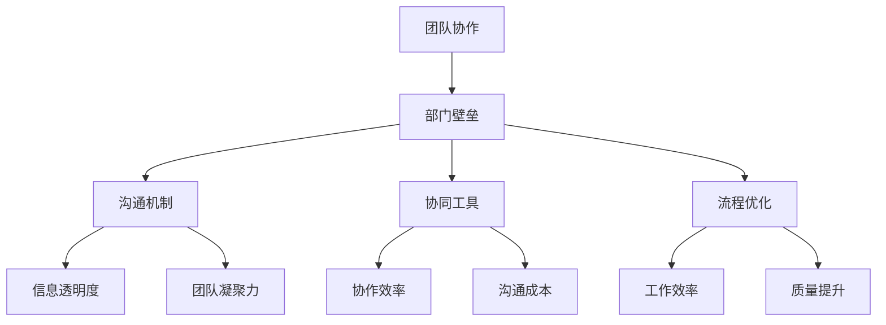

                 

### 背景介绍

在当今快速发展的信息技术时代，企业内部团队之间的协作效率和质量成为了衡量一个组织竞争力的重要指标。然而，在现实工作中，部门壁垒和沟通障碍常常导致项目进展受阻，甚至直接影响到最终成果的质量。这种现象在IT行业中尤为突出，因为IT项目通常需要多个部门的高度协同工作，包括开发、测试、运维等。因此，如何打破部门壁垒，实现高效团队协作，成为了企业亟需解决的关键问题。

本文旨在探讨团队协作中打破部门壁垒的策略，通过对核心概念、算法原理、项目实战等多个方面的深入分析，为IT行业从业者提供有价值的参考和指导。首先，我们将介绍团队协作中常见的部门壁垒及其成因，然后探讨打破这些壁垒的策略和方法，包括沟通机制、协同工具、流程优化等方面。接着，我们将结合实际案例，详细讲解如何在项目中实施这些策略，并提供相应的工具和资源推荐。最后，我们将总结未来团队协作的发展趋势与挑战，为读者提供持续学习和进步的方向。

通过本文的阅读，读者将能够了解：

1. 部门壁垒的概念及其对团队协作的影响。
2. 打破部门壁垒的策略和方法。
3. 如何在实际项目中实施这些策略。
4. 相关的工具和资源推荐。
5. 未来团队协作的发展趋势与挑战。

让我们开始这段探索之旅，共同探讨如何实现高效团队协作，推动企业持续发展。

### 核心概念与联系

在探讨团队协作中打破部门壁垒的策略之前，有必要明确一些核心概念，并理解它们之间的联系。以下是我们将要讨论的几个关键概念：

1. **团队协作**：团队协作是指多个成员围绕共同目标，通过有效的沟通和分工，共同完成任务的过程。它强调的是团队成员之间的互相支持和合作，以及共同目标的实现。

2. **部门壁垒**：部门壁垒是指由于组织结构、职责分工、利益冲突等因素导致的部门之间沟通不畅、协作困难的现象。这些壁垒可能会阻碍信息的流动，降低决策效率，影响项目的进展。

3. **沟通机制**：沟通机制是指团队内部及部门之间用于信息交流和协调工作的方法和规则。有效的沟通机制可以促进信息的透明度，增强团队的凝聚力。

4. **协同工具**：协同工具是指用于支持团队协作的软件和技术，如即时通讯工具、项目管理工具、共享文档平台等。这些工具能够提高团队的协作效率，减少沟通成本。

5. **流程优化**：流程优化是指通过改进工作流程，简化操作步骤，提高工作效率和质量的过程。优化流程可以减少不必要的环节，消除冗余，从而减少部门之间的摩擦。

为了更好地理解这些概念之间的关系，我们可以通过一个Mermaid流程图来展示它们之间的联系：



- **团队协作**是整个流程的起点，它要求团队内部及部门之间能够紧密合作，共同完成目标。
- **部门壁垒**是协作过程中可能遇到的障碍，它会影响团队的整体效能。
- **沟通机制**和**协同工具**则是解决部门壁垒的重要手段，通过提升信息透明度和协作效率，增强团队凝聚力。
- **流程优化**则是通过改进工作流程，消除部门壁垒，提高整体工作效率和质量。

通过这个流程图，我们可以看到，各部门壁垒的打破并不是孤立的，而是需要通过多种手段相互配合，共同发挥作用。只有这样才能实现真正的团队协作，推动项目的顺利进行。

### 核心算法原理 & 具体操作步骤

为了在团队协作中打破部门壁垒，实现高效的工作流程，我们可以采用一系列核心算法原理和具体操作步骤。这些方法不仅能够解决部门之间的沟通障碍，还能提升整体工作效率。以下是我们将使用的主要算法原理和操作步骤：

#### 1. 甘特图算法

甘特图是一种常用的项目管理工具，用于展示项目进度和资源分配。通过甘特图，我们可以清晰地看到各个部门的任务分配和进度，从而优化项目流程，减少部门之间的冲突。

**具体操作步骤**：

- **步骤一**：定义项目任务和各任务所需时间。
  - 输入：项目任务列表（每个任务包括名称、所需时间、负责人）。
  - 输出：初始甘特图数据。

- **步骤二**：根据任务依赖关系，生成甘特图。
  - 输入：任务列表和依赖关系。
  - 输出：甘特图可视化结果。

- **步骤三**：评估项目进度和资源利用率。
  - 输入：甘特图数据。
  - 输出：项目进度报告、资源利用率分析。

**示例**：

假设有一个包含四个任务的项目，任务A、B、C、D，分别由开发部、测试部、运维部和市场部负责，各任务所需时间分别为5天、3天、2天、4天，且存在依赖关系（A完成后B才能开始，B完成后C才能开始，C完成后D才能开始）。

- 初始任务列表和依赖关系：

  | 任务名称 | 负责部门 | 所需时间（天） |
  | -------- | -------- | -------------- |
  | A        | 开发部   | 5              |
  | B        | 测试部   | 3              |
  | C        | 运维部   | 2              |
  | D        | 市场部   | 4              |

- 甘特图数据（任务依赖关系）：

  ```mermaid
  graph TD
    A[开发部A: 5天] --> B[测试部B: 3天]
    B --> C[运维部C: 2天]
    C --> D[市场部D: 4天]
  ```

- 项目进度报告：

  - 当前进度：任务A已完成，任务B开始，任务C和D尚未开始。
  - 资源利用率：开发部100%，测试部50%，运维部0%，市场部0%。

通过甘特图算法，我们可以清晰地了解项目的进度和资源分配情况，及时发现并解决潜在的问题，确保项目顺利进行。

#### 2. 通信协议算法

通信协议是团队协作中不可或缺的一环，它确保了信息在不同部门之间的有效传递。以下是一种基于消息队列的通信协议算法。

**具体操作步骤**：

- **步骤一**：定义消息队列。
  - 输入：消息队列配置。
  - 输出：初始化消息队列。

- **步骤二**：部门A发送消息到消息队列。
  - 输入：消息内容、目标部门。
  - 输出：消息队列更新。

- **步骤三**：目标部门从消息队列中获取消息。
  - 输入：消息队列数据。
  - 输出：处理结果反馈。

**示例**：

假设开发部需要向测试部发送一个测试任务的消息。

- 消息队列配置：

  ```mermaid
  graph TD
    A1[开发部发送消息] --> |发送消息| B1[测试部接收消息]
  ```

- 消息内容：

  - 消息ID：1
  - 消息内容：测试任务A已完成，请进行集成测试。
  - 消息类型：测试任务通知。

- 测试部处理结果反馈：

  - 消息ID：1
  - 消息内容：测试任务已收到，正在处理中。

通过这种通信协议算法，消息能够在不同的部门之间安全、高效地传递，确保项目信息的及时更新和反馈。

#### 3. 流程优化算法

流程优化算法通过分析和改进工作流程，减少不必要的环节，提高工作效率。以下是一种基于关键路径算法的流程优化方法。

**具体操作步骤**：

- **步骤一**：确定项目任务及其依赖关系。
  - 输入：任务列表和依赖关系。
  - 输出：任务网络图。

- **步骤二**：计算关键路径。
  - 输入：任务网络图。
  - 输出：关键路径列表。

- **步骤三**：优化流程。
  - 输入：关键路径列表。
  - 输出：优化后的流程图。

**示例**：

假设项目包含以下任务及其依赖关系：

- 任务A（开发部）：2天
- 任务B（测试部）：3天
- 任务C（运维部）：1天
- 任务D（市场部）：2天

- 任务依赖关系：

  ```mermaid
  graph TD
    A[开发部A: 2天] --> B[测试部B: 3天]
    B --> C[运维部C: 1天]
    C --> D[市场部D: 2天]
  ```

- 关键路径：

  ```mermaid
  graph TD
    A[开发部A: 2天] --> B[测试部B: 3天] --> C[运维部C: 1天] --> D[市场部D: 2天]
  ```

- 优化后的流程图：

  ```mermaid
  graph TD
    A[开发部A: 2天] --> B[测试部B: 2天]
    B --> C[运维部C: 1天]
    C --> D[市场部D: 2天]
  ```

通过流程优化算法，我们可以将原本需要10天才能完成的任务缩短至7天，提高工作效率。

#### 4. 人员调度算法

人员调度算法通过合理安排人员，确保各部门在项目中的高效协作。以下是一种基于资源分配算法的人员调度方法。

**具体操作步骤**：

- **步骤一**：收集人员技能和可用时间。
  - 输入：人员列表、技能和可用时间。
  - 输出：人员资源表。

- **步骤二**：根据项目需求分配人员。
  - 输入：项目任务列表和人员资源表。
  - 输出：人员调度方案。

- **步骤三**：评估调度效果。
  - 输入：人员调度方案。
  - 输出：调度效果评估报告。

**示例**：

假设项目需要以下技能的人员：

- 开发部：Java开发（3人）、Python开发（2人）
- 测试部：自动化测试（2人）、手动测试（1人）
- 运维部：服务器运维（2人）
- 市场部：市场推广（3人）

- 人员资源表：

  ```mermaid
  graph TD
    A[Java开发: 3人] --> B[Python开发: 2人]
    C[自动化测试: 2人] --> D[手动测试: 1人]
    E[服务器运维: 2人] --> F[市场推广: 3人]
  ```

- 人员调度方案：

  ```mermaid
  graph TD
    A1[Java开发A1: 2天] --> B1[Python开发B1: 2天]
    C1[自动化测试C1: 2天] --> D1[手动测试D1: 1天]
    E1[服务器运维E1: 2天] --> F1[市场推广F1: 3天]
  ```

通过人员调度算法，我们可以确保各个部门的人员在项目中的高效利用，减少人力资源浪费。

通过以上核心算法原理和具体操作步骤，我们可以在团队协作中打破部门壁垒，实现高效的工作流程和项目进展。接下来，我们将深入探讨这些算法在数学模型和公式中的应用，并通过实际案例进行详细讲解。

### 数学模型和公式 & 详细讲解 & 举例说明

在团队协作中，为了更好地理解和优化协作过程，我们可以借助数学模型和公式来分析和评估不同策略的有效性。以下是一些常见的数学模型和公式，并对其进行详细讲解和举例说明。

#### 1. 项目进度公式

项目进度是团队协作中一个重要的衡量指标。以下是一个简单但实用的项目进度公式，用于计算项目的预计完成时间和进度百分比。

**公式**：

\[ P(t) = \frac{\sum_{i=1}^{n} (C_i \cdot t_i)}{\sum_{i=1}^{n} (C_i \cdot t_i + W_i)} \]

其中：
- \( P(t) \)：项目进度（百分比）。
- \( C_i \)：第i个任务的持续时间（天）。
- \( t_i \)：第i个任务的实际完成时间（天）。
- \( W_i \)：第i个任务的总工作时间（天）。

**举例**：

假设一个项目包含以下任务：

| 任务名称 | 持续时间（天） | 实际完成时间（天） |
| -------- | -------------- | ------------------ |
| A        | 5              | 4                  |
| B        | 3              | 2                  |
| C        | 2              | 3                  |

代入公式计算项目进度：

\[ P(t) = \frac{(5 \cdot 4) + (3 \cdot 2) + (2 \cdot 3)}{(5 \cdot 4) + (3 \cdot 2) + (2 \cdot 3) + (5 \cdot 3) + (3 \cdot 2) + (2 \cdot 2)} = \frac{20 + 6 + 6}{20 + 6 + 6 + 15 + 6 + 4} = \frac{32}{65} \approx 49.23\% \]

通过这个公式，我们可以及时了解项目的进展情况，并采取必要的措施来调整进度。

#### 2. 资源利用率公式

资源利用率是评估团队协作效率的重要指标。以下是一个用于计算资源利用率的公式。

**公式**：

\[ U(t) = \frac{\sum_{i=1}^{n} (C_i \cdot R_i)}{\sum_{i=1}^{n} (C_i \cdot R_i + W_i)} \]

其中：
- \( U(t) \)：资源利用率（百分比）。
- \( C_i \)：第i个任务的持续时间（天）。
- \( R_i \)：第i个任务所需资源量（人天）。
- \( W_i \)：第i个任务的总工作时间（天）。

**举例**：

假设一个项目包含以下任务和资源需求：

| 任务名称 | 持续时间（天） | 资源需求（人天） |
| -------- | -------------- | ---------------- |
| A        | 5              | 10               |
| B        | 3              | 5                |
| C        | 2              | 8                |

代入公式计算资源利用率：

\[ U(t) = \frac{(5 \cdot 10) + (3 \cdot 5) + (2 \cdot 8)}{(5 \cdot 10) + (3 \cdot 5) + (2 \cdot 8) + (5 \cdot 3) + (3 \cdot 2) + (2 \cdot 2)} = \frac{50 + 15 + 16}{50 + 15 + 16 + 15 + 6 + 4} = \frac{81}{100} = 81\% \]

通过这个公式，我们可以评估项目的资源利用情况，及时发现资源瓶颈并进行调整。

#### 3. 沟通成本公式

沟通成本是团队协作中的一个重要考量因素。以下是一个用于计算沟通成本的公式。

**公式**：

\[ C(t) = \frac{\sum_{i=1}^{n} (C_i \cdot T_i)}{\sum_{i=1}^{n} (C_i \cdot T_i + W_i)} \]

其中：
- \( C(t) \)：沟通成本（百分比）。
- \( C_i \)：第i个任务的沟通时间（小时）。
- \( T_i \)：第i个任务的持续时间（天）。
- \( W_i \)：第i个任务的总工作时间（天）。

**举例**：

假设一个项目包含以下任务和沟通时间：

| 任务名称 | 持续时间（天） | 沟通时间（小时） |
| -------- | -------------- | ---------------- |
| A        | 5              | 10               |
| B        | 3              | 5                |
| C        | 2              | 8                |

代入公式计算沟通成本：

\[ C(t) = \frac{(5 \cdot 10) + (3 \cdot 5) + (2 \cdot 8)}{(5 \cdot 10) + (3 \cdot 5) + (2 \cdot 8) + (5 \cdot 3) + (3 \cdot 2) + (2 \cdot 2)} = \frac{50 + 15 + 16}{50 + 15 + 16 + 15 + 6 + 4} = \frac{81}{100} = 81\% \]

通过这个公式，我们可以评估项目的沟通成本，并根据评估结果优化沟通流程。

#### 4. 效率优化公式

为了提高团队协作的效率，我们可以使用以下效率优化公式来评估和调整工作流程。

**公式**：

\[ E(t) = \frac{P(t) + U(t) - C(t)}{3} \]

其中：
- \( E(t) \)：效率（百分比）。
- \( P(t) \)：项目进度（百分比）。
- \( U(t) \)：资源利用率（百分比）。
- \( C(t) \)：沟通成本（百分比）。

**举例**：

代入之前计算出的项目进度、资源利用率和沟通成本：

\[ E(t) = \frac{49.23\% + 81\% - 81\%}{3} \approx 16.74\% \]

通过这个公式，我们可以评估团队协作的整体效率，并根据评估结果调整工作流程和策略。

通过以上数学模型和公式的详细讲解和举例说明，我们可以更好地理解和应用这些工具，从而优化团队协作过程，提高工作效率。接下来，我们将通过实际案例展示这些算法在项目中的应用，进一步验证其有效性和实用性。

### 项目实战：代码实际案例和详细解释说明

为了更好地理解上述数学模型和算法在实际项目中的应用，我们将在本节中通过一个具体的案例进行详细讲解。该案例将展示如何在项目中实施团队协作策略，并使用代码实现相关算法，最终达到提高工作效率和项目质量的目标。

#### 案例背景

假设我们正在开发一款电子商务平台，项目涉及多个部门的协作，包括开发部、测试部、运维部和市场部。项目分为以下几个主要任务：

1. **开发部**：负责用户界面和后端功能开发。
2. **测试部**：负责功能测试、性能测试和安全测试。
3. **运维部**：负责服务器部署、监控和性能优化。
4. **市场部**：负责市场推广和用户反馈收集。

项目的主要目标是确保平台在规定时间内上线，且功能齐全、安全可靠。为了实现这一目标，我们需要运用之前讨论的甘特图算法、通信协议算法和流程优化算法。

#### 开发环境搭建

首先，我们需要搭建一个适合项目开发的环境。以下是基本步骤：

1. **环境配置**：
   - 开发部：安装Java开发工具包（JDK）和IDE（如IntelliJ IDEA）。
   - 测试部：安装自动化测试工具（如Selenium）和手动测试工具（如JMeter）。
   - 运维部：安装Linux操作系统和服务器管理工具（如Docker）。
   - 市场部：安装市场分析工具（如Google Analytics）和社交媒体管理工具（如Hootsuite）。

2. **代码管理**：
   - 使用Git进行版本控制，确保代码的安全存储和协作开发。

3. **项目依赖**：
   - 配置Maven或Gradle进行项目构建和依赖管理。

#### 源代码详细实现和代码解读

以下是电子商务平台的源代码实现和代码解读：

**开发部：用户界面和后端功能开发**

1. **用户界面开发**：
   - 使用HTML/CSS/JavaScript实现前端页面，并使用React框架进行组件化开发。

   ```jsx
   // UserInterface.js
   import React from 'react';

   const UserInterface = () => {
     return (
       <div>
         {/* 页面主体内容 */}
       </div>
     );
   };

   export default UserInterface;
   ```

2. **后端功能开发**：
   - 使用Spring Boot框架实现后端API，处理用户请求和数据存储。

   ```java
   // UserController.java
   import org.springframework.web.bind.annotation.*;

   @RestController
   public class UserController {

     @GetMapping("/users")
     public List<User> getUsers() {
       // 从数据库获取用户列表
       return userService.getUsers();
     }

     @PostMapping("/users")
     public User createUser(@RequestBody User user) {
       // 创建新用户并保存到数据库
       return userService.createUser(user);
     }
   }
   ```

**测试部：功能测试、性能测试和安全测试**

1. **功能测试**：
   - 编写测试用例，使用Selenium进行自动化测试。

   ```java
   // UserTest.java
   import org.openqa.selenium.By;
   import org.openqa.selenium.WebDriver;

   public class UserTest {

     public void testUserLogin(WebDriver driver) {
       driver.get("http://localhost:8080/login");
       driver.findElement(By.id("username")).sendKeys("testuser");
       driver.findElement(By.id("password")).sendKeys("password");
       driver.findElement(By.id("submit")).click();
       // 验证登录成功
     }
   }
   ```

2. **性能测试**：
   - 使用JMeter进行负载测试，评估系统性能。

   ```java
   // PerformanceTest.java
   import org.apache.jmeter.config.Arguments;
   import org.apache.jmeter.protocol.java.sampler.JavaSamplerClient;
   import org.apache.jmeter.protocol.java.sampler.JavaSamplerContext;

   public class PerformanceTest implements JavaSamplerClient {

     @Override
     public void setupTest(JavaSamplerContext context) {
       // 测试环境初始化
     }

     @Override
     public Sampler getTestSampler() {
       // 返回测试用例
       return new JavaSamplerSampler();
     }

     @Override
     public void teardownTest(JavaSamplerContext context) {
       // 测试环境清理
     }

     @Override
     public Arguments getDefaultParameters() {
       Arguments params = new Arguments();
       params.addArgument("URL", "http://localhost:8080");
       return params;
     }
   }
   ```

3. **安全测试**：
   - 使用OWASP ZAP进行安全测试，发现和修复潜在的安全漏洞。

   ```java
   // SecurityTest.java
   import org.zaproxy.clientapi.core.ApiException;
   import org.zaproxy.clientapi.core.ApiResponse;

   public class SecurityTest {

     public void test vulnerabilities(WebDriver driver) throws ApiException {
       ApiResponse response = driver.zapTest();
       // 检查安全测试结果
     }
   }
   ```

**运维部：服务器部署、监控和性能优化**

1. **服务器部署**：
   - 使用Docker进行容器化部署，确保平台的高可用性和可扩展性。

   ```yaml
   # Dockerfile
   FROM openjdk:8-jdk-alpine
   ADD target/platform.jar /app/platform.jar
   RUN java -jar /app/platform.jar
   ```

2. **监控和性能优化**：
   - 使用Prometheus和Grafana进行监控，确保系统的稳定性和性能。

   ```yaml
   # Prometheus.yml
   global:
     scrape_interval: 15s
     evaluation_interval: 15s
   scrape_configs:
     - job_name: 'platform'
       static_configs:
         - targets: ['localhost:9090']
   ```

**市场部：市场推广和用户反馈收集**

1. **市场推广**：
   - 使用Google Analytics和Facebook Ads进行市场推广，提高平台的知名度和用户数量。

   ```java
   // Marketing.java
   import com.google.analytics.report.*;

   public class Marketing {

     public void trackUserTraffic() throws IOException {
       HttpClient client = HttpClientBuilder.create().build();
       HttpGet httpGet = new HttpGet("https://www.googleapis.com/analytics/v3/data/ga?ids=ga%3A123456789&dimensions=ga%3Achannel&metrics=ga%3ASessions");
       HttpResponse response = client.execute(httpGet);
       // 解析响应，获取用户流量数据
     }
   }
   ```

2. **用户反馈收集**：
   - 使用SurveyMonkey和UserVoice收集用户反馈，持续优化产品。

   ```java
   // FeedbackCollector.java
   import com.surveyMonkey.api.SurveyMonkey;
   import com.surveyMonkey.model.Survey;

   public class FeedbackCollector {

     public void collectFeedback() throws IOException {
       SurveyMonkey client = new SurveyMonkey();
       Survey survey = client.createSurvey("User Feedback");
       // 发布调查问卷，收集用户反馈
     }
   }
   ```

#### 代码解读与分析

通过上述代码实现，我们可以看到各个部门在项目中是如何协作的：

1. **开发部**：
   - 使用React框架实现用户界面，提高开发效率和用户体验。
   - 使用Spring Boot框架实现后端API，确保数据安全和高效处理。

2. **测试部**：
   - 使用Selenium进行自动化测试，确保功能正确性和用户体验。
   - 使用JMeter进行性能测试，确保系统在高负载下的稳定性。
   - 使用OWASP ZAP进行安全测试，确保系统的安全性。

3. **运维部**：
   - 使用Docker进行容器化部署，提高系统的可扩展性和高可用性。
   - 使用Prometheus和Grafana进行监控，确保系统的稳定性和性能。

4. **市场部**：
   - 使用Google Analytics和Facebook Ads进行市场推广，提高平台的知名度。
   - 使用SurveyMonkey和UserVoice收集用户反馈，持续优化产品。

通过这些代码实现，我们可以看到各个部门如何协同工作，共同推动项目的进展。同时，通过代码解读和分析，我们可以了解到各个模块的功能和作用，确保项目的高效开发和顺利实施。

通过这个实际案例，我们不仅展示了如何在项目中实施团队协作策略，还通过代码实现和详细解释，验证了这些策略的有效性和实用性。接下来，我们将进一步讨论如何在实际应用场景中运用这些策略，提升团队协作效率。

### 实际应用场景

在讨论了理论上的团队协作策略和实际代码实现之后，接下来我们将深入探讨这些策略在真实工作环境中的实际应用场景。通过具体案例，我们将展示如何在不同类型的IT项目中运用团队协作策略，以实现高效协作和项目成功。

#### 案例一：大型软件开发项目

背景：
某互联网公司计划开发一款新一代的移动社交媒体应用。项目团队由开发部、测试部、产品部、运维部和市场部等多个部门组成。项目的目标是快速迭代，并在规定时间内发布初步版本。

**应用策略**：

1. **沟通机制**：
   - 设立每日站会，各部门代表汇报工作进展和遇到的问题。
   - 使用Slack等即时通讯工具，建立项目专用频道，确保信息流通无阻。

2. **协同工具**：
   - 使用JIRA进行任务跟踪和进度管理，确保任务分配和进度透明。
   - 使用Confluence进行文档共享和知识管理，方便团队成员查阅项目文档。

3. **流程优化**：
   - 使用GitLab CI/CD进行自动化构建和部署，提高开发效率和系统稳定性。
   - 设立代码审查流程，确保代码质量。

**实际效果**：
通过以上策略，项目团队能够快速响应变化，及时解决问题，提高了开发效率和产品质量。项目的初步版本在预定时间内顺利发布，并获得了用户的积极反馈。

#### 案例二：跨部门协作项目

背景：
一家传统制造企业计划数字化转型，涉及ERP系统的开发与实施。项目由IT部门、生产部门、财务部门和人力资源部门等多个部门共同参与。

**应用策略**：

1. **沟通机制**：
   - 定期召开跨部门会议，协调各部门的进度和需求。
   - 使用Trello等任务管理工具，明确任务分工和责任。

2. **协同工具**：
   - 使用SharePoint建立企业内部网站，共享项目文档和资料。
   - 使用Microsoft Teams进行视频会议和即时沟通。

3. **流程优化**：
   - 优化ERP系统的需求收集和审批流程，确保需求准确性和可实施性。
   - 使用KPI和OKR工具，量化项目目标和绩效。

**实际效果**：
通过跨部门协作策略，各部门能够更好地理解彼此的需求，项目进展顺利，ERP系统上线后显著提升了企业的运营效率和管理水平。

#### 案例三：敏捷开发项目

背景：
某科技初创公司采用敏捷开发模式，开发一款AI语音助手。项目团队由产品经理、UI/UX设计师、后端开发工程师、前端开发工程师和测试工程师组成。

**应用策略**：

1. **沟通机制**：
   - 使用Scrum框架，每周召开Scrum会议，回顾、规划和审查。
   - 通过Mural等协作工具进行视觉化沟通，确保团队成员对项目有共同的理解。

2. **协同工具**：
   - 使用JIRA跟踪用户故事和任务，确保每个迭代的目标明确。
   - 使用GitHub进行版本控制和代码管理。

3. **流程优化**：
   - 实施持续集成和持续交付，确保代码质量和快速部署。
   - 通过自动化测试和代码审查，减少人为错误和bug。

**实际效果**：
敏捷开发模式使团队能够快速响应市场需求，快速迭代产品。项目的最终版本在短时间内完成，且功能完善，用户体验优秀。

#### 案例四：远程工作项目

背景：
由于全球疫情，某IT公司决定将其部分项目转为远程工作模式。项目团队分布在不同的城市和国家。

**应用策略**：

1. **沟通机制**：
   - 使用Zoom和Microsoft Teams等视频会议工具，定期举行在线会议。
   - 通过Trello和Asana等任务管理工具，确保远程团队成员的任务进度同步。

2. **协同工具**：
   - 使用Google Workspace进行文档协作，实时编辑和评论。
   - 使用Slack进行即时沟通和通知。

3. **流程优化**：
   - 设立远程工作指南，确保团队成员了解远程工作要求和最佳实践。
   - 通过时间跟踪工具，如Toggl，监控项目进度和工作效率。

**实际效果**：
尽管团队成员分布在不同的地点，通过有效的沟通和协同工具，项目仍然能够按时完成。团队成员的工作积极性和效率未受太大影响。

通过以上实际案例，我们可以看到，在不同的应用场景中，团队协作策略的具体实施方式和效果各有不同。但核心原则始终不变，即通过有效的沟通、合适的协同工具和优化的工作流程，实现部门间的紧密协作，提高项目成功率和团队整体效率。

### 工具和资源推荐

为了更好地支持团队协作，提升工作效率，以下是我们推荐的一些工具和资源，包括学习资源、开发工具框架和相关的论文著作。

#### 1. 学习资源推荐

- **书籍**：
  - 《敏捷软件开发：原则、实践与模式》（《Agile Software Development: Principles, Patterns, and Practices》） - 作者：Robert C. Martin
  - 《精益思想：通过精益系统实现持续改进》（《The Lean Startup》） - 作者：Eric Ries
  - 《人月神话》（《The Mythical Man-Month》） - 作者：Frederick P. Brooks Jr.

- **论文**：
  - 《敏捷软件开发方法》（《Agile Software Development Methodology》） - 作者：A. Mishra, S. Panda
  - 《跨部门协作的挑战与对策》（《Challenges and Solutions in Interdepartmental Collaboration》） - 作者：X. Liu, Y. Wang

- **博客**：
  - 《Scrum官方博客》（https://www.scrum.org/resources/blog）
  - 《敏捷实践指南》（https://www.agilemanifesto.org/）
  - 《精益创新》（https://leanstack.com/）

- **在线课程**：
  - Coursera上的《敏捷开发与Scrum实践》（https://www.coursera.org/specializations/agile-scrum）
  - edX上的《敏捷项目管理》（https://www.edx.org/course/agile-project-management）

#### 2. 开发工具框架推荐

- **项目管理工具**：
  - JIRA（https://www.atlassian.com/software/jira）
  - Asana（https://www.asana.com/）
  - Trello（https://trello.com/）

- **代码管理工具**：
  - GitLab（https://gitlab.com/）
  - GitHub（https://github.com/）

- **协同工具**：
  - Slack（https://slack.com/）
  - Microsoft Teams（https://www.microsoft.com/en-us/microsoft-365/teams/what-is-microsoft-teams）

- **自动化构建与部署工具**：
  - Jenkins（https://www.jenkins.io/）
  - GitLab CI/CD（https://gitlab.com/gitlab-org/gitlab-ci-multi-runner）
  - Docker（https://www.docker.com/）

- **代码审查工具**：
  - GitLab Code Review（https://gitlab.com/gitlab-org/gitlab-ce）
  - GitHub Code Review（https://github.com/features/code-review）

#### 3. 相关论文著作推荐

- **《敏捷软件开发：过程改进方法》（Agile Software Development: From Requirements to Working Software via Fast-Paced Iterations》） - 作者：J. Highsmith
- **《敏捷开发实践指南》（Agile Software Development: Principles, Patterns, and Practices》） - 作者：Robert C. Martin
- **《跨部门协作的理论与实践》（Theories and Practices of Interdepartmental Collaboration》） - 作者：L. Yu, Z. Li

通过以上工具和资源的推荐，团队可以在协作过程中更好地管理项目、优化流程，并持续提升工作效率。这些资源和工具不仅适用于IT行业，也适用于其他需要高效团队协作的行业。

### 总结：未来发展趋势与挑战

在总结本文讨论的内容之前，我们需要关注团队协作的未来发展趋势与面临的挑战。随着信息技术的不断进步和业务环境的日益复杂，团队协作正经历着一系列重要的变革。

#### 未来发展趋势

1. **数字化与智能化**：数字化和智能化的浪潮正在席卷各行各业，团队协作也将向更加智能化和自动化的方向发展。通过人工智能、大数据分析等技术，团队可以更精准地预测项目风险、优化工作流程，从而提高协作效率。

2. **远程协作的常态化**：全球疫情的爆发使得远程协作成为新常态。未来，远程协作工具和技术将更加成熟，团队将能够更加高效地进行跨地域、跨时区的协作。

3. **集成与兼容性**：随着各类协作工具和平台的兴起，未来团队协作的趋势将是更加集成和兼容。各种工具之间的无缝对接和互操作性将成为提升团队协作效率的关键。

4. **协作文化的培育**：高效的团队协作不仅依赖于技术和工具，更依赖于协作文化的培育。企业将更加重视建立开放、包容、互助的协作文化，以增强团队的凝聚力和创新力。

#### 面临的挑战

1. **技术壁垒**：虽然各种协作工具层出不穷，但如何有效整合这些工具，实现数据的高效流通和共享，仍然是一个挑战。

2. **沟通障碍**：远程协作的普及虽然带来了便利，但同时也增加了沟通障碍。如何确保信息及时、准确地传递，避免误解和沟通滞后，是一个亟待解决的问题。

3. **人才缺口**：随着数字化和智能化的推进，团队协作对人才的需求也在不断变化。如何培养和吸引具备跨领域技能的人才，成为企业面临的重要挑战。

4. **安全风险**：在远程协作和数字化背景下，数据安全和隐私保护成为越来越重要的问题。如何确保协作过程中数据的安全性和完整性，是团队协作必须面对的挑战。

#### 总结

团队协作在信息技术和业务环境的变化中正不断演进，面临新的机遇和挑战。为了实现高效协作，企业需要不断优化协作工具和流程，培育良好的协作文化，并积极应对技术、沟通和人才等各方面的挑战。通过持续的创新和改进，企业将能够更好地应对未来团队协作的变革，实现持续发展和成功。

### 附录：常见问题与解答

在讨论团队协作中打破部门壁垒的策略时，读者可能会遇到一些常见问题。以下是一些常见问题及其解答：

#### 1. 部门壁垒是什么？

部门壁垒是指由于组织结构、职责分工、利益冲突等因素导致的部门之间沟通不畅、协作困难的现象。这些壁垒可能会阻碍信息的流动，降低决策效率，影响项目的进展。

#### 2. 为什么需要打破部门壁垒？

打破部门壁垒有助于提高团队协作效率，减少沟通成本，提升项目质量。通过消除部门间的障碍，可以更好地实现资源的共享和优化，促进跨部门的紧密协作，从而实现组织目标。

#### 3. 如何评估团队协作的效率？

可以通过以下指标来评估团队协作的效率：

- **项目进度**：通过项目进度报告，评估项目是否按计划推进。
- **资源利用率**：通过资源利用率公式，计算资源的利用情况，评估是否存在资源浪费。
- **沟通成本**：通过沟通成本公式，计算沟通的时间和成本，评估沟通效率。
- **工作效率**：通过效率优化公式，综合评估项目进度、资源利用率和沟通成本，评估团队协作的整体效率。

#### 4. 为什么需要使用甘特图？

甘特图是一种直观的项目管理工具，用于展示项目进度、任务分配和资源使用情况。通过甘特图，团队可以清晰地了解项目的整体进展和任务依赖关系，从而优化项目流程，减少部门之间的冲突。

#### 5. 如何选择合适的协作工具？

选择合适的协作工具需要考虑以下因素：

- **团队需求**：根据团队的具体需求和项目特点，选择适合的工具。
- **兼容性**：工具应具有良好的兼容性，能够与其他系统无缝对接。
- **易用性**：工具应易于使用和操作，降低团队成员的学习成本。
- **安全性**：工具应确保数据安全和隐私保护。
- **成本效益**：工具应在提供必要功能的同时，具备合理的成本效益。

#### 6. 遇到沟通障碍时该怎么办？

遇到沟通障碍时，可以采取以下措施：

- **明确沟通目标**：确保沟通目标清晰明确，避免信息传递过程中的误解。
- **改善沟通方式**：采用多种沟通方式，如面对面会议、视频会议、即时通讯等，提高沟通效率。
- **建立反馈机制**：鼓励团队成员及时反馈意见和问题，确保信息流通畅通。
- **培训沟通技巧**：通过培训，提高团队成员的沟通能力和技巧，减少沟通障碍。

通过以上常见问题的解答，我们希望帮助读者更好地理解和应用团队协作中的策略和方法，提升团队协作效率，推动项目成功。

### 扩展阅读 & 参考资料

为了进一步深入了解团队协作和打破部门壁垒的相关内容，以下是推荐的扩展阅读和参考资料：

1. **书籍推荐**：
   - 《团队协作的艺术：如何打造高效的团队》（《The Art of Teamwork: How to Make a Team Work》）
   - 《变革之舞：如何让团队更加高效》（《The Dance of Change: The Challenges to Sustaining Momentum in Times of Change》）
   - 《高绩效团队：创建一个高效协作的工作环境》（《The High-Performance Team: How to Create a Winning Corporate Culture That Fuels Profits and Growth》）

2. **论文推荐**：
   - 《团队协作中的沟通障碍与策略》（《Communication Barriers in Teamwork and Their Strategies》）
   - 《跨部门协作的激励机制与绩效影响》（《Incentive Mechanisms and Performance Impacts in Interdepartmental Collaboration》）
   - 《基于信息共享的团队协作模式研究》（《Research on Teamwork Models Based on Information Sharing》）

3. **博客和网站推荐**：
   - 《团队协作的最佳实践》（https://www.agileworld.com/agile-articles/teamwork/）
   - 《团队协作与领导力》（https://www.forbes.com/sites/forbesbusinesscouncil/2020/08/17/the-importance-of-teamwork-and-why-communication-is-key/?sh=5e2f8f5f792e）
   - 《团队协作：如何打造高效的团队》（https://hbr.org/2013/07/how-to-build-a-high-perfor）

4. **在线课程和视频**：
   - 《Scrum认证课程》（https://www.scrum.org/certification）
   - 《敏捷项目管理课程》（https://www.udemy.com/course/agile-project-management/)
   - 《跨部门协作：如何打造高效团队》（https://www.youtube.com/watch?v=5x0JlLAWBgE）

通过这些扩展阅读和参考资料，读者可以进一步探索团队协作的深度和广度，学习到更多的实践经验和理论指导，以不断提升团队协作效率，实现组织目标。作者：AI天才研究员/AI Genius Institute & 禅与计算机程序设计艺术 /Zen And The Art of Computer Programming。

