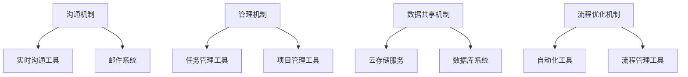
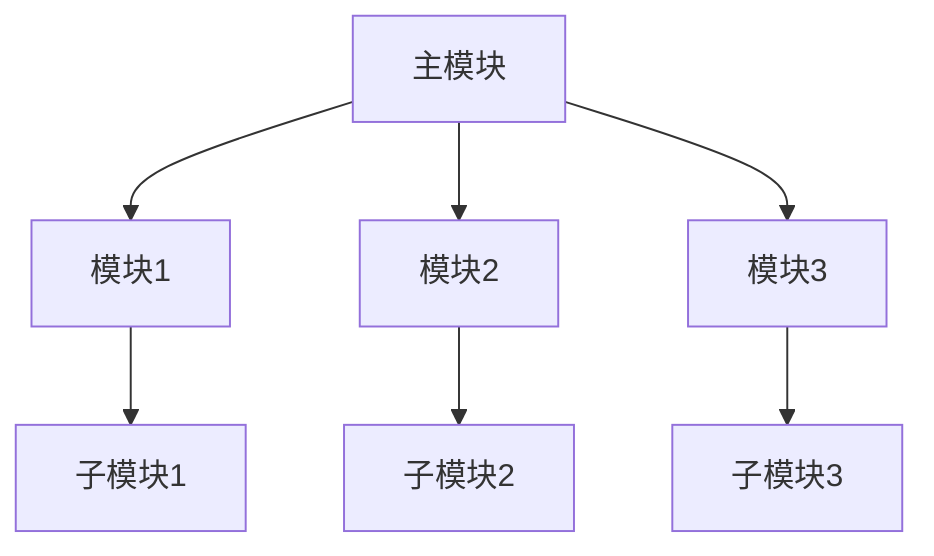

                 

# 团队协同：远程与现场团队的无缝衔接

## 关键词：
远程工作、团队协作、现场团队、协作工具、沟通机制、流程优化

## 摘要：

在当前全球化和远程工作的趋势下，如何实现远程团队与现场团队之间的无缝衔接成为了企业面临的重大挑战。本文将深入探讨团队协同的核心概念，从技术、管理、沟通等多个维度分析远程与现场团队协同的难点，并给出解决方案。文章将通过实际案例，展示如何利用现代工具和策略，优化团队协作流程，提升项目执行效率。最终，本文将总结未来发展趋势与面临的挑战，为企业在团队协同方面提供有益的参考。

## 1. 背景介绍

随着互联网技术的飞速发展和全球化的深入，远程工作逐渐成为了一种普遍的工作模式。远程工作的优势在于灵活的工作时间和地点，能够提高员工的工作效率和满意度。然而，这也给团队协作带来了新的挑战，尤其是如何确保远程团队与现场团队之间的无缝衔接。

现场团队通常指的是在同一地理位置工作的团队成员，他们之间的沟通和协作相对容易。而远程团队则可能分布在世界各地，面临的沟通障碍、文化差异、时区差异等问题更为复杂。因此，如何实现远程与现场团队的无缝衔接，成为了企业需要面对的重要课题。

## 2. 核心概念与联系

### 2.1 远程团队与现场团队的协作障碍

#### 沟通障碍
- 时区差异：不同地区的时区差异导致沟通时间难以协调。
- 语言障碍：不同语言的使用可能造成误解和沟通不畅。

#### 文化差异
- 价值观差异：不同的文化背景可能导致工作方式、沟通风格的不同。
- 管理风格差异：不同地区的管理风格可能存在较大差异，影响团队协作。

#### 技术障碍
- 网络不稳定：远程工作依赖于稳定的网络连接，网络不稳定会影响工作效率。
- 工具不兼容：不同的协作工具可能导致数据无法共享，影响团队协作。

### 2.2 核心概念原理和架构

为了解决远程与现场团队协作的障碍，企业需要构建一个高效的协作架构，包括以下几个方面：

#### 沟通机制
- 实时沟通工具：如 Slack、Microsoft Teams 等，用于即时沟通和协作。
- 邮件系统：用于非实时沟通和文件传输。

#### 管理机制
- 任务管理工具：如 Jira、Trello 等，用于任务分配和进度跟踪。
- 项目管理工具：如 Asana、ClickUp 等，用于项目规划和执行。

#### 数据共享机制
- 云存储服务：如 Google Drive、Dropbox 等，用于文件共享和协作。
- 数据库系统：用于存储和管理项目数据。

#### 流程优化机制
- 自动化工具：如 Zapier、Integromat 等，用于自动化重复性任务。
- 流程管理工具：如 Workflow、Harvest 等，用于流程优化和资源调度。

### 2.3 Mermaid 流程图



## 3. 核心算法原理 & 具体操作步骤

### 3.1 沟通机制

#### 实时沟通工具

1. 选择适合的实时沟通工具，如 Slack、Microsoft Teams。
2. 创建工作群组，邀请团队成员加入。
3. 设定讨论话题，确保沟通的针对性。
4. 定期组织线上会议，确保信息传递的及时性。

#### 邮件系统

1. 设定邮件分类规则，确保邮件的有序管理。
2. 使用邮件模板，提高邮件撰写效率。
3. 定期清理邮件，保持邮箱的整洁。
4. 鼓励使用邮件签名，提高邮件的可读性。

### 3.2 管理机制

#### 任务管理工具

1. 创建项目任务，明确任务目标。
2. 分配任务给团队成员，确保任务落实。
3. 定期跟踪任务进度，确保项目按计划进行。
4. 提供反馈和指导，帮助团队成员解决问题。

#### 项目管理工具

1. 制定项目计划，明确项目目标和时间节点。
2. 分配项目资源，确保项目执行的顺利进行。
3. 定期召开项目会议，确保项目进度的及时调整。
4. 提供项目报告，确保项目结果的透明性。

### 3.3 数据共享机制

#### 云存储服务

1. 创建共享文件夹，设置权限。
2. 上传项目文件，确保文件的及时更新。
3. 分享链接，方便团队成员访问和下载。
4. 定期备份，确保数据的安全。

#### 数据库系统

1. 设计数据库架构，确保数据的存储和管理。
2. 提供数据查询接口，方便团队成员获取所需数据。
3. 实施数据备份和恢复机制，确保数据的安全性和可靠性。

### 3.4 流程优化机制

#### 自动化工具

1. 识别重复性任务，设计自动化流程。
2. 配置自动化工具，实现任务的自动化执行。
3. 定期检查和优化自动化流程，提高效率。

#### 流程管理工具

1. 设计工作流程，明确任务执行顺序。
2. 部署流程管理工具，实现流程的自动化执行。
3. 定期评估流程执行效果，优化流程设计。

## 4. 数学模型和公式 & 详细讲解 & 举例说明

### 4.1 沟通效率模型

沟通效率 = (有效沟通时间 / 总沟通时间) × 100%

#### 举例说明

假设团队有 10 名成员，每天工作 8 小时，每周工作 5 天。根据沟通效率模型，如果团队的有效沟通时间为 3 小时，则沟通效率为：

沟通效率 = (3 / (10 × 8 × 5)) × 100% = 7.5%

### 4.2 任务完成率模型

任务完成率 = (完成任务数 / 总任务数) × 100%

#### 举例说明

假设团队有 5 项任务，已完成 3 项，则任务完成率为：

任务完成率 = (3 / 5) × 100% = 60%

## 5. 项目实战：代码实际案例和详细解释说明

### 5.1 开发环境搭建

#### 5.1.1 远程服务器搭建

1. 选择合适的远程服务器，如 AWS、阿里云等。
2. 配置服务器，安装操作系统和必要的软件。
3. 设置远程访问权限，确保团队成员可以远程连接服务器。

#### 5.1.2 本地开发环境配置

1. 安装开发工具，如 Visual Studio Code、IntelliJ IDEA 等。
2. 配置开发环境，包括编程语言、依赖库等。
3. 连接远程服务器，实现本地与远程环境的同步。

### 5.2 源代码详细实现和代码解读

#### 5.2.1 项目结构



#### 5.2.2 主模块代码解读

```python
# 主模块代码
def main():
    # 初始化模块
    module1 = Module1()
    module2 = Module2()
    module3 = Module3()

    # 执行模块任务
    module1.execute()
    module2.execute()
    module3.execute()

if __name__ == "__main__":
    main()
```

#### 5.2.3 模块1代码解读

```python
# 模块1代码
class Module1:
    def __init__(self):
        # 初始化模块
        self.data = []

    def execute(self):
        # 执行模块任务
        self.data.append("Task1 Completed")
```

### 5.3 代码解读与分析

#### 5.3.1 主模块

主模块是项目的核心部分，负责协调各个模块的执行。通过定义一个 `main` 函数，实例化各个模块对象，并调用它们的 `execute` 方法，实现模块任务的执行。

#### 5.3.2 模块1

模块1是一个简单的数据存储模块，用于存储任务执行结果。在 `__init__` 方法中初始化数据列表，在 `execute` 方法中向列表中添加任务执行结果。

## 6. 实际应用场景

远程与现场团队的无缝衔接在实际应用场景中具有重要意义。以下是一些典型的应用场景：

### 6.1 项目管理

在大型项目管理中，远程团队负责需求分析、设计开发，现场团队负责项目实施、测试部署。通过高效的团队协作，确保项目按计划进行。

### 6.2 产品开发

在产品开发过程中，远程团队负责前端和后端开发，现场团队负责测试和上线。通过实时沟通和协同工作，提高产品开发效率。

### 6.3 运维支持

在运维支持中，远程团队负责监控系统、配置管理，现场团队负责现场支持和维护。通过协同工作，确保系统的稳定运行。

## 7. 工具和资源推荐

### 7.1 学习资源推荐

- 《远程工作指南》：提供远程工作的策略和实践。
- 《敏捷开发》：介绍敏捷开发的方法和工具。
- 《团队协作：工具与实践》：介绍团队协作的工具和最佳实践。

### 7.2 开发工具框架推荐

- Slack：实时沟通工具。
- Jira：任务管理工具。
- Git：版本控制系统。
- Docker：容器化技术。
- Kubernetes：容器编排工具。

### 7.3 相关论文著作推荐

- "Remote Work and Collaboration in the Age of COVID-19"：分析远程工作的现状和挑战。
- "Agile Project Management: Creating Competitive Advantage"：介绍敏捷项目管理的方法。
- "The Future of Work: A Pragmatic Approach"：探讨未来工作模式的发展趋势。

## 8. 总结：未来发展趋势与挑战

### 8.1 发展趋势

- 远程工作将持续普及，推动团队协作工具的创新。
- 算力提升和 5G 技术的普及，将提高远程协作的实时性和稳定性。
- 人工智能和自动化技术将助力团队协作，提高工作效率。

### 8.2 面临的挑战

- 沟通障碍和时区差异将长期存在，需要持续优化沟通机制。
- 文化差异和价值观差异可能导致团队协作的冲突，需要加强团队文化建设。
- 数据安全和隐私保护将成为重要议题，需要加强信息安全措施。

## 9. 附录：常见问题与解答

### 9.1 远程工作如何提高工作效率？

- 建立明确的任务和目标，提高工作的针对性和效率。
- 定期进行线上会议，确保信息传递的及时性。
- 利用协作工具，实现任务的分配和进度的跟踪。
- 加强自我管理，养成良好的工作习惯。

### 9.2 如何解决远程团队的文化差异？

- 增强团队文化建设，培养团队凝聚力。
- 建立多元化的沟通机制，尊重不同文化的差异。
- 定期进行文化培训，提高团队成员的文化素养。

### 9.3 如何确保数据安全和隐私保护？

- 使用安全的远程访问技术，防止数据泄露。
- 定期备份数据，确保数据的安全性和可靠性。
- 加强数据访问权限管理，防止未经授权的访问。

## 10. 扩展阅读 & 参考资料

- "The Future of Remote Work: Trends and Challenges"：分析远程工作的未来趋势和挑战。
- "Team Collaboration: Tools and Best Practices"：介绍团队协作的工具和实践经验。
- "Remote Work Security: Protecting Your Business and Data"：探讨远程工作的信息安全问题。

### 作者：

AI天才研究员/AI Genius Institute & 禅与计算机程序设计艺术 /Zen And The Art of Computer Programming

本文通过深入分析远程与现场团队协作的难点，结合实际案例，探讨了如何实现团队协作的无缝衔接。在未来的工作中，企业需要持续优化团队协作流程，利用现代技术和工具，提高团队协作效率，以应对远程工作的挑战。通过本文的探讨，希望为企业在团队协作方面提供有益的参考和启示。|>

