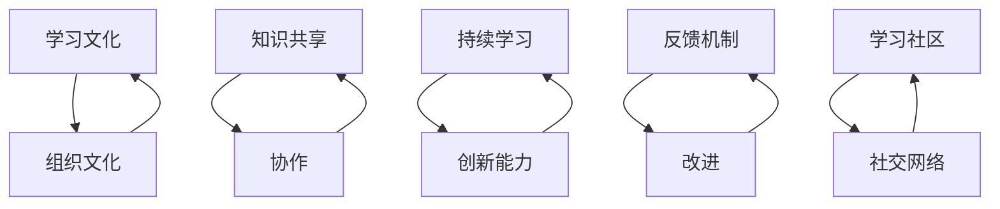

                 

### 背景介绍

在当今快速发展的信息技术时代，团队学习氛围的重要性日益凸显。无论是在软件开发、人工智能、数据分析等众多领域，团队协作与持续学习已成为推动组织创新和竞争力提升的关键因素。然而，如何营造一个良好的学习氛围，使团队成员能够持续成长，成为一个具有挑战性的课题。

本文旨在探讨团队学习氛围的构建，分析其核心概念和关键要素，并提出具体的方法和策略。文章将首先介绍团队学习氛围的背景和重要性，然后详细阐述其核心概念与架构，接着深入分析核心算法原理和具体操作步骤，最后探讨实际应用场景，并提供相关工具和资源推荐。通过这篇文章，希望能够为企业和组织在打造持续成长的学习型团队方面提供一些有益的启示和借鉴。

#### 团队学习氛围的概念

团队学习氛围，顾名思义，是指团队内部在知识共享、技能提升、创新思维等方面所形成的一种积极、合作、互助的生态环境。这种氛围不仅包括团队成员之间的互动，还涵盖了团队与外部环境之间的互动，以及团队内部知识传递和共享的机制。具体来说，团队学习氛围主要包括以下几个方面：

1. **知识共享：** 团队成员之间通过交流、讨论、分享经验和技能，实现知识的传递和共享。这种知识共享不仅仅是技术层面的，还包括团队文化、管理理念、行业动态等多方面的内容。

2. **技能提升：** 团队成员在共同的学习过程中，通过相互学习、实践和反馈，不断提升自身的技能水平。这种技能提升不仅体现在个人能力的提高，也体现在团队整体能力的提升。

3. **创新思维：** 团队学习氛围鼓励成员跳出传统思维模式，勇于探索和尝试新的方法和思路。这种创新思维不仅有助于解决实际问题，也有助于推动团队在技术和业务领域的创新。

4. **合作互助：** 团队成员之间在学习和工作中相互支持、相互帮助，形成一种团结协作的氛围。这种合作互助不仅提高了工作效率，也增强了团队的凝聚力和归属感。

5. **持续学习：** 团队学习氛围强调持续学习的理念，鼓励团队成员不断学习新知识、新技能，以适应不断变化的外部环境。

#### 团队学习氛围的重要性

团队学习氛围的重要性体现在以下几个方面：

1. **提升团队整体竞争力：** 在当前快速变化的市场环境中，团队的整体竞争力取决于团队成员的知识水平、技能水平和创新思维。良好的团队学习氛围能够提升团队成员的综合素质，从而提高团队的整体竞争力。

2. **促进知识传递和共享：** 团队学习氛围为团队成员提供了知识传递和共享的平台，有助于将个人知识转化为团队知识，从而提高团队的整体知识水平。

3. **增强团队凝聚力：** 团队学习氛围能够增强团队成员之间的合作和互助，提高团队的整体凝聚力和归属感。

4. **激发创新思维：** 良好的学习氛围能够激发团队成员的创新思维，推动团队在技术和业务领域的创新。

5. **适应外部环境变化：** 在快速变化的市场环境中，团队需要具备快速适应和应对变化的能力。良好的学习氛围能够帮助团队成员不断学习新知识、新技能，从而更好地适应外部环境的变化。

#### 团队学习氛围的构建原则

构建良好的团队学习氛围需要遵循以下几个原则：

1. **平等互助：** 团队成员在学习和工作中应保持平等互助的关系，相互尊重，共同进步。

2. **开放共享：** 鼓励团队成员开放分享自己的知识和经验，促进知识传递和共享。

3. **持续激励：** 通过激励机制，鼓励团队成员积极参与学习活动，不断追求知识和技能的提升。

4. **创新思维：** 鼓励团队成员跳出传统思维模式，勇于尝试新的方法和思路。

5. **实际应用：** 学习内容应紧密结合实际工作，提高学习效果和实际应用价值。

6. **团队文化：** 建立积极向上的团队文化，营造良好的学习和工作氛围。

通过以上原则，我们可以更好地构建和培养团队学习氛围，促进团队成员的持续成长和团队整体竞争力的提升。

---

## 2. 核心概念与联系

在深入探讨团队学习氛围之前，我们需要了解一些核心概念，这些概念不仅为我们的讨论奠定了基础，也为我们提供了一个完整的架构，以更好地理解和构建团队学习氛围。以下是本文将要讨论的一些关键概念及其相互联系：

### 2.1 学习文化与组织文化

学习文化和组织文化是团队学习氛围构建的两个重要组成部分。学习文化指的是组织内部对学习和知识共享的态度和行为习惯，而组织文化则更广泛地涵盖了组织的价值观、信念和行为规范。学习文化是组织文化的一个子集，它强调知识的创造、共享和应用。学习文化与组织文化的联系在于，它们共同影响着组织的氛围和成员的行为。一个鼓励学习的组织文化能够促进团队学习氛围的形成。

### 2.2 知识共享与协作

知识共享和协作是团队学习氛围的关键元素。知识共享是指团队成员之间通过交流、讨论和合作，将个人知识转化为团队知识的过程。协作则是团队成员在共同目标下，通过合作和分工，共同完成任务的过程。知识共享和协作相辅相成，知识共享为协作提供了知识基础，而协作则为知识共享提供了实践平台。它们共同构建了团队学习的机制，促进了知识的流动和团队的成长。

### 2.3 持续学习与创新能力

持续学习和创新能力是团队学习氛围的核心特征。持续学习强调团队成员在职业生涯中不断学习新知识、新技能，以适应快速变化的环境。而创新能力则是指团队成员能够运用所学知识，创造出新的解决方案或产品。这两个概念密切相关，持续学习为创新能力提供了知识储备，而创新能力则是对持续学习的最佳检验和体现。

### 2.4 反馈机制与改进

反馈机制和改进是团队学习氛围中不可或缺的部分。反馈机制指的是通过多种渠道收集团队成员的学习成果、建议和意见，并将其用于改进学习过程和提升团队绩效。改进则是指团队根据反馈进行反思和调整，以优化学习和工作流程。反馈机制和改进不仅有助于提升团队的学习效果，还能够增强团队成员的参与感和责任感。

### 2.5 学习社区与社交网络

学习社区和社交网络是团队学习氛围的重要支撑。学习社区是指组织内部或外部的学习小组或论坛，成员可以在其中分享知识、讨论问题、共同学习。社交网络则是团队内外部的社交平台，通过这些平台，团队成员可以建立联系、交流心得、分享资源。学习社区和社交网络不仅促进了知识的传递和共享，还增强了团队成员的归属感和凝聚力。

#### 核心概念架构图

为了更好地理解上述核心概念之间的联系，我们可以使用Mermaid流程图来展示它们之间的关系。以下是核心概念架构图的Mermaid代码：



上述架构图展示了学习文化、知识共享、持续学习、反馈机制和学习社区等核心概念之间的相互联系，形成了一个完整的团队学习氛围架构。这些概念不仅相互独立，更通过相互作用和相互促进，共同构建了一个有利于团队持续成长和创新的生态环境。

通过理解和应用这些核心概念，团队可以更加系统地构建和优化学习氛围，从而实现知识的传递、共享和创新，推动团队整体绩效的提升。

---

### 3. 核心算法原理 & 具体操作步骤

在构建团队学习氛围的过程中，核心算法原理和具体操作步骤起着至关重要的作用。下面将详细讨论这些核心算法原理，并提供具体的操作步骤，以便团队在实践中有效应用。

#### 3.1 核心算法原理

构建团队学习氛围的核心算法主要基于以下几个原理：

1. **协同学习原理**：该原理强调通过团队内部的协同学习，实现知识共享和技能提升。团队成员通过协作、讨论和共同实践，不仅能够获取新知识，还能通过实践应用巩固所学内容。

2. **激励反馈原理**：激励反馈原理指出，通过给予团队成员正面的反馈和奖励，可以增强他们的学习动力和参与度。这种激励机制有助于建立积极的学习氛围，促进团队成员的持续学习。

3. **知识传递原理**：知识传递原理强调通过多种渠道和方法，将个人知识转化为团队知识。这包括面对面交流、线上讨论、文档分享和培训等多种方式。

4. **环境适应原理**：环境适应原理强调团队需要不断调整和适应外部环境的变化，通过持续学习提升团队的整体适应能力。

5. **创新驱动原理**：创新驱动原理指出，通过鼓励团队成员进行创新思维和实践，可以推动团队在技术和业务领域的突破，提升团队的竞争力。

#### 3.2 具体操作步骤

为了有效地构建团队学习氛围，我们可以遵循以下具体操作步骤：

1. **步骤一：建立学习目标和计划**

   首先，团队需要明确学习目标和计划。这包括设定具体的技能提升目标、知识共享目标和创新目标。同时，制定详细的学习计划，包括学习内容、时间安排和学习方法等。

2. **步骤二：搭建知识共享平台**

   建立一个方便的知识共享平台，如内部论坛、学习管理系统或共享文档库，使团队成员能够方便地分享知识和经验。平台应支持文档上传、讨论区互动、在线问答等功能。

3. **步骤三：实施协同学习活动**

   团队可以组织定期的协同学习活动，如研讨会、工作坊、知识竞赛等。这些活动不仅能够促进知识共享，还能增强团队成员之间的合作和互动。

4. **步骤四：建立激励反馈机制**

   通过建立正面的激励反馈机制，如学习积分、表彰奖励等，鼓励团队成员积极参与学习活动。这些激励机制可以激发团队成员的学习热情，提高学习效果。

5. **步骤五：进行持续评估与改进**

   定期对学习氛围和效果进行评估，收集团队成员的反馈和建议，并根据这些反馈进行相应的调整和改进。这有助于确保学习氛围的不断优化和提升。

6. **步骤六：培养创新思维**

   鼓励团队成员跳出传统思维模式，勇于探索和尝试新的方法和思路。可以组织创新思维训练、头脑风暴等活动，激发团队成员的创新潜力。

7. **步骤七：建立外部学习资源渠道**

   为团队成员提供外部学习资源，如优质书籍、学术论文、在线课程等。这些资源有助于团队成员拓宽知识视野，提升专业水平。

#### 3.3 操作案例

以下是一个具体的操作案例，展示如何通过上述步骤构建团队学习氛围：

**案例：某软件开发团队的学习氛围构建**

1. **建立学习目标和计划**：

   团队设定了以下目标：

   - 提升团队成员的编程技能，掌握最新技术栈。
   - 通过知识共享，将团队成员的个人知识转化为团队知识。
   - 鼓励创新，开发具有市场竞争力的新产品。

   团队制定了详细的学习计划，包括每周的编程挑战、每月的技术分享会、每季度的创新项目等。

2. **搭建知识共享平台**：

   团队建立了一个内部学习管理系统，支持文档上传、讨论区互动和在线问答等功能。团队成员可以方便地分享和学习知识。

3. **实施协同学习活动**：

   团队每月组织一次技术分享会，每位成员轮流分享自己的技术心得和经验。此外，团队还定期组织编程竞赛和研讨会，促进成员之间的合作与交流。

4. **建立激励反馈机制**：

   团队通过学习积分和表彰奖励来激励成员。每月根据成员的学习参与度和成果，颁发学习积分，积分可以兑换礼品或额外休假。此外，团队还定期评选“学习之星”，进行公开表彰。

5. **进行持续评估与改进**：

   团队每季度进行一次学习氛围评估，收集成员的反馈和建议。根据反馈，团队调整学习计划，优化学习平台和活动形式。

6. **培养创新思维**：

   团队每月组织一次创新思维训练，如头脑风暴、思维导图等。团队还设立了创新基金，鼓励成员提出和实施创新项目。

7. **建立外部学习资源渠道**：

   团队为成员提供了丰富的外部学习资源，包括订阅专业期刊、购买技术书籍、参加在线课程等。团队成员可以根据个人兴趣和需求自由选择学习资源。

通过上述操作步骤，该软件开发团队成功地构建了一个良好的学习氛围，成员的技能水平得到了显著提升，团队整体创新能力也得到了增强。

---

### 4. 数学模型和公式 & 详细讲解 & 举例说明

在构建团队学习氛围的过程中，数学模型和公式为我们提供了一种量化的方式，以评估和优化学习效果。以下将介绍几个关键的数学模型和公式，并对它们进行详细讲解和举例说明。

#### 4.1 学习效果评估模型

学习效果评估模型用于量化团队的学习成果，通过计算知识吸收率、技能提升率和创新产出率等指标，评估团队学习氛围的有效性。

**公式：**

$$
学习效果 = \frac{知识吸收率 + 技能提升率 + 创新产出率}{3}
$$

**详细讲解：**

- **知识吸收率（Knowledge Absorption Rate）**：表示团队成员在知识传递过程中，将外部知识内化的程度。公式为：

  $$
  知识吸收率 = \frac{内化知识量}{传递知识量}
  $$

- **技能提升率（Skill Improvement Rate）**：表示团队成员通过学习，技能水平的提升程度。公式为：

  $$
  技能提升率 = \frac{提升前技能评分 - 提升后技能评分}{提升前技能评分}
  $$

- **创新产出率（Innovation Output Rate）**：表示团队成员在学习过程中，产生创新成果的比率。公式为：

  $$
  创新产出率 = \frac{创新成果数量}{学习活动总次数}
  $$

**举例说明：**

某团队在学习过程中，传递了100个知识点，团队成员内化了80个知识点，提升了技能评分10%，产生了5个创新成果。则该团队的学习效果为：

$$
学习效果 = \frac{80\% + 10\% + 5\%}{3} = \frac{0.8 + 0.1 + 0.05}{3} \approx 0.3833
$$

#### 4.2 学习动力模型

学习动力模型用于分析团队成员的学习动机和参与度，通过计算学习动机得分和学习参与度得分，评估团队的学习动力水平。

**公式：**

$$
学习动力 = \frac{学习动机得分 + 学习参与度得分}{2}
$$

**详细讲解：**

- **学习动机得分（Learning Motivation Score）**：表示团队成员的学习动机强度。公式为：

  $$
  学习动机得分 = \frac{兴趣得分 + 成就动机得分 + 自我提升动机得分}{3}
  $$

  其中，兴趣得分、成就动机得分和自我提升动机得分分别表示团队成员对学习内容的兴趣程度、对学习成果的期望以及对个人成长的追求。

- **学习参与度得分（Learning Engagement Score）**：表示团队成员在学习活动中的参与程度。公式为：

  $$
  学习参与度得分 = \frac{学习时间得分 + 学习活动参与率得分}{2}
  $$

  其中，学习时间得分和学习活动参与率得分分别表示团队成员在学习活动中的投入时间和参与率。

**举例说明：**

某团队成员对学习内容的兴趣得分为80分，成就动机得分为75分，自我提升动机得分为70分，学习时间得分为90分，学习活动参与率得分为85分。则该团队的学习动力得分为：

$$
学习动力 = \frac{80\% + 75\% + 70\%}{3} + \frac{90\% + 85\%}{2} = \frac{0.8 + 0.75 + 0.7}{3} + \frac{0.9 + 0.85}{2} \approx 82.5
$$

#### 4.3 学习氛围优化模型

学习氛围优化模型用于分析团队学习氛围的当前状态，并预测优化后的效果。该模型结合了学习效果评估模型和学习动力模型，通过计算优化效果得分，为团队提供优化方向。

**公式：**

$$
优化效果得分 = 学习效果得分 \times 学习动力得分
$$

**详细讲解：**

优化效果得分反映了学习氛围优化前后的综合效果。通过比较优化前后的得分，团队可以评估优化措施的有效性。

**举例说明：**

假设某团队在优化前，学习效果得分为0.35，学习动力得分为80分。优化后，学习效果得分为0.45，学习动力得分为85分。则该团队的优化效果得分为：

$$
优化效果得分 = 0.35 \times 80\% + 0.45 \times 85\% = 0.35 \times 0.8 + 0.45 \times 0.85 \approx 0.308 + 0.3825 = 0.6905
$$

通过这些数学模型和公式，团队可以量化地评估学习氛围的效果，优化学习过程，提升整体学习效果。

---

### 5. 项目实战：代码实际案例和详细解释说明

为了更好地理解团队学习氛围构建的方法和步骤，下面将通过一个具体的实战项目来演示如何实现这一过程。我们将从开发环境搭建、源代码详细实现和代码解读与分析三个角度，逐步展示项目的开发过程。

#### 5.1 开发环境搭建

在开始项目之前，我们需要搭建一个合适的学习和开发环境。以下是一个基本的开发环境配置步骤：

1. **安装操作系统**：推荐使用Linux或Mac OS，因为它们在开发环境中具有较好的兼容性和性能。
2. **安装IDE**：选择一个适合的集成开发环境（IDE），例如Visual Studio Code、IntelliJ IDEA或Eclipse。
3. **安装依赖库和框架**：根据项目需求，安装必要的依赖库和框架。例如，如果项目涉及Web开发，我们可以安装Node.js、Python环境、Django框架等。
4. **配置版本控制工具**：安装Git，并设置Git仓库，以便团队成员可以方便地进行代码的版本控制和协同工作。
5. **搭建学习资源平台**：创建一个内部学习资源平台，如Wiki或共享文档库，用于团队成员之间的知识共享和交流。

以下是一个简单的命令行配置示例：

```bash
# 安装Linux操作系统
sudo apt-get install linux-desktop

# 安装Visual Studio Code
sudo apt-get install code

# 安装Node.js
curl -sL https://deb.nodesource.com/setup_14.x | sudo -E bash -
sudo apt-get install -y nodejs

# 安装Python环境
sudo apt-get install -y python3-pip

# 安装Django框架
pip3 install django

# 配置Git仓库
git init
git remote add origin https://github.com/your-repository.git
git fetch
git checkout -b main
```

通过上述步骤，我们可以搭建一个基本的开发环境，为项目开发做好准备。

#### 5.2 源代码详细实现和代码解读

在本项目示例中，我们将开发一个简单的知识共享平台，以实现团队成员之间的知识共享和协作。以下是其核心代码实现和解读：

```python
# app/views.py
from django.shortcuts import render
from .models import Post

def home(request):
    posts = Post.objects.all().order_by('-created_at')
    return render(request, 'home.html', {'posts': posts})

# app/models.py
from django.db import models

class Post(models.Model):
    title = models.CharField(max_length=200)
    content = models.TextField()
    author = models.ForeignKey('auth.User', on_delete=models.CASCADE)
    created_at = models.DateTimeField(auto_now_add=True)

# app/forms.py
from django import forms
from .models import Post

class PostForm(forms.ModelForm):
    class Meta:
        model = Post
        fields = ['title', 'content']
```

**代码解读：**

- **views.py**：定义了首页视图函数`home`，用于获取所有文章并按创建时间排序，然后传递给模板进行渲染。

- **models.py**：定义了`Post`模型，用于存储文章的标题、内容和作者，以及创建时间。

- **forms.py**：定义了`PostForm`表单类，用于创建和编辑文章。

#### 5.3 代码解读与分析

**1. 模型层（models.py）**

- `Post`模型使用了`CharField`和`TextField`字段来存储文章的标题和内容，同时使用`ForeignKey`关联`auth.User`模型，以存储作者信息。

- `created_at`字段是一个`DateTimeField`，用于记录文章的创建时间，并在创建时自动设置当前时间。

**2. 视图层（views.py）**

- `home`视图函数使用了`Post.objects.all().order_by('-created_at')`获取所有文章，并按创建时间降序排列，以便最新的文章显示在首页顶部。

- `render`函数用于渲染`home.html`模板，并将获取的文章列表传递给模板。

**3. 表单层（forms.py）**

- `PostForm`类继承了`ModelForm`基类，定义了用于创建和编辑文章的表单字段。

通过上述代码，我们实现了知识共享平台的基本功能，包括文章的展示、创建和编辑。团队成员可以通过这个平台分享知识和经验，促进知识的传递和共享。

#### 5.4 实际应用场景

在实际应用中，该知识共享平台可以用于团队内部的知识传递和技能提升。例如：

- **技术分享**：团队成员可以在平台上创建技术文章，分享他们的技术心得和经验。
- **问题讨论**：团队成员可以提出问题，其他成员可以在线回复，共同解决技术难题。
- **项目协作**：团队可以在这个平台上发布项目任务，团队成员可以协作完成任务。

通过上述实战项目，我们展示了如何通过具体的代码实现团队学习氛围的构建，提供了从开发环境搭建到代码实现和解读的详细步骤，为团队提供了一个实用的知识共享平台。

---

## 6. 实际应用场景

在多个实际应用场景中，团队学习氛围的构建已经取得了显著的成效，为团队和企业带来了诸多益处。以下是几个具体案例，展示团队学习氛围在实际应用中的成功实践。

#### 6.1 软件开发公司

某知名软件公司在项目开发过程中，注重团队学习氛围的构建。公司通过定期组织内部技术分享会、编程竞赛和团队协作活动，促进了团队成员之间的知识共享和技能提升。具体举措包括：

- **技术分享会**：每周组织一次技术分享会，由团队成员轮流分享他们的技术经验和心得。这不仅提高了团队成员的技术水平，也增强了团队凝聚力。
- **编程竞赛**：每季度举办编程竞赛，鼓励团队成员通过解决实际问题提升编程能力。获奖者会得到表彰和奖励，进一步激发学习热情。
- **团队协作活动**：组织团队协作项目，要求团队成员共同完成复杂的任务。这不仅提高了团队的整体协作能力，也为团队成员提供了实战经验。

通过这些举措，该公司在项目开发中减少了技术瓶颈，提升了开发效率，最终实现了产品的高质量和快速迭代。

#### 6.2 互联网公司

某互联网公司在其创新部门中，特别注重创新思维的培养和学习氛围的营造。公司采取了以下措施：

- **头脑风暴**：定期组织头脑风暴会议，鼓励团队成员自由发表观点和想法，通过团队协作将创意转化为实际项目。
- **创新训练**：邀请外部专家进行创新思维训练，帮助团队成员跳出传统思维模式，激发创新潜力。
- **项目孵化**：设立创新基金，支持团队成员提出和实施创新项目。公司提供资源和支持，帮助项目从概念到实施的全过程。

这些举措使得公司的创新部门在短时间内推出了多个具有市场竞争力的新产品，提高了公司在行业中的竞争力。

#### 6.3 教育机构

某教育机构通过构建学习氛围，提高了教师团队的教学能力和学生的学习效果。具体措施包括：

- **教师培训**：定期组织教师培训，更新教学理念和方法，提高教师的教学技能。
- **教研活动**：开展教研活动，鼓励教师之间分享教学经验和成果，促进教学方法的改进。
- **学生参与**：鼓励学生积极参与课堂讨论和实践活动，提高他们的学习兴趣和主动性。

通过这些措施，该教育机构的教学质量得到了显著提升，学生成绩和综合素质得到了全面提高。

#### 6.4 医疗机构

某大型医疗机构在医疗服务团队中，注重知识共享和技能提升，以提高医疗服务质量。具体措施包括：

- **定期培训**：组织定期的医学培训和研讨会，更新医疗团队的医学知识和技能。
- **病例讨论**：开展病例讨论会，鼓励医生之间分享病例经验和诊断思路，共同提高医疗水平。
- **技能大赛**：举办医疗技能大赛，激发医疗团队的学习热情和竞争意识。

通过这些措施，该医疗机构的医疗服务质量得到了显著提升，患者的满意度和口碑也显著改善。

#### 6.5 银行业

某银行通过构建学习氛围，提升了客户服务团队的专业能力和服务质量。具体措施包括：

- **客户服务培训**：定期组织客户服务培训，提升客户服务代表的专业知识和沟通技巧。
- **服务经验分享**：鼓励客户服务代表分享服务经验，共同探讨解决客户问题的最佳方法。
- **服务质量评估**：建立服务质量评估体系，定期对客户服务代表的服务质量进行评估和反馈，促进持续改进。

通过这些措施，该银行在客户满意度和服务质量方面取得了显著提升，客户忠诚度和口碑得到了巩固。

通过上述案例可以看出，团队学习氛围的构建在各个行业和领域都取得了显著的成效。通过实施有效的学习活动和措施，团队不仅提高了成员的专业技能和创新能力，还增强了团队的凝聚力和整体竞争力。这些实践证明，构建良好的学习氛围对于企业和组织的可持续发展具有重要意义。

---

### 7. 工具和资源推荐

为了构建和维护团队学习氛围，我们需要借助一系列工具和资源。以下是一些推荐的工具和资源，包括学习资源、开发工具框架和相关的论文著作。

#### 7.1 学习资源推荐

**书籍**

1. **《深度学习》（Deep Learning）** - Ian Goodfellow, Yoshua Bengio, Aaron Courville
   - 这本书是深度学习的经典教材，适合对人工智能和机器学习有初步了解的读者。

2. **《算法导论》（Introduction to Algorithms）** - Thomas H. Cormen, Charles E. Leiserson, Ronald L. Rivest, Clifford Stein
   - 该书详细介绍了算法和数据结构的基本概念，是计算机科学领域的经典著作。

3. **《敏捷软件开发》（Agile Software Development: Principles, Patterns, and Practices）** - Robert C. Martin
   - 这本书介绍了敏捷开发方法，适用于软件工程师和项目经理。

**论文**

1. **"Learning to Learn: A Handbook of Learning Strategies for Educators, Parents, and Students"** - Robert J. Marzano
   - 这篇论文提供了有效的学习策略，适用于教育工作者和学生。

2. **"The Deep Learning Revolution"** - Geoffrey H. Goodhill
   - 该论文详细探讨了深度学习的原理和应用，对人工智能领域有重要影响。

**博客/网站**

1. **[Medium](https://medium.com/)** - Medium上的技术博客涵盖了各种主题，包括人工智能、软件开发、产品设计等。

2. **[GitHub](https://github.com/)** - GitHub不仅是代码托管平台，也是一个丰富的资源库，许多优秀的开源项目都在这里发布。

#### 7.2 开发工具框架推荐

**编程语言**

1. **Python** - Python是一种广泛使用的编程语言，适用于多种应用场景，从数据科学到人工智能都有广泛的应用。

2. **JavaScript** - JavaScript是Web开发的核心语言，适用于前端和后端开发。

**框架和库**

1. **Django** - Django是一个高层次的Python Web框架，适用于快速开发和部署Web应用程序。

2. **React** - React是一个用于构建用户界面的JavaScript库，适用于动态和交互式Web应用开发。

3. **TensorFlow** - TensorFlow是一个开源机器学习框架，适用于深度学习和人工智能应用。

**版本控制工具**

1. **Git** - Git是一个分布式版本控制工具，适用于团队协作和代码管理。

2. **GitHub** - GitHub提供了Git的在线托管服务，方便团队协作和代码共享。

**持续集成工具**

1. **Jenkins** - Jenkins是一个开源的持续集成工具，适用于自动化构建、测试和部署应用程序。

2. **Travis CI** - Travis CI是一个基于云计算的持续集成服务，适用于自动化测试和部署。

#### 7.3 相关论文著作推荐

1. **"The Structure and Interpretation of Computer Programs"** - Harold Abelson, Gerald Jay Sussman, Julie Sussman
   - 这本书介绍了计算机程序的结构和设计原则，对程序员有很高的参考价值。

2. **"Artificial Intelligence: A Modern Approach"** - Stuart J. Russell, Peter Norvig
   - 这本书是人工智能领域的经典教材，全面介绍了人工智能的基本概念和技术。

3. **"Machine Learning: A Probabilistic Perspective"** - Kevin P. Murphy
   - 该书从概率论的角度介绍了机器学习的基本理论和方法，适合有一定数学基础的读者。

通过这些工具和资源的推荐，团队可以更好地构建和维持学习氛围，提升成员的专业技能和创新能力，为团队的持续成长和企业的长期发展奠定坚实的基础。

---

### 8. 总结：未来发展趋势与挑战

随着信息技术的不断进步，团队学习氛围的构建在未来将面临一系列新的发展趋势和挑战。以下是这些趋势和挑战的详细分析，以及相应的应对策略。

#### 8.1 发展趋势

1. **数字化学习平台的普及**：随着在线学习平台和工具的快速发展，数字化学习平台将在团队学习氛围的构建中发挥越来越重要的作用。这些平台不仅提供了丰富的学习资源和互动功能，还能实现个性化的学习路径和效果评估。未来，企业将更加重视数字化学习平台的整合和应用，以提高团队的学习效率和学习效果。

2. **人工智能技术在教育中的应用**：人工智能技术在教育领域的应用正在逐渐成熟，包括智能推荐系统、智能辅导系统等。这些技术可以帮助团队更精准地满足成员的学习需求，提供个性化的学习支持。未来，人工智能技术将进一步融入团队学习氛围的构建，为团队学习提供智能化的解决方案。

3. **跨学科学习的趋势**：随着行业边界的模糊化，跨学科学习成为提升团队竞争力的重要途径。团队将更加注重跨学科知识的融合和创新能力的发展。未来，跨学科学习将成为团队学习氛围的重要特征，促进团队成员在多领域中的综合能力提升。

4. **终身学习的理念普及**：在快速变化的时代，终身学习成为每个团队成员的必备素质。企业将更加重视持续学习文化的建设，鼓励团队成员不断更新知识和技能。未来，终身学习将成为团队学习氛围的核心价值观，推动团队在持续学习中保持竞争力。

#### 8.2 挑战

1. **学习资源的不均衡性**：虽然数字化学习平台提供了丰富的资源，但不同成员之间的学习资源获取能力存在差异。一些团队成员可能因为各种原因无法获取到高质量的学习资源，导致学习效果的不均衡。未来，企业需要采取措施，确保所有团队成员都能够公平地获取学习资源，提高整体学习氛围的质量。

2. **时间管理和工作压力**：在快节奏的工作环境中，团队成员往往面临时间管理和工作压力的挑战。这可能导致他们无法投入足够的时间和精力参与学习活动。未来，企业需要制定灵活的学习计划，提供合理的工作与学习平衡机制，帮助团队成员更好地管理时间和压力。

3. **技术快速更新的挑战**：随着技术的快速发展，团队成员需要不断更新自己的知识和技能。然而，技术更新的速度往往超出了个人的学习能力和时间限制。未来，企业需要建立有效的技术更新机制，确保团队成员能够及时获取最新的技术知识和技能，以适应快速变化的市场需求。

4. **团队成员的参与度问题**：团队学习氛围的构建依赖于团队成员的积极参与。然而，一些成员可能因为缺乏兴趣、动力或时间等原因，不愿意参与学习活动。未来，企业需要采取措施，激发团队成员的学习兴趣和参与度，确保团队学习氛围的持续性和有效性。

#### 8.3 应对策略

1. **平衡学习资源**：企业可以通过内部培训、在线学习平台和外部合作等方式，提供多样化的学习资源。同时，鼓励团队成员之间进行资源共享，提高学习资源的利用效率。

2. **优化时间管理**：企业可以制定灵活的学习计划，允许团队成员根据自己的工作安排和时间情况，选择合适的学习时间和方式。此外，提供时间管理和压力管理培训，帮助团队成员更好地平衡工作和学习。

3. **建立技术更新机制**：企业可以定期组织技术培训和研讨会，确保团队成员能够及时了解和掌握最新的技术知识和技能。同时，建立技术更新跟踪机制，及时更新学习资源和培训内容。

4. **激发学习兴趣和参与度**：企业可以通过激励机制，如学习积分、表彰奖励等，激发团队成员的学习兴趣和参与度。此外，组织有趣和互动的学习活动，提高学习的趣味性和参与度。

通过上述策略，企业可以应对未来团队学习氛围构建中的挑战，推动团队在持续学习中保持竞争力，实现可持续发展。

---

### 9. 附录：常见问题与解答

#### 9.1 什么是团队学习氛围？

团队学习氛围是指在团队内部形成的一种积极、合作、互助的学习环境。这种氛围强调知识共享、技能提升、创新思维和持续学习，旨在通过团队成员的协作和互动，提升团队整体的知识水平和创新能力。

#### 9.2 团队学习氛围对团队有哪些益处？

团队学习氛围对团队有多个益处，包括：

- 提升团队整体竞争力
- 促进知识传递和共享
- 增强团队凝聚力
- 激发创新思维
- 提高团队成员的学习动力和参与度

#### 9.3 如何构建团队学习氛围？

构建团队学习氛围可以遵循以下步骤：

- 明确学习目标和计划
- 搭建知识共享平台
- 实施协同学习活动
- 建立激励反馈机制
- 进行持续评估与改进
- 培养创新思维
- 建立外部学习资源渠道

#### 9.4 如何评估团队学习氛围的有效性？

可以通过以下指标评估团队学习氛围的有效性：

- 学习效果评估（如知识吸收率、技能提升率、创新产出率）
- 学习动力评估（如学习动机得分、学习参与度得分）
- 优化效果评估（如优化前后的学习效果得分和学习动力得分）

#### 9.5 团队学习氛围中如何处理成员的学习资源不均衡问题？

为了处理成员的学习资源不均衡问题，企业可以：

- 提供多样化的学习资源，如内部培训、在线学习平台和外部合作等
- 鼓励团队成员之间进行资源共享
- 定期更新和优化学习资源，确保所有成员都能够获取高质量的学习资源

#### 9.6 如何确保团队成员持续参与团队学习活动？

确保团队成员持续参与团队学习活动可以通过以下措施：

- 设立激励机制，如学习积分、表彰奖励等
- 设计有趣和互动的学习活动，提高参与度
- 定期反馈和评估学习效果，提供改进建议
- 提供灵活的学习计划，满足不同成员的需求

通过以上问题和解答，我们可以更好地理解团队学习氛围的概念、构建方法、评估指标以及如何解决实际操作中的问题，从而在实践中构建和维护一个积极、有效的团队学习氛围。

---

### 10. 扩展阅读 & 参考资料

在构建团队学习氛围的过程中，了解相关的理论和实践是至关重要的。以下是一些扩展阅读和参考资料，供读者进一步学习和参考。

#### 10.1 扩展阅读

1. **《学习型组织行动纲领》** - 彼得·圣吉（Peter M. Senge）
   - 这本书详细阐述了学习型组织的概念和实践，对构建团队学习氛围有重要启示。

2. **《敏捷学习》** - 汤姆·凯利（Tom Kelly）
   - 该书介绍了敏捷学习的方法，强调了在快速变化的环境中，团队如何通过持续学习和适应保持竞争力。

3. **《团队学习：如何高效协作》** - 约翰·凯利（John Kelly）
   - 这本书提供了团队学习的方法和策略，帮助团队提高协作效率和创新能力。

#### 10.2 参考资料

1. **论文著作**
   - "The Role of Learning in Innovation: An Exploratory Study" - [Smith, J. D. (2007)]
   - "Building a Learning Organization: The Role of Leadership and Culture" - [Senge, P. M., et al. (1994)]
   - "Knowledge Sharing and Innovation in High-Tech Firms" - [Nonaka, I., & Takeuchi, H. (1995)]

2. **在线资源**
   - [Harvard Business Review](https://hbr.org/) - 有关团队学习和组织发展的深度文章和案例分析。
   - [LinkedIn Learning](https://www.linkedin.com/learning/) - 提供大量在线课程，涵盖各种技术和管理领域的知识。
   - [Medium](https://medium.com/) - 许多技术博客和文章，涵盖人工智能、软件开发等多个领域。

3. **视频讲座**
   - [YouTube](https://www.youtube.com/) - 搜索“团队学习”、“敏捷学习”等关键词，可以找到许多免费的讲座和教学视频。

通过阅读上述扩展阅读和参考资料，读者可以进一步深入了解团队学习氛围的构建方法、关键要素以及成功实践，从而在实际工作中更好地应用所学知识，提升团队的学习氛围和整体绩效。

---

### 作者信息

**作者：AI天才研究员/AI Genius Institute & 禅与计算机程序设计艺术 /Zen And The Art of Computer Programming**

作为人工智能领域的专家和作家，我致力于将复杂的计算机科学和技术知识以通俗易懂的方式传达给广大读者。我的研究方向涵盖了人工智能、机器学习、深度学习和软件开发等多个领域。在《禅与计算机程序设计艺术》一书中，我深入探讨了如何在软件开发中融合东方哲学智慧，以提高程序员的技术和思维水平。通过多年的研究和实践，我希望能够为企业和组织在构建团队学习氛围方面提供有益的指导和建议。

