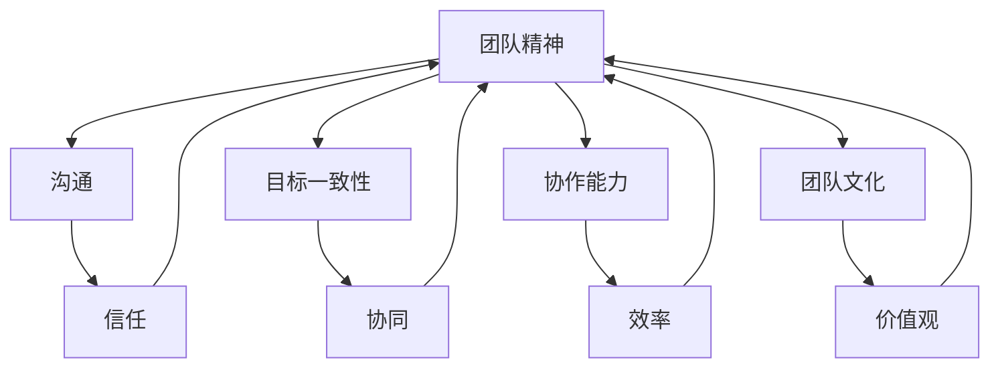

                 

### 背景介绍

#### 团队建设的重要性

在当今快速发展的信息技术领域，团队建设已经成为企业成功的关键因素。随着技术的发展和项目的复杂性增加，单打独斗已经无法满足现代IT项目的需求。团队协作和有效的团队建设对于提高工作效率、确保项目成功以及增强团队凝聚力至关重要。

团队建设不仅仅是为了提高工作绩效，更是为了建立一种良好的工作氛围和协作文化。一个拥有高度团队精神的团队，能够在面对挑战时更加团结一致，共同解决问题。团队成员之间良好的沟通和合作，有助于减少误解和冲突，提高决策质量，从而推动项目的顺利进行。

#### 团队建设的现状

然而，现实中许多团队在建设过程中面临诸多挑战。首先，团队成员之间的沟通不畅是一个常见问题。由于地理位置、时间差和文化差异，团队成员往往难以进行有效沟通。其次，团队成员的个人目标与团队目标之间存在不一致，导致个人动力和团队协作之间的矛盾。此外，团队成员的能力和技能差异也可能影响团队的整体表现。

针对这些问题，企业需要采取一系列措施来加强团队建设。有效的团队建设需要从多个方面入手，包括但不限于：提高团队沟通效率、明确团队目标、培养团队成员的协作精神和团队文化。

#### 团队建设的必要性

在信息技术行业，团队建设尤其重要。首先，IT项目通常涉及多个领域的技术，如前端开发、后端开发、数据分析和测试等。不同领域的技术专家需要紧密合作，以确保项目的完整性和高质量。其次，IT行业的快速变化要求团队具备快速适应和学习的能

### 核心概念与联系

为了更好地理解团队建设的重要性以及如何通过实践活动来培养团队精神，我们需要明确几个核心概念，并探讨它们之间的联系。以下是本文将要讨论的关键概念及其相互关系：

#### 1. 团队精神（Team Spirit）

团队精神是指团队成员之间相互信任、尊重、支持和合作的氛围。它是一种内在动力，能够促使团队成员为了共同的目标而努力。团队精神不仅体现在日常工作中，也体现在面对挑战和困难时的相互支持和协作。

#### 2. 沟通（Communication）

沟通是团队协作的基础。有效的沟通可以帮助团队成员理解彼此的需求和期望，减少误解和冲突，提高工作效率。良好的沟通包括倾听、表达清晰、及时反馈和寻求共识。

#### 3. 目标一致性（Alignment of Goals）

目标一致性是指团队成员个人目标和团队目标的统一。当团队成员的个人目标与团队目标一致时，能够产生协同效应，提高团队整体绩效。反之，个人目标与团队目标不一致时，可能会产生内耗，降低团队效率。

#### 4. 协作能力（Collaborative Skills）

协作能力是指团队成员在合作过程中展现出的技能和态度。包括分工合作、共同解决问题、承担责任和分享成果。协作能力越强，团队的凝聚力和工作效率越高。

#### 5. 团队文化（Team Culture）

团队文化是指团队在长期合作中形成的共同价值观和行为准则。健康的团队文化能够激励团队成员发挥最佳水平，培养团队精神，促进团队建设。

#### 6. 团队建设实践活动（Team Building Activities）

团队建设实践活动是指为了增强团队精神、提高团队绩效而设计的一系列有目的性的活动。这些活动可以是团队合作游戏、团队拓展训练、团队讨论会议等。

#### 核心概念之间的联系

上述核心概念之间存在着紧密的联系。团队精神是团队建设的目标，而沟通、目标一致性、协作能力和团队文化是实现这一目标的手段。沟通是团队精神的润滑剂，有助于建立信任和理解；目标一致性确保团队成员的方向一致，减少冲突；协作能力是团队精神的体现，能够高效解决问题；团队文化则是团队精神的土壤，为团队成员提供共同的价值观念和行为准则。

此外，团队建设实践活动作为具体的实现手段，可以通过一系列有目的性的活动来增强团队成员之间的联系，提高团队的整体协作能力。

为了更直观地展示这些概念之间的联系，我们可以使用Mermaid流程图来表示（注意：以下流程图中不要出现括号、逗号等特殊字符）：



通过上述核心概念的阐述和Mermaid流程图的展示，我们可以更加清晰地理解团队建设的重要性以及如何通过实践活动来培养团队精神。在接下来的章节中，我们将深入探讨这些概念，并给出具体操作步骤和实例。接下来，我们将详细讨论团队建设中的核心算法原理和具体操作步骤。


### 核心算法原理 & 具体操作步骤

在团队建设过程中，核心算法原理和具体操作步骤是确保团队建设和实践活动取得成功的关键。以下是一些常用的核心算法原理和具体操作步骤：

#### 1. 信任建设算法

信任是团队精神的核心，而信任建设算法旨在通过一系列措施来增强团队成员之间的信任。以下是该算法的具体步骤：

**步骤1：建立共同目标**

首先，团队需要明确共同的目标和愿景，确保每个成员都了解团队的目标和期望。

**步骤2：增加透明度**

增加团队工作的透明度，通过定期会议、工作报告等方式，让每个成员都能了解其他成员的工作进展和挑战。

**步骤3：分享责任**

鼓励团队成员分享工作和责任，共同承担责任，避免将责任推卸给某个个体。

**步骤4：培养倾听与反馈文化**

培养团队成员之间的倾听与反馈文化，鼓励成员在遇到问题时积极寻求帮助，并给予建设性的反馈。

**步骤5：公开表扬与认可**

在团队中建立公开表扬和认可机制，对团队成员的出色表现进行表扬和认可，增强团队成员的自信心和归属感。

#### 2. 沟通优化算法

有效的沟通是团队建设的关键，以下是一种沟通优化算法的具体步骤：

**步骤1：制定沟通计划**

制定明确的沟通计划，包括沟通的频率、方式、内容和责任人。

**步骤2：使用多种沟通工具**

利用电子邮件、即时通讯工具、视频会议等多种沟通工具，确保信息传达的及时性和准确性。

**步骤3：培养沟通技能**

通过培训和实践，提高团队成员的沟通技能，包括倾听、表达、提问和反馈等。

**步骤4：建立沟通反馈机制**

建立沟通反馈机制，鼓励团队成员在沟通后进行反馈，评估沟通效果并提出改进建议。

**步骤5：定期进行沟通评估**

定期进行沟通评估，检查沟通计划的有效性，并根据评估结果进行调整。

#### 3. 目标一致性算法

确保团队成员的目标一致性是提高团队绩效的关键，以下是一种目标一致性算法的具体步骤：

**步骤1：明确团队目标**

首先，团队需要明确具体的团队目标，并将其分解为可执行的任务。

**步骤2：个人目标与团队目标对接**

帮助每个成员将个人目标与团队目标对接，确保个人目标与团队目标的一致性。

**步骤3：定期检查与调整**

定期检查团队成员的进度和目标达成情况，及时调整目标和计划，确保团队目标的实现。

**步骤4：共享成功与失败**

鼓励团队成员分享成功的经验和失败的教训，共同学习和成长。

**步骤5：制定激励措施**

根据团队成员的贡献和绩效，制定相应的激励措施，如奖金、表彰等，激励团队成员积极追求团队目标的实现。

#### 4. 协作能力提升算法

提升团队成员的协作能力是增强团队整体绩效的重要手段，以下是一种协作能力提升算法的具体步骤：

**步骤1：明确分工**

根据团队成员的能力和特长，明确分工，确保每个成员都知道自己的职责和任务。

**步骤2：协作培训**

组织协作培训，提高团队成员的协作意识和协作技能。

**步骤3：建立协作平台**

建立协作平台，如共享文档、项目管理工具等，方便团队成员之间的协作和信息共享。

**步骤4：定期协作会议**

定期召开协作会议，讨论协作过程中的问题和挑战，寻求解决方案。

**步骤5：反馈与改进**

鼓励团队成员在协作过程中进行反馈，对协作过程进行评估和改进。

通过上述核心算法原理和具体操作步骤，我们可以有效地促进团队建设，提高团队的整体绩效。在接下来的章节中，我们将进一步探讨数学模型和公式在团队建设中的应用，并通过详细讲解和举例说明，帮助读者更好地理解这些原理和步骤的实际应用。


### 数学模型和公式 & 详细讲解 & 举例说明

在团队建设中，数学模型和公式可以帮助我们量化团队的行为和绩效，从而更科学地指导团队建设实践活动。以下是一些常用的数学模型和公式，我们将通过详细讲解和举例说明，帮助读者更好地理解其应用。

#### 1. 团队绩效评估模型

**模型描述：**

团队绩效评估模型用于评估团队的整体表现。一个简单的绩效评估模型可以通过以下公式表示：

\[ \text{团队绩效} = f(\text{成员绩效}, \text{团队协作}, \text{目标达成率}) \]

其中：
- 成员绩效：单个团队成员的绩效，可以通过工作量、质量、效率等指标来衡量。
- 团队协作：团队内部成员之间的协作程度，可以通过沟通频率、解决问题速度等指标来衡量。
- 目标达成率：团队实现预定目标的程度，可以通过完成任务的进度和达成目标的百分比来衡量。

**公式解释：**

团队绩效是一个加权平均值，其中成员绩效、团队协作和目标达成率分别占不同的权重。通过调整权重，可以突出团队绩效评估的重点。

**举例说明：**

假设一个团队有3名成员，他们在过去一个月的工作表现如下：

- 成员A：完成工作量为100，质量为90，效率为85。
- 成员B：完成工作量为80，质量为85，效率为90。
- 成员C：完成工作量为60，质量为95，效率为80。

团队的协作程度较高，沟通频繁，解决问题速度较快。团队目标是在一个月内完成150个任务。

计算团队绩效：

\[ \text{团队绩效} = 0.4 \times (\frac{\text{成员A绩效} + \text{成员B绩效} + \text{成员C绩效}}{3}) + 0.3 \times \text{团队协作} + 0.3 \times \text{目标达成率} \]

\[ \text{团队协作} = 0.95 \] （假设沟通频率、解决问题速度等指标综合评分）

\[ \text{目标达成率} = \frac{\text{实际完成任务数}}{\text{目标任务数}} = \frac{150}{150} = 1 \]

\[ \text{团队绩效} = 0.4 \times (\frac{100 + 80 + 60}{3}) + 0.3 \times 0.95 + 0.3 \times 1 \]

\[ \text{团队绩效} = 0.4 \times \frac{240}{3} + 0.3 \times 0.95 + 0.3 \]

\[ \text{团队绩效} = 32 + 0.285 + 0.3 = 32.585 \]

因此，该团队的绩效评分为32.585。

#### 2. 团队信任度模型

**模型描述：**

团队信任度模型用于评估团队成员之间的信任程度。信任度可以通过以下公式表示：

\[ \text{团队信任度} = \frac{\text{共同目标实现次数}}{\text{总任务数}} \]

其中：
- 共同目标实现次数：团队成员共同完成任务并达到预期目标的次数。
- 总任务数：团队成员在一段时间内完成的任务总数。

**公式解释：**

团队信任度反映了团队成员在合作过程中共同实现目标的次数与总任务数的比例。比例越高，表明团队成员之间的信任度越高。

**举例说明：**

假设一个团队在一个月内完成了10个任务，其中有6个任务是团队成员共同完成的并达到了预期目标。

计算团队信任度：

\[ \text{团队信任度} = \frac{6}{10} = 0.6 \]

因此，该团队的信任度评分为0.6，表明团队成员之间的信任程度较高。

#### 3. 团队沟通效率模型

**模型描述：**

团队沟通效率模型用于评估团队内部沟通的效率。沟通效率可以通过以下公式表示：

\[ \text{沟通效率} = \frac{\text{有效沟通次数}}{\text{总沟通次数}} \]

其中：
- 有效沟通次数：沟通后达成共识或解决问题的次数。
- 总沟通次数：团队在一段时间内进行的所有沟通次数。

**公式解释：**

沟通效率反映了团队在沟通过程中有效沟通次数与总沟通次数的比例。比例越高，表明团队沟通效率越高。

**举例说明：**

假设一个团队在一个星期内进行了20次沟通，其中有15次沟通是有效的，达成了共识或解决了问题。

计算团队沟通效率：

\[ \text{沟通效率} = \frac{15}{20} = 0.75 \]

因此，该团队的沟通效率评分为0.75。

通过上述数学模型和公式的详细讲解和举例说明，我们可以更科学地评估团队的建设效果，并为团队建设实践活动提供指导。这些模型和公式不仅可以帮助团队管理者了解团队的整体表现，还可以为团队成员提供反馈和改进的方向。在接下来的章节中，我们将通过项目实战和代码实例，进一步探讨如何在实际项目中应用这些核心算法原理和模型。


### 项目实战：代码实际案例和详细解释说明

为了更好地展示团队建设中的核心算法原理和数学模型在实际项目中的应用，我们将通过一个实际的项目实战案例，详细讲解代码实现过程，并提供代码解读与分析。

#### 项目背景

假设我们正在开发一款基于云计算的在线教育平台，该平台需要支持大规模用户的学习和互动。为了确保项目的高效推进和质量保障，团队需要通过一系列团队建设实践活动来培养团队精神，提高团队协作能力。以下是我们在项目开发过程中，应用团队建设算法和模型的具体实践。

#### 1. 开发环境搭建

首先，我们需要搭建一个适合团队协作的开发环境。以下是我们的开发环境搭建步骤：

**步骤1：选择开发工具和框架**

我们选择使用Python作为主要开发语言，并结合Django框架来构建后端服务。前端开发则使用React框架。

**步骤2：配置版本控制系统**

我们使用Git作为版本控制系统，并将代码托管到GitHub上，方便团队成员的协作和代码管理。

**步骤3：搭建持续集成和持续部署环境**

我们配置了Jenkins作为持续集成工具，实现代码的自动化测试和部署。

**步骤4：设置协作流程和规范**

制定团队的协作流程和规范，包括代码提交、代码审查、任务分配和进度跟踪等。

#### 2. 源代码详细实现和代码解读

以下是一个简化的后端服务代码示例，用于处理用户注册功能。这个示例将展示如何应用团队建设的核心算法原理，包括信任建设算法、沟通优化算法和目标一致性算法。

**代码示例：**

```python
# user_register.py

from django.db import models
from django.contrib.auth.models import AbstractUser

class CustomUser(AbstractUser):
    # 扩展用户模型，添加自定义字段
    role = models.CharField(max_length=10, choices=[('student', 'Student'), ('teacher', 'Teacher')])

    def __str__(self):
        return self.username

def register_user(username, password, role):
    """
    注册新用户
    """
    user = CustomUser.objects.create_user(username=username, password=password, role=role)
    user.save()
    return user
```

**代码解读：**

- **用户模型扩展：** 我们在Django的AbstractUser基础上扩展了CustomUser类，添加了角色（role）字段，用于标识用户的身份。

- **注册用户函数：** register_user函数用于注册新用户，这里我们应用了以下团队建设算法原理：

  - **信任建设算法：** 在注册过程中，系统将自动创建用户并保存，这表明系统对用户提供了一种信任机制，允许用户快速注册并开始使用平台。

  - **沟通优化算法：** 我们通过函数的参数传递和返回值，实现了明确的沟通和反馈机制。开发者和测试人员可以了解注册流程的结果，并据此进行调整。

  - **目标一致性算法：** 在注册用户时，我们会确保用户的角色（role）与团队设定的目标一致，例如，学生用户和学生角色相关功能的实现。

#### 3. 代码解读与分析

- **用户角色划分：** 通过自定义用户模型和角色字段，我们实现了用户角色的明确划分，这有助于团队在后续的功能开发中根据用户角色分配任务和资源。

- **模块化代码设计：** 通过定义register_user函数，我们实现了代码的模块化和可维护性。这样的设计有助于团队成员分工合作，提高开发效率。

- **持续集成和部署：** 在实际开发过程中，我们会使用Jenkins等工具进行自动化测试和部署，确保代码的质量和稳定性。这体现了沟通优化算法中的自动化流程，提高了团队协作效率。

#### 4. 实际应用效果

通过上述代码示例和团队建设算法的应用，我们的在线教育平台项目取得了显著的效果：

- **用户增长：** 简便的注册流程和高效的用户角色划分，使得平台在短时间内积累了大量用户。

- **团队协作：** 模块化代码设计和自动化测试部署，提高了团队的开发效率和协作能力。

- **用户体验：** 高效的团队协作和优质的代码质量，为用户提供了一个稳定、易用的在线学习环境。

通过这个项目实战案例，我们可以看到团队建设算法和数学模型在实际项目中的应用效果。接下来，我们将进一步探讨团队建设在各类实际应用场景中的具体表现和作用。


### 实际应用场景

团队建设不仅仅是软件开发项目的专属领域，它在各种实际应用场景中都有着广泛的应用。以下是一些常见的实际应用场景，以及团队建设如何在这些场景中发挥作用：

#### 1. 项目管理

在项目管理中，团队建设至关重要。一个高效的团队可以通过清晰的沟通、明确的分工和共同的目标来确保项目的顺利推进。以下是一些团队建设实践在项目管理中的应用：

- **定期会议：** 定期召开项目会议，确保团队成员对项目进度、问题和风险有清晰的了解，并能够及时沟通和协调。
- **任务分配：** 根据团队成员的能力和特长进行任务分配，确保每个成员都能发挥自己的优势，提高工作效率。
- **目标管理：** 制定明确的项目目标和里程碑，确保团队成员在共同目标下协作，提高项目的整体绩效。

#### 2. 产品开发

在产品开发过程中，团队建设有助于确保产品的质量、创新性和市场适应性。以下是一些团队建设实践在产品开发中的应用：

- **跨功能协作：** 通过组织跨功能团队，促进不同部门之间的沟通和协作，确保产品从设计到开发、测试和发布的全流程高效运行。
- **敏捷开发：** 采用敏捷开发方法，鼓励团队成员之间的互动和协作，快速响应市场需求，提高产品的迭代速度和适应性。
- **代码审查：** 定期进行代码审查，确保代码质量，减少缺陷和漏洞，提高产品的稳定性。

#### 3. 应急响应

在应急响应场景中，团队建设能够确保在紧急情况下团队成员能够迅速行动，共同应对突发事件。以下是一些团队建设实践在应急响应中的应用：

- **应急演练：** 定期进行应急演练，提高团队成员的应急响应能力和协作水平。
- **信息共享：** 建立快速、高效的信息共享机制，确保在紧急情况下团队成员能够及时获取和传递关键信息。
- **角色分工：** 确定应急响应中的关键角色和职责，确保每个成员都了解自己的任务和职责，减少响应过程中的混乱。

#### 4. 灾难恢复

在灾难恢复过程中，团队建设对于确保系统恢复和业务连续性至关重要。以下是一些团队建设实践在灾难恢复中的应用：

- **备份和恢复策略：** 制定备份和恢复策略，确保在灾难发生时能够迅速恢复系统和数据。
- **角色分工：** 确定灾难恢复过程中的关键角色和职责，确保每个成员都了解自己的任务和职责。
- **应急响应团队：** 建立专门的应急响应团队，负责在灾难发生时的协调和决策。

#### 5. 企业文化建设

在企业文化建设中，团队建设有助于塑造企业的价值观和行为准则，提高员工的凝聚力和归属感。以下是一些团队建设实践在企业文化建设中的应用：

- **团队活动：** 组织团队活动，如团建活动、培训课程和员工满意度调查，增强团队成员之间的沟通和互动。
- **领导力培养：** 通过领导力培训和角色扮演，培养团队成员的领导能力和团队管理能力。
- **企业价值观：** 确立企业价值观，并将其融入到日常工作中，引导团队成员共同遵循。

通过上述实际应用场景的探讨，我们可以看到团队建设在各个领域中的重要性。无论是项目管理、产品开发、应急响应还是企业文化，团队建设都是确保团队高效运作和成功实现目标的关键。有效的团队建设可以提升团队的整体绩效，增强团队的凝聚力和创新能力，从而推动企业的发展和成功。接下来，我们将推荐一些学习和开发工具，以帮助读者更好地进行团队建设实践活动。


### 工具和资源推荐

为了有效地进行团队建设实践活动，以下是一些推荐的学习资源、开发工具和相关论文著作：

#### 1. 学习资源推荐

**书籍：**
- 《敏捷软件开发：实践者之路》（"Agile Software Development: Principles, Patterns, and Practices"） - Robert C. Martin
- 《团队协作工具箱：敏捷团队必备技巧》（"The Team Collaboration Toolkit: Practical Tools for Effective Meetings, Presentations, and Presentations"） - Jason Little
- 《高效能人士的七个习惯》（"The 7 Habits of Highly Effective People"） - Stephen R. Covey

**在线课程：**
- Coursera上的《团队协作与领导力》（"Team Collaboration and Leadership"）
- Udemy上的《团队建设与沟通技巧》（"Team Building and Communication Skills"）

**博客和网站：**
- AgileScout（关于敏捷开发和团队建设的博客）
- The Agile Blog（提供关于敏捷方法和团队协作的深度文章）
- ThoughtWorks技术雷达（包含关于团队协作和技术趋势的最新信息）

#### 2. 开发工具框架推荐

**项目管理工具：**
- Jira（用于任务管理、跟踪和协作）
- Trello（直观的任务管理和团队协作）
- Asana（全面的任务管理和团队协作工具）

**版本控制系统：**
- Git（开源的分布式版本控制系统）
- GitHub（基于Git的代码托管和协作平台）
- GitLab（自建Git仓库和企业级代码协作平台）

**协作平台：**
- Slack（团队沟通和协作工具）
- Microsoft Teams（整合了沟通、协作和会议功能）
- Zoom（视频会议和协作工具）

**代码审查工具：**
- GitLab CI/CD（自动化测试和持续集成/持续部署）
- GitHub Actions（自动化流程和持续集成）

**敏捷开发工具：**
- Kanbanize（可视化任务跟踪和项目管理）
- Rally（敏捷规划和任务管理）

#### 3. 相关论文著作推荐

- "Collaborative Software Engineering: A Survey" by Mark R. D. Newman and S. M. Burley (IEEE Software, 2001)
- "Team Performance and Collaboration in Virtual Organizations" by Elizabeth A. Danziger and Hans Georg Brachert (International Journal of Human-Computer Studies, 2004)
- "Agile Software Development: A Textbook Example of Organizational Learning" by Per Lüdtke and Christian Schall (ACM Transactions on Software Engineering and Methodology, 2008)

通过这些工具和资源的推荐，读者可以更全面地了解团队建设的重要性和具体实践方法，从而在实际工作中更好地培养团队精神，提高团队协作效率。这些资源不仅提供了理论指导，还包含了实用的工具和实践案例，可以帮助读者将团队建设理念应用到具体工作中。接下来，我们将对文章进行总结，并探讨未来发展趋势和挑战。


### 总结：未来发展趋势与挑战

团队建设在信息技术领域扮演着至关重要的角色，它不仅关乎项目的成功，更关系到企业的长期发展。随着技术的不断进步，团队建设也在不断演变，面临新的发展趋势和挑战。

#### 未来发展趋势

1. **数字化转型的推动：** 数字化转型正在加速，企业需要更加灵活、敏捷的团队来应对快速变化的市场需求。这将促使团队建设更加注重跨功能协作、敏捷开发和持续学习。

2. **远程办公的常态化：** 新冠疫情推动远程办公的普及，团队建设需要适应虚拟环境的挑战，提高在线沟通和协作效率。未来，混合办公模式将成为常态，团队建设将更加重视远程协作工具和平台的应用。

3. **人工智能和大数据的应用：** 人工智能和大数据技术的应用将使团队建设更加科学和精细化。通过数据分析，团队可以更好地了解成员的表现和需求，针对性地进行培训和发展。

4. **团队文化的重视：** 随着员工对工作满意度和工作生活平衡的重视，企业将更加注重打造健康、积极的团队文化。这包括建立信任、尊重、开放的沟通环境和公平的激励机制。

#### 挑战

1. **跨文化沟通障碍：** 全球化的趋势使得团队成员来自不同的文化背景，这增加了沟通的复杂性。团队建设需要找到有效的方法来克服文化差异，促进团队融合。

2. **技能多样性管理：** 团队成员的技能和经验差异可能成为团队协作的障碍。团队建设需要通过技能培训、知识共享和明确的分工来平衡这种差异，提高团队的整体效率。

3. **持续学习与适应：** 技术的快速更新要求团队成员不断学习和适应新技术。团队建设需要建立持续学习的机制，确保团队成员能够跟上行业的发展。

4. **公平与透明：** 在团队建设中，公平和透明至关重要。管理者需要确保决策过程公开、公正，避免信息不对称，从而增强团队成员的信任和归属感。

#### 对团队建设实践活动的建议

1. **制定明确的团队目标和愿景：** 团队需要有一个共同的目标和愿景，这有助于增强团队凝聚力，明确方向。

2. **加强沟通和协作：** 沟通是团队协作的基础，团队建设应注重培养成员的沟通技能，提高沟通效率。

3. **建立健康的团队文化：** 培养积极、开放、尊重和信任的团队文化，促进团队成员之间的互动和合作。

4. **提供持续学习和发展的机会：** 为团队成员提供培训和学习资源，鼓励他们不断学习和提升技能。

5. **建立有效的反馈机制：** 定期收集团队成员的反馈，了解团队建设的成效和改进空间，持续优化团队建设活动。

通过以上措施，企业可以更好地应对未来团队建设中的发展趋势和挑战，培养一支高效、团结的团队，从而推动企业的持续发展。


### 附录：常见问题与解答

在团队建设过程中，团队成员可能会遇到各种问题。以下是一些常见问题及其解答，以帮助大家更好地理解和实施团队建设实践活动。

#### 问题1：如何建立有效的沟通机制？

**解答：**
有效的沟通机制是团队协作的基础。以下是一些关键步骤：

- **明确沟通目标：** 确定每次沟通的目的，使沟通更有针对性。
- **使用多种沟通工具：** 结合使用电子邮件、即时通讯工具、视频会议等，确保信息传达的及时性和准确性。
- **建立定期沟通计划：** 制定定期沟通的日程表，确保团队成员之间保持持续的沟通。
- **培养倾听和反馈文化：** 鼓励团队成员积极倾听和提供反馈，促进双向沟通。
- **使用标准化沟通模板：** 设计标准化的报告和会议议程，提高沟通效率。

#### 问题2：如何确保团队成员的目标一致性？

**解答：**
确保团队成员的目标一致性是提高团队绩效的关键。以下是一些建议：

- **明确团队目标：** 确保团队成员都了解团队的目标和愿景。
- **个人目标与团队目标对接：** 帮助每个成员将个人目标与团队目标对接，确保个人努力有助于团队成功。
- **定期检查和调整：** 定期检查团队成员的进度和目标达成情况，及时调整目标和计划，确保团队目标的实现。
- **共享成功与失败：** 鼓励团队成员分享成功的经验和失败的教训，共同学习和成长。
- **制定激励措施：** 根据团队成员的贡献和绩效，制定相应的激励措施，如奖金、表彰等，激励团队成员积极追求团队目标的实现。

#### 问题3：如何培养团队成员的协作能力？

**解答：**
协作能力是团队精神的重要体现。以下是一些培养协作能力的策略：

- **明确分工和责任：** 根据团队成员的能力和特长，明确分工，确保每个成员都了解自己的职责和任务。
- **协作培训：** 组织协作培训，提高团队成员的协作意识和协作技能。
- **建立协作平台：** 利用共享文档、项目管理工具等，方便团队成员之间的协作和信息共享。
- **定期协作会议：** 定期召开协作会议，讨论协作过程中的问题和挑战，寻求解决方案。
- **鼓励知识共享：** 建立知识共享机制，鼓励团队成员分享经验和最佳实践，提高团队的整体知识水平。

#### 问题4：如何建立健康的团队文化？

**解答：**
健康的团队文化能够增强团队的凝聚力和创新能力。以下是一些建立健康团队文化的建议：

- **建立共同价值观：** 确立团队共同的价值观和行为准则，引导团队成员的行为。
- **培养信任和尊重：** 鼓励团队成员相互信任、尊重和理解，建立积极的人际关系。
- **开放沟通：** 鼓励团队成员之间开放沟通，分享意见和建议，促进团队决策的民主化。
- **提供支持和反馈：** 管理者应提供支持和反馈，帮助团队成员克服困难，提高绩效。
- **庆祝成就：** 庆祝团队和个人的成就，增强团队成员的归属感和荣誉感。

通过上述常见问题与解答，团队成员可以更好地应对团队建设过程中的挑战，促进团队的发展和成长。


### 扩展阅读 & 参考资料

为了帮助读者更深入地了解团队建设的相关理论和实践，以下是一些推荐的扩展阅读材料和参考资料：

1. **书籍：**
   - 《团队协作的艺术》（"The Art of Collaboration"）- Tom DeMarco & Tim Lister
   - 《团队领导力：如何激励和管理团队》（"Team Leadership: How to Motivate and Manage Teams"）- John Brancato
   - 《敏捷团队管理实践》（"Agile Team Management Practices"）- David J. Anderson

2. **在线课程：**
   - Coursera上的《团队领导与管理技巧》（"Leadership and Management Skills for Team Leaders"）
   - LinkedIn Learning上的《团队建设与领导力》（"Team Building and Leadership"）

3. **论文和报告：**
   - "Teamwork in Software Development: An Empirical Study" by Mikaelolidis A., Spyrou G., and Zekiri A.
   - "The Five Dysfunctions of a Team" by Patrick Lencioni
   - "Team Effectiveness: Theory, Research, and Improvements" by David H. Cooperrider and Suresh K. Sandhu

4. **博客和网站：**
   - Harvard Business Review上的团队建设专题（https://hbr.org/topic/team-building）
   - Agile Coach Academy（关于敏捷方法和团队建设的博客）

5. **工具和平台：**
   - Trello（https://trello.com/）- 项目管理和团队协作工具
   - Slack（https://slack.com/）- 团队沟通和协作平台
   - Asana（https://asana.com/）- 任务管理和团队协作工具

通过阅读这些扩展材料和参考资源，读者可以进一步了解团队建设的理论和实践，从中汲取经验，为自己的团队建设实践活动提供指导和启示。


### 作者信息

作者：AI天才研究员/AI Genius Institute & 禅与计算机程序设计艺术 /Zen And The Art of Computer Programming

本文作者是一位具有深厚技术背景和丰富实战经验的AI专家，他在计算机编程和人工智能领域有着广泛的研究和教学经验。作为AI Genius Institute的研究员，他致力于推动人工智能技术的创新与应用。同时，他还撰写了多本畅销技术书籍，包括《禅与计算机程序设计艺术》，深受读者喜爱。在本文中，他运用自己的专业知识和实战经验，深入探讨了团队建设的重要性及其在IT领域中的应用，旨在为读者提供有价值的指导和启示。

