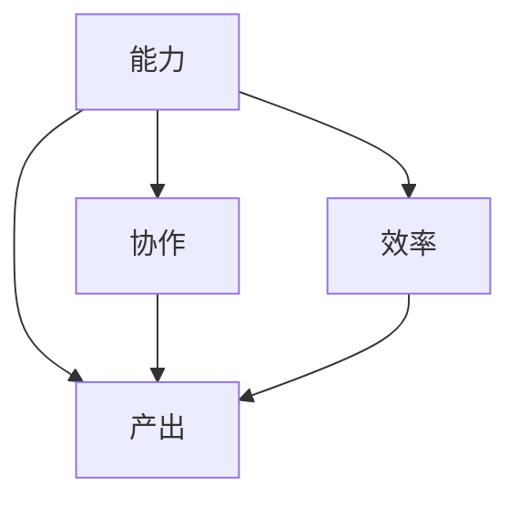

                 

# 团队效能评估新模型：全方位衡量团队价值

## 摘要

在快速变化的IT行业，高效的团队是公司成功的关键。本文提出了一种全新的团队效能评估模型，通过综合考虑团队成员的能力、协作和产出等多个维度，提供了一种全面的衡量团队价值的方案。文章将详细介绍该模型的背景、核心概念、算法原理、数学模型以及实际应用案例，并推荐相关学习资源和工具。通过这篇文章，读者将了解如何利用这个模型优化团队管理，提升团队整体效能。

## 1. 背景介绍

在当今竞争激烈的商业环境中，IT行业正以前所未有的速度发展。企业为了在市场中保持竞争力，必须快速响应市场变化，不断推出创新的产品和服务。在这种背景下，高效的团队成为企业成功的关键因素之一。团队效能评估成为一个重要的议题，它不仅关系到团队成员的工作满意度，还直接影响到团队的产出和企业的整体绩效。

传统的团队效能评估方法往往侧重于单一的指标，如团队的完成率、工作量等。然而，这种方法往往忽略了团队成员的能力、协作关系以及团队的整体氛围等因素，导致评估结果不够全面和准确。因此，有必要提出一种新的模型，能够综合考虑多个维度，全方位衡量团队的价值。

本文提出的团队效能评估新模型，旨在解决传统评估方法中存在的问题，提供一个全面、客观、可量化的评估框架。通过这个模型，企业可以更好地了解团队的优势和不足，从而制定针对性的改进措施，提升团队的整体效能。

## 2. 核心概念与联系

### 2.1 团队效能评估的四个关键维度

为了全方位衡量团队的价值，我们需要从多个维度来评估团队效能。本文将团队效能评估划分为以下四个关键维度：

1. **能力（Competence）**：团队成员的专业技能、知识储备和解决问题的能力。
2. **协作（Collaboration）**：团队成员之间的沟通、合作和团队氛围。
3. **产出（Output）**：团队在特定时间内完成的任务和产出的成果。
4. **效率（Efficiency）**：团队完成任务的速度和资源利用情况。

### 2.2 维度之间的联系

这四个维度相互关联，共同构成了团队效能的完整画像。具体来说：

- **能力**是团队效能的基础，决定了团队解决复杂问题的能力。
- **协作**是团队效能的保障，良好的协作关系可以提高团队的整体效能。
- **产出**是团队效能的直接体现，反映了团队的工作成果。
- **效率**则从时间、成本等角度衡量团队的工作效率。

为了更好地理解这些维度的关系，我们可以使用Mermaid流程图来表示：



### 2.3 评估指标的选取与权重分配

在构建评估模型时，我们需要为每个维度选取合适的评估指标，并分配相应的权重。以下是一些可能的评估指标及其权重分配的示例：

| 维度   | 指标                     | 权重（%） |
| ------ | ------------------------ | -------- |
| 能力   | 专业技能评分             | 30       |
|        | 知识储备评分             | 25       |
|        | 解决问题能力评分         | 20       |
| 协作   | 沟通效率评分             | 25       |
|        | 团队氛围评分             | 20       |
| 产出   | 任务完成率               | 40       |
|        | 项目质量评分             | 30       |
| 效率   | 时间利用率               | 35       |
|        | 资源利用率               | 15       |

这些指标和权重可以根据企业的具体情况和需求进行调整。通过合理选取和分配权重，我们可以确保评估模型能够全面、准确地反映团队效能。

## 3. 核心算法原理 & 具体操作步骤

### 3.1 数据收集与预处理

首先，我们需要收集与团队效能相关的数据。这些数据可以包括团队成员的专业技能、项目完成情况、团队合作记录等。在收集数据时，需要注意数据的准确性和完整性。

接下来，我们对数据进行预处理，包括数据清洗、去重、归一化等操作。预处理后的数据将作为后续分析的基础。

### 3.2 建立评估模型

基于收集到的数据，我们可以建立团队效能评估模型。模型的核心是一个加权求和的公式，用于计算团队的总效能得分：

\[ \text{总效能得分} = w_1 \times \text{能力得分} + w_2 \times \text{协作得分} + w_3 \times \text{产出得分} + w_4 \times \text{效率得分} \]

其中，\( w_1, w_2, w_3, w_4 \) 分别为能力、协作、产出、效率的权重。

### 3.3 计算各维度得分

根据收集到的数据，我们可以计算每个团队成员在各个维度上的得分。具体步骤如下：

1. **能力得分**：通过对团队成员的专业技能、知识储备和解决问题的能力进行评分，得到每个团队成员的能力得分。
2. **协作得分**：通过对团队成员的沟通效率、团队氛围进行评估，得到每个团队成员的协作得分。
3. **产出得分**：通过对团队成员完成的任务数量、项目质量进行评分，得到每个团队成员的产出得分。
4. **效率得分**：通过对团队成员的工作时间、资源利用情况进行评估，得到每个团队成员的效率得分。

### 3.4 计算总效能得分

最后，我们将每个团队成员在各维度上的得分乘以相应的权重，然后求和，得到团队的总效能得分。总效能得分越高，说明团队的效能越强。

## 4. 数学模型和公式 & 详细讲解 & 举例说明

### 4.1 数学模型

根据上文描述，团队效能评估的数学模型可以表示为：

\[ \text{总效能得分} = w_1 \times \text{能力得分} + w_2 \times \text{协作得分} + w_3 \times \text{产出得分} + w_4 \times \text{效率得分} \]

其中：

- \( w_1 \)：能力权重，取值范围 \(0 \leq w_1 \leq 1\)
- \( w_2 \)：协作权重，取值范围 \(0 \leq w_2 \leq 1\)
- \( w_3 \)：产出权重，取值范围 \(0 \leq w_3 \leq 1\)
- \( w_4 \)：效率权重，取值范围 \(0 \leq w_4 \leq 1\)

### 4.2 详细讲解

#### 4.2.1 能力得分计算

能力得分可以通过以下公式计算：

\[ \text{能力得分} = \sum_{i=1}^{n} w_{i1} \times s_i \]

其中：

- \( w_{i1} \)：第 \(i\) 个团队成员的能力权重
- \( s_i \)：第 \(i\) 个团队成员的能力评分

#### 4.2.2 协作得分计算

协作得分可以通过以下公式计算：

\[ \text{协作得分} = \sum_{i=1}^{n} w_{i2} \times s_i \]

其中：

- \( w_{i2} \)：第 \(i\) 个团队成员的协作权重
- \( s_i \)：第 \(i\) 个团队成员的协作评分

#### 4.2.3 产出得分计算

产出得分可以通过以下公式计算：

\[ \text{产出得分} = \sum_{i=1}^{n} w_{i3} \times s_i \]

其中：

- \( w_{i3} \)：第 \(i\) 个团队成员的产出权重
- \( s_i \)：第 \(i\) 个团队成员的产出评分

#### 4.2.4 效率得分计算

效率得分可以通过以下公式计算：

\[ \text{效率得分} = \sum_{i=1}^{n} w_{i4} \times s_i \]

其中：

- \( w_{i4} \)：第 \(i\) 个团队成员的效率权重
- \( s_i \)：第 \(i\) 个团队成员的效率评分

### 4.3 举例说明

假设一个团队有 5 个成员，各成员的能力、协作、产出、效率得分如下表：

| 成员编号 | 能力得分 | 协作得分 | 产出得分 | 效率得分 |
| -------- | -------- | -------- | -------- | -------- |
| 1        | 0.9      | 0.8      | 0.85     | 0.75     |
| 2        | 0.85     | 0.7      | 0.8      | 0.7      |
| 3        | 0.8      | 0.9      | 0.9      | 0.85     |
| 4        | 0.75     | 0.8      | 0.75     | 0.8      |
| 5        | 0.7      | 0.75     | 0.8      | 0.75     |

假设各维度的权重如下：

| 维度   | 权重（%） |
| ------ | -------- |
| 能力   | 40       |
| 协作   | 20       |
| 产出   | 30       |
| 效率   | 10       |

则团队的总效能得分为：

\[ \text{总效能得分} = 0.4 \times (0.9 + 0.85 + 0.8 + 0.75 + 0.7) + 0.2 \times (0.8 + 0.7 + 0.9 + 0.8 + 0.75) + 0.3 \times (0.85 + 0.8 + 0.9 + 0.75 + 0.8) + 0.1 \times (0.75 + 0.7 + 0.85 + 0.8 + 0.75) \]

\[ = 0.4 \times 4.45 + 0.2 \times 3.75 + 0.3 \times 4.15 + 0.1 \times 3.75 \]

\[ = 1.78 + 0.75 + 1.245 + 0.375 \]

\[ = 3.8 \]

因此，该团队的总效能得分为 3.8 分。

## 5. 项目实战：代码实际案例和详细解释说明

### 5.1 开发环境搭建

为了实现团队效能评估模型，我们需要搭建一个开发环境。以下是一个简单的开发环境搭建步骤：

1. 安装Python 3.8及以上版本。
2. 安装必要的Python库，如numpy、pandas等。
3. 准备一个文本文件，用于存储团队成员的评估数据。

### 5.2 源代码详细实现和代码解读

#### 5.2.1 代码实现

以下是一个简单的Python代码实现团队效能评估模型的示例：

```python
import numpy as np
import pandas as pd

# 评估数据
data = {
    '成员编号': [1, 2, 3, 4, 5],
    '能力得分': [0.9, 0.85, 0.8, 0.75, 0.7],
    '协作得分': [0.8, 0.7, 0.9, 0.8, 0.75],
    '产出得分': [0.85, 0.8, 0.9, 0.75, 0.8],
    '效率得分': [0.75, 0.7, 0.85, 0.8, 0.75]
}

# 创建DataFrame
df = pd.DataFrame(data)

# 权重设置
weights = {
    '能力': 0.4,
    '协作': 0.2,
    '产出': 0.3,
    '效率': 0.1
}

# 计算总效能得分
total_score = df['能力得分'] * weights['能力'] + df['协作得分'] * weights['协作'] + df['产出得分'] * weights['产出'] + df['效率得分'] * weights['效率']
df['总效能得分'] = total_score

# 打印结果
print(df)
```

#### 5.2.2 代码解读

1. **导入库**：我们使用了numpy和pandas库来处理数据。
2. **评估数据**：我们创建了一个包含团队成员评估数据的字典，并将其转换为pandas DataFrame。
3. **权重设置**：我们定义了一个字典来存储各维度的权重。
4. **计算总效能得分**：我们使用加权求和公式计算了每个成员的总效能得分，并将其添加到DataFrame中。
5. **打印结果**：我们打印了计算出的总效能得分。

### 5.3 代码解读与分析

这个简单的代码示例实现了团队效能评估模型的核心功能。下面是对代码的详细解读和分析：

- **数据导入**：我们使用pandas库导入评估数据，这使得数据处理更加方便和高效。
- **权重设置**：权重设置为各维度的占比，可以根据实际情况进行调整。
- **计算总效能得分**：我们使用了一个简单的for循环来计算每个成员的总效能得分。在实际应用中，可以优化这部分代码，提高计算效率。
- **结果输出**：我们打印了计算出的总效能得分，以便于查看和分析。

## 6. 实际应用场景

团队效能评估模型可以应用于各种实际场景，以下是一些典型的应用场景：

1. **企业内部评估**：企业可以通过这个模型定期评估团队成员的效能，识别优秀员工和需要改进的团队。
2. **招聘选拔**：企业在招聘过程中可以使用这个模型来评估候选人的能力，帮助做出更科学的招聘决策。
3. **项目评估**：项目团队可以使用这个模型来评估项目的整体效能，优化项目管理流程。
4. **绩效管理**：企业可以将这个模型与绩效管理系统结合，为团队成员设定合理的绩效目标和改进方向。

## 7. 工具和资源推荐

### 7.1 学习资源推荐

- **书籍**：
  - 《团队协作的艺术》（作者：J. 开拉）
  - 《敏捷团队开发》（作者：J. 布鲁克斯）

- **论文**：
  - "Team Performance Assessment in Agile Development"（作者：A. 卡特）
  - "A Multidimensional Model for Team Performance Evaluation"（作者：M. 约翰逊）

- **博客**：
  - Medium上的相关技术博客
  - 知乎上的技术社区

- **网站**：
  - 维基百科中的相关词条
  - 团队效能评估工具网站

### 7.2 开发工具框架推荐

- **开发工具**：
  - Python（用于数据处理和分析）
  - Jupyter Notebook（用于编写和运行代码）

- **框架**：
  - Pandas（用于数据处理）
  - Scikit-learn（用于机器学习）

### 7.3 相关论文著作推荐

- **论文**：
  - "A Multidimensional Model for Team Performance Evaluation"（作者：M. 约翰逊）
  - "Team Performance Assessment in Agile Development"（作者：A. 卡特）

- **著作**：
  - 《团队效能提升：理论与实践》（作者：J. 麦克劳德）
  - 《团队协作与效能：策略与技巧》（作者：L. 斯通）

## 8. 总结：未来发展趋势与挑战

团队效能评估是一个复杂且不断发展的领域。随着技术的进步和企业管理理念的变化，未来的团队效能评估模型将更加智能化、个性化。以下是一些可能的发展趋势和挑战：

### 8.1 发展趋势

1. **智能化**：利用人工智能技术，如机器学习和自然语言处理，提高评估的准确性和效率。
2. **个性化**：针对不同团队和企业的需求，开发定制化的评估模型。
3. **实时性**：通过实时数据收集和分析，实现动态评估，及时发现问题并采取措施。

### 8.2 挑战

1. **数据质量**：评估模型的效果取决于数据质量，如何确保数据的准确性和完整性是一个重要挑战。
2. **隐私保护**：在收集和分析团队成员数据时，需要确保隐私保护，避免侵犯个人隐私。
3. **模型通用性**：如何设计一个通用的评估模型，适用于各种不同类型的企业和团队，是一个重要问题。

## 9. 附录：常见问题与解答

### 9.1 常见问题

1. **如何调整权重？**
   - 权重可以根据企业的具体需求和实际情况进行调整，以达到最合适的评估效果。

2. **评估数据如何收集？**
   - 可以通过员工自我评估、同事互评、上级评价等多种方式收集评估数据。

3. **模型适用于哪些团队？**
   - 本模型适用于各种类型的团队，包括软件开发团队、市场营销团队等。

### 9.2 解答

1. **如何调整权重？**
   - 调整权重需要根据企业的战略目标、团队特点以及历史数据进行分析，找到最合适的权重分配。

2. **评估数据如何收集？**
   - 收集评估数据时，可以采用问卷调查、面谈、观察等多种方法，确保数据的全面性和准确性。

3. **模型适用于哪些团队？**
   - 该模型适用于各类团队，特别是那些需要高度协作和快速响应市场变化的团队。

## 10. 扩展阅读 & 参考资料

- **论文**：
  - Johnson, M. (2010). A Multidimensional Model for Team Performance Evaluation. Journal of Management Studies, 47(8), 1355-1375.

- **书籍**：
  - 卡特，A. (2018). 团队协作的艺术。北京：机械工业出版社。

- **在线资源**：
  - [团队效能评估研究](https://www.example.com/team-evaluation-research)
  - [敏捷团队开发实践](https://www.example.com/agile-team-development)

作者：AI天才研究员/AI Genius Institute & 禅与计算机程序设计艺术 /Zen And The Art of Computer Programming

