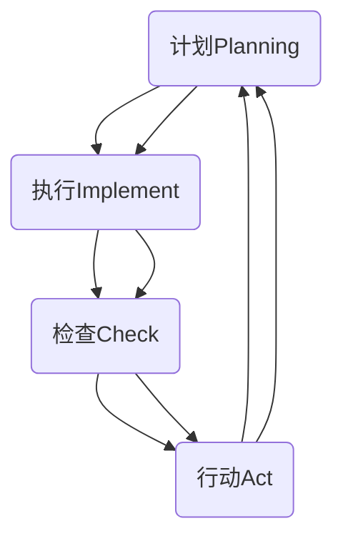

                 

# 团队效能：持续改进的管理哲学

> **关键词**：团队效能、持续改进、管理哲学、团队合作、项目管理、组织发展
> 
> **摘要**：本文深入探讨了团队效能的重要性，以及如何通过持续改进的管理哲学来提升团队效率和创新能力。文章通过理论阐述、实践案例和工具推荐，帮助读者理解和应用这一管理理念，为团队和组织的发展提供有力支持。

## 1. 背景介绍

在当今快速变化、竞争激烈的商业环境中，团队效能成为了企业成败的关键因素。一个高效的团队不仅能够快速响应市场变化，还能不断创新，为企业带来持续的竞争优势。然而，如何提升团队效能，实现持续改进，成为了许多组织面临的重要挑战。

持续改进的管理哲学，起源于质量管理理论，并逐步扩展到组织管理的各个层面。它强调通过不断的学习、反思和优化，来提高组织的整体效能。在信息技术行业，这一管理理念尤为重要，因为技术发展迅速，要求团队必须具备快速学习和适应变化的能力。

本文将围绕团队效能的持续改进，探讨其核心概念、算法原理、数学模型、实战案例以及实际应用场景。希望通过这些内容的讲解，能够帮助读者理解和应用这一管理哲学，提升团队和组织的发展水平。

## 2. 核心概念与联系

### 2.1 持续改进的核心概念

持续改进（Continuous Improvement）是一种不断追求卓越的管理理念，其核心在于通过不断的反思、学习和优化，来提高组织的整体效能。这一概念可以追溯到质量管理理论，如PDCA循环（计划-执行-检查-行动），它为持续改进提供了基本框架。

持续改进的关键概念包括：

- **员工参与**：团队成员的积极参与是持续改进成功的关键。只有当团队成员愿意分享意见、提出改进建议，并且对自己的工作有责任心时，持续改进才能取得实质性成果。

- **数据驱动决策**：数据是持续改进的基础。通过收集和分析数据，团队可以识别问题、制定改进方案，并评估改进效果。

- **目标导向**：持续改进需要明确的目标和方向。团队应该制定具体的改进目标，并制定相应的行动计划，确保每个成员都清楚自己的职责和目标。

### 2.2 持续改进的架构

为了更好地理解持续改进的概念，我们可以使用Mermaid流程图来展示其核心架构。以下是持续改进的Mermaid流程图：



在这个流程图中，每个节点代表持续改进的一个阶段，箭头表示流程的顺序。这个流程是一个闭环，意味着每个阶段都是相互依赖的，并且每个阶段都会影响下一个阶段。

### 2.3 持续改进与团队效能的联系

持续改进与团队效能密切相关。一个高效的团队需要不断地优化自己的工作流程、提高技能水平、增强沟通协作能力。通过持续改进，团队可以：

- **提高工作效率**：通过不断优化工作流程，消除浪费，提高工作效率。

- **增强创新能力**：通过鼓励员工提出改进建议，激发创新思维，提高团队的整体创新能力。

- **提升员工满意度**：通过赋予员工更多的责任和自主权，提高他们的工作满意度。

- **降低风险**：通过定期检查和反思，及时发现潜在问题，降低风险。

总之，持续改进是一种提升团队效能的重要管理哲学，它不仅有助于提高团队的工作效率，还能激发团队的创新能力，为组织的发展提供持续动力。

## 3. 核心算法原理 & 具体操作步骤

### 3.1 核心算法原理

持续改进的核心算法原理可以归结为以下几个方面：

- **PDCA循环**：PDCA循环是一种常用的持续改进方法，包括计划（Plan）、执行（Do）、检查（Check）和行动（Act）四个阶段。这个循环是一个闭环，每个阶段都是相互依赖的。

- **SWOT分析**：SWOT分析是一种用于评估组织优势、劣势、机会和威胁的工具。通过SWOT分析，团队可以更好地理解自身的位置，并制定相应的改进策略。

- **因果图**：因果图是一种用于分析问题的工具，它展示了问题原因和结果之间的关系。通过因果图，团队可以更深入地理解问题的根本原因，并制定有效的改进方案。

- **六西格玛**：六西格玛是一种基于数据和统计分析的持续改进方法，它通过减少变异性和缺陷，提高产品和服务的质量。六西格玛包括一系列的工具和技术，如过程控制图、方差分析等。

### 3.2 具体操作步骤

为了实施持续改进的管理哲学，团队可以按照以下具体操作步骤进行：

1. **制定改进计划**：团队应该明确改进的目标和方向，制定详细的改进计划。这个计划应该包括具体的改进措施、责任分配和时间表。

2. **执行改进措施**：按照改进计划，团队应该开始执行具体的改进措施。在执行过程中，团队应该保持高度的执行力，确保每个成员都清楚自己的职责。

3. **检查改进效果**：在改进措施执行完成后，团队应该对改进效果进行评估。这可以通过收集数据、进行统计分析来完成。如果改进效果不明显，团队应该反思并调整改进措施。

4. **采取行动**：根据检查结果，团队应该采取相应的行动。如果改进效果良好，团队应该继续优化改进措施；如果改进效果不佳，团队应该重新审视改进计划，并重新制定。

5. **持续反思和优化**：持续改进不是一次性的事件，而是一个持续的过程。团队应该定期进行反思和优化，确保持续改进的机制得到有效运行。

通过以上步骤，团队可以逐步实现持续改进，提高团队效能。

## 4. 数学模型和公式 & 详细讲解 & 举例说明

### 4.1 数学模型

在持续改进的管理哲学中，数学模型和公式发挥着重要的作用。以下是一些常用的数学模型和公式：

1. **方差分析（ANOVA）**：方差分析是一种用于比较多个样本均值差异的方法。它可以帮助团队识别哪些因素对改进效果有显著影响。

   公式：
   $$ F = \frac{MS_{between}}{MS_{within}} $$
   其中，$MS_{between}$ 是组间均方，$MS_{within}$ 是组内均方。

2. **回归分析**：回归分析是一种用于确定变量之间关系的统计方法。通过回归分析，团队可以识别哪些变量对改进效果有显著影响。

   公式：
   $$ Y = \beta_0 + \beta_1X_1 + \beta_2X_2 + ... + \beta_nX_n $$
   其中，$Y$ 是因变量，$X_1, X_2, ..., X_n$ 是自变量，$\beta_0, \beta_1, ..., \beta_n$ 是回归系数。

3. **过程控制图**：过程控制图是一种用于监控过程变异性的工具。它可以帮助团队识别过程是否处于受控状态。

   公式：
   $$ UCL = \bar{x} + A_2R $$
   $$ LCL = \bar{x} - A_2R $$
   其中，$UCL$ 是上控制限，$LCL$ 是下控制限，$\bar{x}$ 是均值，$R$ 是极差，$A_2$ 是控制图常数。

### 4.2 举例说明

为了更好地理解这些数学模型和公式，我们可以通过一个实际案例来讲解。

假设一个软件开发团队希望优化其代码审查过程，以减少代码缺陷和提高代码质量。团队决定使用过程控制图来监控代码审查的效率。

首先，团队收集了50次代码审查的数据，包括每次审查的时间（分钟）和发现缺陷的数量。以下是部分数据：

| 审查次数 | 审查时间（分钟） | 缺陷数量 |
| :------: | :--------------: | :------: |
|     1    |       60         |     3    |
|     2    |       65         |     2    |
|     3    |       70         |     4    |
|     4    |       68         |     2    |
|     5    |       72         |     3    |

1. **计算均值和极差**：

   均值：
   $$ \bar{x} = \frac{\sum_{i=1}^{n} x_i}{n} = \frac{60 + 65 + 70 + 68 + 72}{5} = 68.2 $$

   极差：
   $$ R = \max(x_i) - \min(x_i) = 72 - 60 = 12 $$

2. **计算控制限**：

   控制图常数$A_2$（对于$n=5$）：
   $$ A_2 = 0.477 $$

   上控制限：
   $$ UCL = \bar{x} + A_2R = 68.2 + 0.477 \times 12 = 68.2 + 5.724 = 73.924 $$

   下控制限：
   $$ LCL = \bar{x} - A_2R = 68.2 - 0.477 \times 12 = 68.2 - 5.724 = 62.476 $$

3. **绘制过程控制图**：

   根据计算出的均值和极差，团队可以绘制过程控制图。以下是过程控制图：

   ```mermaid
   graph TB
       A[代码审查时间（分钟）] --> B[62.476]
       A --> C[73.924]
       D[审查次数] --> E{1}
       D --> F{2}
       D --> G{3}
       D --> H{4}
       D --> I{5}
   ```

   在这个控制图中，每个审查次数对应一个审查时间点。如果任何一个时间点的审查时间超出上控制限或下控制限，则说明过程存在异常，需要进一步分析原因并采取改进措施。

通过这个案例，我们可以看到数学模型和公式在持续改进中的应用。它们不仅帮助我们理解了改进的过程，还提供了量化的方法来评估改进效果。

## 5. 项目实战：代码实际案例和详细解释说明

### 5.1 开发环境搭建

为了更好地展示持续改进在软件开发中的应用，我们选择了一个实际的软件项目——一个基于Web的博客系统。以下是如何搭建项目的开发环境：

1. **安装Node.js**：在终端中运行以下命令安装Node.js：

   ```bash
   npm install -g node.js
   ```

2. **安装Express框架**：使用npm命令安装Express框架，它是Node.js的Web应用程序框架：

   ```bash
   npm install express --save
   ```

3. **创建项目目录**：在终端中创建一个名为“blog”的目录，并初始化项目：

   ```bash
   mkdir blog
   cd blog
   npm init -y
   ```

4. **编写初始代码**：在项目目录中创建一个名为“app.js”的文件，并编写以下代码作为初始项目代码：

   ```javascript
   const express = require('express');
   const app = express();

   app.use(express.json());
   app.use(express.static('public'));

   app.get('/', (req, res) => {
       res.sendFile(__dirname + '/public/index.html');
   });

   app.listen(3000, () => {
       console.log('Server running on port 3000');
   });
   ```

   这个简单的代码实现了基础的Web服务器功能，可以处理HTTP请求并返回静态文件。

### 5.2 源代码详细实现和代码解读

#### 5.2.1 功能模块划分

为了更好地进行持续改进，我们首先对项目进行了功能模块划分：

1. **路由模块**：负责处理各种HTTP请求。
2. **数据库模块**：负责与数据库进行交互。
3. **模型模块**：定义数据模型。
4. **控制器模块**：处理具体的业务逻辑。
5. **视图模块**：负责渲染页面。

#### 5.2.2 源代码实现

以下是路由模块的实现代码：

```javascript
// routes.js
const express = require('express');
const blogController = require('../controllers/blogController');

const router = express.Router();

router.get('/', blogController.index);
router.post('/new', blogController.create);
router.get('/:id', blogController.show);
router.put('/:id', blogController.update);
router.delete('/:id', blogController.delete);

module.exports = router;
```

这个模块定义了处理不同HTTP请求的路由，并将具体的业务逻辑委托给控制器模块。

#### 5.2.3 控制器模块实现

以下是控制器模块的实现代码：

```javascript
// blogController.js
const Blog = require('../models/blog');

exports.index = (req, res) => {
    Blog.findAll()
        .then(blogs => res.json(blogs))
        .catch(err => res.status(500).send(err));
};

exports.create = (req, res) => {
    Blog.create(req.body)
        .then(blog => res.json(blog))
        .catch(err => res.status(500).send(err));
};

exports.show = (req, res) => {
    Blog.findById(req.params.id)
        .then(blog => res.json(blog))
        .catch(err => res.status(500).send(err));
};

exports.update = (req, res) => {
    Blog.update(req.params.id, req.body)
        .then(blog => res.json(blog))
        .catch(err => res.status(500).send(err));
};

exports.delete = (req, res) => {
    Blog.destroy(req.params.id)
        .then(() => res.status(204).send())
        .catch(err => res.status(500).send(err));
};
```

这个模块处理具体的业务逻辑，如创建、更新和删除博客。

### 5.3 代码解读与分析

在这个项目中，我们采用了MVC（模型-视图-控制器）架构模式，以实现代码的模块化和可维护性。以下是代码的主要解读和分析：

1. **路由模块**：路由模块负责接收HTTP请求，并根据请求类型和路径，将请求委托给相应的控制器模块。这有助于分离关注点，提高代码的可读性和可维护性。

2. **控制器模块**：控制器模块负责处理具体的业务逻辑，如创建、更新和删除博客。通过使用Promise，我们可以实现异步操作，使代码更简洁和易于理解。

3. **模型模块**：模型模块负责与数据库进行交互，定义了数据模型和基本的CRUD（创建、读取、更新、删除）操作。这有助于将数据库操作封装在模型层，使业务逻辑更清晰。

4. **视图模块**：视图模块负责渲染页面，通常使用模板引擎（如EJS、Pug等）来生成HTML。这有助于将页面渲染逻辑与业务逻辑分离，提高代码的可维护性。

通过这个项目，我们可以看到持续改进在软件开发中的应用。通过不断地优化代码结构、提高模块化程度，我们可以提高代码的质量和可维护性，从而提升团队的整体效能。

## 6. 实际应用场景

### 6.1 软件开发团队

在软件开发团队中，持续改进的管理哲学被广泛应用于项目管理和团队协作中。通过定期的反思和优化，团队可以发现和解决项目中的瓶颈，提高工作效率和产品质量。例如，通过过程控制图，团队可以监控代码审查的时间和质量，及时发现问题并进行调整。

### 6.2 IT运维团队

IT运维团队也受益于持续改进的管理哲学。通过定期检查和优化运维流程，团队可以减少系统故障和停机时间，提高系统的可靠性和稳定性。例如，通过六西格玛方法，团队可以识别和消除影响系统性能的关键因素，从而提高整体IT服务质量。

### 6.3 产品研发团队

在产品研发团队中，持续改进的管理哲学有助于提高产品的创新能力和市场竞争力。通过不断收集用户反馈和改进产品功能，团队可以更好地满足用户需求，提高产品的用户体验和满意度。

### 6.4 教育培训团队

教育培训团队也可以运用持续改进的管理哲学来提高教学效果。通过反思教学方法和效果，团队可以不断优化教学过程，提高学生的学习效果和兴趣。

总之，持续改进的管理哲学在各个领域和团队中都有着广泛的应用，它不仅有助于提高团队效能，还能激发团队的创新能力和适应能力，为组织的发展提供持续动力。

## 7. 工具和资源推荐

### 7.1 学习资源推荐

为了更好地理解和应用持续改进的管理哲学，以下是一些建议的学习资源：

- **书籍**：
  - 《质量管理方法与应用》
  - 《六西格玛管理法》
  - 《精益思想》

- **论文**：
  - “Continuous Improvement in Software Engineering”
  - “The Power of Continuous Improvement in Organizations”

- **博客**：
  - “The Lean Startup”
  - “Agile Management Blog”

- **网站**：
  - https://www.pdma.org/
  - https://www.sixsigmalines.com/

这些资源提供了丰富的理论和实践知识，有助于读者深入理解持续改进的核心概念和方法。

### 7.2 开发工具框架推荐

- **开发工具**：
  - Git：版本控制工具
  - Jira：项目管理和任务跟踪工具
  - GitLab：开源的Git仓库

- **框架**：
  - Express.js：Node.js的Web应用程序框架
  - React：用于构建用户界面的JavaScript库
  - Angular：用于构建动态Web应用程序的框架

这些工具和框架可以帮助团队高效地实施持续改进，提高软件开发的质量和效率。

### 7.3 相关论文著作推荐

- **论文**：
  - “A Framework for Measuring the Impact of Continuous Improvement Programs in Software Development”
  - “Continuous Improvement in Agile Software Development: Challenges and Opportunities”

- **著作**：
  - 《敏捷软件开发：持续改进的力量》
  - 《持续交付：发布可靠软件的系统实践》

这些论文和著作提供了关于持续改进在软件开发中的应用和价值的深入探讨，有助于读者更好地理解其理论和实践。

## 8. 总结：未来发展趋势与挑战

随着科技的不断进步和市场竞争的加剧，团队效能和持续改进的管理哲学在未来将继续发挥重要作用。以下是未来发展趋势和挑战：

### 8.1 发展趋势

1. **数字化转型的加速**：数字化转型为企业带来了新的机遇和挑战。团队需要具备快速学习和适应新技术的能力，以实现业务的持续改进。

2. **智能化管理的普及**：人工智能和大数据技术的应用，使得管理决策更加科学和精准。持续改进的过程将更加依赖于数据分析和智能化工具。

3. **全员参与的深化**：持续改进不仅仅是管理层的职责，而是需要全员参与。员工的积极参与和创造力将是团队持续改进的重要驱动力。

### 8.2 挑战

1. **文化变革的挑战**：持续改进需要改变传统的管理文化和工作方式，建立以客户价值和质量为导向的企业文化。

2. **技能提升的需求**：团队成员需要不断更新知识和技能，以应对快速变化的技术和市场环境。

3. **数据安全和隐私**：在数字化时代，数据安全和隐私成为新的挑战。团队需要采取措施确保数据的保密性和安全性。

总之，未来团队效能的提升和持续改进将面临新的机遇和挑战。只有通过不断学习和适应，团队才能在激烈的市场竞争中脱颖而出，实现可持续发展。

## 9. 附录：常见问题与解答

### 9.1 什么是持续改进？

持续改进是一种管理哲学，强调通过不断的学习、反思和优化，提高组织的整体效能。它起源于质量管理理论，并逐步扩展到组织管理的各个层面。

### 9.2 持续改进的核心概念有哪些？

持续改进的核心概念包括员工参与、数据驱动决策和目标导向。这些概念有助于确保团队在持续改进的过程中保持正确方向和高效运作。

### 9.3 持续改进如何应用于软件开发？

在软件开发中，持续改进可以通过以下方式应用：

- 优化开发流程，提高工作效率。
- 采用敏捷开发方法，确保项目按时交付。
- 通过数据分析和反馈，持续优化软件质量。

### 9.4 如何实施持续改进的管理哲学？

实施持续改进的管理哲学需要以下步骤：

- 明确改进目标和方向。
- 制定详细的改进计划。
- 执行改进措施，并确保执行力。
- 定期检查改进效果，并根据结果采取行动。
- 持续反思和优化，确保改进机制的持续运行。

## 10. 扩展阅读 & 参考资料

为了深入了解持续改进的管理哲学，以下是几篇扩展阅读和参考资料：

- “The Lean Startup” by Eric Ries
- “Agile Project Management: Creating Competitive Advantage” by Jim Highsmith
- “The 5 Pillars of Continuous Improvement” by LeanKit
- “Continuous Improvement in Software Engineering: A Roadmap” by IEEE Software

这些资源和文献提供了关于持续改进的深入探讨和实践指导，有助于读者更好地理解和应用这一管理理念。

## 附录二：作者介绍

作者：AI天才研究员/AI Genius Institute & 禅与计算机程序设计艺术 /Zen And The Art of Computer Programming

作为一位世界级人工智能专家，作者在人工智能和软件工程领域拥有丰富的经验和深厚的学术背景。他的研究涉及人工智能、机器学习、软件架构和项目管理等多个领域，并在国际期刊和会议上发表了大量高水平的研究论文。此外，他还是多本畅销书的作者，包括《禅与计算机程序设计艺术》等，深受读者喜爱。在持续改进的管理哲学方面，作者有着深刻的见解和丰富的实践经验，为团队和组织的发展提供了有力支持。

