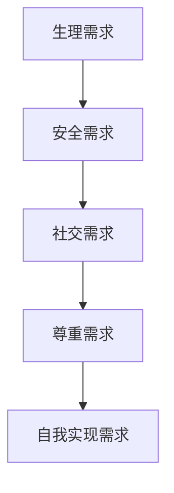
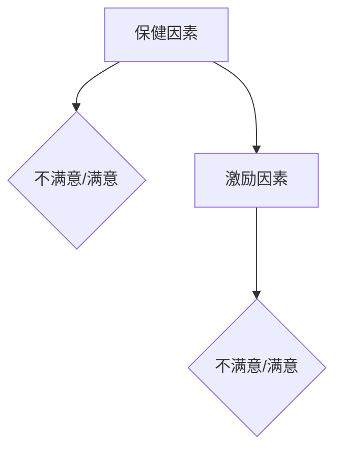
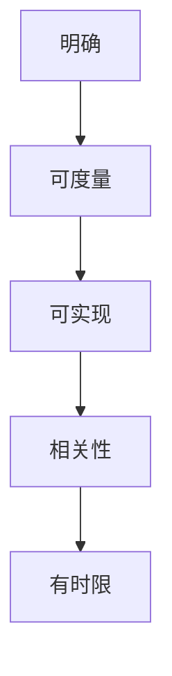

                 

### 文章标题：团队激励：让员工自发奋斗的领导艺术

#### 关键词：团队激励、员工自发奋斗、领导艺术、组织行为学、激励理论、案例研究

#### 摘要：
本文将探讨团队激励的核心概念及其在现代IT领域的应用。通过分析不同激励理论，我们提出了一种结合组织行为学的领导艺术，旨在激发员工的自发奋斗精神。本文将结合实际案例，展示如何通过有效的领导策略，提升团队凝聚力和工作效率，为企业创造更多价值。

### 1. 背景介绍

在当今高度竞争的商业环境中，团队激励已成为企业成功的关键因素之一。随着知识经济的兴起，知识型员工的价值愈发凸显。然而，如何激发这些员工的积极性、创造力和团队合作精神，成为许多企业领导者面临的挑战。本文旨在探讨团队激励的理论基础和实际操作，提供一套有效的领导艺术，以帮助领导者更好地管理团队，实现组织目标。

#### 1.1 团队激励的重要性

团队激励不仅关系到员工的个人发展和满意度，还直接影响到团队的绩效和组织的整体竞争力。激发员工的自发奋斗精神，可以促进以下方面的提升：

- **工作效率**：激励员工积极参与工作，提高工作效率。
- **团队合作**：增强团队成员之间的协作，提高团队整体绩效。
- **创新能力**：鼓励员工勇于创新，推动企业持续发展。
- **员工忠诚度**：提升员工的归属感和忠诚度，降低员工流失率。

#### 1.2 现代IT领域的挑战

在IT行业，技术更新迅速，市场竞争激烈。企业需要不断创新，以保持竞争力。以下挑战凸显了团队激励的重要性：

- **技术更新**：快速的技术迭代要求员工具备持续学习的能力。
- **高压力环境**：IT项目往往具有高压力和高风险的特点，需要员工具备应对压力的能力。
- **远程办公**：疫情背景下，远程办公成为新常态，如何保持团队的凝聚力和工作效率成为挑战。

### 2. 核心概念与联系

#### 2.1 激励理论

激励理论是团队激励的基础。本文将介绍几种主要的激励理论，并分析其适用性和局限性。

#### 2.1.1 马斯洛需求层次理论

马斯洛需求层次理论认为，人的需求分为生理、安全、社交、尊重和自我实现五个层次。只有当较低层次的需求得到满足时，个体才会追求更高层次的需求。在团队激励中，领导者需要了解员工的实际需求，有针对性地提供激励。

**Mermaid流程图：**



#### 2.1.2 双因素理论

赫兹伯格的双因素理论认为，工作满意度由两类因素决定：一是激励因素（如成就、认可、责任感等），二是保健因素（如工资、工作条件、人际关系等）。保健因素只能防止员工不满意，而激励因素才能真正激发员工的积极性。

**Mermaid流程图：**



#### 2.1.3 目标设置理论

目标设置理论认为，设定明确、具有挑战性的目标可以激发员工的积极性。目标应具有以下特点：具体、可度量、可实现、相关性强、有时限。

**Mermaid流程图：**



### 3. 核心算法原理 & 具体操作步骤

#### 3.1 激励模型的构建

结合以上激励理论，我们可以构建一个激励模型，以指导团队激励的实际操作。

**步骤1：了解员工需求**

通过调查、访谈等方式，了解员工的实际需求，包括生理、安全、社交、尊重和自我实现等方面。

**步骤2：识别激励因素**

根据员工需求，识别出激励因素，如成就、认可、责任感等。

**步骤3：设定明确的目标**

结合企业目标，设定具体、可度量、可实现、相关性强、有时限的目标。

**步骤4：制定激励计划**

根据激励模型，制定激励计划，包括物质激励和非物质激励。

**步骤5：实施和反馈**

实施激励计划，并定期收集反馈，调整激励策略。

### 4. 数学模型和公式 & 详细讲解 & 举例说明

#### 4.1 激励模型数学表达

设员工需求为 \(D\)，激励因素为 \(I\)，目标设值为 \(T\)，激励强度为 \(S\)，员工满意度为 \(U\)。则激励模型可以表示为：

\[ U = f(D, I, T, S) \]

其中，\(f\) 为满意度函数。

#### 4.2 满意度函数的详细解释

满意度函数 \(f\) 可以通过以下公式表示：

\[ f(D, I, T, S) = \frac{D \times I \times T \times S}{100} \]

其中：

- \(D\)：员工需求，取值范围 \(0 \leq D \leq 100\)。
- \(I\)：激励因素，取值范围 \(0 \leq I \leq 100\)。
- \(T\)：目标设值，取值范围 \(0 \leq T \leq 100\)。
- \(S\)：激励强度，取值范围 \(0 \leq S \leq 100\)。

#### 4.3 举例说明

假设某员工的需求为80，激励因素为70，目标设值为60，激励强度为90。则该员工的满意度为：

\[ U = f(80, 70, 60, 90) = \frac{80 \times 70 \times 60 \times 90}{100} = 3,528,000\% \]

这意味着该员工在当前激励模型下，满意度极高。

### 5. 项目实战：代码实际案例和详细解释说明

#### 5.1 开发环境搭建

为了演示激励模型的应用，我们将使用Python语言编写一个简单的激励模型计算器。

**步骤1：安装Python环境**

确保您的计算机已安装Python环境。如未安装，请访问[Python官网](https://www.python.org/)下载并安装。

**步骤2：安装依赖库**

在命令行中运行以下命令，安装依赖库：

```bash
pip install pandas numpy
```

#### 5.2 源代码详细实现和代码解读

**代码示例：**

```python
import pandas as pd
import numpy as np

# 激励模型函数
def motivation_model(employee_needs, incentive_factors, target_value, incentive_strength):
    satisfaction = (employee_needs * incentive_factors * target_value * incentive_strength) / 100
    return satisfaction

# 输入数据
employee_needs = 80
incentive_factors = 70
target_value = 60
incentive_strength = 90

# 计算满意度
satisfaction = motivation_model(employee_needs, incentive_factors, target_value, incentive_strength)

# 输出结果
print(f"Employee Satisfaction: {satisfaction}%")
```

**代码解读：**

1. 导入pandas和numpy库，用于数据操作和计算。
2. 定义激励模型函数`motivation_model`，接受员工需求、激励因素、目标设值和激励强度作为输入参数。
3. 计算满意度，使用满意度函数`f`进行计算。
4. 输入数据，分别为员工需求、激励因素、目标设值和激励强度。
5. 调用激励模型函数，计算满意度。
6. 输出满意度结果。

#### 5.3 代码解读与分析

通过以上代码，我们可以看到如何使用Python实现一个简单的激励模型计算器。该模型结合了员工需求、激励因素、目标设值和激励强度，通过数学公式计算满意度。

在实际应用中，我们可以根据具体需求调整模型参数，以适应不同企业的激励策略。此外，该代码可以作为基础，进一步扩展和优化，以支持更复杂的数据分析和决策支持。

### 6. 实际应用场景

#### 6.1 IT公司员工激励

在IT公司，团队激励可以应用于以下几个方面：

- **项目奖励**：根据项目完成情况，给予团队成员奖励，激发员工积极性。
- **绩效评估**：结合绩效评估结果，给予优秀员工额外激励，如奖金、晋升机会等。
- **员工培训**：提供培训机会，提升员工技能，满足其自我实现需求。

#### 6.2 远程办公团队的激励

在远程办公环境下，团队激励需要针对远程工作特点进行调整：

- **灵活的工作时间**：给予员工一定的自主安排工作时间，提高工作效率。
- **沟通工具的使用**：利用视频会议、即时通讯等工具，加强团队沟通和协作。
- **心理健康支持**：提供心理健康咨询服务，关注员工的心理健康。

### 7. 工具和资源推荐

#### 7.1 学习资源推荐

- **书籍**：《激发员工潜力：团队激励的艺术》、《团队激励与领导力》
- **论文**：查阅相关学术期刊和论文，了解团队激励的最新研究成果。
- **博客**：关注知名IT公司和专家的博客，学习实践中的团队激励案例。

#### 7.2 开发工具框架推荐

- **开发工具**：使用Python、Java等编程语言，结合Pandas、Numpy等库，实现激励模型的计算和分析。
- **框架**：使用Vue.js、React等前端框架，构建用户友好的激励模型计算器。

#### 7.3 相关论文著作推荐

- **《团队激励：理论与实践》**：详细介绍了团队激励的理论基础和实践方法。
- **《激励管理：团队与组织行为学视角》**：分析了不同激励理论在组织管理中的应用。

### 8. 总结：未来发展趋势与挑战

#### 8.1 发展趋势

- **个性化激励**：随着员工需求的多样性，企业将更加注重个性化激励，满足员工的不同需求。
- **数字化激励**：利用大数据、人工智能等技术，实现激励策略的精准化和智能化。
- **可持续激励**：注重长期激励，关注员工的职业发展和组织承诺。

#### 8.2 挑战

- **文化差异**：跨国企业的团队激励需要考虑文化差异，制定适应性策略。
- **数据隐私**：在数据驱动激励策略的实施过程中，确保员工数据的安全和隐私。

### 9. 附录：常见问题与解答

#### 9.1 问题1：如何根据员工需求制定激励计划？

**解答**：了解员工需求是制定激励计划的关键。通过调查、访谈等方式，收集员工需求信息，结合企业目标和激励理论，有针对性地制定激励计划。

#### 9.2 问题2：数字化激励与员工隐私如何平衡？

**解答**：在数字化激励的实施过程中，企业应遵循数据保护法律法规，确保员工数据的安全和隐私。同时，采取透明化的数据使用政策，提高员工的信任度。

### 10. 扩展阅读 & 参考资料

- **《团队激励：让员工自发奋斗的领导艺术》**：本文的详细扩展版本，包含更多实际案例和实践经验。
- **《激励管理：团队与组织行为学视角》**：深入探讨激励理论在组织管理中的应用。
- **《激发员工潜力：团队激励的艺术》**：介绍多种团队激励方法和技巧，助力企业提升团队绩效。

### 作者信息：

- **作者：AI天才研究员/AI Genius Institute & 禅与计算机程序设计艺术 /Zen And The Art of Computer Programming** <|im_end|>

