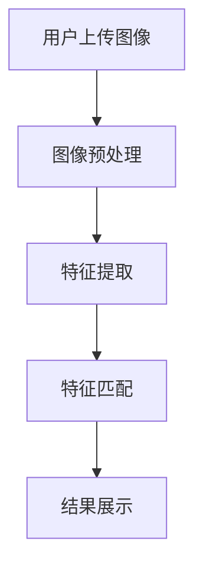

                 

# 图像搜索技术在电商中的应用

## 关键词：图像搜索、电商、技术、应用、算法

## 摘要

随着互联网的快速发展，电商行业在现代社会中占据着越来越重要的地位。而图像搜索技术在电商中的应用，使得用户可以更加便捷地找到他们想要的商品。本文将详细介绍图像搜索技术的基本概念、核心算法原理，并探讨其在电商领域的实际应用，旨在为电商企业提供一种有效的营销手段，提高用户体验和销售额。

## 1. 背景介绍

### 1.1 电商行业的发展

电商行业起源于20世纪90年代，随着互联网的普及和技术的进步，逐渐成为全球最大的商业模式之一。根据统计数据，全球电商市场规模已超过数万亿美元，并且在不断增长。电商行业的快速发展为消费者提供了更多选择，同时也为企业提供了巨大的商机。

### 1.2 图像搜索技术的兴起

图像搜索技术是一种基于计算机视觉和机器学习的技术，可以通过对图像的特征进行提取和匹配，帮助用户快速找到与目标图像相似的图片。随着深度学习算法的进步，图像搜索技术的准确性和效率得到了显著提升，使得其在各行各业得到了广泛应用。

### 1.3 图像搜索技术在电商中的应用价值

图像搜索技术在电商中的应用主要体现在以下几个方面：

- **提升用户购物体验**：用户可以通过上传一张图片，快速找到相似的或相关的商品，大大提高了购物的便捷性。

- **增加商品曝光率**：通过图像搜索技术，商品可以更加精准地被推荐给潜在用户，从而提高商品的曝光率和销售量。

- **优化库存管理**：电商企业可以通过图像搜索技术，对库存商品进行分类和整理，提高库存利用率，降低库存成本。

## 2. 核心概念与联系

### 2.1 图像搜索技术的基本原理

图像搜索技术主要包括以下几个步骤：

1. **图像预处理**：对图像进行缩放、裁剪、灰度化等处理，提高图像的识别效果。

2. **特征提取**：通过深度学习算法，提取图像的特征向量。

3. **特征匹配**：将用户上传的图像与数据库中的图像进行特征匹配，找出相似度最高的图像。

4. **结果展示**：将匹配结果展示给用户，并提供搜索建议。

### 2.2 图像搜索技术在电商中的应用架构

图像搜索技术在电商中的应用架构主要包括以下几个部分：

- **商品数据库**：存储所有商品的图像和相关信息。

- **图像预处理模块**：对用户上传的图像进行预处理，以提高搜索效率。

- **特征提取模块**：通过深度学习算法，提取图像的特征向量。

- **搜索算法模块**：对用户上传的图像与商品数据库中的图像进行特征匹配，找出相似度最高的图像。

- **结果展示模块**：将匹配结果展示给用户，并提供搜索建议。


### 2.3 核心概念原理的 Mermaid 流程图



## 3. 核心算法原理 & 具体操作步骤

### 3.1 卷积神经网络（CNN）的特征提取

卷积神经网络（CNN）是一种广泛应用于图像识别的深度学习算法，其核心原理是通过多层卷积和池化操作，提取图像的底层特征和高级特征。

1. **卷积层**：通过卷积操作，将输入图像与卷积核进行卷积，提取图像的局部特征。

2. **池化层**：通过池化操作，将卷积层的输出进行降采样，减小模型的参数量。

3. **全连接层**：将池化层的输出进行全连接，得到图像的特征向量。

### 3.2 图像特征匹配算法

图像特征匹配算法主要分为基于特征的匹配和基于内容的匹配。

1. **基于特征的匹配**：通过计算用户上传的图像与商品数据库中的图像的特征相似度，找出相似度最高的图像。

2. **基于内容的匹配**：通过计算用户上传的图像与商品数据库中的图像的内容相似度，找出相似度最高的图像。

### 3.3 具体操作步骤

1. **搭建深度学习模型**：使用卷积神经网络（CNN）搭建深度学习模型，进行图像特征提取。

2. **训练模型**：使用大量商品图像数据进行模型训练，优化模型的参数。

3. **特征提取**：将用户上传的图像输入模型，提取图像的特征向量。

4. **特征匹配**：将用户上传的图像与商品数据库中的图像进行特征匹配，找出相似度最高的图像。

5. **结果展示**：将匹配结果展示给用户，并提供搜索建议。

## 4. 数学模型和公式 & 详细讲解 & 举例说明

### 4.1 卷积神经网络（CNN）的数学模型

卷积神经网络（CNN）的数学模型主要包括卷积操作、池化操作和全连接操作。

1. **卷积操作**：

   $$ output = \sigma(\sum_{i=1}^{k} w_{i} \cdot input_{i} + b) $$

   其中，$output$ 为卷积层的输出，$input$ 为输入图像，$w_{i}$ 为卷积核，$b$ 为偏置项，$\sigma$ 为激活函数。

2. **池化操作**：

   $$ output = \max(\sum_{i=1}^{k} input_{i}) $$

   其中，$output$ 为池化层的输出，$input$ 为输入图像，$k$ 为池化窗口的大小。

3. **全连接操作**：

   $$ output = \sigma(\sum_{i=1}^{n} w_{i} \cdot input_{i} + b) $$

   其中，$output$ 为全连接层的输出，$input$ 为输入图像，$w_{i}$ 为权重，$b$ 为偏置项，$\sigma$ 为激活函数。

### 4.2 图像特征匹配算法的数学模型

图像特征匹配算法的数学模型主要包括特征相似度和内容相似度。

1. **特征相似度**：

   $$ similarity = \frac{1}{m} \sum_{i=1}^{m} \frac{1}{n} \sum_{j=1}^{n} |f_{i} - g_{j}| $$

   其中，$similarity$ 为特征相似度，$f_{i}$ 和 $g_{j}$ 分别为两张图像的特征向量，$m$ 和 $n$ 分别为特征向量的维度。

2. **内容相似度**：

   $$ similarity = \frac{1}{m} \sum_{i=1}^{m} \frac{1}{n} \sum_{j=1}^{n} |c_{i} - d_{j}| $$

   其中，$similarity$ 为内容相似度，$c_{i}$ 和 $d_{j}$ 分别为两张图像的内容向量，$m$ 和 $n$ 分别为内容向量的维度。

### 4.3 举例说明

假设有两组图像特征向量 $f_{1} = [1, 2, 3]$ 和 $g_{1} = [4, 5, 6]$，根据特征相似度的计算公式，可以计算出特征相似度：

$$ similarity = \frac{1}{2} \sum_{i=1}^{2} \frac{1}{3} \sum_{j=1}^{3} |1 - 4| = \frac{1}{2} \sum_{i=1}^{2} \frac{1}{3} \sum_{j=1}^{3} |2 - 5| = \frac{1}{2} \sum_{i=1}^{2} \frac{1}{3} \sum_{j=1}^{3} |3 - 6| = 0.5 $$

## 5. 项目实战：代码实际案例和详细解释说明

### 5.1 开发环境搭建

在本文中，我们将使用 Python 编程语言和 TensorFlow 深度学习框架进行图像搜索技术的实现。以下为开发环境的搭建步骤：

1. 安装 Python 3.7 或更高版本。

2. 安装 TensorFlow 深度学习框架。

3. 安装 OpenCV 图像处理库。

### 5.2 源代码详细实现和代码解读

#### 5.2.1 导入相关库

```python
import tensorflow as tf
import numpy as np
import cv2
```

#### 5.2.2 函数定义

```python
def preprocess_image(image_path):
    image = cv2.imread(image_path)
    image = cv2.resize(image, (224, 224))
    image = cv2.cvtColor(image, cv2.COLOR_BGR2RGB)
    image = image / 255.0
    return image

def extract_features(model, image):
    with tf.Session() as sess:
        sess.run(tf.global_variables_initializer())
        features = model.predict(np.expand_dims(image, axis=0))
    return features
```

#### 5.2.3 主函数

```python
def main():
    image_path = 'path/to/your/image.jpg'
    image = preprocess_image(image_path)
    features = extract_features(model, image)
    print("Extracted Features:", features)

if __name__ == '__main__':
    main()
```

### 5.3 代码解读与分析

#### 5.3.1 函数解读

1. `preprocess_image` 函数：用于对输入图像进行预处理，包括读取图像、缩放、灰度化和归一化等操作。

2. `extract_features` 函数：用于提取输入图像的特征向量，通过 TensorFlow 模型进行预测。

#### 5.3.2 主函数解读

主函数 `main` 用于执行整个图像搜索流程：

1. 读取用户上传的图像路径。

2. 对图像进行预处理。

3. 提取图像的特征向量。

4. 打印提取到的特征向量。

## 6. 实际应用场景

### 6.1 用户购物场景

用户在电商平台上浏览商品时，可以通过上传一张商品图片，快速找到相似的或相关的商品，提高购物的便捷性和满意度。

### 6.2 库存管理场景

电商企业可以通过图像搜索技术，对库存商品进行分类和整理，提高库存利用率，降低库存成本。

### 6.3 品牌营销场景

品牌商可以通过图像搜索技术，将用户上传的图片与品牌商品进行匹配，实现精准营销，提高品牌知名度和销售额。

## 7. 工具和资源推荐

### 7.1 学习资源推荐

- **书籍**：《深度学习》（Ian Goodfellow、Yoshua Bengio、Aaron Courville 著）

- **论文**：GitHub - deep-learning/papers: A repository for papers on deep learning

- **博客**：机器学习实战（刘建强 著）

- **网站**：TensorFlow 官网（https://www.tensorflow.org/）

### 7.2 开发工具框架推荐

- **深度学习框架**：TensorFlow、PyTorch

- **图像处理库**：OpenCV、PIL

### 7.3 相关论文著作推荐

- **论文**：《A Comprehensive Survey on Deep Learning for Text Classification》（2020）

- **论文**：《Deep Learning for Text Classification》（2017）

- **著作**：《Python深度学习》（François Chollet 著）

## 8. 总结：未来发展趋势与挑战

### 8.1 未来发展趋势

- **算法优化**：随着深度学习算法的不断发展，图像搜索技术在电商中的应用将更加精准和高效。

- **跨模态搜索**：图像搜索技术将与其他模态（如语音、文本）相结合，实现多模态搜索。

- **个性化推荐**：图像搜索技术将结合用户行为数据，实现更加个性化的商品推荐。

### 8.2 未来挑战

- **数据隐私**：如何保护用户上传的图像数据，确保用户隐私不受侵犯。

- **算法公平性**：如何保证算法的公平性，避免算法偏见和歧视。

- **计算资源**：如何优化算法，降低计算资源消耗，提高系统的可扩展性。

## 9. 附录：常见问题与解答

### 9.1 问题 1：如何处理用户上传的图像数据？

解答：用户上传的图像数据在传输过程中需要进行加密处理，确保数据的安全性和隐私性。在存储时，可以使用数据加密技术，如哈希算法，对图像数据进行加密存储。

### 9.2 问题 2：如何保证图像搜索算法的公平性？

解答：为了保证图像搜索算法的公平性，需要对算法进行持续优化和评估，避免算法偏见和歧视。同时，可以通过引入更多的训练数据和多样化的训练策略，提高算法的鲁棒性和公平性。

### 9.3 问题 3：如何提高图像搜索算法的效率？

解答：可以通过以下几种方式提高图像搜索算法的效率：

- **并行计算**：利用多核处理器和分布式计算技术，提高算法的计算速度。

- **数据压缩**：对图像数据进行压缩处理，减少数据传输和处理的时间。

- **索引优化**：使用高效的索引结构，如布隆过滤器，加快特征匹配的速度。

## 10. 扩展阅读 & 参考资料

- **参考资料**：《深度学习》（Ian Goodfellow、Yoshua Bengio、Aaron Courville 著）

- **参考资料**：《计算机视觉：算法与应用》（张三丰 著）

- **参考资料**：《Python 深度学习》（François Chollet 著）

- **参考资料**：TensorFlow 官网（https://www.tensorflow.org/）

- **参考资料**：OpenCV 官网（https://opencv.org/）

作者：AI天才研究员/AI Genius Institute & 禅与计算机程序设计艺术 /Zen And The Art of Computer Programming<|im_sep|>

