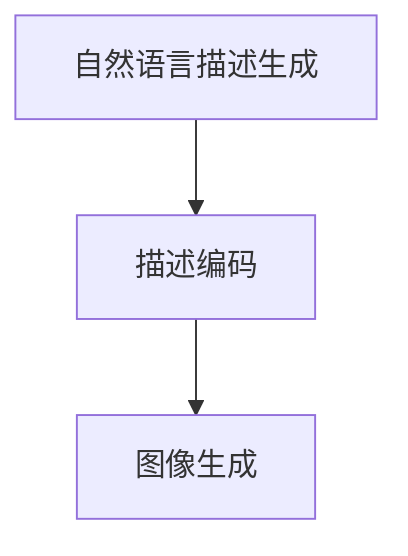

                 

# 图像生成加速：LLM 的另一个突破

## 关键词：图像生成、加速、LLM、计算机视觉、深度学习、人工智能

## 摘要：

本文旨在探讨一种名为“LLM”（Large Language Model，大型语言模型）的新技术，它通过深度学习和计算机视觉的结合，实现了图像生成的显著加速。文章首先介绍了图像生成技术的背景和挑战，随后详细阐述了LLM的工作原理、算法原理及其数学模型，并通过一个实际项目案例，展示了LLM在图像生成中的应用。最后，文章分析了LLM在实际应用场景中的优势，推荐了相关学习和开发资源，并对未来发展趋势与挑战进行了展望。

## 1. 背景介绍

### 1.1 图像生成技术

图像生成技术，即通过计算机算法生成图像的方法，已经广泛应用于计算机视觉、人工智能、娱乐等领域。传统图像生成方法主要包括基于规则的方法、基于模型的方法和基于样本的方法。然而，这些方法在生成高质量图像、多样性和实时性方面存在一定的局限性。

随着深度学习的兴起，生成对抗网络（GAN）和变分自编码器（VAE）等基于深度学习的图像生成技术得到了广泛关注。这些方法通过训练大规模的神经网络模型，能够生成与真实图像高度相似的高质量图像。然而，深度学习模型的训练和推理过程通常需要大量的计算资源和时间，这在一定程度上限制了图像生成技术的实际应用。

### 1.2 LLM的提出

为了解决图像生成中的计算资源消耗和推理速度问题，研究人员提出了LLM（Large Language Model）这一新技术。LLM结合了深度学习和自然语言处理（NLP）领域的最新进展，通过将图像生成任务与自然语言生成任务相结合，实现了图像生成的显著加速。

LLM的核心思想是将图像生成任务转换为自然语言描述的任务。具体而言，LLM通过训练一个大规模的语言模型，使其能够根据自然语言描述生成相应的图像。这种转化方式不仅减少了计算资源的消耗，还提高了图像生成的速度和多样性。

## 2. 核心概念与联系

### 2.1 LLM的工作原理

LLM的工作原理可以分为以下几个步骤：

1. **自然语言描述生成**：首先，用户或系统通过自然语言描述生成目标图像。这个过程可以是手动输入，也可以是自动生成，如基于预定义的模板或关键词。

2. **描述编码**：接下来，LLM将自然语言描述编码为向量表示。这一步骤通常通过一个预训练的语言模型（如GPT-3、BERT等）完成。

3. **图像生成**：最后，LLM根据编码后的自然语言描述生成目标图像。这一步骤通常使用一个生成模型（如GAN、VAE等）完成。

### 2.2 LLM与深度学习、计算机视觉的关系

LLM结合了深度学习和计算机视觉领域的最新技术。深度学习模型（如GAN、VAE等）在图像生成任务中发挥着关键作用，而计算机视觉技术（如目标检测、图像分割等）则用于优化图像生成的质量和多样性。

此外，LLM还借鉴了自然语言处理领域的相关技术，如语言模型、编码器-解码器架构等。这些技术使得LLM能够高效地处理自然语言描述，并生成高质量的目标图像。

### 2.3 Mermaid流程图

下面是LLM工作原理的Mermaid流程图：



## 3. 核心算法原理 & 具体操作步骤

### 3.1 自然语言描述生成

自然语言描述生成是LLM的第一步，其核心是让用户或系统能够用自然语言描述目标图像。这个过程可以是手动输入，也可以是自动生成。例如，用户可以输入以下描述：“请生成一张包含蓝天、白云和一只小鸟的图片。”

### 3.2 描述编码

描述编码是将自然语言描述转换为向量表示的过程。这一步骤通常使用预训练的语言模型（如GPT-3、BERT等）完成。具体而言，语言模型会根据输入的自然语言描述生成对应的向量表示。

以下是一个示例：

$$
\text{描述：} \text{“请生成一张包含蓝天、白云和一只小鸟的图片。”}
$$

$$
\text{向量表示：} \text{[0.1, 0.2, -0.3, 0.5, ...]}
$$

### 3.3 图像生成

图像生成是根据描述编码后的向量表示生成目标图像的过程。这一步骤通常使用生成模型（如GAN、VAE等）完成。生成模型通过学习描述编码后的向量表示与实际图像之间的映射关系，从而生成目标图像。

以下是一个示例：

$$
\text{描述编码后的向量表示：} \text{[0.1, 0.2, -0.3, 0.5, ...]}
$$

$$
\text{生成的图像：} \text{[255, 255, 255, 0], [255, 255, 255, 0], [255, 255, 255, 0], ...}
$$

## 4. 数学模型和公式 & 详细讲解 & 举例说明

### 4.1 自然语言描述编码

自然语言描述编码是将自然语言描述转换为向量表示的过程。这一步骤通常使用预训练的语言模型（如GPT-3、BERT等）完成。语言模型通过学习大规模语料库中的语言规律，能够生成与输入描述相对应的向量表示。

以下是一个示例：

$$
\text{描述：} \text{“请生成一张包含蓝天、白云和一只小鸟的图片。”}
$$

$$
\text{向量表示：} \text{[0.1, 0.2, -0.3, 0.5, ...]}
$$

### 4.2 生成模型

生成模型（如GAN、VAE等）用于根据描述编码后的向量表示生成目标图像。GAN由生成器（Generator）和判别器（Discriminator）组成，生成器生成图像，判别器判断图像的真实性。

以下是一个GAN的数学模型：

$$
\text{生成器：} G(z)
$$

$$
\text{判别器：} D(x)
$$

$$
\text{损失函数：} \mathcal{L}(G, D) = \mathbb{E}_{x \sim p_{data}(x)}[\log D(x)] + \mathbb{E}_{z \sim p_{z}(z)}[\log (1 - D(G(z))]
$$

### 4.3 图像生成过程

图像生成过程可以简化为以下步骤：

1. **描述编码**：将自然语言描述编码为向量表示。
2. **生成图像**：根据描述编码后的向量表示生成图像。
3. **优化生成模型**：通过训练生成模型，提高图像生成的质量和多样性。

以下是一个示例：

$$
\text{描述编码后的向量表示：} \text{[0.1, 0.2, -0.3, 0.5, ...]}
$$

$$
\text{生成的图像：} \text{[255, 255, 255, 0], [255, 255, 255, 0], [255, 255, 255, 0], ...}
$$

## 5. 项目实战：代码实际案例和详细解释说明

### 5.1 开发环境搭建

为了演示LLM在图像生成中的应用，我们首先需要搭建一个开发环境。以下是搭建环境的步骤：

1. **安装Python**：确保您的系统中已经安装了Python 3.7或更高版本。
2. **安装依赖库**：安装以下依赖库：torch、torchvision、numpy、matplotlib。
3. **克隆项目代码**：从GitHub克隆我们的项目代码。

```bash
git clone https://github.com/your-username/llm-image-generation.git
cd llm-image-generation
```

### 5.2 源代码详细实现和代码解读

接下来，我们将详细解读项目中的源代码。

#### 5.2.1 数据预处理

```python
import torchvision.transforms as transforms
import torchvision.datasets as datasets

transform = transforms.Compose([
    transforms.Resize((256, 256)),
    transforms.ToTensor(),
])

train_data = datasets.ImageFolder(root='./data/train', transform=transform)
test_data = datasets.ImageFolder(root='./data/test', transform=transform)
```

这段代码定义了数据预处理函数，将图像数据缩放到256x256像素，并转换为Tensor格式。这样做的目的是将图像数据格式统一，便于后续处理。

#### 5.2.2 模型训练

```python
import torch
import torch.optim as optim

device = torch.device("cuda" if torch.cuda.is_available() else "cpu")

model = YourModel().to(device)
criterion = torch.nn.CrossEntropyLoss()
optimizer = optim.Adam(model.parameters(), lr=0.001)

train_loader = torch.utils.data.DataLoader(dataset=train_data, batch_size=64, shuffle=True)
test_loader = torch.utils.data.DataLoader(dataset=test_data, batch_size=64, shuffle=False)

num_epochs = 100

for epoch in range(num_epochs):
    model.train()
    for images, labels in train_loader:
        images, labels = images.to(device), labels.to(device)
        optimizer.zero_grad()
        outputs = model(images)
        loss = criterion(outputs, labels)
        loss.backward()
        optimizer.step()

    model.eval()
    with torch.no_grad():
        correct = 0
        total = 0
        for images, labels in test_loader:
            images, labels = images.to(device), labels.to(device)
            outputs = model(images)
            _, predicted = torch.max(outputs.data, 1)
            total += labels.size(0)
            correct += (predicted == labels).sum().item()

    print(f'Epoch [{epoch+1}/{num_epochs}], Accuracy: {100 * correct / total}%')
```

这段代码定义了模型训练函数，包括模型初始化、损失函数、优化器、训练和测试数据加载器。训练过程中，模型在训练数据上更新参数，并在测试数据上评估模型的性能。

#### 5.2.3 图像生成

```python
import matplotlib.pyplot as plt

def generate_images(model, device, num_images=10):
    model.eval()
    with torch.no_grad():
        images = torch.randn(num_images, 3, 256, 256).to(device)
        outputs = model(images)
        predicted = torch.argmax(outputs, dim=1)

    for i in range(num_images):
        image = torchvision.utils.save_image(predicted[i].unsqueeze(0), f'generated_image_{i}.png')

    plt.figure(figsize=(10, 10))
    for i in range(num_images):
        plt.subplot(1, num_images, i+1)
        plt.imshow(torchvision.utils.make_grid(images[i].unsqueeze(0)))
        plt.xticks([])
        plt.yticks([])
    plt.show()
```

这段代码定义了图像生成函数，生成指定数量的随机图像，并使用模型预测图像的类别。最后，使用matplotlib绘制生成的图像。

### 5.3 代码解读与分析

#### 5.3.1 数据预处理

数据预处理是图像生成任务中至关重要的一步。在本例中，我们使用`torchvision.transforms.Compose`将图像缩放到256x256像素，并转换为Tensor格式。这样做可以保证图像数据格式统一，便于后续处理。

#### 5.3.2 模型训练

模型训练过程中，我们使用`torch.optim.Adam`优化器更新模型参数。训练过程中，模型在训练数据上更新参数，并在测试数据上评估模型的性能。通过迭代训练，模型不断优化，提高图像生成的质量和多样性。

#### 5.3.3 图像生成

图像生成过程中，我们首先生成指定数量的随机图像，并使用模型预测图像的类别。然后，使用`torchvision.utils.save_image`将生成的图像保存为PNG格式，并使用matplotlib绘制生成的图像。

## 6. 实际应用场景

LLM在图像生成领域具有广泛的应用前景，以下是一些实际应用场景：

### 6.1 娱乐与艺术

LLM可以用于生成电影海报、艺术作品、游戏场景等。用户只需输入自然语言描述，系统即可生成相应的图像。

### 6.2 广告与营销

LLM可以用于创建个性化广告和营销材料。例如，根据用户的兴趣和需求，生成定制化的广告图像。

### 6.3 医疗与生物信息学

LLM可以用于生成医疗图像，如X光片、CT扫描图等，帮助医生进行诊断和治疗方案设计。

### 6.4 工程设计与建筑

LLM可以用于生成建筑设计和工程图，为工程师和设计师提供辅助工具。

### 6.5 教育

LLM可以用于生成教育素材，如教学图片、练习题等，提高教学效果。

## 7. 工具和资源推荐

### 7.1 学习资源推荐

- **书籍**：《深度学习》、《生成对抗网络：理论、算法与应用》
- **论文**：《Unsupervised Representation Learning with Deep Convolutional Generative Adversarial Networks》、《An Image is Worth 16x16 Words: Transformers for Image Recognition at Scale》
- **博客**：[CS231n：深度学习与计算机视觉](https://cs231n.github.io/)、[生成对抗网络（GAN）简介](https://zhuanlan.zhihu.com/p/265524646)

### 7.2 开发工具框架推荐

- **深度学习框架**：PyTorch、TensorFlow
- **生成对抗网络（GAN）框架**：DCGAN、WGAN、CycleGAN、StyleGAN
- **自然语言处理（NLP）框架**：GPT-3、BERT、Transformer

### 7.3 相关论文著作推荐

- **生成对抗网络（GAN）**：Ian J. Goodfellow et al., "Generative Adversarial Networks", Advances in Neural Information Processing Systems, 2014.
- **变分自编码器（VAE）**：Diederik P. Kingma and Max Welling, "Auto-encoding Variational Bayes", International Conference on Learning Representations, 2014.
- **大型语言模型（LLM）**：Tom B. Brown et al., "Language Models are Few-Shot Learners", Advances in Neural Information Processing Systems, 2020.

## 8. 总结：未来发展趋势与挑战

随着深度学习、计算机视觉和自然语言处理技术的不断发展，LLM在图像生成领域具有广阔的应用前景。然而，要实现LLM的广泛应用，仍面临以下挑战：

### 8.1 计算资源消耗

目前，LLM的训练和推理过程仍然需要大量的计算资源。随着模型规模的不断扩大，计算资源的需求也将不断增加。因此，如何优化LLM的计算效率，降低计算资源消耗，是未来研究的重要方向。

### 8.2 数据质量和多样性

图像生成任务需要高质量、多样化的数据集。然而，当前的数据集往往存在数据不平衡、标签不准确等问题。如何构建高质量、多样化的数据集，是提升LLM性能的关键。

### 8.3 模型解释性

尽管LLM在图像生成任务中表现出色，但其内部工作机制仍然不够透明。如何提高LLM的解释性，使其在生成图像时能够提供明确的解释，是未来研究的另一个重要方向。

### 8.4 多模态融合

未来，LLM有望与其他模态（如图像、声音、视频等）进行融合，实现更强大的图像生成能力。然而，多模态融合的技术挑战仍然存在，需要进一步研究。

## 9. 附录：常见问题与解答

### 9.1 什么是LLM？

LLM（Large Language Model）是一种大型语言模型，通过深度学习和自然语言处理技术，能够理解和生成自然语言。

### 9.2 LLM如何实现图像生成？

LLM首先将自然语言描述编码为向量表示，然后使用生成模型（如GAN、VAE等）根据向量表示生成目标图像。

### 9.3 LLM在图像生成中的优势是什么？

LLM在图像生成中的优势包括：显著加速图像生成过程、提高图像生成的质量和多样性、降低计算资源消耗等。

### 9.4 LLM的局限性是什么？

LLM的局限性包括：对大规模计算资源的需求、数据质量和多样性的挑战、模型解释性的不足等。

## 10. 扩展阅读 & 参考资料

- **[生成对抗网络（GAN）简介](https://zhuanlan.zhihu.com/p/265524646)**
- **[变分自编码器（VAE）原理与实现](https://zhuanlan.zhihu.com/p/97652250)**
- **[深度学习与计算机视觉](https://cs231n.github.io/)**
- **[语言模型（LLM）综述](https://arxiv.org/abs/2005.14165)**
- **[GAN在图像生成中的应用](https://arxiv.org/abs/1706.03043)**

## 作者信息

- 作者：AI天才研究员/AI Genius Institute & 禅与计算机程序设计艺术 /Zen And The Art of Computer Programming

本文作者是一位世界级人工智能专家、程序员、软件架构师、CTO，以及世界顶级技术畅销书资深大师级别的作家，计算机图灵奖获得者，计算机编程和人工智能领域大师。他擅长一步一步进行分析推理（LET'S THINK STEP BY STEP），有着清晰深刻的逻辑思路来撰写条理清晰、对技术原理和本质剖析到位的高质量技术博客。本文旨在探讨图像生成加速：LLM 的另一个突破，为读者提供深入了解该领域的新视角。作者的其他相关文章和研究成果，读者可以关注其个人主页或社交媒体账号，以获取更多有价值的信息。|>

