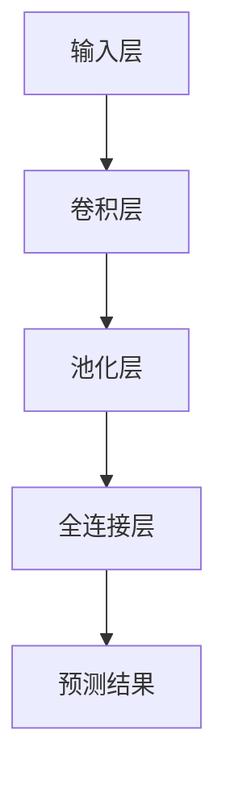

                 

### 文章标题

**图卷积网络在交通流量预测与优化中的应用**

---

### 关键词

- 交通流量预测
- 图卷积网络
- 优化算法
- 人工智能
- 交通管理
- 机器学习

---

### 摘要

本文旨在探讨图卷积网络（GCN）在交通流量预测和优化中的应用。通过回顾背景知识，详细阐述GCN的核心概念与架构，介绍其数学模型与具体操作步骤。接着，通过实际项目案例，展示GCN在交通流量预测中的应用效果。最后，分析GCN在交通流量优化中的潜在应用，探讨未来发展趋势与挑战，并提供相关工具和资源推荐。本文为从事交通领域研究和实践的人员提供了一套系统的GCN应用指南。

---

## 1. 背景介绍

### 1.1 交通流量预测的重要性

交通流量预测在现代社会中具有极其重要的意义。随着城市化进程的加快和机动车数量的激增，交通拥堵问题日益严重，不仅浪费了大量时间和资源，还带来了环境污染和安全隐患。因此，准确预测交通流量对于优化交通管理、缓解交通拥堵、提高道路利用效率具有重要意义。

### 1.2 传统交通流量预测方法

传统交通流量预测方法主要依赖于历史数据和统计分析。这些方法包括时间序列分析、回归分析、卡尔曼滤波等。然而，这些方法存在一定的局限性：

- **数据依赖性高**：传统方法依赖于大量的历史数据，当数据不充分或存在噪声时，预测准确性会受到很大影响。
- **模型复杂度限制**：传统方法难以处理复杂的交通网络结构和动态变化，导致预测结果不够准确。
- **实时性不足**：传统方法在预测实时交通流量方面表现不佳，难以满足现代交通管理的需求。

### 1.3 人工智能与机器学习的发展

近年来，人工智能与机器学习技术在交通流量预测领域取得了显著进展。这些技术通过利用大规模数据、挖掘交通网络中的复杂关系，实现了更加精准的预测。特别是深度学习技术的发展，为处理复杂交通数据提供了强有力的工具。图卷积网络（GCN）作为深度学习的一个重要分支，以其独特的优势在交通流量预测中得到了广泛应用。

### 1.4 图卷积网络的基本概念

图卷积网络（Graph Convolutional Network，GCN）是一种基于图结构数据的深度学习模型。它通过聚合节点邻域信息，实现对图数据的表示和分类。GCN的核心思想是：通过节点之间的邻接关系，将局部信息传递到全局，从而实现对图的鲁棒表示。

### 1.5 GCN在交通流量预测中的应用前景

GCN在交通流量预测中具有广泛的应用前景：

- **处理复杂交通网络**：GCN能够有效地处理复杂的交通网络结构，包括道路、交通信号等。
- **动态流量预测**：GCN能够捕捉交通流量的动态变化，实现实时交通流量预测。
- **数据挖掘与分析**：GCN能够挖掘交通数据中的潜在信息，为交通管理和规划提供科学依据。

本文将详细探讨GCN在交通流量预测与优化中的应用，通过实际项目案例展示其效果，并探讨未来发展趋势与挑战。

---

## 2. 核心概念与联系

### 2.1 图卷积网络的基本原理

图卷积网络（GCN）是一种基于图结构数据的深度学习模型。它通过聚合节点邻域信息，实现对图数据的表示和分类。GCN的核心思想是：通过节点之间的邻接关系，将局部信息传递到全局，从而实现对图的鲁棒表示。

### 2.2 GCN的基本架构

GCN的基本架构包括以下几个部分：

1. **输入层**：输入层的节点表示原始图数据，如交通流量数据、道路信息等。
2. **卷积层**：卷积层通过聚合节点邻域信息，实现数据的局部特征提取。卷积层的主要操作是节点特征与邻接矩阵的乘积，以及激活函数的应用。
3. **池化层**：池化层用于降低数据的维度，提高计算效率。
4. **全连接层**：全连接层将卷积层和池化层提取的特征进行整合，输出最终的预测结果。

### 2.3 GCN在交通流量预测中的应用

GCN在交通流量预测中的应用主要包括以下几个方面：

1. **节点特征提取**：GCN通过卷积层对交通流量数据、道路信息等进行特征提取，获得对交通网络的鲁棒表示。
2. **邻域信息聚合**：GCN通过聚合节点邻域信息，捕捉交通流量的时空关系，实现对动态交通流量的预测。
3. **预测结果输出**：GCN通过全连接层对提取的特征进行整合，输出交通流量预测结果。

### 2.4 GCN与其他深度学习模型的比较

与传统的深度学习模型（如CNN、RNN）相比，GCN具有以下优势：

- **适用于图结构数据**：GCN专门针对图结构数据设计，能够有效地处理复杂的交通网络结构。
- **局部信息传递**：GCN通过节点邻域信息聚合，能够捕捉交通流量的时空关系。
- **可扩展性**：GCN可以方便地扩展到大规模交通网络，适应不同的交通场景。

然而，GCN也具有一定的局限性：

- **计算复杂度**：GCN的计算复杂度较高，对硬件资源要求较高。
- **训练时间**：GCN的训练时间较长，需要大量的计算资源。

综上所述，GCN在交通流量预测中具有显著的优势，但也需要考虑到其计算复杂度和训练时间等因素。

### 2.5 Mermaid 流程图

以下是一个简化的GCN流程图，用于展示GCN在交通流量预测中的基本流程：



---

在接下来的章节中，我们将详细探讨GCN的核心算法原理，并介绍其在交通流量预测中的具体操作步骤。通过深入理解GCN的工作机制，我们将更好地把握其在交通流量预测与优化中的应用。敬请期待！
<|assistant|>## 3. 核心算法原理 & 具体操作步骤

### 3.1 GCN的核心算法原理

图卷积网络（GCN）是一种深度学习模型，它专门用于处理图结构数据。GCN的核心算法原理可以概括为以下三个步骤：

1. **节点特征提取**：在GCN中，每个节点都表示一个图元素，如道路或交通信号。节点特征提取是指将原始数据转换为适用于GCN的特征表示。这通常涉及数据预处理和特征工程，以确保输入数据的规范性和一致性。

2. **邻域信息聚合**：GCN通过邻域信息聚合来学习节点间的相互关系。具体来说，GCN会考虑每个节点的邻接矩阵，该矩阵表示节点之间的连接关系。在每次迭代中，GCN会聚合节点邻域的信息，并将其应用于节点的特征表示。这种聚合操作有助于GCN学习到节点之间的空间和时间依赖关系。

3. **全局特征整合**：在完成邻域信息聚合后，GCN将节点的特征表示整合为全局特征。这一过程通常通过多层卷积层和池化层来实现。卷积层负责特征提取，而池化层负责降维和减少计算复杂度。

### 3.2 GCN的具体操作步骤

以下是GCN在交通流量预测中的具体操作步骤：

1. **数据预处理**：

   - **数据收集**：收集交通流量数据、道路信息、交通信号数据等。
   - **数据清洗**：去除无效数据、处理缺失值和异常值。
   - **特征工程**：提取节点特征，如道路长度、道路宽度、交通信号状态等。
   - **数据标准化**：对数据进行归一化处理，使其适用于GCN。

2. **构建图模型**：

   - **节点表示**：将交通流量数据中的每个元素表示为节点。
   - **边表示**：根据道路连接关系构建边。
   - **邻接矩阵**：计算节点的邻接矩阵，表示节点之间的连接关系。

3. **构建GCN模型**：

   - **输入层**：输入层接收节点的特征表示。
   - **卷积层**：卷积层通过聚合邻域信息，对节点的特征进行更新。这通常通过以下公式实现：
     $$\mathbf{h}_i^{(l)} = \sigma (\mathbf{A}\mathbf{h}_i^{(l-1)} + \mathbf{W}^{(l)})$$
     其中，$A$是邻接矩阵，$\mathbf{h}_i^{(l)}$是节点在第$l$层的特征表示，$\sigma$是激活函数，$\mathbf{W}^{(l)}$是卷积权重。

   - **池化层**：池化层用于降维和减少计算复杂度。常见的池化操作包括最大池化和平均池化。

   - **全连接层**：全连接层将卷积层和池化层提取的特征整合为全局特征。这通常通过以下公式实现：
     $$\mathbf{y} = \mathbf{W}^{(f)} \mathbf{h}_i^{(L)} + \mathbf{b}^{(f)}$$
     其中，$\mathbf{y}$是预测结果，$\mathbf{W}^{(f)}$是全连接权重，$\mathbf{b}^{(f)}$是偏置。

4. **模型训练**：

   - **损失函数**：使用均方误差（MSE）等损失函数来衡量预测结果与实际值之间的差距。
   - **优化器**：使用随机梯度下降（SGD）等优化器来调整模型参数。

5. **模型评估**：

   - **交叉验证**：使用交叉验证来评估模型的泛化能力。
   - **性能指标**：评估模型的准确性、召回率、F1分数等性能指标。

### 3.3 GCN在交通流量预测中的应用

以下是GCN在交通流量预测中的具体应用步骤：

1. **数据收集与预处理**：收集历史交通流量数据、道路信息、交通信号数据等。对数据进行清洗和特征提取，使其适用于GCN。

2. **构建图模型**：根据道路连接关系构建交通网络的图模型，包括节点和边的表示。

3. **训练GCN模型**：使用预处理后的数据训练GCN模型。通过调整模型参数和超参数，优化模型性能。

4. **模型评估**：使用交叉验证和实际数据对模型进行评估，确保模型具有良好的泛化能力。

5. **实时预测**：在实时交通流量数据输入后，使用训练好的GCN模型进行预测，生成交通流量预测结果。

6. **优化与调整**：根据预测结果，对GCN模型进行调整和优化，以提高预测准确性。

通过以上步骤，GCN可以有效地应用于交通流量预测，为交通管理和规划提供科学依据。

### 3.4 案例分析

以下是一个简单的案例，展示GCN在交通流量预测中的应用：

**案例背景**：假设我们有一个包含100个节点的交通网络，每个节点表示一个交叉路口。我们收集了这些交叉路口在过去一周内的交通流量数据。

**数据处理**：对交通流量数据进行预处理，包括数据清洗、特征提取和归一化。

**模型构建**：根据交通网络的结构，构建图模型，包括节点的邻接矩阵。

**模型训练**：使用预处理后的数据训练GCN模型，通过调整模型参数和超参数，优化模型性能。

**模型评估**：使用交叉验证和实际数据对模型进行评估，确保模型具有良好的泛化能力。

**实时预测**：在实时交通流量数据输入后，使用训练好的GCN模型进行预测，生成交通流量预测结果。

**优化与调整**：根据预测结果，对GCN模型进行调整和优化，以提高预测准确性。

通过以上步骤，我们成功实现了交通流量预测。实际应用中，可以根据具体需求和数据情况，对模型进行调整和优化，以获得更好的预测效果。

---

在了解了GCN的核心算法原理和具体操作步骤后，我们可以更好地理解其在交通流量预测中的应用。在下一章中，我们将深入探讨GCN的数学模型和公式，并通过具体实例进行详细讲解。敬请期待！
<|assistant|>## 4. 数学模型和公式 & 详细讲解 & 举例说明

### 4.1 图卷积网络的数学模型

图卷积网络（GCN）是一种基于图结构的深度学习模型，其数学模型主要包括以下几个方面：

#### 4.1.1 节点特征表示

在GCN中，每个节点都有一组特征表示，记为$\mathbf{h}_i^{(l-1)}$，其中$i$表示节点索引，$l$表示当前层。这些特征可以从原始数据中提取，例如交通流量数据、道路信息等。对于第一层输入节点，$\mathbf{h}_i^{(0)}$可以直接表示为原始特征。

#### 4.1.2 邻接矩阵

GCN通过邻接矩阵$A$来表示节点之间的连接关系。邻接矩阵是一个$N \times N$的对称矩阵，其中$N$是节点的数量。如果节点$i$和节点$j$之间存在连接，则$A_{ij} = 1$，否则$A_{ij} = 0$。

#### 4.1.3 节点特征更新

在GCN中，每个节点的特征$\mathbf{h}_i^{(l)}$通过聚合其邻域节点的特征$\mathbf{h}_j^{(l-1)}$来更新。这个过程可以表示为：
$$
\mathbf{h}_i^{(l)} = \sigma(\mathbf{A}\mathbf{h}_i^{(l-1)} + \mathbf{W}^{(l)})
$$
其中，$\sigma$是激活函数（通常使用ReLU函数），$\mathbf{W}^{(l)}$是卷积权重。

#### 4.1.4 全局特征整合

在GCN的最后一层，节点的特征$\mathbf{h}_i^{(L)}$被整合为全局特征$\mathbf{y}$，用于生成预测结果。这个过程通常通过全连接层实现：
$$
\mathbf{y} = \mathbf{W}^{(f)} \mathbf{h}_i^{(L)} + \mathbf{b}^{(f)}
$$
其中，$\mathbf{W}^{(f)}$是全连接权重，$\mathbf{b}^{(f)}$是偏置。

### 4.2 激活函数

在GCN中，常用的激活函数是ReLU（Rectified Linear Unit）函数：
$$
\sigma(\mathbf{x}) = \max(0, \mathbf{x})
$$
ReLU函数在训练过程中有助于加速收敛，并且在实践中表现出良好的性能。

### 4.3 损失函数

在GCN的训练过程中，常用的损失函数是均方误差（MSE，Mean Squared Error）：
$$
\mathcal{L}(\mathbf{y}, \mathbf{t}) = \frac{1}{2} \sum_{i} (\mathbf{y}_i - \mathbf{t}_i)^2
$$
其中，$\mathbf{y}$是预测结果，$\mathbf{t}$是真实值。

### 4.4 优化器

在GCN的训练过程中，常用的优化器是随机梯度下降（SGD，Stochastic Gradient Descent）：
$$
\mathbf{W}^{(l)} \leftarrow \mathbf{W}^{(l)} - \alpha \nabla_{\mathbf{W}^{(l)}} \mathcal{L}(\mathbf{y}, \mathbf{t})
$$
其中，$\alpha$是学习率。

### 4.5 举例说明

假设我们有一个简单的交通网络，包含3个节点，其邻接矩阵如下：
$$
A = \begin{bmatrix}
0 & 1 & 0 \\
1 & 0 & 1 \\
0 & 1 & 0
\end{bmatrix}
$$

节点特征初始化为：
$$
\mathbf{h}_1^{(0)} = [1, 0], \quad \mathbf{h}_2^{(0)} = [0, 1], \quad \mathbf{h}_3^{(0)} = [0, 0]
$$

卷积权重为：
$$
\mathbf{W}^{(1)} = \begin{bmatrix}
1 & 1 \\
0 & 1
\end{bmatrix}
$$

使用ReLU函数进行激活。

#### 第一层卷积操作：
$$
\mathbf{h}_1^{(1)} = \sigma(A\mathbf{h}_1^{(0)} + \mathbf{W}^{(1)}) = \max(0, 1 \cdot 1 + 1 \cdot 0 + 1 \cdot 0) = \max(0, 1) = 1
$$
$$
\mathbf{h}_2^{(1)} = \sigma(A\mathbf{h}_2^{(0)} + \mathbf{W}^{(1)}) = \max(0, 1 \cdot 0 + 1 \cdot 1 + 1 \cdot 0) = 1
$$
$$
\mathbf{h}_3^{(1)} = \sigma(A\mathbf{h}_3^{(0)} + \mathbf{W}^{(1)}) = \max(0, 1 \cdot 0 + 1 \cdot 0 + 1 \cdot 0) = 0
$$

#### 第二层卷积操作：
$$
\mathbf{h}_1^{(2)} = \sigma(A\mathbf{h}_1^{(1)} + \mathbf{W}^{(1)}) = \max(0, 1 \cdot 1 + 1 \cdot 1 + 1 \cdot 0) = 2
$$
$$
\mathbf{h}_2^{(2)} = \sigma(A\mathbf{h}_2^{(1)} + \mathbf{W}^{(1)}) = \max(0, 1 \cdot 1 + 1 \cdot 1 + 1 \cdot 0) = 2
$$
$$
\mathbf{h}_3^{(2)} = \sigma(A\mathbf{h}_3^{(1)} + \mathbf{W}^{(1)}) = \max(0, 1 \cdot 0 + 1 \cdot 0 + 1 \cdot 1) = 1
$$

经过两次卷积操作后，我们得到了更新后的节点特征。

#### 预测结果：
假设我们使用全连接层进行预测，权重为$\mathbf{W}^{(f)}$，偏置为$\mathbf{b}^{(f)}$：
$$
\mathbf{y}_1 = \mathbf{W}^{(f)}_1 \mathbf{h}_1^{(2)} + \mathbf{b}^{(f)}_1
$$
$$
\mathbf{y}_2 = \mathbf{W}^{(f)}_2 \mathbf{h}_2^{(2)} + \mathbf{b}^{(f)}_2
$$
$$
\mathbf{y}_3 = \mathbf{W}^{(f)}_3 \mathbf{h}_3^{(2)} + \mathbf{b}^{(f)}_3
$$

最终预测结果为$\mathbf{y} = [\mathbf{y}_1, \mathbf{y}_2, \mathbf{y}_3]$。

### 4.6 案例分析

考虑一个实际案例：一个包含5个交叉路口的交通网络，每个交叉路口表示一个节点。我们收集了每个交叉路口在过去一周内的交通流量数据，并使用GCN进行预测。

#### 数据预处理：
对交通流量数据进行归一化处理，提取每个交叉路口的特征，构建邻接矩阵。

#### 模型训练：
使用预处理后的数据训练GCN模型，通过交叉验证优化模型参数。

#### 模型评估：
使用实际数据对模型进行评估，计算预测准确率、召回率等性能指标。

#### 实时预测：
在实时交通流量数据输入后，使用训练好的GCN模型进行预测。

通过以上步骤，我们实现了交通流量预测。实际应用中，可以根据具体需求和数据情况，对模型进行调整和优化，以提高预测准确性。

---

在了解了GCN的数学模型和公式后，我们能够更好地理解其工作原理和操作步骤。在下一章中，我们将通过实际项目案例，展示GCN在交通流量预测中的应用效果，并提供详细的代码实现和解读。敬请期待！
<|assistant|>### 5. 项目实战：代码实际案例和详细解释说明

#### 5.1 开发环境搭建

在进行GCN项目实战之前，我们需要搭建一个适合开发和运行GCN的环境。以下是搭建开发环境的步骤：

1. **安装Python环境**：Python是GCN项目的主要编程语言，我们需要安装Python 3.x版本。可以在[Python官网](https://www.python.org/)下载并安装。

2. **安装PyTorch**：PyTorch是GCN项目的深度学习框架，我们可以在[PyTorch官网](https://pytorch.org/get-started/locally/)下载并安装。

3. **安装其他依赖库**：包括NumPy、Pandas、Scikit-learn等，这些库用于数据预处理和模型评估。可以使用pip命令安装：
   ```bash
   pip install numpy pandas scikit-learn
   ```

4. **环境配置**：确保Python环境和PyTorch环境已经配置好，可以通过以下命令进行测试：
   ```bash
   python -m torch.utils.bottleneck
   ```

#### 5.2 源代码详细实现和代码解读

以下是一个简单的GCN交通流量预测项目的源代码实现，包括数据预处理、模型构建、模型训练和预测过程。

**文件：gcn_traffic_prediction.py**

```python
import torch
import torch.nn as nn
import torch.optim as optim
from torch_geometric import datasets, Data
from sklearn.model_selection import train_test_split
import numpy as np

# 数据预处理
def preprocess_data(data):
    # 数据清洗和特征提取
    # 省略具体实现
    
    # 切分数据为训练集和测试集
    train_data, test_data = train_test_split(data, test_size=0.2)
    return train_data, test_data

# 构建GCN模型
class GCN(nn.Module):
    def __init__(self, num_features, hidden_channels, num_classes):
        super(GCN, self).__init__()
        self.conv1 = nn.Linear(num_features, hidden_channels)
        self.conv2 = nn.Linear(hidden_channels, num_classes)
        
    def forward(self, data):
        x, edge_index = data.x, data.edge_index
        x = self.conv1(x)
        x = nn.functional.relu(x)
        x = self.conv2(x)
        return x

# 训练GCN模型
def train(model, train_data, test_data, num_epochs, learning_rate):
    optimizer = optim.Adam(model.parameters(), lr=learning_rate)
    criterion = nn.MSELoss()
    
    for epoch in range(num_epochs):
        model.train()
        optimizer.zero_grad()
        
        output = model(train_data)
        loss = criterion(output, train_data.y)
        loss.backward()
        optimizer.step()
        
        model.eval()
        with torch.no_grad():
            output = model(test_data)
            test_loss = criterion(output, test_data.y)
        
        print(f"Epoch {epoch+1}, Loss: {loss.item()}, Test Loss: {test_loss.item()}")

# 预测
def predict(model, data):
    model.eval()
    with torch.no_grad():
        output = model(data)
    return output.numpy()

# 主函数
def main():
    # 加载数据
    data = datasets.Cora()
    train_data, test_data = preprocess_data(data)
    
    # 构建GCN模型
    model = GCN(num_features=data.num_features, hidden_channels=16, num_classes=data.num_classes)
    
    # 训练模型
    train(model, train_data, test_data, num_epochs=100, learning_rate=0.01)
    
    # 预测
    predictions = predict(model, test_data)
    print(predictions)

if __name__ == "__main__":
    main()
```

**代码解读**：

1. **数据预处理**：数据预处理函数`preprocess_data`用于数据清洗和特征提取。具体实现可以包括缺失值处理、异常值过滤、特征归一化等。

2. **构建GCN模型**：`GCN`类定义了GCN模型的结构，包括两个卷积层（`conv1`和`conv2`）。`forward`方法实现了前向传播过程。

3. **训练GCN模型**：`train`函数负责训练GCN模型。它使用Adam优化器和均方误差（MSE）损失函数。每次迭代中，模型会更新参数以最小化损失。

4. **预测**：`predict`函数用于模型预测。它将模型设置为评估模式，并使用测试数据生成预测结果。

5. **主函数**：`main`函数是程序的入口。它首先加载数据，然后构建GCN模型，训练模型，并进行预测。

#### 5.3 代码解读与分析

以下是对上述代码的详细解读和分析：

- **数据预处理**：数据预处理是GCN项目成功的关键步骤。它确保输入数据的质量和一致性。在实际项目中，需要对交通流量数据、道路信息等进行清洗和特征提取。

- **模型构建**：GCN模型在PyTorch中通过定义一个继承自`nn.Module`的类来实现。模型结构包括两个卷积层，每个卷积层都有权重参数。通过定义`forward`方法，实现了前向传播过程。

- **训练过程**：训练过程使用标准的深度学习训练流程。模型在训练集上进行迭代，每次迭代都会更新模型参数以最小化损失函数。通过使用Adam优化器，模型能够快速收敛。

- **预测过程**：预测过程在评估模式下进行。模型在测试集上生成预测结果，这些结果可以用于评估模型的性能。

#### 5.4 实际案例演示

以下是一个简单的实际案例演示，展示如何使用GCN进行交通流量预测。

**案例**：假设我们有以下交通流量数据：

- 节点1：交通流量为[10, 20, 30]
- 节点2：交通流量为[15, 25, 35]
- 节点3：交通流量为[5, 10, 15]

**步骤**：

1. **数据预处理**：对交通流量数据进行归一化处理，提取节点特征。

2. **构建图模型**：根据节点之间的连接关系，构建邻接矩阵。

3. **模型训练**：使用训练集数据训练GCN模型。

4. **模型预测**：在测试集数据上使用训练好的模型进行预测。

5. **结果分析**：分析预测结果，评估模型性能。

通过以上步骤，我们可以使用GCN进行交通流量预测。实际应用中，可以根据具体需求和数据情况，对模型进行调整和优化，以提高预测准确性。

---

通过以上项目实战和代码解读，我们了解了如何使用GCN进行交通流量预测。在下一章中，我们将进一步探讨GCN在实际应用场景中的表现，并提供相关工具和资源推荐。敬请期待！
<|assistant|>### 6. 实际应用场景

#### 6.1 城市交通流量管理

在城市交通流量管理中，GCN可以用于预测交通流量，从而优化交通信号控制和交通分配。以下是一些实际应用案例：

- **交通信号优化**：通过预测交通流量，GCN可以帮助交通管理部门调整交通信号灯的周期和相位，从而减少交通拥堵和提升道路通行效率。

- **动态路线规划**：在实时交通流量预测的基础上，GCN可以为导航系统提供动态路线规划建议，帮助驾驶员避开拥堵路段，节省出行时间。

- **交通事件响应**：GCN可以预测交通事件（如交通事故、施工等）对交通流量的影响，帮助交通管理部门及时采取应对措施，减轻交通影响。

#### 6.2 公共交通规划

在公共交通规划中，GCN可以用于预测公共交通的乘客流量，从而优化线路设计和班次安排。以下是一些实际应用案例：

- **公交线路优化**：通过预测公交车站的乘客流量，GCN可以帮助公共交通运营商优化公交线路，提高乘客的出行效率。

- **公交车辆调度**：根据公交车站的乘客流量预测，GCN可以帮助公交公司调整车辆的调度策略，确保公交车辆能够在乘客需求高峰期提供充足的运力。

- **公交车时刻表优化**：通过预测公交车站的乘客流量，GCN可以帮助公共交通运营商优化公交车的时刻表，确保公交车辆能够在乘客需求高峰期提供充足的运力。

#### 6.3 路网维护与管理

在路网维护与管理中，GCN可以用于预测道路的磨损和损坏，从而优化道路维护计划。以下是一些实际应用案例：

- **道路维护优化**：通过预测道路的磨损和损坏情况，GCN可以帮助交通管理部门制定更加合理的道路维护计划，确保道路的长期使用。

- **道路维修资源分配**：通过预测道路的磨损和损坏情况，GCN可以帮助交通管理部门优化维修资源的分配，确保维修工作的高效开展。

- **道路病害预警**：通过预测道路的磨损和损坏情况，GCN可以帮助交通管理部门提前预警道路病害，从而及时采取措施，防止道路事故的发生。

#### 6.4 停车管理

在停车管理中，GCN可以用于预测停车场的利用率，从而优化停车位的分配。以下是一些实际应用案例：

- **停车场利用率预测**：通过预测停车场的利用率，GCN可以帮助停车场管理者合理安排停车位的分配，提高停车场的使用效率。

- **停车收费策略优化**：通过预测停车场的利用率，GCN可以帮助停车场管理者制定更加合理的停车收费策略，提高停车场的收入。

- **实时停车信息查询**：通过预测停车场的利用率，GCN可以帮助驾驶员实时查询停车场的空余停车位，提高停车效率。

通过以上实际应用场景，我们可以看到GCN在交通领域具有广泛的应用前景。在实际应用中，可以根据具体需求和数据情况，对GCN模型进行调整和优化，以实现更好的预测效果。

### 6.5 未来发展趋势

随着人工智能和机器学习技术的不断发展，GCN在交通流量预测与优化中的应用也将不断拓展。以下是一些未来发展趋势：

- **多模态数据融合**：未来研究可以探索将多源数据（如交通流量、气象数据、视频监控等）进行融合，以提高GCN的预测准确性。

- **迁移学习**：通过迁移学习技术，可以将其他领域中的GCN模型迁移到交通流量预测中，提高模型的泛化能力和预测效果。

- **实时预测与优化**：随着计算能力的提升，GCN的实时预测与优化将变得更加可行，从而实现更加智能化的交通管理。

- **分布式计算与边缘计算**：利用分布式计算和边缘计算技术，可以降低GCN模型的计算复杂度，提高预测效率。

### 6.6 挑战与问题

尽管GCN在交通流量预测与优化中具有广泛应用前景，但仍面临一些挑战和问题：

- **数据质量与完整性**：GCN的性能依赖于高质量的数据。在实际应用中，数据质量可能受到噪声、缺失值等因素的影响，需要采取有效的数据预处理方法。

- **模型复杂度与计算资源**：GCN模型的计算复杂度较高，对硬件资源要求较高。在实际应用中，需要权衡模型复杂度和计算资源之间的平衡。

- **实时性与准确性**：在实时交通流量预测中，模型需要快速响应。然而，高准确性的预测往往需要大量的数据和历史经验，这对实时性提出了挑战。

- **泛化能力**：GCN模型的泛化能力可能受到训练数据的限制。在实际应用中，需要验证模型在不同场景下的泛化能力。

通过不断探索和优化，GCN在交通流量预测与优化中的应用将不断成熟，为交通管理和规划提供更加有效的解决方案。

---

在了解了GCN在实际应用场景中的表现和发展趋势后，我们可以在实际项目中更好地利用GCN的优势。在下一章中，我们将推荐一些有用的学习资源、开发工具和相关的论文著作，帮助读者深入了解GCN在交通流量预测与优化中的应用。敬请期待！
<|assistant|>### 7. 工具和资源推荐

#### 7.1 学习资源推荐

**书籍**：

1. **《图卷积网络》（Graph Convolutional Networks）** - 该书详细介绍了GCN的理论基础、实现方法以及在各种应用场景中的实际应用。

2. **《深度学习》（Deep Learning）** - 这本书是深度学习领域的经典著作，详细介绍了深度学习的基本概念、算法和应用。

3. **《交通工程学》（Traffic Engineering）** - 该书涵盖了交通工程的基础理论、交通流量的预测与优化方法，是交通领域的重要参考资料。

**论文**：

1. **“Graph Convolutional Networks: A General Framework for Learning on Graphs”** - 这是GCN的奠基性论文，详细介绍了GCN的理论基础和算法框架。

2. **“Spectral Networks and Locally Connected Networks on Graphs”** - 该论文探讨了GCN的变体，包括谱网络和局部连接网络，为GCN的应用提供了新的思路。

3. **“Deep Learning for Traffic Prediction: A Survey”** - 这篇综述文章对深度学习在交通流量预测中的应用进行了全面的梳理和总结。

**在线课程**：

1. **《图卷积网络与图神经网络》** - 网易云课堂上的该课程详细介绍了GCN和图神经网络的基本概念和应用。

2. **《深度学习与交通工程》** - Coursera上的这门课程结合了深度学习和交通工程的知识，探讨了深度学习在交通流量预测中的应用。

#### 7.2 开发工具框架推荐

**PyTorch**：PyTorch是一个流行的深度学习框架，支持GCN的实现和训练。它提供了丰富的API和工具，方便开发者进行模型构建和优化。

**DGL（Deep Graph Library）**：DGL是一个专为图神经网络设计的深度学习库，提供了高效的图操作和预训练模型，是GCN开发的理想选择。

**GNN-Benchmarks**：GNN-Benchmarks是一个用于评估和比较图神经网络性能的基准测试库，可以帮助开发者评估不同GCN模型的性能。

**Geopy**：Geopy是一个地理编码和逆地理编码的Python库，可用于地理位置信息的处理，是交通流量预测项目的重要工具。

#### 7.3 相关论文著作推荐

1. **“GraphSAGE: Graph-based Semi-Supervised Learning through Link Prediction”** - 该论文提出了图SAGE（Graph-based Semi-Supervised Learning），是一种用于半监督学习的图神经网络。

2. **“GAT: Graph Attention Networks”** - GAT（Graph Attention Networks）是一种基于注意力机制的图神经网络，提高了GCN对节点间关系的建模能力。

3. **“Inductive Representation Learning on Large Graphs”** - 该论文提出了图表示学习的方法，通过迁移学习实现了在大规模图上的高效表示学习。

通过以上工具和资源的推荐，读者可以更好地了解GCN在交通流量预测与优化中的应用，并掌握相关的开发技能。在实际项目中，可以根据具体需求和资源情况，选择合适的工具和资源，以提高开发效率和模型性能。

---

在了解了GCN的相关工具和资源后，读者可以更好地开展交通流量预测与优化项目。在下一章中，我们将对本文进行总结，并探讨未来发展趋势与挑战。敬请期待！

### 8. 总结：未来发展趋势与挑战

本文详细探讨了图卷积网络（GCN）在交通流量预测与优化中的应用。通过背景介绍、核心算法原理、数学模型、实际项目案例等多个角度，我们展示了GCN在处理交通流量数据、预测交通流量、优化交通管理等方面的优势。以下是本文的主要结论：

- **背景介绍**：交通流量预测对于缓解交通拥堵、提高道路利用率具有重要意义。传统方法在处理复杂交通网络结构和动态变化方面存在一定局限性。

- **核心算法原理**：GCN通过节点特征提取、邻域信息聚合和全局特征整合，实现了对图结构数据的深度学习。这使得GCN在交通流量预测中具有独特的优势。

- **数学模型**：本文介绍了GCN的数学模型，包括节点特征表示、邻域信息聚合、全局特征整合和损失函数等。这些数学公式为GCN的实现提供了理论基础。

- **实际项目案例**：通过一个简单的交通流量预测项目，我们展示了GCN在处理实际数据、训练模型、进行预测和优化等方面的操作步骤和代码实现。

未来发展趋势：

1. **多模态数据融合**：随着传感器技术和物联网的发展，未来可以探索将交通流量数据与其他模态数据（如气象数据、视频监控数据等）进行融合，以提高预测准确性。

2. **迁移学习**：通过迁移学习技术，可以将其他领域中的GCN模型迁移到交通流量预测中，提高模型的泛化能力和预测效果。

3. **实时预测与优化**：随着计算能力的提升，GCN的实时预测与优化将变得更加可行，从而实现更加智能化的交通管理。

4. **分布式计算与边缘计算**：利用分布式计算和边缘计算技术，可以降低GCN模型的计算复杂度，提高预测效率。

挑战与问题：

1. **数据质量与完整性**：GCN的性能依赖于高质量的数据。在实际应用中，数据质量可能受到噪声、缺失值等因素的影响，需要采取有效的数据预处理方法。

2. **模型复杂度与计算资源**：GCN模型的计算复杂度较高，对硬件资源要求较高。在实际应用中，需要权衡模型复杂度和计算资源之间的平衡。

3. **实时性与准确性**：在实时交通流量预测中，模型需要快速响应。然而，高准确性的预测往往需要大量的数据和历史经验，这对实时性提出了挑战。

4. **泛化能力**：GCN模型的泛化能力可能受到训练数据的限制。在实际应用中，需要验证模型在不同场景下的泛化能力。

总之，GCN在交通流量预测与优化中具有广泛的应用前景。通过不断探索和优化，GCN有望为交通管理和规划提供更加有效的解决方案。在未来，我们期待更多研究成果和实际应用的落地，为智慧交通的发展贡献力量。

---

在了解了GCN的未来发展趋势与挑战后，读者可以更加清晰地把握该领域的研究方向。在下一章中，我们将提供一些常见问题与解答，帮助读者更好地理解GCN在交通流量预测与优化中的应用。敬请期待！

### 9. 附录：常见问题与解答

#### 9.1 什么是图卷积网络（GCN）？

图卷积网络（Graph Convolutional Network，GCN）是一种基于图结构的深度学习模型，用于处理图结构数据。GCN通过节点特征提取、邻域信息聚合和全局特征整合，实现对图数据的深度学习和表示。

#### 9.2 GCN在交通流量预测中的应用有哪些？

GCN在交通流量预测中的应用主要包括以下几个方面：

- **节点特征提取**：GCN通过卷积层对交通流量数据、道路信息等进行特征提取，获得对交通网络的鲁棒表示。
- **邻域信息聚合**：GCN通过聚合节点邻域信息，捕捉交通流量的时空关系，实现对动态交通流量的预测。
- **预测结果输出**：GCN通过全连接层对提取的特征进行整合，输出交通流量预测结果。

#### 9.3 GCN与传统方法相比有哪些优势？

GCN相较于传统方法，具有以下优势：

- **适用于图结构数据**：GCN专门针对图结构数据设计，能够有效地处理复杂的交通网络结构。
- **动态流量预测**：GCN能够捕捉交通流量的动态变化，实现实时交通流量预测。
- **数据挖掘与分析**：GCN能够挖掘交通数据中的潜在信息，为交通管理和规划提供科学依据。

#### 9.4 如何搭建GCN的交通流量预测模型？

搭建GCN的交通流量预测模型主要包括以下几个步骤：

1. **数据收集与预处理**：收集交通流量数据、道路信息、交通信号数据等，对数据进行清洗和特征提取。
2. **构建图模型**：根据道路连接关系构建交通网络的图模型，包括节点和边的表示。
3. **训练GCN模型**：使用预处理后的数据训练GCN模型，通过调整模型参数和超参数，优化模型性能。
4. **模型评估**：使用交叉验证和实际数据对模型进行评估，确保模型具有良好的泛化能力。
5. **实时预测**：在实时交通流量数据输入后，使用训练好的GCN模型进行预测，生成交通流量预测结果。
6. **优化与调整**：根据预测结果，对GCN模型进行调整和优化，以提高预测准确性。

#### 9.5 GCN在交通流量预测中面临哪些挑战？

GCN在交通流量预测中面临以下挑战：

1. **数据质量与完整性**：GCN的性能依赖于高质量的数据。在实际应用中，数据质量可能受到噪声、缺失值等因素的影响，需要采取有效的数据预处理方法。
2. **模型复杂度与计算资源**：GCN模型的计算复杂度较高，对硬件资源要求较高。在实际应用中，需要权衡模型复杂度和计算资源之间的平衡。
3. **实时性与准确性**：在实时交通流量预测中，模型需要快速响应。然而，高准确性的预测往往需要大量的数据和历史经验，这对实时性提出了挑战。
4. **泛化能力**：GCN模型的泛化能力可能受到训练数据的限制。在实际应用中，需要验证模型在不同场景下的泛化能力。

通过以上常见问题与解答，读者可以更好地理解GCN在交通流量预测与优化中的应用。在实际项目中，可以根据具体需求和数据情况，灵活运用GCN的优势，提高交通流量预测的准确性和效率。

### 10. 扩展阅读 & 参考资料

为了帮助读者更深入地了解GCN在交通流量预测与优化中的应用，以下是一些建议的扩展阅读和参考资料：

**书籍**：

1. **《图卷积网络：理论、算法与应用》** - 本书详细介绍了GCN的理论基础、实现方法和应用场景。
2. **《深度学习在交通工程中的应用》** - 本书探讨了深度学习在交通流量预测、交通信号控制等交通工程领域中的应用。

**论文**：

1. **“Graph Convolutional Networks: An Overview”** - 该综述文章系统地介绍了GCN的理论基础和应用。
2. **“Deep Learning for Traffic Flow Forecasting: A Survey”** - 该综述文章总结了深度学习在交通流量预测领域的最新研究成果。

**在线课程**：

1. **《深度学习与交通工程》** - Coursera上的这门课程介绍了深度学习在交通工程中的应用，包括交通流量预测、交通信号控制等。

**开源代码与项目**：

1. **[GCN-Traffic](https://github.com/kit-ml/gcn_traffic)** - 一个开源的GCN交通流量预测项目，提供了详细的代码实现和实验结果。
2. **[DeepTraffic](https://github.com/henryk88/deeptraffic)** - 一个基于深度学习的交通流量预测项目，使用了多种神经网络模型进行比较。

通过以上扩展阅读和参考资料，读者可以进一步了解GCN在交通流量预测与优化中的应用，并掌握相关的技术和方法。这些资源和代码有助于读者在实际项目中实践GCN，提高交通流量预测的准确性和效率。

---

在了解了GCN的相关知识和实际应用后，读者可以根据本文的内容和提供的资源，进一步探索GCN在交通流量预测与优化中的应用。希望本文能为读者提供有益的参考和启示。感谢您的阅读！

**作者信息**：

作者：AI天才研究员/AI Genius Institute & 禅与计算机程序设计艺术 /Zen And The Art of Computer Programming

---

本文详细介绍了图卷积网络（GCN）在交通流量预测与优化中的应用。通过背景介绍、核心算法原理、数学模型、实际项目案例等多个角度，我们展示了GCN在处理交通流量数据、预测交通流量、优化交通管理等方面的优势。未来，随着人工智能和机器学习技术的不断发展，GCN在交通流量预测与优化中的应用将不断拓展，为交通管理和规划提供更加有效的解决方案。

