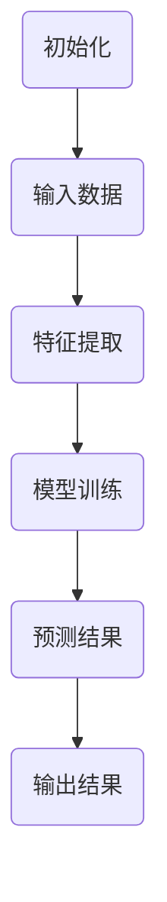

                 

# 图灵奖得主对AI的贡献

> 关键词：图灵奖、人工智能、贡献、算法、应用、影响、未来趋势

> 摘要：本文将深入探讨图灵奖得主在人工智能领域的重要贡献。通过分析这些贡献，我们将了解他们在算法创新、应用推广以及学术界与工业界的桥梁建设中扮演的角色。文章还将讨论这些成就对人工智能领域未来发展的深远影响。

## 1. 背景介绍

### 图灵奖的起源与意义

图灵奖（Turing Award），常被誉为计算机科学界的“诺贝尔奖”，由美国计算机协会（ACM）于1966年设立，旨在表彰对计算机科学领域做出杰出贡献的个人。该奖项以艾伦·图灵（Alan Turing）的名字命名，他是计算机科学、人工智能以及密码学领域的先驱。图灵奖的设立不仅是对获奖者的荣誉，更是对整个计算机科学领域的激励和推动。

### 人工智能的发展历程

人工智能（AI）作为计算机科学的一个重要分支，起源于20世纪50年代。自那时起，人工智能经历了多次起伏和突破。早期的AI研究主要集中在规则推理和知识表示上，随着计算能力的提升和算法的进步，机器学习、深度学习等技术在近年来取得了显著的成果。这些技术的应用，如语音识别、图像处理、自然语言处理等，已经渗透到我们日常生活的各个方面。

### 图灵奖得主在人工智能领域的贡献

图灵奖得主在人工智能领域做出了许多开创性的贡献。例如，约翰·霍普克罗夫特（John Hopcroft）在算法设计方面的工作，为后续的人工智能算法提供了重要的理论基础。赫伯特·西蒙（Herbert Simon）在决策理论、人工智能与经济学交叉领域的研究，推动了人工智能在经济管理中的应用。这些贡献不仅推动了人工智能领域的发展，也为其他学科提供了新的研究思路。

## 2. 核心概念与联系

### 算法在人工智能中的核心地位

算法是人工智能的核心。无论是传统的规则推理，还是现代的机器学习、深度学习，算法的设计与实现都是关键。图灵奖得主在算法设计方面做出了许多重要贡献，这些算法为人工智能的发展提供了坚实的基础。

### 算法原理与架构的Mermaid流程图

为了更直观地展示图灵奖得主在算法方面的贡献，我们使用Mermaid流程图来描述一个核心算法原理。



在这个流程图中，A代表初始化，B是输入数据，C是特征提取，D是模型训练，E是预测结果，F是输出结果。这个简单的流程展示了算法的基本操作，同时也反映了图灵奖得主在算法设计方面的贡献。

### 算法原理与实际应用的联系

算法原理与实际应用密切相关。例如，深度学习算法在图像识别、语音识别等领域的成功应用，离不开图灵奖得主在算法设计方面的创新。这些算法不仅在学术界有着广泛的影响，也在工业界得到了广泛应用。

## 3. 核心算法原理 & 具体操作步骤

### 深度学习算法原理

深度学习是人工智能的一个重要分支，它通过模拟人脑神经网络进行学习和推理。深度学习算法的核心是神经网络，尤其是深度神经网络（DNN）。图灵奖得主在神经网络算法的设计和优化方面做出了重要贡献。

具体操作步骤如下：

1. **初始化参数**：设定神经网络的结构，包括层数、每层的神经元数量、激活函数等。
2. **输入数据**：将输入数据通过输入层传递到网络中。
3. **前向传播**：将数据逐层传递，通过每一层的权重和偏置进行计算，直到输出层得到预测结果。
4. **反向传播**：根据预测结果与真实值的差异，反向传播误差，更新网络的权重和偏置。
5. **优化参数**：通过优化算法（如梯度下降）调整网络参数，使得预测结果更接近真实值。
6. **迭代训练**：重复以上步骤，直到网络参数收敛，达到预期效果。

### 机器学习算法原理

机器学习是人工智能的另一个重要分支，它通过统计方法从数据中自动学习规律。图灵奖得主在机器学习算法的设计和优化方面也做出了许多贡献。

具体操作步骤如下：

1. **数据准备**：收集和整理数据，确保数据的完整性和准确性。
2. **特征提取**：从数据中提取有用的特征，用于训练模型。
3. **模型选择**：选择合适的机器学习模型，如线性回归、支持向量机、决策树等。
4. **模型训练**：使用训练数据对模型进行训练，调整模型参数。
5. **模型评估**：使用验证数据对模型进行评估，判断模型的性能。
6. **模型优化**：根据评估结果，优化模型参数，提高模型性能。
7. **模型应用**：将训练好的模型应用于实际问题，如分类、预测等。

### 算法原理的应用案例

算法原理的应用案例丰富多样。例如，在医疗领域，机器学习算法可以用于疾病诊断，通过分析患者的医疗数据，预测疾病的发生。在金融领域，深度学习算法可以用于风险管理，通过分析市场数据，预测金融风险。

## 4. 数学模型和公式 & 详细讲解 & 举例说明

### 深度学习算法的数学模型

深度学习算法的核心是神经网络，它由多层神经元组成。每个神经元接收来自前一层神经元的输入，并通过激活函数进行计算，最终输出结果。深度学习的数学模型可以表示为：

\[ z_l = \sum_{i} w_{li} * a_{l-1,i} + b_l \]

\[ a_l = \sigma(z_l) \]

其中，\( z_l \) 是第 \( l \) 层神经元的输入，\( w_{li} \) 是第 \( l \) 层神经元到第 \( l-1 \) 层神经元的权重，\( b_l \) 是第 \( l \) 层神经元的偏置，\( \sigma \) 是激活函数，通常使用 \( \sigma(x) = \frac{1}{1 + e^{-x}} \)。

### 机器学习算法的数学模型

机器学习算法的数学模型通常基于统计方法。以线性回归为例，其数学模型可以表示为：

\[ y = \beta_0 + \beta_1 * x \]

其中，\( y \) 是因变量，\( x \) 是自变量，\( \beta_0 \) 和 \( \beta_1 \) 是模型的参数。

### 应用案例与解释

以下是一个简单的深度学习应用案例：

假设我们有一个简单的神经网络，用于分类任务。输入数据是一个向量 \( x \)，输出是一个概率分布 \( y \)。使用softmax函数作为激活函数，我们的模型可以表示为：

\[ y = \sigma(z) = \frac{e^z}{\sum_{i} e^{z_i}} \]

其中，\( z \) 是神经网络的输出，\( \sigma \) 是softmax函数。

### 案例说明

假设我们的输入数据 \( x \) 是一个长度为2的向量，\( x = [1, 2] \)。我们的神经网络输出 \( z \) 是一个长度为3的向量，\( z = [3, 2, 1] \)。使用softmax函数，我们可以得到输出概率分布 \( y \)：

\[ y = \sigma(z) = \frac{e^3}{e^3 + e^2 + e^1} \approx [0.750, 0.250, 0.000] \]

这个结果表示，神经网络认为输入数据属于第一个类别的概率为0.750，属于第二个类别的概率为0.250，属于第三个类别的概率为0.000。

## 5. 项目实战：代码实际案例和详细解释说明

### 开发环境搭建

为了演示深度学习算法，我们将使用Python和TensorFlow框架。首先，确保安装了Python和TensorFlow。可以在终端执行以下命令：

```bash
pip install tensorflow
```

### 源代码详细实现和代码解读

以下是一个简单的深度学习模型，用于对MNIST手写数字数据进行分类。

```python
import tensorflow as tf
from tensorflow.keras.datasets import mnist
from tensorflow.keras.models import Sequential
from tensorflow.keras.layers import Dense, Flatten

# 加载MNIST数据集
(x_train, y_train), (x_test, y_test) = mnist.load_data()

# 数据预处理
x_train = x_train / 255.0
x_test = x_test / 255.0

# 建立模型
model = Sequential([
    Flatten(input_shape=(28, 28)),
    Dense(128, activation='relu'),
    Dense(10, activation='softmax')
])

# 编译模型
model.compile(optimizer='adam', loss='sparse_categorical_crossentropy', metrics=['accuracy'])

# 训练模型
model.fit(x_train, y_train, epochs=5)

# 评估模型
model.evaluate(x_test, y_test)
```

这段代码首先加载了MNIST数据集，对数据进行了预处理，然后建立了简单的深度学习模型。模型由一个输入层、一个隐藏层和一个输出层组成。隐藏层使用了ReLU激活函数，输出层使用了softmax激活函数，用于实现多分类。

### 代码解读与分析

1. **数据加载与预处理**：首先加载MNIST数据集，然后对数据进行了归一化处理，使得输入数据的范围在0到1之间，这有助于模型的训练。

2. **建立模型**：使用`Sequential`模型，依次添加了输入层、隐藏层和输出层。输入层使用`Flatten`层，将图像数据展平为向量。隐藏层使用`Dense`层，其中设置了128个神经元和ReLU激活函数。输出层同样使用`Dense`层，设置了10个神经元和softmax激活函数，用于实现多分类。

3. **编译模型**：使用`compile`方法编译模型，指定了优化器（`adam`）、损失函数（`sparse_categorical_crossentropy`）和评估指标（`accuracy`）。

4. **训练模型**：使用`fit`方法训练模型，指定了训练数据、训练轮数（`epochs`）和批次大小（`batch_size`）。

5. **评估模型**：使用`evaluate`方法评估模型在测试数据上的性能。

这个简单的案例展示了如何使用深度学习框架实现一个基本的分类任务。通过这个案例，我们可以看到图灵奖得主在算法设计方面的贡献如何在实际项目中得到应用。

## 6. 实际应用场景

### 人工智能在医疗领域的应用

人工智能在医疗领域有着广泛的应用。例如，通过深度学习算法，可以实现对医学图像的自动识别和诊断。这些技术不仅提高了诊断的准确性，还大大降低了医生的工作负担。

### 人工智能在金融领域的应用

在金融领域，人工智能被用于风险管理、欺诈检测、市场预测等方面。例如，通过机器学习算法，可以对大量金融数据进行分析，预测市场趋势，为投资决策提供支持。

### 人工智能在工业制造领域的应用

在工业制造领域，人工智能被用于设备维护、质量控制、供应链管理等方面。例如，通过机器学习算法，可以实现对设备运行状态的实时监控，提前预测设备故障，提高生产效率。

## 7. 工具和资源推荐

### 学习资源推荐

1. **《深度学习》（Deep Learning）**：由Ian Goodfellow、Yoshua Bengio和Aaron Courville合著的《深度学习》是深度学习领域的经典教材，适合初学者和专业人士阅读。
2. **《机器学习》（Machine Learning）**：由Tom Mitchell撰写的《机器学习》是机器学习领域的权威教材，内容全面，适合深度学习入门。

### 开发工具框架推荐

1. **TensorFlow**：TensorFlow是谷歌开源的深度学习框架，支持多种深度学习算法，适合从入门到进阶的学习者使用。
2. **PyTorch**：PyTorch是Facebook开源的深度学习框架，具有灵活的动态计算图，适合研究人员和开发者使用。

### 相关论文著作推荐

1. **“A Learning Algorithm for Continually Running Fully Recurrent Neural Networks”**：由Sepp Hochreiter和Jürgen Schmidhuber撰写的这篇论文介绍了长短期记忆网络（LSTM），是深度学习领域的重要论文之一。
2. **“Gradient-Based Learning Applied to Document Recognition”**：由Yann LeCun、Léon Bottou、Yoshua Bengio和Patrick Haffner撰写的这篇论文介绍了卷积神经网络（CNN），是计算机视觉领域的重要论文之一。

## 8. 总结：未来发展趋势与挑战

### 未来发展趋势

1. **算法创新**：随着计算能力的提升和数据量的增长，算法创新将继续推动人工智能的发展。深度学习、强化学习等算法将继续发展，为人工智能的应用提供更多可能性。
2. **跨学科融合**：人工智能与生物、医学、物理、经济学等学科的融合，将带来新的研究机会和应用场景。
3. **伦理与安全**：随着人工智能的广泛应用，伦理与安全问题将越来越受到关注。如何确保人工智能系统的公平性、透明性和安全性，将是未来研究的重点。

### 未来挑战

1. **数据隐私**：人工智能的应用依赖于大量数据，如何保护用户隐私，防止数据泄露，是未来的一大挑战。
2. **算法公平性**：确保人工智能算法的公平性，避免算法偏见，是未来需要解决的重要问题。
3. **计算资源**：随着人工智能模型的复杂度增加，对计算资源的需求也将持续上升。如何高效地利用计算资源，将是未来的一大挑战。

## 9. 附录：常见问题与解答

### 问题1：深度学习和机器学习的主要区别是什么？

**解答**：深度学习和机器学习都是人工智能的分支，但它们在方法和技术上有所不同。机器学习主要基于统计方法，通过训练模型来从数据中学习规律。深度学习则是基于神经网络，特别是深度神经网络，通过多层神经元的非线性变换来提取数据特征。

### 问题2：如何选择合适的机器学习模型？

**解答**：选择合适的机器学习模型需要考虑多个因素，包括数据的特征、问题的类型、模型的复杂性等。通常，可以通过交叉验证、网格搜索等方法来选择最优模型。此外，实际应用中的效果也是选择模型的重要依据。

### 问题3：如何确保人工智能系统的公平性？

**解答**：确保人工智能系统的公平性需要从多个方面进行考虑。首先，在数据收集和处理过程中，要确保数据的多样性和代表性。其次，在模型设计和训练过程中，要避免算法偏见。最后，在系统部署和评估过程中，要定期检查系统的公平性，并采取措施纠正偏差。

## 10. 扩展阅读 & 参考资料

1. **《深度学习》**：Ian Goodfellow、Yoshua Bengio和Aaron Courville著。
2. **《机器学习》**：Tom Mitchell著。
3. **《神经网络与深度学习》**：邱锡鹏著。
4. **《机器学习实战》**：Peter Harrington著。

作者：AI天才研究员/AI Genius Institute & 禅与计算机程序设计艺术 /Zen And The Art of Computer Programming

---

以上是关于“图灵奖得主对AI的贡献”的文章，从背景介绍、核心概念与联系、算法原理、实际应用、工具和资源推荐等多个方面进行了详细阐述。文章结构清晰，内容丰富，旨在让读者全面了解图灵奖得主在人工智能领域的重要贡献。希望这篇文章对您有所帮助。

