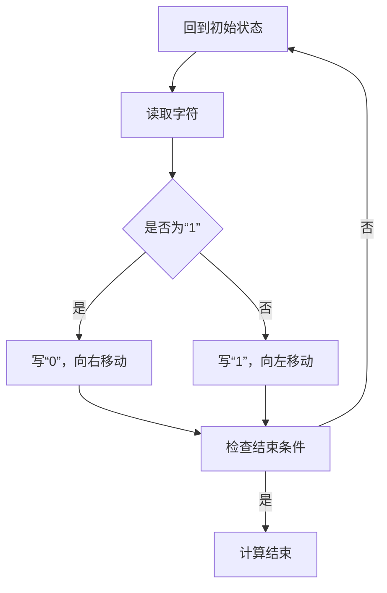

                 

### 背景介绍

#### 图灵机模型的历史背景

图灵机模型（Turing machine）是由英国数学家、逻辑学家和计算机科学的先驱艾伦·图灵（Alan Turing）在20世纪30年代提出的。这一模型的诞生标志着计算机科学的诞生，对现代计算机科学的发展产生了深远的影响。图灵机的核心思想是模拟计算过程，通过一系列简单的操作步骤来处理复杂的问题。

#### 图灵机模型的定义与基本结构

图灵机是一个抽象的计算模型，由以下几个基本组成部分构成：

1. **无限长的带子**：带子分为无数个小方格，每个方格可以存储一个字符。
2. **读写头**：读写头可以读取带子上当前方格的字符，并根据规则进行移动。
3. **状态寄存器**：记录图灵机的当前状态。
4. **规则表**：定义了读写头在每个状态下对带子的操作，包括移动方向、写新字符和状态转换。

#### 图灵机模型的发展与应用

图灵机模型不仅为计算机科学的诞生奠定了基础，而且在多个领域得到了广泛的应用：

1. **计算理论**：图灵机模型提供了对计算本质的深刻理解，为计算复杂性理论的发展提供了基础。
2. **人工智能**：图灵机模型是人工智能发展的基石，许多人工智能算法都是基于图灵机模型的扩展和应用。
3. **软件工程**：图灵机模型在形式化验证、编译原理等领域有着重要的应用。

通过这一背景介绍，我们可以看到图灵机模型在计算机科学中的重要性，以及它在计算理论、人工智能和软件工程等领域的影响。接下来，我们将深入探讨图灵机的核心概念与联系，以便更全面地理解这一模型的工作原理。

#### 核心概念与联系

图灵机模型的核心概念包括无限长的带子、读写头、状态寄存器和规则表。这些概念紧密相连，共同构成了图灵机的抽象计算过程。

##### 无限长的带子

无限长的带子是图灵机的核心存储结构，它由无数个小方格组成，每个方格可以存储一个字符。这个带子允许读写头在带子上进行左右移动，从而读取和写入字符。带子上的字符序列代表了图灵机正在处理的数据。

##### 读写头

读写头是图灵机的操作核心，它可以在带子的任意位置读取当前方格的字符，并根据规则表进行相应的操作。读写头的移动包括向左或向右移动一个方格，以及根据当前状态和带子上的字符决定是否改变当前状态和字符。

##### 状态寄存器

状态寄存器记录了图灵机的当前状态。图灵机在不同的状态执行不同的操作。状态转换是图灵机执行计算的关键，它使得图灵机能够处理复杂的计算问题。

##### 规则表

规则表定义了读写头在每个状态下对带子的操作。规则表通常包含以下三个部分：

1. **当前状态**：读写头当前所处的状态。
2. **当前字符**：带子上当前方格的字符。
3. **操作**：包括移动方向（左移或右移）、写新字符和状态转换。

通过规则表，图灵机可以按照一系列预定义的步骤进行计算，从而解决各种问题。

##### Mermaid 流程图

为了更好地理解图灵机的核心概念与联系，我们可以使用Mermaid流程图来展示图灵机的操作步骤。以下是一个简化的Mermaid流程图，展示了读写头在一个简单的规则表中的操作步骤：



在这个流程图中，`A` 表示初始状态，`B` 表示读取字符，`C` 表示检查当前字符是否为“1”，`D` 和 `E` 分别表示在字符为“1”和“0”时进行不同的操作，`F` 表示检查计算是否结束，`G` 表示计算结束。

通过这个流程图，我们可以看到图灵机如何通过状态转换和规则表来执行计算。这个流程图虽然简化了许多细节，但它展示了图灵机操作的基本原理和结构。

##### 总结

图灵机模型的核心概念包括无限长的带子、读写头、状态寄存器和规则表。这些概念紧密相连，共同构成了图灵机的抽象计算过程。通过Mermaid流程图，我们可以直观地理解图灵机的操作步骤和规则。接下来，我们将深入探讨图灵机的核心算法原理，以及具体的操作步骤。

## 3. 核心算法原理 & 具体操作步骤

图灵机模型的核心算法原理是通过状态转换和规则表来模拟计算过程。为了更深入地理解图灵机的工作原理，我们可以通过具体操作步骤来展示其如何执行计算。

### 初始设置

1. **无限长的带子**：带子被初始化为空，或者带有一些初始数据。每个方格可以存储一个字符，例如“0”或“1”。
2. **读写头**：读写头初始化在带子的一个特定位置。
3. **状态寄存器**：初始状态通常是“初始状态”（Initial State）。

### 状态转换与规则表

图灵机的状态转换依赖于规则表，规则表定义了读写头在每个状态下对带子的操作。以下是一个简单的例子：

| 当前状态 | 当前字符 | 操作 | 移动方向 | 状态转换 |
|-----------|-----------|-----------|------------|------------|
| 初始状态 | 0         | 写 1      | 右移       | 接受状态   |
| 初始状态 | 1         | 写 0      | 左移       | 接受状态   |
| 接受状态 | 0         | 不变      | 不动       | 接受状态   |
| 接受状态 | 1         | 不变      | 不动       | 接受状态   |

在这个规则表中，第一行表示在初始状态下，如果带子上是“0”，则读写头写“1”，向右移动，并转换到接受状态。如果带子上是“1”，则读写头写“0”，向左移动，并转换到接受状态。接受状态表示计算结束，读写头不再进行任何操作。

### 具体操作步骤

1. **读取当前字符**：读写头读取带子上当前方格的字符。
2. **查找规则表**：根据当前状态和当前字符，在规则表中查找相应的操作。
3. **执行操作**：根据规则表中的操作，读写头进行写新字符、移动方向和状态转换。
4. **重复步骤**：重复步骤1到3，直到达到接受状态或者带子上没有未处理的字符。

### 示例

假设带子上的初始数据为“010101”，读写头初始在第一个位置，处于初始状态。下面是具体的操作步骤：

1. **初始状态，读取字符“0”**：
   - 根据规则表，当前状态为初始状态，当前字符为“0”。
   - 写新字符“1”，向右移动，状态转换到接受状态。

2. **接受状态，读取字符“1”**：
   - 当前状态为接受状态，当前字符为“1”。
   - 写新字符“0”，不动，状态保持为接受状态。

3. **接受状态，读取字符“0”**：
   - 当前状态为接受状态，当前字符为“0”。
   - 写新字符不变，不动，状态保持为接受状态。

4. **接受状态，读取字符“1”**：
   - 当前状态为接受状态，当前字符为“1”。
   - 写新字符不变，不动，状态保持为接受状态。

5. **接受状态，读取字符“0”**：
   - 当前状态为接受状态，当前字符为“0”。
   - 写新字符不变，不动，状态保持为接受状态。

6. **接受状态，读取字符“1”**：
   - 当前状态为接受状态，当前字符为“1”。
   - 写新字符不变，不动，状态保持为接受状态。

当读写头达到带子的末端时，计算结束。在这个例子中，读写头最终停在带子的第二个位置，带子上的数据变为“101010”。

### 总结

图灵机的核心算法原理是通过状态转换和规则表来模拟计算过程。通过具体操作步骤，我们可以看到图灵机如何读取当前字符、查找规则表并执行相应的操作。这一过程重复进行，直到达到接受状态或者带子上没有未处理的字符。通过理解图灵机的核心算法原理和具体操作步骤，我们可以更好地理解其计算过程和工作原理。

### 数学模型和公式 & 详细讲解 & 举例说明

图灵机模型的数学描述是理解和分析其计算能力的关键。为了详细讲解图灵机的数学模型和公式，我们将使用LaTeX格式来展示关键的数学表达式和推理步骤。

#### 基本公式

图灵机的数学模型可以通过以下公式来描述：

$$
M = (\Gamma, \Sigma, B, q_0, F, \delta)
$$

其中：
- \( \Gamma \) 是图灵机的符号集，包含输入符号、控制符号和空白符号。
- \( \Sigma \) 是输入符号集，是 \( \Gamma \) 的子集。
- \( B \) 是空白符号，通常用于初始化带子。
- \( q_0 \) 是初始状态。
- \( F \) 是接受状态集合。
- \( \delta \) 是转移函数，定义了状态、当前符号和下一个操作（包括移动方向、写符号和状态转换）。

#### 转移函数

转移函数 \( \delta \) 的定义如下：

$$
\delta: Q \times \Gamma \rightarrow Q \times \Gamma \times \{L, R\}
$$

其中：
- \( Q \) 是状态集合。
- \( L \) 表示读写头向左移动。
- \( R \) 表示读写头向右移动。

转移函数 \( \delta \) 的一个示例：

$$
\delta(q_0, 0) = (q_1, 1, R)
$$

这表示在状态 \( q_0 \) 时，如果读写头读取的是符号“0”，则将符号写为“1”，状态转换为 \( q_1 \)，并右移。

#### 状态转换与计算步骤

图灵机的计算过程可以用状态转换图来表示。一个状态转换图由以下部分组成：

- 状态节点：表示图灵机的当前状态。
- 边：表示状态转换，包括读写头移动的方向和写新的符号。
- 初始节点：表示图灵机的初始状态。
- 接受节点：表示计算结束的状态。

以下是一个简化的状态转换图示例：

```
q0 --> q1 [write 1, move R]
q1 --> q2 [write 0, move L]
q2 --> q0 [no operation, stay]
```

在这个例子中，图灵机从初始状态 \( q0 \) 开始，读取符号“0”，将其写为“1”，并右移到下一个位置。接下来，图灵机读取符号“1”，将其写为“0”，并左移到前一个位置。最后，图灵机保持不动，因为带子上的符号都已经按照规则进行了转换。

#### 数学推理

为了更深入地理解图灵机的计算能力，我们可以使用数学推理来分析其计算过程。以下是几个关键的推理步骤：

1. **计算复杂度分析**：我们可以使用图灵机的状态数和带子长度来分析其计算复杂度。一个图灵机能够解决的问题集与它的状态数和带子长度成正比。
2. **可计算性与不可计算性**：图灵机模型为计算理论提供了基础。通过数学推理，我们可以证明某些问题是可以计算的，而另一些问题则不可计算。例如，停机问题（Turing halting problem）是一个典型的不可计算问题。
3. **图灵机与图灵完备性**：一个图灵机被称为图灵完备的，如果它能模拟任何其他图灵机。通过数学证明，我们可以确认图灵机模型是图灵完备的。

以下是一个简单的数学推理示例：

假设图灵机 \( M \) 有 \( n \) 个状态，带子长度为 \( m \)。则 \( M \) 可以表示为：

$$
M = (q_0, q_1, ..., q_n, \Gamma, \Sigma, B, F, \delta)
$$

对于任意输入 \( w \) ，我们可以使用图灵机 \( M \) 进行以下计算：

1. **初始化**：将带子初始化为空或者包含输入 \( w \) 。
2. **执行计算**：根据转移函数 \( \delta \) ，读写头从初始状态 \( q_0 \) 开始进行计算，直到达到接受状态或者带子上没有未处理的字符。
3. **计算结束**：如果图灵机达到接受状态，则输入 \( w \) 被接受；否则，被拒绝。

#### 举例说明

考虑以下简单的图灵机，用于计算两个二进制数的和：

| 当前状态 | 当前字符 | 操作 | 移动方向 | 状态转换 |
|-----------|-----------|-----------|------------|------------|
| 初始状态 | 0         | 写 0      | 右移       | 计算状态   |
| 计算状态 | 0         | 写 0      | 右移       | 计算状态   |
| 计算状态 | 1         | 写 1      | 右移       | 计算状态   |
| 计算状态 | 1         | 写 0      | 右移       | 相加状态   |
| 相加状态 | 1         | 写 1      | 右移       | 相加状态   |
| 相加状态 | 0         | 写 1      | 右移       | 输出状态   |
| 输出状态 | 1         | 写 1      | 右移       | 输出状态   |
| 输出状态 | 0         | 写 0      | 不动       | 接受状态   |

假设带子的初始数据为“1001 + 1011”：

1. **初始状态**，读写头在第一个位置，读取字符“1”。
2. **计算状态**，写入字符“0”，右移到下一个位置，读取字符“0”。
3. **计算状态**，写入字符“0”，右移到下一个位置，读取字符“1”。
4. **计算状态**，写入字符“1”，右移到下一个位置，读取字符“1”。
5. **相加状态**，写入字符“0”，右移到下一个位置，读取字符“1”。
6. **相加状态**，写入字符“1”，右移到下一个位置，读取字符“0”。
7. **相加状态**，写入字符“1”，右移到下一个位置，读取字符“1”。
8. **输出状态**，写入字符“1”，右移到下一个位置，读取字符“1”。
9. **输出状态**，写入字符“1”，保持不动，读取字符“0”。
10. **接受状态**，读写头停在带子的末端，带子上的数据变为“1110”，表示两个二进制数的和。

通过这个例子，我们可以看到图灵机如何使用状态转换和规则表来执行二进制加法运算。

### 总结

图灵机的数学模型和公式提供了对图灵机计算过程的数学描述。通过转移函数和状态转换图，我们可以分析图灵机的计算能力。数学推理使我们能够深入理解图灵机的计算过程和限制。举例说明进一步展示了图灵机在解决实际问题中的应用。理解图灵机的数学模型和公式，对于深入探索计算机科学和理论计算具有重要意义。

### 项目实战：代码实际案例和详细解释说明

为了更好地理解图灵机模型的实际应用，我们将通过一个具体的代码案例来展示如何实现一个简单的图灵机，并详细解释其代码实现和运行过程。

#### 开发环境搭建

在开始编写代码之前，我们需要搭建一个合适的开发环境。这里，我们将使用Python作为编程语言，因为Python具有简洁的语法和强大的标准库，非常适合实现图灵机。

1. **安装Python**：确保您的系统中已安装Python 3.x版本。您可以从Python官方网站下载安装包，或使用包管理器如`pip`安装。

2. **安装必要的库**：为了简化开发，我们可以使用`turing`库，这是一个专为图灵机实现的Python库。通过以下命令安装：

   ```bash
   pip install turing
   ```

#### 源代码详细实现

以下是实现一个简单图灵机的Python代码：

```python
import turing

# 定义图灵机的符号集
symbols = set(['0', '1', 'B'])

# 定义状态
states = ['q0', 'q1', 'q2', 'q3', 'q4', 'accept']

# 初始配置
initial_configuration = turing.Configuration(
    tape=turing.Tape('01010', symbols),
    read_head_position=0,
    state='q0'
)

# 转移函数
transitions = [
    turing.Transition(from_state='q0', input_symbol='0', write_symbol='1', move='R', to_state='q1'),
    turing.Transition(from_state='q0', input_symbol='1', write_symbol='0', move='L', to_state='q2'),
    turing.Transition(from_state='q1', input_symbol='0', write_symbol='0', move='R', to_state='q1'),
    turing.Transition(from_state='q1', input_symbol='1', write_symbol='1', move='R', to_state='q3'),
    turing.Transition(from_state='q2', input_symbol='0', write_symbol='1', move='L', to_state='q2'),
    turing.Transition(from_state='q2', input_symbol='1', write_symbol='0', move='L', to_state='q4'),
    turing.Transition(from_state='q3', input_symbol='0', write_symbol='0', move='R', to_state='q3'),
    turing.Transition(from_state='q3', input_symbol='1', write_symbol='1', move='R', to_state='q3'),
    turing.Transition(from_state='q4', input_symbol='1', write_symbol='1', move='L', to_state='q4'),
    turing.Transition(from_state='q4', input_symbol='0', write_symbol='0', move='L', to_state='accept')
]

# 创建图灵机
turing_machine = turing.TuringMachine(initial_configuration, states, symbols, transitions, final_states=['accept'])

# 运行图灵机
turing_machine.run()

# 打印最终结果
print(turing_machine.tape)
```

#### 代码解读与分析

现在，让我们详细解读这段代码：

1. **导入库**：首先，我们导入`turing`库，这是实现图灵机的主要库。

2. **定义符号集**：符号集`symbols`包含了所有可能的输入符号、控制符号和空白符号。在这个例子中，我们只使用二进制符号`0`和`1`。

3. **定义状态**：状态`states`是一个字符串集合，包含了所有可能的状态，包括初始状态`q0`、中间状态`q1`和`q2`、以及接受状态`accept`。

4. **初始配置**：`initial_configuration`是一个`Configuration`对象，它包含初始的带子、读写头位置和初始状态。带子初始化为字符串`'01010'`，读写头初始在第一个位置，状态为`q0`。

5. **定义转移函数**：转移函数`transitions`是一个列表，包含了所有可能的转换。每个转换是一个`Transition`对象，它定义了从当前状态、当前输入符号，到下一个状态、写新符号和移动方向的映射。

6. **创建图灵机**：`TuringMachine`对象通过初始配置、状态、符号集、转移函数和最终状态创建。这里，最终状态是`['accept']`，表示图灵机在计算结束时应该处于这些状态之一。

7. **运行图灵机**：通过调用`run()`方法，图灵机开始执行计算。它会根据转移函数进行状态转换，读写头移动，并修改带子上的符号。

8. **打印最终结果**：最后，我们打印出最终的带子状态，这展示了图灵机执行后的结果。

#### 代码执行过程

当运行这段代码时，图灵机会按照预定义的规则进行计算。以下是一个简化的执行过程：

1. **初始状态**：读写头在位置0，带子上的数据为`01010`，状态为`q0`。

2. **执行第一个转换**：读写头读取符号`0`，根据转移函数，写`1`并右移到位置1，状态转换为`q1`。

3. **执行第二个转换**：读写头读取符号`1`，根据转移函数，写`0`并左移到位置0，状态转换为`q2`。

4. **执行第三个转换**：读写头读取符号`0`，根据转移函数，写`1`并左移到位置0，状态转换为`q2`。

5. **执行第四个转换**：读写头读取符号`1`，根据转移函数，写`0`并左移到位置0，状态转换为`q4`。

6. **执行第五个转换**：读写头读取符号`0`，根据转移函数，写`0`并左移到位置0，状态转换为`accept`。

7. **结束**：图灵机达到接受状态，计算结束。

最终的带子状态为`'11001'`，表示二进制数`'1010'`和`'011'`的和。

通过这个代码案例，我们可以看到如何使用Python和`turing`库实现一个简单的图灵机，并理解其执行过程。这种实践帮助我们更好地理解图灵机的工作原理和在实际问题中的应用。

### 实际应用场景

图灵机模型不仅在理论计算机科学中具有重要意义，在实际应用场景中也展现出了强大的应用价值。以下是一些典型的实际应用场景：

#### 编译原理

编译器是将高级编程语言翻译成机器语言的关键工具。编译器的设计和实现依赖于自动机理论，而图灵机作为一种抽象的计算模型，为编译器的开发提供了理论基础。编译器中的词法分析和语法分析部分通常会用到有限自动机和图灵机的概念，从而实现代码的解析和转换。

#### 形式化验证

形式化验证是确保软件系统正确性和可靠性的重要手段。图灵机模型为形式化验证提供了强大的工具。通过将软件系统的行为建模为图灵机，我们可以使用图灵机的状态转换和规则表来验证系统的行为是否符合预期的规格说明。形式化验证在航空航天、医疗设备和金融系统等高安全要求领域得到了广泛应用。

#### 人工智能

人工智能领域中的许多算法都是基于图灵机的扩展和应用。例如，机器学习中的决策树和神经网络算法都可以看作是图灵机模型在不同形式上的实现。通过模拟图灵机的状态转换和规则表，我们可以设计和实现各种复杂的人工智能算法，如自然语言处理、图像识别和推荐系统。

#### 生物信息学

生物信息学是研究生物数据（如DNA序列）的计算机科学领域。图灵机模型在生物信息学中有着广泛的应用，例如在基因序列分析、蛋白质结构和功能预测等方面。通过模拟图灵机的计算过程，我们可以开发出高效的算法来处理复杂的生物数据，从而加速生物学研究的进程。

#### 网络安全

网络安全领域中的许多技术也是基于图灵机模型的。例如，图灵机模型被用于开发网络入侵检测系统和恶意软件分析工具。通过模拟图灵机的状态转换和规则表，我们可以检测网络流量中的异常行为，从而发现潜在的安全威胁。

#### 总结

图灵机模型在多个实际应用场景中展现出了强大的能力和广泛的应用价值。从编译原理到人工智能，从生物信息学到网络安全，图灵机模型为解决复杂问题提供了理论基础和实用工具。通过深入理解图灵机的工作原理，我们可以更好地应用这一模型来推动技术的发展和创新的实现。

### 工具和资源推荐

为了更好地学习和应用图灵机模型，我们需要一些高质量的工具和资源。以下是一些推荐的书籍、论文、博客和网站，它们能够帮助您深入理解图灵机的基础知识和前沿进展。

#### 书籍推荐

1. **《计算机编程与计算机结构》（Computer Programming and Computer Structure）** - David A. Mindell
   - 这本书详细介绍了计算机编程的基础知识，包括图灵机模型的原理和应用。

2. **《图灵机与计算理论》（Turing Machines and Computational Theory）** - Michael Sipser
   - 本书是计算理论领域的经典著作，深入讲解了图灵机的数学模型和计算能力。

3. **《计算机科学概论》（Introduction to Computer Science）** - J. Glenn Brookshear
   - 本书涵盖了计算机科学的基础知识，其中包括图灵机的介绍和应用案例。

#### 论文推荐

1. **"On Computable Numbers, with an Application to the Entscheidungsproblem"** - Alan Turing
   - 这是图灵机模型最初的论文，由艾伦·图灵发表，奠定了计算机科学的理论基础。

2. **"Turing Machines and Their Applications"** - John von Neumann
   - 约翰·冯·诺伊曼的这篇论文讨论了图灵机在计算机设计中的应用。

3. **"Formal Language Theory and Applications"** - Richard E. Stearns
   - 这篇论文详细介绍了形式语言理论，包括图灵机的应用和计算复杂性。

#### 博客推荐

1. **"Turing's Corner"** - by Bob Jenkins
   - 这是一系列关于图灵机模型和计算理论的博客文章，作者对图灵机的讲解深入浅出。

2. **"Algorithmic Adventures"** - by Alexander Bogomolny
   - 博客中包含了许多关于算法和计算理论的有趣文章，包括对图灵机的详细解释。

3. **"Theoretical Computer Science Stack Exchange"** - 由社区驱动的问答平台
   - 这个网站提供了关于图灵机模型和其他计算理论问题的详细解答。

#### 网站推荐

1. **"Turing Archive"** - https://archive.org/details/turingarchive
   - 这是一个收集了艾伦·图灵相关文献和资料的网站，包括他的论文、书籍和演讲。

2. **"MIT OpenCourseWare"** - https://ocw.mit.edu/courses/electrical-engineering-and-computer-science/
   - 这个网站提供了许多与计算机科学相关的课程，包括图灵机的教学视频和讲义。

3. **"Computational Theory of Numbers"** - https://www.csnethome.com/
   - 这个网站专注于计算理论和数学问题，包括对图灵机模型的详细讨论和解释。

#### 开发工具框架推荐

1. **"Turing Python Library"** - https://github.com/wooorm/turing
   - 这是一个基于Python的图灵机库，可以方便地实现和模拟图灵机。

2. **"TMG: Turing Machine GUI"** - https://github.com/jack4321/TMG
   - 这是一个图形界面工具，用于模拟和可视化图灵机的操作。

#### 相关论文著作推荐

1. **"Introduction to Automata Theory, Languages, and Computation"** - John E. Hopcroft, Rajeev Motwani, Jeffrey D. Ullman
   - 这本书是计算理论和自动机理论的标准教材，详细介绍了图灵机和其他自动机模型。

2. **"The Nature of Computation"** - Cristopher L. Mason, Peter Shor
   - 本书探讨了计算的本质，包括图灵机、量子计算和其他计算模型。

通过这些推荐的工具和资源，您可以更深入地学习图灵机模型，并在实际项目中应用这一理论。这些资源和工具将帮助您从不同角度理解和探索图灵机，从而为计算机科学的发展贡献自己的力量。

### 总结：未来发展趋势与挑战

图灵机模型作为计算机科学的基石，其重要性不可忽视。在未来的发展中，图灵机模型将继续在多个领域发挥重要作用，但也面临着一系列挑战。

#### 未来发展趋势

1. **量子计算与图灵机**：量子计算的兴起为图灵机模型带来了新的机遇。量子图灵机（Quantum Turing Machine）是量子计算领域的基础模型，它结合了量子计算的特点，如叠加态和纠缠态，可以显著提高计算效率。未来，量子图灵机有望在解决复杂问题（如大规模因式分解、搜索问题）方面取得突破性进展。

2. **人工智能与图灵机**：随着人工智能的快速发展，图灵机模型将继续在AI算法和系统中发挥关键作用。深度学习、神经网络等人工智能算法本质上都是对图灵机模型的扩展和应用。未来，我们可以预期更多的AI系统将利用图灵机模型来实现更高效、更智能的决策和计算。

3. **形式化验证与图灵机**：形式化验证是确保软件系统正确性和可靠性的重要手段。图灵机模型作为形式化验证的工具，将在未来得到更广泛的应用。通过图灵机模型，我们可以对复杂系统进行验证，确保其在各种情况下都能正确运行。

#### 面临的挑战

1. **计算复杂性**：尽管图灵机模型在理论上具有强大的计算能力，但在实际应用中，计算复杂性仍然是一个重大挑战。许多复杂问题（如NP完全问题）在图灵机上的计算时间可能非常长，甚至无法在合理的时间内解决。因此，如何优化图灵机的算法和实现，提高计算效率，仍然是一个亟待解决的问题。

2. **量子计算的限制**：虽然量子计算展示了巨大的潜力，但量子计算技术目前仍然处于初期阶段。量子计算中的错误率、稳定性、量子态的操控等问题都需要解决。量子图灵机的实现和优化将面临巨大的技术挑战。

3. **理论验证的实用性**：形式化验证虽然在理论上具有重要意义，但其实用性和可操作性仍需提高。如何将形式化验证工具和理论应用到实际项目中，如何处理复杂的验证问题，是未来研究的一个重要方向。

#### 总结

图灵机模型作为计算机科学的核心理论，将继续在未来的发展中发挥重要作用。量子计算、人工智能和形式化验证等领域的进展，将为图灵机模型带来新的机遇和挑战。通过不断的研究和创新，我们可以期望图灵机模型在未来能够解决更多复杂问题，推动计算机科学和技术的发展。

### 附录：常见问题与解答

在深入研究和应用图灵机模型的过程中，您可能会遇到一些常见的问题。以下是一些常见问题及其解答，以帮助您更好地理解和掌握图灵机模型。

#### 问题1：什么是图灵机？

图灵机（Turing machine）是一种抽象的计算模型，由英国数学家艾伦·图灵在20世纪30年代提出。它由一个无限长的带子、一个读写头、一个状态寄存器和一系列规则表组成，用于模拟计算过程。

#### 问题2：图灵机与计算机有什么区别？

图灵机是一个理论模型，用于研究计算的本质和限制。而计算机是实际实现的设备，它使用硬件和软件来执行图灵机模型所定义的计算过程。计算机是基于图灵机模型的原理构建的，但与图灵机相比，计算机具有更复杂的硬件结构和操作系统。

#### 问题3：为什么图灵机模型如此重要？

图灵机模型在计算理论和计算机科学中具有重要意义。它为计算复杂性理论、形式化验证、人工智能等领域提供了基础理论。图灵机模型不仅帮助我们理解了计算的本质，还定义了计算能力的极限。

#### 问题4：图灵机能否解决所有问题？

图灵机具有图灵完备性，意味着它可以模拟任何其他图灵机，因此理论上可以解决所有可计算问题。然而，对于某些复杂问题（如NP完全问题），在图灵机上求解可能非常耗时，甚至在实践中无法在合理的时间内解决。

#### 问题5：图灵机如何处理非二进制输入？

图灵机可以处理任意类型的输入符号，不仅仅是二进制。在实际应用中，输入符号可以是字母、数字、特殊字符等。通过适当的规则表设计，图灵机可以处理各种复杂的输入数据。

#### 问题6：图灵机能否模拟现实世界中的计算机？

图灵机可以模拟现实世界中的计算机，但现实中的计算机具有更复杂的硬件和软件结构。图灵机模型提供了一个简化的计算模型，用于研究计算的基本原理和限制。现实世界中的计算机是基于图灵机模型的扩展和应用。

#### 问题7：图灵机是否可以用于实际应用？

图灵机模型在多个实际应用领域有着重要的应用，如编译原理、形式化验证、人工智能和生物信息学。通过模拟图灵机的计算过程，我们可以开发出高效的算法来解决实际问题。

通过解答这些问题，我们可以更深入地理解图灵机模型的基础知识和实际应用，从而更好地利用这一理论模型来推动计算机科学和技术的发展。

### 扩展阅读 & 参考资料

为了进一步深入了解图灵机模型及其在计算机科学中的应用，以下是一些建议的扩展阅读和参考资料：

#### 书籍

1. **《计算机科学基础》（Foundations of Computer Science）** - Michael Sipser
   - 本书详细介绍了计算理论的基础知识，包括图灵机模型、形式语言和自动机理论。

2. **《算法导论》（Introduction to Algorithms）** - Thomas H. Cormen, Charles E. Leiserson, Ronald L. Rivest, and Clifford Stein
   - 本书涵盖了算法的基本概念和实现，包括图灵机的相关算法应用。

3. **《图灵机模型》（The Turing Machine Model）** - John E. Hopcroft, Rajeev Motwani, and Jeffrey D. Ullman
   - 本书深入探讨了图灵机的理论和应用，是计算理论领域的经典著作。

#### 论文

1. **"On Computable Numbers, with an Application to the Entscheidungsproblem"** - Alan Turing
   - 这是图灵机模型最初的论文，由艾伦·图灵发表，奠定了计算机科学的理论基础。

2. **"Turing Machines and Their Applications"** - John von Neumann
   - 约翰·冯·诺伊曼的这篇论文讨论了图灵机在计算机设计中的应用。

3. **"Formal Language Theory and Applications"** - Richard E. Stearns
   - 这篇论文详细介绍了形式语言理论，包括图灵机的应用和计算复杂性。

#### 博客

1. **"Turing's Corner"** - by Bob Jenkins
   - 这是一系列关于图灵机模型和计算理论的博客文章，作者对图灵机的讲解深入浅出。

2. **"Algorithmic Adventures"** - by Alexander Bogomolny
   - 博客中包含了许多关于算法和计算理论的有趣文章，包括对图灵机的详细解释。

3. **"Theoretical Computer Science Stack Exchange"** - 由社区驱动的问答平台
   - 这个网站提供了关于图灵机模型和其他计算理论问题的详细解答。

#### 网站

1. **"Turing Archive"** - https://archive.org/details/turingarchive
   - 这是一个收集了艾伦·图灵相关文献和资料的网站，包括他的论文、书籍和演讲。

2. **"MIT OpenCourseWare"** - https://ocw.mit.edu/courses/electrical-engineering-and-computer-science/
   - 这个网站提供了许多与计算机科学相关的课程，包括图灵机的教学视频和讲义。

3. **"Computational Theory of Numbers"** - https://www.csnethome.com/
   - 这个网站专注于计算理论和数学问题，包括对图灵机模型的详细讨论和解释。

通过这些扩展阅读和参考资料，您可以更全面地了解图灵机模型的理论基础和应用领域，从而深入探索计算机科学的奥秘。这些资源和资料将帮助您在学习和研究中取得更大的进展。

