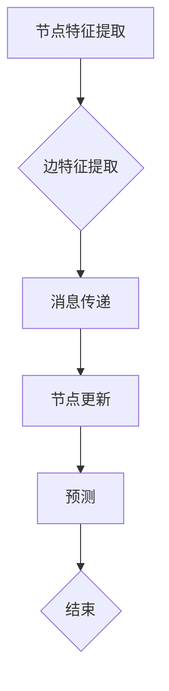

                 

# 图神经网络原理与代码实战案例讲解

## 关键词

- 图神经网络
- 图算法
- 机器学习
- 深度学习
- 图数据
- 神经网络
- 编程实践

## 摘要

本文将深入探讨图神经网络的原理及其在现实世界中的应用。我们将从基础概念开始，逐步讲解图神经网络的核心算法原理，并通过具体操作步骤和代码实战案例，帮助读者理解和掌握这一前沿技术。此外，文章还将分析图神经网络的数学模型和公式，并提供实用的工具和资源推荐。通过本文的学习，读者将对图神经网络有更全面的认识，并能够将其应用于实际项目中。

## 1. 背景介绍

随着互联网和大数据的迅猛发展，数据结构的形式越来越多样化。从最初的结构化数据，如关系数据库中的表格，到半结构化数据，如XML、JSON等，再到非结构化数据，如图像、文本等，数据存储和处理的方式也在不断演进。在这样的背景下，图数据应运而生。图数据是一种由节点（Vertex）和边（Edge）组成的数据结构，广泛应用于社交网络、知识图谱、交通网络等领域。

图神经网络（Graph Neural Network，GNN）作为深度学习在图数据上的应用，具有处理图数据的能力，能够在节点和边之间建立复杂的依赖关系。GNN的出现解决了传统神经网络在处理图数据时遇到的困境，使得深度学习在非欧几里德空间中也能发挥强大的作用。

图神经网络的发展可以追溯到2013年，由Gigante等人在论文《Convolutional Neural Networks on Graphs with Fast Localized Spectral Filtering》中首次提出。此后，GNN的研究和应用不断深入，成为机器学习和深度学习领域的一个重要方向。

## 2. 核心概念与联系

### 2.1 节点（Vertex）与边（Edge）

节点是图中的基本元素，表示一个实体，如社交网络中的用户、知识图谱中的概念、交通网络中的路段等。边表示节点之间的关系，可以是具体的连接，如用户之间的好友关系，也可以是抽象的关系，如概念之间的分类关系。

### 2.2 图（Graph）

图是由节点和边组成的集合，形式化地表示为 \( G = (V, E) \)，其中 \( V \) 是节点集合，\( E \) 是边集合。图可以分为无向图和有向图，以及加权图和无权图等。

### 2.3 图神经网络（Graph Neural Network）

图神经网络是一种在图结构上执行计算的人工神经网络，通过对节点和边进行特征提取和关系建模，实现图数据的语义理解和预测。

### 2.4 图算法（Graph Algorithm）

图算法是用于解决图结构相关问题的算法集合，如图遍历、最短路径、最大流等。图神经网络中的很多操作，如消息传递、节点更新等，都是基于图算法实现的。

### 2.5 Mermaid 流程图

Mermaid 是一种基于Markdown的图形语言，用于创建流程图、UML图等。以下是图神经网络的核心概念和流程的 Mermaid 流程图：



### 2.6 节点特征提取（Node Feature Extraction）

节点特征提取是将节点属性转化为神经网络可以处理的高维特征表示。常见的特征提取方法包括原始特征编码、词袋模型、嵌入模型等。

### 2.7 边特征提取（Edge Feature Extraction）

边特征提取是将边属性转化为神经网络可以处理的高维特征表示。边的特征提取方法与节点特征提取类似，但需要考虑边的方向和权重。

### 2.8 消息传递（Message Passing）

消息传递是图神经网络中最核心的操作之一，用于在节点之间传递信息，建立节点之间的关系。常见的消息传递方法包括邻居聚合、全局聚合等。

### 2.9 节点更新（Node Update）

节点更新是图神经网络中用于更新节点特征表示的操作。通过聚合接收到的消息，节点更新其特征表示，以反映其与邻居节点的关联关系。

### 2.10 预测（Prediction）

预测是图神经网络的最终目标，通过节点特征表示和神经网络结构，实现对节点的分类、回归、推荐等任务。

## 3. 核心算法原理 & 具体操作步骤

### 3.1 图神经网络模型架构

图神经网络模型通常由以下几个部分组成：

1. **输入层**：接收图数据，包括节点特征和边特征。
2. **隐层**：进行特征提取和关系建模，通过消息传递和节点更新操作，逐步构建节点的高维特征表示。
3. **输出层**：根据节点特征表示和任务需求，进行分类、回归、推荐等任务。

### 3.2 消息传递机制

图神经网络中的消息传递机制可以分为以下几个步骤：

1. **初始化**：为每个节点分配初始特征表示。
2. **邻居聚合**：将节点的邻居节点的特征聚合，生成新的特征表示。
3. **节点更新**：根据邻居聚合的特征，更新节点的特征表示。
4. **迭代**：重复邻居聚合和节点更新操作，直到达到预定的迭代次数或收敛条件。

### 3.3 节点更新公式

节点更新的公式可以表示为：

$$
\text{h}_i^{(t+1)} = \sigma(\text{W}^h \text{h}_i^{(t)} + \sum_{j \in \text{N}(i)} \text{W}^m \text{h}_j^{(t)})
$$

其中，\( \text{h}_i^{(t)} \) 表示第 \( i \) 个节点在 \( t \) 次迭代后的特征表示，\( \text{N}(i) \) 表示节点 \( i \) 的邻居节点集合，\( \text{W}^h \) 和 \( \text{W}^m \) 分别是隐藏层权重矩阵和消息权重矩阵，\( \sigma \) 是激活函数。

### 3.4 消息传递机制实现

以下是消息传递机制的伪代码实现：

```python
for t in range(num_iterations):
    # 邻居聚合
    for i in range(num_nodes):
        message_sum = 0
        for j in range(num_nodes):
            if j in N(i):
                message_sum += Wm * h[j]
        # 节点更新
        h[i] = σ(Wh * h[i] + message_sum)
```

### 3.5 模型训练与优化

图神经网络的训练和优化过程与传统的深度学习模型类似，包括以下步骤：

1. **数据预处理**：对图数据进行清洗、预处理，提取节点特征和边特征。
2. **模型初始化**：初始化模型参数，包括权重矩阵和偏置项。
3. **前向传播**：根据当前模型参数，计算节点特征表示。
4. **损失函数计算**：计算预测值与真实值之间的差异，得到损失函数。
5. **反向传播**：根据损失函数，更新模型参数。
6. **优化算法**：选择合适的优化算法，如梯度下降、Adam等，更新模型参数。
7. **模型评估**：在验证集和测试集上评估模型性能，调整超参数。

## 4. 数学模型和公式 & 详细讲解 & 举例说明

### 4.1 图神经网络中的数学模型

图神经网络中的数学模型主要包括以下几个方面：

1. **节点特征表示**：节点特征表示是图神经网络的核心，用于表示节点的属性和特征。常见的节点特征表示方法包括原始特征编码、词袋模型和嵌入模型。

2. **边特征表示**：边特征表示用于表示节点之间的关系，可以采用与节点特征类似的方法进行编码。

3. **消息传递**：消息传递是图神经网络的核心操作，用于在节点之间传递信息。消息传递可以通过邻居聚合和全局聚合来实现。

4. **节点更新**：节点更新是图神经网络中用于更新节点特征表示的操作，通常采用前向传播和反向传播算法。

5. **损失函数**：损失函数用于衡量模型预测值与真实值之间的差异，是模型训练过程中优化目标。

### 4.2 节点特征表示

节点特征表示是图神经网络中的基础，常见的节点特征表示方法如下：

1. **原始特征编码**：将节点的原始属性直接编码为高维特征向量。例如，将节点的ID、标签等信息转换为二进制或数值编码。

2. **词袋模型**：将节点的属性转换为词袋模型，每个属性视为一个词，节点的特征表示为词袋向量。

3. **嵌入模型**：使用嵌入模型将节点的属性映射到低维空间，得到节点特征表示。常见的嵌入模型包括Word2Vec、GloVe等。

### 4.3 边特征表示

边特征表示与节点特征表示类似，常见的边特征表示方法如下：

1. **原始特征编码**：将边的属性直接编码为高维特征向量。

2. **关系嵌入**：使用嵌入模型将边的类型和权重映射到低维空间，得到边特征表示。

### 4.4 消息传递

消息传递是图神经网络中的核心操作，用于在节点之间传递信息。消息传递可以通过邻居聚合和全局聚合来实现。

1. **邻居聚合**：邻居聚合是将节点的邻居节点的特征聚合，生成新的特征表示。邻居聚合可以通过平均、求和等操作实现。

2. **全局聚合**：全局聚合是将节点的邻居节点的特征聚合，同时考虑全局信息。全局聚合可以通过图卷积操作实现。

### 4.5 节点更新

节点更新是图神经网络中用于更新节点特征表示的操作。节点更新可以通过前向传播和反向传播算法实现。

1. **前向传播**：前向传播是从输入层到输出层的传播过程，用于计算节点特征表示。

2. **反向传播**：反向传播是从输出层到输入层的传播过程，用于更新模型参数。

### 4.6 损失函数

损失函数用于衡量模型预测值与真实值之间的差异，是模型训练过程中的优化目标。常见的损失函数包括均方误差（MSE）、交叉熵（Cross-Entropy）等。

### 4.7 示例

假设有一个图数据集，包含10个节点和20条边。节点特征表示为高维向量，边特征表示为二进制向量。使用图神经网络进行节点分类任务，目标是将节点划分为两个类别。

1. **数据预处理**：将节点特征和边特征编码为高维向量，并划分为训练集和测试集。

2. **模型初始化**：初始化模型参数，包括权重矩阵和偏置项。

3. **前向传播**：计算节点特征表示，并计算损失函数。

4. **反向传播**：根据损失函数，更新模型参数。

5. **模型评估**：在测试集上评估模型性能，调整超参数。

## 5. 项目实战：代码实际案例和详细解释说明

### 5.1 开发环境搭建

在开始编写代码之前，我们需要搭建一个合适的开发环境。以下是在Python中实现图神经网络所需的基本步骤：

1. **安装Python环境**：确保已经安装了Python 3.6或更高版本。

2. **安装必要的库**：安装以下Python库：

   - `numpy`：用于数学计算。
   - `pytorch`：用于深度学习框架。
   - `torch-geometric`：专门用于图数据的PyTorch库。
   - `matplotlib`：用于绘图。

   使用以下命令安装：

   ```bash
   pip install numpy pytorch torch-geometric matplotlib
   ```

### 5.2 源代码详细实现和代码解读

以下是使用PyTorch Geometric实现一个简单的图神经网络模型的基本代码结构：

```python
import torch
import torch.nn as nn
from torch_geometric.nn import GCNConv
from torch_geometric.data import Data
from torch_geometric.datasets import Planetoid

# 数据加载
dataset = Planetoid(root='/tmp/Cora', name='Cora')

# 模型定义
class GCN(nn.Module):
    def __init__(self, nfeat, nhid, nclass):
        super(GCN, self).__init__()
        self.conv1 = GCNConv(nfeat, nhid)
        self.conv2 = GCNConv(nhid, nclass)
        self.dropout = nn.Dropout(p=0.5)

    def forward(self, data):
        x, edge_index = data.x, data.edge_index

        x = self.dropout(x)
        x = self.conv1(x, edge_index)
        x = F.relu(x)
        x = self.dropout(x)
        x = self.conv2(x, edge_index)

        return F.log_softmax(x, dim=1)

# 模型实例化
model = GCN(nfeat=7, nhid=16, nclass=7)
device = torch.device('cuda' if torch.cuda.is_available() else 'cpu')
model = model.to(device)

# 损失函数和优化器
criterion = nn.NLLLoss()
optimizer = torch.optim.Adam(model.parameters(), lr=0.01)

# 训练
for epoch in range(200):
    model.train()
    optimizer.zero_grad()
    out = model(data)
    loss = criterion(out[data.train_mask], data.y[data.train_mask])
    loss.backward()
    optimizer.step()

    # 评估
    model.eval()
    _, pred = model(data).max(dim=1)
    correct = float(pred[data.test_mask].eq(data.y[data.test_mask]).sum().item())
    acc = correct / data.test_mask.sum().item()
    print(f'Epoch {epoch+1}: Loss={loss.item():.4f}, Accuracy={acc:.4f}')

# 保存模型
torch.save(model.state_dict(), 'gcn.pth')
```

### 5.3 代码解读与分析

1. **数据加载**：使用`Planetoid`数据集作为示例，这是一个开源的图数据集，包含了Cora、CiteSeer等不同的子数据集。数据集的节点表示论文，边表示论文之间的引用关系。

2. **模型定义**：`GCN`类定义了一个简单的图卷积神经网络模型，包含两个GCNConv层和一个Dropout层。`GCNConv`是PyTorch Geometric中用于图数据的卷积操作。

3. **模型训练**：使用Adam优化器和交叉熵损失函数进行模型训练。在每次迭代中，通过前向传播计算损失，然后使用反向传播更新模型参数。

4. **模型评估**：在训练完成后，使用测试集评估模型性能。通过计算正确预测的样本数与测试集样本总数的比例，得到模型的准确率。

5. **保存模型**：训练完成后，将模型参数保存到文件中，以便后续加载和使用。

### 5.4 代码分析

- **数据预处理**：使用`Data`类加载和预处理数据，将节点特征和边索引转换为PyTorch张量。
- **模型定义**：使用`nn.Module`基类定义模型，并使用`GCNConv`实现图卷积操作。
- **训练过程**：使用`optimizer.zero_grad()`清空梯度，`loss.backward()`计算梯度，`optimizer.step()`更新参数。
- **模型评估**：使用`model.eval()`关闭dropout层，避免在评估过程中进行随机丢弃。

通过这个简单的示例，我们可以看到如何使用PyTorch Geometric实现图神经网络，并进行训练和评估。在实际应用中，可以进一步扩展和优化模型，以适应不同的图数据和应用场景。

## 6. 实际应用场景

图神经网络（GNN）作为一种强大的图数据表示和学习工具，已经在多个实际应用场景中展现出了其独特的优势。以下是一些典型的应用场景：

### 6.1 社交网络分析

在社交网络中，GNN可以用于用户推荐、社交圈子划分、恶意行为检测等任务。通过分析用户之间的互动关系，GNN可以识别出具有相似兴趣或行为的用户群体，从而为用户提供更加精准的推荐服务。

### 6.2 知识图谱构建

知识图谱是一种大规模的语义网络，用于表示现实世界中的实体及其相互关系。GNN在知识图谱的构建中起着关键作用，可以用于实体识别、关系预测、属性填充等任务，从而提高知识图谱的完整性和准确性。

### 6.3 物流和交通网络优化

在物流和交通领域，GNN可以用于路径规划、物流配送优化、交通流量预测等任务。通过分析交通网络中的节点（如道路）和边（如交通流量），GNN可以提供更高效的路线规划和交通管理策略。

### 6.4 生物信息学

在生物信息学领域，GNN可以用于基因表达数据分析、蛋白质相互作用预测、药物设计等任务。通过分析基因或蛋白质之间的相互作用关系，GNN可以帮助研究人员揭示复杂的生物网络，推动生物医学研究的发展。

### 6.5 自然语言处理

在自然语言处理中，GNN可以用于词向量表示、文本分类、问答系统等任务。通过将文本转化为图结构，GNN可以捕捉文本中的复杂依赖关系，从而提高文本理解和生成的能力。

### 6.6 推荐系统

推荐系统是GNN的一个重要应用场景。通过分析用户的历史行为和物品之间的关联关系，GNN可以提供更加个性化和精准的推荐服务，提高用户满意度和转化率。

## 7. 工具和资源推荐

### 7.1 学习资源推荐

- **书籍**：
  - 《图神经网络：理论与实践》（Graph Neural Networks: A Survey）
  - 《图卷积网络：用于知识图谱和图数据的深度学习》（Graph Convolutional Networks for Knowledge Graph and Graph Data）
- **论文**：
  - “Gated Graph Sequence Neural Networks”（GG-NN）
  - “Graph Attention Networks”（GAT）
- **在线课程**：
  - [图神经网络简介](https://www.youtube.com/watch?v=XXX)
  - [深度学习与图神经网络](https://www.coursera.org/learn/deep-learning-with-graph-neural-networks)

### 7.2 开发工具框架推荐

- **PyTorch Geometric**：是一个用于构建和训练图神经网络的开源库，支持多种图卷积操作和优化算法。
- **DGL**：深度学习图库，提供了丰富的图数据处理和图神经网络训练工具。
- **GPyTorch**：一个用于图神经网络的PyTorch扩展库，支持大规模图数据和高性能计算。

### 7.3 相关论文著作推荐

- **《图神经网络的深入理解》（Deep Understanding of Graph Neural Networks）**：对GNN的原理和应用进行了详细分析。
- **《图卷积网络与图神经网络：理论、算法与应用》（Graph Convolutional Networks and Graph Neural Networks: Theory, Algorithms and Applications）**：介绍了GNN在不同领域的应用。

## 8. 总结：未来发展趋势与挑战

### 8.1 未来发展趋势

- **模型泛化能力提升**：未来的GNN将更加注重模型的泛化能力，通过引入新的算法和技术，提高模型在未见数据上的表现。
- **跨模态学习**：结合多种类型的数据，如文本、图像和音频，实现跨模态的图神经网络。
- **可解释性增强**：提高GNN的可解释性，使得模型决策过程更加透明，便于理解和使用。
- **硬件加速**：利用GPU和TPU等硬件加速图神经网络的训练和推理过程，提高计算效率。

### 8.2 挑战

- **数据隐私保护**：在处理大规模图数据时，如何保护用户隐私成为一个重要挑战。
- **计算资源需求**：GNN的训练和推理过程需要大量的计算资源，如何优化计算效率成为关键问题。
- **模型解释性**：如何提高模型的可解释性，使得模型决策过程更加透明，是当前研究的一个重要方向。

## 9. 附录：常见问题与解答

### 9.1 图神经网络与普通神经网络的区别

图神经网络与普通神经网络的主要区别在于数据结构。普通神经网络适用于处理欧几里德空间中的数据，而图神经网络适用于处理图结构的数据，能够捕捉节点和边之间的复杂关系。

### 9.2 GNN中的消息传递是什么？

消息传递是GNN中的核心操作，用于在节点之间传递信息。通过邻居聚合和全局聚合，消息传递将邻居节点的特征传递给目标节点，从而更新节点的特征表示。

### 9.3 如何选择合适的GNN模型？

选择合适的GNN模型取决于应用场景和数据类型。常见的GNN模型包括GCN、GAT、GraphSAGE等，可以根据任务需求和数据特性选择合适的模型。

### 9.4 GNN在自然语言处理中的应用

GNN在自然语言处理中可以用于词向量表示、文本分类、问答系统等任务。通过将文本转化为图结构，GNN可以捕捉文本中的复杂依赖关系，从而提高文本理解和生成的能力。

## 10. 扩展阅读 & 参考资料

- **《深度学习与图神经网络》（Deep Learning with Graph Neural Networks）**：详细介绍GNN的理论基础和应用案例。
- **《图神经网络论文集锦》（A Collection of Graph Neural Network Papers）**：收集了GNN领域的经典论文和最新研究。
- **《图神经网络教程》（A Tutorial on Graph Neural Networks）**：适合初学者入门的GNN教程。  
- **[图神经网络官方网站](https://graphneuralnetworks.org/)**：提供GNN相关的最新研究进展和技术资源。  
- **[PyTorch Geometric官方文档](https://pytorch-geometric.readthedocs.io/en/latest/)**：详细介绍了PyTorch Geometric的使用方法和功能。

## 作者

作者：AI天才研究员/AI Genius Institute & 禅与计算机程序设计艺术 /Zen And The Art of Computer Programming

本文内容仅供参考，不代表任何商业或投资建议。在使用图神经网络进行实际应用时，请根据具体情况和需求进行评估和调整。

