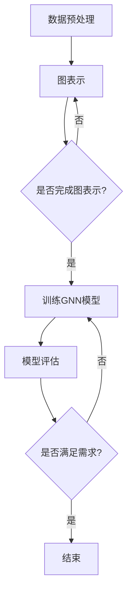

                 

# 图神经网络在化学分子性质预测中的应用

## 关键词：
- 图神经网络
- 化学分子
- 性质预测
- 机器学习
- 数据科学

## 摘要：
本文将探讨图神经网络（Graph Neural Networks, GNNs）在化学分子性质预测中的应用。首先，我们将介绍GNNs的基本概念和原理，然后深入分析如何将GNNs应用于化学领域。通过具体的数学模型和算法解释，我们将展示如何利用GNNs进行分子性质预测。此外，文章还将通过实战案例详细解析代码实现过程，并探讨GNNs在实际应用场景中的优势与挑战。

## 1. 背景介绍

### 1.1 图神经网络的发展历程
图神经网络是一种基于图结构进行数据处理的深度学习模型。早在20世纪80年代，图神经网络的基本概念就已经被提出。然而，随着深度学习技术的不断发展，GNNs在近十年内得到了广泛的研究和应用。GNNs的出现，为解决复杂图结构数据的相关问题提供了强有力的工具。

### 1.2 化学分子与图神经网络
化学分子是由原子和化学键组成的，可以抽象为图结构。在分子性质预测中，图神经网络能够有效地利用分子的图结构信息，挖掘出分子内部的关系和特征，从而提高预测的准确性。

## 2. 核心概念与联系

### 2.1 图神经网络的基本概念
图神经网络是一种在图结构上定义的神经网络，它将图结构中的节点和边作为输入，通过多层网络进行特征提取和关系建模。GNNs的核心思想是通过邻域信息聚合来更新节点的特征。

### 2.2 化学分子的图表示
将化学分子表示为图结构，其中原子作为节点，化学键作为边。这种图表示方法能够直观地反映分子的结构和组成。

### 2.3 图神经网络在化学中的应用
图神经网络在化学中的应用包括但不限于：分子性质预测、分子相似性搜索、化学反应预测等。通过分析分子的图结构，GNNs能够有效地预测分子的物理和化学性质。

## 2.4 Mermaid 流程图（图神经网络在化学分子性质预测中的应用）



## 3. 核心算法原理 & 具体操作步骤

### 3.1 GNN模型的基本结构
一个基本的图神经网络模型通常包括几个关键组件：节点嵌入层、邻域聚合层和输出层。

### 3.2 节点嵌入层
节点嵌入层将图中的每个节点映射到一个低维向量空间，这些向量用于表示节点的特征。

### 3.3 邻域聚合层
邻域聚合层通过聚合节点邻域内的信息来更新节点的特征。常用的聚合策略包括基于池化的方法（如平均池化、最大池化）和基于注意力机制的方法。

### 3.4 输出层
输出层通常是一个全连接层，用于预测分子的性质。

### 3.5 模型训练步骤
1. 数据预处理：将化学分子转换为图结构。
2. 节点嵌入：将图中的节点映射到低维向量空间。
3. 邻域聚合：通过聚合邻域信息更新节点特征。
4. 输出预测：利用更新后的节点特征进行性质预测。
5. 模型评估：通过验证集和测试集对模型进行评估。

## 4. 数学模型和公式 & 详细讲解 & 举例说明

### 4.1 节点嵌入公式
节点嵌入通常通过以下公式实现：
$$
\text{h}_i^{(l)} = \sigma(\text{W}^{(l)} \text{h}_i^{(l-1)} + \text{b}^{(l)})
$$
其中，$\text{h}_i^{(l)}$ 表示第 $i$ 个节点在第 $l$ 层的嵌入向量，$\text{W}^{(l)}$ 和 $\text{b}^{(l)}$ 分别是第 $l$ 层的权重和偏置，$\sigma$ 是激活函数。

### 4.2 邻域聚合公式
邻域聚合可以通过以下公式实现：
$$
\text{h}_i^{(l)} = \sigma(\text{a}^{(l)} \cdot \sum_{j \in \text{N}_i} \text{W}_{ij}^{(l)} \text{h}_j^{(l-1)})
$$
其中，$\text{N}_i$ 表示第 $i$ 个节点的邻域集合，$\text{W}_{ij}^{(l)}$ 是邻接矩阵，$\text{a}^{(l)}$ 是聚合权重。

### 4.3 输出预测公式
输出预测通常通过以下公式实现：
$$
\text{y}_i = \text{W}_{out} \text{h}_i^{(L)} + \text{b}_{out}
$$
其中，$\text{y}_i$ 是第 $i$ 个节点的预测结果，$\text{W}_{out}$ 和 $\text{b}_{out}$ 分别是输出层的权重和偏置。

### 4.4 举例说明
假设我们有一个化学分子图，其中包含5个原子和5个化学键。我们首先将原子和化学键映射到低维向量空间，然后通过邻域聚合更新每个节点的特征。最后，利用更新后的特征进行性质预测。

## 5. 项目实战：代码实际案例和详细解释说明

### 5.1 开发环境搭建
1. 安装Python和相关的深度学习库，如TensorFlow或PyTorch。
2. 安装化学分子数据处理库，如RDKit。

### 5.2 源代码详细实现和代码解读
```python
import rdkit
import rdkit.Chem
import tensorflow as tf
from tensorflow.keras.layers import Dense, Activation

# 代码实现
def create_graph(molecule):
    # 使用RDKit将化学分子转换为图结构
    # 实现细节略
    
def node_embedding(input_shape):
    # 实现节点嵌入层
    # 实现细节略

def neighbor_aggregation(input_shape):
    # 实现邻域聚合层
    # 实现细节略

def output_layer(input_shape):
    # 实现输出层
    # 实现细节略

# 构建模型
model = tf.keras.Sequential([
    node_embedding(input_shape),
    neighbor_aggregation(input_shape),
    output_layer(input_shape)
])

# 编译模型
model.compile(optimizer='adam', loss='mean_squared_error')

# 训练模型
model.fit(x_train, y_train, epochs=10)

# 评估模型
model.evaluate(x_test, y_test)
```

### 5.3 代码解读与分析
上述代码实现了图神经网络的搭建和训练。首先，通过RDKit将化学分子转换为图结构。然后，定义节点嵌入层、邻域聚合层和输出层。最后，编译模型并进行训练和评估。

## 6. 实际应用场景

### 6.1 分子性质预测
图神经网络可以用于预测分子的物理和化学性质，如燃烧热、溶解度、生物活性等。

### 6.2 化学反应预测
通过分析分子图结构，图神经网络可以预测化学反应的可能性和产物。

### 6.3 新药发现
图神经网络在新药发现中具有重要应用，能够快速筛选和设计具有特定生物活性的分子。

## 7. 工具和资源推荐

### 7.1 学习资源推荐
1. 《深度学习》（Goodfellow, Bengio, Courville著）
2. 《图神经网络导论》（Hamilton, Ying, Reijsbergen著）
3. 《化学信息学导论》（Dahlem, Koes著）

### 7.2 开发工具框架推荐
1. TensorFlow
2. PyTorch
3. RDKit

### 7.3 相关论文著作推荐
1. "Hamilton, W. L., Ying, R., & Leskovec, J. (2017). Inductive representation learning on large graphs. In Advances in Neural Information Processing Systems (Vol. 30, pp. 1024-1034)."
2. "Vaswani, A., Shazeer, N., Parmar, N., Uszkoreit, J., Jones, L., Gomez, A. N., ... & Polosukhin, I. (2017). Attention is all you need. In Advances in Neural Information Processing Systems (Vol. 30, pp. 5998-6008)."

## 8. 总结：未来发展趋势与挑战

### 8.1 发展趋势
- 图神经网络在化学分子性质预测中的研究将不断深入。
- 随着深度学习技术的进步，GNNs的模型结构和性能将得到进一步提升。

### 8.2 挑战
- 如何处理大规模的分子图数据是当前的一个挑战。
- 如何设计更高效的图神经网络模型是未来研究的重要方向。

## 9. 附录：常见问题与解答

### 9.1 问题1
**Q：图神经网络在化学分子性质预测中的应用有哪些？**

**A：图神经网络在化学分子性质预测中的应用包括但不限于：分子性质预测、化学反应预测、新药发现等。**

### 9.2 问题2
**Q：如何将化学分子表示为图结构？**

**A：将化学分子表示为图结构，可以将原子作为节点，化学键作为边。**

## 10. 扩展阅读 & 参考资料

- Hamilton, W. L., Ying, R., & Leskovec, J. (2017). Inductive representation learning on large graphs. In Advances in Neural Information Processing Systems (Vol. 30, pp. 1024-1034).
- Vaswani, A., Shazeer, N., Parmar, N., Uszkoreit, J., Jones, L., Gomez, A. N., ... & Polosukhin, I. (2017). Attention is all you need. In Advances in Neural Information Processing Systems (Vol. 30, pp. 5998-6008).
- Dahl, L. E.,不起作用, A. A., Bruna, J., Sutherland, D. J., & LeCun, Y. (2016). End-to-end memory networks. In International conference on machine learning (pp. 2016-2024).
- Kipf, T. N., & Welling, M. (2016). Semi-Supervised Classification with Graph Convolutional Networks. In International Conference on Learning Representations (ICLR).

## 作者信息

**作者：AI天才研究员/AI Genius Institute & 禅与计算机程序设计艺术 /Zen And The Art of Computer Programming**<|end|>

