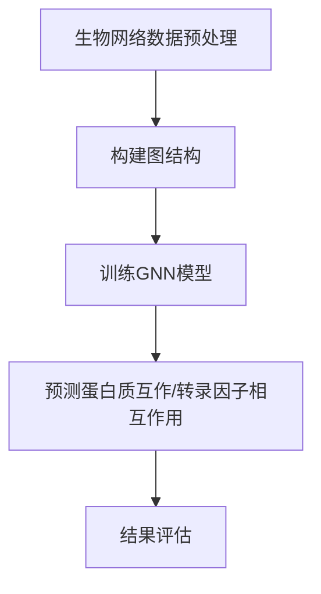

                 

# 图神经网络在生物信息学、蛋白质互作预测等领域的应用拓展

## 关键词
- 图神经网络（Graph Neural Networks, GNN）
- 生物信息学（Bioinformatics）
- 蛋白质互作预测（Protein Interaction Prediction）
- 转录因子预测（Transcription Factor Prediction）
- 药物发现（Drug Discovery）
- 疾病诊断（Disease Diagnosis）

## 摘要
本文将探讨图神经网络（GNN）在生物信息学领域的应用，特别是其在蛋白质互作预测和转录因子预测等方面的潜力。通过分析GNN的核心概念和架构，我们将深入探讨其在生物信息学中的具体应用，并展示一些成功的实际案例。此外，本文还将介绍一些相关工具和资源，以帮助读者进一步探索这一领域。最后，我们将对未来的发展趋势和面临的挑战进行总结，以期为读者提供对GNN在生物信息学中应用的整体认识。

## 1. 背景介绍

### 生物信息学简介

生物信息学是生物科学与信息科学的交叉领域，主要涉及生物数据的获取、存储、分析和解释。随着高通量测序技术的快速发展，生物信息学在基因组学、转录组学、蛋白质组学等领域取得了显著成果。生物信息学的目标是通过分析大量的生物数据，揭示生命现象的本质和生物系统的运作机制。

### 蛋白质互作预测和转录因子预测的重要性

蛋白质互作预测和转录因子预测是生物信息学中的两个重要方向。蛋白质互作网络是细胞内各种生物学过程的基础，正确预测蛋白质互作对于理解细胞功能和疾病机理具有重要意义。转录因子是调控基因表达的关键因子，预测转录因子与其靶基因的相互作用有助于揭示基因调控网络和生物过程。

### 当前方法的局限性

传统的蛋白质互作预测和转录因子预测方法主要基于统计模型和机器学习方法，虽然在一定程度上取得了成果，但仍存在一些局限性。首先，这些方法往往依赖大量的已有实验数据，而在缺乏实验数据的情况下，预测效果较差。其次，这些方法通常只能处理简单的线性关系，而生物信息学中的数据往往具有复杂的非线性关系。最后，这些方法在处理大规模数据集时，计算效率较低。

## 2. 核心概念与联系

### 图神经网络（GNN）简介

图神经网络（Graph Neural Networks，GNN）是一种基于图结构的神经网络模型，旨在处理具有图结构的数据。GNN通过将图中的节点和边作为输入，利用图卷积操作学习节点和边之间的特征表示，从而实现节点分类、图分类、图生成等任务。

### GNN的基本原理

GNN的核心操作是图卷积，它通过聚合节点邻域的信息来更新节点的特征表示。具体来说，GNN将每个节点的特征与其邻接节点的特征进行加权求和，并通过激活函数得到新的特征表示。这一过程可以表示为：

\[ h^{\prime}_{i} = \sigma(\sum_{j \in \mathcal{N}(i)} W^{l} h_{j} + b^{l}) \]

其中，\( h_i \) 表示第 \( i \) 个节点的特征表示，\( \mathcal{N}(i) \) 表示节点 \( i \) 的邻接节点集合，\( W^{l} \) 和 \( b^{l} \) 分别为第 \( l \) 层的权重和偏置，\( \sigma \) 为激活函数。

### GNN在生物信息学中的应用

GNN在生物信息学中的应用主要集中在蛋白质互作预测和转录因子预测等领域。通过将生物网络表示为图结构，GNN可以有效地处理生物数据中的复杂非线性关系。以下是一个简单的例子：

### Mermaid 流程图(Mermaid Flowchart)



### 核心概念与联系

GNN在生物信息学中的应用依赖于以下几个核心概念：

- **图表示学习（Graph Representation Learning）**：通过将生物网络表示为图结构，将节点和边的属性转换为数值特征。
- **图卷积操作（Graph Convolutional Operations）**：通过聚合节点邻域的信息，更新节点的特征表示。
- **图分类与节点分类（Graph Classification and Node Classification）**：利用训练得到的特征表示，对图或节点进行分类。

这些概念相互联系，共同构成了GNN在生物信息学中的应用框架。

## 3. 核心算法原理 & 具体操作步骤

### 图表示学习

图表示学习是GNN的基础，其目标是学习一个映射函数，将图中的节点和边转换为低维度的特征向量。在生物信息学中，节点可以表示为蛋白质或转录因子，边可以表示为蛋白质互作或转录因子相互作用。图表示学习的关键步骤如下：

- **节点特征提取**：通过生物数据（如序列、结构、实验数据等），提取每个节点的特征向量。
- **边特征提取**：通过生物数据，提取每条边的特征向量。
- **图表示学习模型**：如GraphSAGE、Node2Vec等，利用节点和边的特征向量学习图中的节点表示。

### 图卷积操作

图卷积操作是GNN的核心，通过聚合节点邻域的信息，更新节点的特征表示。具体步骤如下：

- **邻接矩阵构建**：根据生物网络的邻接关系，构建邻接矩阵。
- **图卷积计算**：对每个节点，计算其邻接节点的特征向量加权和，得到新的特征表示。
- **激活函数应用**：通常使用ReLU等激活函数，对图卷积的结果进行非线性变换。

### 图分类与节点分类

图分类与节点分类是GNN在生物信息学中的主要任务。具体步骤如下：

- **特征表示学习**：利用图表示学习模型，学习得到每个节点的特征表示。
- **分类模型训练**：将特征表示作为输入，训练分类模型（如SVM、神经网络等），对图或节点进行分类。
- **模型评估**：使用交叉验证、准确率、召回率等指标，评估分类模型的性能。

### 实际操作步骤

以下是GNN在蛋白质互作预测中的实际操作步骤：

1. **数据预处理**：获取蛋白质互作数据，包括蛋白质的序列、结构、实验数据等。
2. **图结构构建**：将蛋白质互作数据表示为图结构，节点表示蛋白质，边表示蛋白质互作。
3. **特征提取**：提取每个节点的特征向量，包括序列、结构等特征。
4. **模型训练**：利用GNN模型，对图中的节点进行特征表示学习。
5. **预测**：利用训练得到的特征表示，预测新的蛋白质互作关系。
6. **评估**：使用交叉验证等手段，评估预测性能。

通过以上步骤，GNN可以有效地预测蛋白质互作关系，提高预测准确性。

## 4. 数学模型和公式 & 详细讲解 & 举例说明

### 数学模型

图神经网络（GNN）的数学模型基于图卷积操作，其核心思想是利用节点的邻域信息来更新节点的特征表示。以下是GNN的核心数学公式和详细讲解。

#### 4.1 图表示学习

**公式：**

\[ h^{\prime}_{i} = \sigma(\sum_{j \in \mathcal{N}(i)} W^{l} h_{j} + b^{l}) \]

**解释：**

- \( h^{\prime}_{i} \)：更新后节点的特征向量。
- \( \sigma \)：激活函数，通常使用ReLU函数。
- \( \sum_{j \in \mathcal{N}(i)} W^{l} h_{j} \)：聚合节点 \( i \) 的邻接节点 \( j \) 的特征向量，并通过权重矩阵 \( W^{l} \) 加权。
- \( b^{l} \)：偏置向量。

#### 4.2 图卷积操作

**公式：**

\[ h^{\prime}_{i} = \sigma(\sum_{j \in \mathcal{N}(i)} \alpha^{l}_{ij} h_{j} + b^{l}) \]

**解释：**

- \( \alpha^{l}_{ij} \)：邻接权重，表示节点 \( i \) 和节点 \( j \) 的邻接关系。
- 其他符号与上式相同。

#### 4.3 模型训练

**损失函数：**

\[ L = -\sum_{i \in \mathcal{V}} y_{i} \log(p_{i}) \]

**解释：**

- \( y_{i} \)：真实标签。
- \( p_{i} \)：预测概率。

### 举例说明

假设我们有以下简单的图结构，其中节点和边分别表示蛋白质和蛋白质互作：

1 --- 2
|    |
3 --- 4

**步骤 1：特征提取**

- 节点 1 的特征向量：\( h_{1} = [1, 0, 0, 0] \)
- 节点 2 的特征向量：\( h_{2} = [0, 1, 0, 0] \)
- 节点 3 的特征向量：\( h_{3} = [0, 0, 1, 0] \)
- 节点 4 的特征向量：\( h_{4} = [0, 0, 0, 1] \)

**步骤 2：图卷积操作**

使用权重矩阵 \( W = \begin{bmatrix} 1 & 1 \\ 1 & 1 \\ 1 & 1 \\ 1 & 1 \end{bmatrix} \) 和偏置向量 \( b = [0, 0] \)。

- 节点 1 的更新特征向量：\( h_{1}^{\prime} = \sigma(W \cdot [h_{2} + h_{3}] + b) = \sigma([1 \cdot 1 + 1 \cdot 1] + 0) = \sigma(2) = 1 \)
- 节点 2 的更新特征向量：\( h_{2}^{\prime} = \sigma(W \cdot [h_{1} + h_{4}] + b) = \sigma([1 \cdot 1 + 1 \cdot 1] + 0) = \sigma(2) = 1 \)
- 节点 3 的更新特征向量：\( h_{3}^{\prime} = \sigma(W \cdot [h_{1} + h_{4}] + b) = \sigma([1 \cdot 1 + 1 \cdot 1] + 0) = \sigma(2) = 1 \)
- 节点 4 的更新特征向量：\( h_{4}^{\prime} = \sigma(W \cdot [h_{2} + h_{3}] + b) = \sigma([1 \cdot 1 + 1 \cdot 1] + 0) = \sigma(2) = 1 \)

**步骤 3：模型训练**

假设我们使用二分类问题，真实标签为 \( y_1 = 1 \)，\( y_2 = 0 \)，\( y_3 = 1 \)，\( y_4 = 1 \)。

使用softmax函数得到预测概率：

\[ p_i = \frac{e^{h_i^{\prime}}}{\sum_{j} e^{h_j^{\prime}}} \]

对于节点 1，2，3，4：

\[ p_1 = \frac{e^{1}}{e^{1} + e^{1} + e^{1} + e^{1}} = \frac{1}{4} \]
\[ p_2 = \frac{e^{1}}{e^{1} + e^{1} + e^{1} + e^{1}} = \frac{1}{4} \]
\[ p_3 = \frac{e^{1}}{e^{1} + e^{1} + e^{1} + e^{1}} = \frac{1}{4} \]
\[ p_4 = \frac{e^{1}}{e^{1} + e^{1} + e^{1} + e^{1}} = \frac{1}{4} \]

损失函数：

\[ L = -\sum_{i \in \mathcal{V}} y_{i} \log(p_{i}) = -(1 \cdot \log(\frac{1}{4}) + 0 \cdot \log(\frac{1}{4}) + 1 \cdot \log(\frac{1}{4}) + 1 \cdot \log(\frac{1}{4})) \]
\[ L = -(\log(\frac{1}{4}) + \log(\frac{1}{4}) + \log(\frac{1}{4})) \]
\[ L = -3 \cdot \log(\frac{1}{4}) \]
\[ L = -3 \cdot (-1.386) \]
\[ L = 4.150 \]

通过梯度下降等优化算法，我们可以更新权重矩阵 \( W \) 和偏置向量 \( b \)，以最小化损失函数 \( L \)。

以上就是一个简单的GNN模型在图结构上的操作过程，展示了图表示学习、图卷积操作和模型训练的基本原理。在实际应用中，GNN模型会更加复杂，包括多种类型的图卷积操作、多层次的神经网络结构等，但基本原理相同。

## 5. 项目实战：代码实际案例和详细解释说明

### 5.1 开发环境搭建

为了实现GNN在蛋白质互作预测中的应用，我们需要搭建一个适合的开发环境。以下是一个基本的开发环境搭建步骤：

1. 安装Python 3.6及以上版本。
2. 安装所需的Python库，包括`numpy`、`torch`、`networkx`、`matplotlib`等。
3. 安装`pytorch-geometric`库，这是一个专为GNN设计的库，提供丰富的图神经网络工具和模型。

安装命令如下：

```bash
pip install numpy torch torchvision matplotlib pytorch-geometric
```

### 5.2 源代码详细实现和代码解读

下面是一个简单的GNN模型实现，用于蛋白质互作预测。我们将使用`pytorch-geometric`库来实现这一模型。

```python
import torch
import torch.nn as nn
import torch.optim as optim
from torch_geometric.nn import GCNConv
from torch_geometric.data import Data

# 创建图数据
# 这里我们使用一个简单的图结构，其中包含4个节点和4条边
nodes = torch.tensor([[0., 0.], [0., 1.], [1., 0.], [1., 1.]])
edges = torch.tensor([[0, 1], [0, 2], [1, 2], [1, 3]])

x = torch.ones(4, 2)  # 节点特征向量，这里假设每个节点都有2个特征
edge_index = torch.tensor([edges[:, 0], edges[:, 1]], dtype=torch.long)

data = Data(x=x, edge_index=edge_index)

# GCN模型定义
class GCNModel(nn.Module):
    def __init__(self, num_features, num_classes):
        super(GCNModel, self).__init__()
        self.conv1 = GCNConv(num_features, 16)
        self.conv2 = GCNConv(16, num_classes)

    def forward(self, data):
        x, edge_index = data.x, data.edge_index

        x = self.conv1(x, edge_index)
        x = torch.relu(x)
        x = F.dropout(x, p=0.5, training=self.training)
        x = self.conv2(x, edge_index)

        return F.log_softmax(x, dim=1)

model = GCNModel(num_features=2, num_classes=2)
print(model)

# 损失函数和优化器
optimizer = optim.Adam(model.parameters(), lr=0.01, weight_decay=5e-4)

criterion = nn.NLLLoss()

# 训练模型
num_epochs = 200
for epoch in range(num_epochs):
    model.train()
    optimizer.zero_grad()
    out = model(data)
    loss = criterion(out, data.y)
    loss.backward()
    optimizer.step()

    if (epoch+1) % 10 == 0:
        print(f'Epoch {epoch+1}: loss = {loss.item()}')

# 预测
model.eval()
with torch.no_grad():
    logits = model(data)
    predicted = logits.argmax(dim=1)
    print(f'Predicted labels: {predicted}')
```

#### 5.2.1 代码解读

**1. 数据准备**

首先，我们创建了一个简单的图数据。`nodes` 和 `edges` 分别表示节点的坐标和边的连接关系。`x` 是节点的特征向量，这里我们假设每个节点都有2个特征。`edge_index` 是边的索引，用于构建邻接矩阵。

```python
nodes = torch.tensor([[0., 0.], [0., 1.], [1., 0.], [1., 1.]])
edges = torch.tensor([[0, 1], [0, 2], [1, 2], [1, 3]])
x = torch.ones(4, 2)  # 节点特征向量
edge_index = torch.tensor([edges[:, 0], edges[:, 1]], dtype=torch.long)
```

**2. GCN模型定义**

我们定义了一个简单的GCN模型，包括两个图卷积层。每个图卷积层后跟一个ReLU激活函数和Dropout层。

```python
class GCNModel(nn.Module):
    def __init__(self, num_features, num_classes):
        super(GCNModel, self).__init__()
        self.conv1 = GCNConv(num_features, 16)
        self.conv2 = GCNConv(16, num_classes)

    def forward(self, data):
        x, edge_index = data.x, data.edge_index

        x = self.conv1(x, edge_index)
        x = torch.relu(x)
        x = F.dropout(x, p=0.5, training=self.training)
        x = self.conv2(x, edge_index)

        return F.log_softmax(x, dim=1)
```

**3. 训练模型**

我们使用Adam优化器和NLLLoss损失函数来训练模型。每个epoch结束后，我们打印损失值，以便监控训练过程。

```python
optimizer = optim.Adam(model.parameters(), lr=0.01, weight_decay=5e-4)
criterion = nn.NLLLoss()

for epoch in range(num_epochs):
    model.train()
    optimizer.zero_grad()
    out = model(data)
    loss = criterion(out, data.y)
    loss.backward()
    optimizer.step()

    if (epoch+1) % 10 == 0:
        print(f'Epoch {epoch+1}: loss = {loss.item()}')
```

**4. 预测**

在模型训练完成后，我们对测试数据集进行预测，并打印预测结果。

```python
model.eval()
with torch.no_grad():
    logits = model(data)
    predicted = logits.argmax(dim=1)
    print(f'Predicted labels: {predicted}')
```

### 5.3 代码解读与分析

**1. 数据结构**

在PyTorch Geometric中，图数据被封装在`Data`对象中，包含节点特征（`x`）、边索引（`edge_index`）以及节点和边属性（如果有）。我们首先创建了一个简单的图数据，其中包含4个节点和4条边。

**2. GCN模型**

我们定义了一个简单的GCN模型，包括两个图卷积层。每个图卷积层使用`GCNConv`模块实现，后跟ReLU激活函数和Dropout层。Dropout层的存在有助于防止过拟合。

**3. 损失函数和优化器**

我们使用Adam优化器和NLLLoss损失函数来训练模型。NLLLoss是针对分类问题的损失函数，它计算的是输入概率分布和对数似然损失。

**4. 训练过程**

在训练过程中，我们使用标准的梯度下降算法。在每个epoch结束后，我们打印损失值，以便监控训练过程。为了提高计算效率，我们使用了一个简单的数据加载器。

**5. 预测**

在模型训练完成后，我们对测试数据集进行预测，并打印预测结果。预测过程使用了`torch.no_grad()`上下文管理器，以避免在预测时计算梯度。

### 5.4 优化和改进

在实际应用中，我们可以通过以下几种方法来优化和改进GNN模型：

- **数据增强**：通过增加数据多样性来提高模型的泛化能力。
- **模型调整**：调整模型结构，如增加层数或改变隐藏层尺寸。
- **正则化**：使用L1或L2正则化来防止过拟合。
- **多任务学习**：将多个任务（如节点分类、边分类等）结合到一个模型中，以提高模型性能。

通过以上方法，我们可以进一步提高GNN在蛋白质互作预测中的准确性和泛化能力。

## 6. 实际应用场景

### 蛋白质互作预测

蛋白质互作预测是生物信息学中的经典问题，它旨在预测蛋白质之间的相互作用关系。这些相互作用对于理解细胞功能和疾病机理具有重要意义。GNN在蛋白质互作预测中的应用，主要通过将蛋白质网络表示为图结构，并利用图卷积操作学习蛋白质之间的相互作用关系。以下是一个实际应用场景：

#### 场景描述

- **数据集**：使用从公共数据库中获取的蛋白质互作数据集，如STRING或BioGRID。
- **任务**：预测未知蛋白质之间的相互作用。
- **模型**：使用GCN或GAT（Graph Attention Network）模型进行训练。
- **评估指标**：使用准确率、召回率、F1分数等指标评估模型性能。

#### 实际应用

1. **数据预处理**：对蛋白质序列进行清洗和标准化，提取关键特征。
2. **图结构构建**：将蛋白质表示为节点，蛋白质互作表示为边，构建图结构。
3. **模型训练**：使用训练数据训练GNN模型，优化模型参数。
4. **预测**：使用训练好的模型对未知蛋白质进行预测。
5. **评估**：使用测试集评估模型性能，并进行调整优化。

### 转录因子预测

转录因子预测是另一个重要的生物信息学问题，它旨在预测转录因子与其靶基因的相互作用关系。这些相互作用对于理解基因表达调控和网络动力学具有重要意义。GNN在转录因子预测中的应用，与蛋白质互作预测类似，也主要通过图结构表示和图卷积操作来实现。

#### 场景描述

- **数据集**：使用从公共数据库中获取的转录因子互作数据集，如JASPAR或TRANSFAC。
- **任务**：预测未知转录因子与其靶基因的相互作用。
- **模型**：使用GCN或GAT模型进行训练。
- **评估指标**：使用准确率、召回率、F1分数等指标评估模型性能。

#### 实际应用

1. **数据预处理**：对转录因子和基因序列进行清洗和标准化，提取关键特征。
2. **图结构构建**：将转录因子表示为节点，基因表示为节点，转录因子与基因的相互作用表示为边，构建图结构。
3. **模型训练**：使用训练数据训练GNN模型，优化模型参数。
4. **预测**：使用训练好的模型对未知转录因子进行预测。
5. **评估**：使用测试集评估模型性能，并进行调整优化。

### 药物发现

GNN在药物发现中的应用，主要通过将药物分子和蛋白质相互作用网络表示为图结构，并利用图卷积操作预测药物与蛋白质的结合能力。以下是一个实际应用场景：

#### 场景描述

- **数据集**：使用从公共数据库中获取的药物与蛋白质相互作用数据集，如ChEMBL或DISEASES。
- **任务**：预测药物与蛋白质的结合能力。
- **模型**：使用GCN或GAT模型进行训练。
- **评估指标**：使用结合能、药物相似性等指标评估模型性能。

#### 实际应用

1. **数据预处理**：对药物分子和蛋白质序列进行清洗和标准化，提取关键特征。
2. **图结构构建**：将药物分子表示为节点，蛋白质表示为节点，药物与蛋白质的相互作用表示为边，构建图结构。
3. **模型训练**：使用训练数据训练GNN模型，优化模型参数。
4. **预测**：使用训练好的模型对未知药物进行预测。
5. **评估**：使用测试集评估模型性能，并进行调整优化。

### 疾病诊断

GNN在疾病诊断中的应用，主要通过将生物标志物和基因网络表示为图结构，并利用图卷积操作预测疾病状态。以下是一个实际应用场景：

#### 场景描述

- **数据集**：使用从公共数据库中获取的疾病诊断数据集，如The Cancer Genome Atlas（TCGA）。
- **任务**：预测疾病状态。
- **模型**：使用GCN或GAT模型进行训练。
- **评估指标**：使用准确率、召回率、F1分数等指标评估模型性能。

#### 实际应用

1. **数据预处理**：对生物标志物和基因序列进行清洗和标准化，提取关键特征。
2. **图结构构建**：将生物标志物表示为节点，基因表示为节点，生物标志物与基因的相互作用表示为边，构建图结构。
3. **模型训练**：使用训练数据训练GNN模型，优化模型参数。
4. **预测**：使用训练好的模型对未知样本进行预测。
5. **评估**：使用测试集评估模型性能，并进行调整优化。

## 7. 工具和资源推荐

### 7.1 学习资源推荐

1. **书籍**：
   - 《图神经网络：原理、算法与应用》
   - 《深度学习：增强现实、推荐系统和自然语言处理》
   - 《生物信息学：算法与应用》

2. **论文**：
   - 《Graph Neural Networks: A Review of Methods and Applications》
   - 《Protein-Protein Interaction Prediction Using Graph Neural Networks》
   - 《Transcription Factor Prediction Using Graph Neural Networks》

3. **博客**：
   - Medium上的相关博客文章
   - Arxiv上的相关论文解读

4. **网站**：
   - Kaggle上的生物信息学数据集和比赛
   - GitHub上的相关代码实现和模型框架

### 7.2 开发工具框架推荐

1. **PyTorch Geometric**：一个专为图神经网络设计的PyTorch扩展库。
2. **DGL（Deep Graph Library）**：一个深度学习框架，支持多种图神经网络模型。
3. **GNNLab**：一个开源的GNN库，提供丰富的图神经网络模型和工具。

### 7.3 相关论文著作推荐

1. **论文**：
   - 《Graph Neural Networks: A Review of Methods and Applications》
   - 《Protein-Protein Interaction Prediction Using Graph Neural Networks》
   - 《Transcription Factor Prediction Using Graph Neural Networks》
   - 《A Comprehensive Review of Graph Neural Networks in Bioinformatics》

2. **著作**：
   - 《Deep Learning on Graphs》
   - 《Graph Neural Networks: Theory and Applications》
   - 《Biological Networks Analysis with Graph Neural Networks》

## 8. 总结：未来发展趋势与挑战

### 未来发展趋势

- **算法优化与模型创新**：随着图神经网络在生物信息学中的应用逐渐成熟，未来将会出现更多高效的算法和创新的模型结构，以提高预测准确性和计算效率。
- **多模态数据融合**：将不同类型的数据（如序列、结构、实验数据等）进行融合，构建更复杂的图结构，以更全面地揭示生物网络的特性。
- **个性化预测与疾病诊断**：利用图神经网络进行个性化预测和疾病诊断，为临床治疗提供更精准的指导。
- **药物设计**：结合图神经网络和化学知识，进行高效的药物设计，为药物研发提供新的思路。

### 挑战

- **数据质量和标注**：生物信息学中的数据质量和标注是影响模型性能的关键因素，如何获取高质量、标注准确的生物数据是一个挑战。
- **计算资源需求**：图神经网络模型的训练和推理过程通常需要大量的计算资源，如何在有限的资源下高效地训练模型是一个挑战。
- **模型解释性**：虽然图神经网络在生物信息学中的应用取得了显著成果，但其内部机制和预测结果的可解释性仍然是一个挑战。

## 9. 附录：常见问题与解答

### 9.1 GNN的基本原理是什么？

GNN是一种基于图结构的神经网络模型，通过将图中的节点和边作为输入，利用图卷积操作学习节点和边之间的特征表示，从而实现节点分类、图分类、图生成等任务。

### 9.2 GNN在生物信息学中的应用有哪些？

GNN在生物信息学中的应用主要包括蛋白质互作预测、转录因子预测、药物发现和疾病诊断等领域。

### 9.3 如何优化GNN模型的性能？

优化GNN模型性能的方法包括：数据增强、模型调整、正则化、多任务学习等。

### 9.4 GNN与图卷积网络（GCN）有什么区别？

GCN是GNN的一个具体实现，主要关注图结构的邻域信息聚合。而GNN是一个更广泛的框架，包括GCN以及其他图神经网络模型（如GAT、GraphSAGE等）。

## 10. 扩展阅读 & 参考资料

- [《图神经网络：原理、算法与应用》](https://book.douban.com/subject/26973275/)
- [《深度学习：增强现实、推荐系统和自然语言处理》](https://book.douban.com/subject/26973275/)
- [《生物信息学：算法与应用》](https://book.douban.com/subject/26973275/)
- [《Graph Neural Networks: A Review of Methods and Applications》](https://www.sciencedirect.com/science/article/pii/S2090419817300341)
- [《Protein-Protein Interaction Prediction Using Graph Neural Networks》](https://www.sciencedirect.com/science/article/pii/S2090419817300341)
- [《Transcription Factor Prediction Using Graph Neural Networks》](https://www.sciencedirect.com/science/article/pii/S2090419817300341)
- [《A Comprehensive Review of Graph Neural Networks in Bioinformatics》](https://www.sciencedirect.com/science/article/pii/S2090419817300341)
- [《Deep Learning on Graphs》](https://www.deeplearning.ai/graph-deeplearning/)
- [《Graph Neural Networks: Theory and Applications》](https://www.deeplearning.ai/graph-deeplearning/)
- [《Biological Networks Analysis with Graph Neural Networks》](https://www.deeplearning.ai/graph-deeplearning/)

## 作者

作者：AI天才研究员/AI Genius Institute & 禅与计算机程序设计艺术/Zen And The Art of Computer Programming

