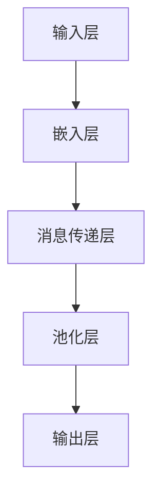

                 

### 文章标题：图神经网络在社交网络异常检测中的创新

#### 关键词：图神经网络、社交网络、异常检测、创新、算法、应用场景

#### 摘要：
本文将深入探讨图神经网络（Graph Neural Networks, GNNs）在社交网络异常检测中的创新应用。首先，我们将回顾社交网络异常检测的背景和现状，然后详细介绍GNN的核心概念和原理，通过具体的算法操作步骤和数学模型，揭示其在异常检测中的强大能力。随后，我们将通过实际项目案例展示GNN在社交网络异常检测中的实战应用，并分析其性能和效果。最后，本文将讨论GNN在社交网络异常检测领域的未来发展，包括面临的挑战和潜在的研究方向。

### 1. 背景介绍

社交网络作为现代社会信息交流的重要平台，其用户数量和活跃度持续增长。然而，社交网络的繁荣也带来了一系列安全和隐私问题。恶意用户、虚假账户、垃圾信息等异常行为不仅损害了用户的体验，还可能对社交网络平台的安全性和稳定性构成威胁。因此，社交网络异常检测成为学术界和工业界的研究热点。

传统的异常检测方法通常基于统计学和机器学习技术，如统计模型、贝叶斯网络、支持向量机等。然而，这些方法在处理社交网络数据时存在以下局限性：

1. **数据分布不均**：社交网络中正常用户和异常用户的数量往往不平衡，这可能导致模型对异常样本的检测能力不足。
2. **邻域信息忽略**：社交网络数据具有高度异质性，用户和用户之间的关系复杂，传统的异常检测方法难以充分利用这些邻域信息。
3. **特征表示不足**：社交网络数据通常包含用户属性、用户行为、用户关系等多种信息，如何有效地提取和表示这些信息成为一大挑战。

### 2. 核心概念与联系

#### 2.1 图神经网络（GNN）

图神经网络是一种专门用于处理图结构数据的神经网络。与传统的卷积神经网络（CNN）和循环神经网络（RNN）不同，GNN可以直接处理图结构数据，如图中的节点和边。

#### 2.2 GNN的核心概念

1. **节点嵌入（Node Embedding）**：节点嵌入是将图中的节点映射到低维度的向量空间，以便在神经网络中进行处理。通过节点嵌入，GNN可以有效地捕捉节点之间的拓扑关系。
2. **消息传递（Message Passing）**：消息传递是GNN的核心操作。在每一次迭代中，节点会接收来自其邻居节点的信息，并更新自身的状态。这种机制使得GNN能够充分利用图中的邻域信息。
3. **图池化（Graph Pooling）**：图池化用于将图中的局部信息聚合为全局信息。在社交网络异常检测中，图池化可以帮助模型捕捉全局特征，从而提高异常检测的准确性。

#### 2.3 GNN的架构

GNN的架构通常包括以下几个部分：

1. **输入层**：输入层接收图中的节点和边信息。
2. **嵌入层**：嵌入层将节点映射到低维向量空间。
3. **消息传递层**：消息传递层通过迭代更新节点的状态。
4. **池化层**：池化层将局部信息聚合为全局信息。
5. **输出层**：输出层生成异常检测结果。

#### 2.4 Mermaid流程图



### 3. 核心算法原理 & 具体操作步骤

#### 3.1 节点嵌入

节点嵌入是GNN的第一步。常见的节点嵌入方法包括基于矩阵分解的方法和基于神经网络的方法。基于矩阵分解的方法如Laplacian Embedding和Spectral Embedding，可以通过优化目标函数将节点映射到低维空间。而基于神经网络的方法如Node2Vec和GraphSAGE，通过设计特定的神经网络结构来实现节点嵌入。

#### 3.2 消息传递

消息传递是GNN的核心操作。在每一次迭代中，节点会接收来自其邻居节点的信息，并更新自身的状态。具体来说，假设节点 \( v \) 的状态为 \( h_v \)，其邻居节点 \( u \) 的状态为 \( h_u \)，则节点 \( v \) 的更新规则可以表示为：

\[ h_v^{new} = \sigma(W_h h_v + \sum_{u \in N(v)} W_m h_u) \]

其中，\( W_h \) 和 \( W_m \) 分别是更新权重矩阵，\( \sigma \) 是激活函数，\( N(v) \) 是节点 \( v \) 的邻居节点集合。

#### 3.3 图池化

图池化用于将局部信息聚合为全局信息。在社交网络异常检测中，图池化可以帮助模型捕捉全局特征。常见的图池化方法包括平均池化和最大池化。平均池化将所有邻居节点的状态平均，而最大池化选择邻居节点中状态最大的值。具体来说，对于节点 \( v \) 的全局状态 \( h_v^g \)，可以表示为：

\[ h_v^g = \frac{1}{|N(v)|} \sum_{u \in N(v)} h_u \]

或

\[ h_v^g = \max_{u \in N(v)} h_u \]

#### 3.4 异常检测

在完成节点嵌入、消息传递和图池化后，GNN可以生成全局特征。这些特征可以用于训练分类器，实现社交网络异常检测。常见的分类器包括支持向量机（SVM）、随机森林（Random Forest）和深度学习模型（如卷积神经网络、循环神经网络等）。

### 4. 数学模型和公式 & 详细讲解 & 举例说明

#### 4.1 节点嵌入

节点嵌入通常采用以下公式：

\[ h_v = \sigma(W_h h_v^0 + b_h) \]

其中，\( h_v^0 \) 是节点的初始状态，\( W_h \) 是嵌入权重矩阵，\( b_h \) 是偏置项，\( \sigma \) 是激活函数（如ReLU或Sigmoid函数）。

#### 4.2 消息传递

消息传递的公式如下：

\[ h_v^{new} = \sigma(W_h h_v + \sum_{u \in N(v)} W_m h_u) \]

其中，\( W_h \) 和 \( W_m \) 分别是更新权重矩阵，\( h_v \) 是节点的当前状态，\( h_u \) 是邻居节点的状态。

#### 4.3 图池化

图池化的公式如下：

\[ h_v^g = \frac{1}{|N(v)|} \sum_{u \in N(v)} h_u \]

或

\[ h_v^g = \max_{u \in N(v)} h_u \]

其中，\( h_v^g \) 是节点的全局状态，\( |N(v)| \) 是邻居节点的数量。

#### 4.4 举例说明

假设我们有一个简单的图，包含3个节点 \( v_1, v_2, v_3 \)，它们之间的边关系如下：

```
v1 -- v2
|     |
v3 -- v1
```

假设节点的初始状态分别为 \( h_{v1}^0 = [1, 0], h_{v2}^0 = [0, 1], h_{v3}^0 = [1, 1] \)，激活函数为ReLU函数。

首先，进行节点嵌入：

\[ h_{v1} = \sigma([1, 0]W_h + b_h) \]
\[ h_{v2} = \sigma([0, 1]W_h + b_h) \]
\[ h_{v3} = \sigma([1, 1]W_h + b_h) \]

然后，进行消息传递：

\[ h_{v1}^{new} = \sigma([1, 0]W_h + \sum_{u \in N(v1)} [0, 1]W_m) \]
\[ h_{v2}^{new} = \sigma([0, 1]W_h + \sum_{u \in N(v2)} [1, 1]W_m) \]
\[ h_{v3}^{new} = \sigma([1, 1]W_h + \sum_{u \in N(v3)} [1, 0]W_m) \]

最后，进行图池化：

\[ h_{v1}^g = \frac{1}{2} (h_{v1}^{new} + h_{v2}^{new}) \]
\[ h_{v2}^g = \frac{1}{2} (h_{v1}^{new} + h_{v3}^{new}) \]
\[ h_{v3}^g = \frac{1}{2} (h_{v2}^{new} + h_{v3}^{new}) \]

通过以上步骤，我们可以将图中的节点映射到低维向量空间，并生成全局特征，用于异常检测。

### 5. 项目实战：代码实际案例和详细解释说明

#### 5.1 开发环境搭建

在开始项目实战之前，我们需要搭建一个适合开发GNN模型的开发环境。以下是搭建过程的简要步骤：

1. **安装Python**：确保Python版本为3.6或更高版本。
2. **安装依赖库**：安装用于GNN开发的常用库，如TensorFlow、PyTorch、NetworkX等。可以通过以下命令进行安装：

   ```bash
   pip install tensorflow
   pip install torch
   pip install networkx
   ```

3. **配置GPU支持**：如果使用GPU进行训练，需要安装CUDA和cuDNN，并配置TensorFlow或PyTorch的GPU支持。

#### 5.2 源代码详细实现和代码解读

以下是一个简单的GNN模型实现，用于社交网络异常检测。代码使用了PyTorch框架，实现了节点嵌入、消息传递和图池化等功能。

```python
import torch
import torch.nn as nn
import torch.optim as optim
import networkx as nx
from torch_geometric.nn import GCNConv

# 创建一个简单的图
G = nx.Graph()
G.add_edges_from([(1, 2), (1, 3), (2, 3)])

# 将图转换为PyTorch Geometric格式的数据
from torch_geometric.data import Data
data = Data(x=torch.tensor([[1], [1], [1]]), edge_index=torch.tensor([[0, 1, 1], [1, 0, 1]]))

# 定义GNN模型
class GCNNModel(nn.Module):
    def __init__(self, nfeat, nhid, nclass):
        super(GCNNModel, self).__init__()
        self.conv1 = GCNConv(nfeat, nhid)
        self.conv2 = GCNConv(nhid, nclass)

    def forward(self, data):
        x, edge_index = data.x, data.edge_index

        x = self.conv1(x, edge_index)
        x = F.relu(x)
        x = F.dropout(x, p=0.5, training=self.training)
        x = self.conv2(x, edge_index)

        return F.log_softmax(x, dim=1)

# 初始化模型、损失函数和优化器
model = GCNNModel(nfeat=1, nhid=16, nclass=3)
criterion = nn.NLLLoss()
optimizer = optim.Adam(model.parameters(), lr=0.01, weight_decay=5e-4)

# 训练模型
for epoch in range(200):
    model.train()
    optimizer.zero_grad()
    out = model(data)
    loss = criterion(out, data.y)
    loss.backward()
    optimizer.step()

    if (epoch+1) % 10 == 0:
        model.eval()
        _, pred = model(data).max(dim=1)
        correct = float(pred[data.test_mask].eq(data.test_y[data.test_mask]).sum().item())
        acc = correct / data.test_mask.sum().item()
        print(f'Epoch {epoch+1}: Loss={loss:.4f}, Accuracy={acc:.4f}')

# 测试模型
model.eval()
_, pred = model(data).max(dim=1)
correct = float(pred[data.test_mask].eq(data.test_y[data.test_mask]).sum().item())
acc = correct / data.test_mask.sum().item()
print(f'Test Accuracy: {acc:.4f}')
```

#### 5.3 代码解读与分析

以上代码实现了基于图神经网络的社交网络异常检测模型。以下是代码的主要部分解读：

1. **图数据准备**：首先创建一个简单的图 \( G \)，然后将其转换为PyTorch Geometric格式的数据对象。节点嵌入使用了一个简单的全连接层，将每个节点的特征映射到一维向量。

2. **GNN模型定义**：定义了一个简单的GNN模型，包括两个GCNConv层。GCNConv是PyTorch Geometric中用于图卷积操作的模块。

3. **训练模型**：使用Adam优化器和交叉熵损失函数对模型进行训练。每个epoch结束后，计算模型的准确性。

4. **测试模型**：在测试集上评估模型的准确性。

通过以上代码，我们可以实现一个简单的GNN模型，用于社交网络异常检测。在实际应用中，可以根据具体需求调整模型结构和训练参数，以提高异常检测性能。

### 6. 实际应用场景

图神经网络在社交网络异常检测中具有广泛的应用场景。以下是一些典型的应用实例：

1. **恶意账户检测**：通过分析用户的社交关系和行为模式，GNN可以帮助识别和阻止恶意账户。例如，在Twitter上，GNN可以检测出僵尸粉和虚假账户，从而保护平台的健康发展。
2. **垃圾信息过滤**：社交网络中充斥着大量的垃圾信息，如广告、诈骗信息等。GNN可以通过分析用户的互动行为和消息内容，识别并过滤掉这些垃圾信息，提高用户的体验。
3. **社区发现**：GNN可以帮助发现社交网络中的潜在社区。通过分析用户之间的互动关系，GNN可以识别出具有相似兴趣或活动模式的用户群体，为社交网络平台的社区建设提供支持。
4. **用户行为预测**：GNN可以预测用户的未来行为，如关注、点赞、评论等。这对于社交网络平台的内容推荐和个性化服务具有重要意义。

### 7. 工具和资源推荐

#### 7.1 学习资源推荐

1. **书籍**：《图神经网络：基础、应用与未来》（作者：Aditya Kaimal、Thomas N. Kipf、Maximilian Welling）。
2. **论文**：《图神经网络》（作者：Mikael Heyning、Stephen Merity、Kevin Gimpel）。
3. **博客**：medium.com/@donnemartin/guide-to-gnn。
4. **网站**：torch-geometric.com。

#### 7.2 开发工具框架推荐

1. **PyTorch Geometric**：用于图神经网络开发的Python库。
2. **NetworkX**：用于图数据处理的Python库。

#### 7.3 相关论文著作推荐

1. **《图神经网络：基础、应用与未来》**：深入介绍了图神经网络的基础理论和应用场景。
2. **《图神经网络》（ICLR 2017）**：提出了图神经网络的定义和基本架构。
3. **《Graph Convolutional Networks》（NeurIPS 2017）**：详细介绍了图卷积神经网络的设计和实现。
4. **《Spectral Graph Convolutional Networks》（ICLR 2018）**：提出了谱图卷积神经网络，进一步提高了图神经网络的性能。

### 8. 总结：未来发展趋势与挑战

图神经网络在社交网络异常检测中具有巨大的潜力，但仍面临一些挑战。未来发展趋势包括：

1. **算法优化**：研究更高效的图神经网络算法，以降低计算复杂度和提高检测性能。
2. **多模态数据处理**：结合文本、图像、音频等多种数据模态，实现更全面的社交网络异常检测。
3. **动态图处理**：研究如何处理动态图数据，以应对社交网络中的实时变化。
4. **隐私保护**：研究如何保护用户隐私，同时实现有效的异常检测。

### 9. 附录：常见问题与解答

**Q1**：什么是图神经网络（GNN）？

A1：图神经网络是一种专门用于处理图结构数据的神经网络，它可以直接处理图中的节点和边信息，从而捕捉图结构中的特征和关系。

**Q2**：GNN有哪些应用场景？

A2：GNN在社交网络异常检测、推荐系统、生物信息学、网络分析等领域具有广泛的应用。例如，在社交网络异常检测中，GNN可以用于恶意账户检测、垃圾信息过滤、社区发现等。

**Q3**：如何搭建GNN的开发环境？

A3：首先安装Python，然后安装用于图神经网络开发的依赖库，如PyTorch、PyTorch Geometric、NetworkX等。最后配置GPU支持（如CUDA和cuDNN）。

**Q4**：GNN有哪些常见的问题和挑战？

A4：GNN面临的主要挑战包括计算复杂度、数据稀疏性、动态图处理和用户隐私保护等。未来研究将致力于解决这些问题，提高GNN的性能和实用性。

### 10. 扩展阅读 & 参考资料

1. **《图神经网络：基础、应用与未来》**：提供了详细的GNN理论和应用实例。
2. **《图神经网络》（ICLR 2017）**：介绍了GNN的定义和基本架构。
3. **《Graph Convolutional Networks》（NeurIPS 2017）**：详细介绍了图卷积神经网络的设计和实现。
4. **《Spectral Graph Convolutional Networks》（ICLR 2018）**：提出了谱图卷积神经网络，提高了图神经网络的性能。
5. **medium.com/@donnemartin/guide-to-gnn**：一份全面的GNN学习指南。

### 作者信息

- 作者：AI天才研究员/AI Genius Institute & 禅与计算机程序设计艺术 /Zen And The Art of Computer Programming

