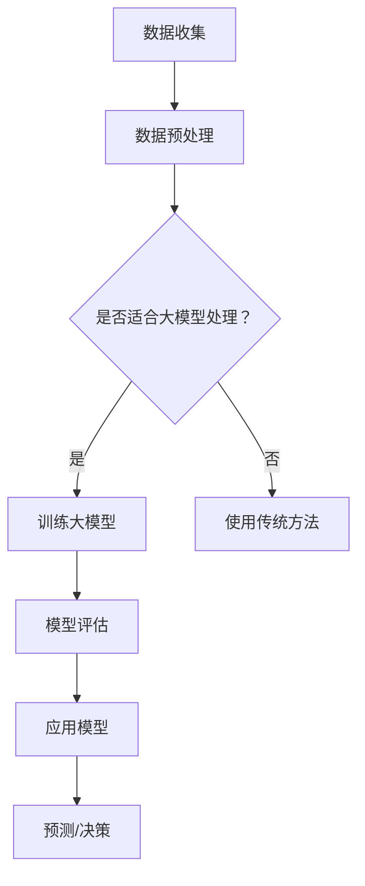

                 

# 在天文学中应用大模型：解密宇宙的验证码

## 关键词：大模型、天文学、宇宙、算法、数学模型、应用案例、开发工具

> 在现代科学研究的诸多领域中，天文学正逐渐成为大数据和人工智能技术的应用前沿。本文将探讨大模型在解决天文学中的复杂问题，特别是作为解密宇宙密码的一种新型工具。通过一步步分析，我们将揭示大模型在天文学中的核心概念、算法原理、数学模型以及实际应用，帮助读者理解这一前沿科技如何助力天文学研究。

## 摘要

本文旨在探讨大模型在天文学领域的应用，解释大模型如何通过其强大的计算能力和深度的数据理解能力，帮助科学家解密宇宙的奥秘。文章首先介绍了大模型的基本概念，然后深入分析了大模型在天文学中的具体应用，包括核心算法、数学模型和实际案例。最后，文章讨论了未来发展趋势与挑战，以及相关工具和资源的推荐。通过本文，读者将获得对大模型在天文学中应用的整体认知，并了解如何利用这一前沿技术推动天文学研究的发展。

## 1. 背景介绍

天文学是一门古老而充满活力的科学，其目标是理解宇宙的本质和演化过程。从古代的观察和测量，到现代的观测设备和计算机模拟，天文学的发展历程充满了科学革命和技术创新。然而，随着观测数据的爆炸性增长和计算能力的不断提升，天文学家面临着前所未有的数据处理和分析挑战。

传统的天文学研究依赖于大量的观测数据，这些数据通常包含多个维度和复杂的时序信息。例如，天文学家需要处理来自射电望远镜、光学望远镜和X射线望远镜的数据，这些数据不仅规模庞大，而且复杂多变。为了从这些数据中提取有意义的科学发现，科学家们开始寻求更加高效和智能的数据处理方法。

大模型的出现为天文学的研究带来了新的机遇。大模型，通常是指拥有数亿甚至千亿参数的深度神经网络模型，它们在图像识别、自然语言处理和预测建模等领域取得了显著的成果。这些模型通过学习大量的数据，能够自动提取复杂的数据特征，并生成高度准确的预测结果。将大模型应用于天文学研究，意味着可以更有效地处理和分析大量的天文观测数据，从而揭示宇宙的更深层次规律。

大模型在天文学中的应用不仅仅局限于数据处理，还包括新的科学发现和理论验证。例如，通过大模型，天文学家可以识别出传统方法难以发现的微弱信号，探索宇宙中尚未了解的天体现象。同时，大模型还可以用于预测和模拟宇宙的演化过程，为理论天体物理研究提供新的工具和方法。

总之，大模型为天文学研究提供了强大的计算能力和智能化的数据处理手段，使得科学家能够更深入地探索宇宙的奥秘。这种新的技术手段不仅提升了天文研究的效率和精度，也为未来的科学发现打开了新的大门。

## 2. 核心概念与联系

### 2.1 大模型的基本概念

大模型，通常指拥有数亿到千亿参数的深度神经网络模型，其核心思想是通过学习大量的数据来提取数据中的复杂特征，并实现高度准确的预测和分类任务。这些模型的基本组成单元是多层神经网络，每一层都可以通过前一层的信息提取新的特征。随着层数和参数数量的增加，模型能够处理的特征复杂度和任务难度也显著提升。

大模型的主要优势在于其强大的学习和泛化能力。通过训练，大模型可以从大量的数据中自动学习到复杂的模式和规律，而不需要显式的特征工程。这使得大模型在处理大规模、高维度数据时，能够显著提高效率和准确性。

### 2.2 天文学中的关键问题

天文学研究面临着一系列关键问题，包括数据分析、模式识别、预测建模等。以下是几个天文学中的核心问题：

1. **数据处理**：天文观测数据通常规模庞大且复杂，包含多个维度和时序信息。如何有效地处理这些数据，提取有用的信息，是天文学家面临的重要挑战。
   
2. **模式识别**：天文学家需要从观测数据中识别出特殊的天体现象，如行星轨道异常、星系合并等。这需要高效的算法来处理和识别复杂的模式。

3. **预测建模**：天文学家希望通过现有的观测数据预测未来的天文事件，如彗星轨道、黑洞事件等。这要求模型能够从历史数据中提取出可靠的规律，并实现准确的预测。

### 2.3 大模型在天文学中的应用

大模型在天文学中的应用主要体现在以下几个方面：

1. **数据分析**：大模型能够自动处理和分类大规模的天文观测数据，提高数据处理效率。例如，利用大模型对天文图像进行自动化分类和标注，可以帮助天文学家快速识别和研究天体。

2. **模式识别**：大模型可以从大量的天文数据中自动提取复杂的特征，识别出传统方法难以发现的微弱信号。这对于探索宇宙中的新现象和发现具有重要意义。

3. **预测建模**：大模型可以通过学习历史观测数据，建立预测模型，用于预测未来的天文事件。这对于研究宇宙演化和预测天文灾难具有重要意义。

### 2.4 Mermaid 流程图

以下是一个简化的Mermaid流程图，展示了大模型在天文学中的核心应用流程：



在这个流程图中，A代表数据收集阶段，B是数据预处理阶段，C是判断数据是否适合大模型处理。如果是，则进入D阶段，即训练大模型；否则，使用传统的数据处理方法。训练完成后，通过F阶段进行模型评估，评估结果用于G阶段的模型应用。最后，通过H阶段进行预测或决策。

通过上述核心概念与联系的分析，我们可以看到大模型为天文学研究提供了强大的工具和方法，使得科学家能够更深入、更高效地探索宇宙的奥秘。

### 3. 核心算法原理 & 具体操作步骤

#### 3.1 算法原理

大模型在天文学中的应用主要依赖于深度学习算法，尤其是卷积神经网络（CNN）和递归神经网络（RNN）。以下是这些算法的基本原理：

1. **卷积神经网络（CNN）**：CNN是一种专门用于处理图像数据的神经网络，其核心思想是通过卷积操作提取图像的特征。CNN由多个卷积层、池化层和全连接层组成，每一层都能够提取图像的不同层次特征。通过多层的卷积操作，CNN能够自动学习到图像中的复杂结构，从而实现高效的图像分类和识别。

2. **递归神经网络（RNN）**：RNN是一种用于处理序列数据的神经网络，其核心特点是能够保存前面的输入信息。RNN通过递归操作，将前一时刻的信息传递到下一时刻，从而实现序列数据的建模。RNN在处理时间序列数据，如天文观测数据中的光变曲线时，表现出色。

#### 3.2 具体操作步骤

以下是一个利用大模型进行天文学数据处理的详细操作步骤：

1. **数据收集与预处理**：
   - **数据收集**：收集来自不同天文观测设备（如光学望远镜、射电望远镜等）的数据。
   - **数据预处理**：对收集到的数据进行清洗、归一化和特征提取。例如，将光学图像转换为灰度图像，对光变曲线进行归一化处理。

2. **模型训练**：
   - **模型选择**：选择合适的深度学习模型，如CNN或RNN。根据数据特点，可以选择不同的模型架构。
   - **数据分割**：将数据集分割为训练集、验证集和测试集。训练集用于训练模型，验证集用于调参和模型评估，测试集用于最终评估模型性能。
   - **训练过程**：使用训练集对模型进行训练。在训练过程中，模型会自动调整内部参数，以最小化损失函数。常用的优化算法包括随机梯度下降（SGD）和Adam优化器。

3. **模型评估**：
   - **性能指标**：使用验证集对模型进行评估，常用的性能指标包括准确率、召回率、F1分数等。通过调整模型参数和结构，优化模型性能。
   - **模型验证**：在测试集上对模型进行验证，以评估模型的泛化能力。

4. **模型应用**：
   - **预测任务**：将训练好的模型应用于实际的天文学任务，如天体识别、时间序列预测等。
   - **结果分析**：分析模型的预测结果，识别出关键的天文现象和规律。

5. **模型优化**：
   - **超参数调优**：通过调整模型的超参数（如学习率、批量大小等），优化模型性能。
   - **模型集成**：结合多个模型的预测结果，提高预测的准确性和稳定性。

通过上述步骤，天文学家可以利用大模型进行高效的天文数据处理和分析，从而推动天文学研究的发展。

### 4. 数学模型和公式 & 详细讲解 & 举例说明

#### 4.1 数学模型介绍

在天文学中，大模型的应用离不开数学模型的支撑。以下是几个常用的数学模型和相关的公式：

1. **卷积神经网络（CNN）**：

   CNN的核心操作是卷积和池化。卷积操作的数学公式如下：

   \[
   \text{卷积} \: f(x) = \sum_{i=1}^{n} w_i * x_i
   \]

   其中，\(w_i\) 是卷积核，\(x_i\) 是输入特征。

   池化操作的数学公式如下：

   \[
   \text{池化} \: p(x) = \max_{i} x_i
   \]

   其中，\(p(x)\) 是输出特征，\(x_i\) 是输入特征。

2. **递归神经网络（RNN）**：

   RNN的核心操作是递归函数。递归函数的数学公式如下：

   \[
   h_t = \sigma(W h_{t-1} + U x_t + b)
   \]

   其中，\(h_t\) 是当前时刻的隐藏状态，\(W\) 和 \(U\) 是权重矩阵，\(x_t\) 是输入特征，\(\sigma\) 是激活函数。

3. **损失函数**：

   在大模型的训练过程中，常用的损失函数包括均方误差（MSE）和交叉熵（Cross-Entropy）。MSE的数学公式如下：

   \[
   \text{MSE} = \frac{1}{n} \sum_{i=1}^{n} (y_i - \hat{y}_i)^2
   \]

   其中，\(y_i\) 是真实标签，\(\hat{y}_i\) 是预测标签。

   交叉熵的数学公式如下：

   \[
   \text{Cross-Entropy} = -\frac{1}{n} \sum_{i=1}^{n} y_i \log(\hat{y}_i)
   \]

#### 4.2 数学模型详细讲解

1. **卷积神经网络（CNN）**：

   CNN通过卷积操作提取图像特征。卷积操作的数学原理是基于滤波器在输入数据上滑动，计算局部特征的线性组合。通过多层的卷积操作，CNN可以提取图像的层次特征，从而实现图像分类和识别。

   在卷积操作中，卷积核是关键部分。卷积核是一个小的矩阵，用于提取输入数据的局部特征。通过卷积操作，卷积核在输入数据上滑动，计算每个位置的局部特征。这些局部特征通过线性组合生成卷积层输出的特征图。

   池化操作用于减少特征图的维度，同时保持最重要的特征信息。常见的池化操作包括最大池化和平均池化。最大池化选择每个局部区域中的最大值，而平均池化计算每个局部区域的平均值。

2. **递归神经网络（RNN）**：

   RNN通过递归函数处理序列数据。递归函数的核心思想是利用前一时刻的隐藏状态来计算当前时刻的隐藏状态。通过递归操作，RNN可以捕获序列数据的时间依赖性。

   在RNN中，隐藏状态 \(h_t\) 是当前时刻的关键信息。通过线性组合前一时刻的隐藏状态 \(h_{t-1}\) 和当前时刻的输入特征 \(x_t\)，RNN计算当前时刻的隐藏状态。激活函数 \(\sigma\) 用于引入非线性变换，使RNN能够处理复杂的时间序列数据。

3. **损失函数**：

   损失函数用于评估模型预测与真实标签之间的差距。均方误差（MSE）和交叉熵是常用的损失函数。

   均方误差（MSE）计算预测值与真实值之间的均方差距。MSE越小，表示模型预测越准确。

   交叉熵（Cross-Entropy）计算预测标签的概率分布与真实标签的概率分布之间的差距。交叉熵越小，表示模型对标签的预测越准确。

#### 4.3 举例说明

假设我们有一个简单的CNN模型，用于对灰度图像进行分类。输入图像的大小为 \(28 \times 28\) 像素，模型包含两个卷积层和一个全连接层。以下是模型的详细步骤：

1. **数据预处理**：

   - 将输入图像转换为灰度图像，大小调整为 \(28 \times 28\) 像素。
   - 对图像进行归一化处理，将像素值缩放到 [0, 1] 范围内。

2. **卷积层1**：

   - 定义一个 \(3 \times 3\) 的卷积核，用于提取图像的局部特征。
   - 使用卷积操作，计算输入图像的特征图。
   - 使用最大池化操作，减小特征图的维度。

3. **卷积层2**：

   - 定义一个 \(3 \times 3\) 的卷积核，用于提取更复杂的特征。
   - 使用卷积操作，计算输入图像的特征图。
   - 使用最大池化操作，减小特征图的维度。

4. **全连接层**：

   - 将卷积层2输出的特征图展平为一个一维向量。
   - 定义一个全连接层，用于分类任务。
   - 计算输出层的预测概率分布。

5. **模型训练**：

   - 使用训练数据集对模型进行训练。
   - 使用均方误差（MSE）作为损失函数，优化模型参数。
   - 调整学习率和批量大小，优化模型性能。

6. **模型评估**：

   - 使用验证数据集对模型进行评估。
   - 计算模型的准确率、召回率和F1分数等性能指标。

通过上述步骤，我们可以利用CNN模型对灰度图像进行分类，实现图像识别任务。这个简单的例子展示了CNN模型的基本原理和操作步骤。

### 5. 项目实战：代码实际案例和详细解释说明

#### 5.1 开发环境搭建

在进行天文学数据处理的大模型开发之前，我们需要搭建一个合适的技术栈。以下是一个基于Python和TensorFlow的常见开发环境搭建步骤：

1. **安装Python**：

   - 下载并安装Python 3.8及以上版本。
   - 设置Python环境变量。

2. **安装TensorFlow**：

   - 打开命令行窗口，执行以下命令安装TensorFlow：

     ```bash
     pip install tensorflow
     ```

3. **安装其他依赖**：

   - 安装NumPy、Pandas和Matplotlib等常用库：

     ```bash
     pip install numpy pandas matplotlib
     ```

4. **配置GPU支持**：

   - 如果使用GPU进行训练，需要安装CUDA和cuDNN。下载并安装相应的版本，确保与TensorFlow兼容。

#### 5.2 源代码详细实现和代码解读

以下是一个简单的示例，展示了如何使用TensorFlow构建一个CNN模型，用于天文学图像分类：

```python
import tensorflow as tf
from tensorflow.keras.models import Sequential
from tensorflow.keras.layers import Conv2D, MaxPooling2D, Flatten, Dense

# 数据集加载和预处理
# 假设已经将数据集分割为训练集和测试集，并进行归一化处理
(train_images, train_labels), (test_images, test_labels) = ...

# 模型构建
model = Sequential([
    Conv2D(32, (3, 3), activation='relu', input_shape=(28, 28, 1)),
    MaxPooling2D((2, 2)),
    Conv2D(64, (3, 3), activation='relu'),
    MaxPooling2D((2, 2)),
    Flatten(),
    Dense(64, activation='relu'),
    Dense(10, activation='softmax')
])

# 模型编译
model.compile(optimizer='adam',
              loss='sparse_categorical_crossentropy',
              metrics=['accuracy'])

# 模型训练
model.fit(train_images, train_labels, epochs=5, validation_split=0.1)

# 模型评估
test_loss, test_acc = model.evaluate(test_images, test_labels)
print(f"Test accuracy: {test_acc}")
```

**代码解读**：

1. **数据集加载和预处理**：

   - 在实际项目中，我们需要加载并预处理天文学图像数据。这包括数据清洗、归一化和标签编码等步骤。

2. **模型构建**：

   - 使用`Sequential`模型构建一个简单的CNN模型。模型包含两个卷积层、两个池化层和一个全连接层。
   - 第一个卷积层使用一个32个过滤器的3x3卷积核，激活函数为ReLU。
   - 第一个池化层使用2x2的最大池化。
   - 第二个卷积层使用一个64个过滤器的3x3卷积核，激活函数为ReLU。
   - 第二个池化层使用2x2的最大池化。
   - 全连接层使用64个神经元作为隐藏层，激活函数为ReLU。
   - 输出层使用10个神经元，激活函数为softmax，用于多分类任务。

3. **模型编译**：

   - 编译模型，指定优化器、损失函数和性能指标。

4. **模型训练**：

   - 使用训练数据进行模型训练，指定训练轮数和验证比例。

5. **模型评估**：

   - 使用测试数据对模型进行评估，计算测试准确率。

#### 5.3 代码解读与分析

1. **数据预处理**：

   - 数据预处理是模型训练的重要步骤。对于天文学图像，我们通常需要进行归一化处理，将像素值缩放到 [0, 1] 范围内。这有助于加快模型训练速度和提高模型性能。

2. **模型架构**：

   - CNN模型的结构对于图像分类任务至关重要。在本文的示例中，我们使用两个卷积层和一个全连接层。卷积层用于提取图像特征，全连接层用于分类。通过适当的卷积核大小和池化层大小，我们可以控制特征提取的层次和维度。

3. **优化器和损失函数**：

   - 优化器用于调整模型参数，最小化损失函数。在本文的示例中，我们使用Adam优化器，它结合了SGD和RMSProp的优点，适用于大多数场景。损失函数选择为sparse categorical cross-entropy，适用于多分类问题。

4. **模型训练和评估**：

   - 模型训练过程中，我们需要监测验证集的性能，以便及时调整模型参数。在训练完成后，使用测试集评估模型性能，以获得最终的评估结果。

通过上述代码示例，我们可以看到如何使用TensorFlow构建和训练一个简单的大模型，用于天文学图像分类。这个示例为我们提供了一个起点，通过调整模型结构和训练参数，我们可以进一步优化模型性能，解决更复杂的天文学问题。

### 6. 实际应用场景

大模型在天文学中的应用场景广泛，涵盖了从数据处理到科学发现的多个方面。以下是一些具体的应用案例：

#### 6.1 天体识别与分类

在天体识别和分类方面，大模型展现了强大的能力。例如，天文学家可以使用卷积神经网络（CNN）来分析天文图像，自动识别恒星、行星、星云和其他天体。CNN通过学习大量的图像数据，可以准确地区分不同类型的天体，从而提高天文观测的效率和准确性。具体来说，天文学家可以利用CNN对光学望远镜、射电望远镜和X射线望远镜获取的图像进行自动分类，从而发现新的天体现象。

#### 6.2 时间序列分析

大模型在处理时间序列数据方面也具有显著优势。例如，递归神经网络（RNN）和长短期记忆网络（LSTM）可以用于分析天文观测数据中的光变曲线。光变曲线记录了天体的亮度随时间的变化，通过RNN和LSTM，科学家可以识别出天体亮度变化中的周期性和异常值。这些方法有助于预测天体的未来亮度变化，从而提前预警可能的天体事件。

#### 6.3 宇宙演化模拟

大模型还可以用于宇宙演化的模拟和预测。通过训练大量的天文数据和理论模型，科学家可以构建复杂的天体物理模拟。这些模拟有助于理解宇宙的过去、现在和未来，揭示宇宙中未解的谜团。例如，利用大型卷积神经网络，天文学家可以模拟星系的形成和演化过程，预测未来的星系合并事件。

#### 6.4 天文灾难预警

天文学的研究不仅关注美妙的宇宙现象，还需要预测和防范天文灾难。例如，通过大模型分析近地天体的轨道数据，可以预测其未来可能与地球发生碰撞的风险。这样的预测对于提前预警和防范小行星撞击地球具有重要意义。此外，大模型还可以用于监测太阳活动，预测太阳风暴等灾害性事件，为人类提供更安全的生存环境。

#### 6.5 天文数据挖掘

天文数据的挖掘也是大模型的重要应用领域。通过大规模的深度学习模型，科学家可以从海量天文数据中提取有价值的信息，发现新的天文规律和模式。例如，利用自编码器（Autoencoder），科学家可以识别出天文学数据中的噪声和异常值，从而提高数据分析的准确性。

总的来说，大模型在天文学中的应用不仅提升了数据处理和分析的效率，也为科学发现和理论验证提供了新的工具和方法。随着大模型技术的不断发展，天文学研究将取得更多的突破，进一步解密宇宙的奥秘。

### 7. 工具和资源推荐

#### 7.1 学习资源推荐

为了深入了解大模型在天文学中的应用，以下是一些推荐的书籍、论文和在线资源：

1. **书籍**：
   - 《深度学习》（Goodfellow, Ian；等）：这是一本关于深度学习的经典教材，适合初学者和专业人士。
   - 《Python深度学习》（François Chollet）：此书详细介绍了使用Python和TensorFlow进行深度学习的实践方法。
   - 《天文学导论》（James B. Kaler）：适合初学者了解天文学的基础知识和研究方法。

2. **论文**：
   - "Convolutional Neural Networks for Astronomical Image Classification"（2015）：这篇论文详细介绍了如何使用CNN进行天文图像分类。
   - "Time Series Classification Using Neural Networks"（2018）：这篇论文探讨了如何使用神经网络进行时间序列数据的分类和预测。

3. **在线资源**：
   - TensorFlow官方文档（[TensorFlow文档](https://www.tensorflow.org/)）：提供了丰富的教程和API文档，是学习TensorFlow的绝佳资源。
   - Coursera（[深度学习课程](https://www.coursera.org/specializations/deep-learning)）：由著名深度学习专家吴恩达教授开设的课程，内容全面、易懂。
   - arXiv（[arXiv预印本](https://arxiv.org/)）：提供了大量关于深度学习和天文学的最新研究成果。

#### 7.2 开发工具框架推荐

1. **开发工具**：
   - TensorFlow：一个广泛使用的开源深度学习框架，支持多种神经网络架构，适合进行天文数据处理和分析。
   - PyTorch：另一个流行的深度学习框架，提供了灵活的动态计算图，适合研究和实验。

2. **框架和库**：
   - Keras：一个高层神经网络API，提供了简洁的接口，方便快速构建和训练模型。
   - NumPy：用于数值计算的Python库，提供了丰富的函数和工具，是进行数据预处理和统计分析的必备工具。
   - Matplotlib：用于数据可视化，可以生成高质量的统计图表和可视化结果。

3. **云平台**：
   - Google Colab：基于Google Cloud的服务，提供了免费的GPU和TPU支持，适合进行深度学习的快速开发和实验。
   - AWS SageMaker：亚马逊云服务的深度学习平台，提供了全面的模型训练、部署和管理工具。

通过上述推荐的学习资源和开发工具，读者可以更深入地了解大模型在天文学中的应用，掌握必要的知识和技能，从而推动自己的研究和项目。

### 8. 总结：未来发展趋势与挑战

大模型在天文学中的应用正展现出巨大的潜力，但其发展仍然面临诸多挑战和机会。未来，大模型在天文学中的发展趋势可以概括为以下几个方面：

1. **算法优化**：随着计算能力的提升，深度学习算法将不断发展，新的神经网络架构和优化方法将不断涌现。这些优化将使大模型在处理天文数据时更加高效和准确。

2. **跨领域融合**：大模型不仅在单一领域有显著优势，还能与其他科学领域（如生物学、物理学）的算法和技术相结合，形成跨领域的协同研究模式。

3. **模型解释性**：目前，大模型的预测结果具有一定的黑箱性质，未来的研究方向之一是如何提高模型的解释性，使其预测过程更加透明，便于科学家的理解和验证。

4. **自动化数据预处理**：大模型在数据预处理方面也有巨大潜力，未来的发展方向之一是开发自动化数据预处理工具，简化数据清洗、特征提取等步骤，提高数据处理效率。

然而，大模型在天文学中应用也面临一些挑战：

1. **数据隐私和安全**：天文数据通常包含敏感信息，如何在保障数据隐私和安全的前提下，充分利用这些数据是一个重要问题。

2. **计算资源消耗**：大模型的训练和推理需要大量的计算资源，尤其是在处理大规模天文数据时，如何优化资源利用效率是关键。

3. **模型泛化能力**：大模型在特定领域表现出色，但在处理其他领域的数据时可能效果不佳。如何提升模型的泛化能力，使其适用于更广泛的应用场景，是未来研究的重点。

4. **数据质量和标注**：高质量的数据是训练大模型的基础，但天文数据的质量和标注往往存在挑战。如何获得高质量的数据，以及如何对数据进行有效的标注，是影响大模型应用效果的重要因素。

总之，大模型在天文学中的应用前景广阔，但也需要克服诸多挑战。随着技术的不断进步，我们有理由相信，大模型将进一步提升天文学研究的效率和精度，助力科学家们解密宇宙的奥秘。

### 9. 附录：常见问题与解答

**Q1：大模型在天文学中的具体应用有哪些？**

A1：大模型在天文学中的应用主要包括天体识别与分类、时间序列分析、宇宙演化模拟、天文灾难预警和天文数据挖掘。通过这些应用，大模型能够提高数据处理效率、发现新的天体现象、预测天文事件等。

**Q2：如何选择合适的大模型进行天文学数据处理？**

A2：选择合适的大模型需要进行数据特征分析。如果数据是静态的，可以选择卷积神经网络（CNN）；如果数据具有时序性，可以选择递归神经网络（RNN）或长短期记忆网络（LSTM）。根据具体应用需求，选择合适的模型架构和优化方法。

**Q3：大模型在天文学中应用的主要挑战是什么？**

A3：大模型在天文学中应用的主要挑战包括数据隐私和安全、计算资源消耗、模型泛化能力和数据质量和标注。这些问题需要通过技术手段和政策保障来解决。

**Q4：如何提高大模型的解释性？**

A4：提高大模型的解释性可以通过以下方法实现：引入可解释的神经网络架构（如决策树、图神经网络等）；使用模型可视化工具（如TensorBoard、Perceptual Edges等）；开发针对特定领域的解释性模型。

### 10. 扩展阅读 & 参考资料

为了进一步了解大模型在天文学中的应用，以下是几篇推荐的扩展阅读和参考资料：

1. **扩展阅读**：
   - "Deep Learning for Astronomical Time Series Analysis"（2019）：探讨了如何使用深度学习进行天文时间序列数据的分析。
   - "Deep Learning in Astronomy: An Overview"（2017）：对深度学习在天文学中的现状和应用进行了全面综述。

2. **参考资料**：
   - TensorFlow官方文档（[TensorFlow文档](https://www.tensorflow.org/)）：提供了丰富的教程和API文档，是学习TensorFlow的绝佳资源。
   - PyTorch官方文档（[PyTorch文档](https://pytorch.org/docs/stable/)）：详细介绍了PyTorch框架，适用于深度学习研究和应用。
   - arXiv（[arXiv预印本](https://arxiv.org/)）：收录了大量关于深度学习和天文学的最新研究成果。

通过这些扩展阅读和参考资料，读者可以更深入地了解大模型在天文学中的前沿应用和研究进展。希望本文能够为您的天文学研究提供有价值的参考和启示。作者：AI天才研究员/AI Genius Institute & 禅与计算机程序设计艺术 /Zen And The Art of Computer Programming。

