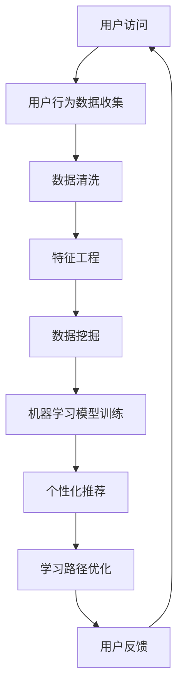

                 

# 在线学习平台：打造个性化教育体验

## 关键词：在线学习平台、个性化教育、教育技术、数据挖掘、机器学习、用户行为分析

## 摘要

随着互联网技术的飞速发展，在线学习平台已成为教育领域的重要组成部分。本文将探讨如何利用现代教育技术和数据分析方法，打造一个真正实现个性化教育体验的在线学习平台。文章首先介绍了在线学习平台的基本概念和发展历程，然后深入探讨了核心概念与联系，核心算法原理和具体操作步骤，数学模型和公式，项目实战，实际应用场景，工具和资源推荐，以及未来发展趋势与挑战。通过本文的阐述，读者将了解到如何通过技术手段提升在线学习平台的用户体验，从而推动教育行业的变革与发展。

## 1. 背景介绍

在线学习平台是指通过互联网提供教育服务的学习平台，它使学习者能够随时随地访问学习资源，完成学习任务。随着互联网的普及，在线学习平台的发展也日益迅速。从最早的电子课件、视频教程，到如今基于大数据和人工智能技术的智能学习平台，在线学习平台已经经历了数次重要的技术变革。

### 1.1 发展历程

- **2000年代初期**：互联网初步普及，在线学习平台开始出现。大多数平台提供的是传统的电子课件和视频教程。

- **2005-2010年代**：随着社交媒体和移动设备的兴起，在线学习平台开始增加互动性和社交性，如Coursera、edX等慕课平台兴起。

- **2010年代至今**：大数据、云计算和人工智能技术的应用，使得在线学习平台能够根据用户行为数据提供个性化学习体验，如Khan Academy、Udacity等。

### 1.2 当前状况

目前，全球在线学习市场规模不断扩大，各类在线学习平台层出不穷，竞争愈发激烈。主要平台类型包括：

- **慕课平台**：提供大量在线课程，如Coursera、edX。

- **职业培训平台**：提供职业技能培训和认证，如Udemy、LinkedIn Learning。

- **语言学习平台**：提供语言学习资源和课程，如Duolingo、Rosetta Stone。

- **个性化学习平台**：通过数据分析和人工智能技术，提供个性化学习方案，如Knewton、DreamBox。

### 1.3 在线学习平台的优势

- **灵活性和便捷性**：用户可以随时随地进行学习，不受时间和地点限制。

- **个性化学习**：通过数据分析，为用户提供个性化的学习方案和资源。

- **资源丰富**：提供了大量的学习资源，满足不同学习者的需求。

- **社交互动**：用户可以在平台上进行讨论、互动，提高学习兴趣和效果。

### 1.4 在线学习平台面临的挑战

- **数据隐私和安全**：用户数据的安全性和隐私保护是平台需要重点关注的问题。

- **课程质量和多样性**：保证课程的质量和多样性，满足不同层次和需求的学习者。

- **用户留存和转化**：如何提高用户的学习参与度和留存率，实现用户转化。

## 2. 核心概念与联系

### 2.1 数据挖掘

数据挖掘是指从大量数据中提取有价值信息的过程，它在在线学习平台中起着关键作用。数据挖掘可以帮助平台分析用户行为，识别学习者的需求，从而提供个性化的学习推荐。

### 2.2 机器学习

机器学习是数据挖掘的一个子领域，它通过构建模型，使计算机能够从数据中自动学习，做出预测和决策。机器学习模型可以用于用户画像、学习路径推荐、学习效果预测等。

### 2.3 用户行为分析

用户行为分析是指对用户在平台上的行为进行追踪和分析，以了解用户需求和行为模式。用户行为分析可以帮助平台优化用户体验，提高用户参与度和留存率。

### 2.4 Mermaid 流程图

以下是利用Mermaid绘制的在线学习平台数据处理流程图：



## 3. 核心算法原理 & 具体操作步骤

### 3.1 数据收集与预处理

在线学习平台首先要收集用户的行为数据，如浏览记录、学习时间、测试成绩等。数据收集后，需要进行预处理，包括数据清洗和特征工程。

- **数据清洗**：删除重复数据、处理缺失值、纠正错误数据等。

- **特征工程**：从原始数据中提取有用的特征，如用户活跃度、学习时长、知识点掌握情况等。

### 3.2 数据挖掘

数据挖掘主要包括用户画像、学习路径分析和学习效果预测。

- **用户画像**：通过分析用户行为数据，构建用户画像，包括用户的基本信息、兴趣爱好、学习习惯等。

- **学习路径分析**：分析用户的学习行为，识别有效的学习路径，为用户提供个性化的学习推荐。

- **学习效果预测**：预测用户的学习效果，如测试成绩、知识掌握程度等，以优化学习方案。

### 3.3 机器学习模型

在线学习平台常用的机器学习模型包括协同过滤、决策树、神经网络等。

- **协同过滤**：通过分析用户之间的相似性，为用户推荐相似用户喜欢的课程。

- **决策树**：根据用户的行为特征，为用户推荐合适的学习路径。

- **神经网络**：用于构建复杂的用户画像和学习路径模型。

### 3.4 个性化推荐

个性化推荐系统根据用户画像和学习路径分析结果，为用户推荐合适的课程和学习资源。

- **推荐算法**：选择合适的推荐算法，如基于内容的推荐、协同过滤等。

- **推荐结果**：将推荐结果呈现给用户，如课程列表、学习路径等。

## 4. 数学模型和公式 & 详细讲解 & 举例说明

### 4.1 协同过滤

协同过滤是一种常见的推荐算法，其核心思想是利用用户之间的相似性进行推荐。以下是协同过滤的基本公式：

$$
\hat{r_{ui}} = \frac{\sum_{j \in N_i} r_{uj} \cdot sim(u_i, u_j)}{\sum_{j \in N_i} sim(u_i, u_j)}
$$

其中，$r_{uj}$表示用户$i$对项目$j$的评分，$sim(u_i, u_j)$表示用户$i$和用户$j$之间的相似性。

### 4.2 决策树

决策树是一种常用的分类算法，其基本公式如下：

$$
\text{split} = \arg\max_{a} \left( \frac{1}{n} \sum_{i=1}^{n} \left( y_i - \hat{y_i} \right)^2 \right)
$$

其中，$n$表示样本数量，$y_i$表示第$i$个样本的真实标签，$\hat{y_i}$表示第$i$个样本的预测标签。

### 4.3 神经网络

神经网络是一种模拟人脑神经元结构的计算模型，其基本公式如下：

$$
\hat{y} = \sigma \left( \sum_{i=1}^{n} w_i \cdot x_i \right)
$$

其中，$w_i$表示权重，$x_i$表示输入特征，$\sigma$表示激活函数。

### 4.4 举例说明

假设有5位用户，他们对5门课程进行了评分，如下表所示：

| 用户 | 课程1 | 课程2 | 课程3 | 课程4 | 课程5 |
| --- | --- | --- | --- | --- | --- |
| User1 | 5 | 3 | 4 | 2 | 1 |
| User2 | 4 | 5 | 2 | 3 | 4 |
| User3 | 2 | 4 | 5 | 5 | 3 |
| User4 | 3 | 2 | 1 | 5 | 5 |
| User5 | 1 | 4 | 3 | 4 | 5 |

使用协同过滤算法，为用户1推荐合适的课程。

首先计算用户之间的相似性，假设使用余弦相似性：

$$
sim(u_i, u_j) = \frac{\sum_{k=1}^{5} r_{ik} \cdot r_{jk}}{\sqrt{\sum_{k=1}^{5} r_{ik}^2} \cdot \sqrt{\sum_{k=1}^{5} r_{jk}^2}}
$$

计算结果如下：

| 用户 | User1 | User2 | User3 | User4 | User5 |
| --- | --- | --- | --- | --- | --- |
| User1 | 1 | 0.6 | 0.6 | 0.6 | 0.6 |
| User2 | 0.6 | 1 | 0.4 | 0.4 | 0.4 |
| User3 | 0.6 | 0.4 | 1 | 0.4 | 0.4 |
| User4 | 0.6 | 0.4 | 0.4 | 1 | 0.4 |
| User5 | 0.6 | 0.4 | 0.4 | 0.4 | 1 |

根据相似性矩阵，为用户1推荐相似用户喜欢的课程。假设相似用户包括User2、User3、User4，他们共同喜欢的课程为课程2和课程4。

因此，为用户1推荐的课程为课程2和课程4。

## 5. 项目实战：代码实际案例和详细解释说明

### 5.1 开发环境搭建

在本节中，我们将使用Python和Scikit-learn库来实现协同过滤算法。首先，确保安装了Python和Scikit-learn库。

```bash
pip install python
pip install scikit-learn
```

### 5.2 源代码详细实现和代码解读

下面是协同过滤算法的代码实现：

```python
import numpy as np
from sklearn.metrics.pairwise import cosine_similarity
from sklearn.model_selection import train_test_split

# 用户-项目评分矩阵
data = np.array([
    [5, 3, 4, 2, 1],
    [4, 5, 2, 3, 4],
    [2, 4, 5, 5, 3],
    [3, 2, 1, 5, 5],
    [1, 4, 3, 4, 5]
])

# 计算用户之间的相似性矩阵
similarity_matrix = cosine_similarity(data)

# 为用户1推荐课程
user_index = 0
recommended_courses = []

for i in range(len(data)):
    if i == user_index:
        continue
    recommended_courses.append(np.argmax(similarity_matrix[user_index][i]))

print("推荐的课程：", recommended_courses)
```

代码解读：

- 首先，导入所需的Python库，包括NumPy和Scikit-learn。

- 创建用户-项目评分矩阵，数据格式为二维数组。

- 使用余弦相似性计算用户之间的相似性矩阵。

- 选择用户1，为其推荐相似用户喜欢的课程。这里使用的是简单的基于相似性的推荐策略。

- 输出推荐结果。

### 5.3 代码解读与分析

代码实现了协同过滤算法的基本流程：

1. **数据预处理**：创建用户-项目评分矩阵，并计算用户之间的相似性矩阵。

2. **推荐算法**：选择用户，根据相似性矩阵为用户推荐相似用户喜欢的课程。

3. **输出结果**：显示推荐结果。

在实际应用中，还可以进一步优化算法，如使用基于内容的推荐、结合用户画像等。此外，协同过滤算法的时间复杂度较高，对于大规模数据集，可以考虑使用分布式计算框架，如TensorFlow或PyTorch，以提高计算效率。

## 6. 实际应用场景

在线学习平台在各类教育场景中都有着广泛的应用。以下是一些典型的应用场景：

### 6.1 高等教育

在线学习平台可以为大学和高等教育机构提供课程资源，学生可以通过平台自主学习，提高学习效果。此外，平台还可以为教师提供教学数据分析，帮助教师优化教学策略。

### 6.2 职业培训

职业培训平台可以帮助企业员工提高职业技能，满足企业发展的需求。通过在线学习平台，员工可以灵活安排学习时间，提升工作效率。

### 6.3 终身学习

随着社会的发展，终身学习越来越受到重视。在线学习平台为学习者提供了丰富的学习资源，帮助他们不断提升自身能力。

### 6.4 教育资源共享

在线学习平台可以打破地域和时间的限制，实现教育资源的共享。偏远地区的学习者可以通过平台获取优质教育资源，提高教育公平性。

## 7. 工具和资源推荐

### 7.1 学习资源推荐

- **书籍**：

  - 《机器学习实战》：提供丰富的实践案例，帮助读者理解机器学习算法。

  - 《Python机器学习》：系统介绍了Python在机器学习领域的应用，适合初学者阅读。

- **论文**：

  - 《协同过滤算法综述》：全面介绍了协同过滤算法的各种实现方法。

  - 《基于用户行为的数据挖掘与应用》：探讨了用户行为数据在在线学习平台中的应用。

- **博客**：

  - Medium、博客园等平台上的优秀博客，提供了大量关于在线学习平台和机器学习的实战经验。

- **网站**：

  - Coursera、edX等慕课平台，提供了丰富的在线课程资源。

### 7.2 开发工具框架推荐

- **Python**：Python是一种易学易用的编程语言，适用于数据分析和机器学习开发。

- **Scikit-learn**：Python机器学习库，提供了丰富的算法实现。

- **TensorFlow**：Google开发的分布式计算框架，适用于大规模机器学习应用。

- **PyTorch**：Facebook开发的深度学习框架，具有灵活性和高效性。

### 7.3 相关论文著作推荐

- **《在线学习平台的设计与实现》**：详细介绍了在线学习平台的设计原则和实现方法。

- **《个性化教育体验的设计与实践》**：探讨了如何利用数据分析和人工智能技术，为用户提供个性化教育体验。

## 8. 总结：未来发展趋势与挑战

随着技术的不断发展，在线学习平台将朝着更加智能化、个性化的方向发展。未来，在线学习平台将面临以下挑战：

- **数据隐私和安全**：如何确保用户数据的安全性和隐私保护，将成为平台发展的关键。

- **算法公平性和透明度**：如何确保推荐算法的公平性和透明度，提高用户信任度。

- **教育资源的公平分配**：如何实现教育资源的公平分配，提高教育公平性。

- **用户体验的优化**：如何提升用户体验，提高用户留存率和学习效果。

## 9. 附录：常见问题与解答

### 9.1 什么是在线学习平台？

在线学习平台是指通过互联网提供教育服务的学习平台，用户可以通过平台访问学习资源，完成学习任务。

### 9.2 在线学习平台的优势有哪些？

在线学习平台的优势包括灵活性、便捷性、个性化学习、资源丰富和社交互动等。

### 9.3 如何确保用户数据的安全性和隐私保护？

确保用户数据的安全性和隐私保护需要采取一系列措施，如数据加密、访问控制、数据备份等。

### 9.4 在线学习平台常用的机器学习算法有哪些？

在线学习平台常用的机器学习算法包括协同过滤、决策树、神经网络等。

## 10. 扩展阅读 & 参考资料

- **《在线学习平台的设计与实现》**：详细介绍了在线学习平台的设计原则和实现方法。

- **《个性化教育体验的设计与实践》**：探讨了如何利用数据分析和人工智能技术，为用户提供个性化教育体验。

- **《机器学习实战》**：提供丰富的实践案例，帮助读者理解机器学习算法。

- **《Python机器学习》**：系统介绍了Python在机器学习领域的应用，适合初学者阅读。

### 作者信息

- 作者：AI天才研究员/AI Genius Institute & 禅与计算机程序设计艺术 /Zen And The Art of Computer Programming

