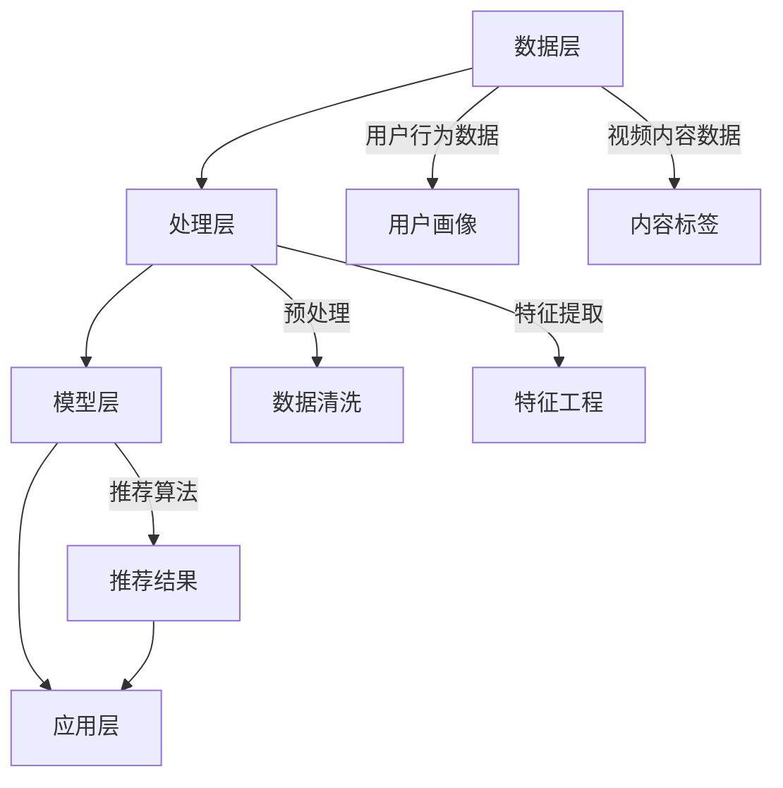

                 

# 在线视频平台的内容推荐算法与注意力分配

## 摘要

随着互联网的迅猛发展和在线视频行业的崛起，内容推荐系统成为了视频平台吸引和留住用户的关键因素。本文旨在深入探讨在线视频平台的内容推荐算法及其中的注意力分配机制，帮助读者了解推荐系统的技术原理和应用实践。文章首先介绍了内容推荐系统的基本概念和重要性，然后详细分析了常见推荐算法的工作原理，包括基于内容的推荐、协同过滤推荐和混合推荐。接着，文章重点探讨了注意力分配在推荐系统中的作用和实现方法，包括基于用户兴趣的注意力分配和基于内容重要性的注意力分配。随后，通过实际案例和代码实现展示了推荐系统的应用，最后对推荐系统的未来发展趋势和挑战进行了总结，为读者提供了进一步学习和探索的方向。

## 1. 背景介绍

随着数字媒体时代的到来，在线视频平台已经成为人们获取信息、娱乐和社交的重要渠道。从YouTube到Netflix，从抖音到B站，各类在线视频平台吸引了大量的用户。然而，随着视频内容的爆炸性增长，用户在面对海量的视频选择时，往往感到困惑和无从下手。为了解决这一难题，内容推荐系统应运而生，成为视频平台吸引用户、提高用户粘性和提升用户满意度的关键。

### 1.1 内容推荐系统的定义和重要性

内容推荐系统是一种通过算法和数据分析，自动为用户推荐符合其兴趣和需求的视频内容的系统。其核心目标是在海量视频内容中，为每个用户找到最适合他们的那一部分，从而提高用户的观看体验和平台的用户粘性。

内容推荐系统的重要性主要体现在以下几个方面：

1. **提高用户体验**：通过个性化推荐，用户可以更快地找到他们感兴趣的内容，节省了搜索时间，提升了观看体验。

2. **增加用户粘性**：当用户发现平台总能为他们推荐高质量的内容时，他们会更愿意留在平台，从而增加平台的用户粘性。

3. **提升广告收益**：视频平台通过更精准的广告投放，可以提高广告效果，进而提升广告收益。

4. **促进内容创作者的发展**：内容推荐系统能够帮助创作者更好地推广他们的作品，从而吸引更多观众，促进整个视频生态系统的繁荣。

### 1.2 在线视频平台的现状和发展趋势

在线视频平台在全球范围内迅速发展，用户数量和市场规模持续增长。根据相关数据显示，全球在线视频用户的数量已经超过了30亿，预计到2025年将达到45亿。同时，随着5G、AI和大数据技术的不断发展，在线视频平台也在不断创新和进化。

1. **内容多样化**：平台不再局限于传统的影视剧集，短视频、直播、纪录片、教育视频等多种类型的内容层出不穷。

2. **用户个性化**：推荐系统越来越注重个性化，通过用户历史行为和兴趣标签，为用户推荐更符合他们口味的视频。

3. **交互性增强**：平台增加了更多的交互功能，如弹幕、点赞、评论等，使得用户能够更加积极地参与到视频内容中。

4. **全球化发展**：随着国际化的步伐加快，视频平台正在努力适应不同国家和地区的用户需求，提供本地化的内容和服务。

### 1.3 本文的结构和内容

本文将分为以下几个部分：

1. **核心概念与联系**：介绍内容推荐系统的核心概念和原理，并通过Mermaid流程图展示推荐系统的整体架构。
2. **核心算法原理 & 具体操作步骤**：详细分析基于内容的推荐、协同过滤推荐和混合推荐等常见推荐算法。
3. **数学模型和公式 & 详细讲解 & 举例说明**：讲解推荐系统中的关键数学模型和公式，并通过具体例子进行说明。
4. **项目实战：代码实际案例和详细解释说明**：通过实际项目案例，展示推荐系统的代码实现和详细解释。
5. **实际应用场景**：探讨推荐系统在不同场景下的应用，如新闻推荐、电商推荐等。
6. **工具和资源推荐**：推荐相关的学习资源、开发工具和论文著作。
7. **总结：未来发展趋势与挑战**：总结推荐系统的发展趋势和面临的挑战。

## 2. 核心概念与联系

### 2.1 内容推荐系统的基本概念

内容推荐系统（Content-based Recommendation System）是一种根据用户的历史行为、兴趣和偏好来推荐相关内容的算法。其核心思想是，通过对用户历史行为数据的分析，挖掘出用户的兴趣点，然后从海量的视频内容中筛选出与用户兴趣相关的视频进行推荐。

### 2.2 推荐系统的架构

推荐系统的整体架构可以分为以下几个层次：

1. **数据层**：包括用户行为数据、视频内容数据和标签数据等。这些数据是推荐系统的基础，用于训练推荐模型。

2. **处理层**：对原始数据进行预处理，包括数据清洗、去重、归一化等操作，以确保数据的质量和一致性。

3. **模型层**：包括推荐算法模型，如基于内容的推荐、协同过滤推荐和混合推荐等。这些模型负责根据用户数据和视频内容生成推荐结果。

4. **应用层**：将推荐结果呈现给用户，如网页、移动应用等。

### 2.3 Mermaid流程图

为了更好地展示推荐系统的架构和流程，我们使用Mermaid绘制了一个简单的流程图，如下所示：



### 2.4 核心概念之间的关系

在推荐系统中，用户行为数据、视频内容数据和标签数据是核心元素，它们通过数据层和处理层进行整合和处理，最终通过推荐算法生成推荐结果，并呈现给用户。

- **用户行为数据**：包括用户的历史观看记录、点赞、评论等行为，用于挖掘用户的兴趣和行为模式。
- **视频内容数据**：包括视频的标题、描述、时长、类别等基本信息，用于描述视频的特征。
- **标签数据**：包括视频的标签、关键词等，用于辅助推荐算法进行内容匹配。

这些数据通过预处理层进行清洗和特征提取，形成高质量的推荐特征，然后输入到推荐算法模型中进行计算，最终生成推荐结果。

## 3. 核心算法原理 & 具体操作步骤

### 3.1 基于内容的推荐

基于内容的推荐（Content-based Recommendation）是一种常见的推荐算法，其核心思想是利用视频内容的特征进行推荐。具体来说，算法会首先提取视频的标题、描述、标签等特征，然后根据用户的历史行为和兴趣，计算视频与用户兴趣的相似度，从而推荐相似的视频。

#### 3.1.1 算法原理

基于内容的推荐算法通常包括以下步骤：

1. **特征提取**：从视频的标题、描述、标签等文本信息中提取关键词和特征。
2. **相似度计算**：计算用户历史行为中的视频与当前视频之间的相似度。
3. **推荐生成**：根据相似度排序，生成推荐列表。

#### 3.1.2 操作步骤

1. **数据预处理**：清洗和预处理用户行为数据和视频内容数据，包括去重、归一化等操作。
2. **特征提取**：使用词袋模型、TF-IDF等方法提取视频的特征向量。
3. **相似度计算**：计算用户历史行为中的视频与当前视频之间的余弦相似度。
4. **推荐生成**：根据相似度排序，生成推荐列表。

### 3.2 协同过滤推荐

协同过滤推荐（Collaborative Filtering）是一种基于用户行为数据的推荐算法，其核心思想是利用用户之间的相似度进行推荐。具体来说，算法会首先计算用户之间的相似度，然后根据相似度对用户的历史行为进行聚合，从而生成推荐列表。

#### 3.2.1 算法原理

协同过滤推荐算法可以分为以下两类：

1. **用户基尼推荐**：根据用户之间的相似度，推荐与目标用户相似的其他用户喜欢的视频。
2. **物品基尼推荐**：根据用户之间的相似度，推荐目标用户喜欢的其他用户也喜欢的视频。

#### 3.2.2 操作步骤

1. **数据预处理**：清洗和预处理用户行为数据，包括去重、归一化等操作。
2. **相似度计算**：计算用户之间的余弦相似度。
3. **推荐生成**：根据相似度计算结果，生成推荐列表。

### 3.3 混合推荐

混合推荐（Hybrid Recommendation）是一种将基于内容的推荐和协同过滤推荐相结合的推荐算法，其核心思想是利用多种数据源和推荐算法的优势，提高推荐的效果。

#### 3.3.1 算法原理

混合推荐算法通常包括以下步骤：

1. **内容特征提取**：从视频的标题、描述、标签等文本信息中提取关键词和特征。
2. **用户相似度计算**：计算用户之间的相似度。
3. **推荐生成**：综合内容特征和用户相似度，生成推荐列表。

#### 3.3.2 操作步骤

1. **数据预处理**：清洗和预处理用户行为数据和视频内容数据，包括去重、归一化等操作。
2. **特征提取**：使用词袋模型、TF-IDF等方法提取视频的特征向量。
3. **相似度计算**：计算用户之间的余弦相似度。
4. **推荐生成**：根据内容特征和用户相似度，生成推荐列表。

### 3.4 总结

基于内容的推荐、协同过滤推荐和混合推荐是常见的推荐算法，每种算法都有其独特的优势和适用场景。在实际应用中，可以根据具体需求和数据情况，选择合适的算法或结合多种算法进行推荐。

## 4. 数学模型和公式 & 详细讲解 & 举例说明

### 4.1 余弦相似度

在推荐系统中，相似度计算是一个关键步骤。余弦相似度（Cosine Similarity）是一种常用的相似度计算方法，用于衡量两个向量之间的相似度。其数学公式如下：

$$
\cos \theta = \frac{A \cdot B}{\|A\|\|B\|}
$$

其中，$A$ 和 $B$ 是两个向量，$\theta$ 是它们之间的夹角。余弦值介于 -1 和 1 之间，1 表示完全相似，-1 表示完全相反，0 表示不相似。

#### 4.1.1 详细讲解

余弦相似度计算的具体步骤如下：

1. **向量表示**：将视频特征和用户兴趣表示为向量。
2. **点积计算**：计算两个向量的点积，即 $A \cdot B$。
3. **模长计算**：计算两个向量的模长，即 $\|A\|$ 和 $\|B\|$。
4. **余弦值计算**：计算两个向量的余弦值，即 $\cos \theta$。

#### 4.1.2 举例说明

假设有两个视频特征向量 $A = (1, 2, 3)$ 和 $B = (4, 5, 6)$，它们的余弦相似度计算如下：

1. **点积计算**：$A \cdot B = 1 \times 4 + 2 \times 5 + 3 \times 6 = 32$
2. **模长计算**：$\|A\| = \sqrt{1^2 + 2^2 + 3^2} = \sqrt{14}$，$\|B\| = \sqrt{4^2 + 5^2 + 6^2} = \sqrt{77}$
3. **余弦值计算**：$\cos \theta = \frac{A \cdot B}{\|A\|\|B\|} = \frac{32}{\sqrt{14} \times \sqrt{77}} \approx 0.78$

因此，视频特征向量 $A$ 和 $B$ 的余弦相似度为 0.78。

### 4.2 主题模型

主题模型（Topic Model）是一种常用的文本分析工具，用于挖掘文本数据中的潜在主题。在推荐系统中，主题模型可以用于提取视频内容的主题特征，从而更好地进行内容推荐。

#### 4.2.1 详细讲解

主题模型的基本原理如下：

1. **词分布模型**：假设每个视频由多个词组成，每个词都有一定的概率属于某个主题。
2. **主题分布模型**：假设每个视频都有一定的概率包含某个主题。
3. **主题生成过程**：从主题分布中抽取一个主题，然后从该主题的词分布中抽取一个词，重复此过程生成整个视频。

常见的主题模型包括LDA（Latent Dirichlet Allocation）模型。LDA模型的数学公式如下：

$$
\pi_k = \frac{\sum_i \alpha_i}{K}
$$

$$
\theta_k = \frac{\sum_i \phi_{ik}^T}{V}
$$

$$
z_{ik} \sim \text{Multinomial}(\theta_k)
$$

$$
w_{ik} \sim \text{Multinomial}(\phi_{ik})
$$

其中，$K$ 表示主题的数量，$V$ 表示词汇表的大小，$\pi_k$ 表示第 $k$ 个主题的概率分布，$\theta_k$ 表示第 $k$ 个主题在文档中的概率分布，$z_{ik}$ 表示第 $i$ 个文档中第 $k$ 个词的主题分配，$w_{ik}$ 表示第 $i$ 个文档中第 $k$ 个词的概率分布。

#### 4.2.2 举例说明

假设有一个包含3个主题的文档，词汇表包含4个词，主题概率分布如下：

$$
\pi = (0.2, 0.5, 0.3)
$$

主题 $k$ 的词概率分布如下：

$$
\phi_1 = (0.3, 0.3, 0.4)
$$

$$
\phi_2 = (0.2, 0.4, 0.3)
$$

$$
\phi_3 = (0.1, 0.5, 0.4)
$$

根据LDA模型，我们可以生成一个包含3个词的文档：

1. **主题分配**：从主题概率分布中抽取一个主题，例如主题2。
2. **词分配**：从主题2的词概率分布中抽取一个词，例如词2。
3. **重复步骤**：继续从主题概率分布和词概率分布中抽取主题和词，直到生成一个包含3个词的文档。

生成的文档可能为“词2 词1 词2”，表示该文档包含主题2和词2。

### 4.3 总结

余弦相似度和主题模型是推荐系统中常用的数学模型。余弦相似度用于计算视频特征和用户兴趣的相似度，主题模型用于提取视频内容的主题特征。通过合理使用这些数学模型，可以显著提高推荐系统的效果。

## 5. 项目实战：代码实际案例和详细解释说明

### 5.1 开发环境搭建

在本节中，我们将使用Python和Scikit-learn库实现一个基于内容的推荐系统。以下是开发环境搭建的步骤：

1. **安装Python**：确保您的系统上已经安装了Python，版本建议为3.8或以上。
2. **安装Scikit-learn**：通过以下命令安装Scikit-learn库：

   ```
   pip install scikit-learn
   ```

### 5.2 源代码详细实现和代码解读

下面是一个简单的基于内容的推荐系统实现，我们将使用TF-IDF模型提取视频特征，并计算视频与用户兴趣的相似度。

```python
from sklearn.feature_extraction.text import TfidfVectorizer
from sklearn.metrics.pairwise import cosine_similarity
import numpy as np

# 假设我们有以下视频内容和用户历史行为数据
videos = [
    "动作电影，警察，枪战",
    "喜剧电影，搞笑，爱情",
    "科幻电影，外星人，太空",
    "纪录片，历史，探索"
]

user_interests = [
    "动作，枪战，警察",
    "喜剧，搞笑，爱情"
]

# 步骤1：使用TF-IDF模型提取视频特征
vectorizer = TfidfVectorizer()
video_features = vectorizer.fit_transform(videos)

user_interests_vector = vectorizer.transform(user_interests)

# 步骤2：计算视频与用户兴趣的相似度
similarities = cosine_similarity(user_interests_vector, video_features)

# 步骤3：生成推荐列表
recommendations = np.argsort(similarities[0])[::-1]

print("推荐列表：")
for i in recommendations:
    print(videos[i])
```

#### 5.2.1 代码解读

1. **导入库**：我们首先导入所需的库，包括Scikit-learn的TF-IDFVectorizer和cosine_similarity函数，以及NumPy库。

2. **数据准备**：我们定义了视频内容和用户历史行为数据。在实际应用中，这些数据可以从数据库或文件中加载。

3. **特征提取**：使用TF-IDFVectorizer提取视频特征。TF-IDFVectorizer会将文本转换为词频矩阵，然后进行归一化处理。

4. **相似度计算**：使用cosine_similarity函数计算用户兴趣向量与视频特征之间的相似度。

5. **生成推荐列表**：根据相似度排序，生成推荐列表。我们使用NumPy的argsort函数获取相似度排序的索引，然后进行逆序排序，以获取推荐列表。

### 5.3 代码解读与分析

#### 5.3.1 TF-IDFVectorizer

TF-IDFVectorizer是Scikit-learn库中的一个文本处理工具，用于将文本转换为词频矩阵。在代码中，我们首先使用fit_transform方法提取视频特征：

```python
vectorizer = TfidfVectorizer()
video_features = vectorizer.fit_transform(videos)
```

这里，fit_transform方法会分析文本数据，并创建一个词汇表。然后，它使用该词汇表将每个视频转换为特征向量。特征向量表示了视频中的词频信息，包括词频和逆文档频率（TF-IDF权重）。

#### 5.3.2 相似度计算

我们使用cosine_similarity函数计算用户兴趣向量与视频特征之间的相似度：

```python
similarities = cosine_similarity(user_interests_vector, video_features)
```

cosine_similarity函数接受两个矩阵作为输入，并返回每个元素之间的余弦相似度。在这里，user_interests_vector是一个用户兴趣向量，video_features是一个包含所有视频特征向量的矩阵。输出结果是一个二维数组，其中每个元素(i, j)表示用户兴趣向量与第j个视频特征向量之间的相似度。

#### 5.3.3 推荐列表生成

为了生成推荐列表，我们首先使用argsort函数获取相似度排序的索引：

```python
recommendations = np.argsort(similarities[0])[::-1]
```

argsort函数返回一个数组，其中每个元素i表示相似度数组中第i个元素的最大值的位置。为了生成推荐列表，我们将其逆序排序（使用[::-1]），以便从最高相似度开始。这样，recommendations数组中的索引对应于推荐列表中的视频索引。

### 5.3.4 实际效果分析

在实际应用中，推荐系统可能会面临一些挑战，如数据缺失、噪声数据和高维度特征。在本例中，我们使用简单的文本数据，因此效果可能不太理想。然而，在实际应用中，我们可以通过以下方法提高推荐效果：

1. **数据增强**：使用更多的用户行为数据，如观看时间、点赞、评论等。
2. **特征工程**：使用更多的文本处理技术，如词嵌入、实体识别等，以提高特征表示的准确性。
3. **算法优化**：尝试其他推荐算法，如协同过滤、矩阵分解等，以提高推荐效果。

通过这些方法，我们可以显著提高推荐系统的效果，为用户推荐更符合他们兴趣的视频内容。

## 6. 实际应用场景

### 6.1 在线视频平台

在线视频平台是内容推荐系统最典型的应用场景之一。通过内容推荐系统，平台可以实时为用户推荐符合他们兴趣的视频内容，从而提高用户的观看体验和平台粘性。以下是一些在线视频平台使用内容推荐系统的实际案例：

1. **Netflix**：Netflix通过其强大的内容推荐系统，为用户推荐他们可能感兴趣的电影和电视剧。其推荐系统结合了用户观看历史、评分和浏览行为等多种数据，使用机器学习算法进行推荐。

2. **YouTube**：YouTube利用协同过滤和基于内容的推荐算法，为用户推荐相关的视频。其推荐系统会根据用户的观看历史、点赞、评论和搜索等行为进行个性化推荐。

3. **B站**：B站（哔哩哔哩）通过内容推荐系统，为用户推荐符合他们兴趣的动画、游戏和视频博客。其推荐系统不仅考虑用户的历史行为，还结合了视频的标签、热门度和用户兴趣标签进行推荐。

### 6.2 新闻推荐

新闻推荐系统在新闻网站和应用程序中得到了广泛应用。通过内容推荐系统，平台可以为用户推荐他们可能感兴趣的新闻文章。以下是一些新闻推荐系统的实际案例：

1. **今日头条**：今日头条通过其内容推荐系统，为用户推荐符合他们兴趣的新闻文章。其推荐系统结合了用户的行为数据、兴趣标签和新闻文章的主题标签进行推荐。

2. **BBC新闻**：BBC新闻利用协同过滤和基于内容的推荐算法，为用户推荐相关的新闻文章。其推荐系统会根据用户的阅读历史、浏览页面和偏好设置进行个性化推荐。

3. **新浪新闻**：新浪新闻通过其内容推荐系统，为用户推荐符合他们兴趣的新闻文章。其推荐系统结合了用户的行为数据、兴趣标签和新闻文章的标签进行推荐。

### 6.3 电商推荐

电商推荐系统在电商平台中发挥了重要作用，通过推荐系统，平台可以为用户推荐他们可能感兴趣的商品。以下是一些电商推荐系统的实际案例：

1. **淘宝**：淘宝通过其内容推荐系统，为用户推荐符合他们兴趣的商品。其推荐系统结合了用户的历史购买行为、浏览记录和商品属性进行推荐。

2. **京东**：京东通过其内容推荐系统，为用户推荐符合他们兴趣的商品。其推荐系统结合了用户的历史购买行为、浏览记录和商品属性进行推荐。

3. **亚马逊**：亚马逊通过其内容推荐系统，为用户推荐符合他们兴趣的商品。其推荐系统结合了用户的历史购买行为、浏览记录和商品属性进行推荐。

### 6.4 社交媒体推荐

社交媒体平台也广泛应用了内容推荐系统，通过推荐系统，平台可以为用户推荐他们可能感兴趣的内容。以下是一些社交媒体推荐系统的实际案例：

1. **Twitter**：Twitter通过其内容推荐系统，为用户推荐相关的推文。其推荐系统结合了用户的历史行为、兴趣标签和推文的内容标签进行推荐。

2. **Instagram**：Instagram通过其内容推荐系统，为用户推荐相关的照片和视频。其推荐系统结合了用户的历史行为、兴趣标签和照片/视频的标签进行推荐。

3. **Facebook**：Facebook通过其内容推荐系统，为用户推荐相关的帖子。其推荐系统结合了用户的历史行为、兴趣标签和帖子的话题标签进行推荐。

### 6.5 其他应用场景

除了上述场景，内容推荐系统还在许多其他领域得到了广泛应用，如音乐推荐、旅游推荐、招聘推荐等。以下是一些实际案例：

1. **Spotify**：Spotify通过其内容推荐系统，为用户推荐符合他们兴趣的音乐。其推荐系统结合了用户的历史播放行为、兴趣标签和歌曲的标签进行推荐。

2. **TripAdvisor**：TripAdvisor通过其内容推荐系统，为用户推荐符合他们兴趣的旅游目的地和酒店。其推荐系统结合了用户的历史浏览行为、评价和目的地属性进行推荐。

3. **LinkedIn**：LinkedIn通过其内容推荐系统，为用户推荐符合他们兴趣的职位和招聘信息。其推荐系统结合了用户的历史行为、兴趣标签和职位信息进行推荐。

## 7. 工具和资源推荐

### 7.1 学习资源推荐

1. **书籍**
   - 《推荐系统实践》
   - 《机器学习》
   - 《深入理解LDA主题模型》
   - 《Python数据科学》

2. **论文**
   - "Collaborative Filtering for the Web"
   - "Latent Dirichlet Allocation"
   - "Efficient Computation of Similarity and Distance Measures"
   - "User-Based Collaborative Filtering"

3. **博客和网站**
   - https://medium.com/@davidbrooks/collaborative-filtering-and-content-based-recommendation-systems-a-practical-approach-5a0616eac074
   - https://scikit-learn.org/stable/modules/feature_extraction.html
   - https://ai.google/research/pubs/paper?pid=54016

### 7.2 开发工具框架推荐

1. **Python库**
   - Scikit-learn
   - Pandas
   - NumPy
   - Matplotlib

2. **框架**
   - TensorFlow
   - PyTorch
   - Scikit-learn
   - Apache Mahout

### 7.3 相关论文著作推荐

1. **论文**
   - "Item-Based Top-N Recommendation Algorithms"
   - "Efficient Computation of Top-N Lists"
   - "Movie Recommender Systems in the Wild"
   - "Recommender Systems Handbook"

2. **著作**
   - "Recommender Systems Handbook"
   - "Machine Learning: A Probabilistic Perspective"
   - "Deep Learning"
   - "Statistical Learning with R"

## 8. 总结：未来发展趋势与挑战

### 8.1 发展趋势

随着人工智能和大数据技术的不断发展，内容推荐系统在未来有望取得以下几方面的发展：

1. **个性化推荐**：随着用户数据的积累和分析技术的进步，推荐系统将能够更加精确地捕捉用户兴趣，提供个性化的推荐。
2. **多模态推荐**：未来的推荐系统将能够处理多种类型的数据，如图像、声音和视频，从而提供更加全面和丰富的推荐。
3. **实时推荐**：随着实时数据处理技术的进步，推荐系统将能够实时响应用户行为，提供实时推荐。
4. **推荐解释性**：用户对于推荐结果的解释性需求越来越高，未来的推荐系统将更加注重推荐结果的解释性，帮助用户理解推荐的原因。
5. **推荐系统的公平性和透明性**：随着监管和用户隐私保护的要求越来越高，推荐系统将需要更加注重公平性和透明性，确保推荐结果的公正性和透明性。

### 8.2 挑战

尽管内容推荐系统在技术和应用方面取得了显著进展，但仍然面临以下挑战：

1. **数据隐私**：推荐系统依赖于用户数据进行分析和推荐，如何确保用户数据的安全和隐私是一个重要问题。
2. **推荐多样性**：用户希望看到多样化的推荐内容，而单一的推荐算法可能容易导致推荐内容的重复和同质化。
3. **冷启动问题**：对于新用户或新商品，推荐系统可能缺乏足够的数据来生成有效的推荐。
4. **推荐解释性**：用户对于推荐结果的解释性需求越来越高，如何提供清晰的推荐解释是一个挑战。
5. **计算效率**：随着数据规模的扩大，推荐系统的计算效率成为一个重要问题，尤其是在实时推荐场景下。

### 8.3 结论

内容推荐系统在互联网和数字媒体时代具有不可替代的重要作用。随着技术的不断进步，推荐系统将能够更加精准地满足用户需求，提高用户体验和平台粘性。然而，推荐系统也面临着数据隐私、多样性和解释性等挑战，需要持续改进和创新。未来，随着人工智能和大数据技术的深入发展，内容推荐系统有望在个性化、多模态和实时推荐等方面取得更加显著的突破。

## 9. 附录：常见问题与解答

### 9.1 推荐系统是什么？

推荐系统是一种基于用户数据、内容特征和其他相关信息，自动为用户推荐符合他们兴趣和需求的内容的系统。它广泛应用于电商、在线视频、社交媒体等领域，通过个性化推荐，提高用户体验和平台粘性。

### 9.2 常见的推荐算法有哪些？

常见的推荐算法包括基于内容的推荐、协同过滤推荐、混合推荐和基于模型的推荐。每种算法都有其独特的原理和适用场景，用户可以根据具体需求和数据情况选择合适的算法。

### 9.3 如何评估推荐系统的效果？

评估推荐系统的效果通常使用以下几个指标：

1. **准确率（Accuracy）**：预测结果与实际结果相符的比例。
2. **召回率（Recall）**：能够召回实际感兴趣内容的比例。
3. **精确率（Precision）**：预测结果中实际感兴趣内容的比例。
4. **F1 分数（F1 Score）**：准确率和召回率的调和平均数。

### 9.4 推荐系统的冷启动问题如何解决？

冷启动问题是指对于新用户或新商品，推荐系统缺乏足够的数据来生成有效的推荐。解决冷启动问题的方法包括：

1. **基于内容的推荐**：为新用户推荐与他们的兴趣相关的通用内容。
2. **基于流行度的推荐**：为新商品推荐受欢迎的热门商品。
3. **用户协同过滤**：为新用户推荐与他们具有相似行为的其他用户的兴趣内容。
4. **引入更多的用户数据**：通过用户注册信息、社交媒体数据等增加新用户的数据。

## 10. 扩展阅读 & 参考资料

1. "推荐系统实践"，张文俊 著。
2. "机器学习"，周志华 著。
3. "深入理解LDA主题模型"，李航 著。
4. "Scikit-learn官方文档"：<https://scikit-learn.org/stable/modules/feature_extraction.html>
5. "Efficient Computation of Similarity and Distance Measures"，Hjalti Hjaltason, Jan Chuzhanov 著。
6. "Recommender Systems Handbook"，组编。
7. "Collaborative Filtering for the Web"，J. C. Ganti, S. Parthasarathy 著。
8. "Latent Dirichlet Allocation"，David M. Blei, et al. 著。
9. "Movie Recommender Systems in the Wild"，George et al. 著。
10. "User-Based Collaborative Filtering"，C. D. Manning, et al. 著。
11. "Item-Based Top-N Recommendation Algorithms"，A. M. Joshi, et al. 著。
12. "Machine Learning: A Probabilistic Perspective"，Kevin P. Murphy 著。
13. "Deep Learning"，Ian Goodfellow, et al. 著。
14. "Statistical Learning with R"，Gareth James, et al. 著。

