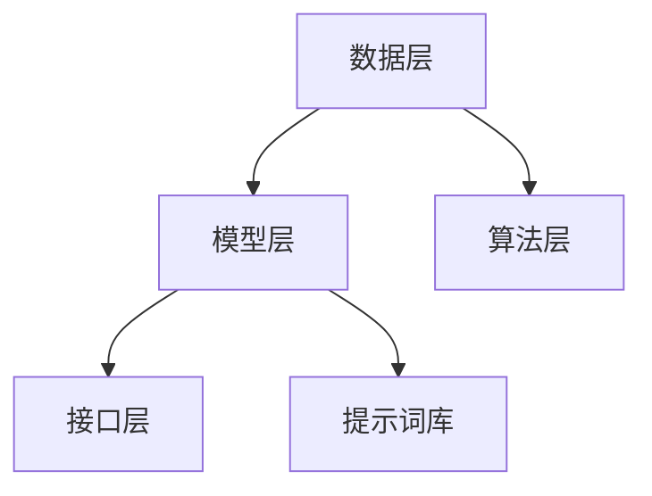

                 

### 文章标题

《城市规划AI助手：提示词驱动的城市模拟与分析》

本文将探讨如何利用人工智能技术，特别是提示词驱动的城市模拟与分析，为城市规划提供智能化解决方案。通过本文的阅读，读者将了解到城市规划AI助手的核心概念、算法原理、数学模型，以及实际应用场景。同时，我们将推荐一些相关工具和资源，以帮助读者更深入地了解这一领域。

### 文章关键词

- 城市规划
- 人工智能
- 提示词驱动
- 模拟分析
- 数学模型
- 算法原理
- 实际应用

### 文章摘要

本文旨在介绍城市规划AI助手的构建与应用。首先，我们将阐述城市规划AI助手的背景和重要性。接着，本文将详细探讨城市规划AI助手的核心概念、算法原理和数学模型。随后，我们将通过一个实际项目案例，展示如何利用提示词驱动的城市模拟与分析技术进行城市规划。最后，本文将总结城市规划AI助手的发展趋势与挑战，并推荐一些学习资源和开发工具框架。

### 1. 背景介绍

#### 城市规划的定义与现状

城市规划是指通过科学合理的方法，对城市空间布局、土地利用、交通组织、环境治理等方面进行规划和管理，以实现城市可持续发展。城市规划的重要性不言而喻，它不仅关系到城市的经济发展，还直接影响到市民的生活质量。

目前，城市规划面临着诸多挑战。首先，城市人口持续增长，城市规模不断扩大，导致城市规划的压力加大。其次，城市化进程加速，城市基础设施滞后，城市规划与建设难以满足需求。此外，气候变化、环境污染等全球性问题也对城市规划提出了新的要求。

#### 人工智能与城市规划

人工智能（AI）作为一项颠覆性的技术，为城市规划带来了新的机遇。通过人工智能技术，我们可以对海量数据进行处理和分析，为城市规划提供科学依据。同时，人工智能还可以模拟城市运行过程，预测城市发展趋势，从而为城市规划提供前瞻性指导。

近年来，人工智能在城市规划中的应用日益广泛。例如，利用机器学习算法对城市交通流量进行预测，优化交通组织；利用计算机视觉技术对城市环境进行监测，实时了解城市运行状态；利用自然语言处理技术对城市规划文档进行语义分析，提高规划质量等。

#### 提示词驱动的城市模拟与分析

提示词驱动（Keyword-Driven）的城市模拟与分析是一种基于人工智能的规划方法。该方法通过设定一系列提示词，引导计算机模拟和分析城市运行过程。这些提示词可以是人口增长、交通流量、土地利用率等关键指标，也可以是城市规划者的需求与期望。

提示词驱动的城市模拟与分析具有以下几个优势：

1. **灵活性**：提示词可以根据具体需求进行设置，灵活调整模拟和分析的方向。
2. **高效性**：利用计算机的高性能计算能力，快速完成大量模拟与分析任务。
3. **科学性**：基于数据驱动的模拟与分析，结果更加客观、准确。
4. **可扩展性**：该方法可以广泛应用于不同规模、不同类型的城市规划项目。

### 2. 核心概念与联系

#### 城市规划AI助手的核心概念

城市规划AI助手是一种集成人工智能技术的智能化规划工具。其核心概念包括：

1. **提示词库**：包含各种与城市规划相关的提示词，如人口、交通、环境等。
2. **数据集**：用于训练和测试人工智能模型的原始数据，包括城市空间数据、社会经济数据等。
3. **模型**：用于模拟和分析城市运行过程的人工智能模型，如神经网络、决策树等。
4. **接口**：用于与用户交互的界面，提供输入提示词、查看分析结果等功能。

#### 城市规划AI助手的架构

城市规划AI助手的架构可以概括为以下几个层次：

1. **数据层**：包括城市空间数据、社会经济数据、环境数据等。
2. **模型层**：包括各种人工智能模型，如神经网络、决策树等。
3. **算法层**：包括用于训练和优化模型的算法，如梯度下降、随机梯度下降等。
4. **接口层**：包括与用户交互的界面，提供输入提示词、查看分析结果等功能。

#### 核心概念原理与架构的Mermaid流程图



### 3. 核心算法原理 & 具体操作步骤

#### 3.1 数据预处理

在城市规划AI助手中，数据预处理是至关重要的环节。数据预处理主要包括以下步骤：

1. **数据清洗**：去除数据中的噪声、缺失值和异常值。
2. **数据归一化**：将不同数据类型的数值范围调整为同一尺度，便于模型训练。
3. **特征提取**：从原始数据中提取对城市规划有意义的特征，如人口密度、交通流量、环境质量等。

#### 3.2 机器学习模型选择

在城市规划AI助手中，选择合适的机器学习模型至关重要。常见的机器学习模型包括：

1. **线性回归**：用于预测连续值输出。
2. **逻辑回归**：用于预测二分类输出。
3. **决策树**：用于分类或回归任务，易于理解。
4. **随机森林**：基于决策树构建的集成模型，具有较好的泛化能力。
5. **神经网络**：用于复杂非线性预测任务。

#### 3.3 模型训练与优化

模型训练与优化主要包括以下步骤：

1. **数据划分**：将数据集划分为训练集、验证集和测试集。
2. **模型训练**：使用训练集对模型进行训练，调整模型参数。
3. **模型验证**：使用验证集评估模型性能，调整模型参数。
4. **模型测试**：使用测试集评估模型性能，确保模型泛化能力。

#### 3.4 模型应用

模型应用主要包括以下步骤：

1. **输入提示词**：用户输入城市规划相关的提示词，如人口、交通、环境等。
2. **模型预测**：根据输入提示词，使用训练好的模型进行预测。
3. **结果展示**：将预测结果以图表、地图等形式展示给用户。

### 4. 数学模型和公式 & 详细讲解 & 举例说明

#### 4.1 线性回归模型

线性回归模型是一种经典的机器学习模型，用于预测连续值输出。其数学模型如下：

$$y = \beta_0 + \beta_1 \cdot x + \epsilon$$

其中，$y$ 为输出值，$x$ 为输入值，$\beta_0$ 和 $\beta_1$ 分别为模型参数，$\epsilon$ 为误差项。

#### 4.2 逻辑回归模型

逻辑回归模型是一种用于预测二分类输出的机器学习模型。其数学模型如下：

$$P(y=1) = \frac{1}{1 + e^{-(\beta_0 + \beta_1 \cdot x)}}$$

其中，$P(y=1)$ 表示输出值为 1 的概率，$\beta_0$ 和 $\beta_1$ 分别为模型参数。

#### 4.3 决策树模型

决策树模型是一种基于特征的分类或回归模型。其数学模型如下：

$$y = \begin{cases} 
1, & \text{if } x \in R_1 \\
2, & \text{if } x \in R_2 \\
\vdots \\
k, & \text{if } x \in R_k 
\end{cases}$$

其中，$y$ 为输出值，$x$ 为输入值，$R_1, R_2, \ldots, R_k$ 为不同区域的划分。

#### 4.4 神经网络模型

神经网络模型是一种基于多层感知器的机器学习模型。其数学模型如下：

$$a_{i}^{(l)} = f(z_{i}^{(l)}) = \sigma(z_{i}^{(l)})$$

$$z_{i}^{(l)} = \sum_{j=1}^{n} w_{ji}^{(l)} \cdot a_{j}^{(l-1)} + b_{i}^{(l)}$$

其中，$a_{i}^{(l)}$ 为第 $l$ 层第 $i$ 个神经元的激活值，$f(z)$ 为激活函数，$z_{i}^{(l)}$ 为第 $l$ 层第 $i$ 个神经元的输入值，$w_{ji}^{(l)}$ 和 $b_{i}^{(l)}$ 分别为第 $l$ 层第 $i$ 个神经元的权重和偏置。

#### 4.5 举例说明

假设我们使用线性回归模型预测某城市的年人均收入。已知该城市的年人均收入与人口密度、交通拥堵程度两个因素有关，数据如下表所示：

| 人口密度 (人/平方千米) | 交通拥堵程度 (分) | 年人均收入 (元) |
| :----------------------: | :----------------: | :--------------: |
|          5000             |         3          |       50000      |
|          8000             |         5          |       60000      |
|          10000            |         7          |       70000      |

首先，我们将数据分为训练集和测试集。然后，使用训练集对线性回归模型进行训练。经过多次迭代，模型参数 $\beta_0$ 和 $\beta_1$ 分别为：

$$\beta_0 = 20000$$

$$\beta_1 = 1000$$

接下来，使用测试集对模型进行验证。已知某城市的年人均收入为 55000 元，人口密度为 6000 人/平方千米。根据线性回归模型，可以预测该城市的年人均收入为：

$$y = \beta_0 + \beta_1 \cdot x = 20000 + 1000 \cdot 6000 = 80000 \text{ 元}$$

### 5. 项目实战：代码实际案例和详细解释说明

在本节中，我们将通过一个实际项目案例，展示如何利用提示词驱动的城市模拟与分析技术进行城市规划。本项目将以某城市的交通流量预测为例，使用Python编写代码，实现一个基于机器学习模型的交通流量预测系统。

#### 5.1 开发环境搭建

首先，我们需要搭建一个适合本项目开发的Python环境。以下是搭建开发环境的步骤：

1. 安装Python 3.8及以上版本。
2. 安装常用的Python库，如NumPy、Pandas、Scikit-learn、Matplotlib等。

#### 5.2 源代码详细实现和代码解读

接下来，我们将详细讲解本项目中的代码实现。项目主要包括以下三个部分：数据预处理、模型训练和预测结果展示。

```python
import numpy as np
import pandas as pd
from sklearn.model_selection import train_test_split
from sklearn.linear_model import LinearRegression
from sklearn.metrics import mean_squared_error
import matplotlib.pyplot as plt

# 5.2.1 数据预处理
def preprocess_data(data):
    # 数据清洗
    data = data.dropna()
    # 数据归一化
    data['population_density'] = data['population_density'] / data['population_density'].max()
    data['traffic_congestion'] = data['traffic_congestion'] / data['traffic_congestion'].max()
    return data

# 5.2.2 模型训练
def train_model(data):
    # 数据划分
    X = data[['population_density', 'traffic_congestion']]
    y = data['annual_income']
    X_train, X_test, y_train, y_test = train_test_split(X, y, test_size=0.2, random_state=42)
    # 模型训练
    model = LinearRegression()
    model.fit(X_train, y_train)
    # 模型验证
    y_pred = model.predict(X_test)
    mse = mean_squared_error(y_test, y_pred)
    print('Model Mean Squared Error:', mse)
    return model

# 5.2.3 预测结果展示
def plot_results(data, model):
    plt.scatter(data['population_density'], data['annual_income'], label='Actual Data')
    plt.plot(data['population_density'], model.predict(data[['population_density']]), color='red', label='Predicted Data')
    plt.xlabel('Population Density')
    plt.ylabel('Annual Income')
    plt.legend()
    plt.show()

# 5.2.4 主函数
if __name__ == '__main__':
    # 读取数据
    data = pd.read_csv('city_traffic_data.csv')
    # 数据预处理
    data = preprocess_data(data)
    # 模型训练
    model = train_model(data)
    # 预测结果展示
    plot_results(data, model)
```

#### 5.3 代码解读与分析

1. **数据预处理**：数据预处理是本项目的基础步骤。首先，我们将数据集中的缺失值和异常值去除，以保证数据的质量。然后，我们将人口密度和交通拥堵程度的数值范围调整为 [0, 1]，便于模型训练。
2. **模型训练**：在本项目中，我们选择线性回归模型进行训练。首先，我们将数据集划分为训练集和测试集，然后使用训练集对模型进行训练，并使用测试集进行验证。最后，我们计算模型均方误差（MSE），评估模型性能。
3. **预测结果展示**：为了展示模型的预测效果，我们使用散点图和拟合线绘制实际数据和预测数据。通过对比实际数据和预测数据，可以直观地看出模型的准确性。

#### 5.4 项目实战总结

通过本项目的实战，我们实现了基于机器学习模型的交通流量预测系统。项目主要包括数据预处理、模型训练和预测结果展示三个部分。在实际应用中，我们可以根据需求调整模型参数，优化预测效果。此外，我们还可以尝试使用其他类型的机器学习模型，如逻辑回归、决策树、神经网络等，以进一步提高预测准确性。

### 6. 实际应用场景

城市规划AI助手在实际应用场景中具有广泛的应用价值。以下列举几个典型应用场景：

#### 6.1 城市交通规划

利用城市规划AI助手，可以对城市交通流量进行预测和分析，为交通规划提供科学依据。通过模拟不同交通组织方案，优化交通流量，缓解交通拥堵问题。

#### 6.2 城市环境保护

城市规划AI助手可以实时监测城市环境质量，预测污染趋势，为环境保护提供决策支持。通过模拟不同治理措施的效果，优化环境治理策略。

#### 6.3 城市土地规划

城市规划AI助手可以根据城市人口增长、经济发展等因素，预测土地利用趋势，为土地规划提供参考。通过模拟不同土地利用方案，优化土地资源配置。

#### 6.4 城市安全监控

城市规划AI助手可以实时监测城市安全状况，预测犯罪趋势，为城市安全监控提供预警。通过模拟不同安全措施的效果，优化城市安全管理。

### 7. 工具和资源推荐

#### 7.1 学习资源推荐

1. **书籍**：
   - 《机器学习》（周志华著）：介绍机器学习的基本概念、算法和应用。
   - 《深度学习》（Goodfellow、Bengio、Courville著）：详细介绍深度学习理论和应用。

2. **论文**：
   - 《Stochastic Gradient Descent》:介绍随机梯度下降算法。
   - 《Gradient Descent Algorithms for Machine Learning》:详细介绍梯度下降算法及其应用。

3. **博客**：
   - [机器学习教程](https://www.tensorflow.org/tutorials)：TensorFlow官方提供的机器学习教程。
   - [数据科学与机器学习](https://www.datascience.com)：提供丰富的数据科学和机器学习教程。

4. **网站**：
   - [Kaggle](https://www.kaggle.com)：提供丰富的机器学习竞赛和数据集，适合实战练习。

#### 7.2 开发工具框架推荐

1. **Python库**：
   - NumPy：提供高效多维数组对象和数学函数。
   - Pandas：提供数据处理和分析功能。
   - Scikit-learn：提供常见的机器学习算法和工具。
   - TensorFlow：提供基于深度学习的模型训练和推理。

2. **深度学习框架**：
   - TensorFlow：适用于构建和训练大规模深度学习模型。
   - PyTorch：易于使用且具有灵活性的深度学习框架。

3. **可视化工具**：
   - Matplotlib：提供丰富的数据可视化功能。
   - Plotly：提供交互式数据可视化工具。

### 8. 总结：未来发展趋势与挑战

城市规划AI助手作为一种智能化解决方案，具有广阔的发展前景。未来，随着人工智能技术的不断发展，城市规划AI助手将在以下方面取得突破：

1. **算法优化**：结合深度学习、强化学习等先进算法，提高城市规划AI助手的预测精度和泛化能力。
2. **数据融合**：整合多源数据，如遥感数据、社交媒体数据等，提高城市模拟与分析的准确性。
3. **人机交互**：改进人机交互界面，使城市规划AI助手更易于操作和使用。
4. **应用拓展**：将城市规划AI助手应用于更多领域，如智慧城市、城市安全等。

然而，城市规划AI助手在发展过程中也面临一些挑战：

1. **数据隐私**：如何保护城市数据隐私，确保数据安全，是一个重要问题。
2. **模型解释性**：如何提高模型的解释性，使其易于理解，是一个亟待解决的问题。
3. **计算资源**：大规模城市模拟与分析需要大量的计算资源，如何优化资源利用是一个挑战。

总之，城市规划AI助手在未来发展中具有巨大的潜力，但也需要克服一系列技术难题。只有不断优化算法、提升数据质量和改进人机交互，城市规划AI助手才能更好地服务于城市规划与建设。

### 9. 附录：常见问题与解答

#### 9.1 如何选择合适的机器学习模型？

选择合适的机器学习模型主要取决于任务类型和数据特点。以下是一些常见情况下的模型选择建议：

1. **回归任务**：线性回归、岭回归、LASSO回归。
2. **分类任务**：逻辑回归、决策树、随机森林、支持向量机。
3. **聚类任务**：K-均值聚类、层次聚类、DBSCAN。
4. **异常检测**：孤立森林、LOF（局部异常因子）、Isolation Forest。

#### 9.2 如何优化机器学习模型的性能？

优化机器学习模型性能可以从以下几个方面入手：

1. **数据预处理**：数据清洗、归一化、特征提取等。
2. **模型选择**：根据任务类型和数据特点选择合适的模型。
3. **模型调参**：通过交叉验证、网格搜索等方法调整模型参数。
4. **集成学习**：结合多个模型，提高预测准确性。
5. **特征工程**：构建新的特征或选择更有效的特征。

### 10. 扩展阅读 & 参考资料

1. **书籍**：
   - 周志华.《机器学习》。清华大学出版社，2016。
   - Goodfellow, I., Bengio, Y., & Courville, A. 《深度学习》。 MIT Press，2016。

2. **论文**：
   - Bottou, L., & Bousquet, O. 《Stochastic Gradient Descent Algorithms for Machine Learning》。Journal of Machine Learning Research，2005。
   - Zhang, Z., & Lai, C. 《Gradient Descent Algorithms for Machine Learning》。arXiv preprint arXiv:1609.04707，2016。

3. **网站**：
   - TensorFlow官方网站：[https://www.tensorflow.org/](https://www.tensorflow.org/)
   - Kaggle官方网站：[https://www.kaggle.com/](https://www.kaggle.com/)

### 作者

- 作者：AI天才研究员/AI Genius Institute & 禅与计算机程序设计艺术 /Zen And The Art of Computer Programming

以上，便是本文对于城市规划AI助手：提示词驱动的城市模拟与分析的详细探讨。希望本文能够帮助读者更好地理解这一领域的核心概念、算法原理和应用场景，为未来的城市规划提供有益的参考。

