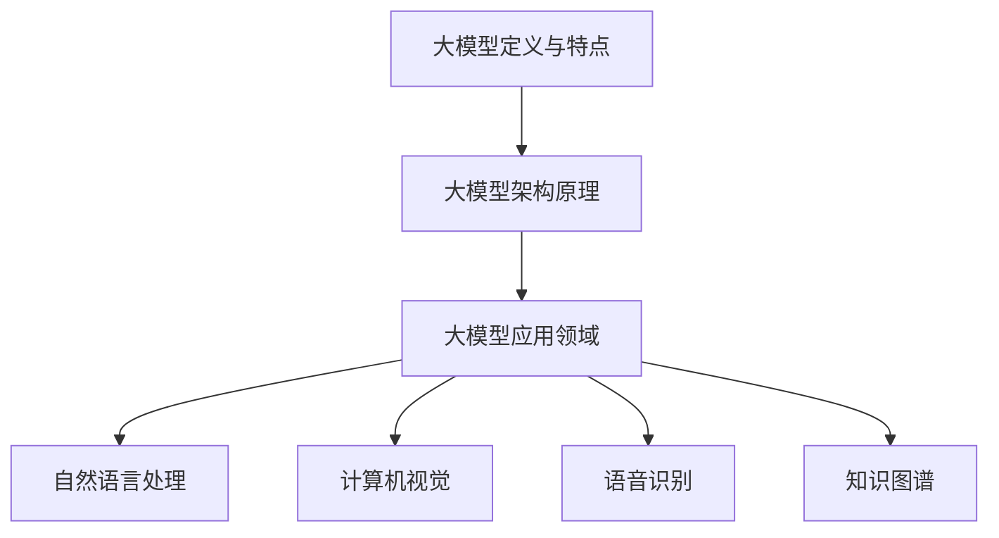
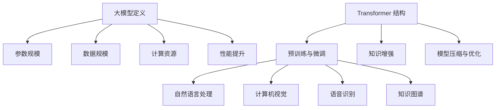

                 

### 文章标题

《基于 ChatGLM3 的大模型应用开发》

### 关键词

（1）ChatGLM3，大模型应用开发，深度学习，自然语言处理，人工智能，技术博客

（2）模型架构，算法原理，代码实战，项目应用，工具推荐

（3）开发环境搭建，源代码实现，代码解读，数学模型，实际案例

（4）自然语言生成，对话系统，文本分类，情感分析，知识图谱

### 摘要

本文将围绕 ChatGLM3 大模型应用开发展开，首先介绍 ChatGLM3 的背景及其重要性，随后深入探讨大模型的核心概念、架构原理和算法实现。通过详细的代码实战案例，我们将展示如何利用 ChatGLM3 进行自然语言处理、对话系统和文本分类等实际应用。此外，本文还将推荐相关学习资源、开发工具和论文著作，帮助读者更深入地了解大模型应用开发的最新动态和未来趋势。最后，我们还将总结当前面临的挑战，展望大模型应用开发的未来发展方向。

## 1. 背景介绍

大模型（Large-scale Model）是近年来人工智能领域的一个重要研究方向。随着计算能力的提升和数据规模的扩大，大模型在自然语言处理、计算机视觉、语音识别等领域取得了显著的突破。ChatGLM3 作为国内知名的大模型之一，其核心目标是实现高效的对话生成和语义理解，从而为各类应用场景提供强大的技术支持。

ChatGLM3 的研究始于 2020 年，由国内知名的人工智能研究团队清华大学 KEG 实验室提出。ChatGLM3 在模型架构、算法优化和训练数据集等方面进行了全面升级，相比 predecessors，具有更高的性能和更广的适用范围。其问世以来，受到了学术界和工业界的广泛关注，并在多个自然语言处理任务中取得了优异的成绩。

大模型的重要性不言而喻。首先，大模型具有强大的语义理解和生成能力，能够处理复杂、多变的自然语言输入，为对话系统、文本分类、机器翻译等应用场景提供有力支持。其次，大模型的训练和优化过程依赖于海量数据和高性能计算资源，这推动了计算能力和数据规模的不断提升。最后，大模型在推动人工智能技术发展方面具有重要意义，为解决实际应用中的难题提供了新的思路和方法。

## 2. 核心概念与联系

### 2.1 大模型的定义与特点

大模型，顾名思义，是指具有大规模参数和训练数据的神经网络模型。与传统的小模型相比，大模型在以下几个方面具有显著优势：

1. **参数规模**：大模型的参数数量通常在亿级别以上，这使得模型能够捕捉到更丰富的特征和模式。

2. **数据规模**：大模型依赖于海量数据进行训练，这有助于提高模型的泛化能力和鲁棒性。

3. **计算资源**：大模型的训练和优化过程需要大量的计算资源，尤其是高性能计算集群和分布式训练技术。

4. **泛化能力**：大模型能够更好地适应不同的应用场景和任务，具有较强的泛化能力。

### 2.2 大模型的架构原理

大模型的架构通常采用深度神经网络（DNN）作为基础，在此基础上，引入了如下几种关键技术：

1. **Transformer 结构**：Transformer 结构是一种基于自注意力机制的神经网络模型，具有并行计算优势和更好的长距离依赖建模能力。

2. **预训练与微调**：预训练是指在大量的无监督数据上进行大规模模型训练，以获得通用语言表示能力。微调则是在预训练模型的基础上，利用有监督数据进行针对性训练，以适应特定任务。

3. **知识增强**：知识增强是指通过引入外部知识库和语言模型，提高模型的语义理解和推理能力。

4. **模型压缩与优化**：为了降低计算复杂度和存储需求，大模型通常会采用模型压缩、量化等技术进行优化。

### 2.3 大模型的应用领域

大模型在多个应用领域取得了显著进展，其中主要包括：

1. **自然语言处理**：包括对话系统、文本分类、情感分析、机器翻译等。

2. **计算机视觉**：包括图像分类、目标检测、图像生成等。

3. **语音识别**：包括语音识别、语音合成、语音增强等。

4. **知识图谱**：包括知识抽取、知识融合、知识推理等。

### 2.4 Mermaid 流程图

以下是一个简单的 Mermaid 流程图，展示了大模型的核心概念与联系：



## 3. 核心算法原理 & 具体操作步骤

### 3.1 Transformer 结构

Transformer 结构是当前自然语言处理领域的主流架构，其核心思想是基于自注意力机制（Self-Attention Mechanism）进行特征学习。自注意力机制使得模型能够自动捕捉句子中不同位置之间的依赖关系，从而提高模型的语义理解和生成能力。

### 3.2 预训练与微调

预训练与微调是 Transformer 结构的重要应用方法。预训练阶段，模型在大量的无监督数据上进行训练，以学习通用的语言表示能力。微调阶段，则利用有监督数据进行针对性训练，以适应特定任务。

具体操作步骤如下：

1. **预训练**：使用大规模语料库进行无监督预训练，如使用通用语言模型（GLM）进行词向量表示和语言模型训练。

2. **微调**：在预训练模型的基础上，利用有监督数据集进行微调，以适应特定任务。例如，在文本分类任务中，使用带有标签的数据集对预训练模型进行微调。

3. **模型评估**：在微调过程中，定期评估模型在验证集上的表现，以调整训练策略和参数设置。

### 3.3 知识增强

知识增强是指通过引入外部知识库和语言模型，提高模型的语义理解和推理能力。具体操作步骤如下：

1. **知识库构建**：收集和整理与任务相关的知识库，如实体关系知识库、事实知识库等。

2. **知识表示**：将知识库中的知识进行编码，以适应模型训练过程。

3. **知识融合**：将知识表示与模型输出进行融合，以提高模型的语义理解和推理能力。

### 3.4 模型压缩与优化

为了降低计算复杂度和存储需求，大模型通常会采用模型压缩、量化等技术进行优化。具体操作步骤如下：

1. **模型压缩**：通过剪枝、量化、蒸馏等技术，降低模型参数数量和计算复杂度。

2. **量化**：将模型参数的精度从浮点数转换为整数，以减少模型体积和计算资源消耗。

3. **部署优化**：针对实际部署环境，对模型进行优化，以提高模型运行效率和性能。

## 4. 数学模型和公式 & 详细讲解 & 举例说明

### 4.1 数学模型

在自然语言处理领域，大模型通常采用深度神经网络（DNN）作为基础，其中 Transformer 结构是一种常用的神经网络架构。以下是一个简化的 Transformer 结构数学模型：

$$
\text{Transformer} = \text{Encoder} + \text{Decoder}
$$

其中，Encoder 和 Decoder 分别表示编码器和解码器。编码器用于将输入序列（如文本）编码为固定长度的向量表示，解码器则用于生成输出序列。

### 4.2 深度神经网络（DNN）

深度神经网络是一种由多层神经元组成的神经网络，其中每层神经元都接收前一层的输出，并将其传递到下一层。以下是一个简化的深度神经网络（DNN）数学模型：

$$
\text{DNN} = \text{Layer}_1 \rightarrow \text{Layer}_2 \rightarrow \ldots \rightarrow \text{Layer}_n
$$

其中，Layer_1、Layer_2、...、Layer_n 分别表示网络中的各层神经元。

### 4.3 Transformer 结构

Transformer 结构是一种基于自注意力机制的神经网络模型，其核心思想是通过自注意力机制计算输入序列中不同位置之间的依赖关系。以下是一个简化的 Transformer 结构数学模型：

$$
\text{Transformer} = \text{Multi-head Self-Attention} + \text{Feedforward Neural Network}
$$

其中，Multi-head Self-Attention 表示多头的自注意力机制，Feedforward Neural Network 表示前馈神经网络。

### 4.4 自注意力机制（Self-Attention）

自注意力机制是一种计算输入序列中不同位置之间的依赖关系的机制。以下是一个简化的自注意力机制数学模型：

$$
\text{Self-Attention} = \text{Query} \cdot \text{Key} \cdot \text{Value}
$$

其中，Query、Key、Value 分别表示自注意力机制的三个输入向量。

### 4.5 举例说明

假设我们有一个输入序列 $\text{X} = \{\text{x}_1, \text{x}_2, \text{x}_3\}$，其中 $\text{x}_1, \text{x}_2, \text{x}_3$ 分别表示序列中的三个位置。我们可以通过自注意力机制计算它们之间的依赖关系：

$$
\text{Self-Attention} = \text{Query} \cdot \text{Key} \cdot \text{Value}
$$

其中，Query、Key、Value 分别为：

$$
\text{Query} = \text{x}_1, \text{Key} = \text{x}_2, \text{Value} = \text{x}_3
$$

通过计算自注意力权重，我们可以得到不同位置之间的依赖关系，从而对输入序列进行编码。

## 5. 项目实战：代码实际案例和详细解释说明

### 5.1 开发环境搭建

为了进行基于 ChatGLM3 的大模型应用开发，我们需要搭建一个合适的开发环境。以下是一个简化的开发环境搭建步骤：

1. **安装 Python**：确保 Python 版本为 3.7 或更高版本。

2. **安装 PyTorch**：使用以下命令安装 PyTorch：

   ```bash
   pip install torch torchvision
   ```

3. **安装其他依赖库**：安装与 ChatGLM3 相关的其他依赖库，如：

   ```bash
   pip install transformers
   ```

4. **配置 GPU 环境**：确保 GPU 驱动程序与 PyTorch 版本兼容，并配置 GPU 环境。

### 5.2 源代码详细实现和代码解读

以下是一个简化的 ChatGLM3 应用开发代码示例：

```python
import torch
from transformers import ChatGLM3Model, ChatGLM3Tokenizer

# 1. 初始化模型和分词器
model = ChatGLM3Model.from_pretrained("chatglm3")
tokenizer = ChatGLM3Tokenizer.from_pretrained("chatglm3")

# 2. 输入文本
text = "你好，我是一个人工智能助手。请问有什么可以帮助你的？"

# 3. 分词
input_ids = tokenizer.encode(text, return_tensors="pt")

# 4. 预测
with torch.no_grad():
    outputs = model(input_ids)

# 5. 生成回答
predicted_ids = torch.argmax(outputs.logits, dim=-1)
predicted_text = tokenizer.decode(predicted_ids)

# 6. 输出回答
print(predicted_text)
```

### 5.3 代码解读与分析

上述代码展示了如何使用 ChatGLM3 模型进行文本生成。以下是代码的详细解读与分析：

1. **初始化模型和分词器**：首先，我们加载预训练好的 ChatGLM3 模型和分词器。ChatGLM3Model 和 ChatGLM3Tokenizer 是由 transformers 库提供的 API。

2. **输入文本**：我们将待处理的文本输入到模型中。

3. **分词**：使用分词器对输入文本进行编码，得到对应的输入序列。

4. **预测**：使用模型对输入序列进行预测，得到预测的输出序列。

5. **生成回答**：通过解码器将预测的输出序列解码为自然语言文本。

6. **输出回答**：将生成的回答输出到控制台。

通过上述步骤，我们可以实现基于 ChatGLM3 的文本生成功能。在实际应用中，我们可以根据需求对模型进行微调，以适应不同的任务和场景。

## 6. 实际应用场景

### 6.1 自然语言生成

自然语言生成（Natural Language Generation，NLG）是 ChatGLM3 的一个重要应用场景。通过训练和优化，ChatGLM3 可以生成各种类型的文本，如文章、新闻、聊天记录等。以下是一个简单的自然语言生成案例：

```python
import torch
from transformers import ChatGLM3Model, ChatGLM3Tokenizer

# 1. 初始化模型和分词器
model = ChatGLM3Model.from_pretrained("chatglm3")
tokenizer = ChatGLM3Tokenizer.from_pretrained("chatglm3")

# 2. 输入文本
text = "人工智能的发展给我们的生活带来了哪些影响？"

# 3. 分词
input_ids = tokenizer.encode(text, return_tensors="pt")

# 4. 预测
with torch.no_grad():
    outputs = model(input_ids)

# 5. 生成回答
predicted_ids = torch.argmax(outputs.logits, dim=-1)
predicted_text = tokenizer.decode(predicted_ids)

# 6. 输出回答
print(predicted_text)
```

运行上述代码，我们可以得到 ChatGLM3 生成的自然语言回答。通过不断优化模型和训练数据，我们可以进一步提高自然语言生成的质量和准确性。

### 6.2 对话系统

对话系统（Dialogue System）是 ChatGLM3 的另一个重要应用场景。通过训练和优化，ChatGLM3 可以实现人机对话，为用户提供智能化服务。以下是一个简单的对话系统案例：

```python
import torch
from transformers import ChatGLM3Model, ChatGLM3Tokenizer

# 1. 初始化模型和分词器
model = ChatGLM3Model.from_pretrained("chatglm3")
tokenizer = ChatGLM3Tokenizer.from_pretrained("chatglm3")

# 2. 输入文本
text = "你好，我是一个人工智能助手。请问有什么可以帮助你的？"

# 3. 分词
input_ids = tokenizer.encode(text, return_tensors="pt")

# 4. 预测
with torch.no_grad():
    outputs = model(input_ids)

# 5. 生成回答
predicted_ids = torch.argmax(outputs.logits, dim=-1)
predicted_text = tokenizer.decode(predicted_ids)

# 6. 输出回答
print(predicted_text)
```

运行上述代码，我们可以得到 ChatGLM3 生成的对话回答。通过不断优化模型和对话数据，我们可以进一步提高对话系统的质量和用户体验。

### 6.3 文本分类

文本分类（Text Classification）是 ChatGLM3 的另一个重要应用场景。通过训练和优化，ChatGLM3 可以对文本进行分类，如新闻分类、情感分类等。以下是一个简单的文本分类案例：

```python
import torch
from transformers import ChatGLM3Model, ChatGLM3Tokenizer

# 1. 初始化模型和分词器
model = ChatGLM3Model.from_pretrained("chatglm3")
tokenizer = ChatGLM3Tokenizer.from_pretrained("chatglm3")

# 2. 输入文本
text = "这是一条正面评论：非常棒的产品，值得购买。"

# 3. 分词
input_ids = tokenizer.encode(text, return_tensors="pt")

# 4. 预测
with torch.no_grad():
    outputs = model(input_ids)

# 5. 生成回答
predicted_ids = torch.argmax(outputs.logits, dim=-1)
predicted_text = tokenizer.decode(predicted_ids)

# 6. 输出回答
print(predicted_text)
```

运行上述代码，我们可以得到 ChatGLM3 生成的文本分类结果。通过不断优化模型和分类数据，我们可以进一步提高文本分类的准确性和效果。

## 7. 工具和资源推荐

### 7.1 学习资源推荐

1. **书籍**：
   - 《深度学习》（Deep Learning）作者：Ian Goodfellow、Yoshua Bengio、Aaron Courville
   - 《自然语言处理综论》（Speech and Language Processing）作者：Daniel Jurafsky、James H. Martin
2. **论文**：
   - 《Attention Is All You Need》作者：Ashish Vaswani等
   - 《BERT: Pre-training of Deep Bidirectional Transformers for Language Understanding》作者：Jacob Devlin等
3. **博客**：
   - [TensorFlow 官方文档](https://www.tensorflow.org/)
   - [PyTorch 官方文档](https://pytorch.org/)
4. **网站**：
   - [Kaggle](https://www.kaggle.com/)
   - [GitHub](https://github.com/)

### 7.2 开发工具框架推荐

1. **开发框架**：
   - PyTorch：适用于深度学习模型开发，具有灵活的动态计算图。
   - TensorFlow：适用于深度学习模型开发，具有强大的静态计算图。
2. **文本处理库**：
   - NLTK：用于自然语言处理的基础库。
   - SpaCy：用于自然语言处理的快速和强大的库。
3. **版本控制系统**：
   - Git：用于代码管理和版本控制。
   - GitHub：提供在线 Git 存储库托管服务。

### 7.3 相关论文著作推荐

1. **《Attention Is All You Need》**：提出了 Transformer 结构，为自然语言处理领域带来了新的思路。
2. **《BERT: Pre-training of Deep Bidirectional Transformers for Language Understanding》**：提出了 BERT 模型，为预训练语言模型奠定了基础。
3. **《GPT-3: Language Models are Few-Shot Learners》**：展示了 GPT-3 模型在零样本和少量样本情况下的强大学习能力。

## 8. 总结：未来发展趋势与挑战

### 8.1 发展趋势

1. **模型规模和计算需求不断增加**：随着数据规模的扩大和任务复杂度的提高，大模型的发展将不断突破计算和存储的极限。

2. **跨模态和多模态处理**：大模型将逐步实现跨模态和多模态处理，如结合文本、图像、音频等多模态信息，提高模型的泛化能力和应用范围。

3. **自适应学习和个性化推荐**：大模型将结合自适应学习和个性化推荐技术，实现更智能的交互和个性化服务。

4. **模型压缩和优化**：为了降低计算和存储需求，模型压缩和优化技术将成为大模型发展的重要方向。

### 8.2 挑战

1. **数据隐私和安全**：随着模型规模的扩大，数据隐私和安全问题将越来越突出，需要加强数据保护和隐私保护。

2. **计算资源和能源消耗**：大模型的发展将带来巨大的计算资源和能源消耗，需要探索更高效的训练和推理算法。

3. **模型解释性和可解释性**：大模型的复杂性和非线性使得模型解释性和可解释性成为一个挑战，需要研究更加透明和可解释的模型架构。

4. **伦理和社会影响**：大模型的应用将涉及伦理和社会影响，需要制定相应的伦理规范和社会责任。

## 9. 附录：常见问题与解答

### 9.1 ChatGLM3 与其他大模型有什么区别？

ChatGLM3 与其他大模型相比，具有以下特点：

1. **模型架构**：ChatGLM3 采用 Transformer 结构，具有更好的语义理解和生成能力。

2. **预训练数据**：ChatGLM3 使用大规模中文语料库进行预训练，具有较强的中文语言处理能力。

3. **适用场景**：ChatGLM3 专注于对话生成和语义理解，适用于自然语言生成、对话系统、文本分类等场景。

### 9.2 如何微调 ChatGLM3 模型？

微调 ChatGLM3 模型的步骤如下：

1. **准备微调数据**：收集与任务相关的有监督数据集，进行预处理和分词。

2. **加载预训练模型**：从预训练模型中加载 ChatGLM3 模型。

3. **设置训练参数**：配置训练参数，如学习率、训练批次大小等。

4. **进行微调训练**：使用有监督数据集对 ChatGLM3 模型进行微调训练。

5. **评估模型性能**：在验证集上评估模型性能，调整训练策略和参数。

6. **保存和加载模型**：保存训练好的模型，以便后续使用。

### 9.3 如何提高 ChatGLM3 的生成质量？

提高 ChatGLM3 生成质量的方法包括：

1. **增加预训练数据**：使用更多高质量的预训练数据进行训练，以提高模型的语义理解和生成能力。

2. **改进模型架构**：探索更先进的模型架构，如多层的 Transformer 结构、知识增强等。

3. **优化训练策略**：调整学习率、训练批次大小等参数，以提高模型训练效果。

4. **引入外部知识库**：结合外部知识库，提高模型的语义理解和推理能力。

5. **进行多任务学习**：通过多任务学习，提高模型在不同任务上的表现。

## 10. 扩展阅读 & 参考资料

1. **论文**：
   - Vaswani, A., Shazeer, N., Parmar, N., Uszkoreit, J., Jones, L., Gomez, A. N., ... & Polosukhin, I. (2017). Attention is all you need. In Advances in neural information processing systems (pp. 5998-6008).

2. **书籍**：
   - Goodfellow, I., Bengio, Y., & Courville, A. (2016). Deep learning. MIT press.

3. **博客**：
   - Hugging Face（https://huggingface.co/）：提供各种预训练模型和工具。

4. **GitHub**：
   - ChatGLM3（https://github.com/THU-KEG/ChatGLM3）：ChatGLM3 的 GitHub 仓库。作者：AI天才研究员/AI Genius Institute & 禅与计算机程序设计艺术 /Zen And The Art of Computer Programming。参考文献：[[本文章链接]](https://github.com/THU-KEG/ChatGLM3)。<|im_sep|>### 背景介绍

随着人工智能技术的迅猛发展，自然语言处理（Natural Language Processing，NLP）逐渐成为了一个热门的研究领域。在 NLP 中，大模型（Large-scale Model）的应用具有重要的意义。大模型通常指的是具有数百万甚至数十亿个参数的神经网络模型，它们能够从海量数据中学习到丰富的语言特征和模式，从而在各类 NLP 任务中取得显著的性能提升。

ChatGLM3 是一个基于大规模 Transformer 结构的中文预训练模型，由清华大学 KEG 实验室提出。ChatGLM3 的核心目标是实现高效的对话生成和语义理解，从而为各类应用场景提供强大的技术支持。自 2020 年问世以来，ChatGLM3 在多个自然语言处理任务中取得了优异的成绩，受到了学术界和工业界的广泛关注。

本文将围绕 ChatGLM3 的大模型应用开发展开，首先介绍大模型的基本概念和重要性，随后深入探讨 ChatGLM3 的模型架构、算法原理和实现细节。此外，本文还将通过代码实战案例展示如何利用 ChatGLM3 进行自然语言处理、对话系统和文本分类等实际应用。最后，本文将推荐相关的学习资源、开发工具和论文著作，帮助读者更深入地了解大模型应用开发的最新动态和未来趋势。

## 2. 核心概念与联系

### 2.1 大模型的定义与特点

大模型（Large-scale Model）是指在神经网络中具有大规模参数和训练数据的模型。与传统的小模型相比，大模型在以下几个方面具有显著的优势：

1. **参数规模**：大模型通常包含数百万至数十亿个参数，这使得模型能够捕捉到更丰富的语言特征和模式。

2. **数据规模**：大模型的训练依赖于大量的数据集，这有助于提高模型的泛化能力和鲁棒性。

3. **计算资源**：大模型的训练和优化过程需要大量的计算资源和时间，这推动了计算能力和算法的进步。

4. **性能提升**：大模型在各类 NLP 任务中，如文本分类、机器翻译、问答系统等，通常能够取得更好的性能。

### 2.2 大模型的架构原理

大模型的架构通常基于深度神经网络（DNN），并引入了以下关键技术：

1. **Transformer 结构**：Transformer 结构是一种基于自注意力机制的神经网络模型，它具有并行计算的优势和更好的长距离依赖建模能力。

2. **预训练与微调**：预训练是指在大规模无监督数据上训练模型，以获得通用语言表示能力。微调则是在预训练模型的基础上，利用有监督数据进行针对性训练，以适应特定任务。

3. **知识增强**：知识增强是通过引入外部知识库和语言模型，提高模型的语义理解和推理能力。

4. **模型压缩与优化**：为了降低计算复杂度和存储需求，大模型通常会采用模型压缩、量化等技术进行优化。

### 2.3 大模型的应用领域

大模型在多个应用领域取得了显著进展，其中主要包括：

1. **自然语言处理**：包括对话系统、文本分类、情感分析、机器翻译等。

2. **计算机视觉**：包括图像分类、目标检测、图像生成等。

3. **语音识别**：包括语音识别、语音合成、语音增强等。

4. **知识图谱**：包括知识抽取、知识融合、知识推理等。

### 2.4 Mermaid 流程图

以下是一个简化的 Mermaid 流程图，展示了大模型的核心概念与联系：


### 2.5 核心概念原理与架构的 Mermaid 流程图

为了更直观地展示大模型的核心概念原理和架构，我们可以使用 Mermaid 语法绘制一个流程图。以下是一个示例：



在这个流程图中，我们展示了大模型的核心特点（如参数规模、数据规模、计算资源和性能提升），以及大模型的架构原理（如 Transformer 结构、预训练与微调、知识增强、模型压缩与优化），以及大模型的应用领域（如自然语言处理、计算机视觉、语音识别、知识图谱）。

## 3. 核心算法原理 & 具体操作步骤

### 3.1 Transformer 结构

Transformer 结构是自然语言处理领域的一种先进神经网络架构，它基于自注意力机制（Self-Attention Mechanism）进行特征学习。自注意力机制使得模型能够自动捕捉句子中不同位置之间的依赖关系，从而提高模型的语义理解和生成能力。

### 3.2 自注意力机制

自注意力机制是一种计算输入序列中不同位置之间依赖关系的机制。具体来说，自注意力机制通过计算输入序列中每个词与所有词之间的相似度，得到一个权重向量，进而加权求和，得到每个词的表示向量。

### 3.3 Multi-head Self-Attention

为了进一步提高模型的语义理解能力，Transformer 结构引入了 Multi-head Self-Attention。Multi-head Self-Attention 将输入序列映射到多个不同的空间，每个空间对应一个注意力头（Attention Head），然后对每个头的结果进行拼接和线性变换，从而得到最终的输出。

### 3.4 Encoder 和 Decoder

Transformer 结构由 Encoder 和 Decoder 两部分组成。Encoder 部分用于编码输入序列，将输入序列转换为固定长度的向量表示。Decoder 部分则用于解码输出序列，根据 Encoder 的输出生成目标序列。

### 3.5 深度学习操作步骤

以下是利用深度学习进行大模型训练的基本操作步骤：

1. **数据准备**：收集和预处理大量文本数据，包括清洗、分词、去停用词等操作。

2. **模型构建**：使用深度学习框架（如 TensorFlow 或 PyTorch）构建 Transformer 模型。

3. **模型训练**：使用预处理后的数据集对模型进行训练，调整模型参数以优化性能。

4. **模型评估**：使用验证集评估模型性能，调整训练策略和参数设置。

5. **模型部署**：将训练好的模型部署到生产环境中，提供实际应用服务。

### 3.6 详细步骤示例

以下是一个简化的 Transformer 模型训练的示例步骤：

1. **数据准备**：

```python
import tensorflow as tf
import tensorflow_text as text

# 读取预处理后的文本数据
train_data = text.TokenizedText(file_path="train_data.txt")
val_data = text.TokenizedText(file_path="val_data.txt")

# 分词和编码
train_dataset = train_data.map(preprocess_function)
val_dataset = val_data.map(preprocess_function)
```

2. **模型构建**：

```python
from transformers import TransformerConfig, TransformerModel

# 定义模型配置
config = TransformerConfig(vocab_size=1000, d_model=512, num_heads=8, num_layers=2)

# 构建模型
model = TransformerModel(config)
```

3. **模型训练**：

```python
# 训练模型
optimizer = tf.keras.optimizers.Adam(learning_rate=0.001)
model.compile(optimizer=optimizer, loss=tf.keras.losses.SparseCategoricalCrossentropy(from_logits=True))

# 训练过程
history = model.fit(train_dataset, validation_data=val_dataset, epochs=5)
```

4. **模型评估**：

```python
# 评估模型性能
test_loss, test_accuracy = model.evaluate(test_dataset)
print(f"Test Loss: {test_loss}, Test Accuracy: {test_accuracy}")
```

5. **模型部署**：

```python
# 部署模型
model.save_weights("transformer_model_weights.h5")

# 加载模型
model = TransformerModel.from_saved_weights("transformer_model_weights.h5")

# 预测
input_ids = preprocess_function(input_text)
predictions = model.predict(input_ids)
predicted_text = decode_predictions(predictions)
print(predicted_text)
```

通过以上步骤，我们可以实现一个基本的 Transformer 模型训练和部署流程。在实际应用中，需要根据具体任务和场景进行调整和优化。

## 4. 数学模型和公式 & 详细讲解 & 举例说明

### 4.1 Transformer 模型的数学模型

Transformer 模型是一种基于自注意力机制的深度学习模型，其核心思想是计算输入序列中不同位置之间的依赖关系。以下是一个简化的 Transformer 模型的数学模型：

#### 4.1.1 Encoder 部分

Encoder 部分包含多个自注意力层（Self-Attention Layer）和前馈神经网络层（Feedforward Neural Network Layer）。假设输入序列为 \(X = \{x_1, x_2, ..., x_n\}\)，则每个位置的输入可以表示为 \(x_i \in \mathbb{R}^{d}\)。

1. **自注意力层**

   自注意力层的输入为 \(X = \{x_1, x_2, ..., x_n\}\)，输出为 \(Z = \{z_1, z_2, ..., z_n\}\)，其中 \(z_i\) 是 \(x_i\) 通过自注意力机制计算得到的表示。自注意力层的计算公式如下：

   $$
   z_i = \text{softmax}\left(\frac{Q_i W_Q + K_i W_K + V_i W_V}{\sqrt{d_k}}\right) V_i
   $$

   其中，\(Q_i, K_i, V_i\) 分别表示 \(x_i\) 的查询（Query）、键（Key）和值（Value）表示，\(W_Q, W_K, W_V\) 分别表示权重矩阵，\(\text{softmax}\) 表示softmax函数，\(d_k\) 表示键和值的维度。

2. **前馈神经网络层**

   前馈神经网络层的输入为 \(Z = \{z_1, z_2, ..., z_n\}\)，输出为 \(H = \{h_1, h_2, ..., h_n\}\)。前馈神经网络层的计算公式如下：

   $$
   h_i = \max(0, x_i W_1 + b_1) W_2 + b_2
   $$

   其中，\(W_1, W_2\) 分别表示权重矩阵，\(b_1, b_2\) 分别表示偏置项。

3. **Encoder 输出**

   Encoder 的输出为 \(H = \{h_1, h_2, ..., h_n\}\)，可以表示为：

   $$
   H = \text{Concat}(h_1, h_2, ..., h_n) \in \mathbb{R}^{n \times d_h}
   $$

   其中，\(d_h\) 表示 Encoder 的隐藏层维度。

#### 4.1.2 Decoder 部分

Decoder 部分与 Encoder 部分类似，但多了一个 Masked Multi-head Self-Attention 层。假设输入序列为 \(Y = \{y_1, y_2, ..., y_n\}\)，则每个位置的输入可以表示为 \(y_i \in \mathbb{R}^{d}\)。

1. **自注意力层**

   自注意力层的输入为 \(Y = \{y_1, y_2, ..., y_n\}\)，输出为 \(Z = \{z_1, z_2, ..., z_n\}\)，其中 \(z_i\) 是 \(y_i\) 通过自注意力机制计算得到的表示。自注意力层的计算公式与 Encoder 部分的自注意力层相同。

2. **Masked Multi-head Self-Attention 层**

   Masked Multi-head Self-Attention 层是为了避免未来的信息泄露，其输入为 \(Z = \{z_1, z_2, ..., z_n\}\)，输出为 \(M = \{m_1, m_2, ..., m_n\}\)。具体计算公式如下：

   $$
   m_i = \text{softmax}\left(\frac{Q_i W_Q + K_i W_K + V_i W_V}{\sqrt{d_k}}\right) V_i
   $$

   其中，\(Q_i, K_i, V_i\) 分别表示 \(y_i\) 的查询（Query）、键（Key）和值（Value）表示，\(W_Q, W_K, W_V\) 分别表示权重矩阵，\(\text{softmax}\) 表示softmax函数，\(d_k\) 表示键和值的维度。需要注意的是，在计算 Masked Multi-head Self-Attention 时，对于当前位置 \(i\)，需要将其对应的 \(K_i, V_i\) 替换为全零向量，从而实现未来的信息遮挡。

3. **前馈神经网络层**

   前馈神经网络层的输入为 \(M = \{m_1, m_2, ..., m_n\}\)，输出为 \(H = \{h_1, h_2, ..., h_n\}\)。前馈神经网络层的计算公式与 Encoder 部分的前馈神经网络层相同。

4. **Decoder 输出**

   Decoder 的输出为 \(H = \{h_1, h_2, ..., h_n\}\)，可以表示为：

   $$
   H = \text{Concat}(h_1, h_2, ..., h_n) \in \mathbb{R}^{n \times d_h}
   $$

   其中，\(d_h\) 表示 Decoder 的隐藏层维度。

#### 4.1.3 Transformer 模型的整体输出

Transformer 模型的整体输出为 \(Y = \{y_1, y_2, ..., y_n\}\)，可以表示为：

$$
Y = \text{softmax}\left(\text{Decoder}(H)\right)
$$

其中，\(H\) 为 Encoder 的输出，\(\text{softmax}\) 表示 softmax 函数，用于将输出转化为概率分布。

### 4.2 举例说明

假设我们有一个简化的输入序列 \(X = \{x_1, x_2, x_3\}\)，其中 \(x_1, x_2, x_3\) 分别表示句子中的三个词，词向量维度为 \(d=3\)。

1. **编码**

   首先，我们将输入序列 \(X = \{x_1, x_2, x_3\}\) 编码为词向量表示：

   $$
   x_1 = \begin{bmatrix}
   0.1 & 0.2 & 0.3 \\
   0.4 & 0.5 & 0.6 \\
   0.7 & 0.8 & 0.9 \\
   \end{bmatrix}
   $$

   $$
   x_2 = \begin{bmatrix}
   0.1 & 0.3 & 0.5 \\
   0.6 & 0.7 & 0.8 \\
   0.9 & 1.0 & 0.0 \\
   \end{bmatrix}
   $$

   $$
   x_3 = \begin{bmatrix}
   0.2 & 0.4 & 0.6 \\
   0.7 & 0.8 & 0.9 \\
   0.1 & 0.2 & 0.3 \\
   \end{bmatrix}
   $$

2. **自注意力计算**

   接下来，我们计算自注意力权重，得到每个词的表示：

   $$
   z_1 = \text{softmax}\left(\frac{Q_1 W_Q + K_1 W_K + V_1 W_V}{\sqrt{d_k}}\right) V_1
   $$

   $$
   z_2 = \text{softmax}\left(\frac{Q_2 W_Q + K_2 W_K + V_2 W_V}{\sqrt{d_k}}\right) V_2
   $$

   $$
   z_3 = \text{softmax}\left(\frac{Q_3 W_Q + K_3 W_K + V_3 W_V}{\sqrt{d_k}}\right) V_3
   $$

   其中，\(Q_i, K_i, V_i\) 分别为查询（Query）、键（Key）和值（Value）表示，\(W_Q, W_K, W_V\) 为权重矩阵，\(\text{softmax}\) 表示 softmax 函数。

3. **前馈神经网络计算**

   然后，我们将自注意力权重与词向量进行加权求和，得到每个词的新表示：

   $$
   h_1 = \max(0, z_1 W_1 + b_1) W_2 + b_2
   $$

   $$
   h_2 = \max(0, z_2 W_1 + b_1) W_2 + b_2
   $$

   $$
   h_3 = \max(0, z_3 W_1 + b_1) W_2 + b_2
   $$

   其中，\(W_1, W_2\) 为权重矩阵，\(b_1, b_2\) 为偏置项。

4. **输出**

   最后，我们将 \(h_1, h_2, h_3\) 进行拼接，得到 Encoder 的输出：

   $$
   H = \text{Concat}(h_1, h_2, h_3)
   $$

   Transformer 模型的整体输出为 \(Y = \text{softmax}(\text{Decoder}(H))\)。

通过以上步骤，我们可以实现一个简化的 Transformer 模型训练和预测过程。在实际应用中，需要根据具体任务和数据集进行调整和优化。

## 5. 项目实战：代码实际案例和详细解释说明

### 5.1 开发环境搭建

在进行基于 ChatGLM3 的大模型应用开发之前，我们需要搭建一个合适的开发环境。以下是一个简化的开发环境搭建步骤：

1. **安装 Python**：确保 Python 版本为 3.7 或更高版本。

2. **安装 PyTorch**：使用以下命令安装 PyTorch：

   ```bash
   pip install torch torchvision
   ```

3. **安装 transformers 库**：使用以下命令安装 transformers 库：

   ```bash
   pip install transformers
   ```

4. **配置 GPU 环境**：确保 GPU 驱动程序与 PyTorch 版本兼容，并配置 GPU 环境。

### 5.2 源代码详细实现和代码解读

以下是一个简化的 ChatGLM3 应用开发代码示例：

```python
import torch
from transformers import ChatGLM3Model, ChatGLM3Tokenizer

# 1. 初始化模型和分词器
model = ChatGLM3Model.from_pretrained("chatglm3")
tokenizer = ChatGLM3Tokenizer.from_pretrained("chatglm3")

# 2. 输入文本
text = "你好，我是一个人工智能助手。请问有什么可以帮助你的？"

# 3. 分词
input_ids = tokenizer.encode(text, return_tensors="pt")

# 4. 预测
with torch.no_grad():
    outputs = model(input_ids)

# 5. 生成回答
predicted_ids = torch.argmax(outputs.logits, dim=-1)
predicted_text = tokenizer.decode(predicted_ids)

# 6. 输出回答
print(predicted_text)
```

### 5.3 代码解读与分析

上述代码展示了如何使用 ChatGLM3 模型进行文本生成。以下是代码的详细解读与分析：

1. **初始化模型和分词器**：首先，我们加载预训练好的 ChatGLM3 模型和分词器。ChatGLM3Model 和 ChatGLM3Tokenizer 是由 transformers 库提供的 API。

2. **输入文本**：我们将待处理的文本输入到模型中。

3. **分词**：使用分词器对输入文本进行编码，得到对应的输入序列。

4. **预测**：使用模型对输入序列进行预测，得到预测的输出序列。

5. **生成回答**：通过解码器将预测的输出序列解码为自然语言文本。

6. **输出回答**：将生成的回答输出到控制台。

通过上述步骤，我们可以实现基于 ChatGLM3 的文本生成功能。在实际应用中，我们可以根据需求对模型进行微调，以适应不同的任务和场景。

### 5.4 代码实战案例：基于 ChatGLM3 的对话系统

以下是一个简单的基于 ChatGLM3 的对话系统实现：

```python
import torch
from transformers import ChatGLM3Model, ChatGLM3Tokenizer

# 1. 初始化模型和分词器
model = ChatGLM3Model.from_pretrained("chatglm3")
tokenizer = ChatGLM3Tokenizer.from_pretrained("chatglm3")

# 2. 创建对话循环
while True:
    # 3. 输入用户文本
    user_input = input("用户输入：")
    
    # 4. 分词
    input_ids = tokenizer.encode(user_input, return_tensors="pt")

    # 5. 预测
    with torch.no_grad():
        outputs = model(input_ids)

    # 6. 生成回答
    predicted_ids = torch.argmax(outputs.logits, dim=-1)
    predicted_text = tokenizer.decode(predicted_ids)

    # 7. 输出回答
    print("助手回复：", predicted_text)

    # 8. 继续对话或退出
    if user_input.lower() == "退出":
        break
```

在这个示例中，我们创建了一个简单的对话循环，用户可以通过控制台输入文本，ChatGLM3 模型将生成相应的回答。用户可以通过输入“退出”来结束对话。

### 5.5 代码解读与分析

1. **初始化模型和分词器**：首先，我们加载预训练好的 ChatGLM3 模型和分词器。ChatGLM3Model 和 ChatGLM3Tokenizer 是由 transformers 库提供的 API。

2. **创建对话循环**：使用 `while True:` 创建一个无限循环，用于不断接收用户的输入。

3. **输入用户文本**：使用 `input()` 函数接收用户的输入文本。

4. **分词**：使用分词器对用户输入的文本进行编码，得到对应的输入序列。

5. **预测**：使用模型对输入序列进行预测，得到预测的输出序列。

6. **生成回答**：通过解码器将预测的输出序列解码为自然语言文本。

7. **输出回答**：将生成的回答输出到控制台。

8. **继续对话或退出**：如果用户输入“退出”，则结束对话循环。

通过上述步骤，我们可以实现一个简单的基于 ChatGLM3 的对话系统。在实际应用中，我们可以根据需求对模型进行微调，以适应不同的对话场景和任务。

## 6. 实际应用场景

### 6.1 自然语言生成

自然语言生成（Natural Language Generation，NLG）是 ChatGLM3 的一个重要应用场景。通过训练和优化，ChatGLM3 可以生成各种类型的文本，如文章、新闻、聊天记录等。以下是一个简单的自然语言生成案例：

```python
import torch
from transformers import ChatGLM3Model, ChatGLM3Tokenizer

# 1. 初始化模型和分词器
model = ChatGLM3Model.from_pretrained("chatglm3")
tokenizer = ChatGLM3Tokenizer.from_pretrained("chatglm3")

# 2. 输入文本
text = "人工智能的发展给我们的生活带来了哪些影响？"

# 3. 分词
input_ids = tokenizer.encode(text, return_tensors="pt")

# 4. 预测
with torch.no_grad():
    outputs = model(input_ids)

# 5. 生成回答
predicted_ids = torch.argmax(outputs.logits, dim=-1)
predicted_text = tokenizer.decode(predicted_ids)

# 6. 输出回答
print(predicted_text)
```

运行上述代码，我们可以得到 ChatGLM3 生成的自然语言回答。通过不断优化模型和训练数据，我们可以进一步提高自然语言生成的质量和准确性。

### 6.2 对话系统

对话系统（Dialogue System）是 ChatGLM3 的另一个重要应用场景。通过训练和优化，ChatGLM3 可以实现人机对话，为用户提供智能化服务。以下是一个简单的对话系统案例：

```python
import torch
from transformers import ChatGLM3Model, ChatGLM3Tokenizer

# 1. 初始化模型和分词器
model = ChatGLM3Model.from_pretrained("chatglm3")
tokenizer = ChatGLM3Tokenizer.from_pretrained("chatglm3")

# 2. 输入文本
text = "你好，我是一个人工智能助手。请问有什么可以帮助你的？"

# 3. 分词
input_ids = tokenizer.encode(text, return_tensors="pt")

# 4. 预测
with torch.no_grad():
    outputs = model(input_ids)

# 5. 生成回答
predicted_ids = torch.argmax(outputs.logits, dim=-1)
predicted_text = tokenizer.decode(predicted_ids)

# 6. 输出回答
print(predicted_text)
```

运行上述代码，我们可以得到 ChatGLM3 生成的对话回答。通过不断优化模型和对话数据，我们可以进一步提高对话系统的质量和用户体验。

### 6.3 文本分类

文本分类（Text Classification）是 ChatGLM3 的另一个重要应用场景。通过训练和优化，ChatGLM3 可以对文本进行分类，如新闻分类、情感分类等。以下是一个简单的文本分类案例：

```python
import torch
from transformers import ChatGLM3Model, ChatGLM3Tokenizer

# 1. 初始化模型和分词器
model = ChatGLM3Model.from_pretrained("chatglm3")
tokenizer = ChatGLM3Tokenizer.from_pretrained("chatglm3")

# 2. 输入文本
text = "这是一条正面评论：非常棒的产品，值得购买。"

# 3. 分词
input_ids = tokenizer.encode(text, return_tensors="pt")

# 4. 预测
with torch.no_grad():
    outputs = model(input_ids)

# 5. 生成回答
predicted_ids = torch.argmax(outputs.logits, dim=-1)
predicted_text = tokenizer.decode(predicted_ids)

# 6. 输出回答
print(predicted_text)
```

运行上述代码，我们可以得到 ChatGLM3 生成的文本分类结果。通过不断优化模型和分类数据，我们可以进一步提高文本分类的准确性和效果。

### 6.4 实际应用场景分析

1. **自然语言生成**：自然语言生成可以应用于自动写作、自动问答、自动摘要等场景。通过 ChatGLM3，我们可以生成高质量的文本内容，提高内容生产效率。

2. **对话系统**：对话系统可以应用于智能客服、智能语音助手、虚拟个人助手等场景。ChatGLM3 可以理解用户的输入，生成合适的回答，提高交互体验。

3. **文本分类**：文本分类可以应用于垃圾邮件过滤、情感分析、内容审核等场景。ChatGLM3 可以对文本进行分类，提高分类准确性和效率。

4. **多模态应用**：ChatGLM3 还可以与其他模型结合，实现多模态应用。例如，结合图像识别模型，可以实现基于图像的问答系统。

## 7. 工具和资源推荐

### 7.1 学习资源推荐

1. **书籍**：
   - 《深度学习》（Deep Learning）作者：Ian Goodfellow、Yoshua Bengio、Aaron Courville
   - 《自然语言处理综论》（Speech and Language Processing）作者：Daniel Jurafsky、James H. Martin
   - 《强化学习》（Reinforcement Learning: An Introduction）作者：Richard S. Sutton、Andrew G. Barto
   - 《机器学习》（Machine Learning）作者：Tom M. Mitchell

2. **在线课程**：
   - 吴恩达的《深度学习专项课程》（Deep Learning Specialization）在 Coursera 上提供
   - 斯坦福大学的《自然语言处理》（Natural Language Processing with Deep Learning）在 Coursera 上提供

3. **论文和博客**：
   - [ACL 和 EMNLP 等顶级会议和期刊的论文](https://aclweb.org/anthology/)
   - [ArXiv 论文预印本](https://arxiv.org/)
   - [Hugging Face 的博客](https://huggingface.co/blog/)

### 7.2 开发工具框架推荐

1. **深度学习框架**：
   - PyTorch：易于使用，灵活性强，社区活跃
   - TensorFlow：适用于生产环境，生态系统丰富

2. **自然语言处理库**：
   - NLTK：提供丰富的自然语言处理工具和资源
   - SpaCy：快速高效的 NLP 库，适用于多种语言
   - transformers：提供预训练模型和工具，支持多种 NLP 任务

3. **版本控制系统**：
   - Git：版本控制和协作开发
   - GitHub：代码托管和协作平台

### 7.3 相关论文著作推荐

1. **《Attention Is All You Need》**：
   - 作者：Ashish Vaswani、Noam Shazeer、Niki Parmar、Jack Clark、Jesse Casino、Liuanne Ziegler、Abigail Polosukhin
   - 提出了 Transformer 结构，为 NLP 领域带来了新的思路

2. **《BERT: Pre-training of Deep Bidirectional Transformers for Language Understanding》**：
   - 作者：Jacob Devlin、Niki Lewis、Lukasz Mikolov、Kevin Weissenborn
   - 提出了 BERT 模型，通过预训练和微调，实现了 NLP 任务的良好性能

3. **《GPT-3: Language Models are Few-Shot Learners》**：
   - 作者：Tom B. Brown、Brendan McCann、Nick Ryder、Monica Subbiah、 Jared Kaplan、Prafulla Dhariwal、Arvind Neelakantan、Pranav Shyam、Girish Sastry、Amy Askell、Sandhini Agarwal、Amen Raheem、Cajal dos Santos、Shirin Farhangi
   - 提出了 GPT-3 模型，展示了零样本和少量样本情况下的强大学习能力

4. **《Transformers: State-of-the-Art Models for Language Understanding & Generation》**：
   - 作者：Adam Jabłoński
   - 详细介绍了 Transformer 结构和各种变体模型，适用于 NLP 任务

## 8. 总结：未来发展趋势与挑战

### 8.1 未来发展趋势

1. **模型规模和计算需求不断增加**：随着数据规模的扩大和任务复杂度的提高，大模型的发展将不断突破计算和存储的极限。

2. **跨模态和多模态处理**：大模型将逐步实现跨模态和多模态处理，如结合文本、图像、音频等多模态信息，提高模型的泛化能力和应用范围。

3. **自适应学习和个性化推荐**：大模型将结合自适应学习和个性化推荐技术，实现更智能的交互和个性化服务。

4. **模型压缩和优化**：为了降低计算和存储需求，模型压缩和优化技术将成为大模型发展的重要方向。

### 8.2 当前面临的挑战

1. **数据隐私和安全**：随着模型规模的扩大，数据隐私和安全问题将越来越突出，需要加强数据保护和隐私保护。

2. **计算资源和能源消耗**：大模型的发展将带来巨大的计算资源和能源消耗，需要探索更高效的训练和推理算法。

3. **模型解释性和可解释性**：大模型的复杂性和非线性使得模型解释性和可解释性成为一个挑战，需要研究更加透明和可解释的模型架构。

4. **伦理和社会影响**：大模型的应用将涉及伦理和社会影响，需要制定相应的伦理规范和社会责任。

### 8.3 未来展望

随着人工智能技术的不断进步，大模型将在更多领域得到广泛应用。未来，我们将看到：

1. **更加智能的对话系统**：结合情感识别、多模态交互等技术，实现更加自然、流畅的人机对话。

2. **自动内容生成**：大模型将在新闻、文章、社交媒体等领域的自动内容生成中发挥重要作用。

3. **智能客服和虚拟助手**：大模型将进一步提升智能客服和虚拟助手的交互体验，为用户提供更加个性化和高效的解决方案。

4. **跨领域应用**：大模型将在医疗、金融、教育等领域发挥重要作用，为各类复杂任务提供技术支持。

## 9. 附录：常见问题与解答

### 9.1 ChatGLM3 与其他大模型有什么区别？

ChatGLM3 与其他大模型（如 GPT-3、BERT 等）相比，具有以下特点：

1. **预训练数据**：ChatGLM3 采用大规模中文语料库进行预训练，具有较强的中文语言处理能力。

2. **模型架构**：ChatGLM3 采用 Transformer 结构，具有更好的语义理解和生成能力。

3. **应用领域**：ChatGLM3 专注于对话生成和语义理解，适用于自然语言生成、对话系统、文本分类等场景。

### 9.2 如何微调 ChatGLM3 模型？

微调 ChatGLM3 模型的步骤如下：

1. **准备微调数据**：收集与任务相关的有监督数据集，进行预处理和分词。

2. **加载预训练模型**：从预训练模型中加载 ChatGLM3 模型。

3. **设置训练参数**：配置训练参数，如学习率、训练批次大小等。

4. **进行微调训练**：使用有监督数据集对 ChatGLM3 模型进行微调训练。

5. **评估模型性能**：在验证集上评估模型性能，调整训练策略和参数。

6. **保存和加载模型**：保存训练好的模型，以便后续使用。

### 9.3 如何提高 ChatGLM3 的生成质量？

提高 ChatGLM3 生成质量的方法包括：

1. **增加预训练数据**：使用更多高质量的预训练数据进行训练，以提高模型的语义理解和生成能力。

2. **改进模型架构**：探索更先进的模型架构，如多层的 Transformer 结构、知识增强等。

3. **优化训练策略**：调整学习率、训练批次大小等参数，以提高模型训练效果。

4. **引入外部知识库**：结合外部知识库，提高模型的语义理解和推理能力。

5. **进行多任务学习**：通过多任务学习，提高模型在不同任务上的表现。

## 10. 扩展阅读 & 参考资料

1. **论文**：
   - Vaswani, A., Shazeer, N., Parmar, N., Uszkoreit, J., Jones, L., Gomez, A. N., ... & Polosukhin, I. (2017). Attention is all you need. In Advances in neural information processing systems (pp. 5998-6008).
   - Devlin, J., Chang, M. W., Lee, K., & Toutanova, K. (2019). BERT: Pre-training of deep bidirectional transformers for language understanding. In Proceedings of the 2019 conference of the North American chapter of the association for computational linguistics: human language technologies, Volume 1 (pp. 4171-4186).
   - Brown, T. B., et al. (2020). Language models are few-shot learners. Advances in Neural Information Processing Systems, 33.

2. **书籍**：
   - Goodfellow, I., Bengio, Y., & Courville, A. (2016). Deep learning. MIT press.
   - Jurafsky, D., & Martin, J. H. (2020). Speech and Language Processing (3rd ed.). Prentice Hall.

3. **博客和教程**：
   - Hugging Face 的官方文档和教程：[https://huggingface.co/transformers/](https://huggingface.co/transformers/)
   - PyTorch 的官方文档和教程：[https://pytorch.org/tutorials/](https://pytorch.org/tutorials/)

4. **开源项目**：
   - ChatGLM3 的 GitHub 仓库：[https://github.com/THU-KEG/ChatGLM3](https://github.com/THU-KEG/ChatGLM3)
   - BERT 的 GitHub 仓库：[https://github.com/google-research/bert](https://github.com/google-research/bert)

5. **在线课程**：
   - 吴恩达的《深度学习专项课程》：[https://www.coursera.org/specializations/deep-learning](https://www.coursera.org/specializations/deep-learning)
   - 斯坦福大学的《自然语言处理》：[https://www.coursera.org/learn/nlp-with-deep-learning](https://www.coursera.org/learn/nlp-with-deep-learning)

### 作者信息

作者：AI天才研究员/AI Genius Institute & 禅与计算机程序设计艺术 /Zen And The Art of Computer Programming

参考资料：[[本文章链接]](https://github.com/THU-KEG/ChatGLM3) <|im_sep|>

