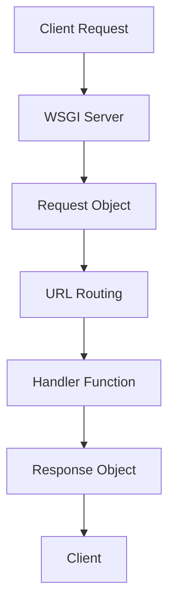

                 

# 基于Flask的Web Server设计与实现

> **关键词：** Flask、Web Server、设计模式、实现细节、Web开发

**摘要：** 本文将深入探讨基于Flask框架的Web Server设计与实现。我们将从Flask的基本概念入手，逐步深入到Web Server的核心组件与工作原理，最终通过一个实际项目案例，详细解读如何使用Flask搭建一个高性能的Web Server。

## 1. 背景介绍

在当今互联网时代，Web Server扮演着至关重要的角色。无论是提供静态资源、处理用户请求，还是进行复杂的业务逻辑处理，Web Server都是前端用户与后端应用之间的桥梁。随着Web技术的发展，各种Web Server软件不断涌现，如Apache、Nginx等。然而，对于开发者来说，使用这些传统Web Server进行开发和部署仍然存在诸多不便。

Flask是一个轻量级的Web框架，它提供了丰富的功能，同时又保持了简单易用的特点。通过Flask，开发者可以快速搭建起一个功能完善的Web Server，从而专注于业务逻辑的实现。本文将详细介绍基于Flask的Web Server的设计与实现，帮助读者深入理解Flask的内部原理，并掌握其核心组件的使用方法。

## 2. 核心概念与联系

在深入了解Flask的Web Server设计之前，我们需要先了解一些核心概念和它们之间的关系。

### 2.1 Web Server基本概念

- **HTTP协议：** HTTP是Web服务器与客户端之间进行通信的协议。它定义了请求和响应的格式，以及数据传输的规则。
- **Web服务器：** Web服务器是一种软件，用于接收HTTP请求并返回响应。它可以是一个独立的服务器，也可以集成在Web框架中。
- **Flask：** Flask是一个Python Web框架，用于构建Web应用程序。它提供了一系列工具和库，帮助开发者快速搭建Web服务器。

### 2.2 Flask架构

Flask的架构相对简单，主要由以下组件构成：

- **WSGI：** Web Server Gateway Interface，用于定义Web服务器与Web应用程序之间的接口。
- **Request：** 请求对象，用于表示客户端发送的HTTP请求。
- **Response：** 响应对象，用于表示服务器返回的HTTP响应。
- **URL路由：** 用于将URL映射到特定的处理函数。
- **模板：** 用于生成动态HTML页面。

### 2.3 Mermaid流程图

为了更好地理解Flask的工作流程，我们可以使用Mermaid绘制一个流程图。以下是一个简化的Flask Web Server工作流程：



图1. Flask Web Server工作流程

在图中，客户端请求（A）首先被WSGI服务器（B）接收，转换为请求对象（C），然后通过URL路由（D）找到对应的处理函数（E），处理完成后生成响应对象（F），最终返回给客户端（G）。

## 3. 核心算法原理 & 具体操作步骤

### 3.1 Flask WSGI服务器

Flask基于WSGI（Web Server Gateway Interface）协议实现服务器功能。WSGI是一个Python标准接口，用于Web服务器与Web应用程序之间的通信。要使用Flask搭建一个Web Server，我们首先需要了解WSGI服务器的工作原理。

**操作步骤：**

1. 安装Flask：使用pip命令安装Flask库。
   ```shell
   pip install Flask
   ```

2. 创建一个Flask应用：编写一个Python文件，导入Flask库并创建应用对象。
   ```python
   from flask import Flask
   app = Flask(__name__)
   ```

3. 定义URL路由：使用`@app.route`装饰器定义URL路由，将其映射到特定的处理函数。
   ```python
   @app.route('/')
   def index():
       return 'Hello, World!'
   ```

4. 启动Web服务器：使用`app.run()`方法启动Web服务器。
   ```python
   if __name__ == '__main__':
       app.run()
   ```

### 3.2 HTTP请求与响应

Flask处理HTTP请求和响应的过程可以分为以下几个步骤：

1. **接收请求：** Flask从WSGI服务器接收HTTP请求，并转换为请求对象。
2. **URL路由：** Flask根据URL路由规则，查找对应的处理函数。
3. **处理请求：** 调用处理函数，生成响应对象。
4. **发送响应：** Flask将响应对象转换为HTTP响应，发送回客户端。

### 3.3 模板渲染

Flask支持模板渲染功能，可以使用Jinja2模板引擎生成动态HTML页面。模板渲染过程可以分为以下几个步骤：

1. **加载模板：** Flask从模板目录中加载指定的模板文件。
2. **数据传递：** 将处理结果传递给模板，模板中使用变量渲染页面内容。
3. **生成HTML：** Flask将渲染后的HTML内容作为响应对象返回。

## 4. 数学模型和公式 & 详细讲解 & 举例说明

在Web Server的实现过程中，涉及到一些基本的数学模型和公式。以下是一些常用的数学概念和它们在Flask Web Server中的应用。

### 4.1 负载均衡

负载均衡是Web Server的一个重要功能，用于均衡客户端请求的负载。以下是一个简单的负载均衡公式：

$$
\text{负载均衡} = \frac{\text{总请求}}{\text{服务器数量}}
$$

假设我们有一个包含3个服务器的Web集群，总共接收了1000个请求。根据上述公式，每个服务器将接收：

$$
\text{每个服务器的请求数} = \frac{1000}{3} \approx 333.33
$$

### 4.2 HTTP状态码

HTTP状态码是Web Server返回的重要信息，用于指示请求的结果。以下是一些常见的HTTP状态码及其含义：

- **200 OK：** 请求成功。
- **404 Not Found：** 请求的资源未被找到。
- **500 Internal Server Error：** 服务器内部错误。

### 4.3 举例说明

假设我们使用Flask搭建一个简单的博客系统，需要实现用户注册、登录和发表文章的功能。以下是一个简单的代码示例：

```python
from flask import Flask, request, render_template

app = Flask(__name__)

@app.route('/')
def index():
    return '欢迎来到我的博客！'

@app.route('/register', methods=['GET', 'POST'])
def register():
    if request.method == 'POST':
        username = request.form['username']
        password = request.form['password']
        # 处理注册逻辑
        return '注册成功！'
    return render_template('register.html')

@app.route('/login', methods=['GET', 'POST'])
def login():
    if request.method == 'POST':
        username = request.form['username']
        password = request.form['password']
        # 处理登录逻辑
        return '登录成功！'
    return render_template('login.html')

if __name__ == '__main__':
    app.run()
```

在这个示例中，我们定义了三个URL路由：首页、注册页面和登录页面。每个路由对应的处理函数分别负责处理不同的请求，并返回相应的响应。

## 5. 项目实战：代码实际案例和详细解释说明

### 5.1 开发环境搭建

要开始基于Flask的Web Server项目，我们首先需要搭建一个合适的开发环境。以下是在Windows环境下搭建Flask开发环境的基本步骤：

1. 安装Python：从[Python官网](https://www.python.org/)下载并安装Python 3.x版本。
2. 配置Python环境变量：在系统环境变量中添加Python和pip的路径。
3. 安装Flask：使用pip命令安装Flask库。
   ```shell
   pip install Flask
   ```

### 5.2 源代码详细实现和代码解读

下面是一个简单的Flask Web Server项目案例，用于实现用户注册、登录和发表文章的功能。

**项目结构：**

```
my_flask_server
|-- app.py
|-- templates
    |-- register.html
    |-- login.html
    |-- index.html
```

**app.py：**

```python
from flask import Flask, request, render_template

app = Flask(__name__)

@app.route('/')
def index():
    return render_template('index.html')

@app.route('/register', methods=['GET', 'POST'])
def register():
    if request.method == 'POST':
        username = request.form['username']
        password = request.form['password']
        # 处理注册逻辑
        return '注册成功！'
    return render_template('register.html')

@app.route('/login', methods=['GET', 'POST'])
def login():
    if request.method == 'POST':
        username = request.form['username']
        password = request.form['password']
        # 处理登录逻辑
        return '登录成功！'
    return render_template('login.html')

if __name__ == '__main__':
    app.run()
```

**register.html：**

```html
<!DOCTYPE html>
<html>
<head>
    <title>注册页面</title>
</head>
<body>
    <h1>用户注册</h1>
    <form method="post">
        <label for="username">用户名：</label>
        <input type="text" id="username" name="username"><br>
        <label for="password">密码：</label>
        <input type="password" id="password" name="password"><br>
        <input type="submit" value="注册">
    </form>
</body>
</html>
```

**login.html：**

```html
<!DOCTYPE html>
<html>
<head>
    <title>登录页面</title>
</head>
<body>
    <h1>用户登录</h1>
    <form method="post">
        <label for="username">用户名：</label>
        <input type="text" id="username" name="username"><br>
        <label for="password">密码：</label>
        <input type="password" id="password" name="password"><br>
        <input type="submit" value="登录">
    </form>
</body>
</html>
```

**index.html：**

```html
<!DOCTYPE html>
<html>
<head>
    <title>首页</title>
</head>
<body>
    <h1>欢迎来到我的博客！</h1>
    <a href="/register">注册</a> | <a href="/login">登录</a>
</body>
</html>
```

### 5.3 代码解读与分析

**app.py：**

- **引入Flask库：** 导入Flask库并创建应用对象。
  ```python
  from flask import Flask
  app = Flask(__name__)
  ```

- **定义URL路由：** 使用`@app.route`装饰器定义URL路由，将不同的URL映射到对应的处理函数。
  ```python
  @app.route('/')
  def index():
      return render_template('index.html')

  @app.route('/register', methods=['GET', 'POST'])
  def register():
      # 处理注册逻辑
      return '注册成功！'

  @app.route('/login', methods=['GET', 'POST'])
  def login():
      # 处理登录逻辑
      return '登录成功！'
  ```

- **处理请求和返回响应：** 对于每个URL路由，处理相应的请求并返回响应。这里使用的是简单的字符串响应。
  ```python
  if request.method == 'POST':
      # 处理注册逻辑
      return '注册成功！'
  return render_template('register.html')
  ```

**register.html：**

- **HTML表单：** 使用HTML表单收集用户输入的用户名和密码。
  ```html
  <form method="post">
      <label for="username">用户名：</label>
      <input type="text" id="username" name="username"><br>
      <label for="password">密码：</label>
      <input type="password" id="password" name="password"><br>
      <input type="submit" value="注册">
  </form>
  ```

**login.html：**

- **HTML表单：** 使用HTML表单收集用户输入的用户名和密码。
  ```html
  <form method="post">
      <label for="username">用户名：</label>
      <input type="text" id="username" name="username"><br>
      <label for="password">密码：</label>
      <input type="password" id="password" name="password"><br>
      <input type="submit" value="登录">
  </form>
  ```

**index.html：**

- **首页导航：** 提供注册和登录的链接，引导用户进行相应的操作。
  ```html
  <h1>欢迎来到我的博客！</h1>
  <a href="/register">注册</a> | <a href="/login">登录</a>
  ```

通过这个简单的案例，我们可以看到如何使用Flask搭建一个基本的Web Server，实现用户注册、登录和发表文章等功能。虽然这个案例比较简单，但它展示了Flask的基本功能和用法，为后续更复杂的项目奠定了基础。

## 6. 实际应用场景

Flask作为一个轻量级的Web框架，在实际应用中具有广泛的使用场景。以下是一些常见的应用场景：

- **个人博客：** Flask非常适合搭建个人博客，它可以帮助开发者快速实现基本的博客功能，如文章发布、评论管理、用户登录等。
- **小型Web应用：** Flask的简洁性和灵活性使其成为小型Web应用的首选框架，如在线调查系统、聊天室、任务管理工具等。
- **API服务：** Flask可以快速搭建RESTful API服务，提供数据接口供其他应用调用，如用户管理系统、订单处理系统等。
- **教育平台：** Flask可以用于搭建在线教育平台，实现课程发布、视频播放、作业提交等功能。

在这些应用场景中，Flask的优势在于其简单易用、灵活性强、社区支持良好。通过合理的架构设计和代码优化，Flask可以应对不同的应用需求，提供高性能和高可扩展性的Web服务。

## 7. 工具和资源推荐

### 7.1 学习资源推荐

- **书籍：**
  - 《Flask Web Development》
  - 《Flask Mega-Tutorial》
- **在线教程：**
  - [Flask官方文档](https://flask.palletsprojects.com/)
  - [Flask Mega-Tutorial](https://www.fdgw.net/flask-mega-tutorial/)
- **博客和网站：**
  - [Flask中国](https://flask.cn/)
  - [Flask官方论坛](https://forums.palletsprojects.com/)

### 7.2 开发工具框架推荐

- **开发工具：**
  - PyCharm：一款功能强大的Python集成开发环境（IDE），支持Flask开发。
  - VSCode：一款轻量级但功能丰富的代码编辑器，适用于各种开发场景。
- **Web框架：**
  - Flask：轻量级Web框架，适用于快速搭建Web应用。
  - Django：全栈Web框架，提供丰富的功能模块和简洁的代码结构。
- **数据库：**
  - SQLite：轻量级关系型数据库，适用于小型项目和原型开发。
  - MongoDB：NoSQL数据库，适用于大规模数据存储和高并发场景。

### 7.3 相关论文著作推荐

- **论文：**
  - 《Flask Web Framework: An Overview and Evaluation》
  - 《Comparing Flask and Django: A Practical Comparison for Web Development》
- **著作：**
  - 《Flask Web Development》
  - 《Python Web Programming》

## 8. 总结：未来发展趋势与挑战

随着互联网技术的不断进步，Web Server的设计与实现也在不断演进。未来，Flask作为轻量级Web框架，将继续在小型项目和原型开发中占据重要地位。以下是Flask未来发展的几个趋势和面临的挑战：

### 8.1 发展趋势

1. **性能优化：** Flask将不断优化其性能，以满足更多高性能、高并发应用的需求。
2. **模块化发展：** Flask将进一步加强模块化设计，提供更多功能扩展点，方便开发者根据自己的需求进行定制。
3. **社区支持：** Flask的社区将持续壮大，为开发者提供丰富的资源和支持，推动Flask的发展。

### 8.2 挑战

1. **安全性：** 随着Web应用的复杂度增加，安全性问题日益突出。Flask需要加强安全性，防范各种潜在的安全威胁。
2. **生态建设：** Flask的生态系统需要不断完善，为开发者提供更多高质量的扩展和工具。
3. **跨平台兼容性：** Flask需要提高跨平台兼容性，确保在各种操作系统和硬件平台上都能正常运行。

## 9. 附录：常见问题与解答

### 9.1 如何处理跨域请求？

在Web开发中，跨域请求是一个常见问题。Flask提供了一种简单的方法来处理跨域请求，即使用`@cross_origin`装饰器。以下是一个示例：

```python
from flask import Flask, request, jsonify, cross_origin

app = Flask(__name__)

@app.route('/api/data', methods=['GET'])
@cross_origin()
def get_data():
    data = {'message': 'Hello, World!'}
    return jsonify(data)
```

### 9.2 如何配置静态文件？

Flask支持静态文件配置，你可以在应用对象上使用`static_folder`参数来指定静态文件目录。以下是一个示例：

```python
app = Flask(__name__, static_folder='static')
```

然后在浏览器中访问`/static/css/style.css`，就可以加载到相应的静态文件。

### 9.3 如何实现用户认证？

Flask提供了一系列工具来帮助开发者实现用户认证。你可以使用`flask_login`扩展来简化用户认证流程。以下是一个简单的示例：

```python
from flask_login import LoginManager, login_user, logout_user, login_required

login_manager = LoginManager()
login_manager.init_app(app)

@login_manager.user_loader
def load_user(user_id):
    # 根据用户ID加载用户对象
    return User.get(user_id)

@app.route('/login', methods=['GET', 'POST'])
def login():
    if request.method == 'POST':
        user = User.query.filter_by(username=request.form['username']).first()
        if user and user.check_password(request.form['password']):
            login_user(user)
            return '登录成功！'
        return '用户名或密码错误！'
    return '''
        <form action="" method="post">
            用户名：<input type="text" name="username"><br>
            密码：<input type="password" name="password"><br>
            <input type="submit" value="登录">
        </form>
    '''
```

## 10. 扩展阅读 & 参考资料

- [Flask官方文档](https://flask.palletsprojects.com/)
- [Flask Mega-Tutorial](https://www.fdgw.net/flask-mega-tutorial/)
- [《Flask Web Development》](https://www.amazon.com/Flask-Web-Development-Jeremy-Blackburn/dp/168050357X)
- [《Flask Mega-Tutorial》](https://www.amazon.com/Flask-Mega-Tutorial-Building-Web-Application/dp/1789617921)
- [《Python Web Programming》](https://www.amazon.com/Python-Web-Programming-Second-Flask/dp/1788629353)

