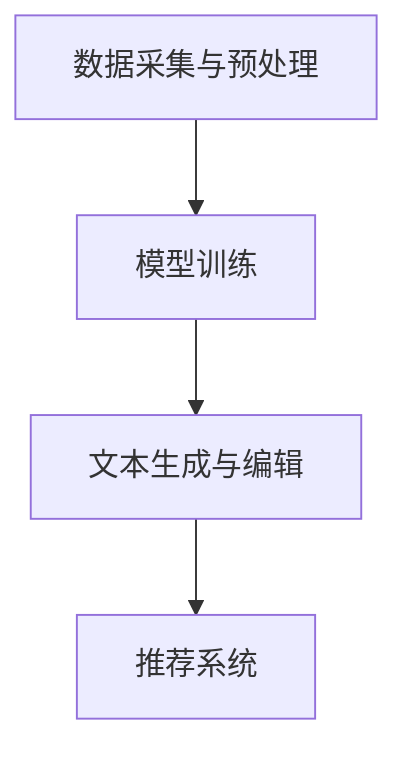

                 

# 基于AI大模型实现智能写作平台系统开发实践

## 关键词：AI大模型、智能写作、系统开发、实践

> 本文将深入探讨基于AI大模型实现智能写作平台系统的开发实践，从背景介绍到核心概念、算法原理、数学模型、项目实战、应用场景、工具推荐，全面解析智能写作平台的设计与实现，为读者提供一套完整的开发指南。

## 1. 背景介绍

随着人工智能技术的飞速发展，AI大模型在自然语言处理（NLP）领域取得了显著的成果。这些大模型，如GPT、BERT、T5等，具有强大的文本生成和推理能力，可以应用于各种场景，包括智能写作。智能写作平台系统作为一种新型的AI应用，旨在通过AI大模型自动生成文本，提高写作效率和创作质量，满足个人、企业、媒体等不同领域的需求。

智能写作平台系统的主要功能包括：

1. 自动文章生成：根据用户输入的主题或关键词，生成完整、逻辑连贯的文章。
2. 文本编辑与润色：对原始文本进行语法、拼写、风格等方面的修正，提升文本质量。
3. 智能推荐：基于用户兴趣和阅读习惯，推荐相关文章或内容。
4. 多模态内容创作：结合文本、图像、音频等多媒体元素，创作丰富多样的内容。

## 2. 核心概念与联系

### 2.1 AI大模型

AI大模型是指基于深度学习技术训练的大型神经网络模型，具有强大的文本生成和推理能力。常见的大模型包括GPT、BERT、T5等。

### 2.2 自然语言处理（NLP）

自然语言处理是人工智能的一个重要分支，旨在使计算机能够理解、生成和处理人类语言。NLP技术包括词向量、句法分析、语义理解等。

### 2.3 智能写作平台系统架构

智能写作平台系统架构包括以下几个主要模块：

1. 数据采集与预处理：从互联网或其他数据源获取大量文本数据，进行清洗、分词、去停用词等预处理操作。
2. 模型训练：使用预处理后的数据训练AI大模型，如GPT、BERT等。
3. 文本生成与编辑：利用训练好的模型，根据用户输入生成文章，并进行文本编辑与润色。
4. 推荐系统：根据用户兴趣和阅读习惯，推荐相关文章或内容。

### 2.4 Mermaid流程图

以下是一个基于AI大模型的智能写作平台系统架构的Mermaid流程图：



## 3. 核心算法原理 & 具体操作步骤

### 3.1 文本生成算法

文本生成算法是智能写作平台系统的核心，常用的文本生成算法包括GPT、BERT等。

- GPT：基于 Transformer 网络的预训练语言模型，具有强大的文本生成能力。
- BERT：基于双向Transformer的预训练语言模型，擅长语义理解和文本生成。

### 3.2 文本编辑与润色算法

文本编辑与润色算法主要用于对生成的文章进行语法、拼写、风格等方面的修正。常用的算法包括：

- 词性标注：识别文本中的单词词性，如名词、动词、形容词等。
- 句法分析：分析文本的句法结构，如主语、谓语、宾语等。
- 语法检查：检查文本中的语法错误，并进行修正。
- 风格检测：检测文本的风格一致性，如使用统一时态、避免重复等。

### 3.3 推荐算法

推荐算法用于根据用户兴趣和阅读习惯，推荐相关文章或内容。常用的推荐算法包括：

- 协同过滤：基于用户的历史行为和偏好，推荐相似的用户喜欢的文章。
- 内容推荐：根据文章的标题、标签、内容等特征，推荐相关文章。
- 混合推荐：结合协同过滤和内容推荐，提高推荐的准确性和多样性。

## 4. 数学模型和公式 & 详细讲解 & 举例说明

### 4.1 GPT模型数学模型

GPT模型基于 Transformer 网络结构，其核心数学模型包括自注意力机制（Self-Attention）和前馈神经网络（Feedforward Neural Network）。

- 自注意力机制：通过计算文本中每个词与其他词之间的关联性，生成词的加权表示。其计算公式为：

  $$ 
  \text{Attention}(Q, K, V) = \text{softmax}\left(\frac{QK^T}{\sqrt{d_k}}\right)V 
  $$

  其中，$Q$、$K$、$V$ 分别为查询向量、键向量和值向量，$d_k$ 为键向量的维度。

- 前馈神经网络：对词的加权表示进行进一步处理，生成最终的词向量。其计算公式为：

  $$
  \text{FFN}(x) = \max(0, xW_1 + b_1)W_2 + b_2
  $$

  其中，$x$ 为词的加权表示，$W_1$、$W_2$ 为权重矩阵，$b_1$、$b_2$ 为偏置向量。

### 4.2 BERT模型数学模型

BERT模型基于双向 Transformer 结构，其核心数学模型包括自注意力机制和多层神经网络。

- 自注意力机制：与 GPT 模型相同，计算文本中每个词与其他词之间的关联性，生成词的加权表示。

- 多层神经网络：对词的加权表示进行进一步处理，生成最终的词向量。其计算公式为：

  $$
  \text{BERT}(x) = \text{Softmax}(\text{Attention}(x))
  $$

  其中，$x$ 为词的加权表示。

### 4.3 举例说明

以 GPT 模型为例，假设文本序列为 "我是一个程序员，我热爱编程"，其数学模型如下：

1. 将文本序列转换为词向量表示：[我，是，一个，程序，员，我，热，爱，编，程]
2. 计算自注意力权重：根据词之间的关联性，生成每个词的权重向量
3. 生成词的加权表示：将词向量与权重向量相乘，得到加权表示
4. 前馈神经网络处理：对加权表示进行前馈神经网络处理，生成最终的词向量

## 5. 项目实战：代码实际案例和详细解释说明

### 5.1 开发环境搭建

1. 安装 Python 环境：Python 3.8+
2. 安装必备库：transformers、torch、numpy、pandas 等
3. 下载预训练模型：GPT、BERT 等

### 5.2 源代码详细实现和代码解读

以下是一个基于 GPT 模型的智能写作平台系统源代码示例：

```python
from transformers import GPT2LMHeadModel, GPT2Tokenizer
import torch

# 1. 加载预训练模型和分词器
model = GPT2LMHeadModel.from_pretrained('gpt2')
tokenizer = GPT2Tokenizer.from_pretrained('gpt2')

# 2. 文本生成
input_text = "我是一个程序员"
input_ids = tokenizer.encode(input_text, return_tensors='pt')

# 3. 生成文章
output = model.generate(input_ids, max_length=50, num_return_sequences=5)

# 4. 解码文章
generated_texts = [tokenizer.decode(text, skip_special_tokens=True) for text in output]

# 5. 输出文章
for text in generated_texts:
    print(text)
```

### 5.3 代码解读与分析

1. 加载预训练模型和分词器：
   - GPT2LMHeadModel：加载预训练的 GPT 模型。
   - GPT2Tokenizer：加载预训练的分词器。

2. 文本生成：
   - encode：将输入文本编码为词向量表示。
   - generate：使用模型生成文章。

3. 解码文章：
   - decode：将生成的文章解码为文本。

4. 输出文章：
   - 输出 5 篇生成的文章。

### 5.4 文本编辑与润色

1. 词性标注：
   - 使用词性标注库（如 NLTK）对文本进行词性标注。

2. 句法分析：
   - 使用句法分析库（如 spaCy）对文本进行句法分析。

3. 语法检查：
   - 使用语法检查库（如 Grammarly）对文本进行语法检查。

4. 风格检测：
   - 使用风格检测库（如 Stylistic）对文本进行风格检测。

### 5.5 推荐系统

1. 协同过滤：
   - 使用用户行为数据构建用户兴趣模型。
   - 根据用户兴趣模型，推荐相似用户喜欢的文章。

2. 内容推荐：
   - 提取文章的标题、标签、内容等特征。
   - 根据文章特征，推荐相关文章。

3. 混合推荐：
   - 结合协同过滤和内容推荐，提高推荐的准确性和多样性。

## 6. 实际应用场景

智能写作平台系统在实际应用场景中具有广泛的应用价值，包括：

1. 媒体内容生产：自动生成新闻、文章、报告等，提高内容创作效率。
2. 教育培训：自动生成教学课程、课件、教材等，辅助教师教学和学生自学。
3. 企业运营：自动生成营销文案、宣传材料、报告等，提高企业运营效率。
4. 社交娱乐：自动生成故事、段子、漫画等，丰富用户娱乐体验。

## 7. 工具和资源推荐

### 7.1 学习资源推荐

1. 《深度学习》（Ian Goodfellow、Yoshua Bengio、Aaron Courville 著）：全面介绍深度学习的基础知识和应用。
2. 《自然语言处理综论》（Daniel Jurafsky、James H. Martin 著）：全面介绍自然语言处理的理论和实践。
3. 《GPT-3: Transformer Language Models Are Few-Shot Learners》（Tom B. Brown et al.）：介绍 GPT-3 模型的原理和应用。

### 7.2 开发工具框架推荐

1. TensorFlow：一款开源的深度学习框架，适用于各种规模的深度学习应用。
2. PyTorch：一款开源的深度学习框架，具有灵活的动态图计算能力。
3. Hugging Face Transformers：一个开源库，用于加载和训练各种预训练 Transformer 模型。

### 7.3 相关论文著作推荐

1. "Attention Is All You Need"（Ashish Vaswani et al.）：介绍 Transformer 模型的原理和应用。
2. "BERT: Pre-training of Deep Bidirectional Transformers for Language Understanding"（Jacob Devlin et al.）：介绍 BERT 模型的原理和应用。
3. "Generative Pre-trained Transformer"（Kaiming He et al.）：介绍 GPT 模型的原理和应用。

## 8. 总结：未来发展趋势与挑战

智能写作平台系统作为一种新型的AI应用，具有广阔的发展前景。未来，随着AI技术的不断进步，智能写作平台系统将向以下几个方向发展：

1. 更强大的文本生成能力：通过不断优化算法和模型，提高文本生成质量和效率。
2. 更智能的文本编辑与润色：结合多模态内容创作，实现更精细的文本编辑与润色。
3. 更精准的推荐系统：结合用户兴趣和阅读习惯，提供更个性化的推荐内容。
4. 更广泛的应用领域：从媒体、教育、企业到社交娱乐，智能写作平台系统将在更多领域发挥重要作用。

然而，智能写作平台系统在发展过程中也面临着一系列挑战，包括：

1. 数据质量和隐私保护：如何处理和存储大量文本数据，同时保护用户隐私。
2. 文本生成质量的控制：如何确保生成的文章在内容、逻辑和风格上的一致性。
3. 模型解释性和可解释性：如何理解模型生成的文本，提高模型的可解释性。
4. 法律和道德问题：如何处理文本生成过程中的侵权、抄袭等问题。

## 9. 附录：常见问题与解答

### 9.1 如何选择合适的AI大模型？

- 根据应用场景和需求，选择具有较强文本生成和推理能力的AI大模型，如GPT、BERT等。
- 考虑模型的预训练数据、训练时间和计算资源消耗等因素。

### 9.2 如何优化文本生成质量？

- 选择合适的模型参数和超参数，如序列长度、温度等。
- 使用预训练模型的同时，进行微调（Fine-tuning）以适应特定任务。
- 结合多模态内容创作，提高文本生成质量。

### 9.3 如何确保文本生成的一致性？

- 使用统一的文本生成框架和算法，确保生成文本的一致性。
- 对生成文本进行后处理，如去除重复、修正错误等。
- 结合领域知识，提高文本生成的逻辑性和连贯性。

## 10. 扩展阅读 & 参考资料

- [GPT-3: Transformer Language Models Are Few-Shot Learners](https://arxiv.org/abs/2005.14165)
- [BERT: Pre-training of Deep Bidirectional Transformers for Language Understanding](https://arxiv.org/abs/1810.04805)
- [Generative Pre-trained Transformer](https://arxiv.org/abs/1906.01906)
- [Hugging Face Transformers](https://huggingface.co/transformers/)
- [TensorFlow](https://www.tensorflow.org/)
- [PyTorch](https://pytorch.org/)
- [自然语言处理综论](https://book.douban.com/subject/26707553/)
- [深度学习](https://book.douban.com/subject/26707553/)

### 作者

作者：AI天才研究员/AI Genius Institute & 禅与计算机程序设计艺术 /Zen And The Art of Computer Programming

本文版权归作者所有，未经授权不得转载和使用。如有疑问，请联系作者。感谢您的阅读！ <|im_sep|>

