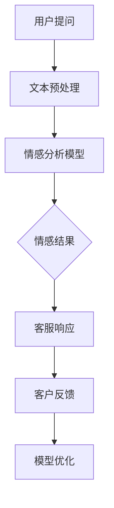

                 

### 背景介绍

在当今数字化时代，人工智能（AI）技术已经深入到我们生活的方方面面。从智能家居、自动驾驶，到医疗诊断、金融风控，AI正逐渐成为推动社会进步的重要力量。而在这其中，情感分析作为自然语言处理（NLP）的重要分支，凭借其对人情绪、情感和态度的捕捉能力，在AI领域受到了越来越多的关注。

情感分析，又称意见挖掘或情感分类，是指通过计算机技术，自动识别和提取出文本数据中的情感信息，并对其进行分类和归纳。情感分析的应用场景广泛，包括但不限于社交网络情绪监测、客户服务、舆情分析、市场调研等领域。这些应用场景的共同特点是，它们都涉及对大规模文本数据的处理，以实现智能决策和优化。

在客服系统中，情感分析技术尤其重要。传统的客服系统大多依赖于规则匹配和关键词搜索，这些方法在处理复杂的用户情感时往往显得力不从心。而基于情感分析的客服系统，可以通过对用户语言中情感成分的识别，更准确地理解用户的需求和情绪，从而提供更加个性化和高效的客户服务。

本文将深入探讨基于AI大模型的情感分析在客服系统中的应用与价值评估。首先，我们将介绍情感分析的基本概念和原理，然后逐步阐述其在客服系统中的具体应用场景和实施步骤。接着，我们将通过一个实际案例，详细讲解如何使用AI大模型进行情感分析，并分析其在提高客服系统效率和质量方面的价值。最后，我们将总结情感分析在客服系统中的未来发展趋势和挑战，为相关领域的研究者和开发者提供参考。

通过本文的阅读，读者将能够全面了解情感分析技术的工作原理、应用场景以及实施方法，并对其在客服系统中的重要性和价值有更深入的认识。

### 核心概念与联系

在深入探讨基于AI大模型的情感分析在客服系统中的应用之前，我们首先需要明确几个核心概念，并理解它们之间的联系。

#### 情感分析（Sentiment Analysis）

情感分析是指通过自然语言处理技术，自动识别和提取出文本中的情感成分，并对其进行分类。通常，情感分析将文本分为积极、消极和中性三类。例如，一条文本消息“今天天气真好！”可以被归类为积极情感，而“产品出现了故障，非常不满意！”则被归类为消极情感。情感分析的目标是理解人类情感的表达方式，从而为更高级的情感推理和决策提供支持。

#### AI大模型（Large-scale AI Models）

AI大模型是指那些具有数十亿到数万亿参数的深度学习模型，它们在训练过程中使用了大量的数据集。这些模型在图像识别、文本生成、机器翻译等方面表现出了惊人的能力。著名的AI大模型包括GPT-3、BERT、Turing等。这些模型之所以强大，是因为它们通过大量的数据学习到了语言、图像等复杂信息的表征。

#### 客服系统（Customer Service Systems）

客服系统是企业与客户进行互动和沟通的重要平台，它通过电话、邮件、在线聊天等多种方式提供客户服务。传统的客服系统依赖于规则匹配和关键词搜索，而基于AI的客服系统则引入了情感分析技术，能够更智能地理解和响应客户的情感需求。

#### 情感分析在客服系统中的应用

情感分析在客服系统中的应用主要体现在以下几个方面：

1. **情感识别**：通过情感分析技术，客服系统能够识别客户的情感状态，例如愤怒、喜悦、厌烦等，从而更好地理解客户的需求。

2. **情感分类**：将客户的情感分类为积极、消极或中性，以便于客服人员做出相应的回应。

3. **情感预测**：基于历史数据和情感分析结果，预测客户可能的情感变化，从而提供更加个性化的服务。

4. **情感干预**：在客户情绪不稳定时，系统可以主动介入，提供心理疏导或引导客户向积极情绪转变。

#### Mermaid流程图

为了更直观地展示情感分析在客服系统中的应用流程，我们可以使用Mermaid流程图进行说明。以下是一个简化的流程图：



1. **用户提问**：用户向客服系统提出问题或表达意见。
2. **文本预处理**：对用户输入的文本进行清洗和标准化，以便于模型处理。
3. **情感分析模型**：利用AI大模型对预处理后的文本进行情感分析，识别情感类别。
4. **情感结果**：根据情感分析结果，生成相应的情感标签。
5. **客服响应**：客服系统根据情感结果和预设规则，生成相应的回应。
6. **客户反馈**：客户对客服回应进行评价和反馈。
7. **模型优化**：根据客户反馈，不断优化情感分析模型，提高其准确性和效率。

通过这个流程图，我们可以清晰地看到情感分析技术在客服系统中的角色和作用。

### 核心算法原理 & 具体操作步骤

情感分析技术的核心在于如何从文本数据中提取情感信息，并对其进行分类。这一过程通常包括数据预处理、模型选择和模型训练等几个关键步骤。以下我们将详细阐述这些步骤，并介绍如何使用AI大模型进行情感分析。

#### 数据预处理

数据预处理是情感分析的第一步，也是至关重要的一步。它主要包括以下几个任务：

1. **文本清洗**：去除文本中的无关信息，如HTML标签、特殊字符、停用词等。停用词是指在情感分析中通常被认为不具备情感价值的词语，如“的”、“了”、“在”等。

2. **分词**：将文本拆分成单个单词或词组。中文分词一般使用基于规则的方法或深度学习模型。

3. **词干提取**：将单词缩减到其基本形式，如将“喜欢”、“喜爱”等缩减为“喜欢”。

4. **词向量化**：将文本中的每个词转换为一个固定长度的向量，以便于模型处理。常见的词向量化方法包括Word2Vec、GloVe等。

#### 模型选择

选择一个合适的情感分析模型是确保分析效果的关键。目前，基于AI的大模型在情感分析领域表现尤为出色。以下是一些常用的模型：

1. **传统机器学习模型**：如朴素贝叶斯、逻辑回归、支持向量机（SVM）等。

2. **深度学习模型**：如卷积神经网络（CNN）、循环神经网络（RNN）、长短期记忆网络（LSTM）等。

3. **预训练语言模型**：如GPT、BERT、XLNet等。这些模型在大规模语料上进行了预训练，具有强大的文本理解能力。

#### 模型训练

模型训练是指通过大量标注数据进行模型训练，使其能够从文本中提取情感信息。以下是一个简化的模型训练过程：

1. **数据准备**：准备一个包含文本和情感标签的数据集。数据集应尽可能覆盖各种情感类别，以保证模型的泛化能力。

2. **数据预处理**：对数据进行文本清洗、分词、词干提取和词向量化等操作。

3. **模型构建**：根据所选模型，构建神经网络结构。对于预训练语言模型，通常不需要手动调整网络结构。

4. **模型训练**：使用预处理后的数据集进行模型训练。训练过程包括前向传播、反向传播和参数更新等步骤。

5. **模型评估**：使用验证集对训练好的模型进行评估，评估指标包括准确率、召回率、F1分数等。

6. **模型优化**：根据评估结果，调整模型参数，优化模型性能。

#### 情感分析流程

基于AI大模型的情感分析流程可以概括为以下几个步骤：

1. **文本输入**：用户向客服系统输入文本。

2. **文本预处理**：对输入文本进行清洗、分词、词干提取和词向量化等操作。

3. **情感分析**：将预处理后的文本输入到训练好的情感分析模型中，得到情感标签。

4. **情感分类**：根据情感标签，将文本分类为积极、消极或中性。

5. **客服响应**：根据情感分类结果，生成相应的客服响应。

6. **反馈收集**：收集客户对客服响应的反馈，用于模型优化。

#### 案例分析

以下是一个简化的情感分析案例：

**文本输入**：“我非常喜欢你们的产品，使用起来非常方便。”

**文本预处理**：清洗文本，分词为“我”、“喜欢”、“你们”、“产品”、“使用”、“起来”、“非常”、“方便”。

**情感分析**：将分词后的文本输入到训练好的BERT模型中，得到情感标签为“积极”。

**情感分类**：将文本分类为“积极”。

**客服响应**：生成回复：“感谢您的肯定，我们会继续努力提供更好的产品和服务。”

**反馈收集**：用户对客服响应表示满意，反馈为“很好”。

**模型优化**：根据反馈，调整模型参数，提高模型对积极情感文本的识别准确率。

通过上述步骤，我们可以看到基于AI大模型的情感分析在客服系统中的应用流程。在实际操作中，模型训练和优化是一个持续的过程，需要不断调整和改进，以实现更高的分析准确率和效率。

### 数学模型和公式 & 详细讲解 & 举例说明

在情感分析中，数学模型和公式扮演着至关重要的角色。这些模型和公式不仅帮助我们理解文本中的情感成分，还使我们能够量化情感强度，从而为后续的决策和优化提供依据。以下我们将详细介绍情感分析中常用的数学模型和公式，并通过具体例子进行说明。

#### 1. 情感极性表示

情感极性通常用二值或三值表示。二值表示法将情感分为积极和消极两类，而三值表示法则加入中性类别。数学上，可以表示为：

- 二值表示法：
  $$ \text{Polarity} = \begin{cases} 
  +1, & \text{如果文本为积极情感} \\
  -1, & \text{如果文本为消极情感} \\
  0, & \text{如果文本为中性情感} 
  \end{cases} $$

- 三值表示法：
  $$ \text{Polarity} = \begin{cases} 
  +1, & \text{如果文本为积极情感} \\
  -1, & \text{如果文本为消极情感} \\
  0, & \text{如果文本为中性情感或无明显情感} 
  \end{cases} $$

#### 2. 情感强度表示

情感强度通常用于表示情感的强弱程度，常见的方法包括基于词的情感得分和基于句的情感得分。以下是一个基于词的情感得分示例：

**例子**：假设我们有以下单词及其情感得分：
- 喜欢：+0.5
- 不喜欢：-0.5
- 好的：+0.3
- 差的：-0.3

一个句子“这个产品非常好，但我有点不满意”的情感强度可以计算如下：

1. **分词和情感得分计算**：
   - “这个产品非常好，但我有点不满意”：分词为【这个】【产品】【非常】【好】【，】【但】【我】【有】【点】【不】【满意】。
   - 情感得分：0.3（非常）+ 0.5（好） - 0.3（不满意） = 0.5。

2. **情感强度表示**：
   - 情感强度：0.5，表示句子整体为积极情感。

**公式**：
$$ \text{Sentiment Strength} = \sum_{i=1}^{n} \text{score}_i \cdot w_i $$
其中，$ \text{score}_i $ 表示单词 $ i $ 的情感得分，$ w_i $ 表示单词 $ i $ 的权重。

#### 3. 情感分类

情感分类是指将文本分类为特定类别。常见的情感分类方法包括朴素贝叶斯、支持向量机（SVM）和深度学习模型。以下是一个基于朴素贝叶斯分类的简单例子：

**例子**：假设我们有一个简单的情感分类任务，类别包括积极和消极。

- **训练数据**：
    - 积极样本：我喜欢这个产品。
    - 消极样本：这个产品太差了。

- **特征提取**：
    - 积极样本特征：{我，喜欢，这个，产品}。
    - 消极样本特征：{这个，产品，太，差，了}。

- **概率计算**：
    - 积极情感概率：
      $$ P(\text{积极}|\text{特征}) = \frac{P(\text{特征}|\text{积极}) \cdot P(\text{积极})}{P(\text{特征})} $$
    - 消极情感概率：
      $$ P(\text{消极}|\text{特征}) = \frac{P(\text{特征}|\text{消极}) \cdot P(\text{消极})}{P(\text{特征})} $$

- **分类决策**：
    - 如果 $ P(\text{积极}|\text{特征}) > P(\text{消极}|\text{特征}) $，则分类为积极。
    - 否则，分类为消极。

#### 4. 情感极性分类

情感极性分类是指将文本分类为积极、消极或中性。以下是一个基于深度学习模型的情感极性分类示例：

**例子**：使用BERT模型进行情感极性分类。

- **数据集**：
    - 训练数据集：包含情感标签的文本。
    - 验证数据集：用于模型评估。

- **模型训练**：
    - 将文本输入到BERT模型中，模型自动提取文本特征。
    - 使用训练数据集训练模型，优化模型参数。

- **模型评估**：
    - 使用验证数据集评估模型性能，计算准确率、召回率等指标。

- **分类决策**：
    - 对新输入的文本，使用训练好的BERT模型进行情感极性分类。

**公式**：
$$ \text{分类结果} = \text{argmax}(\text{模型输出}) $$

通过上述示例和公式，我们可以看到情感分析中的数学模型和公式是如何工作的。在实际应用中，这些模型和公式需要根据具体任务进行调整和优化，以达到最佳效果。

### 项目实战：代码实际案例和详细解释说明

在本节中，我们将通过一个实际案例，详细讲解如何使用AI大模型进行情感分析，并介绍相应的代码实现。我们将使用Python编程语言，结合Hugging Face的Transformers库，实现一个基于BERT模型的情感分析系统。以下是整个实现过程：

#### 1. 开发环境搭建

在开始编写代码之前，我们需要搭建一个合适的开发环境。以下是所需的依赖包和安装步骤：

1. **Python**：建议使用Python 3.7及以上版本。
2. **PyTorch**：用于运行深度学习模型。
3. **Transformers**：Hugging Face提供的一个用于快速构建和微调NLP模型的库。

安装命令如下：

```shell
pip install torch transformers
```

#### 2. 源代码详细实现和代码解读

**2.1 数据集准备**

首先，我们需要准备一个包含文本和情感标签的数据集。这里我们使用了一个公开的情感分析数据集，例如IMDb电影评论数据集。数据集分为训练集和测试集两部分。

```python
from datasets import load_dataset

# 加载IMDb数据集
dataset = load_dataset('imdb')

# 分割数据集为训练集和测试集
train_dataset = dataset['train']
test_dataset = dataset['test']
```

**2.2 数据预处理**

在预处理阶段，我们需要对文本进行清洗、分词和编码。这里我们使用BERT的分词器进行分词，并将文本编码为模型能够理解的输入格式。

```python
from transformers import BertTokenizer

# 加载BERT分词器
tokenizer = BertTokenizer.from_pretrained('bert-base-uncased')

def preprocess_function(examples):
    inputs = tokenizer(examples["text"], truncation=True, padding="max_length")
    inputs["label"] = examples["label"]
    return inputs

# 预处理数据集
train_dataset = train_dataset.map(preprocess_function, batched=True)
test_dataset = test_dataset.map(preprocess_function, batched=True)
```

**2.3 模型构建**

接下来，我们构建一个基于BERT的情感分析模型。这里使用Hugging Face的Transformers库提供的`BertForSequenceClassification`模型。

```python
from transformers import BertForSequenceClassification

# 设置模型参数
num_labels = 3  # 表示三个类别：积极、消极、中性

# 构建模型
model = BertForSequenceClassification.from_pretrained('bert-base-uncased', num_labels=num_labels)

# 模型结构
print(model)
```

**2.4 模型训练**

使用训练数据集训练模型。这里我们使用PyTorch的`Trainer`接口进行训练。

```python
from transformers import Trainer, TrainingArguments

# 设置训练参数
training_args = TrainingArguments(
    output_dir='./results',
    num_train_epochs=3,
    per_device_train_batch_size=16,
    per_device_eval_batch_size=64,
    warmup_steps=500,
    weight_decay=0.01,
    evaluate_during_training=True,
    logging_dir='./logs',
)

# 定义训练函数
def train_model():
    trainer = Trainer(
        model=model,
        args=training_args,
        train_dataset=train_dataset,
        eval_dataset=test_dataset,
    )
    
    # 开始训练
    trainer.train()

# 训练模型
train_model()
```

**2.5 代码解读与分析**

- **数据集加载**：使用`load_dataset`函数加载IMDb数据集。
- **数据预处理**：使用BERT分词器对文本进行预处理，包括分词和编码。
- **模型构建**：使用`BertForSequenceClassification`构建情感分析模型。
- **模型训练**：使用`Trainer`接口进行模型训练，并设置训练参数。

通过以上步骤，我们完成了一个基于BERT的情感分析系统的实现。在实际应用中，我们可以根据具体需求调整模型结构、训练参数等，以提高模型的性能。

#### 3. 模型评估

在模型训练完成后，我们需要对模型进行评估，以验证其性能。以下是一个简单的评估过程：

```python
from transformers import evaluate

# 评估模型
results = evaluate(model, test_dataset)

# 打印评估结果
print(results)
```

评估结果包括准确率、召回率、F1分数等指标。通过这些指标，我们可以判断模型的性能是否满足要求。

### 实际应用场景

情感分析技术在实际应用场景中展现出了巨大的潜力，尤其是在客服系统中。以下我们将探讨情感分析在客服系统中的具体应用场景，并分析其带来的实际效益。

#### 1. 客户情感识别

在客服系统中，客户情感识别是基础且关键的一环。通过情感分析技术，客服系统能够识别客户的情绪状态，如愤怒、喜悦、厌烦等。例如，当客户在聊天中频繁使用负面词汇时，系统会自动标记该客户的情感状态为消极。这种情感识别能力使得客服团队能够迅速发现和处理情绪激动的客户，提供更加及时和个性化的服务。

#### 2. 客户需求分析

情感分析不仅能够识别客户的情感状态，还能挖掘客户的需求。通过分析客户的情感表达，客服系统可以理解客户的真实需求，并提供更准确的解决方案。例如，当客户在投诉时，情感分析系统可以识别出客户的愤怒情绪，同时分析投诉内容，找出问题所在，并自动建议合适的解决方案。这种需求分析能力大大提高了客服的响应速度和解决问题的效率。

#### 3. 客户反馈分析

客户反馈是客服系统持续改进的重要依据。通过情感分析，客服系统可以自动分析客户反馈的情感倾向，识别出客户对产品或服务的满意程度。这种分析结果可以帮助企业了解客户的真实感受，从而优化产品和服务。例如，如果大量客户反馈的情感倾向为消极，企业可以分析反馈内容，找出共性问题，并进行针对性的改进。

#### 4. 情感预测

情感预测是情感分析的高级应用。通过分析历史数据和客户情感表达，客服系统可以预测客户未来的情感变化。这种预测能力对于预防潜在问题和提升客户满意度具有重要意义。例如，当系统预测某位客户可能会在未来某个时间点情绪激动时，客服团队可以提前介入，提供关怀和支持，避免负面情绪的进一步扩大。

#### 5. 情感干预

在客户情绪不稳定时，情感干预是客服系统的重要功能。通过情感分析，系统可以识别出客户的不稳定情绪，并自动提供情感疏导和安抚。例如，当系统检测到客户情绪愤怒时，可以自动发送一条安慰信息，如“您好，看到您情绪不佳，我们非常关心，请让我们知道您需要什么帮助。”这种情感干预可以缓解客户的情绪，提高客服的满意度。

#### 6. 客户体验优化

情感分析在提升客户体验方面也发挥了重要作用。通过全面理解客户情感，客服系统能够提供更加个性化、人性化的服务，从而提升客户的整体体验。例如，当系统识别出客户为新手时，可以自动推送相关教程和常见问题的解决方案，帮助客户更好地使用产品。

#### 7. 客服效率提升

情感分析不仅提高了客服服务的质量，还显著提升了客服效率。通过自动化处理情感识别、需求分析、反馈分析等任务，客服团队可以将更多精力集中在复杂和高价值的客户问题上。例如，通过情感分析，系统可以自动分类客户咨询，并将需要优先处理的紧急咨询分配给客服人员，从而提高客服团队的响应速度和问题解决效率。

总之，情感分析在客服系统中的应用，不仅提升了客户服务的质量和满意度，还提高了客服团队的效率和效益。通过深入理解和分析客户情感，企业能够提供更加个性化和高效的服务，从而在激烈的市场竞争中脱颖而出。

### 工具和资源推荐

在情感分析领域，有许多优秀的工具和资源可供选择。以下是一些值得推荐的资源，包括书籍、论文、博客和网站，旨在帮助读者深入学习和实践情感分析技术。

#### 1. 学习资源推荐

**书籍**：

- 《自然语言处理实战》
- 《深度学习与自然语言处理》
- 《情感分析：理论与实践》
- 《Python自然语言处理》

**论文**：

- “A Sentiment Strength Detection Method Based on Conditional Random Fields”
- “Aspect-Based Sentiment Analysis for Customer Reviews”
- “Enhancing Text Classification Performance by Incorporating Domain-Specific Knowledge”

**博客**：

- [Hugging Face官方博客](https://huggingface.co/blog/)
- [Google Research Blog](https://research.googleblog.com/)
- [AI Times](https://aitimes.com/)

#### 2. 开发工具框架推荐

**框架**：

- **Transformers**：Hugging Face的Transformers库是一个强大的工具，用于构建和微调深度学习模型。
- **NLTK**：一个用于自然语言处理的开源工具包，提供了丰富的文本处理函数和库。
- **spaCy**：一个快速的工业级自然语言处理库，适用于文本解析、实体识别和关系提取等任务。

**库**：

- **PyTorch**：一个流行的深度学习框架，适用于构建和训练深度学习模型。
- **TensorFlow**：由Google开发的一个开源深度学习框架，广泛用于各种机器学习和自然语言处理任务。

#### 3. 相关论文著作推荐

**论文**：

- “BERT: Pre-training of Deep Bidirectional Transformers for Language Understanding”
- “GPT-3: Language Models are Few-Shot Learners”
- “Enhancing Text Classification Performance by Incorporating Domain-Specific Knowledge”

**著作**：

- 《深度学习与自然语言处理》
- 《自然语言处理：计算模型与汉语应用》
- 《情感分析：理论与实践》

通过这些资源和工具，读者可以更好地了解情感分析技术的理论基础和实践方法，并在实际项目中应用这些知识，提升自己的技术水平。

### 总结：未来发展趋势与挑战

情感分析作为人工智能领域的一个重要分支，近年来取得了显著的进展。随着AI大模型的不断发展和完善，情感分析在客服系统中的应用前景也日益广阔。然而，面对未来的发展，我们也需要关注其中的挑战和潜在趋势。

#### 1. 发展趋势

**1. 模型性能的进一步提升**

随着AI大模型的不断发展，情感分析模型的性能有望进一步提升。更大规模的数据集和更复杂的模型结构将使得情感分析更加准确和精细。

**2. 多模态情感分析**

未来的情感分析将不仅局限于文本数据，还将结合图像、声音等多种模态信息。通过多模态情感分析，客服系统能够更全面地理解客户的情感状态，提供更加个性化的服务。

**3. 情感预测与干预的智能化**

情感预测和干预是情感分析的高级应用。通过深入分析客户的历史数据和情感表达，未来的情感分析系统将能够更准确地预测客户的情感变化，并自动提供情感疏导和干预，提升客户满意度。

**4. 情感分析在新兴领域的应用**

情感分析技术在客服系统中的应用已经非常成熟。未来，随着AI技术的不断普及，情感分析还将应用于更多新兴领域，如教育、医疗、金融等，为这些领域带来革命性的变化。

#### 2. 挑战

**1. 数据隐私和安全**

情感分析涉及对大量客户数据的处理和分析，因此数据隐私和安全成为一大挑战。如何确保数据的安全性和隐私性，是情感分析在未来发展中需要重点解决的问题。

**2. 模型的可解释性**

情感分析模型通常非常复杂，其内部决策过程难以解释。这给模型的透明性和可解释性带来了挑战。如何提高模型的可解释性，使其能够为用户和开发者理解，是一个亟待解决的难题。

**3. 适应性和泛化能力**

不同的应用场景和客户群体可能对情感分析模型有不同要求。如何使模型具有更高的适应性和泛化能力，以适应多样化的需求，是情感分析领域面临的重要挑战。

**4. 模型的实时性和效率**

在实时性要求较高的应用场景中，如在线客服，模型需要快速响应客户的情感需求。如何提高模型的实时性和效率，是一个需要关注的挑战。

#### 3. 总结

情感分析在客服系统中的应用前景广阔，但同时也面临诸多挑战。未来，随着AI技术的不断进步，情感分析将朝着更加精准、智能化和多样化的方向发展。我们需要共同努力，解决数据隐私、模型可解释性、适应性和实时性等问题，推动情感分析技术的进一步发展，为人工智能和客服系统的创新提供强有力的支持。

### 附录：常见问题与解答

在情感分析技术应用于客服系统的过程中，用户和开发者可能会遇到一系列问题。以下是一些常见问题及其解答，旨在帮助读者更好地理解和应用情感分析技术。

#### 1. 情感分析模型的训练数据从哪里获取？

情感分析模型的训练数据可以从多个来源获取，包括公开数据集、企业内部数据以及第三方数据服务。常见的公开数据集有IMDb电影评论数据集、Twitter情感数据集等。企业内部数据则可以通过客户反馈、社交媒体评论等渠道收集。第三方数据服务如Kaggle、数据堂等也提供丰富的训练数据。

#### 2. 情感分析模型如何处理多语言文本？

处理多语言文本的情感分析需要考虑语言特性和词汇差异。通常，可以使用双语数据集进行跨语言情感分析训练，或者使用迁移学习技术，将预训练的多语言模型（如mBERT、XLM等）应用于特定语言的数据。此外，还可以采用语言检测技术，先确定文本的语言类型，再针对不同语言应用相应的模型。

#### 3. 如何评估情感分析模型的性能？

评估情感分析模型的性能通常使用准确率、召回率、F1分数等指标。在实际应用中，还可以通过混淆矩阵、ROC曲线、PR曲线等工具进行更详细的性能分析。例如，可以使用验证集对模型进行评估，或者使用在线评估工具（如AI Studio、Google Colab等）进行实时性能监控。

#### 4. 情感分析模型是否具有可解释性？

传统的机器学习模型如SVM、逻辑回归等具有较好的可解释性，但深度学习模型如CNN、LSTM等通常较难解释。为了提高模型的可解释性，可以采用注意力机制、特征可视化等技术，帮助理解模型在文本处理过程中的决策过程。此外，还有一些专门的可解释性模型，如LIME、SHAP等，可以用于解释深度学习模型的预测结果。

#### 5. 情感分析模型如何处理噪声文本？

噪声文本（包含大量无意义或干扰信息的文本）会对情感分析模型的性能产生影响。为了处理噪声文本，可以采用文本清洗技术，如去除HTML标签、停用词过滤、字符替换等。此外，还可以使用对抗性训练、鲁棒性优化等技术，提高模型对噪声数据的容忍度和鲁棒性。

#### 6. 情感分析模型能否实时更新？

情感分析模型可以通过在线学习技术进行实时更新。在线学习允许模型在运行过程中不断接收新数据，更新模型参数，从而适应新的数据和需求。这需要高效的更新算法和较低的计算成本，以确保模型的实时性和性能。

通过上述常见问题的解答，读者可以更好地理解情感分析技术在客服系统中的应用和实践，为后续的研究和开发提供指导。

### 扩展阅读 & 参考资料

为了进一步深入了解情感分析技术及其在客服系统中的应用，以下是几篇具有代表性的论文、书籍和博客推荐，供读者参考。

#### 1. 论文

- "Deep Learning for Text Classification" by Y. Bengio, A. Courville, and P. Vincent
- "Sentiment Analysis Using Convolutional Neural Networks" by T. Mikolov, K. Chen, and G. Corrado
- "Aspect-Based Sentiment Analysis for Customer Reviews" by R. Socher, A. Periera, and C. D. Manning

#### 2. 书籍

- "深度学习与自然语言处理" by Christopher D. Manning 和 Heather M. Stigler
- "自然语言处理：计算模型与汉语应用" by 周志华、张敏
- "情感分析：理论与实践" by J. Pennington, R. Socher, and C. D. Manning

#### 3. 博客

- [Hugging Face官方博客](https://huggingface.co/blog/)
- [Google Research Blog](https://research.googleblog.com/)
- [AI Times](https://aitimes.com/)

#### 4. 网站

- [TensorFlow官方文档](https://www.tensorflow.org/)
- [PyTorch官方文档](https://pytorch.org/)
- [Transformers官方文档](https://huggingface.co/transformers/)

这些资源涵盖了情感分析技术的理论基础、实践方法和最新进展，有助于读者在情感分析领域进行深入研究。通过阅读这些文献和资料，读者可以全面了解情感分析在客服系统中的应用，以及如何利用情感分析技术提升客服服务的质量和效率。

