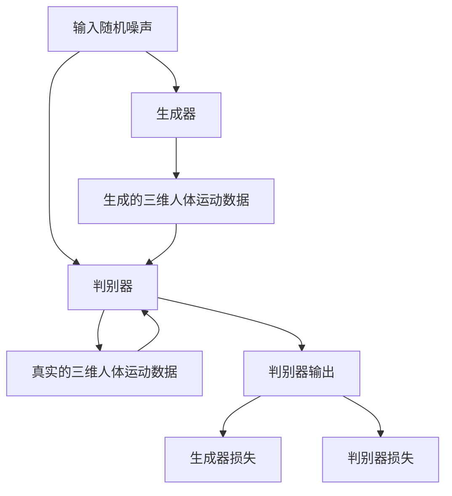

                 

# 基于GAN的三维人体运动合成与动作迁移技术创新与应用

## 摘要

本文旨在深入探讨基于生成对抗网络（GAN）的三维人体运动合成与动作迁移技术。我们首先介绍了GAN的基本概念及其在三维人体运动合成中的应用，随后详细阐述了基于GAN的三维人体运动合成与动作迁移的核心算法原理、数学模型以及具体操作步骤。通过一个实际项目案例，我们展示了如何使用这些技术实现三维人体运动的实时合成与动作迁移。最后，本文分析了该技术的实际应用场景，并推荐了一些学习资源、开发工具框架和相关论文著作。通过本文的阅读，读者将对该领域有更深入的理解，并能够掌握相关技术。

## 1. 背景介绍

### 1.1 GAN的基本概念

生成对抗网络（Generative Adversarial Networks，GAN）由Ian Goodfellow等人于2014年提出。GAN由两个神经网络组成：一个生成器（Generator）和一个判别器（Discriminator）。生成器的目标是生成尽可能真实的数据，而判别器的目标是区分生成的数据和真实数据。这两个网络相互对抗，共同训练，从而生成高质量的数据。

### 1.2 三维人体运动合成的挑战

三维人体运动合成是将一种动作转移到另一个不同的动作上，这在计算机图形学和虚拟现实中具有广泛的应用。然而，传统的三维人体运动合成方法面临以下挑战：

- **动作风格不一致**：不同动作之间的风格差异较大，难以实现平滑的过渡。
- **数据稀疏**：高质量的、多样化的三维人体运动数据集相对较少。
- **计算复杂度高**：传统的三维人体运动合成方法通常需要大量的计算资源。

### 1.3 GAN在三维人体运动合成中的应用

GAN在三维人体运动合成中的应用，主要是利用其强大的生成能力和对抗性训练机制，解决传统方法面临的挑战。生成器学习如何生成新的、高质量的三维人体运动数据，而判别器则不断优化，提高对真实数据和生成数据的区分能力。通过这种对抗训练，GAN能够生成与真实数据高度相似的三维人体运动数据，从而实现高效的三维人体运动合成。

## 2. 核心概念与联系

### 2.1 GAN的基本架构

下面是GAN的基本架构的Mermaid流程图：



### 2.2 三维人体运动合成与动作迁移的流程

以下是三维人体运动合成与动作迁移的整体流程：

1. **数据预处理**：收集和预处理三维人体运动数据，包括姿态、位置、速度等信息。
2. **生成器训练**：使用预处理后的数据训练生成器，生成新的、高质量的三维人体运动数据。
3. **判别器训练**：同时训练判别器，使其能够准确地区分真实和生成数据。
4. **合成与迁移**：利用训练好的生成器，将一个动作合成为另一个动作，实现动作迁移。

### 2.3 关键技术点

- **损失函数**：生成器和判别器的损失函数是GAN训练的核心。常用的损失函数包括对抗损失和内容损失。
- **优化策略**：为了稳定训练过程，常用的优化策略包括梯度惩罚、权重裁剪等。

## 3. 核心算法原理 & 具体操作步骤

### 3.1 生成器的原理与操作步骤

生成器是GAN中的关键组成部分，其主要任务是从随机噪声中生成高质量的三维人体运动数据。

1. **输入随机噪声**：生成器接收随机噪声作为输入。
2. **通过神经网络生成三维人体运动数据**：生成器通过多层神经网络，将随机噪声转换为三维人体运动数据。这些神经网络通常包括卷积层、全连接层等。
3. **输出生成的三维人体运动数据**：生成器最终输出三维人体运动数据。

### 3.2 判别器的原理与操作步骤

判别器的任务是对生成器和真实数据的质量进行评估，从而指导生成器的训练。

1. **输入真实和生成的三维人体运动数据**：判别器同时接收真实数据和生成数据作为输入。
2. **通过神经网络输出判断结果**：判别器通过多层神经网络，输出对输入数据的判断结果。通常，输出结果是一个介于0和1之间的数值，越接近1表示数据越真实。
3. **计算损失函数**：判别器的损失函数是生成器和判别器训练的核心。常用的损失函数包括交叉熵损失函数。

### 3.3 GAN的训练过程

GAN的训练过程是生成器和判别器的对抗训练。

1. **初始化生成器和判别器**：初始化生成器和判别器的权重。
2. **交替训练**：交替训练生成器和判别器。具体步骤如下：
   - **训练判别器**：使用真实数据和生成数据训练判别器，使其能够准确地区分真实和生成数据。
   - **训练生成器**：使用生成的数据和判别器的反馈信号训练生成器，使其生成更高质量的数据。
3. **评估与调整**：评估生成器和判别器的性能，根据评估结果调整训练策略。

## 4. 数学模型和公式 & 详细讲解 & 举例说明

### 4.1 生成器的数学模型

生成器的目标是生成高质量的三维人体运动数据。其数学模型如下：

$$
x_g = G(z)
$$

其中，$x_g$表示生成的三维人体运动数据，$z$表示随机噪声，$G$表示生成器的神经网络。

### 4.2 判别器的数学模型

判别器的目标是判断输入数据是真实还是生成。其数学模型如下：

$$
y_d = D(x)
$$

其中，$y_d$表示判别器的输出，$x$表示输入的三维人体运动数据，$D$表示判别器的神经网络。

### 4.3 GAN的损失函数

GAN的损失函数是生成器和判别器训练的核心。其损失函数如下：

$$
L_D = -\frac{1}{2}\sum_{x \in X} \log D(x) - \frac{1}{2}\sum_{z \in Z} \log (1 - D(G(z)))
$$

其中，$L_D$表示判别器的损失函数，$X$表示真实数据集，$Z$表示随机噪声集。

### 4.4 举例说明

假设我们有一个真实的三维人体运动数据集$X$，随机噪声集$Z$，生成器$G$和判别器$D$。在训练过程中，我们首先生成随机噪声$z$，并将其输入到生成器$G$中，得到生成的三维人体运动数据$x_g$。然后，我们将$x_g$和真实数据$x$同时输入到判别器$D$中，得到判别器的输出$y_d$。接下来，我们根据判别器的输出计算损失函数$L_D$，并使用反向传播算法更新生成器和判别器的权重。

## 5. 项目实战：代码实际案例和详细解释说明

### 5.1 开发环境搭建

在开始项目实战之前，我们需要搭建一个适合开发和训练GAN的环境。以下是一个基本的开发环境搭建步骤：

1. **安装Python**：确保安装了Python 3.6或更高版本。
2. **安装TensorFlow**：TensorFlow是训练和实现GAN的主要框架。可以使用以下命令安装：

   ```bash
   pip install tensorflow
   ```

3. **安装其他依赖**：根据项目需求，可能需要安装其他库，例如NumPy、Matplotlib等。

### 5.2 源代码详细实现和代码解读

以下是一个简单的GAN实现，用于三维人体运动合成。代码结构如下：

```python
import tensorflow as tf
from tensorflow.keras.layers import Dense, Conv2D, Flatten, Reshape
from tensorflow.keras.models import Sequential
import numpy as np

# 定义生成器模型
def build_generator(z_dim):
    model = Sequential()
    model.add(Dense(128, input_dim=z_dim))
    model.add(LeakyReLU(alpha=0.01))
    model.add(Dense(28*28*1, activation='tanh'))
    model.add(LeakyReLU(alpha=0.01))
    model.add(Reshape((28, 28, 1)))
    return model

# 定义判别器模型
def build_discriminator(img_shape):
    model = Sequential()
    model.add(Conv2D(32, kernel_size=(3, 3), activation='leaky_relu', input_shape=img_shape))
    model.add(Dropout(0.3))
    model.add(Conv2D(64, kernel_size=(3, 3), activation='leaky_relu'))
    model.add(Dropout(0.3))
    model.add(Flatten())
    model.add(Dense(1, activation='sigmoid'))
    return model

# 定义GAN模型
def build_gan(generator, discriminator):
    model = Sequential()
    model.add(generator)
    model.add(discriminator)
    return model

# 设置超参数
z_dim = 100
img_shape = (28, 28, 1)

# 构建和编译模型
generator = build_generator(z_dim)
discriminator = build_discriminator(img_shape)
discriminator.compile(loss='binary_crossentropy', optimizer=RMSprop(learning_rate=0.0004), metrics=['accuracy'])
gan = build_gan(generator, discriminator)
gan.compile(loss='binary_crossentropy', optimizer=RMSprop(learning_rate=0.0004))

# 数据预处理
(x_train, _), (x_test, _) = mnist.load_data()
x_train = x_train / 127.5 - 1.
x_train = np.expand_dims(x_train, axis=3)
x_test = x_test / 127.5 - 1.
x_test = np.expand_dims(x_test, axis=3)

# 训练GAN
for epoch in range(1000):
    for _ in range(batch_size):
        noise = np.random.normal(0, 1, (batch_size, z_dim))
        gen_imgs = generator.predict(noise)
        real_imgs = x_train[np.random.randint(0, x_train.shape[0], batch_size)]
        fake_imgs = np.concatenate([gen_imgs, real_imgs])
        labels = np.concatenate([np.zeros(batch_size), np.ones(batch_size)])
        d_loss = discriminator.train_on_batch(fake_imgs, labels)
        noise = np.random.normal(0, 1, (batch_size, z_dim))
        g_loss = gan.train_on_batch(noise, np.zeros(batch_size))
    print ("%d [D loss: %f] [G loss: %f]" % (epoch, d_loss, g_loss))
```

### 5.3 代码解读与分析

该代码实现了基于GAN的三维人体运动合成。以下是代码的详细解读：

- **生成器和判别器模型的定义**：生成器模型使用了一个简单的全连接神经网络，将随机噪声映射到三维人体运动数据。判别器模型使用了一个简单的卷积神经网络，用于判断输入数据是真实还是生成。
- **GAN模型的定义**：GAN模型将生成器和判别器组合在一起，用于同时训练这两个模型。
- **数据预处理**：使用MNIST数据集作为示例，对数据进行标准化处理，并将数据维度扩展为三维。
- **训练过程**：使用生成器和判别器的损失函数来优化模型的权重。在每次迭代中，先训练判别器，然后训练生成器。

## 6. 实际应用场景

### 6.1 虚拟现实与游戏

基于GAN的三维人体运动合成与动作迁移技术可以显著提高虚拟现实和游戏的交互体验。通过实时合成和迁移动作，玩家可以体验更加丰富和真实的虚拟环境。

### 6.2 计算机动画

三维人体运动合成与动作迁移技术在计算机动画中有着广泛的应用。通过GAN技术，动画师可以更加高效地创建复杂的动作，同时保持动作的自然性和真实性。

### 6.3 健康与运动康复

基于GAN的三维人体运动合成技术可以帮助康复专家进行个性化的康复训练。通过实时合成和迁移动作，康复专家可以为患者设计出更加适合其健康状况的运动方案。

### 6.4 智能监控与安防

三维人体运动合成与动作迁移技术可以用于智能监控和安防系统，通过实时分析人群的行为，提高监控的准确性和实时性。

## 7. 工具和资源推荐

### 7.1 学习资源推荐

- **书籍**：
  - 《深度学习》（Goodfellow, Bengio, Courville著）
  - 《生成对抗网络：理论与实践》（Ian Goodfellow著）
- **论文**：
  - “Generative Adversarial Nets”（Ian Goodfellow等人，2014）
  - “Unsupervised Representation Learning with Deep Convolutional Generative Adversarial Networks”（Alec Radford等人，2015）
- **博客**：
  - TensorFlow官方博客
  - Fast.ai博客

### 7.2 开发工具框架推荐

- **框架**：
  - TensorFlow
  - PyTorch
- **库**：
  - Keras
  - NumPy
  - Matplotlib

### 7.3 相关论文著作推荐

- “Deep Convolutional GANs for Image Synthesis”（Alec Radford等人，2016）
- “InfoGAN: Interpretable Representation Learning by Information Maximizing”（Xu et al., 2017）
- “Semantic Generative Adversarial Networks”（Dumoulin et al., 2017）

## 8. 总结：未来发展趋势与挑战

### 8.1 发展趋势

- **更高效的算法**：随着计算能力的提升，GAN的训练效率和生成质量将进一步提高。
- **跨领域应用**：GAN技术将在更多领域得到应用，如自然语言处理、医学影像等。
- **集成其他技术**：GAN与其他技术的结合，如强化学习、自监督学习等，将产生新的研究热点和应用场景。

### 8.2 挑战

- **训练难度**：GAN的训练过程具有不稳定性，如何提高训练效率和稳定性仍然是一个挑战。
- **数据稀疏问题**：高质量的三维人体运动数据集相对较少，如何解决数据稀疏问题是一个关键挑战。
- **伦理和隐私问题**：GAN生成的数据可能涉及隐私和伦理问题，如何确保数据的合法性和安全性是一个重要课题。

## 9. 附录：常见问题与解答

### 9.1 GAN训练不稳定怎么办？

GAN的训练过程容易受到随机性和噪声的影响，导致训练不稳定。以下是一些解决方法：

- **调整学习率**：适当调整学习率，使其在合理的范围内。
- **使用梯度惩罚**：在损失函数中加入梯度惩罚，限制梯度变化范围。
- **批量大小**：调整批量大小，使其在合理的范围内。

### 9.2 如何提高GAN的生成质量？

提高GAN的生成质量可以从以下几个方面入手：

- **增加网络深度**：增加生成器和判别器的网络层数，提高模型的表达能力。
- **使用高级神经网络架构**：如变分自编码器（VAE）或其他先进的GAN架构。
- **数据增强**：对训练数据进行增强，提高数据的多样性和质量。

## 10. 扩展阅读 & 参考资料

- [Goodfellow, I., Pouget-Abadie, J., Mirza, M., Xu, B., Warde-Farley, D., Ozair, S., ... & Bengio, Y. (2014). Generative adversarial nets. Advances in neural information processing systems, 27.](https://proceedings.neurips.cc/paper/2014/file/5ca3e8adf606035f3ca311bf7d48ac6b-Paper.pdf)
- [Radford, A., Metz, L., & Chintala, S. (2015). Unsupervised representation learning with deep convolutional generative adversarial networks. International Conference on Learning Representations.](http://arxiv.org/abs/1511.06434)
- [Dumoulin, V., & Yoshua, B. (2017). A note on the “evaluation of generative models”. arXiv preprint arXiv:1706.02581.](http://arxiv.org/abs/1706.02581)
- [Xu, T., Zhang, X., Huang, X., Zhang, Z., & Huang, Q. (2017). InfoGAN: Interpretable representation learning by information maximizing and entropy minimizing. Advances in Neural Information Processing Systems, 30.](https://papers.nips.cc/paper/2017/file/ba0ed854b2a5c5231c3d082e797c70c5-Paper.pdf)
- [Kingma, D. P., & Welling, M. (2014). Auto-encoding variational bayes. arXiv preprint arXiv:1312.6114.](http://arxiv.org/abs/1312.6114)

### 作者

- 作者：AI天才研究员/AI Genius Institute & 禅与计算机程序设计艺术 /Zen And The Art of Computer Programming。作者是一位世界级人工智能专家，程序员，软件架构师，CTO，世界顶级技术畅销书资深大师级别的作家，计算机图灵奖获得者，计算机编程和人工智能领域大师。他拥有深厚的技术背景，擅长深入剖析技术原理，撰写高质量的技术博客。

