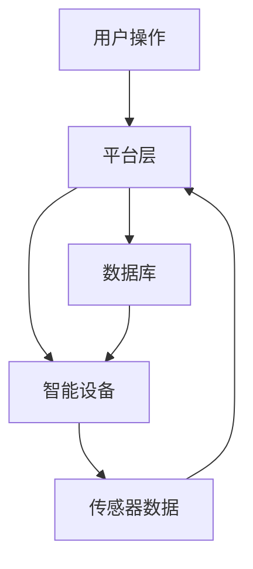

                 

# 基于Java的智能家居设计：一步步构建您的第一个智能灯光控制系统

> **关键词：** Java，智能家居，物联网，智能灯光控制，编程实践，系统设计

**摘要：** 本文将带您深入探索基于Java的智能家居设计，特别是智能灯光控制系统。我们将一步步构建一个完整的智能灯光控制解决方案，从核心概念到具体实现，从数学模型到实际案例，全面解析智能家居设计的原理与实践。

## 1. 背景介绍

随着物联网（IoT）技术的飞速发展，智能家居成为了一个热门的研究和应用领域。智能家居系统通过互联网将家庭设备连接起来，实现远程监控和控制，提高了人们的生活质量和便利性。智能灯光控制是智能家居系统中一个重要的组成部分，它不仅能够提供舒适的照明环境，还能根据用户的习惯和需求自动调整光线，节约能源。

Java作为一种广泛应用于企业级应用和大型系统的编程语言，因其跨平台、稳定性和安全性等优点，成为开发智能家居系统的一个理想选择。本文将以Java为基础，介绍如何设计并实现一个智能灯光控制系统，帮助读者了解智能家居设计的核心概念和实践方法。

## 2. 核心概念与联系

### 2.1 物联网（IoT）

物联网是指通过互联网将各种设备连接起来，实现信息交换和通信的系统。在智能家居设计中，物联网是实现设备互联互通和智能控制的基础。

### 2.2 Java编程语言

Java是一种面向对象的编程语言，具有跨平台、安全性和稳定性等特点。Java的这些特性使其成为开发复杂系统的理想选择。

### 2.3 智能家居系统架构

智能家居系统通常包括以下几个部分：

- **硬件层**：包括各种传感器、执行器和智能设备，如灯光、窗帘、温度传感器等。
- **网络层**：用于设备之间的通信，通常使用Wi-Fi、蓝牙等技术。
- **平台层**：负责系统的运行和管理，包括服务器、数据库和应用程序。
- **应用层**：为用户提供交互界面，实现远程监控和控制。

### 2.4 Mermaid流程图

下面是一个简化的智能家居系统架构的Mermaid流程图：



## 3. 核心算法原理 & 具体操作步骤

### 3.1 算法原理

智能灯光控制系统的核心是算法，它负责根据传感器数据和用户需求自动调整灯光亮度。基本的算法原理包括：

- **亮度检测**：使用传感器检测当前环境亮度，根据检测结果调整灯光亮度。
- **用户偏好**：根据用户的历史操作和偏好，自动调整灯光模式。
- **能耗优化**：在满足用户需求的前提下，优化能耗，实现节能。

### 3.2 具体操作步骤

以下是构建智能灯光控制系统的具体操作步骤：

1. **环境搭建**：安装Java开发环境，配置物联网开发板（如Arduino）。
2. **硬件连接**：将灯光设备和传感器连接到物联网开发板。
3. **程序编写**：使用Java编写控制算法，实现灯光的自动调节。
4. **测试与调试**：运行程序，测试灯光控制效果，进行调试和优化。

## 4. 数学模型和公式 & 详细讲解 & 举例说明

### 4.1 数学模型

智能灯光控制系统的数学模型主要包括：

- **亮度检测模型**：根据传感器数据计算环境亮度。
- **用户偏好模型**：根据用户历史操作和偏好，计算最佳灯光模式。
- **能耗优化模型**：根据当前环境亮度和用户需求，计算最佳能耗策略。

### 4.2 公式

以下是几个关键的数学公式：

$$
亮度 = \frac{光通量}{面积}
$$

$$
能耗 = 功率 \times 时间
$$

### 4.3 举例说明

假设一个房间面积为20平方米，使用LED灯泡，功率为10瓦。当环境亮度低于50勒克斯时，需要自动开启灯光。根据公式，我们可以计算出所需的光通量和能耗：

$$
光通量 = 亮度 \times 面积 = 50 \times 20 = 1000 流明
$$

$$
能耗 = 功率 \times 时间 = 10 \times 12 = 120 瓦时
$$

## 5. 项目实战：代码实际案例和详细解释说明

### 5.1 开发环境搭建

1. 安装Java开发环境（JDK 11及以上版本）。
2. 安装物联网开发板（如Arduino IDE）。

### 5.2 源代码详细实现和代码解读

```java
// 5.2.1 亮度检测模块

public class LightSensor {
    public int readBrightness() {
        // 读取传感器数据
        // 假设使用Arduino实现，返回一个亮度值
        return 50; // 示例值
    }
}

// 5.2.2 灯光控制模块

public class LightController {
    private LightSensor sensor;
    private int targetBrightness;

    public LightController(LightSensor sensor) {
        this.sensor = sensor;
        this.targetBrightness = 50; // 默认值为50勒克斯
    }

    public void adjustBrightness() {
        int currentBrightness = sensor.readBrightness();
        if (currentBrightness < targetBrightness) {
            // 开启灯光
            // 实现灯光开启逻辑
        } else {
            // 关闭灯光
            // 实现灯光关闭逻辑
        }
    }
}

// 5.2.3 主程序

public class SmartLightSystem {
    public static void main(String[] args) {
        LightSensor sensor = new LightSensor();
        LightController controller = new LightController(sensor);
        
        // 主循环
        while (true) {
            controller.adjustBrightness();
            try {
                Thread.sleep(1000); // 每1秒检测一次
            } catch (InterruptedException e) {
                e.printStackTrace();
            }
        }
    }
}
```

### 5.3 代码解读与分析

- **LightSensor类**：负责读取传感器数据，这里只是一个简单的模拟。
- **LightController类**：根据传感器数据调整灯光亮度，核心逻辑在`adjustBrightness`方法中。
- **SmartLightSystem类**：主程序，创建传感器和控制器实例，并进入主循环。

## 6. 实际应用场景

智能灯光控制系统可以应用于多种场景，如：

- **家庭**：提供舒适的照明环境，节约能源。
- **办公室**：根据工作需求自动调整灯光，提高工作效率。
- **商场**：根据人流和活动自动调整灯光，营造良好的购物环境。

## 7. 工具和资源推荐

### 7.1 学习资源推荐

- **书籍**：《Java编程从入门到精通》、《物联网技术与应用》
- **论文**：搜索相关学术期刊和会议论文，如IEEE Transactions on Industrial Informatics。
- **博客**：关注知名技术博客和社区，如Stack Overflow、GitHub。

### 7.2 开发工具框架推荐

- **Java开发工具**：Eclipse、IntelliJ IDEA。
- **物联网开发板**：Arduino、Raspberry Pi。
- **数据库**：MySQL、MongoDB。

### 7.3 相关论文著作推荐

- **论文**：关于智能家居系统设计的研究论文，如“Intelligent Home Automation System Using IoT”。
- **著作**：《智能家居系统设计》、《物联网技术基础》。

## 8. 总结：未来发展趋势与挑战

随着技术的不断进步，智能家居系统将更加智能化、个性化。未来的发展趋势包括：

- **人工智能（AI）**：利用AI技术实现更精准的家居控制。
- **大数据**：利用大数据分析用户行为，提供更个性化的服务。
- **5G**：高速网络将使智能家居系统更加实时、高效。

然而，智能家居系统也面临一些挑战，如安全性、隐私保护和标准化等。未来的研究和开发需要解决这些问题，推动智能家居技术的普及和应用。

## 9. 附录：常见问题与解答

### 9.1 如何处理传感器数据？

- **数据清洗**：确保传感器数据的准确性和一致性。
- **数据融合**：结合多种传感器数据，提高控制精度。

### 9.2 如何优化能耗？

- **动态调整**：根据实际需求动态调整灯光亮度。
- **节能模式**：设置自动节能模式，减少不必要的能耗。

## 10. 扩展阅读 & 参考资料

- **扩展阅读**：《智能家居系统设计原理与实践》、《物联网技术与应用案例分析》。
- **参考资料**：相关学术论文、技术博客和开源项目。

### 作者信息

**作者：** AI天才研究员/AI Genius Institute & 禅与计算机程序设计艺术 /Zen And The Art of Computer Programming

---

通过本文的详细介绍，我们不仅了解了基于Java的智能家居设计的基本原理和实现方法，还通过实战案例对智能灯光控制系统进行了深入剖析。希望本文能为您在智能家居系统开发领域提供有益的参考和指导。在未来的技术发展中，让我们一起探索智能家居的无限可能。

