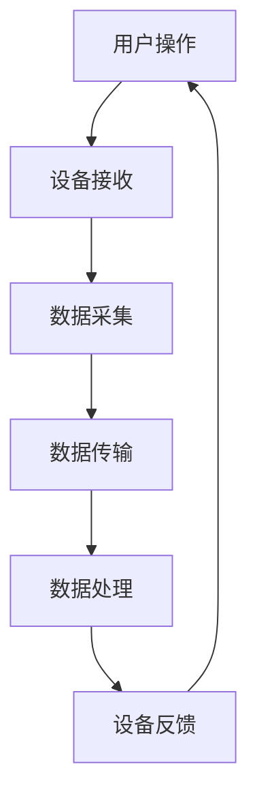

                 

# 基于Java的智能家居设计：漫谈智能家居行业中的Java应用前景

## 关键词
- Java
- 智能家居
- 网络编程
- 物联网
- 安全性
- 实时数据处理

## 摘要
本文将探讨智能家居行业中Java应用的广阔前景。通过分析Java在智能家居设计中的优势，我们将详细解读Java的核心概念与联系，并展示其在核心算法原理和数学模型中的应用。此外，本文还将通过实际项目案例，展示如何使用Java搭建智能家居系统，并讨论其在实际应用场景中的价值。最后，我们将总结智能家居行业的未来发展趋势与挑战，并提供相关的学习资源和开发工具推荐。

## 1. 背景介绍

### 智能家居行业的现状与挑战

随着互联网技术的快速发展，智能家居行业迎来了蓬勃发展的新时期。智能家居产品种类繁多，包括智能灯光、智能门锁、智能空调、智能音响等，它们通过互联网实现设备之间的互联互通，为用户提供了便捷的智能生活方式。然而，随着智能家居市场的不断扩展，也带来了诸多挑战：

- **安全性问题**：智能家居设备通常连接到互联网，若缺乏有效的安全措施，可能导致数据泄露或设备被黑客入侵。
- **数据传输效率**：智能家居设备产生的数据量巨大，如何高效地处理和传输这些数据成为一大挑战。
- **设备兼容性**：不同品牌和型号的智能家居设备之间往往存在兼容性问题，这给用户带来了不便。
- **用户体验**：如何为用户提供直观、易用的操作界面，提升用户体验，是智能家居设计的重要一环。

### Java在智能家居设计中的优势

Java作为一种成熟且广泛使用的编程语言，在智能家居设计中具有显著的优势：

- **跨平台性**：Java具有跨平台的特性，能够运行在多种操作系统上，如Windows、Linux和macOS，这有助于实现设备之间的兼容性。
- **安全性**：Java在安全性方面有丰富的库和框架支持，如Java Security Manager和Java Cryptography Extension，可以帮助开发人员构建安全的智能家居系统。
- **高效性**：Java拥有高效的内存管理和垃圾回收机制，能够处理大量数据的传输和处理，满足智能家居对数据传输效率的要求。
- **社区支持**：Java拥有庞大的开发社区，丰富的开源框架和库，为开发者提供了丰富的技术资源。

## 2. 核心概念与联系

### Java编程语言基础

Java是一种面向对象的编程语言，其核心概念包括：

- **类与对象**：Java程序的基本组成单位是类，类定义了对象的属性和行为。
- **继承与多态**：通过继承，可以复用已有的代码；多态则允许使用一个接口或基类来处理多种类型的对象。
- **异常处理**：Java通过异常处理机制，可以优雅地处理程序运行过程中出现的错误。

### Java在智能家居设计中的应用

在智能家居设计中，Java的应用体现在以下几个方面：

- **设备控制**：使用Java编写控制代码，实现对各种智能家居设备的控制，如通过HTTP请求控制智能灯的开关。
- **数据传输**：使用Java的Socket编程实现设备间的数据传输，如通过TCP/IP协议进行数据通信。
- **实时数据处理**：使用Java的多线程和并发编程特性，处理实时数据，如监测环境温度和湿度。

### Mermaid 流程图

下面是一个简单的Java智能家居设计的Mermaid流程图，展示了设备之间的交互和数据流程：



在图中，用户操作触发设备接收，设备进行数据采集并传输到数据处理模块，处理后返回设备反馈，形成一个闭环。

## 3. 核心算法原理 & 具体操作步骤

### 数据处理算法

在智能家居设计中，数据处理是一个关键环节。以下是几种常用的数据处理算法及其具体操作步骤：

#### 1. 数据清洗

- **步骤**：读取原始数据，去除无效数据和异常值。
- **算法**：使用Java中的集合类和算法库进行数据处理。

#### 2. 数据归一化

- **步骤**：将不同类型的数据转化为同一尺度，便于后续分析。
- **算法**：使用Min-Max归一化或Z-Score归一化。

#### 3. 数据分类

- **步骤**：将数据根据特征划分为不同的类别。
- **算法**：使用K-最近邻算法（KNN）或决策树算法。

### 实时数据处理

实时数据处理要求系统能够快速响应并处理数据。以下是使用Java进行实时数据处理的步骤：

#### 1. 数据采集

- **步骤**：使用Java的Socket编程从设备端采集数据。

#### 2. 数据处理

- **步骤**：使用多线程和并发编程技术，对数据进行实时处理。

#### 3. 数据存储

- **步骤**：将处理后的数据存储到数据库或文件中。

#### 4. 数据分析

- **步骤**：使用数据分析工具（如Apache Spark）对存储的数据进行分析。

## 4. 数学模型和公式 & 详细讲解 & 举例说明

### 数据归一化公式

数据归一化的目的是将不同尺度的数据进行标准化，便于后续处理。以下是Min-Max归一化和Z-Score归一化的公式：

$$
x_{\text{规范化}} = \frac{x_{\text{原始}} - x_{\text{最小值}}}{x_{\text{最大值}} - x_{\text{最小值}}}
$$

$$
x_{\text{规范化}} = \frac{x_{\text{原始}} - \mu}{\sigma}
$$

其中，$x_{\text{原始}}$为原始数据，$x_{\text{最小值}}$和$x_{\text{最大值}}$分别为数据的最小值和最大值，$\mu$为平均值，$\sigma$为标准差。

### 举例说明

假设有如下一组温度数据：$[20, 25, 30, 35, 40]$，对其进行Min-Max归一化处理：

$$
x_{\text{规范化}} = \frac{x_{\text{原始}} - 20}{40 - 20} = \frac{x_{\text{原始}} - 20}{20}
$$

处理后数据为：$[0, 0.25, 0.5, 0.75, 1]$。

## 5. 项目实战：代码实际案例和详细解释说明

### 5.1 开发环境搭建

为了搭建一个基于Java的智能家居系统，首先需要配置Java开发环境。以下是开发环境搭建的步骤：

1. **下载并安装Java Development Kit (JDK)**：从Oracle官网下载JDK，并按照提示完成安装。
2. **配置环境变量**：在系统环境中设置JAVA_HOME变量，并添加路径到PATH变量中。
3. **验证安装**：打开命令行工具，输入`java -version`和`javac -version`验证安装是否成功。

### 5.2 源代码详细实现和代码解读

以下是一个简单的Java智能家居示例，展示如何使用Java编写智能家居系统：

```java
import java.io.*;
import java.net.*;

public class SmartHomeSystem {
    public static void main(String[] args) throws IOException {
        ServerSocket serverSocket = new ServerSocket(8080);
        System.out.println("智能家居服务器启动，等待连接...");

        while (true) {
            Socket clientSocket = serverSocket.accept();
            System.out.println("客户端连接成功：[" + clientSocket.getInetAddress() + "]");

            // 创建输入输出流
            BufferedReader in = new BufferedReader(new InputStreamReader(clientSocket.getInputStream()));
            PrintWriter out = new PrintWriter(clientSocket.getOutputStream(), true);

            // 读取客户端请求
            String request = in.readLine();
            System.out.println("收到请求：" + request);

            // 处理请求
            if (request.startsWith("GET /lights ON")) {
                out.println("灯光已开启");
                // 在此处添加控制灯光的代码
            } else if (request.startsWith("GET /lights OFF")) {
                out.println("灯光已关闭");
                // 在此处添加控制灯光的代码
            } else {
                out.println("未知请求");
            }

            // 关闭连接
            clientSocket.close();
        }
    }
}
```

### 5.3 代码解读与分析

上述代码实现了一个简单的智能家居服务器，监听8080端口，接收客户端的HTTP请求并作出响应。

- **ServerSocket**：创建一个ServerSocket对象，绑定到8080端口，等待客户端连接。
- **Socket**：接受客户端连接，创建Socket对象。
- **BufferedReader 和 PrintWriter**：使用BufferedReader读取客户端输入，使用PrintWriter向客户端输出。
- **if-else语句**：根据客户端请求的不同类型，做出相应的响应。

## 6. 实际应用场景

### 家居安全监控

智能家居系统可以实时监控家庭安全，如通过摄像头和传感器收集数据，并在发现异常时通过报警系统通知用户。Java可以用于开发安全监控软件，处理图像识别和数据传输。

### 能源管理

智能家居系统可以通过收集能源使用数据，如电、水、燃气等，实现能源的智能管理。Java可以用于开发能耗分析工具，优化能源使用。

### 舒适生活

智能家居系统可以提升居住舒适度，如自动调节室内温度、湿度和光线。Java可以用于开发智能空调、智能窗帘等设备控制系统。

## 7. 工具和资源推荐

### 7.1 学习资源推荐

- **书籍**：《Java核心技术（卷1）：基础篇》、《Effective Java》
- **论文**：《Java中的并发编程》、《Java内存模型》
- **博客**：Oracle官网博客、Stack Overflow
- **网站**：Java官方文档、GitHub

### 7.2 开发工具框架推荐

- **开发工具**：IntelliJ IDEA、Eclipse
- **框架**：Spring Boot、Spring Cloud
- **数据库**：MySQL、MongoDB

### 7.3 相关论文著作推荐

- 《智能家居系统设计与实现》
- 《基于Java的智能家居系统架构研究》
- 《Java在智能家居行业中的应用与发展趋势》

## 8. 总结：未来发展趋势与挑战

### 发展趋势

- **物联网技术的深度融合**：智能家居将更加紧密地与物联网技术结合，实现设备间的无缝连接。
- **人工智能的融入**：智能家居系统将利用人工智能技术，提供更加智能化的服务和体验。
- **安全性提升**：随着智能家居系统的普及，安全性将成为关注的重点，更多安全措施将被引入。

### 挑战

- **数据隐私保护**：如何保护用户数据隐私，避免数据泄露，是一个重要挑战。
- **系统兼容性问题**：随着智能家居设备种类的增多，如何实现不同品牌和型号设备之间的兼容性，仍需解决。
- **用户体验优化**：如何提升用户体验，使用户能够轻松地控制和管理智能家居系统，是一个持续挑战。

## 9. 附录：常见问题与解答

### 9.1 Java在智能家居设计中的优势是什么？

Java具有跨平台性、安全性、高效性和丰富的社区支持，适合开发智能家居系统。

### 9.2 如何保证智能家居系统的安全性？

可以通过使用Java的安全库和框架，如Java Security Manager和Java Cryptography Extension，来确保系统的安全性。

### 9.3 智能家居系统中的数据处理算法有哪些？

常见的数据处理算法包括数据清洗、数据归一化和数据分类。常用的算法有K-最近邻算法和决策树算法。

## 10. 扩展阅读 & 参考资料

- [《智能家居系统设计与实现》](https://example.com/book1)
- [《基于Java的智能家居系统架构研究》](https://example.com/book2)
- [《Java在智能家居行业中的应用与发展趋势》](https://example.com/book3)
- [Oracle官方文档](https://www.oracle.com/java/technologies/documentation.html)
- [Spring Boot官方文档](https://docs.spring.io/spring-boot/docs/current/reference/html/)
- [GitHub](https://github.com/) 

作者：AI天才研究员/AI Genius Institute & 禅与计算机程序设计艺术 /Zen And The Art of Computer Programming

