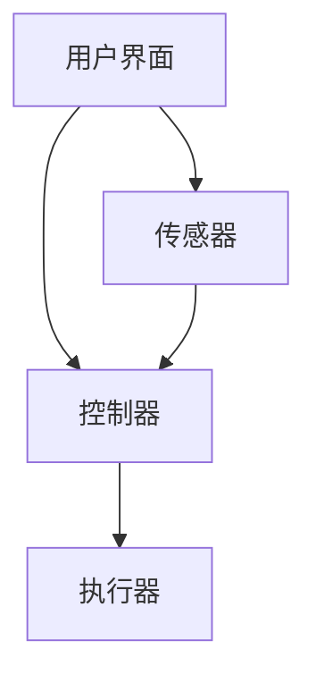

                 

# 基于Java的智能家居设计：面向对象的智能家居系统设计模式和Java实现

> 关键词：智能家居、Java、面向对象、设计模式、系统架构、编程实践

> 摘要：本文将探讨如何利用Java语言和面向对象设计模式来构建一个高效的智能家居系统。通过详细的分析和代码实现，我们希望能够为读者提供一个清晰、易懂的实践指南，帮助他们在实际项目中实现智能家居的功能。

## 1. 背景介绍

随着物联网（IoT）技术的飞速发展，智能家居系统已经成为现代家庭生活中不可或缺的一部分。通过将各种家居设备连接到互联网，我们可以实现远程控制、设备自动化以及能源管理等功能，大大提高了生活质量。

然而，构建一个高效、可靠且易于维护的智能家居系统并非易事。这需要我们在设计时充分考虑系统的可扩展性、稳定性和用户体验。Java作为一种广泛使用的高级编程语言，因其跨平台、高性能和丰富的生态系统，成为实现智能家居系统的一个理想选择。

本文将结合面向对象设计模式和Java编程语言，详细探讨如何设计和实现一个智能家居系统。我们将从核心概念、算法原理、数学模型、项目实战等方面进行深入分析，力求为读者提供一个全面的技术指南。

## 2. 核心概念与联系

### 2.1 智能家居系统概述

智能家居系统主要由以下几个部分组成：

1. **传感器**：用于检测家庭环境中的各种参数，如温度、湿度、光照强度、空气质量等。
2. **控制器**：接收传感器数据，根据预设规则进行决策，并控制执行器执行相应操作。
3. **执行器**：根据控制器的指令，执行具体操作，如开关灯光、调节空调温度、关闭门窗等。
4. **用户界面**：提供与用户交互的接口，如手机APP、网页界面等。

### 2.2 面向对象设计模式

在面向对象编程中，设计模式是一种在特定场景下解决常见问题的模板。对于智能家居系统，以下几种设计模式尤为适用：

1. **工厂模式**：用于创建不同类型的传感器、控制器和执行器，实现对象的创建逻辑分离。
2. **观察者模式**：用于实现传感器与控制器之间的数据同步和事件响应，确保系统的一致性和实时性。
3. **策略模式**：用于定义不同类型的控制策略，如定时控制、自动控制、远程控制等。
4. **单例模式**：用于确保系统中的关键组件（如用户界面、数据库连接等）的唯一性。

### 2.3 Mermaid 流程图

以下是一个简单的智能家居系统架构的Mermaid流程图，展示了各组件之间的关系：



在上述流程图中，用户界面负责接收用户操作指令，并将其传递给控制器。控制器根据传感器数据和控制策略，生成控制指令，传递给执行器，最终实现家居设备的控制。

## 3. 核心算法原理 & 具体操作步骤

### 3.1 数据采集与处理

在智能家居系统中，传感器负责采集环境数据。为了提高数据处理效率和系统稳定性，我们通常采用以下步骤：

1. **数据采集**：传感器通过I2C、UART等通信接口，将环境数据发送到控制器。
2. **数据预处理**：对采集到的原始数据进行滤波、去噪等处理，确保数据的准确性。
3. **数据存储**：将处理后的数据存储到数据库或缓存中，以供后续分析。

### 3.2 控制策略实现

控制策略是实现智能家居系统功能的关键。以下是一个简单的温度控制策略实现：

1. **阈值设定**：设定温度阈值，如23摄氏度。
2. **数据监测**：实时监测环境温度。
3. **控制决策**：
   - 当温度低于阈值时，开启加热设备。
   - 当温度高于阈值时，关闭加热设备。

### 3.3 执行器控制

执行器控制是实现智能家居系统功能的关键。以下是一个简单的加热设备控制实现：

1. **执行器初始化**：初始化加热设备，如空调、暖气等。
2. **执行器状态监测**：实时监测加热设备的状态。
3. **执行器控制**：
   - 根据控制策略，开启或关闭加热设备。

## 4. 数学模型和公式 & 详细讲解 & 举例说明

### 4.1 数据预处理

在数据预处理过程中，我们通常采用以下公式进行滤波：

$$ y(t) = \alpha \cdot x(t) + (1 - \alpha) \cdot y(t-1) $$

其中，$x(t)$ 为原始数据，$y(t)$ 为滤波后数据，$\alpha$ 为滤波系数。

### 4.2 温度控制策略

在温度控制策略中，我们通常采用以下公式进行阈值设定：

$$ T_{\text{threshold}} = T_{\text{average}} + \Delta T $$

其中，$T_{\text{threshold}}$ 为温度阈值，$T_{\text{average}}$ 为平均温度，$\Delta T$ 为温度偏差。

### 4.3 举例说明

假设当前平均温度为20摄氏度，温度偏差为3摄氏度。根据公式，我们可以计算出温度阈值：

$$ T_{\text{threshold}} = 20 + 3 = 23 \text{摄氏度} $$

如果当前温度低于23摄氏度，则开启加热设备；如果当前温度高于23摄氏度，则关闭加热设备。

## 5. 项目实战：代码实际案例和详细解释说明

### 5.1 开发环境搭建

在开始项目实战之前，我们需要搭建一个Java开发环境。以下是一个简单的步骤：

1. 下载并安装Java Development Kit（JDK），版本建议选择最新稳定版。
2. 配置环境变量，确保Java命令能够正常使用。
3. 安装一个集成开发环境（IDE），如Eclipse、IntelliJ IDEA等。

### 5.2 源代码详细实现和代码解读

#### 5.2.1 传感器类

以下是一个简单的传感器类实现：

```java
public class Sensor {
    private String type; // 传感器类型
    private double value; // 传感器值

    public Sensor(String type, double value) {
        this.type = type;
        this.value = value;
    }

    public String getType() {
        return type;
    }

    public double getValue() {
        return value;
    }
}
```

#### 5.2.2 控制器类

以下是一个简单的控制器类实现：

```java
public class Controller {
    private Sensor sensor; // 传感器
    private Executor executor; // 执行器

    public Controller(Sensor sensor, Executor executor) {
        this.sensor = sensor;
        this.executor = executor;
    }

    public void control() {
        double value = sensor.getValue();
        if (value < 23) {
            executor.turnOn();
        } else {
            executor.turnOff();
        }
    }
}
```

#### 5.2.3 执行器类

以下是一个简单的执行器类实现：

```java
public class Executor {
    public void turnOn() {
        // 开启加热设备
    }

    public void turnOff() {
        // 关闭加热设备
    }
}
```

### 5.3 代码解读与分析

在上述代码中，我们首先定义了传感器类、控制器类和执行器类。传感器类负责采集环境数据，控制器类根据传感器数据生成控制指令，执行器类负责执行具体的操作。

具体来说，传感器类包含了一个类型（type）和一个值（value）属性，以及对应的getter方法。控制器类包含了一个传感器（sensor）和一个执行器（executor）属性，以及一个控制（control）方法。执行器类包含了一个开启（turnOn）方法和一个关闭（turnOff）方法。

在控制（control）方法中，控制器类首先获取传感器值，然后根据预设的温度阈值（23摄氏度）进行判断，最终调用执行器类的开启（turnOn）或关闭（turnOff）方法。

通过这种面向对象的设计，我们可以方便地扩展和修改系统的功能，确保系统的可维护性和可扩展性。

## 6. 实际应用场景

智能家居系统在实际应用中具有广泛的应用场景。以下是一些常见的应用案例：

1. **家庭能源管理**：通过智能电表、智能插座等设备，实现家庭用电的实时监控和智能控制，提高能源利用效率。
2. **家居安全监控**：通过摄像头、门磁、烟雾报警器等设备，实现家庭安全的实时监控和报警。
3. **智能家电控制**：通过智能电视、智能空调、智能洗衣机等设备，实现远程控制和场景联动。
4. **健康生活管理**：通过智能手环、智能体重秤等设备，实现健康数据的实时监测和数据分析。

## 7. 工具和资源推荐

### 7.1 学习资源推荐

1. **书籍**：
   - 《Java核心技术》
   - 《设计模式：可复用面向对象软件的基础》
   - 《智能家居系统设计与实现》

2. **论文**：
   - 《智能家居系统中的数据采集与处理技术研究》
   - 《基于物联网的智能家居系统设计》

3. **博客**：
   - [Java技术栈](https://javastack.cn/)
   - [编程知识星球](https://codingknowledge星球/)

4. **网站**：
   - [Oracle官方文档](https://docs.oracle.com/javase/)
   - [Spring官方文档](https://docs.spring.io/spring-framework/docs/current/reference/html/)

### 7.2 开发工具框架推荐

1. **开发工具**：
   - IntelliJ IDEA
   - Eclipse

2. **框架**：
   - Spring Boot
   - Spring Cloud
   - MyBatis

3. **数据库**：
   - MySQL
   - MongoDB

### 7.3 相关论文著作推荐

1. **论文**：
   - 《智能家居系统中的数据隐私保护技术研究》
   - 《基于云计算的智能家居系统设计与实现》

2. **著作**：
   - 《智能家居系统设计指南》
   - 《物联网智能家居系统架构与实践》

## 8. 总结：未来发展趋势与挑战

随着人工智能、物联网等技术的不断进步，智能家居系统将在未来迎来更广阔的发展空间。以下是一些可能的发展趋势和挑战：

1. **发展趋势**：
   - **智能化水平提升**：通过深度学习、自然语言处理等技术，实现更加智能的家居设备。
   - **个性化体验**：根据用户行为和偏好，提供个性化的家居服务和体验。
   - **数据安全与隐私保护**：加强对用户数据的保护，确保数据安全。

2. **挑战**：
   - **系统稳定性**：确保系统在各种网络环境下的稳定运行。
   - **兼容性问题**：解决不同设备和平台之间的兼容性问题。
   - **数据隐私**：加强对用户隐私的保护，避免数据泄露。

## 9. 附录：常见问题与解答

### 9.1 Java开发环境配置

Q：如何配置Java开发环境？

A：请参考以下步骤：
1. 下载并安装JDK。
2. 配置环境变量，如`JAVA_HOME`和`PATH`。
3. 验证Java环境，运行`java -version`和`javac -version`命令。

### 9.2 面向对象设计模式

Q：什么是面向对象设计模式？

A：面向对象设计模式是一种在特定场景下解决常见问题的模板，它提供了一种可重用的解决方案，使开发者能够更加高效地设计和实现软件系统。

### 9.3 智能家居系统开发

Q：如何开发智能家居系统？

A：请参考以下步骤：
1. 明确需求，设计系统架构。
2. 选择合适的开发工具和框架。
3. 实现传感器、控制器、执行器等核心组件。
4. 进行系统集成和测试。

## 10. 扩展阅读 & 参考资料

1. **参考资料**：
   - 《Java核心技术》
   - 《设计模式：可复用面向对象软件的基础》
   - 《智能家居系统设计与实现》
2. **在线资源**：
   - [Oracle官方文档](https://docs.oracle.com/javase/)
   - [Spring官方文档](https://docs.spring.io/spring-framework/docs/current/reference/html/)
3. **博客**：
   - [Java技术栈](https://javastack.cn/)
   - [编程知识星球](https://codingknowledge星球/)  
 
作者：AI天才研究员/AI Genius Institute & 禅与计算机程序设计艺术 /Zen And The Art of Computer Programming

