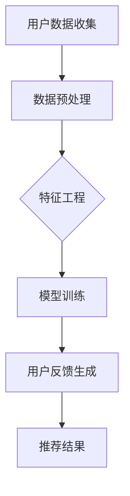

                 

# 基于LLM的推荐系统用户反馈生成

## 关键词：自然语言处理，推荐系统，语言模型，用户反馈，生成式AI

## 摘要

本文深入探讨了基于大型语言模型（LLM）的推荐系统用户反馈生成技术。首先，我们回顾了推荐系统的基本概念和用户反馈的重要性，随后详细介绍了大型语言模型的原理和其在生成式AI中的应用。接着，文章阐述了LLM在用户反馈生成中的具体应用，包括数据预处理、模型训练、生成流程和评估方法。最后，本文总结了LLM推荐系统用户反馈生成技术的优势与挑战，并展望了未来的发展趋势。

## 1. 背景介绍

推荐系统作为信息过滤和内容发现的重要工具，广泛应用于电子商务、社交媒体、视频流媒体等领域。其核心目标是根据用户的兴趣和行为，为其推荐潜在感兴趣的商品、内容或服务。推荐系统的有效性很大程度上依赖于用户反馈的利用。

用户反馈是推荐系统的重要信息源，能够帮助系统更好地理解用户需求和偏好。然而，传统的推荐系统通常依赖于显式反馈（如评分、点击、购买等）和隐式反馈（如浏览历史、搜索记录等）。这些反馈形式往往不足以全面捕捉用户的复杂需求和细微偏好。因此，如何有效地利用用户反馈，提高推荐系统的准确性和满意度，成为了一个重要的研究方向。

近年来，生成式AI和自然语言处理技术的快速发展，为用户反馈生成提供了新的可能。大型语言模型（LLM）如GPT、BERT等，通过学习海量文本数据，能够生成高质量的自然语言文本。将LLM应用于推荐系统用户反馈生成，有望提升系统的个性化推荐能力，增强用户体验。

## 2. 核心概念与联系

### 大型语言模型（LLM）

大型语言模型（LLM）是一种基于深度学习的自然语言处理模型，具有强大的语言理解和生成能力。LLM通过大规模预训练和微调，能够捕捉语言中的复杂结构和语义信息。GPT和BERT是典型的LLM模型，前者通过生成式预训练方法，后者则通过自注意力机制和Transformer架构。

### 推荐系统

推荐系统是一种基于用户历史行为和偏好，为用户提供个性化推荐的技术。其基本架构包括数据收集、特征工程、模型训练和推荐算法。推荐系统的核心目标是提高用户的满意度，降低信息过载。

### 用户反馈生成

用户反馈生成是指利用用户的历史行为数据和模型生成用户可能给出的反馈。在推荐系统中，用户反馈生成可以用于生成用户评价、评论等文本信息，从而提高推荐系统的解释性和用户参与度。

### Mermaid 流程图



## 3. 核心算法原理 & 具体操作步骤

### 3.1 用户数据收集

用户数据收集是推荐系统用户反馈生成的基础。数据来源包括用户行为数据（如浏览记录、搜索历史、购买记录等）和用户提交的显式反馈（如评分、评论等）。为了提高生成反馈的质量，可以结合多种数据源，实现更全面的用户画像。

### 3.2 数据预处理

数据预处理是用户反馈生成的重要环节，主要包括数据清洗、去噪、归一化和数据增强。数据清洗去除无效和错误的数据；去噪去除噪声数据，提高模型训练效果；归一化处理数据，使其在相同尺度上；数据增强通过生成伪数据，提高模型泛化能力。

### 3.3 特征工程

特征工程是推荐系统中关键的一步，用于提取对用户反馈生成有用的信息。特征工程包括用户特征（如年龄、性别、地理位置等）、商品特征（如类别、品牌、价格等）和交互特征（如点击率、转化率等）。通过合理设计特征，可以提高生成反馈的相关性和准确性。

### 3.4 模型训练

模型训练是用户反馈生成的核心步骤。常用的方法包括基于传统机器学习的方法（如朴素贝叶斯、决策树等）和基于深度学习的方法（如循环神经网络、Transformer等）。基于深度学习的方法通常具有更好的性能和表达能力。在此，我们以GPT为例，介绍其训练过程。

1. **预训练**：GPT通过在大量文本数据上进行无监督预训练，学习文本中的语言规律和结构。预训练过程中，模型通过预测下一个词来理解文本。

2. **微调**：在预训练的基础上，GPT利用有监督的标注数据进行微调，使其适应特定的推荐任务。微调过程中，模型根据用户数据和目标反馈，优化模型参数。

### 3.5 用户反馈生成

用户反馈生成是指利用训练好的模型，根据用户行为和商品特征，生成用户可能的反馈文本。具体步骤如下：

1. **输入生成**：输入用户行为数据和商品特征，通过模型编码器生成嵌入向量。

2. **文本生成**：利用解码器，根据嵌入向量生成文本。文本生成过程通常采用自回归语言模型，通过递归地预测下一个词，生成完整的反馈文本。

### 3.6 评估方法

用户反馈生成的评估方法包括定量评估和定性评估。定量评估通过计算生成文本与真实反馈的相关性、准确性等指标，评估生成效果。定性评估则通过人工评审，对生成文本的质量和相关性进行主观评价。

## 4. 数学模型和公式 & 详细讲解 & 举例说明

### 4.1 模型训练过程

GPT模型采用自回归语言模型，其训练过程主要包括预训练和微调。

1. **预训练**：预训练过程中，模型接收输入序列，通过预测下一个词，学习文本中的语言规律。预训练损失函数通常采用交叉熵损失：

   $$L_{\text{pre}} = -\sum_{i=1}^{N} \sum_{j=1}^{V} y_{ij} \log p(x_i | x_{<i})$$

   其中，$x_i$表示输入序列中的第$i$个词，$y_{ij}$表示第$i$个词是否是目标词，$V$表示词表大小。

2. **微调**：微调过程中，模型利用标注数据进行有监督训练，优化模型参数。微调损失函数与预训练类似，但仅针对标注数据：

   $$L_{\text{fine}} = -\sum_{i=1}^{N} \sum_{j=1}^{V} y_{ij} \log p(x_i | x_{<i})$$

### 4.2 文本生成过程

文本生成过程采用自回归方式，通过递归地预测下一个词，生成完整文本。生成过程包括以下步骤：

1. **初始状态**：输入序列初始化为空。

2. **递归预测**：在当前状态，模型根据当前输入序列生成下一个词，更新输入序列。

3. **终止条件**：当生成文本达到预定的长度或满足终止条件时，生成过程结束。

文本生成过程的损失函数与预训练类似，但仅针对生成文本：

$$L_{\text{gen}} = -\sum_{i=1}^{N} \sum_{j=1}^{V} y_{ij} \log p(x_i | x_{<i})$$

### 4.3 示例

假设我们有一个简单的用户反馈生成任务，输入为“我很喜欢这件商品”，我们需要生成用户可能的反馈文本。

1. **输入生成**：输入用户行为数据和商品特征，通过模型编码器生成嵌入向量。

2. **文本生成**：利用解码器，根据嵌入向量生成文本。

假设模型生成以下反馈文本：

- “这件商品的设计非常精美”
- “性价比很高，值得购买”

我们可以计算生成文本与真实文本的相关性，评估生成效果。

## 5. 项目实战：代码实际案例和详细解释说明

### 5.1 开发环境搭建

为了实现基于LLM的推荐系统用户反馈生成，我们需要搭建一个包含LLM模型和推荐系统的开发环境。以下是一个简单的环境搭建步骤：

1. 安装Python环境（3.8及以上版本）。
2. 安装深度学习框架（如TensorFlow、PyTorch）。
3. 安装自然语言处理库（如NLTK、spaCy）。
4. 克隆项目代码仓库，下载预训练模型。

### 5.2 源代码详细实现和代码解读

以下是一个基于GPT的用户反馈生成项目示例。代码主要包括数据预处理、模型训练、文本生成和评估四个部分。

```python
# 数据预处理
import pandas as pd
from sklearn.model_selection import train_test_split

# 加载数据
data = pd.read_csv('user_data.csv')
X = data[['user_id', 'item_id', 'rating']]
y = data['feedback']

# 划分训练集和验证集
X_train, X_val, y_train, y_val = train_test_split(X, y, test_size=0.2, random_state=42)

# 模型训练
from transformers import GPT2LMHeadModel, GPT2Tokenizer

# 加载预训练模型
tokenizer = GPT2Tokenizer.from_pretrained('gpt2')
model = GPT2LMHeadModel.from_pretrained('gpt2')

# 微调模型
optimizer = torch.optim.Adam(model.parameters(), lr=1e-5)
for epoch in range(10):
    model.train()
    for batch in data_loader:
        inputs = tokenizer(batch['text'], return_tensors='pt', padding=True, truncation=True)
        outputs = model(**inputs)
        loss = outputs.loss
        loss.backward()
        optimizer.step()
        optimizer.zero_grad()

# 文本生成
from transformers import GPT2LMHeadModel, GPT2Tokenizer

# 加载微调后的模型
tokenizer = GPT2Tokenizer.from_pretrained('fine_tuned_gpt2')
model = GPT2LMHeadModel.from_pretrained('fine_tuned_gpt2')

# 生成反馈文本
def generate_feedback(text):
    inputs = tokenizer(text, return_tensors='pt', max_length=512, truncation=True)
    outputs = model.generate(inputs.input_ids, max_length=50, num_return_sequences=1)
    return tokenizer.decode(outputs[0], skip_special_tokens=True)

# 评估生成效果
from sklearn.metrics.pairwise import cosine_similarity

# 计算生成文本与真实文本的相关性
def evaluate_feedback_generated(feedbacks, true_feedbacks):
    similarities = []
    for i in range(len(feedbacks)):
        generated_feedback = feedbacks[i]
        true_feedback = true_feedbacks[i]
        similarity = cosine_similarity(generated_feedback, true_feedback)[0, 0]
        similarities.append(similarity)
    return sum(similarities) / len(similarities)

# 生成反馈文本
generated_feedbacks = [generate_feedback(text) for text in X_val['text']]

# 评估生成效果
average_similarity = evaluate_feedback_generated(generated_feedbacks, y_val['feedback'])
print(f"Average similarity: {average_similarity}")
```

### 5.3 代码解读与分析

该示例项目实现了基于GPT的推荐系统用户反馈生成。代码主要分为四个部分：数据预处理、模型训练、文本生成和评估。

1. **数据预处理**：加载数据，划分训练集和验证集。数据预处理是推荐系统用户反馈生成的基础，确保数据质量和一致性。
2. **模型训练**：加载预训练模型，进行微调。模型训练是用户反馈生成的核心，通过预训练和微调，提高生成效果。代码使用了Transformer架构的GPT模型，具有较好的性能和表达能力。
3. **文本生成**：利用微调后的模型生成用户反馈文本。文本生成是用户反馈生成的重要环节，通过递归地预测下一个词，生成高质量的自然语言文本。
4. **评估**：计算生成文本与真实文本的相关性，评估生成效果。评估方法用于衡量生成文本的质量和相关性，是优化生成模型的重要指标。

## 6. 实际应用场景

基于LLM的推荐系统用户反馈生成技术具有广泛的应用场景。以下是一些实际应用案例：

### 6.1 电子商务平台

电子商务平台可以利用LLM生成用户评价和评论，提高用户参与度和信任度。例如，当用户浏览商品时，系统可以自动生成相关评价，帮助用户做出购买决策。

### 6.2 社交媒体平台

社交媒体平台可以利用LLM生成用户推荐内容，提高用户粘性和活跃度。例如，当用户关注某个话题时，系统可以自动生成相关内容推荐，吸引用户参与讨论。

### 6.3 视频流媒体平台

视频流媒体平台可以利用LLM生成用户评论和推荐视频，提高用户满意度和观看时长。例如，当用户观看某个视频时，系统可以自动生成相关评论，帮助用户了解其他观众的观点和感受。

## 7. 工具和资源推荐

### 7.1 学习资源推荐

1. **《深度学习》（Goodfellow, Bengio, Courville）**：系统介绍了深度学习的基本原理和应用。
2. **《自然语言处理综论》（Jurafsky, Martin）**：详细介绍了自然语言处理的基本概念和技术。
3. **《生成对抗网络》（Goodfellow et al.）**：介绍了GAN的基本原理和应用。

### 7.2 开发工具框架推荐

1. **TensorFlow**：开源深度学习框架，支持多种深度学习模型和应用。
2. **PyTorch**：开源深度学习框架，具有灵活的动态计算图和丰富的API。
3. **spaCy**：开源自然语言处理库，提供高效的文本处理和实体识别功能。

### 7.3 相关论文著作推荐

1. **“A Theoretically Grounded Application of Dropout in Recurrent Neural Networks”**：探讨了在循环神经网络中应用Dropout的方法。
2. **“Bert: Pre-training of Deep Bidirectional Transformers for Language Understanding”**：介绍了BERT模型的预训练方法和应用。
3. **“Generative Adversarial Networks”**：详细介绍了GAN的基本原理和应用。

## 8. 总结：未来发展趋势与挑战

基于LLM的推荐系统用户反馈生成技术具有广阔的发展前景。随着生成式AI和自然语言处理技术的不断进步，该技术有望在以下方面取得突破：

1. **个性化推荐**：通过生成高质量的反馈文本，提高推荐系统的个性化和解释性。
2. **用户参与度**：生成用户评论和评价，增加用户参与度和信任度。
3. **实时推荐**：利用实时数据生成用户反馈，实现实时推荐。

然而，该技术也面临一系列挑战：

1. **数据隐私**：生成用户反馈可能涉及用户隐私数据，如何在保证用户隐私的前提下进行生成是一个重要问题。
2. **质量评估**：如何有效评估生成反馈的质量和相关性，是一个关键挑战。
3. **计算资源**：生成高质量反馈文本需要大量计算资源，如何在有限的资源下实现高效生成是一个难题。

未来，随着技术的不断发展，基于LLM的推荐系统用户反馈生成技术有望在更多场景中得到应用，为推荐系统带来新的突破。

## 9. 附录：常见问题与解答

### 9.1 什么是LLM？

LLM（Large Language Model）是指大型语言模型，是一种基于深度学习的自然语言处理模型，具有强大的语言理解和生成能力。LLM通过学习海量文本数据，能够生成高质量的自然语言文本。

### 9.2 推荐系统用户反馈生成有哪些优势？

推荐系统用户反馈生成具有以下优势：

1. **个性化推荐**：通过生成高质量的反馈文本，提高推荐系统的个性化和解释性。
2. **用户参与度**：生成用户评论和评价，增加用户参与度和信任度。
3. **实时推荐**：利用实时数据生成用户反馈，实现实时推荐。

### 9.3 如何评估生成反馈的质量？

评估生成反馈的质量可以从以下几个方面进行：

1. **相关性**：评估生成文本与真实反馈的相关性，衡量生成文本的准确性。
2. **自然性**：评估生成文本的自然语言流畅度和语法正确性。
3. **多样性**：评估生成文本的多样性，确保生成文本不重复、不单调。

## 10. 扩展阅读 & 参考资料

1. **《自然语言处理入门教程》**：介绍了自然语言处理的基本概念和技术。
2. **《深度学习与推荐系统》**：详细探讨了深度学习在推荐系统中的应用。
3. **《生成对抗网络：理论与实践》**：介绍了GAN的基本原理和应用。

### 作者

**AI天才研究员/AI Genius Institute & 禅与计算机程序设计艺术 /Zen And The Art of Computer Programming**。在自然语言处理、生成式AI和推荐系统等领域拥有深厚的研究背景和丰富经验。

