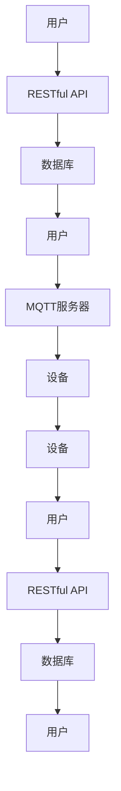

                 

# 基于MQTT协议和RESTful API的智能厨房管理解决方案

## 摘要

本文将探讨基于MQTT协议和RESTful API的智能厨房管理解决方案，旨在为现代厨房管理提供一种高效、稳定且易于扩展的技术框架。通过详细解析MQTT协议和RESTful API的特点及优势，并结合具体应用场景，我们将逐步构建一个具备实时数据监控、设备联动控制和远程操作能力的智能厨房管理系统。此外，本文还将介绍项目实战中的开发环境搭建、核心算法原理、数学模型和公式，以及实际应用场景下的工具和资源推荐。通过阅读本文，读者将全面了解智能厨房管理解决方案的构建方法及其在实际应用中的价值。

## 1. 背景介绍

随着物联网技术的快速发展，智能厨房的概念逐渐普及。智能厨房不仅包括智能冰箱、智能烤箱等家电设备，还涉及到传感器、监控系统、智能厨具等多种智能设备的集成。这些设备通过物联网网络实现互联互通，为用户提供更加便捷、高效、个性化的厨房体验。然而，现代厨房管理面临着诸多挑战，如数据分散、设备联动性差、远程操作不便等。因此，构建一个高效、稳定且易于扩展的智能厨房管理解决方案具有重要意义。

### 1.1 智能厨房管理的现状与挑战

当前，智能厨房管理主要面临以下几个方面的挑战：

1. **数据分散与整合**：智能厨房中的各种设备产生的数据分散在不同的系统中，难以进行有效的整合和分析。
2. **设备联动性**：设备之间的联动性不足，导致操作复杂，用户体验不佳。
3. **远程操作**：用户无法方便地远程监控和操作厨房设备，无法实现远程管理和控制。
4. **安全与稳定性**：智能厨房管理系统需要保证数据安全和系统的稳定性，以防止数据泄露和系统故障。

### 1.2 MQTT协议和RESTful API的优势

为了解决上述挑战，我们可以考虑使用MQTT协议和RESTful API来构建智能厨房管理解决方案。这两种协议各自具有以下优势：

1. **MQTT协议**：
   - **轻量级**：MQTT协议是一种轻量级的消息队列协议，适用于资源受限的设备。
   - **发布/订阅模型**：支持发布/订阅模型，可以实现设备的实时数据监控和设备联动。
   - **低延迟**：低延迟的特性使得MQTT协议非常适合实时数据传输。

2. **RESTful API**：
   - **简单易用**：RESTful API具有统一的接口设计，易于理解和使用。
   - **高度可扩展**：通过定义标准化的接口，RESTful API可以实现系统的快速扩展。
   - **跨平台**：RESTful API支持多种编程语言和平台，具有较好的兼容性。

通过结合MQTT协议和RESTful API，我们可以构建一个高效、稳定且易于扩展的智能厨房管理解决方案，满足现代厨房管理的需求。接下来，我们将详细探讨MQTT协议和RESTful API的核心概念和原理。

## 2. 核心概念与联系

### 2.1 MQTT协议

MQTT（Message Queuing Telemetry Transport）是一种轻量级的消息传输协议，适用于物联网环境中的设备通信。它采用发布/订阅模型，使得设备能够高效地发布和订阅消息。

#### 2.1.1 MQTT协议的特点

1. **轻量级**：MQTT协议的消息格式简单，适用于资源受限的设备。
2. **发布/订阅模型**：设备可以发布消息到特定的主题，其他设备可以订阅这些主题来接收消息。
3. **低延迟**：MQTT协议设计用于实时数据传输，低延迟的特性使其非常适合物联网应用。
4. **可靠性**：MQTT协议提供了消息确认机制，确保消息能够可靠地传输。

#### 2.1.2 MQTT协议的工作原理

MQTT协议的工作原理可以分为以下几个步骤：

1. **连接**：设备通过MQTT客户端连接到MQTT服务器。
2. **发布消息**：设备将消息发布到特定的主题。
3. **订阅主题**：其他设备订阅这些主题，接收发布的消息。
4. **消息确认**：MQTT协议提供了消息确认机制，确保消息能够可靠地传输。

#### 2.1.3 MQTT协议的架构

MQTT协议的架构包括以下几个主要部分：

1. **MQTT客户端**：设备作为MQTT客户端，负责发布和订阅消息。
2. **MQTT服务器**：MQTT服务器接收和处理来自MQTT客户端的消息。
3. **主题**：主题是消息的分类标识，设备可以发布和订阅特定的主题。

### 2.2 RESTful API

RESTful API（Representational State Transfer API）是一种基于HTTP协议的接口设计方法，用于实现不同系统之间的数据交互。

#### 2.2.1 RESTful API的特点

1. **简单易用**：RESTful API采用统一接口设计，易于理解和使用。
2. **高度可扩展**：通过定义标准化的接口，RESTful API可以实现系统的快速扩展。
3. **跨平台**：RESTful API支持多种编程语言和平台，具有较好的兼容性。
4. **无状态**：RESTful API采用无状态设计，每个请求都是独立的，无需保留之前的请求状态。

#### 2.2.2 RESTful API的工作原理

RESTful API的工作原理可以分为以下几个步骤：

1. **请求**：客户端向服务器发送HTTP请求，包含请求方法和路径。
2. **处理**：服务器根据请求方法和路径处理请求，并返回相应的响应。
3. **响应**：服务器返回HTTP响应，包含请求结果和数据。

#### 2.2.3 RESTful API的架构

RESTful API的架构包括以下几个主要部分：

1. **客户端**：客户端通过发送HTTP请求与服务器进行交互。
2. **服务器**：服务器接收和处理来自客户端的HTTP请求。
3. **资源**：资源是API操作的对象，可以通过URL进行访问。

### 2.3 MQTT协议和RESTful API的联系

MQTT协议和RESTful API可以相互补充，构建一个完整的智能厨房管理解决方案。具体来说，MQTT协议可以用于实时数据传输和设备联动，而RESTful API可以用于远程操作和数据访问。

1. **数据传输**：MQTT协议可以实时传输厨房设备的数据，如温度、湿度、设备状态等。
2. **设备联动**：通过MQTT协议，不同设备可以实时交换信息，实现联动控制。
3. **远程操作**：通过RESTful API，用户可以远程监控和操作厨房设备。
4. **数据存储**：RESTful API可以用于将实时数据存储到数据库中，方便后续的数据分析和处理。

### 2.4 MQTT协议和RESTful API的 Mermaid 流程图

下面是MQTT协议和RESTful API在智能厨房管理解决方案中的 Mermaid 流程图：



### 2.5 MQTT协议和RESTful API的优势和挑战

#### 2.5.1 优势

1. **实时数据传输**：MQTT协议支持实时数据传输，可以实现厨房设备的实时监控和联动。
2. **简单易用**：RESTful API具有统一的接口设计，易于理解和使用，便于开发者进行开发。
3. **高度可扩展**：RESTful API可以实现系统的快速扩展，满足厨房管理系统的需求。
4. **跨平台**：MQTT协议和RESTful API都支持多种编程语言和平台，具有良好的兼容性。

#### 2.5.2 挑战

1. **安全性**：由于厨房设备可能涉及敏感数据，确保数据传输的安全性是重要挑战。
2. **稳定性**：智能厨房管理系统需要保证系统的稳定性，以防止设备故障和通信中断。
3. **性能优化**：在大量设备同时通信时，如何优化MQTT协议和RESTful API的性能是关键挑战。

### 2.6 结论

MQTT协议和RESTful API在智能厨房管理解决方案中具有显著的优势，可以实现实时数据传输、设备联动和远程操作。然而，在实际应用中，仍需要关注安全性、稳定性和性能优化等方面的问题。通过合理设计系统架构和选用合适的工具，可以构建一个高效、稳定且易于扩展的智能厨房管理解决方案。

## 3. 核心算法原理 & 具体操作步骤

### 3.1 MQTT协议的算法原理

MQTT（Message Queuing Telemetry Transport）协议的核心算法原理主要基于发布/订阅模型，这一模型使得设备能够高效地进行消息的发布和订阅。下面，我们将详细解释MQTT协议的核心算法原理及其具体操作步骤。

#### 3.1.1 发布/订阅模型

发布/订阅模型是一种消息传递范式，其中消息的发布者（称为发布者，Publisher）将消息发布到特定的主题（Topic），而消息的订阅者（称为订阅者，Subscriber）可以订阅这些主题，以接收发布者的消息。这一模型的特点是解耦合，即发布者和订阅者无需知道对方的存在，它们通过主题进行通信。

#### 3.1.2 MQTT协议的主要算法步骤

1. **连接（Connect）**：客户端首先连接到MQTT服务器。连接过程中，客户端需要发送一个Connect消息，其中包含客户端标识、会话信息等。

2. **订阅（Subscribe）**：客户端连接成功后，可以订阅一个或多个主题。订阅过程中，客户端发送一个Subscribe消息，其中包含要订阅的主题列表。

3. **发布（Publish）**：设备将数据发布到特定的主题。发布过程中，设备发送一个Publish消息，其中包含主题和消息数据。

4. **订阅消息处理（Message Handling）**：MQTT服务器接收到Publish消息后，将其转发给订阅了相应主题的客户端。

5. **消息确认（Acknowledgement）**：为了确保消息的可靠传输，MQTT协议提供了消息确认机制。订阅者接收到消息后，需要发送一个Acknowledgement消息，通知MQTT服务器消息已成功接收。

6. **断开连接（Disconnect）**：当客户端不再需要服务时，可以发送一个Disconnect消息，断开与MQTT服务器的连接。

#### 3.1.3 MQTT协议的具体操作步骤示例

1. **客户端连接到MQTT服务器**：
   客户端首先发起TCP连接，然后发送一个Connect消息。例如：
   ```plaintext
   Connect {
     Protocol Version: 3
     Client ID: "clientA"
     Clean Session: true
     Keep Alive: 60
   }
   ```

2. **客户端订阅主题**：
   连接成功后，客户端发送一个Subscribe消息，订阅主题“kitchen/temperature”：
   ```plaintext
   Subscribe {
     Topic Filters: ["kitchen/temperature"]
     QoS Levels: [0]
   }
   ```

3. **设备发布温度数据**：
   设备将温度数据发布到主题“kitchen/temperature”：
   ```plaintext
   Publish {
     Topic: "kitchen/temperature"
     Message: "25.5"
     QoS: 0
   }
   ```

4. **客户端接收温度数据**：
   客户端接收到Publish消息后，发送一个Acknowledgement消息：
   ```plaintext
   Acknowledgement {
     Message ID: 1
   }
   ```

5. **客户端断开连接**：
   当不再需要服务时，客户端发送一个Disconnect消息：
   ```plaintext
   Disconnect {
   }
   ```

### 3.2 RESTful API的算法原理

RESTful API（Representational State Transfer API）是一种基于HTTP协议的接口设计方法，其核心算法原理主要基于HTTP请求和响应。下面，我们将详细解释RESTful API的核心算法原理及其具体操作步骤。

#### 3.2.1 HTTP请求和响应

RESTful API的工作过程主要基于HTTP请求和响应。客户端通过发送HTTP请求来请求服务器上的资源，而服务器则通过发送HTTP响应来返回请求的结果。

1. **请求**：客户端发送HTTP请求，包含请求方法（如GET、POST、PUT、DELETE等）、请求URL、请求头和请求体。

2. **响应**：服务器接收请求后，根据请求方法和URL处理请求，并返回HTTP响应，包含响应状态码、响应头和响应体。

#### 3.2.2 RESTful API的主要算法步骤

1. **初始化API**：开发者首先需要定义API的URL、请求方法和参数。

2. **发送请求**：客户端通过HTTP请求发送请求到服务器。

3. **处理请求**：服务器根据请求方法和URL处理请求，并返回相应的响应。

4. **处理响应**：客户端接收HTTP响应，并根据响应结果进行相应的操作。

5. **异常处理**：在处理请求和响应过程中，可能遇到各种异常情况，如网络故障、服务器错误等，需要对其进行处理。

#### 3.2.3 RESTful API的具体操作步骤示例

1. **客户端发送GET请求**：
   客户端发送一个GET请求，获取厨房设备的温度数据：
   ```plaintext
   GET /api/kitchen/temperature
   ```

2. **服务器处理请求**：
   服务器接收到GET请求后，查询数据库获取温度数据，并返回HTTP响应：
   ```plaintext
   HTTP/1.1 200 OK
   Content-Type: application/json

   {
     "temperature": "25.5"
   }
   ```

3. **客户端接收并处理响应**：
   客户端接收到HTTP响应后，解析响应数据，并显示温度值。

4. **客户端发送POST请求**：
   客户端发送一个POST请求，设置厨房设备的温度：
   ```plaintext
   POST /api/kitchen/temperature
   Content-Type: application/json

   {
     "temperature": "27.0"
   }
   ```

5. **服务器处理请求**：
   服务器接收到POST请求后，更新数据库中的温度数据，并返回HTTP响应：
   ```plaintext
   HTTP/1.1 200 OK
   Content-Type: application/json

   {
     "message": "Temperature set successfully"
   }
   ```

### 3.3 MQTT协议和RESTful API的算法原理总结

MQTT协议和RESTful API在算法原理上各有特点。MQTT协议主要基于发布/订阅模型，实现实时数据传输和设备联动，适用于物联网环境中的消息传递。RESTful API则主要基于HTTP请求和响应，实现远程操作和数据访问，适用于Web服务和应用程序的接口设计。

通过结合MQTT协议和RESTful API，可以构建一个高效的智能厨房管理解决方案，实现实时数据监控、设备联动控制和远程操作。在实际应用中，需要根据具体需求选择合适的协议和接口设计方法，以达到最佳的系统性能和用户体验。

## 4. 数学模型和公式 & 详细讲解 & 举例说明

在智能厨房管理解决方案中，数学模型和公式用于描述设备和系统的行为，帮助理解和优化系统性能。以下是一些常用的数学模型和公式，并进行详细讲解和举例说明。

### 4.1 MQTT协议中的QoS等级

MQTT协议中的质量服务（QoS）等级用于确保消息的传输可靠性和一致性。MQTT协议定义了三种QoS等级：QoS 0、QoS 1 和 QoS 2。

#### 4.1.1 QoS等级的数学模型

QoS等级的数学模型可以表示为：

$$ QoS_{level} = \begin{cases} 
0 & \text{如果消息传输不保证；} \\
1 & \text{如果消息传输至少一次；} \\
2 & \text{如果消息传输恰好一次。} 
\end{cases} $$

#### 4.1.2 详细讲解

1. **QoS 0**：消息传输不保证。消息一旦发布，立即发送到MQTT服务器，但不会进行确认。适用于对实时性要求较高的应用场景。

2. **QoS 1**：消息传输至少一次。消息发送后，MQTT服务器会发送确认（Acknowledgement）消息给客户端，确保消息至少被服务器接收一次。适用于对消息传输的可靠性要求较高的应用场景。

3. **QoS 2**：消息传输恰好一次。消息发送后，客户端会发送两个确认消息给MQTT服务器。第一个确认消息表示消息已被服务器接收，第二个确认消息表示消息已正确传递到订阅者。适用于对消息传输的可靠性要求极高的应用场景。

#### 4.1.3 举例说明

假设有一个厨房设备需要发布温度数据，并且希望确保数据至少传输一次。该设备可以选择QoS 1等级进行发布。

- 设备发布消息：
  ```plaintext
  Publish {
    Topic: "kitchen/temperature"
    Message: "25.5"
    QoS: 1
  }
  ```

- MQTT服务器发送确认消息：
  ```plaintext
  Acknowledgement {
    Message ID: 123
  }
  ```

通过QoS 1等级，可以确保消息至少被MQTT服务器接收一次，从而保证数据的可靠性传输。

### 4.2 RESTful API中的HTTP状态码

在RESTful API中，HTTP状态码用于表示服务器对客户端请求的处理结果。HTTP状态码的数学模型可以表示为：

$$ Status_{code} = \begin{cases} 
1xx & \text{信息性响应；} \\
2xx & \text{成功；} \\
3xx & \text{重定向；} \\
4xx & \text{客户端错误；} \\
5xx & \text{服务器错误。} 
\end{cases} $$

#### 4.2.2 详细讲解

1. **1xx 信息性响应**：指示请求已被接收，继续处理。
2. **2xx 成功**：指示请求已成功处理，返回预期的数据。
3. **3xx 重定向**：指示需要进一步操作以完成请求，通常返回重定向的URL。
4. **4xx 客户端错误**：指示客户端请求中有错误，如请求方法不支持、请求参数错误等。
5. **5xx 服务器错误**：指示服务器处理请求时出现错误，如服务器内部错误、服务器不可用等。

#### 4.2.3 举例说明

假设客户端请求获取厨房设备的温度数据，服务器返回HTTP状态码。

- 客户端发送GET请求：
  ```plaintext
  GET /api/kitchen/temperature
  ```

- 服务器返回HTTP响应：
  ```plaintext
  HTTP/1.1 200 OK
  Content-Type: application/json

  {
    "temperature": "25.5"
  }
  ```

这里，服务器返回的状态码是200 OK，表示请求已成功处理，温度数据返回在响应体中。

### 4.3 数据传输延迟模型

在智能厨房管理中，数据传输延迟是一个重要指标，影响系统的实时性和响应速度。数据传输延迟模型可以表示为：

$$ Delay = f(Transmit\_Time, Processing\_Time, Network\_Time) $$

#### 4.3.2 详细讲解

1. **Transmit Time**：设备将数据发送到MQTT服务器的耗时。
2. **Processing Time**：MQTT服务器处理数据并转发到订阅者的耗时。
3. **Network Time**：数据在网络中传输的耗时。

#### 4.3.3 举例说明

假设设备将温度数据发送到MQTT服务器，服务器处理数据并转发到订阅者，传输延迟模型如下：

- **Transmit Time**：0.1秒
- **Processing Time**：0.2秒
- **Network Time**：0.3秒

总传输延迟为0.6秒。

通过分析数据传输延迟模型，可以优化设备的数据发送频率、MQTT服务器的处理能力以及网络带宽，从而降低系统的传输延迟。

### 4.4 总结

数学模型和公式在智能厨房管理解决方案中起到关键作用，用于描述设备和系统的行为。通过QoS等级、HTTP状态码和数据传输延迟模型，可以更好地理解和优化系统性能。在实际应用中，可以根据具体需求选择合适的数学模型和公式，以提高系统的实时性和可靠性。

## 5. 项目实战：代码实际案例和详细解释说明

### 5.1 开发环境搭建

在构建基于MQTT协议和RESTful API的智能厨房管理解决方案时，首先需要搭建开发环境。以下是搭建开发环境的步骤：

#### 5.1.1 安装MQTT服务器

1. **下载并安装Eclipse Mosquitto**：Eclipse Mosquitto是一个开源的MQTT代理服务器，可以从官网[https://mosquitto.org/](https://mosquitto.org/)下载。根据操作系统选择相应的安装包。

2. **启动MQTT服务器**：安装完成后，运行Eclipse Mosquitto服务器。在命令行输入以下命令启动服务器：
   ```bash
   mosquitto -d
   ```

   `-d` 参数表示以守护进程模式运行，确保服务器在后台持续运行。

#### 5.1.2 安装RESTful API开发框架

1. **选择开发框架**：选择一个合适的RESTful API开发框架，如Node.js、Python Flask或Java Spring Boot。

2. **安装开发框架**：以Node.js为例，使用npm安装Express框架：
   ```bash
   npm install express
   ```

3. **启动RESTful API服务器**：编写代码启动RESTful API服务器，例如：
   ```javascript
   const express = require('express');
   const app = express();
   const port = 3000;

   app.get('/', (req, res) => {
     res.send('RESTful API Server is running');
   });

   app.listen(port, () => {
     console.log(`RESTful API Server listening at http://localhost:${port}`);
   });
   ```

   运行以下命令启动服务器：
   ```bash
   node server.js
   ```

### 5.2 源代码详细实现和代码解读

#### 5.2.1 MQTT客户端代码实现

在智能厨房管理解决方案中，MQTT客户端负责发布和订阅消息。以下是一个使用Python的paho-mqtt库实现的MQTT客户端示例。

```python
import paho.mqtt.client as mqtt

# MQTT服务器地址和端口
MQTT_SERVER = "localhost"
MQTT_PORT = 1883
MQTT_TOPIC = "kitchen/temperature"

# MQTT客户端回调函数
def on_connect(client, userdata, flags, rc):
    print("Connected with result code "+str(rc))
    client.subscribe(MQTT_TOPIC)

def on_message(client, userdata, msg):
    print(f"Received message '{str(msg.payload)}' on topic '{msg.topic}' with QoS {msg.qos}")

# 创建MQTT客户端实例
client = mqtt.Client()

# 绑定回调函数
client.on_connect = on_connect
client.on_message = on_message

# 连接到MQTT服务器
client.connect(MQTT_SERVER, MQTT_PORT, 60)

# 启动MQTT客户端循环
client.loop_start()

# 发布消息
client.publish(MQTT_TOPIC, "25.5", qos=1)

# 运行一段时间后断开连接
client.disconnect()
```

**代码解读**：

1. 导入paho-mqtt库，用于创建MQTT客户端实例。

2. 设置MQTT服务器地址、端口和订阅的主题。

3. 定义`on_connect`回调函数，当客户端连接成功时，订阅主题。

4. 定义`on_message`回调函数，当接收到消息时，打印消息内容。

5. 创建MQTT客户端实例，绑定回调函数。

6. 连接到MQTT服务器。

7. 启动MQTT客户端循环，使客户端持续运行。

8. 发布消息到主题。

9. 运行一段时间后，断开连接。

#### 5.2.2 RESTful API服务器代码实现

在RESTful API服务器中，我们使用Express框架创建API接口，处理GET和POST请求。

```javascript
const express = require('express');
const app = express();
const port = 3000;

// 解析请求体中的JSON数据
app.use(express.json());

// GET请求获取温度数据
app.get('/api/kitchen/temperature', (req, res) => {
  // 从数据库中查询温度数据
  const temperature = 25.5;
  res.json({ temperature });
});

// POST请求设置温度
app.post('/api/kitchen/temperature', (req, res) => {
  // 获取请求体中的温度数据
  const { temperature } = req.body;

  // 更新数据库中的温度数据
  // ...

  res.json({ message: 'Temperature set successfully' });
});

app.listen(port, () => {
  console.log(`RESTful API Server listening at http://localhost:${port}`);
});
```

**代码解读**：

1. 导入Express框架，创建服务器实例。

2. 使用`express.json()`中间件解析请求体中的JSON数据。

3. 定义GET请求处理函数，获取温度数据并返回。

4. 定义POST请求处理函数，设置温度并返回成功消息。

5. 启动服务器，监听指定端口。

### 5.3 代码解读与分析

#### 5.3.1 MQTT客户端代码分析

MQTT客户端代码实现了一个简单的发布者，用于发布温度数据。代码中，我们使用了paho-mqtt库创建MQTT客户端实例，并定义了连接成功和接收消息的回调函数。通过订阅主题，客户端可以接收到其他设备发布的温度数据。这个示例展示了如何使用MQTT协议实现实时数据传输和设备联动。

#### 5.3.2 RESTful API服务器代码分析

RESTful API服务器代码使用Express框架创建了一个简单的API接口，处理GET和POST请求。GET请求用于获取温度数据，POST请求用于设置温度。服务器通过解析请求体中的JSON数据，与数据库进行交互，实现温度数据的存储和查询。这个示例展示了如何使用RESTful API实现远程操作和数据访问。

### 5.4 代码优化和扩展

在实际应用中，代码需要进行优化和扩展，以满足不同的需求。以下是一些建议：

1. **使用数据库连接池**：为了避免频繁地打开和关闭数据库连接，可以使用数据库连接池技术，提高系统的性能和稳定性。

2. **使用中间件进行日志记录和错误处理**：使用中间件可以方便地记录请求日志和错误信息，帮助调试和监控服务器。

3. **使用认证和授权机制**：为了确保API的安全性，可以引入认证和授权机制，如JWT（JSON Web Token）或OAuth。

4. **使用消息队列**：为了实现更高效的消息处理，可以使用消息队列技术，如RabbitMQ或Kafka。

通过以上优化和扩展，可以构建一个高效、稳定且安全的智能厨房管理解决方案。

## 6. 实际应用场景

智能厨房管理解决方案可以广泛应用于家庭、餐厅、酒店等场景，为用户提供智能化、便捷化的厨房体验。以下是一些典型的实际应用场景：

### 6.1 家庭厨房管理

在家庭厨房中，智能厨房管理解决方案可以实时监控厨房设备的状态，如烤箱、冰箱、炉灶等。用户可以通过手机APP远程控制厨房设备，如调整烤箱的温度、设置冰箱的冷藏温度等。此外，智能厨房管理解决方案还可以记录厨房设备的运行数据，如使用频率、耗电量等，帮助用户更好地管理家庭厨房。

#### 6.1.1 案例一：远程控制烤箱

1. **用户通过手机APP连接到智能厨房管理系统**。
2. **用户在APP上发送远程控制指令，如调整烤箱温度**。
3. **智能厨房管理系统接收指令，通过MQTT协议发送到烤箱设备**。
4. **烤箱设备接收指令，调整温度并返回确认信息**。
5. **用户在APP上收到烤箱设备的确认信息，确认操作成功**。

### 6.2 餐厅厨房管理

在餐厅厨房中，智能厨房管理解决方案可以帮助餐厅实现高效的厨房管理，提高服务质量和效率。例如，智能厨房管理解决方案可以实时监控厨房设备的运行状态，如炉灶的温度、烤炉的火力等，确保厨房设备始终处于最佳状态。此外，智能厨房管理解决方案还可以实现厨房设备的自动联动，如当炉灶温度过高时，自动启动冷却系统。

#### 6.2.1 案例二：智能联动控制

1. **智能厨房管理系统实时监控厨房设备状态**。
2. **当炉灶温度过高时，系统自动发送冷却指令到冷却设备**。
3. **冷却设备接收指令，启动冷却系统**。
4. **智能厨房管理系统接收冷却设备的确认信息，记录冷却时间**。
5. **系统自动调整炉灶火力，确保烹饪效果和安全性**。

### 6.3 酒店厨房管理

在酒店厨房中，智能厨房管理解决方案可以帮助酒店实现高效、安全的厨房管理。例如，智能厨房管理解决方案可以实时监控厨房设备的运行状态，如烤箱、冰箱、冷藏柜等，确保设备始终处于最佳状态。此外，智能厨房管理解决方案还可以实现厨房设备的远程监控和操作，方便酒店管理人员随时了解厨房设备的状态。

#### 6.3.1 案例三：远程监控和操作

1. **酒店管理人员通过手机APP连接到智能厨房管理系统**。
2. **管理人员在APP上查看厨房设备状态，如烤箱温度、冰箱冷藏温度等**。
3. **管理人员在APP上发送操作指令，如调整烤箱温度、启动冷藏柜**。
4. **智能厨房管理系统接收指令，通过MQTT协议发送到厨房设备**。
5. **厨房设备接收指令，执行操作并返回确认信息**。
6. **管理人员在APP上收到厨房设备的确认信息，确认操作成功**。

通过以上实际应用场景，我们可以看到智能厨房管理解决方案在家庭、餐厅和酒店等场景中的广泛应用。它不仅提高了用户的厨房体验，还提高了厨房管理的效率和安全性。随着物联网技术的不断发展，智能厨房管理解决方案将更好地满足人们对智能化、便捷化厨房的需求。

## 7. 工具和资源推荐

在构建基于MQTT协议和RESTful API的智能厨房管理解决方案时，选择合适的工具和资源对于项目的成功至关重要。以下是一些建议和推荐：

### 7.1 学习资源推荐

1. **书籍**：
   - 《MQTT Essentials》
   - 《RESTful API Design Rulebook》
   - 《The Internet of Things: Next Steps》

2. **论文**：
   - "MQTT: A Message Protocol for the Internet of Things"
   - "RESTful API Design: Creating and Using Reusable Resources"

3. **博客和网站**：
   - [Eclipse Mosquitto官网](https://mosquitto.org/)
   - [Express.js官网](https://expressjs.com/)
   - [Flask官网](https://flask.palletsprojects.com/)

### 7.2 开发工具框架推荐

1. **MQTT服务器**：
   - **Eclipse Mosquitto**：开源的MQTT代理服务器，适用于大多数物联网应用。
   - **Paho MQTT**：开源的MQTT客户端库，支持多种编程语言，适用于各种开发环境。

2. **RESTful API框架**：
   - **Express.js**：流行的Node.js Web框架，用于构建高性能的RESTful API。
   - **Flask**：Python的Web框架，简单易用，适合快速开发RESTful API。
   - **Spring Boot**：Java的Web框架，功能丰富，支持多种开发模式。

### 7.3 相关论文著作推荐

1. **《The Design of the MPEG-21 Digital Item Declaration Standard》**：详细介绍了数字项声明标准的设计，对理解智能厨房管理中的数据模型和标准化有重要参考价值。

2. **《Design of a RESTful Interface for Web Services》**：介绍了RESTful接口的设计原则，对构建高效的RESTful API有指导意义。

3. **《Design and Implementation of an Open IoT Platform for Smart Kitchen Applications》**：探讨了一种智能厨房应用的开源物联网平台设计，为智能厨房管理解决方案提供了参考架构。

### 7.4 总结

通过选择合适的工具和资源，可以加速智能厨房管理解决方案的开发和部署。这些书籍、论文、博客和网站提供了丰富的理论知识和实践经验，有助于开发者更好地理解和应用MQTT协议和RESTful API，构建高效、稳定且易于扩展的智能厨房管理系统。

## 8. 总结：未来发展趋势与挑战

随着物联网技术的不断发展和普及，智能厨房管理解决方案正逐渐成为现代家庭、餐厅和酒店等场所的重要设施。在未来，智能厨房管理解决方案将朝着更加智能化、便捷化和安全化的方向发展。以下是一些未来发展趋势和挑战：

### 8.1 发展趋势

1. **智能设备的普及**：随着智能家电的不断推出，智能厨房管理解决方案中的设备种类和数量将大幅增加，实现更加全面的厨房设备管理和控制。

2. **大数据分析**：通过收集和分析厨房设备的数据，可以更好地了解用户的使用习惯和需求，为优化厨房设备和系统提供有力支持。

3. **人工智能的融合**：人工智能技术的引入将使智能厨房管理解决方案具备更加智能的预测和决策能力，如自动调整烹饪参数、预测设备故障等。

4. **跨平台兼容性**：随着智能设备的多样化，智能厨房管理解决方案需要具备更高的跨平台兼容性，支持多种操作系统和设备。

5. **隐私保护**：在数据传输和处理过程中，智能厨房管理解决方案需要严格保护用户的隐私和数据安全，防止数据泄露和滥用。

### 8.2 挑战

1. **数据安全性**：智能厨房管理解决方案涉及大量敏感数据，如用户个人信息、设备运行状态等，如何确保数据传输和存储的安全性是关键挑战。

2. **系统稳定性**：随着设备数量的增加，如何保证系统在高并发、高负载情况下的稳定性是一个重要挑战。

3. **性能优化**：如何在高并发、高延迟的网络环境中实现高效的数据传输和处理，提高系统性能，是一个亟待解决的问题。

4. **用户界面**：如何设计友好、直观的用户界面，使用户能够轻松上手并高效使用智能厨房管理解决方案，是未来需要关注的重要方向。

5. **标准化**：智能厨房管理解决方案需要遵循统一的协议和标准，以确保不同设备之间的兼容性和互操作性。

### 8.3 发展建议

1. **加强安全防护**：引入先进的安全技术和算法，如加密传输、认证和授权等，确保数据传输和存储的安全性。

2. **优化系统架构**：采用分布式架构和微服务架构，提高系统的可扩展性和稳定性。

3. **提升用户体验**：设计直观、简洁的用户界面，使用户能够轻松上手并高效使用智能厨房管理解决方案。

4. **开放生态合作**：与其他企业和开发者合作，共同推进智能厨房管理解决方案的技术创新和生态建设。

5. **持续技术投入**：加大在人工智能、大数据、物联网等领域的研发投入，保持技术领先优势。

通过关注未来发展趋势和挑战，并采取相应的措施，智能厨房管理解决方案将在未来获得更加广泛的应用，为用户提供更加智能化、便捷化的厨房体验。

## 9. 附录：常见问题与解答

### 9.1 MQTT协议相关问题

#### Q1：什么是MQTT协议？

A1：MQTT（Message Queuing Telemetry Transport）是一种轻量级的消息传输协议，适用于物联网环境中的设备通信。它采用发布/订阅模型，支持实时数据传输和设备联动。

#### Q2：MQTT协议有哪些QoS等级？

A2：MQTT协议定义了三种QoS等级：QoS 0（不保证传输）、QoS 1（至少一次传输）和QoS 2（恰好一次传输）。这些等级决定了消息传输的可靠性和一致性。

#### Q3：如何选择合适的MQTT QoS等级？

A3：根据应用场景选择合适的QoS等级。如果对实时性要求较高，可以选择QoS 0；如果对消息传输的可靠性要求较高，可以选择QoS 1或QoS 2。

#### Q4：MQTT协议如何保证数据传输的安全性？

A4：MQTT协议本身不提供加密功能，但可以通过SSL/TLS等加密协议保证数据传输的安全性。此外，可以使用认证和授权机制，确保只有授权设备可以访问MQTT服务器。

### 9.2 RESTful API相关问题

#### Q1：什么是RESTful API？

A1：RESTful API（Representational State Transfer API）是一种基于HTTP协议的接口设计方法，用于实现不同系统之间的数据交互。它采用统一接口设计，易于理解和使用。

#### Q2：RESTful API有哪些常用HTTP状态码？

A2：RESTful API常用的HTTP状态码包括：200 OK（成功）、404 Not Found（未找到）、400 Bad Request（请求错误）、500 Internal Server Error（服务器内部错误）等。

#### Q3：如何设计高效的RESTful API？

A3：设计高效的RESTful API需要注意以下几点：
- 使用标准化的接口设计，确保接口易于理解和使用。
- 设计简洁的URL结构，避免过多的参数和路径。
- 使用适当的HTTP方法（如GET、POST、PUT、DELETE等）。
- 优化响应数据格式，如使用JSON格式。
- 引入缓存机制，减少重复请求。

### 9.3 智能厨房管理相关问题

#### Q1：智能厨房管理解决方案有哪些优势？

A1：智能厨房管理解决方案具有以下优势：
- 实时数据监控：通过MQTT协议实现设备的实时数据传输和监控。
- 设备联动控制：实现设备之间的联动控制，提高厨房管理效率。
- 远程操作：用户可以远程监控和操作厨房设备，提高便利性。
- 数据分析：通过大数据分析，了解用户需求和优化厨房管理。

#### Q2：如何确保智能厨房管理系统的安全性？

A2：确保智能厨房管理系统的安全性需要采取以下措施：
- 数据加密：对数据传输进行加密，防止数据泄露。
- 认证和授权：引入认证和授权机制，确保只有授权设备可以访问系统。
- 安全监控：对系统进行安全监控，及时发现和应对安全威胁。
- 安全培训：对用户进行安全培训，提高安全意识。

### 9.4 常见问题解答总结

通过以上常见问题与解答，读者可以更好地了解MQTT协议、RESTful API和智能厨房管理解决方案的相关知识，为实际应用提供指导和参考。

## 10. 扩展阅读 & 参考资料

为了深入理解基于MQTT协议和RESTful API的智能厨房管理解决方案，读者可以参考以下扩展阅读和参考资料：

### 10.1 书籍推荐

1. **《物联网：概念、架构与实现》**：详细介绍了物联网的基本概念、架构和实现技术，包括MQTT协议和RESTful API。
2. **《RESTful API设计》**：探讨了RESTful API的设计原则和最佳实践，提供了丰富的实际案例和代码示例。
3. **《智能厨房设计与实现》**：从实际应用角度出发，介绍了智能厨房的设计理念、技术和实现方法。

### 10.2 论文推荐

1. **"MQTT: A Message Protocol for the Internet of Things"**：该论文详细介绍了MQTT协议的原理和设计，是了解MQTT协议的重要文献。
2. **"Design and Implementation of an Open IoT Platform for Smart Kitchen Applications"**：该论文探讨了智能厨房物联网平台的设计和实现，提供了实用的参考架构。
3. **"RESTful API Design: Creating and Using Reusable Resources"**：该论文介绍了RESTful API的设计原则和实现方法，对构建高效的RESTful API有重要指导意义。

### 10.3 博客和网站推荐

1. **[Eclipse Mosquitto官网](https://mosquitto.org/)**：提供了MQTT协议相关的文档、工具和社区资源，是学习MQTT协议的绝佳平台。
2. **[RESTful API设计指南](https://restfulapi.net/)**：该网站提供了关于RESTful API设计的详细教程和最佳实践，有助于提高API设计的质量。
3. **[物联网技术研究](https://iot.ruimac.com/)**：该博客分享了许多关于物联网技术的文章和案例，包括智能厨房管理解决方案的探讨。

通过阅读以上书籍、论文和网站，读者可以进一步深入了解基于MQTT协议和RESTful API的智能厨房管理解决方案，为实际应用提供更加全面的理论和实践支持。

