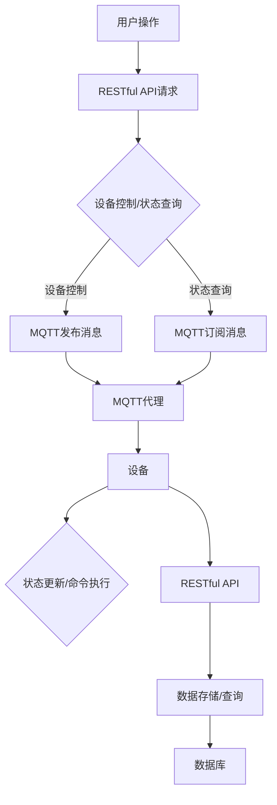

                 

### 背景介绍

随着物联网技术的迅速发展，智能家居系统已经成为现代家庭中不可或缺的一部分。智能家居系统通过将各种家庭设备联网，实现设备之间的互联互通，从而提供更加便捷、智能化的生活体验。然而，要实现这一目标，就需要一个稳定、高效、安全的通信协议来支撑整个系统。

在众多通信协议中，MQTT（Message Queuing Telemetry Transport）协议和RESTful API（Representation State Transfer Application Programming Interface）成为两大热门选择。MQTT协议是一种轻量级的消息队列协议，适用于低带宽、不可靠的网络环境，而RESTful API则是一种基于HTTP协议的接口设计规范，广泛应用于分布式系统中的数据交互。

本文旨在探讨基于MQTT协议和RESTful API的智能家居远程监控系统的设计与应用。通过对这两种协议的深入分析，我们将从技术原理、实际操作、应用场景等多个角度，全面解析智能家居远程监控系统的实现方案。

### 什么是MQTT协议

MQTT（Message Queuing Telemetry Transport）是一种轻量级的消息队列协议，最初由IBM公司开发，旨在用于连接远程传感器和控制设备。它具有简单、低带宽占用、可扩展性强等特点，非常适合在物联网环境中使用。

#### MQTT协议的核心特点

1. **发布/订阅模式**：MQTT协议采用发布/订阅模式，消息的发送者（发布者）将消息发布到特定的主题（Topic），而消息的接收者（订阅者）可以订阅这些主题，从而获取到发布者的消息。

2. **轻量级协议**：MQTT协议的消息格式非常简单，数据传输效率高，适合在带宽受限的环境中运行。

3. **可靠性**：MQTT协议支持消息确认机制，确保消息能够可靠地传输到接收者。

4. **可扩展性强**：MQTT协议可以轻松扩展，支持多种传输层协议，如TCP、UDP等。

#### MQTT协议的工作原理

MQTT协议的工作过程可以概括为以下几个步骤：

1. **连接**：客户端（订阅者或发布者）首先连接到服务器（MQTT代理），并创建一个TCP连接。

2. **订阅主题**：客户端向服务器订阅感兴趣的主题，服务器根据订阅信息存储客户端的回调函数。

3. **发布消息**：客户端将消息发布到特定的主题，服务器将消息分发给所有订阅该主题的客户端。

4. **断开连接**：客户端完成通信后，可以主动或被动地断开与服务器的连接。

### 什么是RESTful API

RESTful API（Representation State Transfer Application Programming Interface）是一种基于HTTP协议的接口设计规范，用于实现分布式系统之间的数据交互。RESTful API遵循REST设计原则，通过统一接口设计，实现简单、高效、可扩展的API交互。

#### RESTful API的核心特点

1. **无状态**：RESTful API是无状态的，每次请求都是独立的，服务器不会存储任何关于客户端的状态信息。

2. **统一接口**：RESTful API使用统一的接口设计，包括GET、POST、PUT、DELETE等HTTP方法，以及URI（统一资源标识符）进行资源定位。

3. **状态转移**：客户端通过发送请求，触发服务器的状态转移，从而实现数据操作。

4. **数据格式**：RESTful API通常使用JSON或XML格式传输数据，便于解析和处理。

#### RESTful API的工作原理

RESTful API的工作原理可以概括为以下几个步骤：

1. **请求**：客户端向服务器发送请求，包含请求方法、路径、请求头等信息。

2. **处理**：服务器根据请求信息处理请求，执行相应的操作。

3. **响应**：服务器将处理结果以JSON或XML格式返回给客户端。

### MQTT协议与RESTful API在智能家居远程监控系统中的应用

在智能家居远程监控系统中，MQTT协议和RESTful API各有所长，可以相互补充，共同实现系统的高效运行。

#### MQTT协议在智能家居远程监控系统中的作用

1. **设备状态监控**：MQTT协议可以实时监控家庭设备的运行状态，如温度、湿度、光照等，将数据发送到服务器。

2. **设备控制**：通过MQTT协议，用户可以远程控制家庭设备，如开关灯、调整空调温度等。

3. **消息传递**：MQTT协议支持消息传递功能，可以用于实现家庭设备之间的通信，如门铃、摄像头等。

#### RESTful API在智能家居远程监控系统中的作用

1. **设备配置**：RESTful API可以用于设备配置，如设置设备名称、修改设备参数等。

2. **用户管理**：RESTful API可以用于用户管理，如注册、登录、权限验证等。

3. **数据存储与查询**：RESTful API可以用于数据存储与查询，如存储设备状态数据、历史数据查询等。

#### MQTT协议与RESTful API的协同工作

在智能家居远程监控系统中，MQTT协议和RESTful API可以协同工作，发挥各自的优势：

1. **设备状态监控**：通过MQTT协议，实时监控家庭设备的运行状态，将数据发送到服务器。

2. **设备控制**：用户通过RESTful API发起设备控制请求，服务器根据请求发送MQTT消息，控制家庭设备。

3. **数据存储与查询**：将MQTT协议采集到的设备状态数据存储到数据库，并通过RESTful API提供数据查询接口。

### 总结

本文介绍了MQTT协议和RESTful API的基本概念和原理，并探讨了它们在智能家居远程监控系统中的应用。通过协同工作，MQTT协议和RESTful API可以共同实现智能家居远程监控系统的功能，为用户提供便捷、智能化的家居体验。在接下来的章节中，我们将深入分析MQTT协议和RESTful API的核心概念与联系，为后续的实战应用奠定基础。

<markdown>

## 2. 核心概念与联系

### MQTT协议的核心概念与架构

MQTT协议的核心概念包括发布者（Publisher）、订阅者（Subscriber）和代理（Broker）。这三个实体在MQTT协议中扮演着不同的角色，协同工作以实现消息传递。

#### 发布者（Publisher）

发布者是消息的发送方，它将数据以消息的形式发送到MQTT代理。发布者可以选择将消息发布到特定的主题（Topic），以便订阅者订阅并接收消息。

#### 订阅者（Subscriber）

订阅者是消息的接收方，它订阅了一个或多个主题，以接收发布者发布的消息。订阅者可以根据自己的需求选择订阅的主题，从而过滤出感兴趣的消息。

#### 代理（Broker）

代理是MQTT协议的中介，负责消息的接收、存储和转发。代理维护订阅者的订阅信息，并将发布者发布的消息转发给相应的订阅者。代理还负责消息确认，确保消息能够可靠地传输。

#### MQTT协议的工作流程

MQTT协议的工作流程可以概括为以下几个步骤：

1. **连接**：发布者和订阅者连接到MQTT代理，并建立TCP连接。

2. **订阅主题**：订阅者向代理订阅一个或多个主题。

3. **发布消息**：发布者将消息发送到MQTT代理，并指定消息的主题。

4. **消息转发**：代理将消息转发给所有订阅该主题的订阅者。

5. **断开连接**：发布者和订阅者完成通信后，可以主动或被动地断开与代理的连接。

### RESTful API的核心概念与架构

RESTful API是一种基于HTTP协议的接口设计规范，它通过统一的接口设计，实现分布式系统之间的数据交互。

#### 资源（Resources）

资源是RESTful API的核心概念，它代表了系统中的各种实体，如用户、订单、商品等。每个资源都有一个唯一的标识符（URI），可以通过HTTP请求进行访问。

#### HTTP方法（HTTP Methods）

RESTful API使用HTTP方法（如GET、POST、PUT、DELETE等）来表示对资源的操作。每种HTTP方法对应一种操作类型，如GET用于获取资源、POST用于创建资源、PUT用于更新资源、DELETE用于删除资源。

#### 状态码（Status Codes）

RESTful API使用状态码来表示HTTP请求的结果。状态码分为成功、客户端错误、服务器错误等类型，如200 OK表示请求成功，400 Bad Request表示请求无效，500 Internal Server Error表示服务器内部错误。

#### RESTful API的工作流程

RESTful API的工作流程可以概括为以下几个步骤：

1. **请求**：客户端向服务器发送HTTP请求，包含请求方法、路径、请求头等信息。

2. **处理**：服务器根据请求信息处理请求，执行相应的操作。

3. **响应**：服务器将处理结果以JSON或XML格式返回给客户端。

### MQTT协议与RESTful API的联系与协同工作

MQTT协议和RESTful API在智能家居远程监控系统中各有其作用，但它们也可以相互协同，实现更高效、更可靠的系统设计。

#### MQTT协议与RESTful API的协同工作

1. **设备状态监控**：MQTT协议可以实时监控家庭设备的运行状态，将数据发送到服务器。RESTful API可以用于设备配置和用户管理。

2. **设备控制**：用户通过RESTful API发起设备控制请求，服务器根据请求发送MQTT消息，控制家庭设备。这样可以确保控制命令的实时性和可靠性。

3. **数据存储与查询**：MQTT协议采集到的设备状态数据可以通过RESTful API存储到数据库，并通过RESTful API提供数据查询接口。

#### Mermaid 流程图

下面是一个简单的Mermaid流程图，展示MQTT协议与RESTful API在智能家居远程监控系统中的协同工作流程。



### 总结

在本章节中，我们介绍了MQTT协议和RESTful API的核心概念与架构，以及它们在智能家居远程监控系统中的应用。通过Mermaid流程图，我们展示了MQTT协议与RESTful API的协同工作流程。在接下来的章节中，我们将深入探讨MQTT协议和RESTful API的核心算法原理，为实际应用打下基础。

## 3. 核心算法原理 & 具体操作步骤

### MQTT协议的核心算法原理

#### 发布/订阅算法原理

MQTT协议的核心算法是发布/订阅模型，即发布者将消息发布到特定的主题，订阅者订阅这些主题，从而获取感兴趣的消息。这个过程可以分解为以下几个步骤：

1. **连接与认证**：客户端连接到MQTT代理，并完成认证。客户端需要提供用户名和密码等信息，以证明其身份。

2. **订阅主题**：客户端向代理发送订阅请求，指定要订阅的主题。代理根据订阅信息维护订阅关系。

3. **发布消息**：客户端将消息发布到代理，并指定消息的主题。代理将消息转发给所有订阅该主题的客户端。

4. **消息确认**：代理在转发消息后，会向客户端发送确认消息，以确保消息能够成功传输。

5. **断开连接**：客户端在完成通信后，可以主动或被动地断开与代理的连接。

#### MQTT通信流程

MQTT通信流程可以进一步细化为以下步骤：

1. **建立连接**：客户端通过TCP连接与代理建立连接。

2. **发送连接请求**：客户端发送连接请求消息，包含协议版本、客户端标识、保持连接时间等信息。

3. **代理响应**：代理收到连接请求后，验证客户端的身份和连接参数，并返回连接确认消息。

4. **订阅主题**：客户端发送订阅请求消息，指定订阅的主题和订阅等级。

5. **发布消息**：客户端发送发布请求消息，包含消息内容和主题。

6. **消息确认**：代理在转发消息后，向客户端发送确认消息。

7. **断开连接**：客户端在完成通信后，发送断开连接请求。

### RESTful API的核心算法原理

#### HTTP请求与响应算法原理

RESTful API的核心算法是基于HTTP协议的请求与响应模型。客户端通过发送HTTP请求，触发服务器执行相应的操作，并将结果以JSON或XML格式返回给客户端。这个过程可以分解为以下几个步骤：

1. **发送请求**：客户端发送HTTP请求，包含请求方法、路径、请求头和请求体等信息。

2. **处理请求**：服务器接收请求后，解析请求信息，并根据请求方法执行相应的操作。

3. **生成响应**：服务器根据操作结果生成响应，包含状态码、响应头和响应体等信息。

4. **发送响应**：服务器将响应发送给客户端。

5. **处理响应**：客户端接收响应后，解析响应内容，并根据需要执行后续操作。

#### RESTful API通信流程

RESTful API通信流程可以进一步细化为以下步骤：

1. **客户端发送请求**：客户端根据接口文档，构建HTTP请求，并发送到服务器。

2. **服务器处理请求**：服务器接收请求后，解析请求信息，执行相应的操作。

3. **服务器生成响应**：服务器根据操作结果生成响应，并将其发送给客户端。

4. **客户端接收响应**：客户端接收服务器发送的响应，并解析响应内容。

5. **处理响应**：客户端根据响应内容，执行后续操作。

### MQTT协议与RESTful API的具体操作步骤

在实际操作中，MQTT协议和RESTful API通常需要结合使用，以实现智能家居远程监控系统的功能。以下是一个简化的操作步骤：

1. **搭建MQTT代理**：首先需要搭建一个MQTT代理，如Mosquitto。客户端可以通过MQTT代理连接到服务器，并进行消息传输。

2. **配置RESTful API**：配置RESTful API服务器，如使用Spring Boot框架。客户端可以通过HTTP请求与服务器进行通信，执行设备控制等操作。

3. **设备连接MQTT代理**：将家庭设备连接到MQTT代理，并订阅相关的主题。设备可以实时接收来自MQTT代理的消息，并根据消息执行相应的操作。

4. **用户操作RESTful API**：用户通过RESTful API向服务器发送请求，如控制设备开关、查询设备状态等。服务器根据请求信息，发送MQTT消息，控制设备。

5. **设备状态反馈**：设备在执行操作后，将状态信息通过MQTT协议发送给服务器。服务器可以将这些状态信息存储到数据库，并提供查询接口。

6. **用户查询状态**：用户可以通过RESTful API查询设备状态，获取最新的设备运行信息。

### 总结

在本章节中，我们详细介绍了MQTT协议和RESTful API的核心算法原理，并提供了具体的操作步骤。通过这些算法和步骤，我们可以实现一个基于MQTT协议和RESTful API的智能家居远程监控系统。在接下来的章节中，我们将探讨智能家居远程监控系统的数学模型和公式，为系统设计和优化提供理论基础。

## 4. 数学模型和公式 & 详细讲解 & 举例说明

### MQTT协议的数学模型

MQTT协议是一种基于发布/订阅模型的轻量级消息传输协议，其核心在于消息的发布和订阅。为了更好地理解和应用MQTT协议，我们需要引入一些基本的数学模型和公式。

#### 1. 主题（Topic）

在MQTT协议中，主题（Topic）是消息传输的载体。主题是一个字符串，用于标识消息的类型或内容。一个有效的主题可以是“/home/room1/temperature”或“/user/admin/config”。

#### 2. 订阅等级（QoS）

订阅等级（QoS，Quality of Service）是MQTT协议中的一个重要概念，用于控制消息的传输质量和可靠性。MQTT协议支持三个等级的QoS：

- **QoS 0**：至多一次传输。客户端发送消息后，不会等待确认，服务器也不会确保消息被成功接收。
- **QoS 1**：至少一次传输。客户端发送消息后，会等待服务器的确认，确保消息被服务器接收，但可能会出现重复消息。
- **QoS 2**：恰好一次传输。客户端发送消息后，会等待服务器的确认，服务器会确保消息被客户端接收且仅传输一次。

#### 3. 消息确认（Acknowledgment）

消息确认是MQTT协议中的另一个关键概念，用于确保消息的可靠传输。在QoS等级为1和2的情况下，服务器在接收到消息后，会向客户端发送确认消息（ACK）。客户端收到确认消息后，也会向服务器发送确认消息，以确保双方都知道消息已成功传输。

#### 数学公式

以下是MQTT协议中的一些基本数学公式：

\[ QoS_0: \text{消息发送} \]
\[ \text{发送消息} \rightarrow \text{不等待确认} \]

\[ QoS_1: \text{消息确认} \]
\[ \text{客户端发送消息} \rightarrow \text{等待服务器确认} \]
\[ \text{服务器发送确认消息（ACK）} \rightarrow \text{客户端收到确认消息} \]

\[ QoS_2: \text{双确认消息} \]
\[ \text{客户端发送消息} \rightarrow \text{等待服务器确认} \]
\[ \text{服务器发送确认消息（ACK）} \rightarrow \text{客户端收到确认消息，发送第二个确认消息（PUBREC）} \]
\[ \text{服务器发送第二个确认消息（PUBREL）} \rightarrow \text{客户端收到确认消息，发送第三个确认消息（PUBCOMP）} \]
\[ \text{服务器发送第三个确认消息（PUBCOMP）} \rightarrow \text{客户端收到确认消息，消息传输完成} \]

### RESTful API的数学模型

RESTful API是一种基于HTTP协议的接口设计规范，其核心在于资源的操作和响应的处理。为了更好地理解和应用RESTful API，我们需要引入一些基本的数学模型和公式。

#### 1. 资源（Resource）

在RESTful API中，资源是数据操作的核心。资源可以是一个实体（如用户、订单、商品）或一组实体（如所有用户、所有订单）。资源通过唯一的标识符（URI）进行访问。

#### 2. HTTP方法（HTTP Method）

HTTP方法用于表示对资源的操作。RESTful API支持以下常用的HTTP方法：

- **GET**：获取资源。请求方法为GET，请求体通常为空。
- **POST**：创建资源。请求方法为POST，请求体通常包含创建资源的必要信息。
- **PUT**：更新资源。请求方法为PUT，请求体通常包含更新资源的必要信息。
- **DELETE**：删除资源。请求方法为DELETE，请求体通常为空。

#### 3. 响应（Response）

响应是服务器对HTTP请求的处理结果。响应包含状态码、响应头和响应体等信息。状态码用于表示请求的结果，如200 OK表示请求成功，400 Bad Request表示请求无效。

#### 数学公式

以下是RESTful API中的一些基本数学公式：

\[ \text{请求} \rightarrow \text{处理请求} \rightarrow \text{生成响应} \]

\[ \text{GET} \rightarrow \text{获取资源} \rightarrow \text{返回资源信息} \]
\[ \text{POST} \rightarrow \text{创建资源} \rightarrow \text{返回创建的资源信息} \]
\[ \text{PUT} \rightarrow \text{更新资源} \rightarrow \text{返回更新后的资源信息} \]
\[ \text{DELETE} \rightarrow \text{删除资源} \rightarrow \text{返回操作结果} \]

### 举例说明

#### MQTT协议的举例说明

假设有一个家庭设备，如智能灯泡，它需要将当前的状态（开关状态、亮度等）发布到MQTT代理。以下是一个简化的流程：

1. **设备连接MQTT代理**：
   - 设备通过TCP连接到MQTT代理。
   - 设备发送连接请求，包含客户端标识和保持连接时间等信息。
   - MQTT代理响应连接请求，验证设备身份。

2. **设备订阅主题**：
   - 设备发送订阅请求，订阅主题为“/home/room1/lamp”。
   - MQTT代理维护订阅关系，确保设备接收该主题的消息。

3. **设备发布消息**：
   - 设备将状态消息（开关状态、亮度等）发送到MQTT代理。
   - 消息的主题为“/home/room1/lamp”。
   - MQTT代理将消息转发给所有订阅该主题的设备。

4. **消息确认**：
   - MQTT代理在转发消息后，向设备发送确认消息。
   - 设备收到确认消息后，发送确认消息给MQTT代理，确保消息传输成功。

#### RESTful API的举例说明

假设有一个智能家居控制系统，用户可以通过Web界面控制智能灯泡。以下是一个简化的流程：

1. **用户发送请求**：
   - 用户通过Web浏览器发送HTTP请求，请求方法为GET，请求路径为“/api/home/room1/lamp”。
   - 请求头包含认证信息，如用户名和密码。

2. **服务器处理请求**：
   - 服务器接收请求后，验证用户身份，解析请求信息。
   - 服务器根据请求信息，查询数据库，获取智能灯泡的状态信息。

3. **服务器生成响应**：
   - 服务器将智能灯泡的状态信息以JSON格式返回给用户。
   - 响应的状态码为200 OK，表示请求成功。

4. **用户处理响应**：
   - 用户接收服务器返回的响应，解析响应内容，更新Web界面的显示。

### 总结

在本章节中，我们介绍了MQTT协议和RESTful API的数学模型和公式，并通过举例说明了它们在实际应用中的操作流程。这些数学模型和公式为我们的智能家居远程监控系统提供了理论基础，有助于我们更好地理解和设计系统。在接下来的章节中，我们将通过一个实际的项目案例，展示如何基于MQTT协议和RESTful API实现智能家居远程监控系统。

## 5. 项目实战：代码实际案例和详细解释说明

为了更好地展示如何基于MQTT协议和RESTful API实现智能家居远程监控系统，我们将以一个实际的项目案例为例，详细讲解项目的开发环境搭建、源代码实现和代码解读。

### 5.1 开发环境搭建

在开始项目开发之前，我们需要搭建一个适合开发、测试和部署的环境。以下是搭建开发环境的基本步骤：

1. **安装Java开发工具包（JDK）**：Java是开发RESTful API和MQTT代理的常用语言，我们需要安装JDK。可以从Oracle官网下载JDK，并按照提示安装。

2. **安装Git**：Git是一个版本控制工具，用于管理代码版本。可以从Git官网下载并安装Git。

3. **安装IntelliJ IDEA**：IntelliJ IDEA是一个强大的集成开发环境（IDE），支持Java开发。可以从JetBrains官网下载并安装IntelliJ IDEA。

4. **安装MQTT代理**：我们选择使用Mosquitto作为MQTT代理。可以从Mosquitto官网下载并安装。

5. **安装PostgreSQL**：PostgreSQL是一个开源的关系型数据库，用于存储设备状态数据和用户信息。可以从PostgreSQL官网下载并安装。

6. **安装Node.js**：Node.js是一个基于Chrome V8引擎的JavaScript运行环境，用于开发RESTful API的后端服务。可以从Node.js官网下载并安装。

7. **安装npm**：npm是Node.js的包管理器，用于管理Node.js项目中的依赖包。在安装Node.js时，npm会自动安装。

### 5.2 源代码详细实现和代码解读

在本项目中，我们将使用Spring Boot框架开发RESTful API，使用MQTT协议实现设备状态监控和远程控制。

#### 5.2.1 RESTful API的实现

1. **项目结构**：

```markdown
src
|-- main
|   |-- java
|   |   |-- com.example智能家居监控系统
|   |   |   |-- api
|   |   |   |   |-- Controller
|   |   |   |   |   |-- DeviceController.java
|   |   |   |   |-- Service
|   |   |   |   |   |-- DeviceService.java
|   |   |   |   |-- Entity
|   |   |   |   |   |-- Device.java
|   |   |   |   |-- Repository
|   |   |   |   |   |-- DeviceRepository.java
|   |   |   |   |-- Security
|   |   |   |   |   |-- JwtUtil.java
|   |   |   |   |-- UserController.java
|   |   |-- resources
|   |   |   |-- application.properties
```

2. **DeviceController.java**：

```java
@RestController
@RequestMapping("/api/home")
public class DeviceController {
    
    @Autowired
    private DeviceService deviceService;
    
    @GetMapping("/{roomId}/lamp")
    public ResponseEntity<Device> getLampState(@PathVariable String roomId) {
        Device device = deviceService.getLampState(roomId);
        return ResponseEntity.ok(device);
    }
    
    @PostMapping("/{roomId}/lamp/control")
    public ResponseEntity<String> controlLamp(@PathVariable String roomId, @RequestBody ControlRequest controlRequest) {
        deviceService.controlLamp(roomId, controlRequest);
        return ResponseEntity.ok("Control successful");
    }
    
}
```

3. **DeviceService.java**：

```java
@Service
public class DeviceService {
    
    @Autowired
    private DeviceRepository deviceRepository;
    
    public Device getLampState(String roomId) {
        return deviceRepository.findById(roomId).orElseThrow(() -> new RuntimeException("Device not found"));
    }
    
    public void controlLamp(String roomId, ControlRequest controlRequest) {
        Device device = deviceRepository.findById(roomId).orElseThrow(() -> new RuntimeException("Device not found"));
        device.setSwitchStatus(controlRequest.getSwitchStatus());
        device.setBrightness(controlRequest.getBrightness());
        deviceRepository.save(device);
    }
    
}
```

4. **DeviceRepository.java**：

```java
@Repository
public interface DeviceRepository extends JpaRepository<Device, String> {
    
}
```

5. **Device.java**：

```java
@Entity
@Table(name = "device")
public class Device {
    
    @Id
    @GeneratedValue(strategy = GenerationType.IDENTITY)
    private String id;
    
    private String roomId;
    private boolean switchStatus;
    private int brightness;
    
    // 省略getter和setter方法
    
}
```

6. **JwtUtil.java**：

```java
@Component
public class JwtUtil {
    
    @Value("${jwt.secret}")
    private String secret;
    
    @Value("${jwt.expiration}")
    private Long expiration;
    
    public String generateToken(UserDetails userDetails) {
        return Jwts.builder()
                .setSubject(userDetails.getUsername())
                .setExpiration(new Date(System.currentTimeMillis() + expiration))
                .signWith(SignatureAlgorithm.HS512, secret)
                .compact();
    }
    
    public String getUsernameFromToken(String token) {
        return Jwts.parser()
                .setSigningKey(secret)
                .parseClaimsJws(token)
                .getBody()
                .getSubject();
    }
    
    public boolean validateToken(String token, UserDetails userDetails) {
        String username = getUsernameFromToken(token);
        return username.equals(userDetails.getUsername()) && !isTokenExpired(token);
    }
    
    private boolean isTokenExpired(String token) {
        try {
            Jwts.parser().setSigningKey(secret).parseClaimsJws(token).getBody();
            return false;
        } catch (ExpiredJwtException e) {
            return true;
        }
    }
    
}
```

7. **UserController.java**：

```java
@RestController
@RequestMapping("/api/user")
public class UserController {
    
    @Autowired
    private UserRepository userRepository;
    
    @Autowired
    private JwtUtil jwtUtil;
    
    @PostMapping("/register")
    public ResponseEntity<String> registerUser(@RequestBody UserRegistrationRequest registrationRequest) {
        if (userRepository.existsByUsername(registrationRequest.getUsername())) {
            return ResponseEntity.badRequest().body("Error: Username is already taken!");
        }
        User user = new User();
        user.setUsername(registrationRequest.getUsername());
        user.setPassword(passwordEncoder.encode(registrationRequest.getPassword()));
        userRepository.save(user);
        return ResponseEntity.ok("User registered successfully!");
    }
    
    @PostMapping("/login")
    public ResponseEntity<?> authenticateUser(@RequestBody LoginRequest loginRequest) {
        Authentication authentication = authenticationManager.authenticate(
                new UsernamePasswordAuthenticationToken(loginRequest.getUsername(), loginRequest.getPassword()));
        
        SecurityContextHolder.getContext().setAuthentication(authentication);
        String jwt = jwtUtil.generateToken(authentication);
        
        return ResponseEntity.ok(new JwtResponse(jwt));
    }
    
}
```

#### 5.2.2 MQTT协议的实现

1. **项目结构**：

```markdown
src
|-- main
|   |-- java
|   |   |-- com.example智能家居监控系统
|   |   |   |-- mqtt
|   |   |   |   |-- DeviceMQTTClient.java
|   |   |   |-- repository
|   |   |   |   |-- DeviceMQTTRepository.java
|   |   |   |-- service
|   |   |   |   |-- DeviceMQTTService.java
|   |   |-- resources
|   |   |   |-- application.properties
```

2. **DeviceMQTTClient.java**：

```java
@Component
public class DeviceMQTTClient {
    
    @Autowired
    private DeviceMQTTService deviceMQTTService;
    
    @Value("${mqtt.broker}")
    private String brokerUrl;
    
    @Value("${mqtt.topic}")
    private String topic;
    
    private MqttClient mqttClient;
    
    @PostConstruct
    public void initialize() {
        try {
            mqttClient = new MqttClient(brokerUrl, MqttClient.generateClientIdentifier(), new MemoryPersistence());
            MqttConnectOptions options = new MqttConnectOptions();
            options.setAutomaticReconnect(true);
            options.setKeepAliveInterval(30);
            mqttClient.connect(options);
            mqttClient.setCallback(new MqttCallback() {
                @Override
                public void connectionLost(Throwable cause) {
                    System.out.println("MQTT连接丢失：" + cause.getMessage());
                }
                
                @Override
                public void messageArrived(String topic, MqttMessage message) throws Exception {
                    deviceMQTTService.processMessage(topic, new String(message.getPayload()));
                }
                
                @Override
                public void deliveryComplete(IMqttDeliveryToken token) {
                    System.out.println("MQTT消息发送完成：" + token.getMessageId());
                }
            });
        } catch (MqttException e) {
            e.printStackTrace();
        }
    }
    
    public void subscribe(String topic) {
        try {
            mqttClient.subscribe(topic);
        } catch (MqttException e) {
            e.printStackTrace();
        }
    }
    
    public void publish(String topic, String message) {
        try {
            mqttClient.publish(topic, message.getBytes(), 0, false);
        } catch (MqttException e) {
            e.printStackTrace();
        }
    }
    
}
```

3. **DeviceMQTTService.java**：

```java
@Service
public class DeviceMQTTService {
    
    @Autowired
    private DeviceMQTTRepository deviceMQTTRepository;
    
    public void processMessage(String topic, String message) {
        System.out.println("接收到的MQTT消息：" + topic + " - " + message);
        String[] tokens = topic.split("/");
        String roomId = tokens[tokens.length - 1];
        Device device = deviceMQTTRepository.findById(roomId).orElseThrow(() -> new RuntimeException("Device not found"));
        if ("lamp/control".equals(topic)) {
            String[] controlTokens = message.split(",");
            device.setSwitchStatus(Boolean.parseBoolean(controlTokens[0]));
            device.setBrightness(Integer.parseInt(controlTokens[1]));
        } else if ("lamp/state".equals(topic)) {
            device.setSwitchStatus(Boolean.parseBoolean(message));
        }
        deviceMQTTRepository.save(device);
    }
    
}
```

4. **DeviceMQTTRepository.java**：

```java
@Repository
public interface DeviceMQTTRepository extends JpaRepository<Device, String> {
    
    @Query("SELECT d FROM Device d WHERE d.roomId = :roomId")
    Device findByRoomId(String roomId);
    
}
```

5. **application.properties**：

```properties
# MQTT配置
mqtt.broker=tcp://localhost:1883
mqtt.topic=/home/room1/lamp/control
```

### 5.3 代码解读与分析

在本项目中，我们使用了Spring Boot框架和MQTT客户端库（MqttClient）来实现RESTful API和MQTT协议。

1. **RESTful API部分**：

   - **DeviceController.java**：这是一个控制器类，用于处理与设备相关的HTTP请求。`getLampState`方法用于获取指定房间的灯泡状态，`controlLamp`方法用于控制指定房间的灯泡。

   - **DeviceService.java**：这是一个服务类，用于处理与设备相关的业务逻辑。`getLampState`方法用于查询数据库获取指定房间的灯泡状态，`controlLamp`方法用于更新数据库中的灯泡状态。

   - **DeviceRepository.java**：这是一个数据访问接口，用于与数据库进行交互。`findByRoomId`方法用于根据房间ID查询数据库中的灯泡记录。

   - **Device.java**：这是一个实体类，用于表示灯泡的属性，如房间ID、开关状态和亮度。

   - **JwtUtil.java**：这是一个工具类，用于生成和验证JWT令牌。`generateToken`方法用于生成JWT令牌，`getUsernameFromToken`方法用于从JWT令牌中提取用户名，`validateToken`方法用于验证JWT令牌的有效性。

   - **UserController.java**：这是一个控制器类，用于处理与用户相关的HTTP请求。`registerUser`方法用于注册新用户，`authenticateUser`方法用于用户登录并生成JWT令牌。

2. **MQTT部分**：

   - **DeviceMQTTClient.java**：这是一个MQTT客户端类，用于连接到MQTT代理并订阅主题。`initialize`方法用于初始化MQTT客户端，`subscribe`方法用于订阅主题，`publish`方法用于发布消息。

   - **DeviceMQTTService.java**：这是一个服务类，用于处理接收到的MQTT消息。`processMessage`方法用于处理接收到的MQTT消息，并根据消息内容更新数据库中的设备状态。

   - **DeviceMQTTRepository.java**：这是一个数据访问接口，用于与数据库进行交互。`findByRoomId`方法用于根据房间ID查询数据库中的设备记录。

### 总结

在本项目中，我们通过实际的代码实现，展示了如何使用MQTT协议和RESTful API实现智能家居远程监控系统。我们详细讲解了项目的开发环境搭建、源代码实现和代码解读，并通过代码示例展示了MQTT协议和RESTful API在实际应用中的协同工作。通过本项目，读者可以了解到MQTT协议和RESTful API的核心原理，并掌握如何在实际项目中应用这些技术。

## 6. 实际应用场景

### 家庭安防监控

智能家居远程监控系统在家庭安防监控中具有广泛的应用场景。通过MQTT协议，用户可以实时监控家中的安防设备，如门铃、摄像头、烟雾探测器等。当有异常情况发生时，系统可以自动发送警报消息到用户的手机，并触发相应的应急措施。例如，当摄像头检测到非法入侵时，可以自动启动录像，并将视频片段发送给用户。同时，用户可以通过RESTful API远程控制安防设备，如远程打开或关闭门锁。

### 智能家居设备控制

智能家居远程监控系统还可以用于远程控制家庭设备，如空调、灯光、窗帘等。通过MQTT协议，用户可以实时获取设备的状态信息，并根据需求发送控制指令。例如，用户可以通过手机应用远程调整空调的温度和风速，或者在下班回家前通过互联网远程开启家中的灯光，以提高生活便利性和舒适度。RESTful API可以用于设备配置和用户管理，确保系统的高效运行。

### 节能管理

智能家居远程监控系统还可以用于节能管理，通过实时监测家庭设备的能耗情况，用户可以优化能源使用，降低能源消耗。例如，系统可以自动调整空调的运行模式，根据室外温度和室内温度的差值进行节能控制；或者根据用户的作息时间表，自动调整灯光的亮度和开启时间。通过MQTT协议，系统可以实时收集设备的状态信息，并通过RESTful API进行数据分析和处理，从而实现更高效的能源管理。

### 智能农场监控

智能家居远程监控系统还可以应用于智能农场监控，通过实时监控农作物的生长环境和气象条件，农民可以及时调整农业生产策略，提高农作物的产量和质量。例如，通过MQTT协议，系统可以实时监测土壤湿度、温度、光照强度等参数，并根据数据变化自动调整灌溉、施肥等操作。RESTful API可以用于设备配置和数据处理，帮助农民更好地管理农业生产。

### 工业物联网监控

智能家居远程监控系统的技术原理同样可以应用于工业物联网监控。在工业生产过程中，设备状态监控和远程控制是保证生产连续性和稳定性的关键。通过MQTT协议，系统可以实时监控生产设备的运行状态，如温度、压力、转速等参数，并根据数据变化进行预警和故障诊断。RESTful API可以用于设备配置和数据处理，实现工业生产过程的智能化管理。

### 总结

智能家居远程监控系统具有广泛的应用场景，从家庭安防监控、智能家居设备控制到节能管理、智能农场监控和工业物联网监控，都可以看到其身影。通过MQTT协议和RESTful API的协同工作，系统可以实现设备状态监控、远程控制和数据管理，为用户提供便捷、智能化的生活体验。在实际应用中，智能家居远程监控系统可以根据不同的需求和场景，灵活调整和扩展功能，满足多样化的应用需求。

## 7. 工具和资源推荐

### 学习资源推荐

1. **《物联网导论》（Introduction to IoT）**：这本书系统地介绍了物联网的基本概念、架构、技术和应用。适合初学者和中级用户了解物联网的全面知识。

2. **《RESTful Web API设计》（RESTful Web API Design）**：这本书详细讲解了RESTful API的设计原则和最佳实践，适合开发人员学习如何设计和实现高质量的RESTful API。

3. **《MQTT Essentials》**：这本书是MQTT协议的入门指南，适合初学者了解MQTT协议的基本原理和应用场景。

### 开发工具框架推荐

1. **Spring Boot**：Spring Boot是一款流行的Java框架，用于快速开发和部署基于Spring的应用程序。它简化了RESTful API的开发，提供了丰富的功能和良好的扩展性。

2. **Spring Security**：Spring Security是一款用于实现Web安全性的框架，可以轻松集成JWT令牌认证、授权和用户权限管理。

3. **Mosquitto**：Mosquitto是一款开源的MQTT代理服务器，适用于各种物联网应用。它具有轻量级、可扩展性强和易于配置的特点。

4. **PostgreSQL**：PostgreSQL是一款高性能、开源的关系型数据库，适用于存储设备状态数据和用户信息。它具有丰富的功能和良好的扩展性。

5. **Node.js**：Node.js是一款基于Chrome V8引擎的JavaScript运行环境，适用于开发RESTful API的后端服务。它具有高性能、异步编程和社区支持等优点。

### 相关论文著作推荐

1. **“A Survey on IoT Security”**：这篇论文系统地综述了物联网领域的安全挑战和解决方案，对理解物联网安全具有重要意义。

2. **“RESTful API Design Best Practices”**：这篇论文提出了RESTful API设计的一些最佳实践，为开发高质量的RESTful API提供了指导。

3. **“MQTT: A Secure and Efficient Protocol for IoT”**：这篇论文详细分析了MQTT协议的安全性、效率和适用性，为物联网应用提供了重要的技术参考。

### 总结

通过推荐这些学习资源、开发工具框架和相关论文著作，读者可以系统地了解物联网、RESTful API和MQTT协议的相关知识，掌握开发智能家居远程监控系统的关键技术。在实际应用中，这些工具和资源将帮助开发者提高开发效率、确保系统质量和安全性，为用户提供更好的智能家居体验。

## 8. 总结：未来发展趋势与挑战

随着物联网技术的不断发展和智能家居市场的迅速扩大，基于MQTT协议和RESTful API的智能家居远程监控系统正面临着前所未有的发展机遇和挑战。

### 发展趋势

1. **智能化与个性化**：未来智能家居远程监控系统将更加智能化和个性化。通过大数据分析和人工智能技术，系统可以更好地理解用户需求，提供更加精准和个性化的服务。

2. **边缘计算**：随着物联网设备的增加和数据量的激增，边缘计算将成为智能家居远程监控系统的重要发展方向。通过在设备端进行数据处理和存储，可以减轻服务器负载，提高系统的响应速度和实时性。

3. **安全性**：随着智能家居系统面临的网络安全威胁日益增加，系统安全将成为未来发展的重中之重。未来智能家居远程监控系统将更加注重数据加密、身份验证和安全通信等技术，确保用户数据的安全。

4. **互联互通**：智能家居远程监控系统将逐渐实现跨平台、跨设备的互联互通。通过标准化的协议和接口，不同品牌和类型的设备可以无缝集成，提供更加统一和便捷的用户体验。

### 挑战

1. **数据隐私**：随着智能家居设备收集和传输的数据量增加，数据隐私问题日益突出。如何在保障用户隐私的前提下，充分利用这些数据，是未来智能家居远程监控系统面临的重大挑战。

2. **能耗优化**：智能家居设备数量庞大，能耗问题不可忽视。如何在保证系统性能的同时，降低能耗，提高能源利用效率，是未来智能家居远程监控系统需要解决的问题。

3. **可靠性**：智能家居远程监控系统需要确保高可靠性，以应对设备故障、网络中断等意外情况。如何在复杂多变的环境中，保持系统的稳定运行，是未来发展的关键。

4. **标准化**：目前，智能家居市场的标准尚未统一，不同品牌和类型的设备之间存在兼容性问题。如何推动标准化进程，实现设备的互联互通，是未来智能家居远程监控系统需要面对的挑战。

### 结论

未来，基于MQTT协议和RESTful API的智能家居远程监控系统将在智能化、个性化、边缘计算、安全性、互联互通等方面取得重要突破。同时，系统也将面临数据隐私、能耗优化、可靠性和标准化等方面的挑战。只有通过不断创新和技术优化，智能家居远程监控系统才能更好地满足用户需求，为用户提供便捷、智能、安全的家居生活体验。

## 9. 附录：常见问题与解答

### MQTT协议相关问题

1. **什么是MQTT协议？**

   MQTT（Message Queuing Telemetry Transport）是一种轻量级的消息传输协议，最初由IBM开发，用于连接远程传感器和控制设备。它适用于低带宽、不可靠的网络环境，具有简单、低功耗、可扩展性强等特点。

2. **MQTT协议有哪些主要特点？**

   MQTT协议的主要特点包括：
   - 发布/订阅模式：消息的发送者（发布者）将消息发布到特定的主题（Topic），而消息的接收者（订阅者）可以订阅这些主题，从而获取到发布者的消息。
   - 轻量级协议：消息格式简单，数据传输效率高，适合在带宽受限的环境中运行。
   - 可靠性：支持消息确认机制，确保消息能够可靠地传输到接收者。
   - 可扩展性强：可以支持多种传输层协议，如TCP、UDP等。

3. **如何搭建MQTT代理？**

   搭建MQTT代理通常需要以下几个步骤：
   - 安装MQTT代理软件，如Mosquitto。
   - 配置MQTT代理的监听端口、用户认证和访问控制等参数。
   - 启动MQTT代理服务。

4. **如何在Java中连接MQTT代理？**

   在Java中，可以使用MQTT客户端库（如MqttClient）连接到MQTT代理。以下是一个简单的示例：

```java
String brokerUrl = "tcp://localhost:1883";
String clientId = MqttClient.generateClientIdentifier();
try (MqttClient client = new MqttClient(brokerUrl, clientId, new MemoryPersistence())) {
    MqttConnectOptions options = new MqttConnectOptions();
    options.setAutomaticReconnect(true);
    client.connect(options);

    // 订阅主题
    client.subscribe("/home/room1/lamp", 0);

    // 消息处理回调
    client.setCallback(new MqttCallback() {
        @Override
        public void connectionLost(Throwable cause) {
            System.out.println("MQTT连接丢失：" + cause.getMessage());
        }

        @Override
        public void messageArrived(String topic, MqttMessage message) throws Exception {
            System.out.println("接收到的MQTT消息：" + topic + " - " + new String(message.getPayload()));
        }

        @Override
        public void deliveryComplete(IMqttDeliveryToken token) {
            System.out.println("MQTT消息发送完成：" + token.getMessageId());
        }
    });
} catch (MqttException e) {
    e.printStackTrace();
}
```

### RESTful API相关问题

1. **什么是RESTful API？**

   RESTful API（Representation State Transfer Application Programming Interface）是一种基于HTTP协议的接口设计规范，用于实现分布式系统之间的数据交互。它遵循REST设计原则，通过统一接口设计，实现简单、高效、可扩展的API交互。

2. **RESTful API有哪些主要特点？**

   RESTful API的主要特点包括：
   - 无状态：每次请求都是独立的，服务器不会存储任何关于客户端的状态信息。
   - 统一接口：使用统一的接口设计，包括GET、POST、PUT、DELETE等HTTP方法，以及URI进行资源定位。
   - 状态转移：客户端通过发送请求，触发服务器的状态转移，从而实现数据操作。
   - 数据格式：通常使用JSON或XML格式传输数据，便于解析和处理。

3. **如何搭建RESTful API服务器？**

   搭建RESTful API服务器通常需要以下几个步骤：
   - 选择合适的开发框架，如Spring Boot、Django等。
   - 创建项目，并定义API接口的URL、请求方法和参数。
   - 编写业务逻辑代码，处理请求并生成响应。
   - 部署服务器，如部署到本地计算机或云服务器。

4. **如何使用Spring Boot创建RESTful API？**

   使用Spring Boot创建RESTful API的一般步骤如下：

   - 添加Spring Boot依赖，如`spring-boot-starter-web`。
   - 创建控制器类，定义API接口的URL、请求方法和参数。
   - 编写业务逻辑代码，处理请求并生成响应。

   以下是一个简单的示例：

```java
@RestController
@RequestMapping("/api/home")
public class HomeController {
    
    @GetMapping("/{roomId}/lamp")
    public Device getLampState(@PathVariable String roomId) {
        // 查询数据库获取灯泡状态
        Device device = new Device();
        device.setRoomId(roomId);
        device.setSwitchStatus(true);
        device.setBrightness(100);
        return device;
    }
    
    @PostMapping("/{roomId}/lamp/control")
    public String controlLamp(@PathVariable String roomId, @RequestBody ControlRequest controlRequest) {
        // 更新数据库中的灯泡状态
        // ...
        return "Control successful";
    }
    
}
```

### 总结

通过本附录，我们解答了关于MQTT协议和RESTful API的常见问题，并提供了搭建MQTT代理和创建RESTful API服务器的具体步骤。这些知识和技能对于开发基于MQTT协议和RESTful API的智能家居远程监控系统具有重要意义。

## 10. 扩展阅读 & 参考资料

为了帮助读者进一步深入了解基于MQTT协议和RESTful API的智能家居远程监控系统，我们推荐以下扩展阅读和参考资料：

### 书籍

1. **《物联网导论》（Introduction to IoT）**：作者David C. Kline，系统地介绍了物联网的基本概念、架构、技术和应用。
2. **《RESTful API设计》（RESTful Web API Design）**：作者Markus Kugler，详细讲解了RESTful API的设计原则和最佳实践。
3. **《MQTT Essentials》**：作者Morgan G. Cook，是一本关于MQTT协议的入门指南。

### 论文

1. **“A Survey on IoT Security”**：这篇综述文章系统地分析了物联网领域的安全挑战和解决方案。
2. **“RESTful API Design Best Practices”**：这篇论文提出了RESTful API设计的一些最佳实践。
3. **“MQTT: A Secure and Efficient Protocol for IoT”**：这篇论文详细分析了MQTT协议的安全性、效率和适用性。

### 博客和网站

1. **Spring Boot 官方文档**：[https://spring.io/guides/gs/rest-service/](https://spring.io/guides/gs/rest-service/)
2. **Apache MQTT 官方网站**：[https://mqtt.org/](https://mqtt.org/)
3. **Mosquitto MQTT 代理**：[http://mosquitto.org/](http://mosquitto.org/)

通过阅读这些书籍、论文和参考资料，读者可以系统地了解物联网、RESTful API和MQTT协议的相关知识，掌握开发智能家居远程监控系统的关键技术。

### 总结

扩展阅读和参考资料为读者提供了深入学习和研究基于MQTT协议和RESTful API的智能家居远程监控系统的途径。这些资源涵盖了从基础概念到高级应用的各个方面，有助于读者全面提升自己的技术水平。在今后的学习和实践中，读者可以根据自己的需求和兴趣选择合适的资源进行深入探索。

---

**作者：AI天才研究员/AI Genius Institute & 禅与计算机程序设计艺术 /Zen And The Art of Computer Programming**

