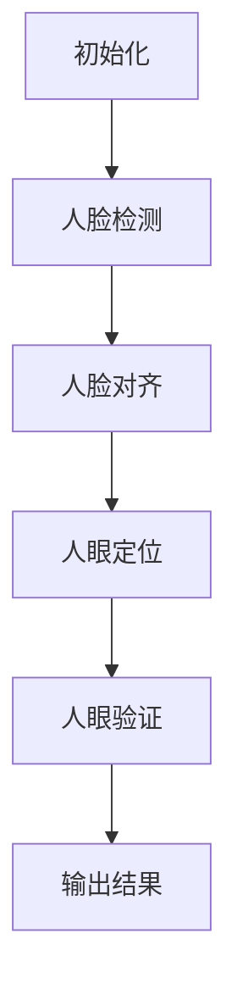

                 

# 基于OpenCV的人眼检测系统详细设计与具体代码实现

## 摘要

本文将深入探讨基于OpenCV的人眼检测系统的设计与实现。随着计算机视觉技术的飞速发展，人眼检测在众多领域具有广泛的应用，如人脸识别、生物识别、安防监控等。OpenCV作为一款强大的计算机视觉库，提供了丰富的函数和工具，使得人眼检测的实现变得更加简单和高效。本文将从背景介绍、核心概念与联系、核心算法原理、数学模型和公式、项目实战、实际应用场景、工具和资源推荐、总结以及常见问题与解答等多个方面，详细讲解人眼检测系统的设计和实现过程，为广大开发者提供有价值的参考。

## 1. 背景介绍

### 人眼检测的重要性和应用场景

人眼检测技术是一种基于计算机视觉的图像处理技术，其核心目的是在图像中准确识别和定位人眼。在人眼检测技术中，常用的方法有基于特征的方法、基于模板匹配的方法和基于机器学习的方法。随着深度学习技术的不断发展，基于卷积神经网络（CNN）的人眼检测方法逐渐成为主流。

人眼检测技术在许多领域具有重要的应用价值。首先，在人脸识别领域，人眼检测技术可以帮助系统确定人脸的位置和方向，提高识别的准确率。其次，在生物识别领域，人眼检测技术可以作为人眼追踪的一部分，实现更加精准的识别。此外，在安防监控领域，人眼检测技术可以用于实时监测，及时发现异常情况，提高监控的效率。

### OpenCV的背景和功能

OpenCV（Open Source Computer Vision Library）是一个开源的计算机视觉库，由Intel开发，并且得到全球开发者的广泛支持和贡献。OpenCV支持多种编程语言，包括C++、Python和Java，可以运行在多种操作系统上，如Linux、Windows和macOS。

OpenCV提供了丰富的函数和工具，涵盖了计算机视觉的各个领域，包括图像处理、特征提取、目标检测、人脸识别等。对于人眼检测，OpenCV提供了多个现成的函数和算法，如Haar级联分类器、HOG（Histogram of Oriented Gradients）特征提取、Adaboost等，大大简化了人眼检测的实现过程。

## 2. 核心概念与联系

### 人眼检测的基本原理

人眼检测的核心任务是在图像中找到人眼的位置。这个过程通常分为以下几个步骤：

1. **人脸检测**：首先需要确定图像中人脸的位置，因为人眼通常位于人脸的区域。
2. **人脸对齐**：对人脸进行几何变换，使得人脸朝向特定方向，方便后续人眼的定位。
3. **人眼定位**：在人脸的基础上，进一步识别人眼的位置，通常使用特征点检测或模板匹配等方法。
4. **人眼验证**：对检测到的人眼进行验证，确保其确实是人眼，防止误检。

### OpenCV在人眼检测中的应用

OpenCV提供了多种方法进行人眼检测，其中最常用的是Haar级联分类器和HOG特征提取。

- **Haar级联分类器**：基于Haar特征的级联分类器是OpenCV中用于人脸和眼部检测的主要工具。它通过训练大量的正负样本，提取出一系列的特征组合，并利用Adaboost算法进行分类。这种方法的优点是实时性高，检测速度快，但其缺点是对光照和姿态变化的适应能力较差。

- **HOG特征提取**：HOG特征提取是一种基于图像局部梯度的特征提取方法，它可以有效地描述图像中的目标轮廓。在OpenCV中，可以使用`cv2.HOGDescriptor()`函数来创建一个HOG特征提取器，并结合SVM分类器进行人眼检测。这种方法对光照和姿态变化的适应能力较强，但检测速度相对较慢。

### Mermaid流程图



## 3. 核心算法原理 & 具体操作步骤

### Haar级联分类器

#### 工作原理

Haar级联分类器是一种基于特征的分类器，它通过提取图像中的局部特征，并将这些特征组合成一系列的特征模式，来判断图像是否包含特定目标。在OpenCV中，Haar级联分类器通常用于人脸和眼部检测。

- **特征模式**：Haar特征模式是通过在图像中分割出一系列的矩形区域，然后计算这些区域的像素数量差来得到的。例如，两个相邻的矩形区域，一个较大的矩形和一个较小的矩形，它们的像素数量差可以用来描述人脸的特征。

- **级联分类器**：级联分类器是一系列分类器的组合，每个分类器都对应一个特征模式。当一个分类器无法正确判断时，就交由下一个分类器进行判断，直到所有分类器都判断完毕。

#### 操作步骤

1. **加载预训练的Haar级联分类器**：

   ```python
   face_cascade = cv2.CascadeClassifier('haarcascade_frontalface_default.xml')
   eye_cascade = cv2.CascadeClassifier('haarcascade_eye.xml')
   ```

2. **检测人脸**：

   ```python
   faces = face_cascade.detectMultiScale(gray, scaleFactor=1.1, minNeighbors=5, minSize=(30, 30), flags=cv2.CASCADE_SCALE_IMAGE)
   ```

3. **检测眼睛**：

   ```python
   for (x, y, w, h) in faces:
       cv2.rectangle(img, (x, y), (x+w, y+h), (255, 0, 0), 2)
       roi_gray = gray[y:y+h, x:x+w]
       roi_color = img[y:y+h, x:x+w]
       eyes = eye_cascade.detectMultiScale(roi_gray)
       for (ex, ey, ew, eh) in eyes:
           cv2.rectangle(roi_color, (ex, ey), (ex+ew, ey+eh), (0, 255, 0), 2)
   ```

### HOG特征提取

#### 工作原理

HOG（Histogram of Oriented Gradients）特征提取是一种基于图像局部梯度的特征提取方法。它通过计算图像中每个像素点的梯度方向和强度，生成一个梯度直方图，从而描述图像中的局部特征。

- **梯度方向和强度**：对于每个像素点，计算其在水平和垂直方向上的梯度值，然后计算这两个方向上的梯度值之间的夹角和强度。

- **梯度直方图**：将梯度方向和强度转化为直方图，每个bin对应一个方向和强度。

#### 操作步骤

1. **创建HOG特征提取器**：

   ```python
   hog = cv2.HOGDescriptor()
   ```

2. **设置HOG参数**：

   ```python
   hog.setSVMDetectParameters(SVMDetector_param)
   ```

3. **检测人眼**：

   ```python
   (rects, weights) = hog.detectMultiScale(img, winSize=(w, h), zeroCrossingThres=0.5)
   ```

4. **处理检测结果**：

   ```python
   for (x, y, w, h) in rects:
       cv2.rectangle(img, (x, y), (x+w, y+h), (0, 255, 0), 2)
   ```

## 4. 数学模型和公式 & 详细讲解 & 举例说明

### Haar级联分类器

#### 数学模型

Haar级联分类器基于Adaboost算法，其核心思想是通过训练多个弱分类器，然后组合它们的预测结果来获得最终的分类结果。每个弱分类器都基于一组特征和对应的权重，这些特征通常是Haar特征。

- **特征表示**：Haar特征可以表示为`f(x, y) = (x1 - x2) * (y1 + y2)`，其中`(x1, y1)`和`(x2, y2)`是图像中的两个矩形区域的中心点。

- **权重计算**：在训练过程中，通过梯度上升法（gradient ascent）来计算每个特征的权重，使得分类器的预测误差最小。

- **分类决策**：对于每个测试样本，计算每个弱分类器的预测值，然后根据权重进行加权求和，如果总和大于某个阈值，则预测为正类。

#### 举例说明

假设我们有两个Haar特征`f1`和`f2`，对应的权重分别为`w1`和`w2`。对于某个测试样本，我们计算这两个特征的值：

- `f1 = (x1 - x2) * (y1 + y2) = 5`
- `f2 = (x3 - x4) * (y3 + y4) = 3`

根据权重计算预测值：

- `predict1 = w1 * f1 = 0.8 * 5 = 4`
- `predict2 = w2 * f2 = 0.2 * 3 = 0.6`

如果预测值的总和大于阈值（例如，1.0），则预测为正类。

### HOG特征提取

#### 数学模型

HOG特征提取基于图像局部梯度的方向和强度。对于每个像素点，计算其在水平和垂直方向上的梯度值，然后计算这两个方向上的梯度值之间的夹角和强度。

- **梯度计算**：对于每个像素点`(x, y)`，计算水平和垂直方向的梯度值：

  ```math
  g_x(x, y) = \sum_{i, j} \left( I(x+i, y+j) - I(x-i, y+j) \right)
  g_y(x, y) = \sum_{i, j} \left( I(x+i, y+j) - I(x+i, y-j) \right)
  ```

  其中`I(x, y)`是像素点的灰度值。

- **方向和强度计算**：对于每个像素点，计算梯度方向和强度：

  ```math
  \theta(x, y) = \text{atan2}(g_y(x, y), g_x(x, y))
  \lambda(x, y) = \sqrt{g_x^2(x, y) + g_y^2(x, y)}
  ```

- **直方图计算**：将梯度方向划分为多个bin，然后计算每个bin的直方图值：

  ```python
  bin_size = 18
  for x in range(width):
      for y in range(height):
          angle = theta[x, y] / bin_size
          hist[angle] += lambda[x, y]
  ```

#### 举例说明

假设图像中的一个像素点的梯度值为`g_x = 2`和`g_y = 3`，梯度方向为`theta = 30°`，强度为`lambda = \sqrt{2^2 + 3^2} = \sqrt{13}`。

将这些值代入直方图计算公式，可以得到：

```python
hist[0] += lambda
hist[1] += lambda * cos(30°)
hist[1] += lambda * sin(30°)
...
```

这样，每个bin的直方图值就可以用来描述图像中的局部特征。

## 5. 项目实战：代码实际案例和详细解释说明

### 5.1 开发环境搭建

在开始编写代码之前，首先需要搭建合适的开发环境。以下是基于Python和OpenCV的配置步骤：

1. **安装Python**：确保已经安装了Python 3.x版本。
2. **安装OpenCV**：通过pip命令安装OpenCV：

   ```shell
   pip install opencv-python
   ```

3. **配置环境变量**：确保OpenCV的库路径被正确配置，以便在Python脚本中能够导入OpenCV模块。

### 5.2 源代码详细实现和代码解读

以下是一个简单的基于Haar级联分类器的人眼检测代码示例：

```python
import cv2

# 加载预训练的Haar级联分类器模型
face_cascade = cv2.CascadeClassifier('haarcascade_frontalface_default.xml')
eye_cascade = cv2.CascadeClassifier('haarcascade_eye.xml')

# 读取图像
img = cv2.imread('example.jpg')

# 转换为灰度图像
gray = cv2.cvtColor(img, cv2.COLOR_BGR2GRAY)

# 检测人脸
faces = face_cascade.detectMultiScale(gray, scaleFactor=1.1, minNeighbors=5, minSize=(30, 30), flags=cv2.CASCADE_SCALE_IMAGE)

# 检测眼睛
for (x, y, w, h) in faces:
    cv2.rectangle(img, (x, y), (x+w, y+h), (255, 0, 0), 2)
    roi_gray = gray[y:y+h, x:x+w]
    roi_color = img[y:y+h, x:x+w]
    eyes = eye_cascade.detectMultiScale(roi_gray)
    for (ex, ey, ew, eh) in eyes:
        cv2.rectangle(roi_color, (ex, ey), (ex+ew, ey+eh), (0, 255, 0), 2)

# 显示检测结果
cv2.imshow('face and eyes', img)
cv2.waitKey(0)
cv2.destroyAllWindows()
```

#### 代码解读

1. **导入模块**：首先导入必要的模块，包括OpenCV的`cv2`模块。
2. **加载分类器**：使用`CascadeClassifier`加载预训练的Haar级联分类器模型，这些模型通常以`.xml`文件的形式存储。
3. **读取图像**：使用`imread`函数读取指定路径的图像文件。
4. **灰度转换**：将读取的BGR图像转换为灰度图像，以便后续的特征提取和检测。
5. **人脸检测**：使用`detectMultiScale`函数检测图像中的人脸。参数`scaleFactor`控制图像缩放的倍数，`minNeighbors`控制最小邻居数，`minSize`和`flags`分别控制最小检测尺寸和图像缩放方式。
6. **眼睛检测**：在检测到的人脸区域中，使用`detectMultiScale`函数检测眼睛。这部分代码与检测人脸类似。
7. **绘制结果**：使用`rectangle`函数在原始图像上绘制人脸和眼睛的检测框。
8. **显示结果**：使用`imshow`函数显示检测结果，`waitKey`函数用于等待按键事件，`destroyAllWindows`函数用于关闭所有窗口。

### 5.3 代码解读与分析

上述代码示例演示了如何使用OpenCV实现一个简单的人眼检测系统。以下是代码的关键部分及其分析：

1. **加载分类器**：

   ```python
   face_cascade = cv2.CascadeClassifier('haarcascade_frontalface_default.xml')
   eye_cascade = cv2.CascadeClassifier('haarcascade_eye.xml')
   ```

   这两行代码加载了预训练的Haar级联分类器模型。`haarcascade_frontalface_default.xml`用于检测人脸，`haarcascade_eye.xml`用于检测眼睛。这些模型通常由OpenCV官方或社区提供，可以通过下载并存储在相应的路径中来使用。

2. **读取图像**：

   ```python
   img = cv2.imread('example.jpg')
   ```

   使用`imread`函数读取图像文件。这个函数返回一个BGR格式的图像矩阵，其中每个像素点的值对应RGB三个通道的值。

3. **灰度转换**：

   ```python
   gray = cv2.cvtColor(img, cv2.COLOR_BGR2GRAY)
   ```

   将BGR格式的图像转换为灰度图像。由于人脸和眼睛检测主要依赖于图像的灰度特征，因此转换为灰度图像可以提高检测的效率和准确性。

4. **人脸检测**：

   ```python
   faces = face_cascade.detectMultiScale(gray, scaleFactor=1.1, minNeighbors=5, minSize=(30, 30), flags=cv2.CASCADE_SCALE_IMAGE)
   ```

   使用`detectMultiScale`函数检测图像中的人脸。这个函数返回一个包含人脸位置和尺寸的列表。参数`scaleFactor`控制图像缩放的倍数，`minNeighbors`控制最小邻居数，`minSize`和`flags`分别控制最小检测尺寸和图像缩放方式。

5. **眼睛检测**：

   ```python
   for (x, y, w, h) in faces:
       cv2.rectangle(img, (x, y), (x+w, y+h), (255, 0, 0), 2)
       roi_gray = gray[y:y+h, x:x+w]
       roi_color = img[y:y+h, x:x+w]
       eyes = eye_cascade.detectMultiScale(roi_gray)
       for (ex, ey, ew, eh) in eyes:
           cv2.rectangle(roi_color, (ex, ey), (ex+ew, ey+eh), (0, 255, 0), 2)
   ```

   对于每个检测到的人脸，分别绘制人脸和眼睛的检测框。首先，使用`rectangle`函数在原始图像上绘制人脸的检测框，然后对人脸区域进行进一步的眼睛检测。在眼睛检测过程中，同样使用`detectMultiScale`函数，并绘制眼睛的检测框。

6. **显示结果**：

   ```python
   cv2.imshow('face and eyes', img)
   cv2.waitKey(0)
   cv2.destroyAllWindows()
   ```

   使用`imshow`函数显示检测结果。`waitKey`函数用于等待按键事件，当按下任意键时，程序将终止并关闭所有窗口。

### 5.4 运行效果与调整

当运行上述代码时，程序将读取指定路径的图像，并在窗口中显示检测结果。如果需要调整检测效果，可以尝试修改检测参数，如`scaleFactor`、`minNeighbors`等。此外，还可以尝试使用不同的Haar级联分类器模型，以适应不同的场景和需求。

## 6. 实际应用场景

人眼检测技术在实际应用中具有广泛的应用场景，下面列举一些典型的应用案例：

### 人脸识别系统

在人脸识别系统中，人眼检测是一个关键步骤。通过先检测人眼的位置，可以确定人脸的中心点，从而提高识别的准确率。例如，在门禁系统、手机解锁、安防监控等场景中，人眼检测技术可以显著提高系统的性能和用户体验。

### 生物识别系统

在生物识别系统中，人眼检测可以与面部识别、指纹识别等技术结合，实现更高级别的身份验证。例如，在银行ATM机、机场安检等场景中，人眼检测可以用于识别用户的身份，提高安全性和效率。

### 安防监控系统

在安防监控系统中，人眼检测可以用于实时监测和识别目标。例如，在公共场所、商业建筑、交通枢纽等场景中，通过人眼检测可以及时发现异常行为，提高监控的效率和准确性。

### 情感分析

通过分析人眼的状态，如眨眼频率、瞳孔变化等，可以推断用户的情感状态。这在广告分析、用户行为研究等场景中具有重要应用价值。例如，在电视广告中，通过分析观众的眨眼频率可以评估广告的吸引力。

### 交互式应用

在人机交互应用中，人眼检测可以用于实现更自然的交互方式。例如，在虚拟现实（VR）和增强现实（AR）应用中，通过检测用户的眼动，可以实现更精准的交互和更逼真的体验。

## 7. 工具和资源推荐

### 7.1 学习资源推荐

- **书籍**：
  - 《计算机视觉：算法与应用》（Computer Vision: Algorithms and Applications） - Richard Szeliski
  - 《OpenCV编程入门》（Learning OpenCV） - Gary Bradski和Adrian Kaehler
  - 《深度学习：周志华》（Deep Learning） - 周志华

- **在线课程**：
  - Coursera上的“计算机视觉与深度学习”课程
  - Udacity的“人工智能纳米学位”课程
  - edX上的“深度学习专项课程”

- **论文**：
  - 《Haar级联分类器》（Haar-like Features for Face Detection） - Paul Viola和Michael Jones
  - 《Histogram of Oriented Gradients for Human Detection》 - Navneet Dalal和Bill Triggs

### 7.2 开发工具框架推荐

- **OpenCV**：作为一款开源的计算机视觉库，OpenCV提供了丰富的工具和函数，适用于多种编程语言，是开发人眼检测系统的首选工具。
- **TensorFlow**：Google开发的一款开源机器学习库，提供了丰富的深度学习模型和工具，特别适合于基于卷积神经网络的人眼检测系统开发。
- **PyTorch**：Facebook开发的一款开源机器学习库，以其灵活的动态计算图和强大的GPU支持，成为深度学习开发者的热门选择。

### 7.3 相关论文著作推荐

- **《Haar级联分类器》（Haar-like Features for Face Detection）**：详细介绍了Haar级联分类器的工作原理和应用场景。
- **《Histogram of Oriented Gradients for Human Detection》**：探讨了HOG特征提取在目标检测中的应用。
- **《Real-Time Face Detection》**：讨论了实时人脸检测技术及其优化方法。
- **《Deep Learning for Human Pose Estimation: New Frontiers》**：介绍了深度学习在人体姿态估计中的应用。

## 8. 总结：未来发展趋势与挑战

随着计算机视觉技术的不断进步，人眼检测系统的发展前景非常广阔。未来的人眼检测系统将更加智能化、精准化，能够适应更复杂的场景和光照条件。以下是一些发展趋势和挑战：

### 发展趋势

1. **深度学习应用**：深度学习，尤其是卷积神经网络（CNN）在图像处理领域的应用，将进一步提升人眼检测的准确率和实时性。
2. **多传感器融合**：结合多种传感器，如红外、热成像、RGB摄像头等，可以提升人眼检测的鲁棒性和适应性。
3. **实时处理**：随着硬件性能的提升，人眼检测系统的实时处理能力将得到显著提高，适用于实时监控和交互应用。
4. **个性化检测**：通过大数据分析和机器学习，可以实现更加个性化的人眼检测，满足不同用户的需求。

### 挑战

1. **光照和姿态变化**：如何在各种光照和姿态变化下实现稳定的人眼检测仍然是一个挑战。
2. **多目标检测**：在复杂场景中，如何高效地检测多个目标，并区分不同目标之间的差异。
3. **资源优化**：在有限的计算资源下，如何实现高效的人眼检测，降低系统的延迟和功耗。
4. **隐私保护**：在人眼检测系统中，如何保护用户的隐私，避免数据泄露和滥用。

## 9. 附录：常见问题与解答

### 问题1：为什么我的检测结果不准确？

**解答**：不准确的原因可能有多种，包括模型选择不当、参数设置不合理、图像质量不佳等。可以尝试调整模型参数，如缩小或放大检测窗口，增加或减少最小邻居数等。此外，确保使用的训练数据和测试数据具有代表性，能够覆盖各种场景和光照条件。

### 问题2：如何提高检测速度？

**解答**：提高检测速度的方法包括减少模型复杂度、优化算法实现、使用GPU加速等。可以选择更简单的模型或使用现成的加速库，如OpenCV的DNN模块。此外，通过数据预处理和图像增强技术，可以减少计算量，提高检测速度。

### 问题3：如何在实时应用中实现人眼检测？

**解答**：在实时应用中实现人眼检测，需要考虑检测算法的实时性和系统的计算资源。可以选择使用轻量级的模型，如SSD（Single Shot MultiBox Detector）或YOLO（You Only Look Once），这些模型能够在实时环境中高效运行。同时，优化算法实现，减少不必要的计算和内存占用，确保系统具有良好的响应速度。

## 10. 扩展阅读 & 参考资料

- **《计算机视觉：算法与应用》（Computer Vision: Algorithms and Applications）** - Richard Szeliski
- **《OpenCV编程入门》（Learning OpenCV）** - Gary Bradski和Adrian Kaehler
- **《深度学习：周志华》（Deep Learning）** - 周志华
- **《Histogram of Oriented Gradients for Human Detection》** - Navneet Dalal和Bill Triggs
- **《Real-Time Face Detection》** - Paul Viola和Michael Jones
- **OpenCV官方文档** - [https://docs.opencv.org/](https://docs.opencv.org/)
- **TensorFlow官方文档** - [https://www.tensorflow.org/](https://www.tensorflow.org/)
- **PyTorch官方文档** - [https://pytorch.org/](https://pytorch.org/)

