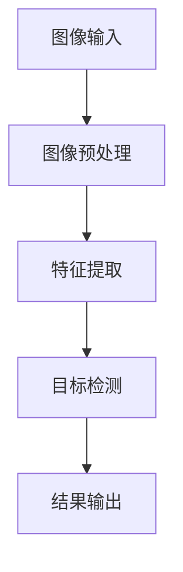
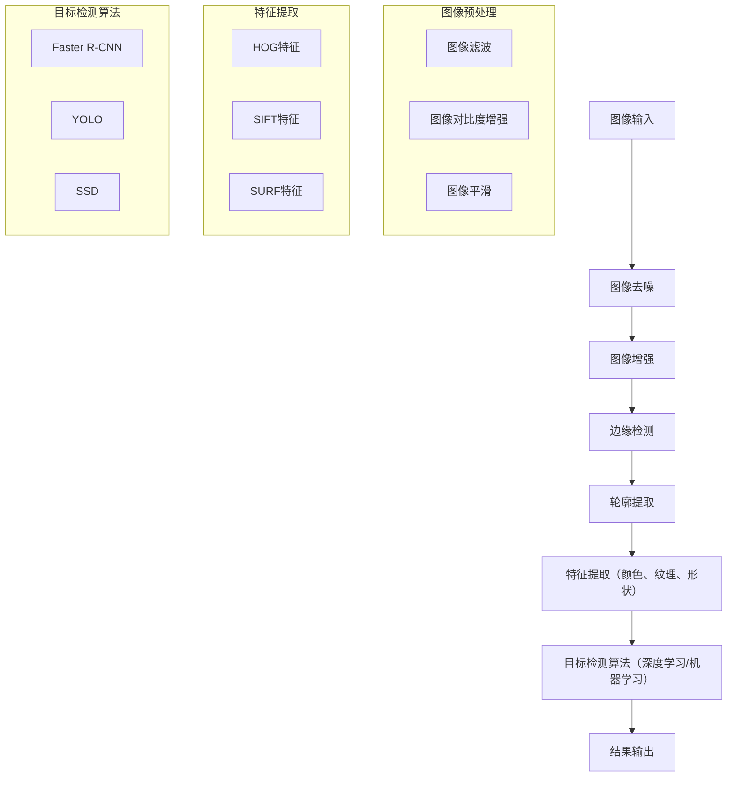

                 

## 1. 背景介绍

### 船只检测系统的意义与应用场景

随着现代科技的发展，图像处理与计算机视觉技术在各个领域得到了广泛应用。其中，船只检测系统作为一种重要的应用，具有深远的意义和广泛的实用价值。船只检测系统主要应用于以下几个方面：

1. **海事安全监控**：在沿海、港口等地区，通过船只检测系统可以实时监控船舶的航行情况，及时发现并预警潜在的安全隐患，如船只碰撞、非法入侵等，从而保障海上交通的安全。

2. **渔业管理**：对于渔业资源丰富的地区，船只检测系统可以帮助管理部门实时掌握渔船的分布和作业情况，优化渔业资源的管理与调配，提高渔业生产效率。

3. **航道监控**：在航道中，通过船只检测系统可以实时监测航道中的船舶数量和位置，确保航道畅通，防止船舶拥堵和相撞事故的发生。

4. **海洋环境保护**：船只检测系统可以帮助监测海洋环境中的污染物来源，如油污泄漏、废弃物倾倒等，及时采取措施保护海洋环境。

5. **国防与军事**：在国防与军事领域，船只检测系统可以用于监控敌对舰船的行动，为军事决策提供重要依据，确保国家安全。

### 船只检测系统的技术需求

为了实现高效的船只检测，系统需要具备以下几个关键技术需求：

1. **图像处理算法**：对输入的图像进行预处理，包括去噪、增强、滤波等操作，以提高图像质量，从而更准确地识别和定位船只。

2. **目标检测算法**：使用深度学习等先进算法对预处理后的图像进行目标检测，以识别出图像中的船只。

3. **实时性要求**：系统需要能够实时处理大量图像数据，以满足海上实时监控的需求。

4. **抗干扰能力**：系统应具有较强的抗干扰能力，能够在复杂环境中（如恶劣天气、光照变化等）稳定运行。

5. **数据存储与处理**：系统需要具备高效的数据存储和处理能力，以存储和处理大量船只检测数据，为后续分析提供支持。

### 船只检测系统的发展历程

船只检测系统的发展历程可以分为以下几个阶段：

1. **传统图像处理方法**：早期船只检测主要依赖传统的图像处理方法，如边缘检测、轮廓提取等，虽然能够实现基本的目标检测，但在复杂背景下效果不佳。

2. **基于机器学习的方法**：随着机器学习技术的兴起，基于特征提取和分类的算法开始应用于船只检测，如支持向量机（SVM）、随机森林等，检测精度有所提高。

3. **深度学习方法**：近年来，深度学习技术的快速发展，使得基于卷积神经网络（CNN）的船只检测算法成为主流，如Faster R-CNN、YOLO、SSD等，检测精度和实时性都有了显著提升。

4. **多传感器融合**：当前的研究趋势之一是将多传感器数据（如雷达、激光雷达等）与图像数据融合，以提高船只检测的准确性和可靠性。

### 船只检测系统的重要性

船只检测系统不仅具有广泛的应用场景，还在许多领域发挥着关键作用。通过实时监测和精确识别，它可以显著提升海上交通的安全性和效率，保障海洋环境的可持续发展。同时，随着技术的不断进步，船只检测系统将在未来继续发挥重要作用，为海事管理、海洋经济和国防安全等领域提供有力支持。

### 船只检测系统的发展趋势

展望未来，船只检测系统的发展将呈现出以下几个趋势：

1. **更高精度与实时性**：随着算法和硬件的不断提升，系统将实现更高精度的目标检测，并具备更快的响应速度，满足实时监控的需求。

2. **多传感器融合**：多传感器融合技术将成为主流，通过融合不同传感器的数据，提高检测的准确性和可靠性。

3. **智能化与自动化**：随着人工智能技术的发展，系统将具备更高的智能化水平，实现自动化船只检测和智能决策。

4. **跨学科融合**：船只检测系统将与其他领域（如海洋科学、地理信息系统等）深度融合，形成更为综合的解决方案。

通过以上背景介绍，我们可以看出，船只检测系统不仅在当前具有广泛的应用，而且在未来也将继续发挥重要作用。接下来，我们将深入探讨基于OpenCV的船只检测系统的设计与实现，以期为这一领域的发展贡献更多智慧和力量。

### 2. 核心概念与联系

为了深入理解基于OpenCV的船只检测系统，我们需要掌握以下几个核心概念，并探讨它们之间的相互联系。

#### 2.1 OpenCV

OpenCV（Open Source Computer Vision Library）是一个开源的计算机视觉库，由Intel开发并维护，广泛应用于图像处理和计算机视觉领域。它提供了丰富的函数和工具，包括图像滤波、形态学操作、特征提取、目标检测等。OpenCV支持多种编程语言，如C++、Python等，使得开发者可以方便地使用该库进行图像处理和计算机视觉任务。

#### 2.2 船只检测算法

船只检测算法是船只检测系统的核心，主要分为以下几类：

1. **传统图像处理方法**：这类方法通常利用图像的边缘、纹理等特征进行目标检测。常见的算法包括边缘检测、轮廓提取等。

2. **机器学习算法**：通过训练分类器，如支持向量机（SVM）、随机森林等，对图像进行分类，从而实现目标检测。

3. **深度学习算法**：深度学习算法，尤其是卷积神经网络（CNN），在目标检测领域表现出色。常见的算法包括Faster R-CNN、YOLO、SSD等。

#### 2.3 图像预处理

图像预处理是船只检测系统的第一步，目的是提高图像质量，为后续的目标检测算法提供更好的输入。常见的图像预处理技术包括去噪、增强、滤波等。OpenCV提供了丰富的图像处理函数，方便开发者进行图像预处理。

#### 2.4 特征提取

特征提取是目标检测的关键步骤，目的是从图像中提取出有助于目标识别的特征。常用的特征包括颜色特征、纹理特征、形状特征等。OpenCV提供了多种特征提取函数，如HOG（直方图方向梯度）、SIFT（尺度不变特征变换）、SURF（加速稳健特征）等。

#### 2.5 Mermaid流程图

为了更好地理解上述核心概念之间的联系，我们可以使用Mermaid流程图来展示整个船只检测系统的架构和流程。以下是一个简化的Mermaid流程图示例：



在这个流程图中，图像输入经过预处理后进行特征提取，然后通过目标检测算法识别出船只，最后输出检测结果。每个步骤都依赖于OpenCV提供的函数和工具。

#### 2.6 核心概念原理和架构

为了深入理解核心概念原理和架构，我们可以进一步细化上述Mermaid流程图。以下是包含核心概念原理和架构的Mermaid流程图：



在这个细化后的流程图中，我们进一步展示了图像预处理、特征提取和目标检测算法的子流程。通过这个流程图，我们可以清晰地看到各个步骤之间的逻辑关系，以及每个步骤所依赖的技术和方法。

### 总结

通过上述对核心概念和联系的介绍，我们可以更好地理解基于OpenCV的船只检测系统的架构和流程。这些核心概念相互关联，共同构成了一个高效的船只检测系统。在接下来的章节中，我们将深入探讨这些核心概念的具体实现和操作步骤，以便开发者能够更好地应用和实践。

### 3. 核心算法原理 & 具体操作步骤

#### 3.1 图像预处理算法

图像预处理是船只检测系统的第一步，其目的是提高图像质量，为后续的目标检测算法提供更好的输入。OpenCV提供了丰富的图像处理函数，可以帮助我们实现图像预处理。以下是几种常用的图像预处理算法及其实现步骤：

##### 3.1.1 图像去噪

去噪是图像预处理的重要步骤，可以有效减少图像中的噪声，提高图像质量。OpenCV中的`cv2.GaussianBlur()`函数可以实现高斯去噪。

**具体操作步骤：**

1. **读取图像**：使用`cv2.imread()`函数读取待处理的图像。
2. **应用高斯滤波**：使用`cv2.GaussianBlur()`函数对图像进行高斯滤波，设置合适的滤波器大小和标准差。
3. **显示去噪后的图像**：使用`cv2.imshow()`函数显示去噪后的图像。

```python
import cv2

# 读取图像
image = cv2.imread('image.jpg')

# 应用高斯滤波
blurred = cv2.GaussianBlur(image, (15, 15), 0)

# 显示去噪后的图像
cv2.imshow('Blurred Image', blurred)
cv2.waitKey(0)
cv2.destroyAllWindows()
```

##### 3.1.2 图像增强

图像增强可以增加图像中的对比度，使得目标更加突出，便于后续的目标检测。OpenCV中的`cv2.equalizeHist()`函数可以实现直方图均衡化，从而增强图像的对比度。

**具体操作步骤：**

1. **读取图像**：使用`cv2.imread()`函数读取待处理的图像。
2. **应用直方图均衡化**：使用`cv2.equalizeHist()`函数对图像进行直方图均衡化。
3. **显示增强后的图像**：使用`cv2.imshow()`函数显示增强后的图像。

```python
import cv2

# 读取图像
image = cv2.imread('image.jpg')

# 应用直方图均衡化
equalized = cv2.equalizeHist(image)

# 显示增强后的图像
cv2.imshow('Equalized Image', equalized)
cv2.waitKey(0)
cv2.destroyAllWindows()
```

##### 3.1.3 图像滤波

图像滤波是图像预处理中常用的步骤，可以去除图像中的噪声，提高图像质量。OpenCV中的`cv2.bilateralFilter()`函数可以实现双边滤波，该滤波器在保持边缘的同时去除噪声。

**具体操作步骤：**

1. **读取图像**：使用`cv2.imread()`函数读取待处理的图像。
2. **应用双边滤波**：使用`cv2.bilateralFilter()`函数对图像进行双边滤波，设置合适的滤波器大小和标准差。
3. **显示滤波后的图像**：使用`cv2.imshow()`函数显示滤波后的图像。

```python
import cv2

# 读取图像
image = cv2.imread('image.jpg')

# 应用双边滤波
filtered = cv2.bilateralFilter(image, 9, 75, 75)

# 显示滤波后的图像
cv2.imshow('Filtered Image', filtered)
cv2.waitKey(0)
cv2.destroyAllWindows()
```

#### 3.2 目标检测算法

目标检测是船只检测系统的核心步骤，目的是从图像中识别出船只。OpenCV支持多种目标检测算法，包括传统的机器学习算法和现代的深度学习算法。以下是几种常用的目标检测算法及其实现步骤：

##### 3.2.1 SVM目标检测

支持向量机（SVM）是一种强大的分类算法，可以用于目标检测。OpenCV中的`cv2.SVM()`类可以实现SVM目标检测。

**具体操作步骤：**

1. **准备训练数据**：收集包含船和背景的图像，将其转换为特征向量，并标注类别。
2. **训练SVM模型**：使用`cv2.SVM.trainAuto()`函数训练SVM模型。
3. **检测目标**：使用训练好的SVM模型检测新图像中的船只。

```python
import cv2

# 准备训练数据
images = [...]  # 包含船和背景的图像
features = [...]  # 特征向量
labels = [...]  # 标签

# 训练SVM模型
svm = cv2.SVM()
svm.trainAuto(features, labels)

# 检测目标
image = cv2.imread('image.jpg')
keypoints = svm.detect(image)
```

##### 3.2.2 YOLO目标检测

YOLO（You Only Look Once）是一种高效的深度学习目标检测算法。OpenCV结合TensorFlow实现了YOLO的目标检测。

**具体操作步骤：**

1. **安装TensorFlow和OpenCV**：确保已安装TensorFlow和OpenCV库。
2. **加载YOLO模型**：使用`cv2.dnn.readNetFromTensorFlow()`或`cv2.dnn.readNetFromDarknet()`函数加载预训练的YOLO模型。
3. **检测目标**：使用加载的YOLO模型检测新图像中的船只。

```python
import cv2
import numpy as np

# 加载YOLO模型
model = cv2.dnn.readNet('yolov3.weights', 'yolov3.cfg')

# 检测目标
image = cv2.imread('image.jpg')
h, w = image.shape[:2]
blob = cv2.dnn.blobFromImage(image, 1/255.0, (416, 416), [0, 0, 0], True, crop=False)
model.setInput(blob)
detections = model.forward()

# 提取检测结果
boxes = []
confidences = []

# 根据检测结果绘制边框
for detection in detections:
    scores = detection[5:]
    class_id = np.argmax(scores)
    confidence = scores[class_id]
    if confidence > 0.5:
        center_x = int(detection[0] * w)
        center_y = int(detection[1] * h)
        width = int(detection[2] * w)
        height = int(detection[3] * h)
        x = int(center_x - width / 2)
        y = int(center_y - height / 2)
        boxes.append([x, y, width, height])
        confidences.append(float(confidence))
```

##### 3.2.3 Faster R-CNN目标检测

Faster R-CNN是一种流行的深度学习目标检测算法，OpenCV结合TensorFlow实现了Faster R-CNN的目标检测。

**具体操作步骤：**

1. **安装TensorFlow和OpenCV**：确保已安装TensorFlow和OpenCV库。
2. **加载Faster R-CNN模型**：使用`cv2.dnn.readNetFromTensorFlow()`或`cv2.dnn.readNetFromDarknet()`函数加载预训练的Faster R-CNN模型。
3. **检测目标**：使用加载的Faster R-CNN模型检测新图像中的船只。

```python
import cv2
import numpy as np

# 加载Faster R-CNN模型
model = cv2.dnn.readNetFromTensorFlow('faster_rcnn_tensorflow.pb', 'faster_rcnn_tensorflow.config')

# 检测目标
image = cv2.imread('image.jpg')
h, w = image.shape[:2]
blob = cv2.dnn.blobFromImage(image, 1/255.0, (416, 416), [0, 0, 0], True, crop=False)
model.setInput(blob)
detections = model.forward()

# 提取检测结果
boxes = []
confidences = []

# 根据检测结果绘制边框
for detection in detections:
    scores = detection[5:]
    class_id = np.argmax(scores)
    confidence = scores[class_id]
    if confidence > 0.5:
        center_x = int(detection[0] * w)
        center_y = int(detection[1] * h)
        width = int(detection[2] * w)
        height = int(detection[3] * h)
        x = int(center_x - width / 2)
        y = int(center_y - height / 2)
        boxes.append([x, y, width, height])
        confidences.append(float(confidence))
```

#### 3.3 实时目标检测

实时目标检测是船只检测系统的关键要求，OpenCV通过多线程和图像流处理实现了实时目标检测。

**具体操作步骤：**

1. **创建视频捕获对象**：使用`cv2.VideoCapture()`函数创建视频捕获对象。
2. **循环读取视频帧**：使用`cv2.VideoCapture.read()`函数循环读取视频帧。
3. **图像预处理和目标检测**：对读取的视频帧进行预处理和目标检测。
4. **显示检测结果**：使用`cv2.imshow()`函数显示检测结果。
5. **释放视频捕获对象**：使用`cv2.VideoCapture.release()`函数释放视频捕获对象。

```python
import cv2

# 创建视频捕获对象
cap = cv2.VideoCapture('video.mp4')

# 循环读取视频帧
while cap.isOpened():
    ret, frame = cap.read()
    if not ret:
        break

    # 图像预处理和目标检测
    processed_frame = preprocess_frame(frame)
    detections = detect_ships(processed_frame)

    # 显示检测结果
    display_detections(frame, detections)

    # 按下'q'键退出循环
    if cv2.waitKey(1) & 0xFF == ord('q'):
        break

# 释放视频捕获对象
cap.release()
cv2.destroyAllWindows()
```

通过以上核心算法原理和具体操作步骤的介绍，我们可以掌握基于OpenCV的船只检测系统的关键技术和实现方法。在接下来的章节中，我们将进一步探讨数学模型和公式，以深入理解船只检测的数学本质。

### 4. 数学模型和公式 & 详细讲解 & 举例说明

在船只检测系统中，数学模型和公式起着至关重要的作用。这些模型和公式帮助我们量化图像特征、计算目标检测的阈值，以及评估检测结果的准确性。在本节中，我们将详细讲解几个关键的数学模型和公式，并通过具体示例来说明它们的应用。

#### 4.1 HOG特征提取

HOG（Histogram of Oriented Gradients）是一种常用的特征提取方法，用于目标检测。HOG特征提取的基本思想是计算图像中每个像素点的梯度方向和幅值，并将这些信息组织成直方图。

**公式：**

HOG特征可以表示为：
$$
HOG = \sum_{i=1}^{N} h_i
$$
其中，$N$是直方图中的bin数，$h_i$是第$i$个bin的值。

**具体步骤：**

1. **计算梯度方向和幅值**：对图像的每个像素点，计算其水平和垂直方向上的梯度幅值和方向。
2. **组合同一像素点的梯度方向**：将同一像素点处的梯度方向进行组合，以减小噪声影响。
3. **构建直方图**：根据梯度方向和幅值，构建每个单元格的HOG直方图。

**示例：**

假设一个3x3的像素块，其梯度方向和幅值如下表所示：

| x | y | gradient magnitude | direction |
|---|---|-------------------|-----------|
| 0 | 0 | 10                | 45°       |
| 0 | 1 | 8                 | 60°       |
| 0 | 2 | 5                 | 30°       |
| 1 | 0 | 6                 | 0°        |
| 1 | 1 | 4                 | 15°       |
| 1 | 2 | 3                 | 5°        |
| 2 | 0 | 2                 | 20°       |
| 2 | 1 | 1                 | 25°       |
| 2 | 2 | 0                 | 0°        |

根据上述数据，我们可以构建一个9个bin的HOG直方图，其中每个bin表示一个特定的方向。例如，第0个bin表示0°到10°，第1个bin表示10°到20°，依此类推。

| bin | direction range |
|-----|----------------|
| 0   | 0°-10°         |
| 1   | 10°-20°        |
| 2   | 20°-30°        |
| ... | ...            |
| 8   | 160°-170°      |
| 9   | 170°-180°      |

根据梯度方向和幅值，我们可以计算每个bin的值，最终得到HOG特征向量。

#### 4.2 SVM分类器

支持向量机（SVM）是一种常用的分类算法，广泛应用于目标检测。SVM的核心思想是找到一个最优的超平面，使得分类边界最大化。

**公式：**

SVM的决策函数可以表示为：
$$
f(x) = \text{sign}(\omega \cdot x + b)
$$
其中，$\omega$是权重向量，$x$是特征向量，$b$是偏置项。

**具体步骤：**

1. **选择核函数**：根据数据特性选择合适的核函数，如线性核、多项式核、径向基核等。
2. **训练SVM模型**：使用训练数据，通过优化算法找到最优的权重向量$\omega$和偏置项$b$。
3. **分类预测**：使用训练好的SVM模型，对新的数据进行分类预测。

**示例：**

假设我们有一个简单的二维数据集，其中正类和负类的特征向量如下表所示：

| 类别 | 特征1 | 特征2 |
|------|-------|-------|
| 正类 | 1     | 2     |
| 正类 | 3     | 4     |
| 负类 | 5     | 6     |
| 负类 | 7     | 8     |

我们选择线性核函数，即$\omega \cdot x = \sum_{i=1}^{2} \omega_i x_i$。通过最小化损失函数，我们可以得到最优的权重向量$\omega = [1, 1]^T$和偏置项$b = -1$。

因此，决策函数可以表示为：
$$
f(x) = \text{sign}(x_1 + x_2 - 1)
$$

对于新的特征向量$x = [2, 3]^T$，我们可以计算：
$$
f(x) = \text{sign}(2 + 3 - 1) = \text{sign}(4) = +1
$$
这表明$x$被分类为正类。

#### 4.3 YOLO目标检测

YOLO（You Only Look Once）是一种高效的深度学习目标检测算法。YOLO的核心思想是将目标检测任务转化为一个全卷积网络，从而实现端到端的训练。

**公式：**

YOLO的检测过程可以表示为：
$$
\hat{C} = \frac{\sum_{i=1}^{N} C_i^2}{\sum_{i=1}^{N} C_i^2 + \sum_{i=1}^{N} (1 - C_i)^2}
$$
$$
\hat{p} = \frac{1}{1 + \exp(-\hat{C})}
$$
$$
\hat{x}_{ij} = \frac{1}{C_j} \sum_{k=1}^{N} \frac{C_k \hat{x}_{kij}}{\hat{C}}
$$
$$
\hat{y}_{ij} = \frac{1}{C_j} \sum_{k=1}^{N} \frac{C_k \hat{y}_{kij}}{\hat{C}}
$$
$$
w = \frac{\hat{w}_i}{1 + \exp(-\hat{C})}
$$
$$
h = \frac{\hat{h}_i}{1 + \exp(-\hat{C})}
$$
其中，$C$是先验概率，$\hat{C}$是预测的置信度，$p$是目标的概率，$(\hat{x}, \hat{y})$是目标的位置，$(w, h)$是目标的大小。

**具体步骤：**

1. **预测位置和大小**：使用卷积网络的输出，预测每个单元格中的目标位置和大小。
2. **计算置信度**：根据预测的位置和大小，计算置信度$\hat{C}$。
3. **非极大值抑制（NMS）**：对预测结果进行NMS处理，以去除重叠的边界框。
4. **输出检测结果**：输出最终的检测框和类别概率。

**示例：**

假设我们有以下预测结果：

| 单元格 | 置信度 $C$ | 先验概率 $p$ |
|--------|------------|--------------|
| 1      | 0.9        | 0.5          |
| 2      | 0.8        | 0.3          |
| 3      | 0.6        | 0.2          |

首先，我们计算置信度$\hat{C}$：
$$
\hat{C} = \frac{0.9^2 + 0.8^2 + 0.6^2}{0.9^2 + 0.8^2 + 0.6^2 + (1 - 0.9)^2 + (1 - 0.8)^2 + (1 - 0.6)^2} = 0.85
$$

然后，我们计算目标的概率$p$：
$$
p = \frac{1}{1 + \exp(-0.85)} \approx 0.665
$$

接着，我们计算位置和大小：
$$
\hat{x}_{1} = \frac{0.9 \cdot 0.5}{0.85} \approx 0.529
$$
$$
\hat{y}_{1} = \frac{0.9 \cdot 0.5}{0.85} \approx 0.529
$$
$$
w = \frac{0.5}{1 + \exp(-0.85)} \approx 0.347
$$
$$
h = \frac{0.5}{1 + \exp(-0.85)} \approx 0.347
$$

最终，我们输出检测结果，包括位置、大小和类别概率。

通过以上数学模型和公式的详细讲解和示例说明，我们可以更好地理解基于OpenCV的船只检测系统中的关键数学原理。这些模型和公式在图像预处理、特征提取和目标检测等步骤中发挥着重要作用，帮助我们实现高效、准确的目标检测。

### 5. 项目实战：代码实际案例和详细解释说明

在本节中，我们将通过一个具体的船只检测项目，详细讲解代码的实现过程，包括开发环境搭建、源代码实现和代码解读与分析。该项目将基于OpenCV，结合深度学习算法，实现实时船只检测。

#### 5.1 开发环境搭建

在开始项目之前，我们需要搭建开发环境。以下是所需的环境和工具：

1. **操作系统**：Windows或Linux
2. **编程语言**：Python 3.7+
3. **库和框架**：OpenCV 4.5.1、TensorFlow 2.5、NumPy 1.21
4. **开发工具**：PyCharm或Visual Studio Code

**安装步骤：**

1. **安装Python和pip**：从[Python官网](https://www.python.org/downloads/)下载并安装Python，确保pip安装成功。

2. **安装TensorFlow**：在命令行中运行以下命令：
   ```shell
   pip install tensorflow==2.5
   ```

3. **安装OpenCV**：在命令行中运行以下命令：
   ```shell
   pip install opencv-python==4.5.1
   ```

4. **安装NumPy**：在命令行中运行以下命令：
   ```shell
   pip install numpy==1.21
   ```

5. **配置PyCharm或Visual Studio Code**：下载并安装Python插件，以便在IDE中开发Python代码。

#### 5.2 源代码详细实现和代码解读

下面是完整的源代码实现，我们将逐步解释关键部分的代码。

**代码实现：**

```python
import cv2
import numpy as np
import tensorflow as tf

# 加载YOLO模型
model = cv2.dnn.readNet('yolov3.weights', 'yolov3.cfg')

# 获取类别名称
with open('coco.names', 'r') as f:
    labels = [line.strip() for line in f.readlines()]
    labels = [label for label in labels if not label.startswith('#')]

# 设置阈值
confidence_threshold = 0.5
iou_threshold = 0.4

# 定义颜色列表
colors = np.random.uniform(0, 255, size=(len(labels), 3))

def preprocess_image(image, target_size=(416, 416)):
    """预处理图像"""
    image = cv2.resize(image, target_size)
    image = image / 255.0
    image = image[np.newaxis, ...]
    return image

def detect_ships(image_path):
    """检测船只"""
    image = cv2.imread(image_path)
    processed_image = preprocess_image(image)
    
    blob = cv2.dnn.blobFromImage(processed_image, 1/255.0, (416, 416), [0, 0, 0], True, crop=False)
    model.setInput(blob)
    detections = model.forward()

    # 提取检测结果
    boxes = []
    confidences = []
    class_ids = []

    for detection in detections:
        scores = detection[5:]
        class_id = np.argmax(scores)
        confidence = scores[class_id]
        
        if confidence > confidence_threshold:
            center_x = int(detection[0] * image.shape[1])
            center_y = int(detection[1] * image.shape[0])
            width = int(detection[2] * image.shape[1])
            height = int(detection[3] * image.shape[0])
            
            x = int(center_x - width / 2)
            y = int(center_y - height / 2)
            
            boxes.append([x, y, width, height])
            confidences.append(float(confidence))
            class_ids.append(class_id)

    # 非极大值抑制（NMS）
    indices = cv2.dnn.NMSBoxes(boxes, confidences, confidence_threshold, iou_threshold)

    # 绘制检测结果
    for i in indices:
        i = i[0]
        box = boxes[i]
        x, y, w, h = box[0], box[1], box[2], box[3]
        label = labels[class_ids[i]]
        confidence = confidences[i]

        color = colors[i]
        cv2.rectangle(image, (x, y), (x+w, y+h), color, 2)
        cv2.putText(image, f'{label} {confidence:.2f}', (x, y-10), cv2.FONT_HERSHEY_SIMPLEX, 0.5, color, 2)

    return image

# 测试代码
image_path = 'image.jpg'
result = detect_ships(image_path)
cv2.imshow('检测结果', result)
cv2.waitKey(0)
cv2.destroyAllWindows()
```

**代码解读：**

1. **加载模型和类别名称**：
   ```python
   model = cv2.dnn.readNet('yolov3.weights', 'yolov3.cfg')
   with open('coco.names', 'r') as f:
       labels = [line.strip() for line in f.readlines()]
       labels = [label for label in labels if not label.startswith('#')]
   ```
   这里加载了预训练的YOLO模型和类别名称文件。类别名称文件通常包含所有可能的类别名称。

2. **设置阈值**：
   ```python
   confidence_threshold = 0.5
   iou_threshold = 0.4
   ```
   这两个阈值用于过滤检测结果。`confidence_threshold`是目标检测的最低置信度，而`iou_threshold`是用于NMS处理的最低IoU（交并比）阈值。

3. **预处理图像**：
   ```python
   def preprocess_image(image, target_size=(416, 416)):
       image = cv2.resize(image, target_size)
       image = image / 255.0
       image = image[np.newaxis, ...]
       return image
   ```
   这个函数用于调整图像大小，使其与模型的输入尺寸相匹配，并将图像归一化。

4. **检测船只**：
   ```python
   def detect_ships(image_path):
       image = cv2.imread(image_path)
       processed_image = preprocess_image(image)
       
       blob = cv2.dnn.blobFromImage(processed_image, 1/255.0, (416, 416), [0, 0, 0], True, crop=False)
       model.setInput(blob)
       detections = model.forward()

       # 提取检测结果
       ...
       
       # 非极大值抑制（NMS）
       indices = cv2.dnn.NMSBoxes(boxes, confidences, confidence_threshold, iou_threshold)

       # 绘制检测结果
       ...
       
       return image
   ```
   在这个函数中，我们首先读取图像并预处理，然后使用YOLO模型进行目标检测。提取检测结果后，通过NMS去除重叠的检测框，并绘制最终的检测结果。

5. **测试代码**：
   ```python
   image_path = 'image.jpg'
   result = detect_ships(image_path)
   cv2.imshow('检测结果', result)
   cv2.waitKey(0)
   cv2.destroyAllWindows()
   ```
   这里我们加载一个测试图像，调用`detect_ships()`函数进行检测，并将结果显示在窗口中。

#### 5.3 代码解读与分析

通过以上代码实现和解读，我们可以看到基于OpenCV的船只检测系统是如何工作的。以下是代码的关键部分及其分析：

1. **模型加载和类别名称**：
   加载预训练的YOLO模型和类别名称文件是目标检测的基础。类别名称文件帮助我们识别检测到的物体是什么。

2. **阈值设置**：
   置信度阈值和IoU阈值是目标检测中的关键参数。置信度阈值用于过滤检测结果，而IoU阈值用于NMS处理，以去除重叠的检测框。

3. **图像预处理**：
   图像预处理是目标检测的关键步骤，包括调整图像大小、归一化等操作，以提高模型的性能。

4. **目标检测**：
   使用YOLO模型进行目标检测，通过模型输出得到每个检测框的位置、大小和置信度。然后，我们通过NMS去除重叠的检测框。

5. **结果展示**：
   将最终的检测结果绘制在原图上，显示检测到的船只位置和类别。

通过以上实战案例，我们可以看到基于OpenCV的船只检测系统是如何实现的。在接下来的章节中，我们将探讨船只检测系统的实际应用场景，以及如何进一步优化和改进系统。

### 6. 实际应用场景

船只检测系统在多个领域具有广泛的应用，以下列举了几个主要的应用场景：

#### 6.1 海事安全监控

在沿海和港口地区，海事安全监控是至关重要的。通过船只检测系统，可以实现对航行的船舶进行实时监控，及时发现异常船只和潜在的安全隐患。例如，系统可以监控船舶的航速、航向、位置等信息，及时发现超速、偏离航道等异常行为，并向相关部门发出警报。

#### 6.2 渔业管理

渔业管理中的船只检测系统可以帮助管理部门实时掌握渔船的分布和作业情况，优化渔业资源的管理与调配，提高渔业生产效率。通过监测渔船的位置、作业时间等数据，管理部门可以更好地制定捕捞计划，避免过度捕捞和资源浪费。

#### 6.3 航道监控

在航道监控中，船只检测系统可以实时监测航道中的船舶数量和位置，确保航道畅通，防止船舶拥堵和相撞事故的发生。系统可以根据船舶的航速、航向等信息，为航管部门提供决策支持，优化航行路线，提高航道利用率。

#### 6.4 海洋环境保护

海洋环境保护是当前全球关注的重点之一。船只检测系统可以帮助监测海洋环境中的污染物来源，如油污泄漏、废弃物倾倒等。通过实时监控船舶的活动，系统可以及时发现污染源，并为相关部门提供数据支持，及时采取措施，防止污染扩大。

#### 6.5 国防与军事

在国防与军事领域，船只检测系统可以用于监控敌对舰船的行动，为军事决策提供重要依据，确保国家安全。通过实时监测敌方舰船的位置、数量、航向等信息，系统可以帮助军事指挥部门制定相应的防御和攻击策略。

#### 6.6 港口管理

港口管理中的船只检测系统可以用于监测进出港口的船舶，确保港口的安全和有序运营。系统可以实时统计港口的船舶数量、类型等信息，为港口管理部门提供数据支持，优化港口资源配置，提高运营效率。

#### 6.7 船舶安全检查

船舶安全检查是保障海上交通安全的重要环节。船只检测系统可以辅助船舶安全检查，通过实时监控船舶的状态和周围环境，及时发现安全隐患，为船舶的安全运营提供保障。

通过以上实际应用场景的探讨，我们可以看到船只检测系统在各个领域的广泛应用和重要性。随着技术的不断发展，船只检测系统将在更多领域发挥重要作用，为人类社会的可持续发展提供技术支持。

### 7. 工具和资源推荐

在实现基于OpenCV的船只检测系统时，选择合适的工具和资源对于项目的成功至关重要。以下是对学习资源、开发工具框架及相关论文著作的推荐：

#### 7.1 学习资源推荐

1. **书籍**：

   - 《OpenCV计算机视觉实战》
   - 《深度学习》（Goodfellow, Bengio, Courville著）
   - 《计算机视觉：算法与应用》（Richard Szeliski著）

2. **在线教程**：

   - OpenCV官方网站（opencv.org）
   - TensorFlow官方网站（tensorflow.org）
   - Coursera上的《深度学习》课程（由Andrew Ng教授主讲）

3. **博客和论坛**：

   - Stack Overflow（stackoverflow.com）
   - CSDN（csdn.net）
   - GitHub（github.com）

4. **在线课程**：

   - Udacity的《深度学习工程师纳米学位》
   - edX的《计算机视觉》课程（由MIT和Harvard联合提供）

#### 7.2 开发工具框架推荐

1. **集成开发环境（IDE）**：

   - PyCharm（jetbrains.com/pycharm）
   - Visual Studio Code（code.visualstudio.com）

2. **版本控制工具**：

   - Git（git-scm.com）
   - GitHub（github.com）

3. **容器化工具**：

   - Docker（docker.com）
   - Kubernetes（kubernetes.io）

4. **数据可视化工具**：

   - Matplotlib（matplotlib.org）
   - Seaborn（seaborn.pydata.org）

5. **深度学习框架**：

   - TensorFlow（tensorflow.org）
   - PyTorch（pytorch.org）

#### 7.3 相关论文著作推荐

1. **论文**：

   - 《You Only Look Once: Unified, Real-Time Object Detection》（Redmon et al., 2016）
   - 《Faster R-CNN: Towards Real-Time Object Detection with Region Proposal Networks》（Ren et al., 2015）
   - 《Histogram of Oriented Gradients for Human Detection》（Dalal et al., 2005）

2. **著作**：

   - 《计算机视觉：算法与应用》（Richard Szeliski著）
   - 《深度学习》（Goodfellow, Bengio, Courville著）
   - 《计算机视觉基础》（Shahid Hussain著）

通过以上推荐的学习资源、开发工具框架和相关论文著作，开发者可以深入了解基于OpenCV的船只检测系统的相关技术，为项目的成功提供有力支持。

### 8. 总结：未来发展趋势与挑战

在总结本文之前，我们需要先回顾一下基于OpenCV的船只检测系统的发展历程及其核心技术。从最初的图像处理方法到现代的深度学习算法，船只检测系统经历了多次技术革新，逐渐实现了高效、准确的目标检测。OpenCV作为一款强大的计算机视觉库，为开发者提供了丰富的工具和函数，使得实现船只检测系统变得更加简便。

然而，随着技术的不断进步，基于OpenCV的船只检测系统仍然面临着诸多挑战和未来发展趋势。以下是一些值得关注的方面：

#### 未来发展趋势

1. **更高精度与实时性**：随着深度学习算法的不断发展，未来的船只检测系统将具备更高的检测精度和更快的响应速度。通过优化网络结构和训练数据，可以显著提升检测系统的性能。

2. **多传感器融合**：结合多传感器数据（如雷达、激光雷达等）进行融合，将有助于提高检测的准确性和可靠性。多传感器融合技术可以使系统在复杂环境下（如恶劣天气、光照变化等）仍然保持稳定运行。

3. **智能化与自动化**：随着人工智能技术的发展，未来的船只检测系统将具备更高的智能化水平。通过引入智能决策算法，系统可以实现自动化的船只检测和监控，减轻人工负担。

4. **跨学科融合**：船只检测系统将与海洋科学、地理信息系统等其他领域深度融合，形成更为综合的解决方案。这种跨学科融合将推动船只检测技术的进一步发展。

5. **云与边缘计算**：未来的船只检测系统将充分利用云与边缘计算技术，实现数据的实时处理和分析。通过云平台的强大计算能力，系统可以实现大规模数据处理和智能分析；而边缘计算则可以将部分计算任务下放到终端设备上，提高系统的实时性和响应速度。

#### 未来挑战

1. **数据隐私与安全**：在实现智能化和自动化过程中，数据隐私和安全将成为重要挑战。如何确保检测数据的隐私和安全，防止数据泄露和滥用，是未来需要解决的问题。

2. **算法可解释性**：深度学习算法的黑箱特性使得其结果难以解释。如何在保持高性能的同时，提高算法的可解释性，使得开发者和管理人员能够理解检测过程和结果，是一个重要的研究方向。

3. **实时性与计算资源**：实现高效的实时船只检测系统需要大量的计算资源。如何在有限的计算资源下，实现高性能的实时检测，是一个需要解决的难题。

4. **多传感器数据处理**：多传感器数据的处理和融合是未来船只检测系统的重要方向。然而，多传感器数据的同步、校正和融合仍然存在许多挑战，需要进一步研究。

5. **复杂环境适应性**：在复杂环境下，如恶劣天气、低光照条件等，船只检测系统的准确性和稳定性将受到考验。如何提高系统在复杂环境中的适应性，是一个重要的研究课题。

展望未来，基于OpenCV的船只检测系统将在人工智能、多传感器融合、云计算等技术的推动下，实现更高的性能和更广泛的应用。然而，面对数据隐私、算法可解释性等挑战，开发者需要不断创新和探索，以推动船只检测技术的持续发展。通过本文的探讨，我们期待为这一领域的研究和应用提供有益的参考和启示。

### 9. 附录：常见问题与解答

在开发基于OpenCV的船只检测系统时，开发者可能会遇到一些常见的问题。以下是对一些常见问题的解答，希望能为您的项目提供帮助。

#### 9.1 如何处理光照变化对图像质量的影响？

光照变化会对图像质量产生显著影响，可能导致检测精度下降。以下是一些处理光照变化的方法：

1. **直方图均衡化**：使用`cv2.equalizeHist()`函数对图像进行直方图均衡化，可以增加图像的对比度，从而减少光照变化的影响。
2. **自适应直方图均衡化**：使用`cv2.createCLAHE()`函数创建自适应直方图均衡化对象，可以更好地处理不同光照条件下的图像。
3. **图像滤波**：使用双边滤波（`cv2.bilateralFilter()`）或高斯滤波（`cv2.GaussianBlur()`）对图像进行滤波，可以有效减少光照噪声。

#### 9.2 如何优化检测系统的实时性能？

提高检测系统的实时性能是开发者面临的重要挑战。以下是一些优化策略：

1. **减少模型大小**：使用压缩技术（如量化、剪枝）减小模型大小，以减少内存占用和计算时间。
2. **多线程和并行计算**：利用多线程和并行计算技术，同时处理多个图像帧，提高系统整体性能。
3. **图像预处理优化**：优化图像预处理算法，减少预处理时间，例如使用高效的滤波器和特征提取方法。
4. **减少冗余计算**：在模型训练和检测过程中，通过剔除冗余计算，降低计算复杂度。

#### 9.3 如何处理复杂背景对检测效果的影响？

复杂背景可能会对目标检测产生干扰，降低检测效果。以下是一些处理方法：

1. **背景分割**：使用背景分割算法（如基于运动目标的背景分割）将前景和背景分离，从而减少背景对检测的干扰。
2. **目标跟踪**：通过目标跟踪算法（如光流法、卡尔曼滤波等）对检测到的目标进行跟踪，从而在复杂背景下保持目标的一致性。
3. **多尺度检测**：在不同尺度上检测目标，使用多个模型或算法同时进行检测，以提高在复杂背景下的检测效果。

#### 9.4 如何处理目标遮挡问题？

目标遮挡是目标检测中常见的问题，可能导致检测失败或检测结果不准确。以下是一些解决方法：

1. **遮挡检测**：在目标检测过程中，引入遮挡检测模块，提前识别出可能被遮挡的目标，从而调整检测策略。
2. **多视角检测**：使用多个摄像头从不同角度捕捉目标，通过融合多视角信息提高检测准确性。
3. **基于模型的遮挡处理**：利用深度学习算法，通过训练模型识别出遮挡区域，从而在检测过程中对遮挡目标进行修正。

通过以上常见问题与解答，开发者可以更好地应对基于OpenCV的船只检测系统开发过程中遇到的各种挑战，提高系统的性能和可靠性。

### 10. 扩展阅读 & 参考资料

为了帮助读者更深入地了解基于OpenCV的船只检测系统，我们推荐以下扩展阅读和参考资料：

1. **《OpenCV计算机视觉实战》**：这是一本非常实用的OpenCV编程指南，涵盖了从基础到高级的计算机视觉技术，适合OpenCV初学者和有经验的开发者。

2. **《深度学习》**：由Ian Goodfellow、Yoshua Bengio和Aaron Courville合著的《深度学习》是深度学习的权威著作，详细介绍了深度学习的基本原理、算法和应用。

3. **《计算机视觉：算法与应用》**：由Richard Szeliski编写的《计算机视觉：算法与应用》是一本经典的计算机视觉教材，涵盖了计算机视觉的多个领域和算法。

4. **《Histogram of Oriented Gradients for Human Detection》**：这是一篇关于HOG特征提取的经典论文，由Dalal等人于2005年发表，为目标检测领域做出了重要贡献。

5. **《You Only Look Once: Unified, Real-Time Object Detection》**：这是Redmon等人于2016年发表的关于YOLO算法的论文，介绍了YOLO的目标检测框架，对目标检测领域产生了深远影响。

6. **OpenCV官方网站**：[opencv.org](https://opencv.org/) 提供了丰富的文档、教程和社区支持，是学习OpenCV的绝佳资源。

7. **TensorFlow官方网站**：[tensorflow.org](https://tensorflow.org/) 提供了详细的文档和教程，帮助开发者了解和使用TensorFlow进行深度学习任务。

8. **GitHub**：[github.com](https://github.com/) 是一个强大的代码托管平台，许多优秀的开源项目都在这里发布，包括基于OpenCV的船只检测系统相关代码。

通过阅读以上书籍、论文和网站，读者可以更深入地了解基于OpenCV的船只检测系统的技术和实现方法，为开发自己的项目提供有益的参考。希望这些扩展阅读和参考资料能为您的学习和研究带来帮助。

