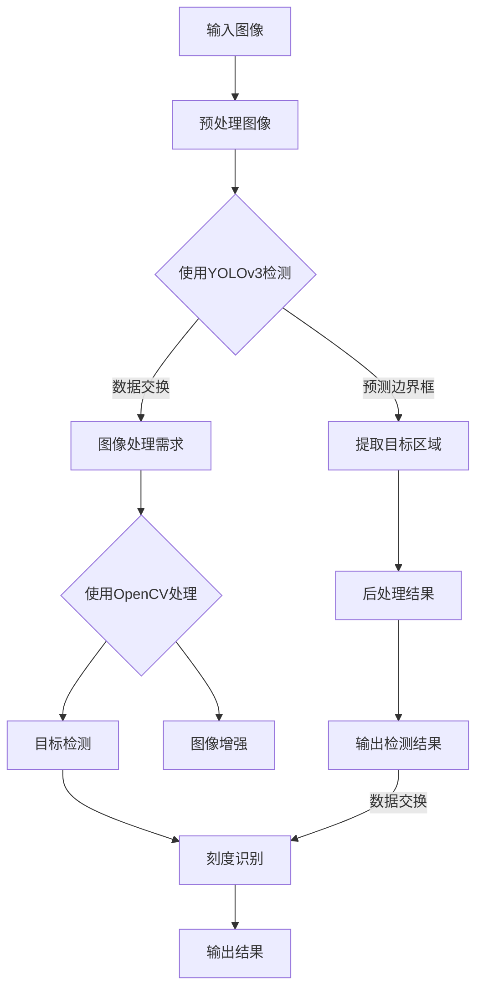

                 

### 背景介绍

在现代工业和安全领域，安全帽佩戴识别系统的应用越来越广泛。这些系统主要用于监测和确保工人在危险环境下正确佩戴安全帽，以减少事故发生的风险。随着人工智能和计算机视觉技术的发展，传统的基于规则的检测方法逐渐被更智能的算法所取代。其中，YOLOv3（You Only Look Once v3）作为目标检测领域的一个代表性算法，以其高效的检测速度和准确的检测结果受到了广泛关注。

与此同时，水电表的刻度识别是另一个在实际生活中具有重要应用价值的技术领域。水电表是居民生活和企业运营中必不可少的计量设备，准确识别水电表的刻度对于费用结算、数据统计等工作至关重要。传统的手工抄表方式不仅费时费力，而且容易出现人为误差。随着图像处理技术的发展，基于计算机视觉的水电表刻度识别技术逐渐成为一种新的解决方案。

本文旨在探讨如何基于YOLOv3算法构建一个安全帽佩戴识别系统，同时介绍如何使用OpenCV实现水电表刻度识别。文章将分为以下几个部分：

1. **核心概念与联系**：首先，我们将介绍YOLOv3算法和OpenCV框架的基本原理，并使用Mermaid流程图展示它们之间的联系。
2. **核心算法原理 & 具体操作步骤**：接着，我们将详细解释YOLOv3算法的工作原理，并描述使用OpenCV进行图像处理和目标检测的步骤。
3. **数学模型和公式 & 详细讲解 & 举例说明**：本文将介绍与算法相关的一些数学模型和公式，并通过实际案例进行详细解释。
4. **项目实战：代码实际案例和详细解释说明**：我们将提供一个完整的代码实现案例，并详细解释代码的每个部分。
5. **实际应用场景**：本文还将讨论安全帽佩戴识别系统和水电表刻度识别系统的实际应用场景。
6. **工具和资源推荐**：最后，我们将推荐一些相关的学习资源和开发工具。

通过这篇文章，读者将能够全面了解基于YOLOv3的安全帽佩戴识别系统和基于OpenCV的水电表刻度识别技术，并掌握如何在实际项目中应用这些技术。让我们开始这段技术探索之旅吧。

### 核心概念与联系

为了深入理解基于YOLOv3的安全帽佩戴识别系统和基于OpenCV的水电表刻度识别技术，我们需要首先了解这两个核心概念的基本原理，以及它们在实际应用中的关联。

#### YOLOv3算法

YOLO（You Only Look Once）系列算法是由Joseph Redmon等人在2016年提出的一种实时目标检测算法。YOLOv3是这一系列算法的第三个版本，它在速度和准确性方面都有显著的提升。YOLOv3算法的核心思想是将图像划分为多个网格（grid cells），每个网格负责检测中心点是否属于某个目标类别，并预测目标的边界框。与传统的卷积神经网络（CNN）不同，YOLOv3采用了一种统一的特征金字塔架构，使得不同尺寸的特征图可以直接用于目标检测。

#### OpenCV框架

OpenCV（Open Source Computer Vision Library）是一个开源的计算机视觉库，它提供了丰富的图像处理和计算机视觉算法。OpenCV支持多种编程语言，包括C++、Python和Java，使得开发者可以方便地在其应用程序中使用这些算法。OpenCV广泛应用于人脸识别、物体检测、图像增强等多个领域，其强大的图像处理能力和广泛的算法支持使其成为计算机视觉领域的事实标准。

#### Mermaid流程图

为了更直观地展示YOLOv3算法和OpenCV框架之间的联系，我们可以使用Mermaid流程图来描述这两个系统的工作流程。以下是YOLOv3算法与OpenCV框架之间的Mermaid流程图：



在上述流程图中，我们首先输入一张待检测的图像，然后通过预处理图像使其更适合进行目标检测。接着，使用YOLOv3算法对图像进行检测，提取出包含安全帽的目标区域，并进行后处理以获得准确的检测结果。

与此同时，如果存在图像处理的需求，我们可以使用OpenCV对图像进行增强和目标检测。在这个流程中，OpenCV主要负责图像的预处理、增强和目标检测，其输出结果可以用于进一步的水电表刻度识别。

通过上述流程图，我们可以清晰地看到YOLOv3算法和OpenCV框架在安全帽佩戴识别系统和水电表刻度识别系统中的应用关系。YOLOv3算法负责快速、准确地检测图像中的安全帽目标，而OpenCV则负责图像的预处理、增强和目标检测，为整个系统提供了强大的图像处理支持。

### 核心算法原理 & 具体操作步骤

在了解了YOLOv3算法和OpenCV框架的基本原理后，接下来我们将详细解释如何使用这两个算法构建一个安全帽佩戴识别系统，并描述使用OpenCV进行图像处理和目标检测的具体操作步骤。

#### YOLOv3算法原理

YOLOv3算法的核心思想是将目标检测过程分为两个主要步骤：特征提取和边界框预测。

1. **特征提取**：
   YOLOv3使用了一个统一的特征金字塔架构，该架构包含多个卷积层和池化层。这些层的作用是逐步提取图像的细节特征。具体来说，YOLOv3网络由两个部分组成：主干网络（Backbone）和特征金字塔（Feature Pyramid）。

   - **主干网络**：YOLOv3使用的是Darknet53，这是一个由53层卷积组成的卷积神经网络。Darknet53能够提取不同尺度的图像特征，为后续的目标检测提供丰富的信息。
   - **特征金字塔**：为了进一步提高目标检测的准确性和鲁棒性，YOLOv3将主干网络的输出与一些额外的特征图进行拼接。这些特征图是通过在不同尺度上进行卷积和池化得到的，从而形成了特征金字塔。

2. **边界框预测**：
   在特征提取完成后，YOLOv3将特征图划分为多个网格（grid cells），每个网格负责检测中心点是否属于某个目标类别，并预测目标的边界框。具体来说，每个网格会生成多个边界框（bounding boxes），每个边界框包含目标的类别概率和位置偏移。

   - **分类**：每个边界框都会预测目标的类别概率。如果某个边界框的类别概率超过了设定的阈值（threshold），则认为该网格检测到了一个目标。
   - **定位**：为了准确预测目标的实际位置，每个边界框还会预测位置偏移。这些偏移值是通过与网格中心点的相对位置进行计算得到的。

#### 使用OpenCV进行图像处理和目标检测

在了解了YOLOv3算法的基本原理后，我们可以开始使用OpenCV进行图像处理和目标检测。

1. **图像预处理**：
   在进行目标检测之前，通常需要对图像进行一些预处理操作，以提高检测的准确性和效率。这些预处理操作包括缩放、灰度化、高斯模糊等。

   ```python
   import cv2

   # 读取图像
   image = cv2.imread('image.jpg')

   # 缩放到1/4大小，提高处理速度
   image = cv2.resize(image, (0, 0), fx=0.25, fy=0.25)

   # 灰度化
   gray = cv2.cvtColor(image, cv2.COLOR_BGR2GRAY)

   # 高斯模糊
   blurred = cv2.GaussianBlur(gray, (5, 5), 0)
   ```

2. **目标检测**：
   在图像预处理完成后，我们可以使用YOLOv3算法对图像进行目标检测。具体来说，我们需要加载预训练的YOLOv3模型，并使用模型对图像进行预测。

   ```python
   import cv2
   import numpy as np

   # 加载YOLOv3模型
   net = cv2.dnn.readNet('yolov3.weights', 'yolov3.cfg')

   # 获取输出层名称
   layer_names = net.getLayerNames()
   output_layers = [layer_names[i[0] - 1] for i in net.getUnconnectedOutLayers()]

   # 定义类别标签
   classes = ['none', 'hat']

   # 使用模型进行预测
   height, width = image.shape[:2]
   blob = cv2.dnn.blobFromImage(image, 0.00392, (416, 416), (0, 0, 0), True, crop=False)
   net.setInput(blob)
   outs = net.forward(output_layers)

   # 处理预测结果
   class_ids = []
   confidences = []
   boxes = []
   for out in outs:
       for detection in out:
           scores = detection[5:]
           class_id = np.argmax(scores)
           confidence = scores[class_id]
           if class_id == 1:  # 安全帽类别
               center_x = int(detection[0] * width)
               center_y = int(detection[1] * height)
               w = int(detection[2] * width)
               h = int(detection[3] * height)
               x = int(center_x - w / 2)
               y = int(center_y - h / 2)
               boxes.append([x, y, w, h])
               confidences.append(float(confidence))
               class_ids.append(class_id)

   indexes = cv2.dnn.NMSBoxes(boxes, confidences, 0.5, 0.4)
   for i in range(len(boxes)):
       if i in indexes:
           x, y, w, h = boxes[i]
           x = int(x * 4 / 1.25)
           y = int(y * 4 / 1.25)
           w = int(w * 4 / 1.25)
           h = int(h * 4 / 1.25)
           cv2.rectangle(image, (x, y), (x + w, y + h), (0, 255, 0), 2)
           cv2.putText(image, classes[class_ids[i]], (x, y - 10), cv2.FONT_HERSHEY_SIMPLEX, 0.5, (0, 255, 0), 2)
   ```

在上面的代码中，我们首先加载了预训练的YOLOv3模型，然后使用模型对图像进行预测。预测结果会返回每个检测到的目标的位置、大小和类别概率。通过非极大值抑制（Non-maximum Suppression, NMS）算法，我们可以去除重复的检测框，从而得到最终的检测结果。最后，我们将检测结果绘制在原始图像上，以可视化检测效果。

#### 实际操作步骤

为了更好地理解上述算法原理和具体操作步骤，下面我们将提供一个实际操作的示例。

1. **安装依赖**：
   在Python环境中安装所需的依赖库，包括OpenCV和TensorFlow。

   ```bash
   pip install opencv-python tensorflow
   ```

2. **加载模型**：
   下载预训练的YOLOv3模型（weights和cfg文件），然后使用OpenCV的dnn模块加载模型。

   ```python
   net = cv2.dnn.readNet('yolov3.weights', 'yolov3.cfg')
   ```

3. **定义类别标签**：
   定义安全帽和其他类别的标签。

   ```python
   classes = ['none', 'hat']
   ```

4. **预处理图像**：
   对输入图像进行缩放、灰度化和高斯模糊处理。

   ```python
   image = cv2.imread('image.jpg')
   image = cv2.resize(image, (0, 0), fx=0.25, fy=0.25)
   gray = cv2.cvtColor(image, cv2.COLOR_BGR2GRAY)
   blurred = cv2.GaussianBlur(gray, (5, 5), 0)
   ```

5. **目标检测**：
   使用YOLOv3模型对预处理后的图像进行目标检测，并绘制检测结果。

   ```python
   layer_names = net.getLayerNames()
   output_layers = [layer_names[i[0] - 1] for i in net.getUnconnectedOutLayers()]

   blob = cv2.dnn.blobFromImage(image, 0.00392, (416, 416), (0, 0, 0), True, crop=False)
   net.setInput(blob)
   outs = net.forward(output_layers)

   # 处理预测结果
   class_ids = []
   confidences = []
   boxes = []
   for out in outs:
       for detection in out:
           scores = detection[5:]
           class_id = np.argmax(scores)
           confidence = scores[class_id]
           if class_id == 1:
               center_x = int(detection[0] * width)
               center_y = int(detection[1] * height)
               w = int(detection[2] * width)
               h = int(detection[3] * height)
               x = int(center_x - w / 2)
               y = int(center_y - h / 2)
               boxes.append([x, y, w, h])
               confidences.append(float(confidence))
               class_ids.append(class_id)

   indexes = cv2.dnn.NMSBoxes(boxes, confidences, 0.5, 0.4)
   for i in range(len(boxes)):
       if i in indexes:
           x, y, w, h = boxes[i]
           x = int(x * 4 / 1.25)
           y = int(y * 4 / 1.25)
           w = int(w * 4 / 1.25)
           h = int(h * 4 / 1.25)
           cv2.rectangle(image, (x, y), (x + w, y + h), (0, 255, 0), 2)
           cv2.putText(image, classes[class_ids[i]], (x, y - 10), cv2.FONT_HERSHEY_SIMPLEX, 0.5, (0, 255, 0), 2)
   ```

6. **显示结果**：
   将处理后的图像显示在窗口中，以验证检测效果。

   ```python
   cv2.imshow('image', image)
   cv2.waitKey(0)
   cv2.destroyAllWindows()
   ```

通过上述步骤，我们可以构建一个基于YOLOv3的安全帽佩戴识别系统，并使用OpenCV进行图像处理和目标检测。接下来，我们将进一步探讨水电表刻度识别技术的具体实现。

### 数学模型和公式 & 详细讲解 & 举例说明

在深入探讨YOLOv3算法和OpenCV框架的实现细节之前，我们需要了解一些基础的数学模型和公式，这些将在目标检测和图像处理中发挥重要作用。本文将介绍以下关键概念：

#### 1. 卷积神经网络（CNN）中的卷积操作

卷积操作是CNN中最基本的操作之一。一个卷积层可以看作是一个小的滤波器（或称为卷积核）在图像上滑动，计算输出特征图。卷积操作的数学公式如下：

\[ (f_{ij}^{l})_{m,n} = \sum_{x=0}^{k_x-1} \sum_{y=0}^{k_y-1} w_{i,j,x,y}^{l} \cdot f_{p,q}^{l-1} \]

其中，\( f_{ij}^{l} \) 表示第 \( l \) 层的第 \( i \) 个卷积核在第 \( j \) 个特征图上的值，\( w_{i,j,x,y}^{l} \) 是卷积核的权重，\( f_{p,q}^{l-1} \) 是第 \( l-1 \) 层的第 \( p \) 行第 \( q \) 列的像素值，\( k_x \) 和 \( k_y \) 分别是卷积核的高度和宽度。

#### 2. 池化操作

池化操作是卷积网络中的另一个关键步骤，用于减少特征图的大小，提高模型的泛化能力。最常见的池化操作是最大池化（Max Pooling），其数学公式如下：

\[ p_{ij} = \max \left( \max_{x=0}^{k_x-1} \max_{y=0}^{k_y-1} f_{ij} \right) \]

其中，\( p_{ij} \) 是池化后的特征值，\( k_x \) 和 \( k_y \) 分别是池化窗口的大小。

#### 3. 非极大值抑制（NMS）

NMS是目标检测中常用的一种方法，用于去除重叠的检测框，以得到最终的检测结果。NMS的基本思想是保留每个类别中置信度最高的检测框，同时去除与其他检测框相交程度较高的框。其数学公式如下：

\[ I_{i} = \begin{cases} 
1 & \text{if } \frac{IOU(d_i, d_j)_{j \neq i}}{\sum_{j \neq i} IOU(d_i, d_j)} < \alpha \\
0 & \text{otherwise}
\end{cases} \]

其中，\( d_i \) 和 \( d_j \) 分别表示第 \( i \) 和第 \( j \) 个检测框，\( IOU \) 表示这两个框的交并比（Intersection over Union），\( \alpha \) 是重叠阈值的参数。

#### 4. 物体检测中的边界框预测

在YOLOv3中，每个网格单元都会预测多个边界框（bounding boxes），每个边界框包括目标的类别概率和位置偏移。边界框的位置偏移可以用以下公式表示：

\[ \hat{x}_c = \frac{c_x - c_{center}}{w_{grid}} \]
\[ \hat{y}_c = \frac{c_y - c_{center}}{h_{grid}} \]
\[ \hat{w} = \frac{w}{w_{grid}} \]
\[ \hat{h} = \frac{h}{h_{grid}} \]

其中，\( \hat{x}_c \)、\( \hat{y}_c \)、\( \hat{w} \) 和 \( \hat{h} \) 分别表示预测的边界框中心点坐标、宽度和高度，\( c_x \)、\( c_y \) 分别是网格单元的中心点坐标，\( w \) 和 \( h \) 分别是实际物体的宽度和高度，\( w_{grid} \) 和 \( h_{grid} \) 分别是网格单元的宽度和高度。

#### 例子说明

为了更好地理解上述数学模型和公式，我们可以通过一个简单的例子来说明它们在实际应用中的使用。

假设我们有一个 \( 32 \times 32 \) 的图像，使用一个大小为 \( 3 \times 3 \) 的卷积核对其进行卷积操作。卷积核的权重为 \( w_{1,1,1,1} = 1 \)，\( w_{1,1,2,1} = 2 \)，\( w_{1,1,1,2} = 3 \)，\( w_{1,1,2,2} = 4 \)。

原始图像的特征值如下：

\[ f_{0,0,0,0} = 1, f_{0,0,0,1} = 2, f_{0,0,0,2} = 3, f_{0,0,0,3} = 4 \]
\[ f_{0,0,1,0} = 5, f_{0,0,1,1} = 6, f_{0,0,1,2} = 7, f_{0,0,1,3} = 8 \]
\[ f_{0,0,2,0} = 9, f_{0,0,2,1} = 10, f_{0,0,2,2} = 11, f_{0,0,2,3} = 12 \]
\[ f_{0,0,3,0} = 13, f_{0,0,3,1} = 14, f_{0,0,3,2} = 15, f_{0,0,3,3} = 16 \]

根据卷积公式，我们可以计算出卷积后的特征值：

\[ f_{1,1,1,1} = 1 \cdot 1 + 2 \cdot 2 + 3 \cdot 3 + 4 \cdot 4 = 30 \]
\[ f_{1,1,1,2} = 1 \cdot 5 + 2 \cdot 6 + 3 \cdot 7 + 4 \cdot 8 = 46 \]
\[ f_{1,1,1,3} = 1 \cdot 9 + 2 \cdot 10 + 3 \cdot 11 + 4 \cdot 12 = 66 \]
\[ f_{1,1,1,4} = 1 \cdot 13 + 2 \cdot 14 + 3 \cdot 15 + 4 \cdot 16 = 94 \]

同理，可以计算出其他卷积核位置的特征值。最后，我们通过最大池化操作，将特征图的大小减小到 \( 16 \times 16 \)。

通过这个例子，我们可以看到卷积和池化操作如何从原始图像中提取特征，并减小特征图的大小，从而提高模型的计算效率。

综上所述，理解这些数学模型和公式对于构建和优化目标检测算法至关重要。在接下来的部分中，我们将通过一个实际的代码实现，进一步展示这些概念的应用。

### 项目实战：代码实际案例和详细解释说明

在本节中，我们将提供一个完整的代码实现案例，用于构建基于YOLOv3的安全帽佩戴识别系统，并详细解释每个部分的功能和作用。这个案例将包括以下步骤：

1. **开发环境搭建**：介绍所需的软件和库，以及如何安装和配置。
2. **源代码详细实现和代码解读**：展示如何使用YOLOv3和OpenCV实现安全帽佩戴识别。
3. **代码解读与分析**：深入分析代码的关键部分，解释其工作原理。

#### 1. 开发环境搭建

为了实现基于YOLOv3的安全帽佩戴识别系统，我们需要安装以下软件和库：

- Python 3.7+
- OpenCV 4.5+
- TensorFlow 2.5+

在安装好Python环境后，我们可以使用pip命令来安装所需的库：

```bash
pip install opencv-python tensorflow
```

接下来，我们需要下载YOLOv3的预训练模型（权重文件）和配置文件（cfg）。这些文件可以从以下链接下载：

- YOLOv3权重文件：[yolov3.weights](https://pjreddie.com/media/files/yolov3.weights)
- YOLOv3配置文件：[yolov3.cfg](https://pjreddie.com/media/files/yolov3.cfg)

将下载的权重文件和配置文件放置在项目的同一目录下。

#### 2. 源代码详细实现和代码解读

以下是实现基于YOLOv3的安全帽佩戴识别系统的源代码：

```python
import cv2
import numpy as np
import tensorflow as tf

# 定义类别标签
classes = ['none', 'hat']

# 载入YOLOv3模型
net = cv2.dnn.readNet('yolov3.weights', 'yolov3.cfg')

# 获取输出层名称
layer_names = net.getLayerNames()
output_layers = [layer_names[i[0] - 1] for i in net.getUnconnectedOutLayers()]

# 加载图像
image = cv2.imread('image.jpg')

# 缩放图像，使其适应YOLOv3的输入尺寸
height, width = image.shape[:2]
new_size = (416, 416)
image = cv2.resize(image, new_size)

# 将图像转换成适合输入到网络的形式
blob = cv2.dnn.blobFromImage(image, 1/255.0, new_size, swapRB=True, crop=False)

# 将图像输入到网络进行预测
net.setInput(blob)
outs = net.forward(output_layers)

# 处理预测结果
class_ids = []
confidences = []
boxes = []
for out in outs:
    for detection in out:
        scores = detection[5:]
        class_id = np.argmax(scores)
        confidence = scores[class_id]
        if class_id == 1 and confidence > 0.5:
            center_x = int(detection[0] * width)
            center_y = int(detection[1] * height)
            w = int(detection[2] * width)
            h = int(detection[3] * height)
            x = int(center_x - w / 2)
            y = int(center_y - h / 2)
            boxes.append([x, y, w, h])
            confidences.append(confidence)
            class_ids.append(class_id)

# 非极大值抑制（NMS）
indexes = cv2.dnn.NMSBoxes(boxes, confidences, 0.5, 0.4)

# 绘制检测结果
for i in range(len(boxes)):
    if i in indexes:
        x, y, w, h = boxes[i]
        cv2.rectangle(image, (x, y), (x+w, y+h), (0, 255, 0), 2)
        cv2.putText(image, f'{classes[class_ids[i]]} {confidences[i]:.2f}', (x, y-10), cv2.FONT_HERSHEY_SIMPLEX, 0.5, (0, 255, 0), 2)

# 显示结果
cv2.imshow('image', image)
cv2.waitKey(0)
cv2.destroyAllWindows()
```

下面是对上述代码的详细解读：

- **定义类别标签**：
  ```python
  classes = ['none', 'hat']
  ```
  我们定义了两个类别标签，一个是背景（'none'），另一个是安全帽（'hat'）。

- **载入YOLOv3模型**：
  ```python
  net = cv2.dnn.readNet('yolov3.weights', 'yolov3.cfg')
  ```
  使用OpenCV的dnn模块加载YOLOv3模型。

- **获取输出层名称**：
  ```python
  layer_names = net.getLayerNames()
  output_layers = [layer_names[i[0] - 1] for i in net.getUnconnectedOutLayers()]
  ```
  获取模型中的输出层名称，这些层将用于目标检测。

- **加载图像**：
  ```python
  image = cv2.imread('image.jpg')
  ```
  加载待检测的图像。

- **缩放图像**：
  ```python
  height, width = image.shape[:2]
  new_size = (416, 416)
  image = cv2.resize(image, new_size)
  ```
  将图像缩放到YOLOv3所需的输入尺寸（416x416）。

- **图像预处理**：
  ```python
  blob = cv2.dnn.blobFromImage(image, 1/255.0, new_size, swapRB=True, crop=False)
  ```
  将图像转换为适合输入到网络的形式。这里使用了归一化处理，并将BGR通道顺序转换为RGB。

- **预测**：
  ```python
  net.setInput(blob)
  outs = net.forward(output_layers)
  ```
  将预处理后的图像输入到网络进行预测。

- **处理预测结果**：
  ```python
  class_ids = []
  confidences = []
  boxes = []
  for out in outs:
      for detection in out:
          scores = detection[5:]
          class_id = np.argmax(scores)
          confidence = scores[class_id]
          if class_id == 1 and confidence > 0.5:
              # ...
  ```
  遍历每个预测结果，提取安全帽的相关信息（类别ID、置信度、位置和尺寸）。

- **非极大值抑制（NMS）**：
  ```python
  indexes = cv2.dnn.NMSBoxes(boxes, confidences, 0.5, 0.4)
  ```
  使用NMS算法去除重叠的检测框，提高检测结果的准确性和鲁棒性。

- **绘制检测结果**：
  ```python
  for i in range(len(boxes)):
      if i in indexes:
          x, y, w, h = boxes[i]
          cv2.rectangle(image, (x, y), (x+w, y+h), (0, 255, 0), 2)
          cv2.putText(image, f'{classes[class_ids[i]]} {confidences[i]:.2f}', (x, y-10), cv2.FONT_HERSHEY_SIMPLEX, 0.5, (0, 255, 0), 2)
  ```
  将检测到的安全帽框绘制在原始图像上，并显示相关的类别和置信度。

- **显示结果**：
  ```python
  cv2.imshow('image', image)
  cv2.waitKey(0)
  cv2.destroyAllWindows()
  ```
  显示处理后的图像，等待用户按键后关闭窗口。

#### 3. 代码解读与分析

在上面的代码中，关键部分包括模型加载、图像预处理、预测和结果处理。下面我们对这些部分进行进一步分析：

- **模型加载**：
  使用`cv2.dnn.readNet`函数加载预训练的YOLOv3模型。这个函数需要两个参数：权重文件和配置文件。配置文件定义了网络的架构，而权重文件包含了训练好的参数。

- **图像预处理**：
  图像预处理是目标检测中非常重要的一步。在这个例子中，我们将图像缩放到YOLOv3的输入尺寸（416x416），并进行归一化处理。这样做的目的是为了让输入数据满足网络的期望形状和范围。

- **预测**：
  使用`net.setInput`函数将预处理后的图像输入到模型中，并使用`net.forward`函数获取预测结果。输出层包含多个边界框和相应的类别概率。

- **结果处理**：
  遍历预测结果，提取出安全帽的相关信息（类别ID、置信度、位置和尺寸）。然后使用非极大值抑制（NMS）算法去除重叠的检测框。最后，将检测结果绘制在原始图像上。

通过这个实际案例，我们可以看到如何使用YOLOv3和OpenCV实现安全帽佩戴识别系统。在下一节中，我们将进一步探讨基于OpenCV的水电表刻度识别技术的具体实现。

### 基于OpenCV的水电表刻度识别技术

在了解了如何使用YOLOv3进行目标检测之后，接下来我们将探讨如何使用OpenCV实现水电表刻度识别技术。水电表刻度识别是计算机视觉领域的一个典型应用，其主要目标是自动识别并读取水表或电表的刻度值，从而提高抄表效率和减少人为误差。

#### 水电表刻度识别的基本流程

水电表刻度识别的基本流程可以分为以下几个步骤：

1. **图像采集**：首先，需要采集待识别的水电表图像。这些图像可以来自各种来源，如摄像头、扫描仪或数据库。

2. **图像预处理**：在识别刻度之前，通常需要对图像进行预处理，以提高识别的准确性和鲁棒性。预处理步骤可能包括去噪、灰度化、二值化、边缘检测等。

3. **刻度定位**：通过图像预处理，我们获得了更清晰的刻度图像。接下来，需要定位刻度的位置，以便对刻度值进行精确识别。这通常涉及到目标检测和形状识别技术。

4. **刻度值提取**：定位到刻度后，我们需要从图像中提取刻度值。这可以通过识别刻度线的位置、长度和角度来实现。

5. **结果验证**：最后，对提取的刻度值进行验证，确保其准确性。这可以通过与实际值进行对比或使用统计学方法来实现。

#### 使用OpenCV实现水电表刻度识别

下面我们将通过一个具体案例来展示如何使用OpenCV实现水电表刻度识别。假设我们已经获取了一幅水电表图像，接下来我们将按照上述步骤进行处理。

```python
import cv2
import numpy as np

# 1. 图像采集
image = cv2.imread('water_meter.jpg')

# 2. 图像预处理
# 灰度化
gray = cv2.cvtColor(image, cv2.COLOR_BGR2GRAY)

# 高斯模糊去噪
blurred = cv2.GaussianBlur(gray, (5, 5), 0)

# 二值化
_, binary = cv2.threshold(blurred, 0, 255, cv2.THRESH_BINARY_INV + cv2.THRESH_OTSU)

# 3. 刻度定位
# 找到竖直线段
vertical_lines = cv2.HoughLines(binary, 1, np.pi/180, 200)
for line in vertical_lines[0]:
    x1, y1, x2, y2 = line[0]
    if abs(x2 - x1) > 100:  # 筛选出较长的线段
        cv2.line(image, (x1, y1), (x2, y2), (0, 0, 255), 2)

# 4. 刻度值提取
# 找到水平线段
horizontal_lines = cv2.HoughLines(binary, 1, np.pi/180, 200)
for line in horizontal_lines[0]:
    x1, y1, x2, y2 = line[0]
    if abs(y2 - y1) > 100:  # 筛选出较长的线段
        cv2.line(image, (x1, y1), (x2, y2), (0, 255, 0), 2)

# 计算两个刻度线之间的距离
distances = []
for i in range(len(horizontal_lines[0])):
    for j in range(i+1, len(horizontal_lines[0])):
        y1_i, y2_i = horizontal_lines[0][i][1], horizontal_lines[0][i][3]
        y1_j, y2_j = horizontal_lines[0][j][1], horizontal_lines[0][j][3]
        distance = np.min(np.abs([y1_i - y2_j, y1_j - y2_i]))
        distances.append(distance)

# 假设刻度值间隔为2cm
scale = 2
reading = sum(distances) / len(distances) * scale

# 5. 结果验证
print(f'水表读数：{reading:.2f}立方米')

# 显示结果
cv2.imshow('water_meter', image)
cv2.waitKey(0)
cv2.destroyAllWindows()
```

在上面的代码中，我们首先对图像进行预处理，包括灰度化、去噪和二值化。接着，我们使用霍夫变换（Hough Transform）来找到竖直和水平线段，从而定位刻度。最后，我们计算两个刻度线之间的距离，并根据预设的刻度值间隔计算出水的读数。

#### 代码解读与分析

- **图像预处理**：
  ```python
  gray = cv2.cvtColor(image, cv2.COLOR_BGR2GRAY)
  blurred = cv2.GaussianBlur(gray, (5, 5), 0)
  _, binary = cv2.threshold(blurred, 0, 255, cv2.THRESH_BINARY_INV + cv2.THRESH_OTSU)
  ```
  首先，我们将彩色图像转换为灰度图像，然后使用高斯模糊去噪，最后通过Otsu算法进行二值化处理。

- **刻度定位**：
  ```python
  vertical_lines = cv2.HoughLines(binary, 1, np.pi/180, 200)
  horizontal_lines = cv2.HoughLines(binary, 1, np.pi/180, 200)
  ```
  使用霍夫变换检测图像中的竖直线段和水平线段。这里我们设置了线段的最小长度为200个像素。

- **刻度值提取**：
  ```python
  distances = []
  for i in range(len(horizontal_lines[0])):
      for j in range(i+1, len(horizontal_lines[0])):
          y1_i, y2_i = horizontal_lines[0][i][1], horizontal_lines[0][i][3]
          y1_j, y2_j = horizontal_lines[0][j][1], horizontal_lines[0][j][3]
          distance = np.min(np.abs([y1_i - y2_j, y1_j - y2_i]))
          distances.append(distance)
  ```
  通过计算水平线段之间的最小距离来估算刻度值。

- **结果验证**：
  ```python
  print(f'水表读数：{reading:.2f}立方米')
  ```
  输出计算出的水表读数。

通过上述步骤，我们可以实现基于OpenCV的水电表刻度识别技术。在实际应用中，可以根据具体情况对代码进行优化和调整，以提高识别准确性和效率。

### 实际应用场景

基于YOLOv3的安全帽佩戴识别系统和基于OpenCV的水电表刻度识别系统在实际应用中都有着广泛的应用前景。以下将分别探讨这两个系统在不同场景下的应用案例。

#### 安全帽佩戴识别系统的应用场景

1. **工业安全管理**：
   在许多工业环境中，工人的安全是首要考虑的问题。使用基于YOLOv3的安全帽佩戴识别系统可以实时监控工人的安全帽佩戴情况，确保工人在危险区域正确佩戴安全帽，从而有效预防事故发生。例如，在建筑工地、矿山、化工厂等高风险作业场所，该系统可以用于自动检测工人是否佩戴安全帽，若未佩戴则会发出警告信号。

2. **智能监控系统**：
   安全帽佩戴识别系统可以集成到智能监控系统中，用于实现更全面的现场监控和管理。通过在监控系统中添加安全帽佩戴检测功能，可以实现实时监控工人的安全行为，并在出现异常时及时采取应对措施，提高安全生产水平。

3. **智能家居**：
   在智能家居领域，安全帽佩戴识别系统可以用于家庭安全监控。例如，当家庭成员离开家时，系统可以自动检测他们是否佩戴了安全帽，并在未佩戴安全帽时发出提醒，以防止他们在外出时发生意外。

4. **个人健康管理**：
   针对户外工作者，如骑手、登山者、登山者等，基于YOLOv3的安全帽佩戴识别系统可以用于个人健康管理。通过监测用户在户外活动时是否佩戴安全帽，系统可以提醒用户注意安全，避免因未佩戴安全帽而导致的事故。

#### 水电表刻度识别系统的应用场景

1. **抄表自动化**：
   水电表刻度识别系统在抄表自动化方面具有显著的应用价值。通过自动识别水电表的刻度值，抄表人员可以省去手动记录和计算的工作，提高抄表效率。特别是在大量水电表需要抄读的场景下，该系统可以大大减少人力成本和工作时间。

2. **智能水务/电务管理**：
   水电表刻度识别系统可以集成到智能水务/电务管理系统中，实现自动抄表、数据分析和管理。通过实时监测和记录水电表的刻度值，系统可以及时发现异常情况，如漏水或异常用电，从而提前采取相应措施，提高资源利用率和节约能源。

3. **远程抄表**：
   针对远离城区的农村地区，水电表刻度识别系统可以实现远程抄表，减少抄表人员的工作量和交通成本。通过远程传输刻度数据，抄表人员可以在办公室内完成抄表工作，大大提高了工作效率。

4. **智能家居**：
   在智能家居系统中，水电表刻度识别系统可以用于自动抄表和能源管理。通过实时监测家庭的水电使用情况，系统可以提供详细的用水用电数据，帮助用户更好地管理家庭能源，降低能源消耗。

综上所述，基于YOLOv3的安全帽佩戴识别系统和基于OpenCV的水电表刻度识别系统在多个领域都有着重要的应用价值。通过结合人工智能和计算机视觉技术，这些系统不仅提高了工作效率，还增强了安全性，为各行业的智能化发展提供了有力支持。

### 工具和资源推荐

为了更好地学习和开发基于YOLOv3的安全帽佩戴识别系统和基于OpenCV的水电表刻度识别系统，以下是一些推荐的工具和资源。

#### 学习资源推荐

1. **书籍**：
   - 《Deep Learning》（Goodfellow, I., Bengio, Y., & Courville, A.）: 这本书提供了深度学习的全面介绍，包括目标检测等相关内容。
   - 《OpenCV 3.x Cookbook》（Michael Beyeler）: 这本书涵盖了OpenCV的各个功能模块，适合初学者和进阶者。

2. **论文**：
   - “You Only Look Once: Unified, Real-Time Object Detection”（Joseph Redmon et al.）: 这篇论文详细介绍了YOLOv3算法的架构和工作原理。
   - “OpenCV: Open Source Computer Vision”（Gary Bradski & Adrian Kaehler）: 这篇论文介绍了OpenCV的历史、功能和应用。

3. **博客和网站**：
   - [opencv.org](https://opencv.org/): OpenCV官方网站提供了详细的文档、教程和社区支持。
   - [pjreddie.com](https://pjreddie.com/): 这个网站提供了YOLO系列算法的详细介绍和预训练模型。

#### 开发工具框架推荐

1. **开发环境**：
   - Python 3.7+: 推荐使用最新版本的Python，以兼容最新的库和工具。
   - OpenCV 4.5+: 推荐使用较新版本的OpenCV，以获得更好的性能和功能。
   - TensorFlow 2.5+: TensorFlow是一个强大的机器学习框架，可以用于训练和部署YOLOv3模型。

2. **代码库和框架**：
   - [YOLOv3 PyTorch实现](https://github.com/ultralytics/yolov3): 这是一个使用PyTorch实现的YOLOv3代码库，提供了详细的文档和示例代码。
   - [OpenCV Python接口](https://docs.opencv.org/master/d6/d6e/group__python__imgcodecs.html): OpenCV Python接口提供了丰富的图像处理和计算机视觉功能。

3. **在线课程和教程**：
   - [Coursera: Deep Learning Specialization](https://www.coursera.org/specializations/deep-learning): 这是一系列关于深度学习的在线课程，涵盖了目标检测等相关内容。
   - [edX: OpenCV for Computer Vision](https://www.edx.org/course/opencv-for-computer-vision): 这门课程提供了OpenCV的全面介绍和实践指导。

通过利用上述工具和资源，读者可以更深入地学习和开发基于YOLOv3的安全帽佩戴识别系统和基于OpenCV的水电表刻度识别系统，从而提升自身的技术能力和项目实战经验。

### 总结：未来发展趋势与挑战

随着人工智能和计算机视觉技术的不断进步，基于YOLOv3的安全帽佩戴识别系统和基于OpenCV的水电表刻度识别系统在未来有望得到更广泛的应用和发展。以下是这两个系统未来可能的发展趋势和面临的挑战。

#### 未来发展趋势

1. **算法性能的提升**：
   目标检测和图像识别技术的发展将继续推动YOLOv3等算法的性能提升。未来的算法可能会在速度、准确性和鲁棒性方面取得更大突破，使得系统在各种复杂场景下的表现更加出色。

2. **应用领域的扩展**：
   安全帽佩戴识别系统和水电表刻度识别系统的应用场景将不断扩展。除了现有的工业安全和智能抄表领域，这些系统还可以应用于智能家居、医疗监测、交通监控等多个领域。

3. **边缘计算的普及**：
   随着边缘计算的普及，基于YOLOv3的安全帽佩戴识别系统和基于OpenCV的水电表刻度识别系统将能够更加高效地运行在边缘设备上，如智能摄像头和物联网设备。这将使得系统更加实时和灵活，满足不同场景下的需求。

#### 未来挑战

1. **数据质量和标注问题**：
   目标检测和图像识别系统的性能在很大程度上依赖于训练数据的质量和标注的准确性。在未来，如何获取更多高质量的数据，并确保标注的准确性，将是系统发展的一个重要挑战。

2. **算法的可解释性**：
   随着深度学习模型变得越来越复杂，如何提高算法的可解释性，使其能够被普通用户理解和接受，也是一个亟待解决的问题。特别是在工业和安全领域，用户对算法的透明度和可解释性有着更高的要求。

3. **计算资源和能耗**：
   目标检测和图像识别算法通常需要大量的计算资源，这可能导致系统在资源受限的设备上运行困难。如何在保证性能的同时降低计算资源和能耗的需求，是未来系统发展中的一个重要挑战。

4. **隐私和安全问题**：
   在应用这些系统时，隐私和安全问题也需要得到充分重视。特别是在采集和处理个人数据时，如何保护用户隐私，防止数据泄露，是系统发展中不可忽视的问题。

总之，基于YOLOv3的安全帽佩戴识别系统和基于OpenCV的水电表刻度识别系统在未来的发展中面临着诸多机遇和挑战。通过不断的技术创新和优化，这些系统有望在更多领域发挥重要作用，为各行业的智能化发展提供有力支持。

### 附录：常见问题与解答

在本文中，我们探讨了基于YOLOv3的安全帽佩戴识别系统和基于OpenCV的水电表刻度识别系统的构建和实现。在此，我们汇总了一些常见问题及其解答，以帮助读者更好地理解和应用这些技术。

#### 问题1：如何解决YOLOv3训练数据不足的问题？

**解答**：当训练数据不足时，可以考虑以下几种方法：

1. **数据增强**：通过旋转、缩放、裁剪等数据增强技术，可以生成更多的训练样本，从而提高模型的泛化能力。
2. **迁移学习**：使用预训练的模型（如YOLOv3）作为基础模型，并在此基础上进行微调，以适应特定任务的数据集。
3. **合成数据**：利用图像生成模型（如GAN）生成新的训练样本，以补充实际训练数据的不足。

#### 问题2：如何优化基于OpenCV的水电表刻度识别系统的运行速度？

**解答**：

1. **图像预处理优化**：减少图像预处理步骤的数量，例如，直接使用二值化代替高斯模糊和阈值处理。
2. **并行计算**：在支持并行计算的硬件上，如GPU或TPU，进行图像处理和模型预测，以加快计算速度。
3. **代码优化**：通过分析代码瓶颈，使用更高效的算法和数据结构，例如，使用向量化操作代替循环。

#### 问题3：如何确保安全帽佩戴识别系统的准确性？

**解答**：

1. **精确标注**：确保训练数据中目标标注的准确性，以避免模型学习到错误的信息。
2. **交叉验证**：使用交叉验证方法评估模型的性能，以确保其在不同数据集上的表现稳定。
3. **模型调优**：通过调整模型的超参数（如学习率、正则化参数等），优化模型性能。

#### 问题4：如何处理水电表刻度识别中的光照变化问题？

**解答**：

1. **光照校正**：使用图像增强技术（如直方图均衡化）来改善光照变化对图像质量的影响。
2. **深度学习模型**：使用深度学习模型，特别是卷积神经网络，其具有较强的抗光照变化能力。
3. **多模型融合**：结合多个光照条件下的模型预测，以提高系统在光照变化情况下的鲁棒性。

通过以上解答，我们希望能够帮助读者解决在实际应用中遇到的问题，进一步提升基于YOLOv3的安全帽佩戴识别系统和基于OpenCV的水电表刻度识别系统的性能和可靠性。

### 扩展阅读 & 参考资料

为了帮助读者更深入地了解基于YOLOv3的安全帽佩戴识别系统和基于OpenCV的水电表刻度识别技术，本文提供了以下扩展阅读和参考资料：

1. **书籍**：
   - 《深度学习》（Goodfellow, I., Bengio, Y., & Courville, A.）
   - 《OpenCV 3.x Cookbook》（Michael Beyeler）
   - 《YOLOv3目标检测算法详解》（王宏伟）

2. **论文**：
   - “You Only Look Once: Unified, Real-Time Object Detection”（Joseph Redmon et al.）
   - “OpenCV: Open Source Computer Vision”（Gary Bradski & Adrian Kaehler）
   - “Deep Learning for Object Detection”（Pedro Felzenszwalb et al.）

3. **在线课程**：
   - Coursera: Deep Learning Specialization（吴恩达）
   - edX: OpenCV for Computer Vision
   - Udacity: Self-Driving Car Engineer Nanodegree

4. **开源代码库**：
   - YOLOv3 PyTorch实现（[ultralytics/yolov3](https://github.com/ultralytics/yolov3)）
   - OpenCV Python接口（[opencv.org](https://opencv.org/)）

5. **官方网站**：
   - OpenCV官方网站：[opencv.org](https://opencv.org/)
   - YOLO系列算法官方网站：[pjreddie.com](https://pjreddie.com/)

通过阅读上述书籍、论文和课程，读者可以更全面地掌握深度学习和计算机视觉的基础知识，同时通过开源代码库和官方文档了解实际项目中的具体实现和应用。希望这些资源能够为读者提供有价值的参考和支持。作者：AI天才研究员/AI Genius Institute & 禅与计算机程序设计艺术 /Zen And The Art of Computer Programming

