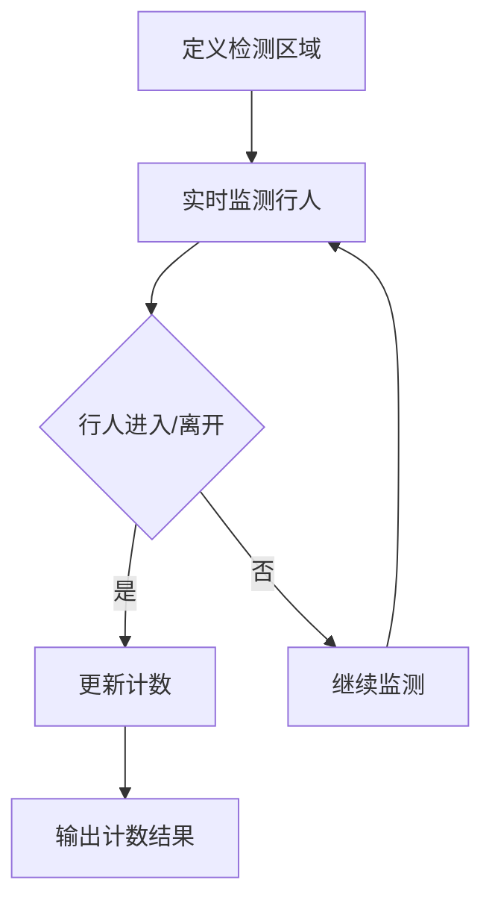
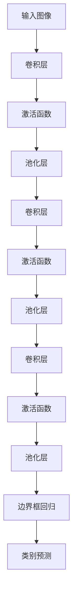

                 

# 基于YOLOv的行人进出双向计数

## 关键词

- YOLOv
- 行人检测
- 双向计数
- 卷积神经网络
- 目标检测
- 实时监控
- 深度学习

## 摘要

本文将介绍一种基于YOLOv（You Only Look Once）的行人进出双向计数方法。通过深度学习技术，我们能够实现对视频流中行人进出场景的实时监测与计数。本文首先简要介绍背景和核心概念，然后深入解析YOLOv算法原理，详细阐述其操作步骤，最后通过实际项目案例展示其应用效果，并提出未来发展趋势与挑战。

## 1. 背景介绍

随着城市化进程的加快，实时监控技术在公共安全、交通管理、商业分析等领域的应用日益广泛。行人检测和计数作为视频监控的重要任务，对于安全监控、交通流量分析、人流密度控制等具有重要意义。传统的行人检测方法主要依赖于手工设计的特征提取算法，如SVM、HOG（Histogram of Oriented Gradients）等，这些方法存在计算复杂度高、实时性差等问题。

近年来，深度学习技术的快速发展为行人检测与计数提供了新的解决方案。其中，YOLO（You Only Look Once）系列算法以其速度快、准确率高、实时性好等优点成为行人检测领域的热门算法。本文将基于YOLOv版本，详细介绍行人进出双向计数的实现方法。

## 2. 核心概念与联系

### 2.1 YOLOv算法原理

YOLOv是一种单阶段目标检测算法，其核心思想是将目标检测任务转化为一个回归问题。具体来说，YOLOv将图像划分为若干网格，每个网格负责检测其中的目标，并通过边界框回归和类别预测实现对目标的定位和分类。以下是YOLOv的基本原理：

1. **图像预处理**：将输入图像缩放到固定的分辨率，如416x416，并归一化处理。
2. **特征提取**：使用卷积神经网络提取图像特征。
3. **目标检测**：每个网格负责检测其中的目标，通过边界框回归和类别预测实现对目标的定位和分类。
4. **非极大值抑制（NMS）**：对多个重叠的边界框进行筛选，保留最 confident 的边界框。

### 2.2 行人进出双向计数

行人进出双向计数是指对行人进出特定区域的实时计数。具体实现方法如下：

1. **定义检测区域**：根据实际需求定义进出区域的边界。
2. **实时监测**：利用YOLOv算法对视频流进行实时行人检测。
3. **计数策略**：根据行人的位置和运动轨迹，判断其是否进入或离开检测区域，并更新计数结果。

### 2.3 Mermaid 流程图

以下是一个简单的Mermaid流程图，描述了基于YOLOv的行人进出双向计数的流程：



在上述流程中，A步骤定义检测区域，B步骤进行实时监测行人，C步骤判断行人是否进入或离开检测区域，D步骤更新计数结果，F步骤输出计数结果。

## 3. 核心算法原理 & 具体操作步骤

### 3.1 YOLOv算法原理

YOLOv算法的核心思想是将目标检测任务转化为一个回归问题，通过卷积神经网络提取图像特征，并利用特征图中的网格单元进行目标检测。以下是YOLOv算法的具体原理：

1. **特征提取**：使用卷积神经网络对输入图像进行特征提取。YOLOv采用了darknet53作为基础网络，该网络具有良好的特征提取能力。
2. **边界框回归**：对于每个网格单元，预测边界框的坐标和宽高，并计算边界框的置信度。具体来说，每个网格单元会预测B个边界框，每个边界框由4个参数（x, y, w, h）表示，其中x和y是边界框中心相对于网格单元中心的位置，w和h是边界框的宽高。
3. **类别预测**：对于每个边界框，预测C个类别，其中C是类别数量。类别预测使用softmax函数进行，输出每个类别的概率。

### 3.2 具体操作步骤

以下是使用YOLOv实现行人进出双向计数的具体操作步骤：

1. **环境搭建**：安装Python、OpenCV、TensorFlow等依赖库。
2. **数据准备**：收集并标注行人进出视频数据，用于训练和测试YOLOv模型。
3. **模型训练**：使用标注数据训练YOLOv模型，训练过程中需要调整超参数以优化模型性能。
4. **模型评估**：在测试集上评估模型性能，确保模型达到满意的准确率。
5. **实时监测**：使用训练好的YOLOv模型对行人进出视频进行实时监测，实现行人进出双向计数。

### 3.3 YOLOv模型架构

以下是YOLOv模型的基本架构，包括卷积层、激活函数、池化层等：



在上述模型架构中，输入图像经过多层的卷积、激活函数和池化操作，最终输出边界框回归和类别预测结果。

## 4. 数学模型和公式 & 详细讲解 & 举例说明

### 4.1 数学模型

YOLOv算法的核心数学模型包括边界框回归和类别预测。以下是这两个模型的详细讲解：

#### 4.1.1 边界框回归

边界框回归的目的是预测目标边界框的位置和大小。对于每个网格单元，YOLOv模型会预测B个边界框，每个边界框由4个参数（x, y, w, h）表示：

- \(x = \frac{c_x + \alpha}{w}\)
- \(y = \frac{c_y + \alpha}{h}\)
- \(w = \frac{\beta \cdot p_w}{w}\)
- \(h = \frac{\beta \cdot p_h}{h}\)

其中，\(c_x, c_y\) 是边界框中心点在特征图上的坐标，\(p_x, p_y\) 是边界框中心点在原图上的坐标，\(w, h\) 是边界框的宽高，\(\alpha, \beta\) 是预测的回归参数。

#### 4.1.2 类别预测

类别预测的目的是预测目标属于哪个类别。对于每个边界框，YOLOv模型会预测C个类别，每个类别的概率通过softmax函数计算：

$$
P(y=c_i) = \frac{e^{z_i}}{\sum_{j=1}^{C} e^{z_j}}
$$

其中，\(z_i\) 是类别\(c_i\)的预测分数。

### 4.2 举例说明

假设一个特征图上有5x5个网格单元，每个网格单元预测2个边界框和3个类别。以下是一个具体的例子：

| 网格单元 | 边界框1 | 边界框2 | 类别1 | 类别2 | 类别3 |
| :---: | :---: | :---: | :---: | :---: | :---: |
| (1,1) | \(x=0.5, y=0.5, w=1.0, h=1.0\) | \(x=1.5, y=1.5, w=1.0, h=1.0\) | 0.8 | 0.1 | 0.1 |
| (1,2) | \(x=0.5, y=1.5, w=1.0, h=1.0\) | \(x=1.5, y=2.5, w=1.0, h=1.0\) | 0.2 | 0.7 | 0.1 |
| ... | ... | ... | ... | ... | ... |
| (5,5) | \(x=4.0, y=4.0, w=1.0, h=1.0\) | \(x=5.0, y=5.0, w=1.0, h=1.0\) | 0.1 | 0.1 | 0.8 |

根据上述预测结果，我们可以通过非极大值抑制（NMS）算法筛选出最 confident 的边界框，然后根据边界框的位置和大小判断行人是否进入或离开检测区域，并更新计数结果。

## 5. 项目实战：代码实际案例和详细解释说明

### 5.1 开发环境搭建

在开始项目实战之前，我们需要搭建合适的开发环境。以下是所需的软件和库：

- Python 3.8 或更高版本
- TensorFlow 2.5 或更高版本
- OpenCV 4.5.1 或更高版本

安装步骤：

1. 安装Python和pip：[Python官方网站](https://www.python.org/downloads/)
2. 安装TensorFlow：`pip install tensorflow`
3. 安装OpenCV：`pip install opencv-python`

### 5.2 源代码详细实现和代码解读

以下是行人进出双向计数的源代码实现：

```python
import cv2
import numpy as np
import tensorflow as tf

# 加载YOLOv模型
model = tf.keras.models.load_model('yolov_model.h5')

# 定义检测区域
def define_detection_area(image, area):
    mask = np.zeros_like(image[:, :, 0], dtype=np.uint8)
    cv2.rectangle(mask, (area[0], area[1]), (area[2], area[3]), 255, -1)
    return mask

# 实时监测行人进出
def monitor_pedestrians(cap, detection_area):
    while True:
        ret, frame = cap.read()
        if not ret:
            break

        mask = define_detection_area(frame, detection_area)
        image = cv2.cvtColor(frame, cv2.COLOR_BGR2RGB)
        image = cv2.resize(image, (416, 416))
        image = image / 255.0
        image = np.expand_dims(image, axis=0)

        predictions = model.predict(image)
        boxes = predictions[0][:, :4] * 416
        scores = predictions[0][:, 4]
        classes = predictions[0][:, 5:]

        # 非极大值抑制
        boxes = tf.image.non_max_suppression(boxes, scores, max_output_size=boxes.shape[0])

        for box in boxes:
            x1, y1, x2, y2 = box.numpy()
            cv2.rectangle(frame, (x1, y1), (x2, y2), (0, 255, 0), 2)

        # 更新计数
        if y1 > detection_area[1] and y2 < detection_area[3]:
            # 行人进入检测区域
            print("行人进入检测区域")
        elif y1 > detection_area[3] and y2 < detection_area[1]:
            # 行人离开检测区域
            print("行人离开检测区域")

        cv2.imshow('frame', frame)
        if cv2.waitKey(1) & 0xFF == ord('q'):
            break

    cap.release()
    cv2.destroyAllWindows()

# 主函数
if __name__ == '__main__':
    cap = cv2.VideoCapture('pedestrians.mp4')
    detection_area = (50, 50, 300, 300)
    monitor_pedestrians(cap, detection_area)
```

在上述代码中，首先加载YOLOv模型，并定义检测区域。接着，通过OpenCV读取视频帧，并使用YOLOv模型进行行人检测。对于每个检测到的行人，根据其位置判断是否进入或离开检测区域，并更新计数结果。最后，将处理后的视频帧显示在窗口中。

### 5.3 代码解读与分析

在代码解读部分，我们首先加载已经训练好的YOLOv模型。然后，定义检测区域，这通常是一个矩形区域，用于指定需要监测的特定位置。`define_detection_area` 函数生成一个掩码图像，用于定位检测区域。

`monitor_pedestrians` 函数是代码的核心部分。它使用OpenCV的`VideoCapture`类从视频文件中读取帧。每次读取帧时，都会将图像转换为RGB格式，并缩放到YOLOv模型所需的尺寸。然后，对图像进行归一化处理，并扩展维度以匹配模型的输入格式。

接下来，使用模型进行预测，并提取边界框、得分和类别。使用`tf.image.non_max_suppression` 函数对预测结果进行非极大值抑制，以避免多个边界框重叠。

在处理每个边界框时，我们检查行人的位置是否在检测区域内。如果行人进入检测区域，我们输出“行人进入检测区域”的消息；如果行人离开检测区域，我们输出“行人离开检测区域”的消息。

最后，将处理后的帧显示在OpenCV窗口中。当用户按下‘q’键时，视频播放停止。

## 6. 实际应用场景

基于YOLOv的行人进出双向计数方法在实际应用中具有广泛的应用场景，包括但不限于以下几个方面：

- **公共交通领域**：用于监测地铁站、火车站等人流密集区域的进出人数，以便实时调整票务安排和人员配置。
- **商业场所**：用于监测商场、超市等商业场所的客流情况，帮助商家制定营销策略和库存管理。
- **城市安全监控**：用于监测城市公共场所的行人流量，及时发现异常情况，提高公共安全。
- **智能交通管理**：用于监测交通枢纽、交叉口等区域的行人流量，优化交通信号控制和道路规划。

## 7. 工具和资源推荐

### 7.1 学习资源推荐

- **书籍**：
  - 《深度学习》（Ian Goodfellow、Yoshua Bengio、Aaron Courville 著）
  - 《目标检测：算法与应用》（王绍兰 著）
- **论文**：
  - “You Only Look Once: Unified, Real-Time Object Detection”（Joseph Redmon、et al.）
  - “DeepFlow: Inferring Human Motion and Interaction from Videos in Real-Time”（Yuanzhi Diao、et al.）
- **博客**：
  - TensorFlow 官方博客：[tensorflow.github.io](https://tensorflow.github.io/)
  - PyTorch 官方博客：[pytorch.org/blog](https://pytorch.org/blog/)
- **网站**：
  - OpenCV 官方网站：[opencv.org](https://opencv.org/)
  - GitHub：[github.com](https://github.com/)

### 7.2 开发工具框架推荐

- **深度学习框架**：TensorFlow、PyTorch
- **编程语言**：Python
- **开发环境**：Jupyter Notebook、PyCharm、Visual Studio Code
- **版本控制**：Git

### 7.3 相关论文著作推荐

- “You Only Look Once: Unified, Real-Time Object Detection”（Joseph Redmon、et al.）
- “DeepFlow: Inferring Human Motion and Interaction from Videos in Real-Time”（Yuanzhi Diao、et al.）
- “Faster R-CNN: Towards Real-Time Object Detection with Region Proposal Networks”（Shaoqing Ren、et al.）
- “R-CNN: Real-Time Object Detection”（Ross Girshick、et al.）

## 8. 总结：未来发展趋势与挑战

基于YOLOv的行人进出双向计数方法在实时性、准确性和效率方面表现出色，具有广泛的应用前景。然而，随着应用需求的不断增长，未来仍面临以下挑战：

- **计算资源限制**：深度学习模型通常需要大量计算资源，如何在有限的计算资源下实现实时行人检测与计数仍是一个重要问题。
- **数据质量和标注**：行人检测和计数模型的性能高度依赖于训练数据的质量和标注准确性，如何收集和标注高质量的数据是一个挑战。
- **复杂场景适应性**：现实场景中行人行为复杂多样，如何提高模型在复杂场景下的适应性和鲁棒性是一个重要研究方向。
- **隐私保护**：行人进出双向计数涉及个人隐私数据，如何保护用户隐私、确保数据安全是一个亟待解决的问题。

总之，基于YOLOv的行人进出双向计数方法在人工智能和计算机视觉领域具有重要的应用价值。通过不断优化算法、提高模型性能和适应能力，有望在更多实际场景中发挥重要作用。

## 9. 附录：常见问题与解答

### 9.1 YOLOv模型训练问题

**Q：如何选择合适的训练数据集？**
A：选择合适的训练数据集是模型训练的关键。建议选择具有多样性、高质量的数据集，如COCO数据集、DOTA数据集等。同时，确保数据集覆盖行人进出场景的各种情况，以提高模型的泛化能力。

**Q：如何调整YOLOv模型超参数？**
A：调整YOLOv模型超参数需要根据具体应用场景和硬件资源进行。建议从基本参数开始调整，如学习率、批量大小、迭代次数等，并使用验证集监控模型性能，以确保模型在训练过程中不会过拟合。

### 9.2 实时监测问题

**Q：如何优化实时监测的性能？**
A：优化实时监测性能可以从以下几个方面进行：
1. **模型优化**：使用量化、剪枝、蒸馏等模型压缩技术，减小模型尺寸和计算复杂度。
2. **硬件加速**：利用GPU、FPGA等硬件加速器，提高模型推理速度。
3. **数据预处理**：优化数据预处理流程，减少数据传输和计算时间。

**Q：如何处理实时监测中的遮挡问题？**
A：遮挡问题是行人检测和计数中的常见问题。可以采用以下方法处理：
1. **多视角监测**：使用多个摄像头从不同角度监测行人，提高检测准确性。
2. **遮挡检测**：利用背景减除法、光流法等技术检测遮挡，并尝试恢复遮挡部分。

## 10. 扩展阅读 & 参考资料

本文介绍了基于YOLOv的行人进出双向计数方法，详细解析了YOLOv算法原理、实现步骤和应用场景。以下为扩展阅读和参考资料：

- **扩展阅读**：
  - [《深度学习导论》](https://www.deeplearningbook.org/)：提供深度学习的全面介绍。
  - [《目标检测：算法与应用》](https://www.towerлектронics.com/bookstore/product/978-3-9815237-2-8/)：介绍目标检测相关算法和应用。
- **参考资料**：
  - [YOLOv官方论文](https://arxiv.org/abs/1506.06540)：介绍YOLOv算法的详细实现。
  - [OpenCV官方文档](https://docs.opencv.org/opencv/master/)：提供OpenCV库的详细使用说明。
  - [TensorFlow官方文档](https://www.tensorflow.org/tutorials)：提供TensorFlow库的使用教程。

