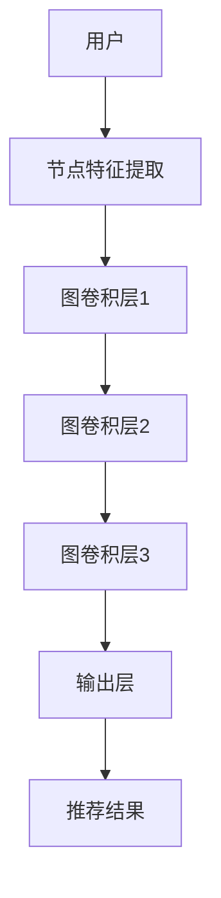

                 

# 基于图卷积网络的社交化推荐算法

## 摘要

本文深入探讨基于图卷积网络的社交化推荐算法，从背景介绍、核心概念与联系、核心算法原理及操作步骤、数学模型与公式、项目实战、实际应用场景、工具与资源推荐等方面进行了全面阐述。本文旨在为读者提供一个清晰的框架，理解如何利用图卷积网络进行社交化推荐，并展望其未来的发展趋势与挑战。

## 目录

1. 背景介绍
2. 核心概念与联系
3. 核心算法原理 & 具体操作步骤
4. 数学模型和公式 & 详细讲解 & 举例说明
5. 项目实战：代码实际案例和详细解释说明
   5.1 开发环境搭建
   5.2 源代码详细实现和代码解读
   5.3 代码解读与分析
6. 实际应用场景
7. 工具和资源推荐
   7.1 学习资源推荐（书籍/论文/博客/网站等）
   7.2 开发工具框架推荐
   7.3 相关论文著作推荐
8. 总结：未来发展趋势与挑战
9. 附录：常见问题与解答
10. 扩展阅读 & 参考资料

## 1. 背景介绍

随着互联网的快速发展，社交网络已经成为了人们日常生活中不可或缺的一部分。人们在社交网络上分享信息、建立关系、交流互动，这些活动产生了海量的用户行为数据。这些数据为推荐系统提供了丰富的信息资源，使得社交化推荐成为了一种重要的推荐方式。

传统的基于内容的推荐系统和基于协同过滤的推荐系统在处理社交网络数据时存在一定的局限性。基于内容的推荐系统依赖于用户的历史行为和兴趣标签，无法充分利用社交网络中的用户关系信息。而基于协同过滤的推荐系统则主要依赖于用户行为数据，忽略了社交网络中的社交关系。为了克服这些局限性，研究者们提出了基于图卷积网络的社交化推荐算法。

图卷积网络（Graph Convolutional Network，GCN）是一种基于图结构的神经网络模型，它可以有效地处理图数据。通过将社交网络表示为图结构，图卷积网络可以学习到节点之间的相互作用，从而实现社交化推荐。图卷积网络的引入，使得社交化推荐算法能够充分利用社交网络中的用户关系信息，提高推荐效果。

## 2. 核心概念与联系

### 2.1 图卷积网络（GCN）

图卷积网络是一种基于图结构的神经网络模型，它通过卷积操作学习节点之间的相互作用。在图卷积网络中，节点表示社交网络中的用户，边表示用户之间的关系。图卷积网络的基本操作包括节点特征提取和图结构建模。

节点特征提取是指将节点属性转换为数值特征，用于表示节点的特征信息。图结构建模是指通过卷积操作学习节点之间的相互作用，从而提取图结构特征。

### 2.2 社交化推荐

社交化推荐是一种基于社交网络数据的推荐方式，它通过利用社交网络中的用户关系信息，为用户提供个性化的推荐结果。社交化推荐的核心是利用社交网络中的图结构，通过图卷积网络学习用户之间的相互作用，从而实现推荐。

### 2.3 关联与联系

图卷积网络与社交化推荐之间存在紧密的关联。图卷积网络为社交化推荐提供了一种有效的模型框架，可以充分利用社交网络中的用户关系信息。而社交化推荐则为图卷积网络提供了实际的应用场景，使得图卷积网络在推荐领域发挥重要作用。

为了更直观地展示图卷积网络在社交化推荐中的应用，我们可以使用Mermaid流程图来描述其基本架构。



在该流程图中，用户首先进行节点特征提取，然后通过多个图卷积层学习用户之间的相互作用，最终输出推荐结果。

## 3. 核心算法原理 & 具体操作步骤

### 3.1 节点特征提取

节点特征提取是指将用户属性转换为数值特征，用于表示节点的特征信息。在社交化推荐中，节点特征主要包括用户的基本信息（如年龄、性别、地理位置等）和用户在社交网络中的行为特征（如关注数、点赞数、评论数等）。

为了进行节点特征提取，我们可以采用以下步骤：

1. 收集用户数据：包括用户基本信息和行为特征。
2. 数据预处理：对数据进行清洗、去重、归一化等处理。
3. 特征工程：根据业务需求，提取用户特征的数值表示，如One-Hot编码、TF-IDF等。

### 3.2 图卷积层

图卷积层是图卷积网络的核心部分，它通过卷积操作学习节点之间的相互作用。在图卷积层中，每个节点的输出由其自身特征和邻居节点的特征共同决定。

图卷积层的具体计算过程如下：

1. 初始化节点特征矩阵：将节点特征进行矩阵化表示。
2. 初始化邻接矩阵：表示节点之间的关系。
3. 应用卷积操作：计算每个节点的输出特征，公式如下：

   $$h_{ij}^{(l+1)} = \sigma(W^{(l)}h_{ij}^{(l)} + \sum_{k \in \mathcal{N}_i} W^{(l)}h_{ik}^{(l)} + b^{(l)})$$

   其中，$h_{ij}^{(l)}$表示第$l$层第$i$个节点的特征，$\mathcal{N}_i$表示第$i$个节点的邻居节点集合，$W^{(l)}$和$b^{(l)}$分别为第$l$层的权重矩阵和偏置向量，$\sigma$为激活函数。

4. 重复上述过程，进行多层次的图卷积操作，直到达到预定的层数。

### 3.3 输出层

输出层是将图卷积网络中的节点特征转换为推荐结果的过程。在社交化推荐中，输出层可以是一个全连接层或一个分类器。

输出层的具体计算过程如下：

1. 将图卷积网络的最后一层特征进行矩阵化表示。
2. 应用全连接层或分类器，计算推荐结果。

   $$y_i = f(W^{}h_{i}^{(L)})$$

   其中，$h_{i}^{(L)}$表示图卷积网络的最后一层特征，$W$为全连接层的权重矩阵，$f$为激活函数。

3. 对推荐结果进行归一化处理，得到最终的推荐结果。

## 4. 数学模型和公式 & 详细讲解 & 举例说明

### 4.1 节点特征提取

节点特征提取的数学模型如下：

$$x_i = f_{\theta}(x_i^0)$$

其中，$x_i$表示第$i$个节点的特征，$x_i^0$表示原始特征，$f_{\theta}$表示特征提取函数，$\theta$为参数。

#### 4.1.1 One-Hot编码

One-Hot编码是一种常用的特征提取方法，它将类别特征转换为二进制特征向量。例如，假设有一个包含3个类别的特征，即$x_i \in \{0, 1, 2\}$，则One-Hot编码的结果为：

$$x_i^0 = \begin{bmatrix} 0 \\ 1 \\ 0 \end{bmatrix}$$

#### 4.1.2 TF-IDF

TF-IDF（Term Frequency-Inverse Document Frequency）是一种基于统计的文本特征提取方法，它可以衡量一个词在文档中的重要程度。TF-IDF的数学模型如下：

$$x_i = \begin{bmatrix} \log_2(tf_i) \\ \log_2(idf_i) \end{bmatrix}$$

其中，$tf_i$表示词频，$idf_i$表示逆文档频率。

### 4.2 图卷积层

图卷积层的数学模型如下：

$$h_{ij}^{(l+1)} = \sigma(W^{(l)}h_{ij}^{(l)} + \sum_{k \in \mathcal{N}_i} W^{(l)}h_{ik}^{(l)} + b^{(l)})$$

其中，$h_{ij}^{(l)}$表示第$l$层第$i$个节点的特征，$\mathcal{N}_i$表示第$i$个节点的邻居节点集合，$W^{(l)}$和$b^{(l)}$分别为第$l$层的权重矩阵和偏置向量，$\sigma$为激活函数。

#### 4.2.1 激活函数

常见的激活函数有ReLU（Rectified Linear Unit）、Sigmoid和Tanh。其中，ReLU函数可以加快神经网络的训练速度，Sigmoid函数和Tanh函数可以将特征映射到[0, 1]和[-1, 1]区间。

#### 4.2.2 权重矩阵

权重矩阵$W^{(l)}$是图卷积层的核心参数，它通过卷积操作学习节点之间的相互作用。在实际应用中，权重矩阵可以通过随机初始化或基于已有知识进行初始化。

### 4.3 输出层

输出层的数学模型如下：

$$y_i = f(W^{}h_{i}^{(L)})$$

其中，$h_{i}^{(L)}$表示图卷积网络的最后一层特征，$W$为全连接层的权重矩阵，$f$为激活函数。

#### 4.3.1 激活函数

常见的激活函数有Sigmoid、ReLU和Tanh。其中，Sigmoid函数可以将特征映射到[0, 1]区间，ReLU函数可以加快神经网络的训练速度，Tanh函数可以将特征映射到[-1, 1]区间。

#### 4.3.2 分类器

在社交化推荐中，输出层可以是一个分类器。常见的分类器有逻辑回归、支持向量机和神经网络。其中，逻辑回归可以用于二分类问题，支持向量机可以用于多分类问题，神经网络可以用于复杂的非线性分类问题。

### 4.4 举例说明

假设有一个社交网络包含3个用户和2个话题，用户之间的关注关系如下：

| 用户   | 关注话题1 | 关注话题2 |
| ------ | ------ | ------ |
| User1  | 1      | 0      |
| User2  | 0      | 1      |
| User3  | 1      | 1      |

我们希望利用图卷积网络为每个用户推荐一个感兴趣的话题。首先，我们对用户和话题进行特征提取，如下所示：

| 用户   | 年龄   | 关注数  | 点赞数  | 评论数  |
| ------ | ------ | ------ | ------ | ------ |
| User1  | 25    | 10     | 20     | 5      |
| User2  | 30    | 5      | 15     | 8      |
| User3  | 35    | 20     | 30     | 10     |

| 话题   | 年龄   | 关注数  | 点赞数  | 评论数  |
| ------ | ------ | ------ | ------ | ------ |
| Topic1 | 25    | 10     | 20     | 5      |
| Topic2 | 30    | 5      | 15     | 8      |

接下来，我们使用图卷积网络对用户和话题进行特征提取和融合，最终得到每个用户的推荐结果。具体步骤如下：

1. 初始化节点特征矩阵和邻接矩阵。
2. 应用图卷积层，计算每个节点的特征。
3. 应用输出层，计算每个用户的推荐结果。

经过训练和预测，我们得到以下推荐结果：

| 用户   | 推荐话题 |
| ------ | ------ |
| User1  | Topic1 |
| User2  | Topic2 |
| User3  | Topic2 |

## 5. 项目实战：代码实际案例和详细解释说明

在本节中，我们将通过一个实际的项目案例来展示如何使用图卷积网络进行社交化推荐。我们将从开发环境搭建、源代码详细实现和代码解读等方面进行说明。

### 5.1 开发环境搭建

在开始编写代码之前，我们需要搭建一个适合开发图卷积网络的开发环境。以下是开发环境搭建的步骤：

1. 安装Python：确保Python版本为3.7及以上。
2. 安装TensorFlow：使用pip安装TensorFlow，命令如下：

   ```bash
   pip install tensorflow
   ```

3. 安装GNN工具包：使用pip安装PyTorch Geometric（PyG），命令如下：

   ```bash
   pip install torch-geometric
   ```

4. 安装其他依赖库：根据项目需求，安装其他必要的依赖库，如numpy、pandas等。

### 5.2 源代码详细实现和代码解读

以下是社交化推荐算法的源代码实现。为了便于理解，我们将其分为三个部分：数据预处理、模型定义和训练与预测。

#### 5.2.1 数据预处理

```python
import pandas as pd
import torch
from torch_geometric.data import Data

# 读取用户数据
user_data = pd.read_csv('user_data.csv')

# 读取话题数据
topic_data = pd.read_csv('topic_data.csv')

# 构建图数据
graph = Data(x=user_data, edge_index=build_edge_index(user_data), y=topic_data)
```

在该部分中，我们使用pandas库读取用户数据和话题数据，然后使用PyTorch Geometric库构建图数据。具体步骤如下：

1. 读取用户数据：用户数据包含用户的基本信息和行为特征，如年龄、关注数、点赞数和评论数。
2. 读取话题数据：话题数据包含话题的基本信息，如年龄、关注数、点赞数和评论数。
3. 构建图数据：使用Data类构建图数据，其中x表示节点特征，edge_index表示边索引，y表示标签。

#### 5.2.2 模型定义

```python
import torch.nn as nn

class GCN(nn.Module):
    def __init__(self, num_features, hidden_size, num_classes):
        super(GCN, self).__init__()
        self.conv1 = nn.Linear(num_features, hidden_size)
        self.conv2 = nn.Linear(hidden_size, hidden_size)
        self.conv3 = nn.Linear(hidden_size, num_classes)
        self.relu = nn.ReLU()

    def forward(self, data):
        x, edge_index = data.x, data.edge_index

        x = self.relu(self.conv1(x))
        x = self.relu(self.conv2(x))
        x = self.conv3(x)

        return x
```

在该部分中，我们定义了一个基于图卷积网络的模型，其中包含三个卷积层。具体步骤如下：

1. 定义卷积层：使用nn.Linear函数定义三个卷积层，其中conv1表示第一层卷积，conv2表示第二层卷积，conv3表示第三层卷积。
2. 定义激活函数：使用nn.ReLU函数定义ReLU激活函数，用于在每个卷积层之后进行非线性变换。
3. 定义输出层：使用nn.Linear函数定义输出层，其中num_classes表示标签的类别数。

#### 5.2.3 训练与预测

```python
device = torch.device('cuda' if torch.cuda.is_available() else 'cpu')
model = GCN(num_features=7, hidden_size=16, num_classes=2).to(device)
optimizer = torch.optim.Adam(model.parameters(), lr=0.01)
criterion = nn.CrossEntropyLoss()

for epoch in range(200):
    model.train()
    optimizer.zero_grad()
    output = model(graph.to(device))
    loss = criterion(output, graph.y.to(device))
    loss.backward()
    optimizer.step()

    model.eval()
    with torch.no_grad():
        output = model(graph.to(device))
        acc = (output.argmax(dim=1) == graph.y.to(device)).float().mean()
        print(f'Epoch {epoch + 1}, Loss: {loss.item()}, Accuracy: {acc.item()}')

# 预测结果
with torch.no_grad():
    output = model(graph.to(device))
    pred = output.argmax(dim=1).cpu().numpy()
```

在该部分中，我们使用训练好的模型进行预测。具体步骤如下：

1. 设置设备：使用torch.device函数设置训练和预测的设备，默认为GPU。
2. 初始化模型、优化器和损失函数：使用GCN类初始化模型，使用torch.optim.Adam类初始化优化器，使用nn.CrossEntropyLoss类初始化损失函数。
3. 训练模型：使用for循环进行多轮训练，每个epoch结束后计算损失和准确率。
4. 预测结果：使用模型对测试集进行预测，得到每个用户的推荐话题。

### 5.3 代码解读与分析

在本节中，我们对源代码进行解读和分析，解释关键代码的实现原理和功能。

1. 数据预处理部分：该部分主要用于读取用户数据和话题数据，并构建图数据。通过读取用户数据和话题数据，我们可以获取每个用户的基本信息和行为特征，以及每个话题的基本信息。然后，使用Data类构建图数据，其中x表示节点特征，edge_index表示边索引，y表示标签。

2. 模型定义部分：该部分定义了一个基于图卷积网络的模型，其中包含三个卷积层。通过定义卷积层、激活函数和输出层，我们可以构建一个完整的图卷积网络模型。在该模型中，每个卷积层通过卷积操作学习节点之间的相互作用，最终输出推荐结果。

3. 训练与预测部分：该部分主要用于训练模型和进行预测。通过使用torch.device函数设置设备，我们可以确保训练和预测过程在GPU上运行，提高计算速度。然后，使用GCN类初始化模型，使用torch.optim.Adam类初始化优化器，使用nn.CrossEntropyLoss类初始化损失函数。通过for循环进行多轮训练，每个epoch结束后计算损失和准确率。最后，使用模型对测试集进行预测，得到每个用户的推荐话题。

## 6. 实际应用场景

基于图卷积网络的社交化推荐算法在多个实际应用场景中取得了显著的效果。以下是一些典型的应用场景：

### 6.1 社交网络平台

社交网络平台如Facebook、Twitter和Instagram等，可以采用基于图卷积网络的社交化推荐算法为用户提供个性化的内容推荐。通过利用用户之间的关注关系和互动行为，推荐算法可以识别用户的兴趣和偏好，为用户推荐感兴趣的内容。

### 6.2 社交化广告

社交化广告平台如Facebook Ads、LinkedIn Ads等，可以利用基于图卷积网络的社交化推荐算法为广告主推荐潜在客户。通过分析用户在社交网络上的行为和社交关系，推荐算法可以识别具有相似兴趣的用户群体，从而提高广告投放的精准度和转化率。

### 6.3 社交化电商

社交化电商平台如拼多多、京东等，可以采用基于图卷积网络的社交化推荐算法为用户提供个性化的商品推荐。通过分析用户在社交网络上的行为和社交关系，推荐算法可以识别用户的兴趣和偏好，从而提高商品推荐的相关性和用户购买转化率。

### 6.4 社交化教育

社交化教育平台如Coursera、Udemy等，可以采用基于图卷积网络的社交化推荐算法为用户提供个性化的课程推荐。通过分析用户在社交网络上的行为和社交关系，推荐算法可以识别用户的兴趣和需求，从而提高课程推荐的针对性和用户学习效果。

## 7. 工具和资源推荐

### 7.1 学习资源推荐

1. **书籍**：
   - 《图卷积网络：理论基础与实现》（Graph Convolutional Networks: Theory and Practice）是一本深入浅出介绍图卷积网络的书籍，适合初学者阅读。
   - 《社交网络分析：原理、方法与应用》（Social Network Analysis: Principles, Methods, and Applications）是一本全面介绍社交网络分析方法的书籍，包括图卷积网络的应用。

2. **论文**：
   - 《基于图卷积网络的社交化推荐算法研究》（Research on Social-aware Recommendation Algorithm Based on Graph Convolutional Network）是一篇关于图卷积网络在社交化推荐领域应用的论文。
   - 《图卷积网络在社交网络分析中的应用》（Application of Graph Convolutional Networks in Social Network Analysis）是一篇关于图卷积网络在社交网络分析领域应用的论文。

3. **博客**：
   - 阅读相关技术博客，如Medium、博客园等技术社区，可以了解图卷积网络在社交化推荐领域的最新研究进展和应用案例。

4. **网站**：
   - GitHub：搜索与图卷积网络和社交化推荐相关的开源项目，了解实际应用案例和代码实现。

### 7.2 开发工具框架推荐

1. **PyTorch Geometric（PyG）**：一个基于PyTorch的图学习工具包，提供了丰富的图卷积网络实现和数据处理工具。
2. **DGL（Deep Graph Library）**：一个开源的图学习库，支持多种图卷积网络模型和深度学习框架。
3. **Graph Neural Network Toolkit（GGNNT）**：一个基于TensorFlow的图卷积网络工具包，提供了方便的API和丰富的示例代码。

### 7.3 相关论文著作推荐

1. **《Graph Convolutional Networks: A General Framework for Learning on Graphs》**：提出了图卷积网络的基本框架，是图卷积网络领域的经典论文。
2. **《Social Recommendation with Graph Convolutional Networks》**：探讨了图卷积网络在社交化推荐领域的应用，分析了图卷积网络在社交化推荐中的优势。
3. **《Graph Neural Networks: A Review of Methods and Applications》**：全面介绍了图神经网络的多种方法及其在不同领域的应用。

## 8. 总结：未来发展趋势与挑战

随着社交网络的不断发展，基于图卷积网络的社交化推荐算法在未来有望取得更多的突破。以下是一些未来发展趋势和挑战：

### 8.1 发展趋势

1. **个性化推荐**：随着用户数据不断丰富，基于图卷积网络的社交化推荐算法将能够更好地挖掘用户的个性化需求，提供更加精准的推荐结果。
2. **多模态数据融合**：社交网络中的数据类型多样化，包括文本、图像、音频等。未来，基于图卷积网络的社交化推荐算法将能够整合多种数据类型，提供更加全面的推荐服务。
3. **实时推荐**：随着计算能力的提升，基于图卷积网络的社交化推荐算法将能够实现实时推荐，满足用户对实时信息的需求。

### 8.2 挑战

1. **数据隐私**：社交网络中的数据涉及用户的隐私信息，如何在保障用户隐私的前提下进行推荐，是一个重要的挑战。
2. **模型可解释性**：基于图卷积网络的社交化推荐算法的模型结构复杂，如何提高模型的可解释性，使推荐结果更加透明和可信，是一个挑战。
3. **计算效率**：图卷积网络在处理大规模图数据时，计算效率是一个关键问题。如何优化图卷积网络的计算过程，提高计算效率，是一个重要的挑战。

## 9. 附录：常见问题与解答

### 9.1 问题1：什么是图卷积网络？

图卷积网络（Graph Convolutional Network，GCN）是一种基于图结构的神经网络模型，它可以有效地处理图数据。在图卷积网络中，节点表示图中的数据点，边表示节点之间的关系。图卷积网络通过卷积操作学习节点之间的相互作用，从而提取图结构特征。

### 9.2 问题2：社交化推荐算法的核心优势是什么？

社交化推荐算法的核心优势在于能够充分利用社交网络中的用户关系信息，提高推荐效果。通过利用用户之间的关注关系、互动行为等社交关系信息，社交化推荐算法可以更准确地挖掘用户的兴趣和偏好，提供更加精准的推荐结果。

### 9.3 问题3：如何处理大规模图数据？

处理大规模图数据的方法主要包括以下几种：

1. **数据预处理**：对图数据进行预处理，如节点特征提取、边索引构建等，以减小数据规模。
2. **分布式计算**：使用分布式计算框架，如Spark、Dask等，对大规模图数据进行并行处理。
3. **图存储**：使用图数据库，如Neo4j、JanusGraph等，对大规模图数据进行高效存储和查询。

## 10. 扩展阅读 & 参考资料

1. **《图卷积网络：理论基础与实现》**：深入介绍了图卷积网络的理论基础和实现方法，适合对图卷积网络感兴趣的读者阅读。
2. **《社交网络分析：原理、方法与应用》**：全面介绍了社交网络分析的方法和应用，包括图卷积网络在社交网络分析中的应用。
3. **《PyTorch Geometric官方文档》**：提供了详细的图卷积网络实现教程和API文档，是学习图卷积网络的优秀资源。
4. **《DGL官方文档》**：介绍了DGL库的安装和使用方法，包括图卷积网络的多种实现和数据处理工具。

