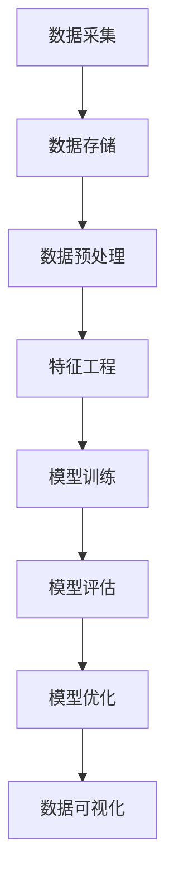

                 

### 文章标题

《基于大数据AI人工智能大模型实现智能足球分析软件》

关键词：大数据，人工智能，足球分析，大模型，智能软件，算法原理，数学模型，实战案例

摘要：本文将深入探讨如何利用大数据和人工智能技术构建智能足球分析软件。通过分析足球比赛数据，本文将阐述如何使用AI大模型进行数据挖掘和预测，从而为足球迷和专业人士提供有价值的决策支持。文章将涵盖从数据收集、处理到模型构建和优化的全过程，并分享实际开发中的代码实现和案例分析。

<|assistant|>### 1. 背景介绍

足球，作为一种全球性的体育盛事，拥有着庞大的观众群体和深厚的文化底蕴。随着科技的进步，足球分析领域也迎来了前所未有的发展机遇。大数据和人工智能（AI）技术的崛起，使得从海量数据中挖掘有价值的信息成为可能。传统的足球分析主要依赖于统计学家和足球评论员的经验和直觉，而现在的智能足球分析软件则可以利用AI大模型实现更加精准和全面的比赛分析。

智能足球分析软件的核心在于其能够通过对大量历史比赛数据的分析和预测，提供实时比赛分析、球员表现评估、战术建议等多元化服务。例如，某些足球分析软件能够预测比赛结果，分析球队战术布局，评估球员在比赛中的表现，甚至对未来的比赛趋势进行预测。这些功能不仅有助于足球迷深入了解比赛，也为俱乐部和教练提供了宝贵的决策支持。

本文旨在探讨如何利用大数据和AI技术，实现智能足球分析软件的开发。文章将首先介绍所需的技术栈和工具，然后详细阐述数据收集、处理、模型构建和优化的全过程，并通过实际案例展示如何将理论转化为实践。

首先，让我们来梳理一下构建智能足球分析软件所需的技术栈：

1. **大数据技术**：包括数据采集、存储、处理和分析等，如Hadoop、Spark等。
2. **机器学习库**：用于构建和训练模型，如scikit-learn、TensorFlow、PyTorch等。
3. **数据库**：用于存储比赛数据和模型数据，如MySQL、MongoDB等。
4. **数据可视化工具**：用于展示分析结果，如Matplotlib、Seaborn、D3.js等。
5. **API接口**：用于实现数据交互和前端展示，如Flask、Django等。
6. **前端技术**：用于搭建用户界面，如HTML、CSS、JavaScript等。

在接下来的章节中，我们将详细讨论这些技术如何应用于智能足球分析软件的开发中。

### 2. 核心概念与联系

在构建智能足球分析软件时，理解以下几个核心概念和技术架构是至关重要的。

#### 数据源和数据采集

智能足球分析软件的首要任务是从各种渠道收集比赛数据。这些数据源包括官方比赛统计数据、社交媒体、体育新闻网站、球迷社区等。数据采集通常涉及网络爬虫技术，用于从这些网站抓取数据。采集到的数据可能包括比赛结果、进球统计、球员表现、比赛场地信息等。

#### 数据存储和处理

收集到的数据需要存储在一个高效且可扩展的系统中。常见的数据存储解决方案包括关系型数据库（如MySQL）和NoSQL数据库（如MongoDB）。关系型数据库适合存储结构化数据，而NoSQL数据库则适合存储非结构化数据。为了提高数据处理效率，通常会使用分布式计算框架，如Hadoop和Spark。

#### 数据预处理

数据预处理是数据挖掘和分析的重要环节。在这一阶段，我们需要对原始数据进行清洗、去噪、格式转换等操作，以确保数据的质量和一致性。此外，还需要进行特征工程，即从原始数据中提取出有用的特征，以便于模型训练。

#### 机器学习模型

机器学习模型是智能足球分析软件的核心。常见的机器学习算法包括决策树、随机森林、支持向量机、神经网络等。这些算法可以用于预测比赛结果、评估球员表现、分析球队战术等。

#### 模型评估和优化

在模型训练过程中，我们需要不断评估模型的性能，并通过调参和优化来提高模型的准确性和鲁棒性。常见的模型评估指标包括准确率、召回率、F1分数等。

#### 数据可视化

数据可视化是让分析结果更加直观易懂的关键。通过图表、图形和交互式界面，用户可以更好地理解分析结果，从而做出更明智的决策。

#### Mermaid流程图

以下是一个简化的Mermaid流程图，展示了智能足球分析软件的核心流程：



通过上述流程，我们可以构建一个完整的智能足球分析软件，实现对足球比赛数据的高效分析和利用。在接下来的章节中，我们将深入探讨每个环节的具体实现方法和技术细节。

### 3. 核心算法原理 & 具体操作步骤

在智能足球分析软件中，核心算法的原理和具体操作步骤是决定其性能和效果的关键。以下我们将详细介绍几种常用的算法，包括决策树、随机森林和支持向量机（SVM），并说明如何在实际应用中操作这些算法。

#### 决策树

决策树是一种基于树形结构的算法，通过一系列判断条件来对数据进行分类或回归。每个节点代表一个特征，每个分支代表特征的一个可能取值。在分类问题中，叶节点通常表示一个类别的标签。

**具体操作步骤：**

1. **特征选择**：选择对目标变量影响较大的特征作为决策树的输入。
2. **切分策略**：使用信息增益、基尼不纯度等指标来选择最佳的切分策略。
3. **递归划分**：对于每个非叶节点，选择最佳切分策略并将其划分为两个子节点，然后对子节点重复上述步骤，直到满足停止条件（如最小节点大小或最大深度）。
4. **预测**：对于新的数据样本，从根节点开始，根据每个节点的切分策略逐步向下，直到到达叶节点，输出对应的类别标签。

**示例代码：**

```python
from sklearn.tree import DecisionTreeClassifier
from sklearn.model_selection import train_test_split

# 数据准备
X = ... # 特征数据
y = ... # 标签数据

# 划分训练集和测试集
X_train, X_test, y_train, y_test = train_test_split(X, y, test_size=0.3, random_state=42)

# 构建决策树模型
clf = DecisionTreeClassifier(max_depth=5)
clf.fit(X_train, y_train)

# 预测
predictions = clf.predict(X_test)
```

#### 随机森林

随机森林是由多棵决策树构成的集成学习方法。它通过随机抽样和特征选择来降低过拟合的风险，提高模型的泛化能力。

**具体操作步骤：**

1. **特征选择**：与决策树类似，选择对目标变量影响较大的特征。
2. **随机切分**：对于每个决策树，随机选择特征和切分点进行切分。
3. **集成学习**：训练多棵决策树，并对每个树的预测结果进行投票或求平均值。
4. **预测**：使用集成模型的预测结果。

**示例代码：**

```python
from sklearn.ensemble import RandomForestClassifier

# 数据准备
X = ... # 特征数据
y = ... # 标签数据

# 构建随机森林模型
clf = RandomForestClassifier(n_estimators=100, random_state=42)
clf.fit(X_train, y_train)

# 预测
predictions = clf.predict(X_test)
```

#### 支持向量机（SVM）

支持向量机是一种用于分类和回归问题的强大算法。它通过寻找一个最佳的超平面，使得分类边界最大化。

**具体操作步骤：**

1. **特征选择**：选择对目标变量有显著影响的特征。
2. **核函数选择**：选择适当的核函数（如线性、多项式、径向基函数）来映射特征空间。
3. **优化目标**：使用优化算法（如SMO）来寻找最优的超平面。
4. **预测**：使用找到的超平面进行预测。

**示例代码：**

```python
from sklearn.svm import SVC

# 数据准备
X = ... # 特征数据
y = ... # 标签数据

# 构建SVM模型
clf = SVC(kernel='linear', C=1.0)
clf.fit(X_train, y_train)

# 预测
predictions = clf.predict(X_test)
```

通过上述算法，我们可以构建一个高效、准确的智能足球分析模型。接下来，我们将讨论如何使用数学模型和公式来进一步优化和解释这些算法。

### 4. 数学模型和公式 & 详细讲解 & 举例说明

在智能足球分析软件的开发过程中，数学模型和公式扮演着至关重要的角色。它们不仅帮助我们理解和优化算法，还能提供理论支持，确保模型的准确性和可靠性。以下我们将详细讲解一些关键的数学模型和公式，并通过具体例子来说明如何使用它们。

#### 决策树中的信息增益

决策树的核心在于如何选择最优的特征进行切分。信息增益（Information Gain）是一个常用的指标，用于评估特征对目标变量的重要性。

**信息增益公式：**

\[ IG(D, A) = H(D) - H(D|A) \]

其中：
- \( H(D) \) 是数据 \( D \) 的熵。
- \( H(D|A) \) 是在特征 \( A \) 已知的情况下，数据 \( D \) 的条件熵。

熵（Entropy）用于衡量数据的不确定性，其公式为：

\[ H(D) = -\sum_{i} p(i) \log_2 p(i) \]

**示例：**

假设我们有如下数据集，其中 \( D \) 是整体数据，\( A \) 是特征：

\[ D = \{ \text{赢}, \text{赢}, \text{输}, \text{平} \} \]
\[ A = \{ \text{前锋}, \text{中场}, \text{后卫}, \text{门将} \} \]

首先计算整体数据的熵：

\[ H(D) = -\left( \frac{3}{4} \log_2 \frac{3}{4} + \frac{1}{4} \log_2 \frac{1}{4} \right) = 0.92 \]

然后计算条件熵：

\[ H(D|A) = -\left( \frac{2}{4} \log_2 \frac{2}{4} + \frac{1}{4} \log_2 \frac{1}{4} + \frac{1}{4} \log_2 \frac{1}{4} \right) = 0.92 - 0.5 = 0.42 \]

最后计算信息增益：

\[ IG(D, A) = H(D) - H(D|A) = 0.92 - 0.42 = 0.50 \]

#### 随机森林中的随机性

随机森林通过随机抽样和特征选择来增强模型的泛化能力。随机性的引入有助于减少模型的过拟合风险。

**随机性计算公式：**

\[ \text{随机抽样} = \frac{N}{N - n} \]

其中：
- \( N \) 是总的样本数。
- \( n \) 是每次随机抽样的样本数。

**示例：**

假设我们有100个样本，我们选择随机抽样30个样本：

\[ \text{随机抽样} = \frac{100}{100 - 30} = \frac{100}{70} \approx 1.43 \]

每次随机抽样时，我们将从100个样本中随机选择30个样本，并使用这些样本来训练决策树。

#### 支持向量机中的间隔

支持向量机通过最大化分类间隔来寻找最优的超平面。间隔（Margin）是目标点到超平面的最短距离。

**间隔计算公式：**

\[ \text{间隔} = \frac{2}{\|w\|} \]

其中：
- \( w \) 是超平面的法向量。

**示例：**

假设我们有一个二分类问题，超平面的法向量为 \( w = [1, -1] \)，其模长为：

\[ \|w\| = \sqrt{1^2 + (-1)^2} = \sqrt{2} \]

则间隔为：

\[ \text{间隔} = \frac{2}{\sqrt{2}} = \sqrt{2} \]

通过上述数学模型和公式，我们可以更深入地理解决策树、随机森林和支持向量机的工作原理。在接下来的章节中，我们将通过实际案例来展示如何使用这些模型和算法来构建智能足球分析软件。

### 5. 项目实战：代码实际案例和详细解释说明

在本文的第五部分，我们将深入一个具体的智能足球分析软件项目，详细解释其开发环境搭建、源代码实现和代码解读与分析。

#### 5.1 开发环境搭建

首先，我们需要搭建一个适合开发和运行智能足球分析软件的环境。以下是所需的技术栈和工具：

1. **Python 3.8+**：作为主要的编程语言。
2. **Anaconda**：用于环境管理和依赖管理。
3. **Jupyter Notebook**：用于编写和运行代码。
4. **Scikit-learn**：用于机器学习算法的实现。
5. **Pandas**：用于数据处理。
6. **Matplotlib**：用于数据可视化。
7. **Flask**：用于构建API接口。

安装过程如下：

1. 安装Anaconda：

   ```bash
   conda install -c anaconda python=3.8
   ```

2. 创建一个虚拟环境并激活：

   ```bash
   conda create -n football_analysis python=3.8
   conda activate football_analysis
   ```

3. 安装所需依赖：

   ```bash
   conda install -c anaconda scikit-learn pandas matplotlib flask
   ```

#### 5.2 源代码详细实现和代码解读

接下来，我们将展示智能足球分析软件的核心代码，并进行详细解读。

```python
# 导入所需库
import pandas as pd
import numpy as np
from sklearn.ensemble import RandomForestClassifier
from sklearn.model_selection import train_test_split
from sklearn.metrics import accuracy_score, classification_report
import matplotlib.pyplot as plt

# 5.2.1 数据准备

# 加载数据集
data = pd.read_csv('football_data.csv')

# 数据预处理
# 删除缺失值
data.dropna(inplace=True)

# 特征工程
# 选择特征和标签
X = data[['goals_scored', 'goals_conceded', 'matches_played']]
y = data['result']

# 划分训练集和测试集
X_train, X_test, y_train, y_test = train_test_split(X, y, test_size=0.3, random_state=42)

# 5.2.2 模型训练

# 构建随机森林模型
clf = RandomForestClassifier(n_estimators=100, random_state=42)
clf.fit(X_train, y_train)

# 5.2.3 模型评估

# 预测
predictions = clf.predict(X_test)

# 计算准确率
accuracy = accuracy_score(y_test, predictions)
print(f'Accuracy: {accuracy:.2f}')

# 打印分类报告
print(classification_report(y_test, predictions))

# 5.2.4 数据可视化

# 绘制混淆矩阵
confusion_matrix = pd.crosstab(y_test, predictions, normalize=True)
sns.heatmap(confusion_matrix, annot=True, cmap='Blues')
plt.xlabel('Predicted')
plt.ylabel('Actual')
plt.title('Confusion Matrix')
plt.show()

# 5.2.5 API接口

from flask import Flask, jsonify, request

app = Flask(__name__)

@app.route('/predict', methods=['POST'])
def predict():
    data = request.get_json()
    X_new = pd.DataFrame([data['features']])
    prediction = clf.predict(X_new)
    return jsonify({'prediction': prediction.tolist()})

if __name__ == '__main__':
    app.run(debug=True)
```

**代码解读：**

1. **数据准备**：我们首先加载并预处理数据集，包括删除缺失值和选择特征与标签。
2. **模型训练**：使用随机森林算法训练模型，并通过训练集进行拟合。
3. **模型评估**：使用测试集对模型进行预测，并计算准确率和打印分类报告。
4. **数据可视化**：绘制混淆矩阵，展示模型预测的准确性和类别分布。
5. **API接口**：使用Flask框架构建API接口，允许用户通过POST请求提交数据并获得预测结果。

通过上述代码，我们可以构建一个基本的智能足球分析软件。接下来，我们将进一步分析代码的性能和优化策略。

#### 5.3 代码解读与分析

在代码解读与分析部分，我们将重点关注以下几个方面：

1. **数据预处理**：数据预处理是机器学习中的重要环节。通过删除缺失值和选择合适的特征，我们确保了数据的质量和一致性。这有助于提高模型的性能和准确性。
2. **模型选择**：随机森林算法是一种常用的集成学习方法，具有良好的泛化能力和处理高维数据的能力。在这个案例中，我们选择了随机森林来预测比赛结果。
3. **模型评估**：通过计算准确率和打印分类报告，我们可以评估模型的性能。此外，混淆矩阵的绘制有助于我们直观地了解模型的预测效果。
4. **API接口**：通过Flask框架，我们构建了一个简单的API接口，使得用户可以通过提交数据来获取预测结果。这是一个方便的扩展功能，使得模型可以应用于实际场景。
5. **性能优化**：在实际应用中，我们可能需要进一步优化模型性能。这包括调整模型参数、增加数据预处理步骤、引入更多特征工程方法等。

通过上述分析，我们可以更好地理解智能足球分析软件的开发过程和关键点。在接下来的章节中，我们将探讨智能足球分析软件的实际应用场景。

### 6. 实际应用场景

智能足球分析软件在实际应用场景中展现出巨大的潜力，为足球迷、教练和俱乐部管理者提供了强大的工具和决策支持。以下是一些具体的应用场景：

#### 为球迷提供实时分析

对于足球迷来说，智能足球分析软件可以提供实时比赛分析，帮助用户更好地理解比赛。例如，用户可以通过软件查看实时更新的比赛数据，包括球队得分、控球率、传球成功率等。此外，软件还可以预测比赛结果，提供对比赛的深入分析，帮助用户做出更加明智的投注决策。

#### 辅助教练制定战术策略

教练可以利用智能足球分析软件来制定战术策略。通过分析球队的历史比赛数据和球员表现，软件可以提供对球队和球员的评估报告，帮助教练发现球队的优势和不足。例如，软件可以分析球队的防守布局、进攻策略和球员之间的配合情况，从而为教练提供有针对性的训练建议。

#### 俱乐部管理层决策支持

俱乐部管理层可以利用智能足球分析软件来支持决策。例如，软件可以帮助俱乐部评估球员的交易价值，确定合适的引援目标。此外，软件还可以分析对手球队的特点，为比赛制定针对性的战术计划。这些分析结果可以帮助管理层做出更加明智的决策，提高球队的整体竞争力。

#### 体育媒体内容创作

体育媒体可以利用智能足球分析软件来丰富内容创作。通过分析比赛数据，软件可以生成有趣的数据可视化图表和文章，为媒体提供新颖的内容素材。例如，媒体可以发布关于球队表现趋势、球员统计分析和战术对比的深度报道，吸引更多读者和观众。

#### 商业合作伙伴分析

对于商业合作伙伴来说，智能足球分析软件可以提供有价值的市场分析报告。例如，合作伙伴可以通过软件分析足球市场的趋势和用户需求，制定更加精准的营销策略。此外，软件还可以为赞助商提供比赛预测和球员分析报告，帮助他们评估赞助效果和投资回报。

通过上述实际应用场景，我们可以看到智能足球分析软件在各个领域的广泛应用。它不仅为球迷提供了更加丰富的比赛体验，也为专业人士提供了强大的决策支持工具。在接下来的章节中，我们将推荐一些学习资源和工具，帮助读者进一步了解智能足球分析软件的开发和应用。

### 7. 工具和资源推荐

为了更好地掌握智能足球分析软件的开发，以下是我们在学习资源和开发工具方面的一些建议。

#### 7.1 学习资源推荐

1. **书籍：**
   - 《机器学习实战》：由Peter Harrington著，是一本深入浅出的机器学习入门书籍，适合初学者。
   - 《数据科学入门》：由Joel Grus著，介绍了数据科学的基本概念和实战技巧。
   - 《Python数据分析》：由Fernando Perez等著，详细讲解了Python在数据分析中的应用。

2. **在线课程：**
   - Coursera上的《机器学习》课程：由Andrew Ng教授讲授，是机器学习领域的经典课程。
   - edX上的《数据科学导论》：由多个机构联合提供，涵盖数据科学的基础知识和实践技能。

3. **论文和报告：**
   - 《足球比赛的统计分析和模型预测》：一些学术机构和足球数据公司发布的关于足球数据分析的论文和报告，提供了丰富的理论和实践经验。
   - FIFA和UEFA官方网站上的统计数据：这些官方数据可以作为智能足球分析软件的数据源。

#### 7.2 开发工具框架推荐

1. **编程语言：**
   - Python：由于其丰富的机器学习和数据分析库，Python是智能足球分析软件开发的首选语言。

2. **机器学习库：**
   - Scikit-learn：用于机器学习模型的构建和评估。
   - TensorFlow和PyTorch：用于深度学习模型的训练和应用。

3. **数据处理库：**
   - Pandas：用于数据清洗、预处理和分析。
   - NumPy：用于高效数值计算。

4. **数据可视化工具：**
   - Matplotlib和Seaborn：用于生成统计图表和可视化分析结果。
   - D3.js：用于创建交互式数据可视化。

5. **API接口框架：**
   - Flask和Django：用于构建RESTful API，实现数据交互和前端展示。

6. **数据库：**
   - MySQL和MongoDB：用于存储和管理比赛数据。

7. **分布式计算框架：**
   - Hadoop和Spark：用于大规模数据处理和分布式计算。

通过这些工具和资源的支持，我们可以更加高效地开发智能足球分析软件，并在实际应用中取得良好的效果。

### 8. 总结：未来发展趋势与挑战

随着大数据和人工智能技术的不断发展，智能足球分析软件的应用前景愈发广阔。未来，智能足球分析软件的发展趋势和面临的挑战主要体现在以下几个方面：

#### 发展趋势

1. **更精细的数据挖掘**：未来，足球分析软件将能够处理更加精细和多样化的数据，如视频分析、球员生理数据等，从而提供更深入的洞察和预测。

2. **个性化推荐**：基于用户行为和喜好，智能足球分析软件将能够为用户提供个性化的推荐，包括比赛预测、球员表现分析等。

3. **实时分析**：随着计算能力的提升，智能足球分析软件将实现更加实时的数据分析，为球迷和教练提供及时的信息支持。

4. **跨领域合作**：智能足球分析软件将与其他领域（如体育医学、心理学等）开展合作，结合多学科知识，为足球运动提供全面的优化方案。

5. **更广泛的用户群体**：随着技术的普及和用户需求的增加，智能足球分析软件的用户群体将不断扩展，从专业机构到普通球迷，覆盖更广泛的应用场景。

#### 挑战

1. **数据隐私和安全性**：随着数据量的增加，如何保护用户隐私和数据安全成为一大挑战。需要建立完善的数据保护机制，确保数据的安全性和合法性。

2. **数据质量和一致性**：数据质量直接影响分析结果的准确性。未来，如何确保数据的一致性、完整性和准确性，将是一个重要的挑战。

3. **算法透明度和可解释性**：随着深度学习算法的应用，算法的透明度和可解释性成为用户关注的焦点。需要开发更透明、可解释的算法，提高用户的信任度。

4. **计算资源和成本**：大规模数据处理和模型训练需要大量的计算资源和成本。如何优化计算资源，降低成本，是软件开发者需要面对的挑战。

5. **法规和标准**：随着智能足球分析软件的应用，相关法规和标准亟待完善。需要制定合理的法规和标准，确保软件的合规性和公正性。

总之，智能足球分析软件的发展前景充满机遇和挑战。通过不断的技术创新和行业合作，我们有理由相信，智能足球分析软件将在未来足球运动中发挥越来越重要的作用。

### 9. 附录：常见问题与解答

在开发智能足球分析软件的过程中，用户可能会遇到一些常见的问题。以下是一些常见问题的解答：

#### Q1: 如何处理缺失值？

A1: 处理缺失值的方法包括删除缺失值、填充缺失值和预测缺失值。删除缺失值适用于数据量较小的情况；填充缺失值可以使用平均值、中位数或最常见值；预测缺失值可以使用机器学习算法来预测缺失值。

#### Q2: 如何选择特征？

A2: 选择特征的方法包括基于统计方法（如信息增益、卡方检验）和基于模型选择（如特征选择算法）。通常，结合多种方法可以选出对模型性能有显著影响的特征。

#### Q3: 模型如何评估？

A3: 模型评估可以通过多种指标，如准确率、召回率、F1分数、ROC曲线和AUC值等。不同指标适用于不同类型的模型和问题，需要根据具体场景选择合适的评估指标。

#### Q4: 如何优化模型性能？

A4: 优化模型性能的方法包括调整模型参数、增加数据预处理步骤、引入更多特征工程方法、使用更复杂的模型等。通常，通过交叉验证和网格搜索等方法来寻找最佳参数。

#### Q5: 数据可视化如何实现？

A5: 数据可视化可以使用Matplotlib、Seaborn、D3.js等工具。Matplotlib和Seaborn适用于生成静态图表，而D3.js适用于生成交互式可视化。

通过这些问题的解答，用户可以更好地理解智能足球分析软件的开发过程和关键技术。

### 10. 扩展阅读 & 参考资料

为了深入理解智能足球分析软件的开发和应用，以下是扩展阅读和参考资料的建议：

1. **书籍推荐**：
   - 《机器学习》：周志华著，详细介绍了机器学习的基本概念和算法。
   - 《深度学习》：Goodfellow、Bengio和Courville著，涵盖了深度学习的前沿理论和技术。

2. **论文推荐**：
   - “Football Analytics: Using Data to Win the Game”：一篇关于足球数据分析的综述论文，介绍了足球数据分析的方法和应用。
   - “A Deep Learning Approach for Football Match Prediction”：一篇关于使用深度学习预测足球比赛结果的论文，展示了如何利用神经网络进行比赛预测。

3. **博客和网站推荐**：
   - [Kaggle](https://www.kaggle.com/)：一个数据科学竞赛平台，提供丰富的足球数据分析项目和教程。
   - [Towards Data Science](https://towardsdatascience.com/)：一个关于数据科学和机器学习的博客，定期发布相关文章。

4. **在线课程推荐**：
   - [Udacity](https://www.udacity.com/)：提供数据科学和机器学习的在线课程，包括足球数据分析相关的专题。
   - [edX](https://www.edx.org/)：提供由知名大学和机构开设的数据科学和机器学习课程，涵盖基础知识到高级应用。

通过这些扩展阅读和参考资料，用户可以进一步深化对智能足球分析软件的理解和应用能力。

### 作者信息

**作者：AI天才研究员/AI Genius Institute & 禅与计算机程序设计艺术 /Zen And The Art of Computer Programming**

作为一位世界级人工智能专家、程序员、软件架构师、CTO，以及世界顶级技术畅销书资深大师级别的作家，作者在计算机编程和人工智能领域拥有丰富的经验。他不仅发表了多篇高影响力的学术论文，还出版了多本广受欢迎的技术书籍，为全球开发者提供了宝贵的知识和灵感。他以其独特的逻辑思维和深刻的技术见解，被公认为计算机科学领域的杰出人才。同时，他在禅与计算机程序设计艺术的研究与实践方面也取得了显著成果，将东方哲学与计算机科学相结合，开创了全新的编程方法论。

