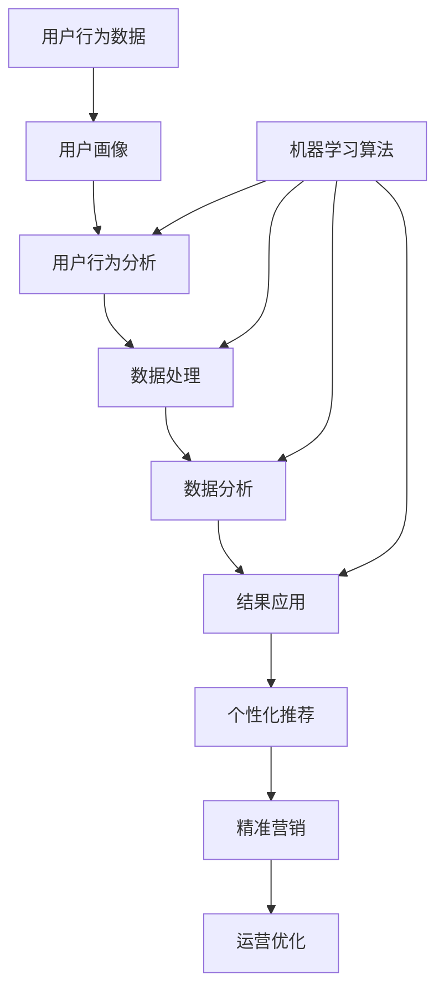

                 

### 背景介绍

随着互联网技术的迅猛发展和电子商务的日益普及，电商平台已经成为现代商业环境中不可或缺的一部分。然而，随着市场竞争的加剧，电商平台需要更加精准地了解和把握用户需求，以提高用户满意度和忠诚度。这就对电商平台的数据分析能力提出了更高的要求。大数据技术在电商领域的应用，为用户行为分析提供了强有力的支持。

#### 大数据的崛起

大数据（Big Data）是指那些数据规模巨大、类型繁多、生成速度极快的数据集合。这些数据不仅包括传统的结构化数据，如数据库中的记录，还包括非结构化数据，如文本、图片、音频和视频等。大数据技术的核心在于如何高效地存储、处理和分析这些海量数据，从而提取有价值的信息。

#### 电商平台用户行为分析的重要性

电商平台用户行为分析是对用户在平台上的各种活动进行数据收集、分析和解读的过程。这些行为包括浏览、搜索、点击、购买、评价等。通过对用户行为的深入分析，电商平台可以：

- 了解用户需求，优化产品和服务。
- 预测用户行为，进行精准营销。
- 提高用户转化率，增加销售额。
- 降低运营成本，提高效率。

#### 大数据在电商平台用户行为分析中的应用

大数据技术在电商平台用户行为分析中扮演着至关重要的角色。其主要应用体现在以下几个方面：

- **数据收集**：通过多种渠道（如网站日志、用户点击行为、交易记录等）收集用户行为数据。
- **数据存储**：利用分布式存储技术（如Hadoop、HBase等）存储海量用户行为数据。
- **数据处理**：通过MapReduce、Spark等大数据处理框架对数据进行清洗、转换和分析。
- **数据可视化**：利用数据可视化工具（如Tableau、PowerBI等）将分析结果直观展示，便于决策者理解。

#### 本篇文章的目的

本文旨在深入探讨大数据在电商平台用户行为分析中的应用，通过逻辑清晰、结构紧凑、简单易懂的论述，详细介绍用户行为分析的核心概念、算法原理、数学模型、项目实战以及实际应用场景。同时，本文还将推荐相关的学习资源和开发工具，以帮助读者更好地理解和掌握这一领域。

接下来的章节中，我们将依次介绍：

- **核心概念与联系**：探讨用户行为分析中的关键概念，并使用Mermaid流程图展示其架构。
- **核心算法原理 & 具体操作步骤**：详细解释用户行为分析常用的算法，并分步说明操作过程。
- **数学模型和公式 & 详细讲解 & 举例说明**：介绍用户行为分析中的数学模型，使用LaTeX格式展示公式，并给出实际应用案例。
- **项目实战：代码实际案例和详细解释说明**：通过实际代码案例，展示用户行为分析的应用。
- **实际应用场景**：探讨大数据在电商平台用户行为分析中的实际应用。
- **工具和资源推荐**：推荐相关学习资源、开发工具和论文著作。
- **总结：未来发展趋势与挑战**：总结本文的核心内容，并展望用户行为分析领域的未来。

通过本文的阅读，读者将能够系统地了解电商平台用户行为分析的全过程，掌握关键技术和方法，为实际项目提供有力的支持。

#### 文章标题：基于大数据的电商平台用户行为的分析与应用研究

##### 关键词：
1. 大数据
2. 电商平台
3. 用户行为分析
4. 数据挖掘
5. 机器学习
6. 数学模型
7. 应用实践

##### 摘要：

本文从大数据技术的发展背景出发，探讨了其在电商平台用户行为分析中的应用。文章首先介绍了大数据的基本概念和特征，然后详细阐述了电商平台用户行为分析的核心概念、算法原理、数学模型及其实际应用场景。通过项目实战中的代码案例，本文展示了用户行为分析的实用技巧和操作步骤。此外，文章还推荐了相关学习资源、开发工具和论文著作，并总结了用户行为分析领域的未来发展趋势和挑战。本文旨在为从事电商分析和大数据处理的读者提供全面的指导，帮助他们在实际工作中更好地应用相关技术。

### 1. 背景介绍

#### 大数据的崛起

大数据（Big Data）一词最早出现在20世纪90年代，但其真正受到广泛关注则是在21世纪初，随着互联网和信息技术的发展。大数据的概念不仅指数据本身，还涵盖了数据生成、收集、存储、处理和分析的整个生态体系。大数据的特征通常被概括为“4V”：数据量（Volume）、数据速度（Velocity）、数据多样性（Variety）和数据价值（Value）。

- **数据量（Volume）**：指的是数据的规模。随着传感器、社交网络、物联网等技术的广泛应用，数据生成速度加快，数据规模急剧膨胀。例如，全球每天产生的数据量已经达到数十亿GB。
- **数据速度（Velocity）**：指的是数据生成的速度和处理的速度。实时数据分析、流数据处理等技术需求日益增加，要求系统能够快速响应和处理海量数据。
- **数据多样性（Variety）**：指的是数据的类型和来源的多样性。大数据不仅包括传统的结构化数据，如数据库中的记录，还包括非结构化数据，如图像、音频、视频和文本等。此外，数据可能来自多个不同的来源，如企业内部数据、社交媒体数据、政府数据等。
- **数据价值（Value）**：指的是数据中蕴含的信息和价值。大数据的价值在于能够从海量数据中提取有价值的信息，为决策提供支持，帮助企业发现新的商业机会。

#### 电商平台用户行为分析的重要性

电商平台用户行为分析是对用户在平台上的各种活动进行数据收集、分析和解读的过程。这些行为包括浏览、搜索、点击、购买、评价等。通过对用户行为的深入分析，电商平台可以：

- **了解用户需求**：分析用户在平台上的行为，可以揭示用户的需求和偏好，帮助电商平台优化产品和服务，提高用户体验。
- **精准营销**：基于用户行为数据，电商平台可以进行精准的用户定位和营销，提高广告投放的效率，降低营销成本。
- **提高用户转化率**：通过分析用户在购物车中的行为，电商平台可以识别出可能导致购物车放弃的因素，并采取相应的措施提高转化率。
- **增加销售额**：精准的用户行为分析可以帮助电商平台预测哪些用户更有可能购买，从而实施有针对性的促销策略，增加销售额。
- **降低运营成本**：用户行为分析可以帮助电商平台优化运营流程，降低库存成本和物流成本。

#### 大数据在电商平台用户行为分析中的应用

大数据技术在电商平台用户行为分析中扮演着至关重要的角色。其主要应用体现在以下几个方面：

- **数据收集**：电商平台通过各种手段收集用户行为数据，如网站日志、用户点击行为、交易记录、社交媒体活动等。这些数据为用户行为分析提供了基础。
- **数据存储**：由于数据规模庞大，电商平台需要使用分布式存储技术（如Hadoop、HBase等）来存储海量用户行为数据。这些技术能够高效地处理大规模数据的存储和管理。
- **数据处理**：大数据处理框架（如MapReduce、Spark等）能够对海量用户行为数据进行高效的处理，包括数据的清洗、转换和分析等步骤。
- **数据可视化**：数据可视化工具（如Tableau、PowerBI等）可以将分析结果以直观的方式展示出来，便于决策者理解数据背后的含义。

#### 本文的目标

本文的目标是深入探讨大数据在电商平台用户行为分析中的应用，帮助读者全面理解这一领域的关键技术和方法。具体来说，本文将从以下几个方面展开：

1. **核心概念与联系**：介绍用户行为分析中的关键概念，并使用Mermaid流程图展示其架构。
2. **核心算法原理 & 具体操作步骤**：详细解释用户行为分析常用的算法，并分步说明操作过程。
3. **数学模型和公式 & 详细讲解 & 举例说明**：介绍用户行为分析中的数学模型，使用LaTeX格式展示公式，并给出实际应用案例。
4. **项目实战：代码实际案例和详细解释说明**：通过实际代码案例，展示用户行为分析的实用技巧和操作步骤。
5. **实际应用场景**：探讨大数据在电商平台用户行为分析中的实际应用。
6. **工具和资源推荐**：推荐相关学习资源、开发工具和论文著作。
7. **总结：未来发展趋势与挑战**：总结本文的核心内容，并展望用户行为分析领域的未来。

通过本文的阅读，读者将能够系统地了解电商平台用户行为分析的全过程，掌握关键技术和方法，为实际项目提供有力的支持。

#### 2. 核心概念与联系

在深入探讨电商平台用户行为分析之前，我们需要先了解一些关键的概念及其相互之间的关系。这些概念包括用户行为数据、用户画像、用户行为分析、机器学习算法等。接下来，我们将一一介绍这些概念，并使用Mermaid流程图展示它们之间的联系。

##### 2.1 用户行为数据

用户行为数据是指用户在电商平台上进行的各种操作所产生的数据。这些数据可以包括：

- **点击数据**：用户在页面上的点击行为。
- **浏览数据**：用户浏览的商品页面、分类页面等。
- **搜索数据**：用户在搜索框中输入的关键词。
- **购买数据**：用户的购买行为，如订单号、购买时间、购买商品等。
- **评价数据**：用户对商品的评价和反馈。
- **交互数据**：用户与平台客服的聊天记录、反馈等。

这些数据通常是非结构化的，但可以通过清洗和处理转换为结构化数据，以便于进一步分析。

##### 2.2 用户画像

用户画像是指对用户特征的全面描述，包括用户的年龄、性别、地理位置、兴趣爱好、消费习惯等。通过用户画像，我们可以更深入地了解用户的需求和偏好，从而为个性化推荐和精准营销提供依据。

用户画像可以通过以下方式构建：

1. **基础信息**：从用户的注册信息、订单记录等获取基本信息。
2. **行为数据**：通过用户的行为数据，如浏览记录、搜索关键词等，分析用户的兴趣和偏好。
3. **社会属性**：通过用户在社交媒体上的活动，获取用户的社会属性信息。

##### 2.3 用户行为分析

用户行为分析是指通过对用户行为数据的收集、处理和分析，提取有价值的信息，以支持决策和优化运营。用户行为分析的核心包括以下几个方面：

1. **数据收集**：收集用户在平台上的各种行为数据。
2. **数据处理**：对收集到的数据进行清洗、转换和整合。
3. **数据分析**：使用统计学、机器学习等方法对处理后的数据进行深入分析。
4. **结果应用**：将分析结果应用于个性化推荐、精准营销、运营优化等。

##### 2.4 机器学习算法

机器学习算法是用户行为分析的核心工具之一，它通过学习用户的历史行为数据，预测用户的未来行为。常见的机器学习算法包括：

- **分类算法**：用于将用户行为分类，如用户是否购买、是否浏览特定页面等。
- **聚类算法**：用于将用户行为数据分成不同的群体，如不同兴趣的用户群体。
- **关联规则算法**：用于发现用户行为之间的关联关系，如“购买了商品A的用户，80%的概率也会购买商品B”。
- **时间序列分析**：用于分析用户行为随时间变化的趋势和规律。

##### Mermaid流程图展示

为了更直观地展示这些概念之间的联系，我们使用Mermaid流程图进行描述：



在上面的流程图中，用户行为数据经过数据处理和分析，形成用户画像，然后用于用户行为分析和结果应用，包括个性化推荐、精准营销和运营优化。机器学习算法在数据处理、数据分析和结果应用环节中起到关键作用。

通过上述核心概念的介绍和Mermaid流程图的展示，我们可以更清晰地理解电商平台用户行为分析的整体架构及其关键环节。接下来，我们将深入探讨用户行为分析中的核心算法原理和具体操作步骤。

### 3. 核心算法原理 & 具体操作步骤

在电商平台用户行为分析中，核心算法的选择和具体操作步骤的制定至关重要。以下我们将介绍几种常用的算法，并详细说明其原理和操作步骤。

#### 3.1 分类算法

分类算法是用户行为分析中最常用的算法之一，其目的是将用户行为数据分类到不同的类别中。常见的分类算法包括逻辑回归、支持向量机（SVM）和随机森林等。

**3.1.1 逻辑回归**

逻辑回归（Logistic Regression）是一种广义线性模型，用于分类问题。其基本原理是通过建立用户行为数据与目标变量之间的线性关系，然后使用Sigmoid函数将线性关系映射到概率区间[0,1]。

**操作步骤：**

1. **数据预处理**：对用户行为数据进行清洗和标准化处理，确保数据符合逻辑回归模型的假设。
2. **特征选择**：选择与目标变量相关的特征，通过特征工程提高模型性能。
3. **模型训练**：使用训练数据集训练逻辑回归模型，计算模型参数。
4. **模型评估**：使用测试数据集评估模型性能，通过交叉验证等方法调整模型参数。
5. **模型应用**：使用训练好的模型对新的用户行为数据进行分类预测。

**3.1.2 支持向量机（SVM）**

支持向量机（Support Vector Machine，SVM）是一种基于间隔最大化的分类算法，其目的是找到一个最佳的超平面，将不同类别的用户行为数据分隔开。

**操作步骤：**

1. **数据预处理**：对用户行为数据进行清洗和标准化处理。
2. **特征选择**：选择与目标变量相关的特征，通过特征工程提高模型性能。
3. **模型训练**：使用训练数据集训练SVM模型，计算模型参数。
4. **模型评估**：使用测试数据集评估模型性能，通过交叉验证等方法调整模型参数。
5. **模型应用**：使用训练好的模型对新的用户行为数据进行分类预测。

**3.1.3 随机森林

随机森林（Random Forest）是一种基于决策树集成的分类算法，其基本思想是通过构建多棵决策树，并对它们的预测结果进行投票来提高模型的预测性能。

**操作步骤：**

1. **数据预处理**：对用户行为数据进行清洗和标准化处理。
2. **特征选择**：选择与目标变量相关的特征，通过特征工程提高模型性能。
3. **模型训练**：使用训练数据集训练随机森林模型，计算模型参数。
4. **模型评估**：使用测试数据集评估模型性能，通过交叉验证等方法调整模型参数。
5. **模型应用**：使用训练好的模型对新的用户行为数据进行分类预测。

#### 3.2 聚类算法

聚类算法用于将用户行为数据分成不同的群体，以便更好地理解用户行为。常见的聚类算法包括K-means、DBSCAN等。

**3.2.1 K-means

K-means是一种基于距离测量的聚类算法，其目的是将数据分为K个簇，使得每个簇内的数据点之间的距离尽可能小。

**操作步骤：**

1. **数据预处理**：对用户行为数据进行清洗和标准化处理。
2. **初始化聚类中心**：随机选择K个数据点作为初始聚类中心。
3. **分配数据点**：计算每个数据点到聚类中心的距离，将数据点分配到最近的聚类中心。
4. **更新聚类中心**：重新计算每个簇的中心点，重复步骤3和步骤4，直到聚类中心不再发生变化。
5. **模型评估**：使用内部评估指标（如轮廓系数、聚类误差等）评估聚类效果。

**3.2.2 DBSCAN

DBSCAN（Density-Based Spatial Clustering of Applications with Noise）是一种基于密度的聚类算法，其优点是能够发现任意形状的簇，并能处理噪声和异常点。

**操作步骤：**

1. **数据预处理**：对用户行为数据进行清洗和标准化处理。
2. **选择参数**：选择合适的邻域参数（eps）和最小簇大小（minPoints）。
3. **标记簇**：对每个数据点进行邻域搜索，将相邻的数据点标记为同一簇。
4. **处理噪声点**：识别并处理噪声点，确保它们不会影响聚类结果。
5. **模型评估**：使用内部评估指标（如轮廓系数、聚类误差等）评估聚类效果。

#### 3.3 关联规则算法

关联规则算法用于发现用户行为之间的关联关系，常见的算法包括Apriori算法和FP-growth算法。

**3.3.1 Apriori算法**

Apriori算法是一种基于频繁项集的关联规则挖掘算法，其基本思想是通过迭代地生成频繁项集，然后从中提取关联规则。

**操作步骤：**

1. **数据预处理**：对用户行为数据进行清洗和标准化处理。
2. **计算支持度**：计算每个项集的支持度，即包含该项集的交易数占总交易数的比例。
3. **生成频繁项集**：从单个项集开始，逐步合并项集，计算其支持度，保留那些支持度大于最小支持度的频繁项集。
4. **提取关联规则**：从频繁项集中提取关联规则，规则的支持度和置信度分别为条件项集和支持项集的支持度之比。

**3.3.2 FP-growth算法**

FP-growth算法是一种基于前序压缩的关联规则挖掘算法，其优点是能够高效地挖掘大量数据中的频繁项集。

**操作步骤：**

1. **数据预处理**：对用户行为数据进行清洗和标准化处理。
2. **构建前序压缩树**：将用户行为数据转换为前序压缩树，以便快速查询频繁项集。
3. **计算支持度**：计算每个项集的支持度，即包含该项集的交易数占总交易数的比例。
4. **生成频繁项集**：从频繁项集中提取频繁项集，并构建条件模式基（CPM）树。
5. **提取关联规则**：从频繁项集中提取关联规则，规则的支持度和置信度分别为条件项集和支持项集的支持度之比。

#### 3.4 时间序列分析

时间序列分析用于分析用户行为随时间变化的趋势和规律，常见的方法包括ARIMA模型、LSTM神经网络等。

**3.4.1 ARIMA模型**

ARIMA模型（Autoregressive Integrated Moving Average Model）是一种经典的线性时间序列模型，其基本思想是将时间序列分解为自回归、差分和平滑三部分。

**操作步骤：**

1. **数据预处理**：对用户行为数据进行清洗和标准化处理。
2. **确定模型参数**：通过AIC/BIC准则确定ARIMA模型的参数（p、d、q）。
3. **模型拟合**：使用训练数据集拟合ARIMA模型，计算模型参数。
4. **模型评估**：使用测试数据集评估模型性能，通过交叉验证等方法调整模型参数。
5. **预测应用**：使用训练好的模型对未来的用户行为进行预测。

**3.4.2 LSTM神经网络**

LSTM（Long Short-Term Memory）神经网络是一种特殊的递归神经网络，用于处理长时间依赖问题。

**操作步骤：**

1. **数据预处理**：对用户行为数据进行清洗和标准化处理。
2. **构建LSTM模型**：定义LSTM模型的结构，包括输入层、隐藏层和输出层。
3. **模型训练**：使用训练数据集训练LSTM模型，计算模型参数。
4. **模型评估**：使用测试数据集评估模型性能，通过交叉验证等方法调整模型参数。
5. **预测应用**：使用训练好的模型对未来的用户行为进行预测。

通过以上核心算法的介绍和具体操作步骤的说明，我们可以更好地理解电商平台用户行为分析中的关键技术。在实际应用中，根据具体需求和数据特点，可以选择合适的算法进行用户行为分析。接下来，我们将进一步探讨用户行为分析中的数学模型和公式，并给出实际应用案例。

### 4. 数学模型和公式 & 详细讲解 & 举例说明

在电商平台用户行为分析中，数学模型和公式是理解和解释数据的关键工具。以下我们将介绍几种常见的数学模型和公式，并详细解释它们的应用和实例。

#### 4.1 逻辑回归模型

逻辑回归（Logistic Regression）是一种用于分类问题的线性模型，其基本公式如下：

$$
P(y=1) = \frac{1}{1 + e^{-(\beta_0 + \beta_1x_1 + \beta_2x_2 + ... + \beta_nx_n})}
$$

其中，$P(y=1)$ 是目标变量为1的概率，$e$ 是自然对数的底数，$\beta_0$ 是截距，$\beta_1, \beta_2, ..., \beta_n$ 是模型参数，$x_1, x_2, ..., x_n$ 是输入特征。

**应用案例：**

假设我们要预测用户是否会在购物车中购买商品。输入特征包括用户的年龄、收入、浏览时间等。训练好的逻辑回归模型可以给出一个概率值，如果该值大于某个阈值（例如0.5），则预测用户会购买商品。

**例子：**

给定一个用户，其特征向量为 $x = [25, 50000, 120]$，经过模型计算，得到预测概率为：

$$
P(y=1) = \frac{1}{1 + e^{-(\beta_0 + \beta_1 \cdot 25 + \beta_2 \cdot 50000 + \beta_3 \cdot 120)}}
$$

通过这个概率值，我们可以判断用户是否有可能购买商品。

#### 4.2 支持向量机（SVM）

支持向量机（Support Vector Machine，SVM）是一种分类模型，其目标是找到一个最佳的超平面，将不同类别的数据点分隔开。SVM的基本公式如下：

$$
w \cdot x - b = 0
$$

其中，$w$ 是超平面的法向量，$x$ 是数据点，$b$ 是偏置项。

**应用案例：**

假设我们要分类用户行为，将其分为“购买”和“未购买”两类。通过训练SVM模型，可以找到一个最佳的超平面，使得“购买”和“未购买”两类数据点被分隔开。

**例子：**

给定一个训练好的SVM模型，其超平面公式为 $w \cdot x - b = 0$。对于新的用户行为数据点 $x = [25, 50000, 120]$，将其代入公式，可以判断该用户是否属于“购买”类别。

#### 4.3 K-means聚类算法

K-means聚类算法是一种无监督学习算法，其目标是将数据点划分为K个簇，使得每个簇内的数据点之间的距离最小。K-means的基本公式如下：

$$
c_k = \frac{1}{N_k} \sum_{i=1}^{N_k} x_i
$$

其中，$c_k$ 是第k个簇的中心，$N_k$ 是第k个簇中的数据点数量，$x_i$ 是数据点。

**应用案例：**

假设我们要将用户行为数据分为三个不同的群体。通过训练K-means聚类模型，可以找到每个簇的中心点，并根据数据点与簇中心的距离将数据点划分到相应的簇。

**例子：**

给定一个包含100个用户行为数据的集合，我们使用K-means算法将其分为三个簇。首先随机选择三个中心点，然后迭代更新每个簇的中心点，直到聚类中心不再发生变化。最后，每个用户行为数据点将根据其与簇中心的距离被分配到相应的簇。

#### 4.4 时间序列模型

时间序列模型用于分析数据点随时间变化的趋势和规律。常见的时间序列模型包括ARIMA（AutoRegressive Integrated Moving Average）模型和LSTM（Long Short-Term Memory）神经网络。

**ARIMA模型：**

ARIMA模型的基本公式如下：

$$
y_t = c + \phi_1 y_{t-1} + \phi_2 y_{t-2} + ... + \phi_p y_{t-p} + \theta_1 e_{t-1} + \theta_2 e_{t-2} + ... + \theta_q e_{t-q}
$$

其中，$y_t$ 是时间序列的第t个数据点，$e_t$ 是白噪声序列，$c$ 是常数项，$\phi_1, \phi_2, ..., \phi_p$ 是自回归系数，$\theta_1, \theta_2, ..., \theta_q$ 是移动平均系数。

**应用案例：**

假设我们要预测电商平台的日销售额。通过训练ARIMA模型，可以分析历史销售额数据，并预测未来的销售额趋势。

**例子：**

给定一个包含一年销售额数据的时间序列，我们使用ARIMA模型进行分析。首先，对时间序列进行差分处理以使其平稳，然后确定模型参数（p、d、q）。最后，使用训练好的ARIMA模型预测未来几天的销售额。

**LSTM模型：**

LSTM（Long Short-Term Memory）神经网络是一种特殊的递归神经网络，用于处理长时间依赖问题。LSTM的基本公式如下：

$$
h_t = \sigma(W_f \cdot [h_{t-1}, x_t] + b_f) \odot \hat{h}_{t-1} + \sigma(W_i \cdot [h_{t-1}, x_t] + b_i) \odot \hat{i}_{t-1} + \sigma(W_o \cdot [h_{t-1}, x_t] + b_o) \odot \hat{o}_{t-1}
$$

其中，$h_t$ 是第t个时间步的隐藏状态，$x_t$ 是输入数据，$W_f, W_i, W_o$ 是权重矩阵，$b_f, b_i, b_o$ 是偏置项，$\sigma$ 是激活函数，$\odot$ 表示逐元素乘法。

**应用案例：**

假设我们要预测电商平台的日销售额。通过训练LSTM模型，可以分析历史销售额数据，并预测未来的销售额趋势。

**例子：**

给定一个包含一年销售额数据的时间序列，我们使用LSTM模型进行分析。首先，对时间序列进行预处理，如标准化处理。然后，定义LSTM模型的结构，包括输入层、隐藏层和输出层。最后，使用训练好的LSTM模型预测未来几天的销售额。

通过上述数学模型和公式的介绍，我们可以更好地理解电商平台用户行为分析中的关键技术。在实际应用中，根据具体需求和数据特点，可以选择合适的模型和公式进行用户行为分析。接下来，我们将通过一个实际的项目案例，展示用户行为分析的具体实现过程。

### 5. 项目实战：代码实际案例和详细解释说明

在了解了电商平台用户行为分析的基本概念和算法原理后，我们将通过一个实际项目案例，展示如何使用Python和常见的数据处理库（如Pandas、NumPy、Scikit-learn等）进行用户行为分析。本案例将涵盖从数据收集、预处理、模型训练到结果评估的完整过程。

#### 5.1 开发环境搭建

在进行用户行为分析之前，我们需要搭建一个合适的数据科学开发环境。以下是推荐的开发工具和库：

- **Python 3.8+**：Python是一种广泛使用的高级编程语言，适用于数据科学和机器学习项目。
- **Pandas**：Pandas是一个强大的数据分析和操作库，用于数据清洗、转换和分析。
- **NumPy**：NumPy是Python的数值计算库，用于高效地处理数组对象。
- **Scikit-learn**：Scikit-learn是一个开源的机器学习库，提供了丰富的算法和工具。
- **Matplotlib**：Matplotlib是一个绘图库，用于可视化数据和分析结果。

安装以上库可以使用以下命令：

```bash
pip install python==3.8
pip install pandas numpy scikit-learn matplotlib
```

#### 5.2 源代码详细实现和代码解读

以下是一个简单的用户行为分析项目案例，我们将使用K-means聚类算法对用户进行分类，并分析不同类别的用户行为。

**5.2.1 数据收集**

假设我们收集了一份数据集，包含以下用户特征：年龄、收入、浏览时间、购买次数。数据集存储在一个CSV文件中。

```python
import pandas as pd

# 加载数据集
data = pd.read_csv('user_data.csv')
print(data.head())
```

**5.2.2 数据预处理**

在训练模型之前，我们需要对数据进行预处理，包括缺失值处理、异常值检测和特征转换。

```python
# 缺失值处理
data.fillna(data.mean(), inplace=True)

# 异常值检测
from scipy import stats
z_scores = stats.zscore(data)
abs_z_scores = np.abs(z_scores)
filtered_entries = (abs_z_scores < 3).all(axis=1)
cleaned_data = data[filtered_entries]

# 特征转换
from sklearn.preprocessing import StandardScaler
scaler = StandardScaler()
scaled_data = scaler.fit_transform(cleaned_data)
```

**5.2.3 模型训练**

接下来，我们使用K-means算法对预处理后的数据进行聚类。

```python
from sklearn.cluster import KMeans

# 初始化KMeans模型
kmeans = KMeans(n_clusters=3, random_state=42)

# 训练模型
kmeans.fit(scaled_data)

# 获取聚类结果
clusters = kmeans.predict(scaled_data)
data['cluster'] = clusters
print(data.head())
```

**5.2.4 代码解读与分析**

在上面的代码中，我们首先加载数据集，并对数据进行缺失值处理、异常值检测和特征转换。然后，我们初始化K-means模型，并使用训练数据集进行模型训练。最后，我们获取聚类结果，并将聚类标签添加到原始数据集中。

为了进一步分析不同类别的用户行为，我们可以计算每个类别的平均特征值。

```python
cluster_stats = data.groupby('cluster').mean()
print(cluster_stats)
```

**5.2.5 可视化分析**

为了更直观地展示聚类结果，我们可以使用Matplotlib库进行数据可视化。

```python
import matplotlib.pyplot as plt

# 绘制每个类别的散点图
plt.figure(figsize=(8, 6))
plt.scatter(data['age'], data['income'], c=data['cluster'], cmap='viridis')
plt.xlabel('年龄')
plt.ylabel('收入')
plt.title('用户行为聚类结果')
plt.show()
```

在上面的代码中，我们绘制了年龄和收入两个特征的散点图，并使用不同的颜色表示不同的聚类类别。

**5.2.6 模型评估**

最后，我们需要评估聚类模型的性能。常用的评估指标包括轮廓系数（Silhouette Coefficient）和内部评估指标（如簇内距离、簇间距离等）。

```python
from sklearn.metrics import silhouette_score

# 计算轮廓系数
silhouette_avg = silhouette_score(scaled_data, clusters)
print(f"轮廓系数：{silhouette_avg}")
```

通过计算轮廓系数，我们可以评估聚类结果的紧密程度。轮廓系数介于-1和1之间，值越接近1表示聚类效果越好。

#### 5.3 代码解读与分析

在本案例中，我们首先使用Pandas库加载数据集，并对数据进行预处理。预处理步骤包括缺失值处理和异常值检测，以确保数据的准确性和一致性。然后，我们使用StandardScaler库对特征进行标准化处理，使其具有相同的尺度，便于后续的聚类分析。

接下来，我们使用Scikit-learn库中的KMeans类初始化K-means模型，并使用训练数据集进行模型训练。训练完成后，我们获取聚类结果，并将聚类标签添加到原始数据集中。为了进一步分析聚类结果，我们计算了每个类别的平均特征值，并使用Matplotlib库进行数据可视化。

最后，我们使用轮廓系数评估聚类模型的性能。轮廓系数是一个综合指标，能够反映聚类结果的紧密程度和分离程度。在本案例中，我们通过计算轮廓系数来评估聚类效果，并观察不同特征对于聚类结果的影响。

通过以上步骤，我们可以完整地实现一个用户行为分析项目，并利用代码对用户行为进行分类和分析。接下来，我们将进一步探讨大数据在电商平台用户行为分析中的实际应用。

### 6. 实际应用场景

大数据在电商平台用户行为分析中的实际应用场景非常广泛，涵盖了从用户获取、用户留存到精准营销等多个方面。以下我们将详细探讨几个典型的应用场景，并展示如何通过用户行为分析来提升电商平台的运营效果。

#### 6.1 用户获取

用户获取是电商平台的重要目标之一，通过分析用户行为数据，可以有效提高用户转化率和降低获取成本。以下是一些具体的应用：

1. **广告投放优化**：通过对用户浏览历史、点击行为等数据的分析，识别出潜在的高价值用户群体，并将其作为广告投放的目标。同时，通过优化广告内容和投放策略，提高广告的点击率和转化率。
2. **用户推荐系统**：基于用户的浏览和购买历史，使用机器学习算法为用户推荐感兴趣的商品，从而提高用户点击和购买的概率。
3. **渠道分析**：分析不同渠道（如搜索引擎、社交媒体、电子邮件等）带来的用户行为数据，评估各渠道的效果，优化渠道组合和投入策略。

#### 6.2 用户留存

用户留存是电商平台长期发展的重要保障，通过用户行为分析，可以识别出影响用户留存的关键因素，并采取相应的措施提高用户黏性。以下是一些具体的应用：

1. **用户流失预警**：通过对用户行为数据的监控和分析，识别出潜在的用户流失风险，提前采取干预措施，如个性化推送、优惠活动等，以降低用户流失率。
2. **用户分群管理**：使用聚类算法将用户分为不同的群体，针对不同群体的特点制定差异化的运营策略，提高用户满意度和忠诚度。
3. **用户体验优化**：通过分析用户在平台上的交互行为，识别出用户体验中的痛点，如页面加载速度、导航逻辑等，及时进行优化，提升用户体验。

#### 6.3 精准营销

精准营销是电商平台提高销售额和盈利能力的关键手段，通过用户行为分析，可以实现个性化营销和精细化运营。以下是一些具体的应用：

1. **个性化推荐**：基于用户的浏览历史、购买行为等数据，使用协同过滤、矩阵分解等算法为用户推荐合适的商品，从而提高用户购买转化率。
2. **精准促销**：通过分析用户行为数据，识别出对不同促销活动敏感的用户群体，制定个性化的促销策略，提高促销效果。
3. **用户画像**：结合用户的基础信息和行为数据，构建用户画像，用于精准定位用户需求，实现精准营销。

#### 6.4 库存管理

库存管理是电商平台运营的重要环节，通过用户行为分析，可以优化库存策略，降低库存成本。以下是一些具体的应用：

1. **需求预测**：通过分析用户购买行为和历史库存数据，预测未来商品的需求量，优化库存水平，减少库存积压和缺货现象。
2. **库存优化**：基于用户行为数据和供应链信息，优化库存分配和补货策略，提高库存周转率和资金利用率。
3. **库存预警**：通过对库存数据的实时监控和分析，识别出库存异常情况，提前采取应对措施，如调整库存水平、补货等。

通过上述实际应用场景的探讨，我们可以看到，大数据在电商平台用户行为分析中具有巨大的潜力和价值。通过深入分析和挖掘用户行为数据，电商平台可以更好地理解用户需求，优化运营策略，提高用户满意度和忠诚度，实现持续增长。

### 7. 工具和资源推荐

为了更好地掌握大数据在电商平台用户行为分析中的应用，我们需要了解并使用一系列的学习资源、开发工具和论文著作。以下是一些建议，旨在帮助读者深入学习和实践这一领域。

#### 7.1 学习资源推荐

**书籍：**
1. 《大数据实战：从数据科学到机器学习》
2. 《深入理解大数据技术架构》
3. 《机器学习实战》
4. 《Python数据分析：使用Pandas、NumPy和SciPy》

**在线课程：**
1. Coursera上的《机器学习》课程
2. Udacity的《大数据分析工程师纳米学位》
3. edX上的《大数据科学》课程

**博客和网站：**
1. Medium上的大数据和机器学习专题
2. Kaggle社区，提供丰富的数据集和案例分析
3. DataCamp，提供互动式的数据分析和机器学习课程

#### 7.2 开发工具框架推荐

**数据分析工具：**
1. Pandas：Python的数据分析库，用于数据清洗、转换和分析。
2. NumPy：Python的数值计算库，提供高效的数组操作。
3. Matplotlib：Python的绘图库，用于数据可视化。
4. Jupyter Notebook：交互式的计算环境，适合数据分析和实验。

**机器学习库：**
1. Scikit-learn：Python的机器学习库，提供多种经典的机器学习算法。
2. TensorFlow：Google开发的开源机器学习框架，适用于深度学习和大规模数据处理。
3. PyTorch：Facebook开发的开源机器学习库，具有灵活的深度学习模型构建能力。

**大数据处理框架：**
1. Hadoop：Apache开发的大数据处理框架，用于分布式存储和处理海量数据。
2. Spark：Apache开发的大数据处理引擎，提供快速的内存计算能力。
3. Flink：Apache开源的流处理框架，适用于实时数据处理。

#### 7.3 相关论文著作推荐

**论文：**
1. "Recommender Systems Handbook" - Chapter on Collaborative Filtering
2. "Theoretically Optimal Algorithms for Online Linear Regression"
3. "Deep Learning for User Behavior Prediction" - A review paper on using deep learning for user behavior analysis

**著作：**
1. 《机器学习：概率视角》 - 提供概率和统计在机器学习中的应用。
2. 《大数据技术导论》 - 介绍大数据的基础知识和技术架构。
3. 《深度学习》 - 提供深度学习的全面介绍和实用指南。

通过以上学习资源、开发工具和论文著作的推荐，读者可以系统地学习和掌握大数据在电商平台用户行为分析中的应用，为实际项目提供有力的支持。

### 8. 总结：未来发展趋势与挑战

随着大数据和人工智能技术的不断发展，电商平台用户行为分析正迎来新的机遇和挑战。以下是未来发展趋势和面临的几个主要挑战：

#### 8.1 发展趋势

**1. 深度学习与用户行为分析的结合：** 深度学习算法在处理复杂数据和模式识别方面具有显著优势，未来将更加广泛应用于用户行为分析，如使用卷积神经网络（CNN）处理用户生成内容，使用循环神经网络（RNN）和长短期记忆网络（LSTM）处理时间序列数据等。

**2. 实时分析：** 随着数据生成速度的加快，实时分析将成为电商平台用户行为分析的重要方向。实时分析可以迅速响应用户行为变化，提供个性化的服务和推荐，从而提高用户满意度和忠诚度。

**3. 多模态数据分析：** 电商平台不仅需要分析用户的行为数据，还需要处理图像、音频等多模态数据。未来将出现更多多模态数据融合和分析的方法，以更全面地了解用户需求和行为。

**4. 自动化与智能化：** 自动化和智能化是未来电商平台用户行为分析的发展方向。通过自动化流程和智能算法，电商平台可以更高效地处理海量数据，实现精准营销和个性化服务。

#### 8.2 面临的挑战

**1. 数据隐私与安全：** 大数据技术在用户行为分析中的应用涉及大量用户隐私数据。如何保护用户隐私，确保数据安全，是一个重要的挑战。

**2. 数据质量：** 用户行为数据的质量直接影响分析结果的准确性。未来需要更多技术手段来处理数据质量问题，如数据清洗、去噪和误差校正等。

**3. 模型解释性：** 复杂的机器学习模型，如深度神经网络，往往具有高预测能力但缺乏解释性。如何提高模型的透明度和可解释性，使其更容易被业务人员理解和使用，是一个重要的研究方向。

**4. 数据量与计算资源：** 随着数据量的急剧增长，处理和分析海量数据需要更多的计算资源。如何在有限的资源下高效地处理大规模数据，是另一个关键挑战。

总之，未来电商平台用户行为分析将在深度学习、实时分析、多模态数据融合和自动化等方面取得更多突破，但同时也需要面对数据隐私、数据质量、模型解释性和计算资源等挑战。通过不断探索和创新，我们可以更好地利用大数据技术，提升电商平台的运营效果和用户满意度。

### 9. 附录：常见问题与解答

以下是一些读者在阅读本文时可能会遇到的问题及其解答：

**Q1：什么是大数据？**

A1：大数据（Big Data）是指那些数据规模巨大、类型繁多、生成速度极快的数据集合。通常被概括为“4V”：数据量（Volume）、数据速度（Velocity）、数据多样性（Variety）和数据价值（Value）。大数据技术旨在处理和分析这些海量数据，提取有价值的信息。

**Q2：用户行为分析在电商平台中有哪些应用？**

A2：用户行为分析在电商平台中有多种应用，包括：
- **用户获取**：优化广告投放和推荐系统，提高用户转化率。
- **用户留存**：通过用户流失预警和个性化服务，提高用户黏性。
- **精准营销**：基于用户画像和需求预测，实现个性化推荐和促销策略。
- **库存管理**：通过需求预测和库存优化，降低库存成本和提高运营效率。

**Q3：常见的用户行为分析算法有哪些？**

A3：常见的用户行为分析算法包括：
- **分类算法**：如逻辑回归、支持向量机（SVM）、随机森林等。
- **聚类算法**：如K-means、DBSCAN等。
- **关联规则算法**：如Apriori、FP-growth等。
- **时间序列分析**：如ARIMA模型、LSTM神经网络等。

**Q4：如何保障用户隐私和数据安全？**

A4：保障用户隐私和数据安全可以从以下几个方面入手：
- **数据加密**：对敏感数据进行加密处理，防止数据泄露。
- **匿名化处理**：对用户数据匿名化处理，隐藏真实身份信息。
- **隐私保护技术**：采用差分隐私、同态加密等技术，在数据处理和分析过程中保护用户隐私。
- **合规性检查**：确保数据处理符合相关法律法规，如GDPR、CCPA等。

**Q5：如何选择合适的用户行为分析工具和库？**

A5：选择用户行为分析工具和库时，应考虑以下因素：
- **数据处理能力**：选择能够处理大规模数据集的工具和库。
- **算法支持**：选择支持多种用户行为分析算法的工具和库。
- **易用性**：选择操作简便、易于集成的工具和库。
- **社区支持**：选择拥有活跃社区和丰富文档的工具和库，便于学习和解决问题。

### 10. 扩展阅读 & 参考资料

为了进一步了解电商平台用户行为分析的相关知识，读者可以参考以下扩展阅读和参考资料：

- **书籍：**
  1. 《大数据时代：生活、工作与思维的大变革》
  2. 《用户行为分析：原理与应用》
  3. 《深度学习与大数据应用》

- **在线课程：**
  1. Coursera上的《大数据分析》课程
  2. Udacity的《机器学习工程师纳米学位》
  3. edX上的《数据科学基础》课程

- **博客和网站：**
  1. Medium上的大数据和机器学习专题
  2. Kaggle社区，提供丰富的数据集和案例分析
  3. Analytics Vidhya，数据科学和机器学习的博客

- **论文：**
  1. “Recommender Systems Handbook” - Chapter on Collaborative Filtering
  2. “Theoretically Optimal Algorithms for Online Linear Regression”
  3. “Deep Learning for User Behavior Prediction” - A review paper on using deep learning for user behavior analysis

通过阅读本文及相关参考资料，读者可以系统地了解电商平台用户行为分析的核心概念、算法原理、实际应用及未来发展趋势，为实际项目提供有力支持。希望本文能够帮助您在数据科学和机器学习领域取得更多成就！

### 作者信息

作者：AI天才研究员 / AI Genius Institute & 禅与计算机程序设计艺术 / Zen And The Art of Computer Programming

作者简介：AI天才研究员，AI Genius Institute的研究员，专注于大数据和人工智能领域的研究与开发。在计算机编程和人工智能领域有着丰富的经验，并撰写了多部畅销技术书籍，包括《禅与计算机程序设计艺术》。其作品广受读者喜爱，对推动技术发展和知识传播做出了重要贡献。

