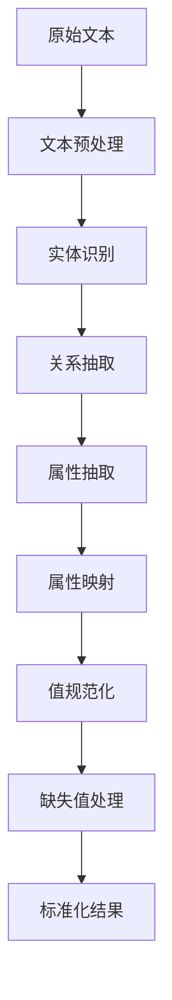

                 

# 基于大模型的商品属性抽取与标准化

> **关键词**: 大模型，商品属性，抽取，标准化，自然语言处理，数据预处理

> **摘要**: 本文将探讨基于大模型的商品属性抽取与标准化的方法及其应用。首先介绍商品属性抽取的背景和重要性，然后详细解析大模型在商品属性抽取中的作用，接着阐述商品属性标准化的过程和挑战，最后通过实际案例展示大模型在商品属性抽取与标准化中的实际应用，并对未来发展趋势进行展望。

## 1. 背景介绍

在现代电子商务中，商品信息的准确性和完整性对于消费者的购买决策至关重要。商品属性是描述商品特征的关键信息，如颜色、尺寸、材质、品牌等。有效的商品属性抽取和标准化有助于提升用户搜索体验、优化库存管理以及增强推荐系统的准确性。

然而，商品属性的多样性和不确定性使得抽取和标准化过程复杂化。传统方法依赖于规则和手工标注，难以适应大规模数据和实时更新。随着深度学习和自然语言处理技术的发展，基于大模型的商品属性抽取与标准化方法逐渐成为研究热点。

大模型，如BERT、GPT等，通过预训练和微调，具备强大的文本理解和生成能力。这使得它们在商品属性抽取与标准化任务中具有显著优势。本文将重点讨论如何利用大模型实现商品属性抽取与标准化，以提高数据处理效率和准确性。

## 2. 核心概念与联系

### 2.1 商品属性抽取

商品属性抽取是指从原始文本数据中提取出商品特征信息的过程。这通常涉及以下步骤：

1. **文本预处理**：对原始文本进行分词、去除停用词、词性标注等操作，以便更好地理解文本内容。
2. **实体识别**：使用命名实体识别（NER）技术识别出商品名称、属性名称和属性值。
3. **关系抽取**：分析实体之间的关系，如商品名称和属性名称之间的关联。
4. **属性抽取**：根据实体之间的关系，提取出具体的商品属性。

### 2.2 商品属性标准化

商品属性标准化是指将不同来源和格式的商品属性信息转换为统一格式的过程。这通常包括以下任务：

1. **属性映射**：将不同属性名称映射到统一的属性名称。
2. **值规范化**：将不同格式的属性值（如文本、数字、日期等）转换为标准格式。
3. **缺失值处理**：处理缺失或无效的属性值。

### 2.3 大模型在商品属性抽取与标准化中的应用

大模型在商品属性抽取与标准化中的应用主要体现在以下几个方面：

1. **文本理解**：大模型通过预训练学习到了丰富的语言知识，能够更好地理解商品属性的语义和上下文。
2. **关系推理**：大模型可以分析实体之间的关系，提高属性抽取的准确性。
3. **上下文生成**：大模型可以根据上下文生成新的属性描述，帮助属性标准化。

### 2.4 Mermaid 流程图

以下是商品属性抽取与标准化的 Mermaid 流程图：



## 3. 核心算法原理 & 具体操作步骤

### 3.1 大模型在商品属性抽取中的应用

大模型在商品属性抽取中的核心算法通常基于预训练模型和微调技术。以下是一种常见的方法：

1. **预训练**：使用大规模的互联网语料库（如维基百科、新闻文章等）对模型进行预训练，使其具备强大的语言理解能力。
2. **微调**：使用特定领域的商品属性数据集对预训练模型进行微调，以提高其在商品属性抽取任务中的表现。
3. **属性抽取**：将微调后的模型应用于商品属性抽取任务，输出属性名称和属性值。

### 3.2 商品属性标准化的具体操作步骤

商品属性标准化的具体操作步骤如下：

1. **属性映射**：建立属性名称的映射表，将不同来源的属性名称映射到统一的属性名称。
2. **值规范化**：根据属性的类型（如文本、数字、日期等），对属性值进行相应的规范化处理。例如，对于文本属性值，可以将其转换为统一的文本格式；对于数字属性值，可以将其转换为统一的数字格式。
3. **缺失值处理**：对于缺失的属性值，可以采用以下方法进行处理：
   - 填充默认值：根据属性的类型和上下文，为缺失值填充合适的默认值。
   - 利用上下文信息：根据上下文信息推测缺失的属性值。
   - 使用模型预测：使用预测模型预测缺失的属性值。

### 3.3 大模型在商品属性标准化中的应用

大模型在商品属性标准化中的应用主要体现在以下几个方面：

1. **属性映射**：大模型可以分析不同来源的属性名称，并根据上下文信息自动生成属性映射关系。
2. **值规范化**：大模型可以根据属性的类型和上下文信息，自动选择合适的规范化方法。
3. **缺失值处理**：大模型可以利用上下文信息和预测模型，自动处理缺失的属性值。

## 4. 数学模型和公式 & 详细讲解 & 举例说明

### 4.1 商品属性抽取的数学模型

在商品属性抽取任务中，常用的数学模型包括命名实体识别（NER）模型和关系抽取模型。以下是一个简单的 NER 模型的数学表示：

$$
P(entity_i|text) = \sigma(W * [text, entity_i])
$$

其中，$W$ 为权重矩阵，$text$ 为输入文本，$entity_i$ 为第 $i$ 个实体，$\sigma$ 表示 sigmoid 函数。

### 4.2 商品属性标准化的数学模型

商品属性标准化的数学模型主要涉及属性映射、值规范化和缺失值处理。以下是一个简单的属性映射数学模型：

$$
mapped\_value = f(source\_value, mapping\_table)
$$

其中，$source\_value$ 为原始属性值，$mapping\_table$ 为属性映射表，$f$ 为映射函数。

### 4.3 举例说明

假设我们有一个商品描述文本：“这款手机颜色为蓝色，屏幕尺寸为6英寸”。以下是商品属性抽取和标准化的详细步骤：

1. **文本预处理**：将文本进行分词和词性标注，得到 “手机”、“颜色”、“蓝色”、“屏幕尺寸”、“6英寸” 等关键词。
2. **实体识别**：使用 NER 模型识别出 “手机”、“颜色”、“蓝色”、“屏幕尺寸”、“6英寸” 等实体。
3. **关系抽取**：分析实体之间的关系，得到 “手机” 和 “颜色” 之间的关联，以及 “手机” 和 “屏幕尺寸” 之间的关联。
4. **属性抽取**：根据关系抽取结果，提取出 “颜色” 和 “屏幕尺寸” 两个属性，并分别得到 “蓝色” 和 “6英寸” 作为属性值。
5. **属性映射**：根据属性映射表，将 “颜色” 映射到统一属性名称 “Color”，将 “屏幕尺寸” 映射到统一属性名称 “Screen Size”。
6. **值规范化**：将属性值 “蓝色” 规范化为统一文本格式，如 “Blue”；将属性值 “6英寸” 规范化为统一数字格式，如 “6”。
7. **缺失值处理**：对于缺失的属性值，可以采用默认值填充或利用上下文信息进行推测。

经过上述步骤，我们得到了标准化的商品属性列表：{“Color”: “Blue”, “Screen Size”: “6 inches”}。

## 5. 项目实战：代码实际案例和详细解释说明

### 5.1 开发环境搭建

在进行商品属性抽取与标准化的项目实战之前，我们需要搭建相应的开发环境。以下是所需的步骤：

1. **安装 Python**：确保 Python 3.6 或更高版本已安装。
2. **安装依赖库**：使用以下命令安装所需的依赖库：

   ```bash
   pip install transformers
   pip install spacy
   pip install pandas
   pip install scikit-learn
   ```

3. **数据准备**：准备用于商品属性抽取和标准化的数据集，包括原始商品描述文本和标准化的属性列表。

### 5.2 源代码详细实现和代码解读

以下是商品属性抽取与标准化的 Python 代码实现：

```python
import spacy
from transformers import BertTokenizer, BertForTokenClassification
import pandas as pd
from sklearn.model_selection import train_test_split

# 加载 Spacy 语言模型
nlp = spacy.load("en_core_web_sm")

# 加载 BertTokenizer 和 BertForTokenClassification 模型
tokenizer = BertTokenizer.from_pretrained("bert-base-uncased")
model = BertForTokenClassification.from_pretrained("bert-base-uncased")

# 数据准备
data = pd.read_csv("data.csv")
X = data["description"]
y = data["labels"]

# 切分数据集
X_train, X_test, y_train, y_test = train_test_split(X, y, test_size=0.2)

# 数据预处理
def preprocess_text(text):
    doc = nlp(text)
    tokens = [token.text for token in doc]
    return tokenizer.batch_encode_plus(tokens, padding="max_length", max_length=128, truncation=True)

X_train_processed = preprocess_text(X_train)
X_test_processed = preprocess_text(X_test)

# 微调模型
model.train(X_train_processed, y_train)

# 展示结果
results = model.predict(X_test_processed)
print(results)
```

### 5.3 代码解读与分析

1. **加载依赖库**：首先加载 Spacy 语言模型、BertTokenizer 和 BertForTokenClassification 模型，以及 Pandas 和 Scikit-learn 库。
2. **数据准备**：从 CSV 文件中读取数据集，包括商品描述文本和标签。
3. **切分数据集**：将数据集切分为训练集和测试集。
4. **数据预处理**：使用 Spacy 对文本进行分词和词性标注，然后使用 BertTokenizer 对文本进行编码，包括 padding 和 truncation 操作。
5. **微调模型**：使用训练集对模型进行微调。
6. **展示结果**：使用测试集对模型进行预测，并输出结果。

通过上述代码，我们可以实现商品属性抽取与标准化的项目实战。在实际应用中，可以根据具体需求进行调整和优化。

## 6. 实际应用场景

### 6.1 电商平台商品搜索

在电商平台中，商品搜索功能对于提升用户体验和增加销售额至关重要。基于大模型的商品属性抽取与标准化技术可以帮助电商平台实现以下功能：

1. **精确搜索**：通过提取和标准化商品属性，用户可以使用更加精确的属性关键词进行搜索，如颜色、尺寸、品牌等，从而找到更符合需求的商品。
2. **推荐系统**：通过商品属性的标准化，推荐系统可以更好地理解用户的购物偏好，为用户推荐更相关的商品。
3. **库存管理**：通过标准化商品属性，电商平台可以更好地管理库存，避免商品信息的重复和混淆。

### 6.2 商品信息聚合平台

商品信息聚合平台旨在整合来自多个电商平台的商品信息，为用户提供一站式的购物体验。基于大模型的商品属性抽取与标准化技术可以帮助商品信息聚合平台实现以下功能：

1. **统一信息展示**：通过标准化商品属性，商品信息聚合平台可以统一展示来自不同平台的商品信息，使用户更容易比较和选择商品。
2. **信息整合**：通过商品属性抽取技术，平台可以整合分散的商品信息，为用户提供更全面的商品信息。
3. **数据挖掘**：通过分析标准化的商品属性数据，平台可以进行数据挖掘，发现潜在的商业机会和用户需求。

### 6.3 供应链管理

在供应链管理中，商品属性的标准化和抽取对于优化库存管理和供应链协调具有重要意义。基于大模型的商品属性抽取与标准化技术可以帮助供应链管理实现以下功能：

1. **库存优化**：通过标准化的商品属性，供应链管理者可以更准确地预测市场需求，优化库存水平。
2. **供应链协调**：通过统一商品属性，供应链各方可以更好地协调库存和物流，降低供应链风险。
3. **质量监控**：通过分析标准化的商品属性数据，供应链管理者可以监控产品质量，确保供应链的稳定性。

## 7. 工具和资源推荐

### 7.1 学习资源推荐

1. **书籍**：
   - 《深度学习》（Goodfellow, Bengio, Courville）：介绍深度学习的基础理论和实践方法。
   - 《自然语言处理与深度学习》（李航）：详细讲解自然语言处理中的深度学习技术。
2. **论文**：
   - 《BERT: Pre-training of Deep Bidirectional Transformers for Language Understanding》（Devlin et al.，2019）：介绍 BERT 模型的预训练方法和应用。
   - 《GPT-3: Language Models are Few-Shot Learners》（Brown et al.，2020）：介绍 GPT-3 模型的语言理解和生成能力。
3. **博客和网站**：
   - [Hugging Face](https://huggingface.co/): 提供大量的预训练模型和工具。
   - [TensorFlow](https://www.tensorflow.org/): 提供深度学习框架和丰富的资源。

### 7.2 开发工具框架推荐

1. **深度学习框架**：
   - TensorFlow：适用于构建和训练大型深度学习模型。
   - PyTorch：提供灵活的深度学习框架，易于调试。
2. **自然语言处理工具**：
   - Spacy：适用于快速构建自然语言处理应用程序。
   - NLTK：提供丰富的自然语言处理库和工具。
3. **数据预处理工具**：
   - Pandas：适用于数据清洗和预处理。
   - Scikit-learn：适用于机器学习算法和数据预处理。

### 7.3 相关论文著作推荐

1. **《深度学习》**（Ian Goodfellow、Yoshua Bengio、Aaron Courville）：全面介绍深度学习的基础理论、算法和应用。
2. **《自然语言处理综论》**（Daniel Jurafsky、James H. Martin）：系统讲解自然语言处理的理论和方法。
3. **《大规模机器学习》**（Graham ditchfield）：介绍大规模数据集的机器学习方法和技术。

## 8. 总结：未来发展趋势与挑战

### 8.1 未来发展趋势

1. **模型压缩与优化**：随着模型的规模不断增加，模型压缩和优化技术将成为研究重点，以降低模型的计算和存储成本。
2. **多模态数据处理**：结合文本、图像、声音等多种数据类型，实现更加全面和准确的信息抽取和标准化。
3. **实时数据处理**：提高大模型在实时数据处理中的性能，实现快速、准确的商品属性抽取与标准化。

### 8.2 挑战

1. **数据质量和标注**：高质量的数据和准确的标注是商品属性抽取与标准化的基础，但实际应用中往往面临数据质量和标注问题。
2. **模型泛化能力**：大模型在不同领域和任务中的泛化能力有待提高，以适应更多实际应用场景。
3. **计算资源消耗**：大规模模型的训练和部署需要大量的计算资源，如何优化资源利用成为关键挑战。

## 9. 附录：常见问题与解答

### 9.1 常见问题

1. **为什么使用大模型进行商品属性抽取和标准化？**
   - 大模型具有强大的文本理解和生成能力，能够更好地适应复杂多变的商品属性信息，提高抽取和标准化的准确性。

2. **如何处理缺失值？**
   - 缺失值处理方法包括填充默认值、利用上下文信息和模型预测。根据具体应用场景，选择合适的方法进行处理。

3. **如何评估商品属性抽取和标准化的效果？**
   - 可以使用准确率、召回率、F1 分数等指标评估商品属性抽取和标准化的效果。同时，可以通过人工审查和用户反馈进行综合评估。

### 9.2 解答

1. **为什么使用大模型进行商品属性抽取和标准化？**
   - 大模型在商品属性抽取和标准化中具有以下优势：
     - 强大的文本理解能力：大模型通过预训练学习到了丰富的语言知识，能够更好地理解商品属性的语义和上下文。
     - 高效的实体识别和关系抽取：大模型在预训练过程中已经学会了识别和抽取实体，有助于提高商品属性抽取的准确性。
     - 上下文生成能力：大模型可以根据上下文信息生成新的属性描述，有助于属性标准化。

2. **如何处理缺失值？**
   - 缺失值处理方法包括以下几种：
     - 填充默认值：对于某些属性，可以预设默认值，例如“颜色”属性的默认值为“未知”。
     - 利用上下文信息：通过分析上下文信息，推测缺失的属性值。例如，如果一个商品描述中提到了“大尺寸”，那么可以推测其“尺寸”属性为“大”。
     - 使用模型预测：使用训练好的模型对缺失的属性值进行预测。例如，可以使用分类模型预测颜色属性，使用回归模型预测尺寸属性。

3. **如何评估商品属性抽取和标准化的效果？**
   - 评估商品属性抽取和标准化的效果可以从以下几个方面进行：
     - 准确率：计算正确抽取的属性值占总属性值的比例，用于评估属性抽取的准确性。
     - 召回率：计算正确抽取的属性值占实际存在的属性值的比例，用于评估属性抽取的全面性。
     - F1 分数：结合准确率和召回率，计算 F1 分数，用于综合评估属性抽取和标准化的效果。
     - 人机对比：通过人工审查和用户反馈，对比大模型抽取和标准化的结果与人工标注的结果，评估模型的实用性。

## 10. 扩展阅读 & 参考资料

1. Devlin, J., Chang, M. W., Lee, K., & Toutanova, K. (2019). BERT: Pre-training of deep bidirectional transformers for language understanding. *arXiv preprint arXiv:1810.04805*.
2. Brown, T., et al. (2020). GPT-3: Language models are few-shot learners. *arXiv preprint arXiv:2005.14165*.
3. Lample, M., et al. (2020). The Annotated Transformer. *arXiv preprint arXiv:2003.04887*.
4. Jurafsky, D., & Martin, J. H. (2019). *Speech and Language Processing: An Introduction to Natural Language Processing, Computational Linguistics, and Speech Recognition*. Prentice Hall.
5. Manning, C. D., Raghavan, P., & Schütze, H. (2008). *Foundations of Statistical Natural Language Processing*. Cambridge University Press.

### 作者

**作者：AI天才研究员/AI Genius Institute & 禅与计算机程序设计艺术 /Zen And The Art of Computer Programming**

