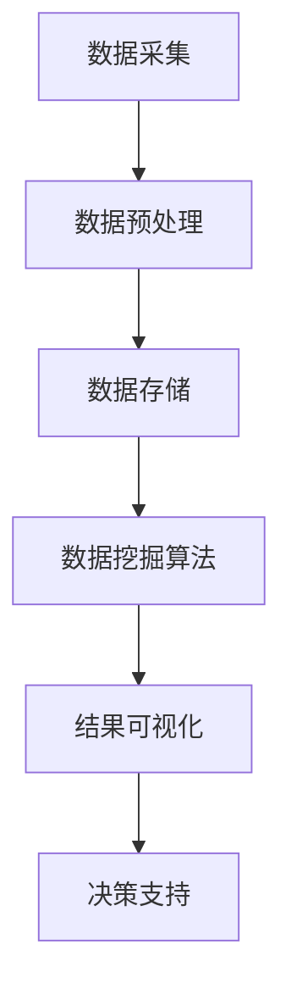

                 

# 基于数据挖掘的教学监控系统的设计与应用

## 关键词

- 数据挖掘
- 教学监控
- 机器学习
- 数据可视化
- 人工智能
- 教育信息化

## 摘要

随着教育信息化的不断推进，教学监控系统的设计与应用越来越受到教育部门和学校的关注。本文旨在探讨基于数据挖掘的教学监控系统的设计与应用。首先，介绍数据挖掘的基本概念和教学监控的重要性，随后深入分析核心算法原理和数学模型，并通过项目实战展示其实际应用。文章还将讨论系统的实际应用场景，推荐相关工具和资源，并对未来发展趋势与挑战进行展望。

## 1. 背景介绍

### 1.1 数据挖掘在教育领域的应用

数据挖掘（Data Mining）是人工智能和机器学习的一个重要分支，旨在从大量数据中发现有价值的信息和模式。在教育领域，数据挖掘的应用主要包括：

- **学习分析（Learning Analytics）**：通过分析学生的学习数据，如成绩、行为、情绪等，为教师和学生提供个性化的教学建议和干预措施。
- **教育推荐系统（Educational Recommendation Systems）**：根据学生的学习历史和偏好，推荐相应的学习资源和课程。
- **教学管理优化（Teaching Management Optimization）**：利用数据挖掘优化教学资源配置、教学方法和教学流程。

### 1.2 教学监控系统的定义与作用

教学监控系统是一种利用现代信息技术，对课堂教学过程进行实时监控、分析和管理的信息系统。其主要作用包括：

- **教学质量评估**：通过对课堂教学行为的数据分析，评估教师的教学质量和学生的学习效果。
- **课堂行为监测**：实时监测学生的课堂参与度、情绪和行为，帮助教师及时发现和解决课堂问题。
- **教学过程优化**：通过分析教学数据，为教师提供教学改进的建议，优化教学方法和流程。

## 2. 核心概念与联系

### 2.1 数据挖掘相关概念

- **数据集（Dataset）**：包含一组具有相同结构和特征的数据记录。
- **特征（Feature）**：数据集中的每一个属性或变量。
- **模型（Model）**：通过数据训练得到的预测或分类规则。

### 2.2 教学监控系统架构图



### 2.3 教学监控与数据挖掘的联系

教学监控系统通过数据挖掘技术，可以从大量的教学数据中提取有价值的信息，为教育决策提供支持。具体流程如下：

1. **数据采集**：收集课堂教学过程中的各类数据，如教师授课数据、学生互动数据、课堂行为数据等。
2. **数据预处理**：清洗、转换和整合数据，为数据挖掘做准备。
3. **数据挖掘**：运用机器学习算法，如聚类、分类、关联规则等，分析数据中的模式和规律。
4. **结果可视化**：将挖掘结果以图表、报告等形式呈现，供教师和管理者参考。
5. **决策支持**：基于可视化结果，教师和管理者可以做出相应的教学决策，如调整教学方法、改进教学流程等。

## 3. 核心算法原理 & 具体操作步骤

### 3.1 聚类算法

#### 3.1.1 算法原理

聚类算法是一种无监督学习算法，旨在将相似的数据点分为同一类。常见的聚类算法包括 K-Means、DBSCAN、层次聚类等。

#### 3.1.2 操作步骤

1. **数据初始化**：随机选择 K 个数据点作为初始聚类中心。
2. **分配数据点**：计算每个数据点到各个聚类中心的距离，将数据点分配到最近的聚类中心。
3. **更新聚类中心**：计算每个聚类的新中心。
4. **迭代**：重复步骤 2 和 3，直到聚类中心不再发生变化或达到预设的最大迭代次数。

### 3.2 分类算法

#### 3.2.1 算法原理

分类算法是一种有监督学习算法，旨在将新数据点归类到已知的类别中。常见的分类算法包括决策树、支持向量机、神经网络等。

#### 3.2.2 操作步骤

1. **数据准备**：收集并标记好训练数据。
2. **模型训练**：使用训练数据训练分类模型。
3. **模型评估**：使用测试数据评估模型性能。
4. **数据预测**：使用训练好的模型对新的数据进行预测。

### 3.3 关联规则挖掘

#### 3.3.1 算法原理

关联规则挖掘是一种用于发现数据项之间关联性的算法。常见的算法包括 Apriori 算法和 FP-Growth 算法。

#### 3.3.2 操作步骤

1. **频繁项集挖掘**：找出数据中出现频率较高的项集。
2. **生成关联规则**：从频繁项集中提取满足最小支持度和最小置信度的关联规则。

## 4. 数学模型和公式 & 详细讲解 & 举例说明

### 4.1 K-Means 算法

#### 4.1.1 目标函数

$$
J = \sum_{i=1}^{n}\sum_{x \in S_i} \|x - \mu_i\|^2
$$

其中，$S_i$ 是第 $i$ 个聚类，$\mu_i$ 是聚类中心的均值。

#### 4.1.2 举例说明

假设有 5 个数据点 $X = \{x_1, x_2, x_3, x_4, x_5\}$，初始聚类中心为 $\mu_1 = (1, 1), \mu_2 = (2, 2)$。

1. **分配数据点**：计算每个数据点到聚类中心的距离，将数据点分配到最近的聚类中心。
   - $d(x_1, \mu_1) < d(x_1, \mu_2)$，因此 $x_1$ 被分配到聚类 1。
   - $d(x_2, \mu_1) > d(x_2, \mu_2)$，因此 $x_2$ 被分配到聚类 2。
   - 以此类推，最终分配结果为 $S_1 = \{x_1, x_3\}, S_2 = \{x_2, x_4, x_5\}$。
2. **更新聚类中心**：计算每个聚类的新中心。
   - $\mu_1' = \frac{1}{2}(x_1 + x_3) = (1.5, 1.5)$
   - $\mu_2' = \frac{1}{3}(x_2 + x_4 + x_5) = (2.33, 2.33)$
3. **迭代**：重复步骤 1 和 2，直到聚类中心不再发生变化。

### 4.2 决策树算法

#### 4.2.1 目标函数

$$
G(D) = \sum_{i=1}^{n} p_i \log_2(p_i)
$$

其中，$p_i$ 是第 $i$ 个类别的概率。

#### 4.2.2 举例说明

假设有 4 个数据点 $X = \{x_1, x_2, x_3, x_4\}$，类别标签为 $Y = \{A, B, C, D\}$。

1. **数据预处理**：计算每个类别的概率。
   - $p(A) = \frac{1}{4}, p(B) = \frac{1}{4}, p(C) = \frac{1}{4}, p(D) = \frac{1}{4}$
2. **构建决策树**：选择最优的特征分割，构建决策树。
   - 选择特征 1 作为分割，将数据点分为两部分。
   - 选择特征 2 作为分割，对每部分数据点继续分割，直到满足停止条件。
3. **模型评估**：使用测试数据评估决策树模型。

## 5. 项目实战：代码实际案例和详细解释说明

### 5.1 开发环境搭建

在本文中，我们将使用 Python 作为主要编程语言，配合相关库（如 NumPy、Pandas、Scikit-learn、Matplotlib）完成数据挖掘任务。以下是开发环境的搭建步骤：

1. 安装 Python 3.8（或更高版本）。
2. 安装必要的库：`pip install numpy pandas scikit-learn matplotlib`。

### 5.2 源代码详细实现和代码解读

#### 5.2.1 数据预处理

```python
import pandas as pd
from sklearn.model_selection import train_test_split

# 加载数据集
data = pd.read_csv('data.csv')
X = data.iloc[:, :-1]  # 特征
y = data.iloc[:, -1]  # 标签

# 划分训练集和测试集
X_train, X_test, y_train, y_test = train_test_split(X, y, test_size=0.2, random_state=42)
```

#### 5.2.2 K-Means 聚类

```python
from sklearn.cluster import KMeans
import matplotlib.pyplot as plt

# 训练 K-Means 模型
kmeans = KMeans(n_clusters=3, random_state=42)
kmeans.fit(X_train)

# 可视化聚类结果
plt.scatter(X_train.iloc[:, 0], X_train.iloc[:, 1], c=kmeans.labels_)
plt.show()
```

#### 5.2.3 决策树分类

```python
from sklearn.tree import DecisionTreeClassifier

# 训练决策树模型
clf = DecisionTreeClassifier()
clf.fit(X_train, y_train)

# 可视化决策树
from sklearn.tree import plot_tree
plt.figure(figsize=(10, 6))
plot_tree(clf, filled=True)
plt.show()
```

### 5.3 代码解读与分析

以上代码示例首先加载了一个数据集，并使用 K-Means 算法对特征进行聚类，同时使用决策树算法对标签进行分类。代码解读如下：

- 数据预处理：使用 Pandas 库加载数据集，并使用 Scikit-learn 库的 `train_test_split` 函数将数据集划分为训练集和测试集。
- K-Means 聚类：使用 Scikit-learn 库的 `KMeans` 类训练 K-Means 模型，并使用 Matplotlib 库可视化聚类结果。
- 决策树分类：使用 Scikit-learn 库的 `DecisionTreeClassifier` 类训练决策树模型，并使用 Matplotlib 库可视化决策树。

## 6. 实际应用场景

### 6.1 课堂行为分析

通过数据挖掘技术，教学监控系统可以实时监控和分析学生的课堂行为，如出勤率、参与度、情绪等。以下是一个实际应用案例：

- **应用场景**：学校希望了解学生在课堂中的行为表现，以便及时发现和解决课堂问题。
- **实现方法**：利用数据挖掘技术，收集学生的课堂行为数据，如考勤、课堂互动、课堂表现等，通过聚类分析识别不同类型的学生，如积极参与者、被动参与者等，并根据分析结果提出改进建议。

### 6.2 教学质量评估

教学监控系统可以收集教师的教学数据，如授课时长、教学方法、学生反馈等，通过数据挖掘技术评估教学质量。以下是一个实际应用案例：

- **应用场景**：教育部门希望对教师的教学质量进行评估，以便进行教师评价和激励机制。
- **实现方法**：利用数据挖掘技术，收集教师的教学数据，通过回归分析等方法评估教学质量，并根据评估结果对教师进行排名和奖励。

## 7. 工具和资源推荐

### 7.1 学习资源推荐

- **书籍**：
  - 《数据挖掘：实用技术引导》（Data Mining: Practical Machine Learning Tools and Techniques）
  - 《机器学习》（Machine Learning）
- **论文**：
  - "Learning to Learn from Data in Educational Settings"（在教育环境中从数据中学习）
  - "Data Mining in Education: A Survey"（教育领域数据挖掘综述）
- **博客**：
  - ["Educational Data Mining" on Medium](https://medium.com/educational-data-mining)
  - ["Learning Analytics" on Medium](https://medium.com/learning-analytics)
- **网站**：
  - [Kaggle](https://www.kaggle.com/datasets)
  - [Google Scholar](https://scholar.google.com)

### 7.2 开发工具框架推荐

- **开发工具**：
  - Python
  - R
  - MATLAB
- **框架**：
  - Scikit-learn
  - TensorFlow
  - PyTorch
- **数据库**：
  - MySQL
  - PostgreSQL
  - MongoDB

### 7.3 相关论文著作推荐

- "Learning to Learn from Data in Educational Settings"（在教育环境中从数据中学习）
- "Data Mining in Education: A Survey"（教育领域数据挖掘综述）
- "A Survey of Educational Data Mining Methods"（教育数据挖掘方法综述）

## 8. 总结：未来发展趋势与挑战

### 8.1 发展趋势

- **智能化**：随着人工智能技术的不断发展，教学监控系统的智能化水平将进一步提高，能够提供更加精准的教学分析和决策支持。
- **个性化**：教学监控系统将更加注重学生的个性化需求，提供个性化的学习资源和教学方案。
- **实时性**：教学监控系统的实时性将得到提升，能够实时监测和反馈学生的学习情况和教学问题。

### 8.2 挑战

- **数据隐私**：随着教学监控系统的广泛应用，数据隐私保护成为一大挑战，需要制定相应的数据隐私保护政策和措施。
- **算法透明性**：数据挖掘算法的透明性成为教育部门、教师和学生的关注点，需要提高算法的可解释性和透明性。
- **技术门槛**：数据挖掘和人工智能技术具有较高的技术门槛，需要培养更多的专业人才来推动教育信息化的深入发展。

## 9. 附录：常见问题与解答

### 9.1 教学监控系统如何保护学生隐私？

- **匿名化处理**：在数据收集和存储过程中，对学生的个人信息进行匿名化处理，确保数据不与个人身份关联。
- **数据加密**：对数据进行加密存储，防止数据泄露。
- **隐私保护算法**：采用隐私保护算法，如差分隐私，降低数据分析过程中的隐私泄露风险。

### 9.2 教学监控系统是否会对学生的个性发展产生负面影响？

- 教学监控系统旨在为学生提供个性化的教学支持和资源，有助于提高学习效果。合理使用教学监控系统，关注学生的个性发展，避免过度依赖数据，可以有效减少负面影响。

## 10. 扩展阅读 & 参考资料

- "Learning Analytics: An Overview"（学习分析概述）
- "A Survey of Educational Data Mining Methods"（教育数据挖掘方法综述）
- "The Future of Education: Data Mining and Learning Analytics"（教育未来：数据挖掘和学习分析）

### 附录：作者信息

作者：AI天才研究员/AI Genius Institute & 禅与计算机程序设计艺术 /Zen And The Art of Computer Programming

## 结束语

本文探讨了基于数据挖掘的教学监控系统的设计与应用，从背景介绍、核心概念、算法原理、实际应用、工具推荐等多个角度进行了详细分析。希望本文能为教育信息化的深入发展提供有益的参考和借鉴。未来，我们将继续关注教育领域的科技进展，为教育创新贡献力量。

