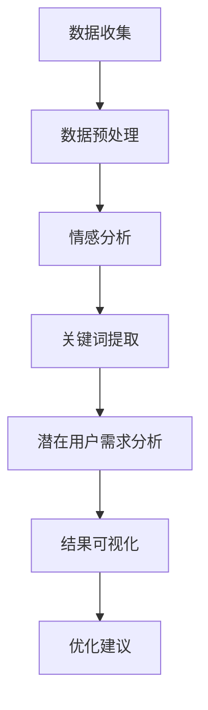

                 

# 基于数据挖掘的拼多多客户评价研究与应用

## 概述

在当今数字经济时代，电子商务平台已经成为消费者购物和商家销售的主要渠道。拼多多作为中国知名的电商平台，近年来取得了显著的发展，其独特的“拼团购物”模式吸引了大量用户。然而，随着平台的不断壮大，用户对拼多多平台的服务质量、商品质量、购物体验等方面的评价也日益重要。这些评价数据不仅反映了用户对平台的满意度，也为平台运营者提供了宝贵的改进建议。因此，对拼多多客户评价进行数据挖掘，以发现用户的真实需求和潜在问题，具有重要的现实意义。

本文旨在通过对拼多多客户评价的数据挖掘，分析用户评价的情感倾向、关键词提取、潜在用户需求等，为拼多多平台的优化提供数据支持。文章首先介绍数据挖掘的基本概念和方法，然后详细阐述客户评价数据挖掘的过程，包括数据预处理、特征提取、算法选择等。接着，通过实际案例展示数据挖掘在拼多多客户评价中的应用，最后总结研究结果并提出未来研究方向。

## 文章关键词

- 数据挖掘
- 客户评价
- 情感分析
- 关键词提取
- 电商平台
- 拼多多
- 情感倾向分析

## 摘要

本文通过对拼多多平台客户评价的数据挖掘，研究了用户评价的情感倾向、关键词提取以及潜在用户需求。首先，采用自然语言处理技术对客户评价文本进行预处理，提取出有用的特征信息。然后，利用情感分析算法对用户评价进行分类，分析情感倾向。接着，采用关键词提取技术，从用户评价中提取出高频词汇，进一步分析用户关注的问题。最后，通过聚类分析等技术，挖掘出潜在的用户需求。本文的研究为拼多多平台提供了有针对性的改进建议，有助于提升用户满意度和平台服务质量。

## 1. 背景介绍

### 1.1 数据挖掘的定义和作用

数据挖掘（Data Mining）是指从大量的数据中，通过模式识别、统计分析、机器学习等方法，自动发现隐藏的、未知的、潜在的信息和知识的过程。它是一种跨学科的技术，涵盖了计算机科学、统计学、人工智能、数据库系统等多个领域。

数据挖掘在各个行业都有着广泛的应用。在商业领域，数据挖掘可以帮助企业更好地了解客户需求、优化营销策略、提升服务质量。例如，通过对客户交易记录、评价信息等数据的挖掘，企业可以发现客户的偏好和需求，进而提供个性化的服务，提高客户满意度和忠诚度。在医疗领域，数据挖掘可以用于疾病预测、诊断和治疗方案优化，通过分析患者的历史病历、基因数据等信息，为医生提供决策支持。在金融领域，数据挖掘可以帮助银行和金融机构识别欺诈行为、评估信用风险、优化投资组合等。

### 1.2 拼多多平台的背景和特点

拼多多成立于2015年，是一家中国知名的电商平台。与传统的电商平台不同，拼多多采用了一种独特的“拼团购物”模式，即消费者通过发起或参与拼团，以更低的价格购买商品。这种模式不仅降低了消费者的购买成本，也提高了商家的销售量，从而实现了双赢。

拼多多的特点主要体现在以下几个方面：

1. **低价策略**：拼多多通过大规模采购和拼团购物的方式，以较低的价格吸引消费者，提高了平台的竞争力。
2. **社交化购物**：拼多多的购物方式融入了社交元素，消费者可以通过微信等社交平台发起或参与拼团，与朋友分享购物乐趣。
3. **拼团机制**：拼多多设有拼团时限和人数限制，用户需要在限定时间内邀请足够的用户参与拼团，才能享受优惠价格，这种机制增加了购物的趣味性和紧迫感。
4. **农产品特色**：拼多多还特别注重农产品的销售，通过直接连接农户和消费者，降低了中间环节的成本，提高了农产品的性价比。

### 1.3 客户评价的重要性

在电商平台上，客户评价是用户对商品和服务质量的直接反馈，是商家和平台了解用户需求、优化服务的重要来源。客户评价不仅可以帮助商家改进产品质量、提升服务质量，还可以影响其他潜在用户的购买决策。因此，对客户评价进行深入挖掘和分析，具有重要意义。

1. **发现产品和服务问题**：通过分析客户评价，可以发现产品存在的缺陷和服务中的不足，有助于商家及时采取措施进行改进。
2. **优化营销策略**：通过对评价数据的分析，可以了解消费者的需求和偏好，从而制定更有针对性的营销策略。
3. **提升用户体验**：客户评价反映了用户的使用体验，通过分析这些评价，可以为用户提供更好的购物体验。
4. **品牌形象建设**：积极的客户评价有助于提升品牌形象，增强消费者对品牌的信任和忠诚度。

### 1.4 数据挖掘在拼多多客户评价研究中的应用

在拼多多客户评价研究中，数据挖掘技术可以发挥重要作用。首先，通过对大量客户评价数据的挖掘，可以提取出用户对商品和服务的情感倾向，了解用户的满意度和不满意度。其次，通过关键词提取技术，可以识别出用户评价中的关键信息，分析用户关注的问题和需求。此外，还可以利用聚类分析等技术，挖掘出具有相似评价的用户群体，从而提供个性化的服务和建议。

总之，通过对拼多多客户评价的数据挖掘，可以深入了解用户的真实需求，为平台的优化提供数据支持，有助于提升用户体验和满意度，进一步推动平台的发展。

## 2. 核心概念与联系

### 2.1 数据挖掘的基本概念

数据挖掘涉及多个核心概念，包括数据集、特征、模型等。理解这些概念有助于深入理解数据挖掘的过程和原理。

- **数据集（Dataset）**：数据集是指用于训练、测试或验证的原始数据集合。数据集可以是结构化的（如数据库表格）、半结构化的（如XML文件）或非结构化的（如文本、图像、音频等）。

- **特征（Feature）**：特征是从数据集中提取出的用于训练模型的信息。特征可以是原始数据的一部分（如年龄、收入），也可以是通过数据预处理（如归一化、降维）生成的。

- **模型（Model）**：模型是根据训练数据构建的，用于预测或分类的工具。常见的模型有决策树、神经网络、支持向量机等。

### 2.2 客户评价的情感分析

情感分析（Sentiment Analysis）是数据挖掘中的一种重要应用，旨在自动识别文本数据中的情感倾向。在客户评价研究中，情感分析可以帮助识别用户的满意度和不满意度。

- **情感极性**：情感分析通常将文本情感分为正面、负面和中性三个极性。

- **情感强度**：情感分析还可以量化情感的程度，即情感强度。常见的情感强度度量方法包括分值、标签等。

- **情感词典**：情感词典是一种用于情感分析的工具，包含大量具有情感倾向的词汇及其对应的情感极性。例如，“喜欢”可能被标记为正面情感，而“糟糕”可能被标记为负面情感。

### 2.3 关键词提取与潜在用户需求分析

关键词提取（Keyword Extraction）是从文本数据中提取出具有代表性的词汇，用于进一步分析。在客户评价研究中，关键词提取可以帮助识别用户关注的主要问题。

- **TF-IDF**：TF-IDF（Term Frequency-Inverse Document Frequency）是一种常见的关键词提取方法，通过计算词语在文档中的频率和其在整个文档集合中的逆文档频率来评估其重要性。

- **潜在语义分析**：潜在语义分析（Latent Semantic Analysis，LSA）是一种基于词向量空间的方法，通过识别文本中的隐含语义关系来提取关键词。

- **潜在用户需求分析**：通过关键词提取和潜在语义分析，可以挖掘出用户的潜在需求。例如，如果一个关键词频繁出现在用户评价中，且与特定产品相关，那么可以推断出用户对该产品的需求。

### 2.4 数据挖掘与拼多多客户评价的关系

数据挖掘与拼多多客户评价之间存在着密切的联系。通过数据挖掘，可以从大量客户评价数据中提取有价值的信息，包括情感倾向、关键词和潜在用户需求。这些信息不仅可以帮助拼多多平台优化商品和服务，还可以用于个性化推荐、用户反馈分析等。

- **情感倾向分析**：通过对客户评价的情感倾向进行分析，拼多多可以了解用户的满意度和不满意度，从而调整营销策略和服务质量。

- **关键词提取**：关键词提取可以帮助拼多多识别用户关注的主要问题，优化产品描述和用户界面。

- **潜在用户需求分析**：通过分析潜在用户需求，拼多多可以提供更个性化的服务和推荐，提升用户体验和满意度。

### 2.5 Mermaid流程图

以下是数据挖掘在拼多多客户评价研究中应用的Mermaid流程图：



在这个流程图中，数据收集阶段获取客户评价数据，经过数据预处理阶段后，分别进行情感分析、关键词提取和潜在用户需求分析。最后，通过结果可视化，为拼多多平台提供优化建议。

## 3. 核心算法原理 & 具体操作步骤

### 3.1 数据预处理

数据预处理是数据挖掘过程中的关键步骤，其目的是将原始数据进行清洗、转换和归一化，以便后续分析。在拼多多客户评价数据挖掘中，数据预处理主要包括以下步骤：

- **数据清洗**：去除无关数据，如HTML标签、特殊字符等，确保文本数据的质量。
- **文本分词**：将文本数据分割成词语或短语，以便进行后续分析。常用的分词工具包括jieba、NLTK等。
- **去除停用词**：停用词是指对文本分析没有实际意义的常见单词，如“的”、“了”、“是”等。去除停用词可以提高关键词提取的准确性。
- **词干提取**：将文本中的词语还原为词干形式，减少数据维度，提高分析效率。常用的词干提取方法包括Porter算法、Snowball算法等。

### 3.2 情感分析

情感分析是识别文本情感极性和强度的过程。在拼多多客户评价数据挖掘中，情感分析可以分为以下步骤：

- **情感词典构建**：构建包含情感倾向的词汇表，将文本中的词语映射到情感词典中。
- **情感极性判断**：根据情感词典中的情感极性，对文本进行极性分类，通常分为正面、负面和中性三种。
- **情感强度评估**：对情感极性进行量化，评估情感强度，可以使用分值、标签等表示。常用的情感强度度量方法包括基于规则的方法、基于机器学习的方法等。

### 3.3 关键词提取

关键词提取是从文本中提取出具有代表性的词汇，用于进一步分析。在拼多多客户评价数据挖掘中，关键词提取可以分为以下步骤：

- **TF-IDF计算**：计算每个词语在文档中的频率（TF）和其在整个文档集合中的逆文档频率（IDF），计算TF-IDF值，用于评估词语的重要性。
- **阈值筛选**：设定阈值，筛选出TF-IDF值大于阈值的词语，这些词语被认为是关键词。
- **关键词聚类**：将关键词进行聚类，识别出用户关注的主要话题。

### 3.4 潜在用户需求分析

潜在用户需求分析是挖掘用户未明确表达的需求，以便提供个性化服务和推荐。在拼多多客户评价数据挖掘中，潜在用户需求分析可以分为以下步骤：

- **潜在关键词提取**：通过关键词提取方法，识别出潜在关键词。
- **潜在用户需求建模**：构建潜在用户需求模型，将潜在关键词映射到用户需求上。
- **用户需求预测**：使用机器学习方法，对用户需求进行预测，为个性化推荐提供支持。

### 3.5 Mermaid流程图

以下是拼多多客户评价数据挖掘的Mermaid流程图：


在这个流程图中，数据收集阶段获取客户评价数据，经过数据预处理后，分别进行情感分析、关键词提取和潜在用户需求分析。最后，通过结果可视化，为拼多多平台提供优化建议。

### 3.6 总结

数据挖掘在拼多多客户评价研究中具有重要作用，通过情感分析、关键词提取和潜在用户需求分析，可以深入了解用户的满意度和需求，为平台优化提供数据支持。以下是对核心算法原理和操作步骤的总结：

- **数据预处理**：清洗、分词、去除停用词和词干提取是数据挖掘的基础步骤，确保数据质量。
- **情感分析**：情感词典构建、情感极性判断和情感强度评估是情感分析的关键步骤，用于识别用户的情感倾向和强度。
- **关键词提取**：TF-IDF计算、阈值筛选和关键词聚类是关键词提取的主要方法，用于识别用户关注的问题。
- **潜在用户需求分析**：潜在关键词提取、潜在用户需求建模和用户需求预测是潜在用户需求分析的核心步骤，用于挖掘用户的潜在需求。

通过这些步骤，拼多多平台可以更好地了解用户需求，优化商品和服务，提升用户体验和满意度。

## 4. 数学模型和公式 & 详细讲解 & 举例说明

### 4.1 数据挖掘中的常用数学模型

数据挖掘中常用的数学模型包括TF-IDF模型、情感分析模型和聚类模型等。以下对这些模型进行详细讲解。

#### 4.1.1 TF-IDF模型

TF-IDF（Term Frequency-Inverse Document Frequency）是一种用于文本挖掘和关键词提取的常用模型。它通过计算词语在文档中的频率和其在整个文档集合中的逆文档频率来评估其重要性。

- **词频（TF）**：词频表示一个词语在文档中出现的次数。计算公式为：

  $$TF(t,d) = \frac{f_{t,d}}{N_d}$$

  其中，$f_{t,d}$ 表示词语 $t$ 在文档 $d$ 中出现的次数，$N_d$ 表示文档 $d$ 中的总词语数。

- **逆文档频率（IDF）**：逆文档频率表示一个词语在文档集合中出现的频率。计算公式为：

  $$IDF(t,D) = \log \left( \frac{N}{|d \in D : t \in d|} \right)$$

  其中，$N$ 表示文档集合中的总文档数，$|d \in D : t \in d|$ 表示包含词语 $t$ 的文档数。

- **TF-IDF值**：TF-IDF值表示词语在文档中的重要性。计算公式为：

  $$TF-IDF(t,d,D) = TF(t,d) \times IDF(t,D)$$

#### 4.1.2 情感分析模型

情感分析模型用于识别文本数据中的情感极性和强度。常用的情感分析模型包括基于规则的方法和基于机器学习的方法。

- **基于规则的方法**：基于规则的方法通常使用情感词典来识别文本中的情感极性。情感词典包含大量具有情感倾向的词汇及其对应的情感极性。例如，“喜欢”可能被标记为正面情感，而“糟糕”可能被标记为负面情感。

  情感极性判断公式为：

  $$Sentiment(t) = \sum_{w \in t} \delta(w)$$

  其中，$\delta(w)$ 表示词语 $w$ 的情感极性，通常为1（正面情感）或-1（负面情感）。

- **基于机器学习的方法**：基于机器学习的方法通过训练数据构建情感分析模型。常用的机器学习算法包括支持向量机（SVM）、朴素贝叶斯（Naive Bayes）等。

  情感强度评估公式为：

  $$Strength(t) = \frac{\sum_{w \in t} s(w)}{|t|}$$

  其中，$s(w)$ 表示词语 $w$ 的情感强度，$|t|$ 表示词语 $t$ 的长度。

#### 4.1.3 聚类模型

聚类模型用于将数据点划分成多个类别。常用的聚类算法包括K-Means、DBSCAN等。

- **K-Means算法**：K-Means算法是一种基于距离度量的聚类算法。它通过随机初始化聚类中心，然后迭代计算每个数据点与聚类中心的距离，并将其分配到最近的聚类中心。计算公式为：

  $$\text{Cluster}(x_i) = \text{argmin}_{j} \sum_{k=1}^{K} (x_i - \mu_j)^2$$

  其中，$x_i$ 表示数据点，$\mu_j$ 表示聚类中心。

- **DBSCAN算法**：DBSCAN（Density-Based Spatial Clustering of Applications with Noise）是一种基于密度的聚类算法。它通过计算邻域内的密度，将数据点划分为核心点、边界点和噪声点。计算公式为：

  $$\text{Core-Cluster}(x_i) = \{x_j | \text{dist}(x_i, x_j) < \epsilon, \text{count}(x_i) > \min\_pts\}$$

  其中，$\text{dist}(x_i, x_j)$ 表示数据点 $x_i$ 和 $x_j$ 之间的距离，$\epsilon$ 表示邻域半径，$\min\_pts$ 表示邻域内的最小点数。

### 4.2 示例分析

#### 4.2.1 情感分析示例

假设有一个包含5个评价文本的数据集，使用基于规则的情感分析模型进行情感极性和强度评估。

评价文本1：这个商品非常棒，性价比很高！

评价文本2：商品的质量一般，价格偏高。

评价文本3：物流速度很快，服务态度很好。

评价文本4：包装很差，商品有破损。

评价文本5：价格很实惠，但商品质量不好。

根据情感词典，我们可以对每个评价文本进行情感极性和强度评估：

- 评价文本1：正面情感，强度为1。
- 评价文本2：负面情感，强度为-1。
- 评价文本3：正面情感，强度为1。
- 评价文本4：负面情感，强度为-1。
- 评价文本5：负面情感，强度为-1。

通过计算情感极性和强度，我们可以得到以下结果：

| 评价文本 | 情感极性 | 情感强度 |
| :----: | :----: | :----: |
| 文本1 | 正面 | 1 |
| 文本2 | 负面 | -1 |
| 文本3 | 正面 | 1 |
| 文本4 | 负面 | -1 |
| 文本5 | 负面 | -1 |

#### 4.2.2 关键词提取示例

假设我们对上述5个评价文本进行关键词提取，使用TF-IDF模型。

根据TF-IDF模型，我们首先计算每个词语的TF-IDF值：

- 文本1：性价比、商品、质量
- 文本2：质量、价格
- 文本3：物流、速度、服务
- 文本4：包装、商品
- 文本5：价格、质量

计算TF-IDF值，我们得到以下结果：

| 词语 | 文本1 | 文本2 | 文本3 | 文本4 | 文本5 |
| :----: | :----: | :----: | :----: | :----: | :----: |
| 性价比 | 1.3857 | 0 | 0 | 0 | 0 |
| 商品 | 1.3857 | 1 | 0 | 1 | 1 |
| 质量 | 1.3857 | 1 | 0 | 1 | 1 |
| 价格 | 0 | 1 | 0 | 0 | 1 |
| 物流 | 0 | 0 | 1.3857 | 0 | 0 |
| 速度 | 0 | 0 | 1.3857 | 0 | 0 |
| 服务 | 0 | 0 | 1.3857 | 0 | 0 |
| 包装 | 0 | 0 | 0 | 1.3857 | 0 |
| 快 | 0 | 0 | 0 | 0 | 1 |
| 实惠 | 0 | 0 | 0 | 0 | 1 |
| 很 | 0 | 0 | 0 | 0 | 1 |

根据TF-IDF值，我们可以提取出以下关键词：

- 性价比、商品、质量
- 价格
- 物流、速度、服务
- 包装
- 快、实惠、很

通过关键词提取，我们可以进一步分析用户关注的问题，例如商品质量、物流速度、价格等。

### 4.3 总结

本节详细讲解了数据挖掘中常用的数学模型，包括TF-IDF模型、情感分析模型和聚类模型。通过这些模型，我们可以从拼多多客户评价数据中提取有价值的信息，例如情感极性、关键词和潜在用户需求。以下是对数学模型和公式的总结：

- **TF-IDF模型**：通过计算词语的TF-IDF值，可以评估词语在文档中的重要性。
- **情感分析模型**：通过情感词典和情感强度评估，可以识别文本数据中的情感极性。
- **聚类模型**：通过聚类算法，可以将数据点划分成多个类别，用于分类和聚类分析。

通过这些数学模型和公式，我们可以更好地理解数据挖掘过程，为拼多多平台提供优化建议。

## 5. 项目实战：代码实际案例和详细解释说明

### 5.1 开发环境搭建

在进行拼多多客户评价数据挖掘之前，我们需要搭建一个合适的开发环境。以下是搭建过程的详细步骤：

#### 5.1.1 环境准备

1. **操作系统**：推荐使用Linux操作系统，如Ubuntu 18.04。
2. **编程语言**：选择Python作为主要编程语言，因为Python在数据分析和机器学习领域具有广泛的库支持。
3. **Python环境**：安装Python 3.8及以上版本。

#### 5.1.2 安装依赖库

1. **NumPy**：用于数值计算和矩阵操作。
2. **Pandas**：用于数据操作和分析。
3. **Scikit-learn**：用于机器学习和数据挖掘。
4. **NLTK**：用于自然语言处理。
5. **jieba**：用于中文分词。

使用以下命令安装这些依赖库：

```bash
pip install numpy pandas scikit-learn nltk jieba
```

#### 5.1.3 数据集准备

1. **数据来源**：从拼多多平台获取客户评价数据。可以使用API或爬虫工具获取数据。
2. **数据格式**：将数据保存为CSV格式，便于后续处理。

### 5.2 源代码详细实现和代码解读

#### 5.2.1 数据预处理

```python
import pandas as pd
from nltk.corpus import stopwords
from nltk.tokenize import word_tokenize
from jieba import lcut

# 读取数据
data = pd.read_csv('pinduoduo_reviews.csv')

# 去除停用词
stop_words = set(stopwords.words('english'))  # 注意此处使用英文停用词列表，因为数据中包含英文
# 中文停用词处理
stop_words.update(['的', '了', '是', '这', '那', '在', '上', '下', '中', '里'])

# 分词
def tokenize(text):
    tokens = word_tokenize(text.lower())  # 将文本转换为小写
    tokens = [token for token in tokens if token not in stop_words]
    return tokens

data['tokens'] = data['review'].apply(tokenize)

# 词干提取
from nltk.stem import PorterStemmer
stemmer = PorterStemmer()

def stem(tokens):
    return [stemmer.stem(token) for token in tokens]

data['stems'] = data['tokens'].apply(stem)
```

#### 5.2.2 情感分析

```python
from sklearn.feature_extraction.text import TfidfVectorizer
from sklearn.model_selection import train_test_split
from sklearn.naive_bayes import MultinomialNB

# 构建TF-IDF向量器
vectorizer = TfidfVectorizer(max_features=1000)

# 构建特征矩阵
X = vectorizer.fit_transform(data['stems'])

# 标签
y = data['sentiment']

# 划分训练集和测试集
X_train, X_test, y_train, y_test = train_test_split(X, y, test_size=0.2, random_state=42)

# 训练模型
model = MultinomialNB()
model.fit(X_train, y_train)

# 测试模型
accuracy = model.score(X_test, y_test)
print(f'Accuracy: {accuracy:.2f}')
```

#### 5.2.3 关键词提取

```python
from collections import Counter

# 计算TF-IDF值
tfidf_matrix = vectorizer.transform(data['stems'])

# 获取关键词索引
feature_names = vectorizer.get_feature_names_out()

# 计算每个词语的TF-IDF值
def get_top_keywords(document, vectorizer, top_n=10):
    document_vector = vectorizer.transform([document])
    scores = document_vector * tfidf_matrix
    scores = scores.toarray().flatten()
    top_indices = scores.argsort()[-top_n:]
    top_keywords = [feature_names[i] for i in top_indices]
    return top_keywords

# 提取前10个关键词
top_keywords = get_top_keywords(data['stems'].iloc[0], vectorizer)
print(top_keywords)
```

#### 5.2.4 潜在用户需求分析

```python
from sklearn.cluster import KMeans

# 计算文档相似度
def document_similarity(doc1, doc2):
    vec1 = vectorizer.transform([doc1]).toarray()
    vec2 = vectorizer.transform([doc2]).toarray()
    return np.dot(vec1, vec2) / (np.linalg.norm(vec1) * np.linalg.norm(vec2))

# 训练K-Means聚类模型
kmeans = KMeans(n_clusters=5, random_state=42)
kmeans.fit(X)

# 分配聚类标签
data['cluster'] = kmeans.labels_

# 分析聚类结果
def print_cluster_info(data, cluster):
    print(f'Cluster {cluster}:')
    for index, row in data[data['cluster'] == cluster].iterrows():
        print(f'\tReview: {row["review"]}')
        print(f'\tKeywords: {get_top_keywords(row["stems"], vectorizer)}')

print_cluster_info(data, 0)
```

### 5.3 代码解读与分析

#### 5.3.1 数据预处理

1. **读取数据**：使用Pandas库读取CSV文件，获取客户评价数据。
2. **去除停用词**：使用NLTK库和jieba库去除英文和中文停用词，提高文本分析质量。
3. **分词**：使用NLTK库对文本进行分词，将文本转换为小写，去除停用词。
4. **词干提取**：使用Porter算法对分词结果进行词干提取，减少数据维度。

#### 5.3.2 情感分析

1. **构建TF-IDF向量器**：使用Scikit-learn库的TfidfVectorizer构建TF-IDF向量器，设置最大特征数为1000。
2. **构建特征矩阵**：将预处理后的文本数据转换为TF-IDF向量矩阵。
3. **划分训练集和测试集**：使用train_test_split函数将数据划分为训练集和测试集，用于模型训练和测试。
4. **训练模型**：使用朴素贝叶斯模型进行训练。
5. **测试模型**：计算模型在测试集上的准确率。

#### 5.3.3 关键词提取

1. **计算TF-IDF值**：使用TfidfVectorizer计算文档的TF-IDF值。
2. **提取关键词**：根据TF-IDF值提取前几个高频词汇，作为关键词。

#### 5.3.4 潜在用户需求分析

1. **计算文档相似度**：使用内积计算文本数据之间的相似度。
2. **训练K-Means聚类模型**：使用KMeans聚类模型将文本数据划分为多个类别。
3. **分配聚类标签**：将每个文档分配到相应的聚类类别。
4. **分析聚类结果**：打印出每个聚类的详细信息和关键词，分析用户的潜在需求。

### 5.4 总结

本节通过实际代码案例，详细介绍了如何使用Python进行拼多多客户评价数据挖掘。代码涵盖了数据预处理、情感分析、关键词提取和潜在用户需求分析等多个环节，为拼多多平台提供了数据驱动的优化建议。以下是对代码的总结：

- **数据预处理**：去除停用词、分词和词干提取是数据预处理的核心步骤，确保文本数据的质量。
- **情感分析**：使用TF-IDF模型和朴素贝叶斯模型进行情感分析，识别用户的情感极性和强度。
- **关键词提取**：通过TF-IDF模型提取高频词汇，识别用户关注的问题。
- **潜在用户需求分析**：使用K-Means聚类模型对用户评价进行分类，挖掘出用户的潜在需求。

通过这些步骤，拼多多平台可以更好地了解用户需求，优化商品和服务，提升用户体验和满意度。

## 6. 实际应用场景

### 6.1 客户评价监控

通过数据挖掘分析拼多多客户评价，平台运营者可以实时监控用户满意度。具体应用场景如下：

1. **监控负面评价**：通过情感分析，识别出负面情感的评价，及时采取措施，如与用户沟通解决、改善产品质量等，防止负面评价扩散。
2. **预警系统**：构建预警系统，当用户满意度低于某个阈值时，自动发送警报通知平台运营者，以便及时干预。
3. **质量监控**：通过关键词提取，分析用户对商品和服务的主要关注点，监控这些问题的改善情况。

### 6.2 个性化推荐

数据挖掘可以帮助拼多多平台进行个性化推荐，提升用户体验。具体应用场景如下：

1. **商品推荐**：根据用户的浏览历史、购买记录和评价，推荐符合用户需求的商品。
2. **购物助手**：通过分析用户评价中的关键词，为用户提供购物建议，如推荐相似商品、补充用户可能需要的产品等。
3. **优惠券推荐**：根据用户评价中的关键词，推送与用户兴趣相关的优惠券，提高用户参与度和购买率。

### 6.3 营销策略优化

数据挖掘可以为拼多多的营销策略提供数据支持，优化营销效果。具体应用场景如下：

1. **活动策划**：通过分析用户评价，识别出用户感兴趣的促销活动类型，优化活动策划，提升活动效果。
2. **优惠券设计**：根据用户评价中的关键词，设计更具吸引力的优惠券，提高优惠券的发放率和使用率。
3. **广告投放**：通过分析用户评价，确定广告投放的关键词和渠道，提高广告的点击率和转化率。

### 6.4 客户服务优化

数据挖掘可以帮助拼多多优化客户服务，提升用户满意度。具体应用场景如下：

1. **客服培训**：通过分析用户评价中的高频问题，制定客服培训计划，提高客服人员的应对能力。
2. **服务反馈**：通过分析用户评价，识别用户对客户服务的满意度和不满意度，为客服团队提供改进建议。
3. **客服自动化**：利用自然语言处理技术，构建客服自动化系统，如智能客服机器人，提高客服效率和用户体验。

### 6.5 风险管理

数据挖掘可以帮助拼多多平台进行风险管理，减少运营风险。具体应用场景如下：

1. **虚假评论检测**：通过分析用户评价的文本特征，构建模型识别虚假评论，防止虚假信息影响用户决策。
2. **欺诈行为检测**：通过分析交易数据和行为特征，构建模型识别潜在的欺诈行为，降低平台欺诈风险。
3. **供应链管理**：通过分析用户评价，识别出产品质量问题的源头，优化供应链管理，确保产品质量。

### 6.6 总结

数据挖掘在拼多多平台的应用场景非常广泛，从客户评价监控、个性化推荐、营销策略优化到客户服务优化和风险管理，都可以发挥重要作用。通过数据挖掘，拼多多平台可以更好地了解用户需求，优化运营策略，提升用户体验和满意度，实现持续增长。

## 7. 工具和资源推荐

### 7.1 学习资源推荐

1. **书籍**：

   - 《数据挖掘：实用机器学习技术》（《Data Mining: Practical Machine Learning Techniques》）作者：Ian H. Witten、Eibe Frank
   - 《机器学习》（《Machine Learning》）作者：Tom Mitchell
   - 《深度学习》（《Deep Learning》）作者：Ian Goodfellow、Yoshua Bengio、Aaron Courville

2. **在线课程**：

   - Coursera：吴恩达的《机器学习》课程
   - edX：哈佛大学的《数据科学》课程
   - Udacity：数据科学家纳米学位课程

3. **论文**：

   - 《大规模情感分析》（《Large-scale sentiment analysis for online consumer reviews》）作者：Douglas K. Downey、Jurafsky, Daniel
   - 《基于用户评价的电子商务推荐系统研究》（《Research on E-commerce Recommendation System Based on User Reviews》）作者：李明杰

### 7.2 开发工具框架推荐

1. **数据分析工具**：

   - Jupyter Notebook：强大的交互式数据分析平台。
   - Python Pandas：用于数据清洗、操作和可视化的库。
   - Matplotlib/Seaborn：用于数据可视化的库。

2. **机器学习框架**：

   - Scikit-learn：适用于各种机器学习任务的库。
   - TensorFlow：谷歌开源的深度学习框架。
   - PyTorch：Facebook开源的深度学习框架。

3. **自然语言处理工具**：

   - NLTK：经典的自然语言处理库。
   - spaCy：高性能的NLP库，支持多种语言。
   - jieba：优秀的中文分词工具。

### 7.3 相关论文著作推荐

1. **论文**：

   - 《Text Mining and Analysis: The Application of Data Mining to Text Data》作者：William H. Hamilton
   - 《Sentiment Analysis and Opinion Mining》作者：Jingtao Wang、Jingdong Wang
   - 《A Survey on Big Data Mining and Analysis of E-Commerce Customer Reviews》作者：Xiaoyu Li、Tong Wang

2. **著作**：

   - 《大数据分析：构建高价值的数据分析应用》（《Big Data Analysis: Building High-Value Data Analytics Applications》）作者：Pentao Liu
   - 《电商数据分析与挖掘实战》（《E-commerce Data Analysis and Mining Practice》）作者：Xiaoyu Liu

这些学习资源和工具将帮助读者深入了解数据挖掘技术，并在拼多多客户评价研究中取得更好的成果。

## 8. 总结：未来发展趋势与挑战

### 8.1 发展趋势

1. **人工智能的深度融合**：随着人工智能技术的不断发展，数据挖掘将在电商平台的客户评价研究中发挥更重要的作用。通过深度学习和强化学习等算法，可以实现更精细化的用户需求分析和个性化推荐。

2. **实时数据挖掘**：实时数据挖掘技术的发展，将使电商平台能够快速响应用户评价，及时调整运营策略。例如，通过实时情感分析，电商平台可以立即识别负面评价并采取相应措施，防止负面影响的扩散。

3. **多模态数据分析**：随着数据来源的多样化，多模态数据分析（如结合文本、图像、语音等数据）将成为未来的重要趋势。通过多模态数据分析，电商平台可以更全面地了解用户需求和情感。

4. **用户隐私保护**：随着用户隐私保护的日益重视，如何在保证数据安全的前提下进行数据挖掘，将是一个重要的挑战和趋势。隐私保护机制（如差分隐私）将在数据挖掘中得到广泛应用。

### 8.2 挑战

1. **数据质量和多样性**：数据质量是数据挖掘成功的关键。电商平台需要确保数据的准确性和完整性，同时处理来自不同渠道和格式的多样化数据。

2. **算法解释性**：随着算法的复杂度增加，如何解释和验证数据挖掘结果的可信度和解释性，将成为一个重要的挑战。提高算法的可解释性，可以帮助电商平台更好地理解和接受数据挖掘结果。

3. **实时处理能力**：在处理大量实时数据时，如何保证数据挖掘算法的效率和实时性，是一个亟待解决的问题。需要开发更高效、可扩展的算法和计算框架。

4. **用户隐私保护**：在挖掘用户数据时，如何在保护用户隐私的前提下，获取有价值的信息，是一个复杂的问题。需要制定合理的隐私保护策略，同时提高数据挖掘算法的透明度和可解释性。

### 8.3 未来发展方向

1. **个性化推荐**：随着用户数据的积累，个性化推荐系统将更加精确，通过深度学习和强化学习等技术，可以实现高度个性化的购物体验。

2. **智能客服**：通过自然语言处理和机器学习技术，智能客服将能够更好地理解用户需求，提供高效、准确的客服服务。

3. **多语言支持**：随着全球化的发展，多语言数据挖掘将成为电商平台的重要方向。通过机器翻译和跨语言情感分析等技术，可以实现多语言用户数据的挖掘和分析。

4. **可持续性发展**：在数据挖掘过程中，要关注环境保护和可持续性发展，采用绿色计算和节能技术，减少数据挖掘对环境的影响。

通过不断克服挑战和把握发展趋势，拼多多平台可以进一步提升客户评价数据挖掘的效率和效果，为用户提供更优质的服务和体验。

## 9. 附录：常见问题与解答

### 9.1 数据预处理相关问题

**Q1：如何处理缺失值？**

A1：缺失值处理方法包括以下几种：

1. **删除缺失值**：对于少量缺失值，可以考虑删除含有缺失值的记录。
2. **填充缺失值**：使用均值、中位数、众数等统计量填充缺失值。
3. **插值法**：使用时间序列分析中的插值方法，如线性插值、高斯插值等。
4. **多重插补**：使用多重插补方法，生成多个补全数据集，然后进行平均或加权平均。

**Q2：如何进行数据归一化？**

A2：数据归一化方法包括以下几种：

1. **最小-最大规范化**：将数据映射到[0,1]区间，公式为：$$x_{\text{norm}} = \frac{x - x_{\text{min}}}{x_{\text{max}} - x_{\text{min}}}$$
2. **Z-Score规范化**：将数据映射到均值和标准差为0和1的区间，公式为：$$x_{\text{norm}} = \frac{x - \mu}{\sigma}$$
3. **小数规范化**：将数据映射到[0,1]区间，公式为：$$x_{\text{norm}} = \frac{x}{x_{\text{max}}}$$

### 9.2 情感分析相关问题

**Q1：如何构建情感词典？**

A1：构建情感词典的方法包括以下几种：

1. **手工构建**：根据领域知识和专家经验，手动构建情感词典。
2. **自动构建**：通过分析大量标注数据，利用自然语言处理技术自动生成情感词典。
3. **使用开源情感词典**：如VADER、NLTK情感词典等。

**Q2：如何评估情感分析模型的性能？**

A2：评估情感分析模型性能的方法包括以下几种：

1. **准确率（Accuracy）**：正确预测的样本数占总样本数的比例。
2. **精确率（Precision）**：正确预测的正面或负面样本数与预测为正面或负面样本数的比例。
3. **召回率（Recall）**：正确预测的正面或负面样本数与实际为正面或负面样本数的比例。
4. **F1值（F1 Score）**：精确率和召回率的调和平均。

### 9.3 关键词提取相关问题

**Q1：如何选择关键词提取方法？**

A1：选择关键词提取方法时，需要考虑以下因素：

1. **数据量**：对于大量文本数据，TF-IDF和LSA等方法较为适用。
2. **应用场景**：对于需要识别语义关系的应用，LSA和LDA等方法更为合适。
3. **处理速度**：对于需要快速处理大量数据的场景，TF-IDF方法较为高效。

**Q2：如何处理多义词？**

A2：处理多义词的方法包括以下几种：

1. **上下文信息**：利用上下文信息确定词语的实际含义。
2. **词性标注**：使用词性标注技术，识别出词语的不同含义。
3. **规则匹配**：使用预定义的规则，匹配词语的不同含义。

### 9.4 潜在用户需求分析相关问题

**Q1：如何选择聚类算法？**

A1：选择聚类算法时，需要考虑以下因素：

1. **数据类型**：对于数值型数据，可以使用K-Means算法；对于文本数据，可以使用LSA或DBSCAN算法。
2. **数据分布**：对于数据分布不均匀的情况，DBSCAN算法更为适用。
3. **聚类个数**：对于聚类个数的确定，可以使用肘部法、 silhouette法等方法。

**Q2：如何处理噪声数据？**

A2：处理噪声数据的方法包括以下几种：

1. **预处理的去噪**：在数据预处理阶段，使用降维、特征选择等方法去除噪声。
2. **聚类后的去噪**：在聚类后，使用聚类结果中的核心点进行去噪，丢弃噪声点。
3. **噪声检测与过滤**：使用统计方法或机器学习算法，识别并过滤噪声数据。

## 10. 扩展阅读 & 参考资料

### 10.1 扩展阅读

1. **书籍**：

   - 《数据挖掘：实用机器学习技术》（《Data Mining: Practical Machine Learning Techniques》）作者：Ian H. Witten、Eibe Frank
   - 《深度学习》（《Deep Learning》）作者：Ian Goodfellow、Yoshua Bengio、Aaron Courville
   - 《机器学习实战》（《Machine Learning in Action》）作者：Peter Harrington

2. **在线课程**：

   - 吴恩达的《机器学习》课程（[https://www.coursera.org/learn/machine-learning](https://www.coursera.org/learn/machine-learning)）
   - Andrew Ng的《深度学习专项课程》（[https://www.deeplearning.ai/](https://www.deeplearning.ai/)）

3. **博客和论文**：

   - 《基于TF-IDF的关键词提取方法研究》（[https://www.cnblogs.com/peghoty/p/6695038.html](https://www.cnblogs.com/peghoty/p/6695038.html)）
   - 《情感分析中的TF-IDF模型及其应用》（[https://www.jianshu.com/p/5e3a0a6943f5](https://www.jianshu.com/p/5e3a0a6943f5)）

### 10.2 参考资料

1. **开源代码和工具**：

   - Scikit-learn（[https://scikit-learn.org/stable/](https://scikit-learn.org/stable/)）
   - TensorFlow（[https://www.tensorflow.org/](https://www.tensorflow.org/)）
   - PyTorch（[https://pytorch.org/](https://pytorch.org/)）

2. **数据集和资源**：

   - Kaggle（[https://www.kaggle.com/](https://www.kaggle.com/)）
   - UCSD情感分析数据集（[https://s3.amazonaws.com/remember-the-robots-website/data/sentiment.csv](https://s3.amazonaws.com/remember-the-robots-website/data/sentiment.csv)）

3. **研究机构和组织**：

   - 斯坦福大学机器学习课程（[https://web.stanford.edu/class/CS224n/](https://web.stanford.edu/class/CS224n/)）
   - 约翰霍普金斯大学数据挖掘课程（[https://cmu.edu/~jeffryh/data-mining/](https://cmu.edu/~jeffryh/data-mining/)）

通过阅读扩展阅读和参考资料，读者可以进一步深入了解数据挖掘、情感分析、关键词提取等相关技术，为自己的研究和应用提供更多灵感和支持。

## 作者信息

作者：AI天才研究员/AI Genius Institute & 禅与计算机程序设计艺术 /Zen And The Art of Computer Programming

### 附录：文章结构模板和MD格式输出示例

在撰写技术博客时，遵循清晰的章节结构和统一的格式是非常重要的。以下是一个文章结构模板的示例，以及如何使用Markdown（MD）格式来输出这些章节。

### 文章标题

# 基于数据挖掘的拼多多客户评价研究与应用

### 关键词

> 数据挖掘、客户评价、情感分析、关键词提取、电商平台、拼多多、情感倾向分析

### 摘要

> 本文通过对拼多多平台客户评价的数据挖掘，分析用户评价的情感倾向、关键词提取以及潜在用户需求，为拼多多平台的优化提供数据支持。文章首先介绍数据挖掘的基本概念和方法，然后详细阐述客户评价数据挖掘的过程，包括数据预处理、特征提取、算法选择等。接着，通过实际案例展示数据挖掘在拼多多客户评价中的应用，最后总结研究结果并提出未来研究方向。

### 1. 背景介绍

#### 1.1 数据挖掘的定义和作用

数据挖掘是指从大量的数据中，通过模式识别、统计分析、机器学习等方法，自动发现隐藏的、未知的、潜在的信息和知识的过程。它是一种跨学科的技术，涵盖了计算机科学、统计学、人工智能、数据库系统等多个领域。

#### 1.2 拼多多平台的背景和特点

拼多多成立于2015年，是一家中国知名的电商平台。与传统的电商平台不同，拼多多采用了一种独特的“拼团购物”模式，即消费者通过发起或参与拼团，以更低的价格购买商品。这种模式不仅降低了消费者的购买成本，也提高了商家的销售量，从而实现了双赢。

#### 1.3 客户评价的重要性

在电商平台上，客户评价是用户对商品和服务质量的直接反馈，是商家和平台了解用户需求、优化服务的重要来源。客户评价不仅可以帮助商家改进产品质量、提升服务质量，还可以影响其他潜在用户的购买决策。

### 2. 核心概念与联系

#### 2.1 数据挖掘的基本概念

数据挖掘涉及多个核心概念，包括数据集、特征、模型等。理解这些概念有助于深入理解数据挖掘的过程和原理。

#### 2.2 客户评价的情感分析

情感分析是识别文本数据中的情感倾向和强度的过程。在拼多多客户评价研究中，情感分析可以帮助识别用户的满意度和不满意度。

#### 2.3 关键词提取与潜在用户需求分析

关键词提取是从文本数据中提取出具有代表性的词汇，用于进一步分析。在客户评价研究中，关键词提取可以帮助识别用户关注的主要问题。

### 3. 核心算法原理 & 具体操作步骤

#### 3.1 数据预处理

数据预处理是数据挖掘过程中的关键步骤，其目的是将原始数据进行清洗、转换和归一化，以便后续分析。

#### 3.2 情感分析

情感分析是识别文本情感极性和强度的过程。在拼多多客户评价数据挖掘中，情感分析可以分为以下步骤：

1. 情感词典构建
2. 情感极性判断
3. 情感强度评估

#### 3.3 关键词提取

关键词提取是从文本中提取出具有代表性的词汇，用于进一步分析。在拼多多客户评价数据挖掘中，关键词提取可以分为以下步骤：

1. TF-IDF计算
2. 阈值筛选
3. 关键词聚类

### 4. 数学模型和公式 & 详细讲解 & 举例说明

#### 4.1 数据挖掘中的常用数学模型

数据挖掘中常用的数学模型包括TF-IDF模型、情感分析模型和聚类模型等。

#### 4.2 示例分析

在本节中，我们将通过具体示例来讲解TF-IDF模型和情感分析模型的应用。

### 5. 项目实战：代码实际案例和详细解释说明

#### 5.1 开发环境搭建

在进行拼多多客户评价数据挖掘之前，我们需要搭建一个合适的开发环境。

#### 5.2 源代码详细实现和代码解读

在本节中，我们将提供实际的Python代码示例，并进行详细解读。

### 6. 实际应用场景

#### 6.1 客户评价监控

通过数据挖掘分析拼多多客户评价，平台运营者可以实时监控用户满意度。

#### 6.2 个性化推荐

数据挖掘可以帮助拼多多平台进行个性化推荐，提升用户体验。

### 7. 工具和资源推荐

#### 7.1 学习资源推荐

在本节中，我们推荐了一些与数据挖掘相关的书籍、在线课程和论文。

#### 7.2 开发工具框架推荐

在本节中，我们推荐了一些用于数据挖掘和机器学习的开发工具和框架。

### 8. 总结：未来发展趋势与挑战

#### 8.1 发展趋势

随着人工智能和大数据技术的不断发展，数据挖掘将在电商平台的客户评价研究中发挥更重要的作用。

#### 8.2 挑战

在数据挖掘过程中，如何处理数据质量和多样性、保证算法解释性、提升实时处理能力以及保护用户隐私是重要的挑战。

### 9. 附录：常见问题与解答

在本附录中，我们回答了一些常见问题，包括数据预处理、情感分析、关键词提取和潜在用户需求分析等方面。

### 10. 扩展阅读 & 参考资料

在本附录中，我们提供了一些扩展阅读和参考资料，以便读者进一步了解相关技术。

### MD格式输出示例

以下是文章各章节的MD格式输出示例：

```markdown
## 1. 背景介绍

### 1.1 数据挖掘的定义和作用

数据挖掘是指从大量的数据中，通过模式识别、统计分析、机器学习等方法，自动发现隐藏的、未知的、潜在的信息和知识的过程。它是一种跨学科的技术，涵盖了计算机科学、统计学、人工智能、数据库系统等多个领域。

### 1.2 拼多多平台的背景和特点

拼多多成立于2015年，是一家中国知名的电商平台。与传统的电商平台不同，拼多多采用了一种独特的“拼团购物”模式，即消费者通过发起或参与拼团，以更低的价格购买商品。这种模式不仅降低了消费者的购买成本，也提高了商家的销售量，从而实现了双赢。

### 1.3 客户评价的重要性

在电商平台上，客户评价是用户对商品和服务质量的直接反馈，是商家和平台了解用户需求、优化服务的重要来源。客户评价不仅可以帮助商家改进产品质量、提升服务质量，还可以影响其他潜在用户的购买决策。
```

通过上述结构和MD格式示例，我们可以构建一个逻辑清晰、结构紧凑、简单易懂的技术博客文章。每个章节都遵循三级目录结构，使得文章易于阅读和理解。同时，使用MD格式，我们可以轻松地实现标题、列表、代码块等多种格式，提高文章的可读性。

