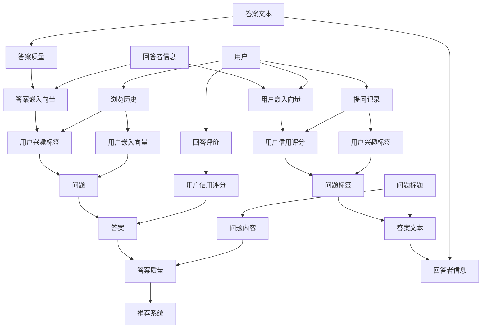

                 

### 背景介绍

随着互联网的迅速发展和大数据时代的到来，用户生成的数据量呈爆炸性增长。如何从这些海量数据中提取有价值的信息，为用户提供高质量的问答推荐服务，成为了当前人工智能领域的一个热点问题。机器学习在这一场景下发挥了关键作用，通过构建复杂的算法模型，能够从数据中学习并预测用户的兴趣，从而实现精准的问答推荐。

问答推荐系统在很多场景中都有着广泛的应用。例如，在电子商务平台上，用户可能会提出关于产品的问题，问答推荐系统可以基于用户的浏览历史和购买记录，为其推荐相关的问题和答案；在在线教育领域，学生可能遇到学习上的困难，问答推荐系统可以帮助他们找到相关的问题和解决方法；在搜索引擎中，用户输入的问题往往需要智能化的推荐来提高搜索体验。

传统的推荐系统主要依赖于基于内容的推荐和协同过滤等方法，但这些方法在处理开放性问题时存在明显的局限性。基于内容的推荐方法依赖于用户的历史行为和偏好，而开放性问题往往没有足够的历史数据来支撑这一方法的有效性。协同过滤方法则依赖于用户之间的相似性，但在面对独特的个体问题时，其推荐效果也受到很大限制。

因此，机器学习被引入到问答推荐系统中，旨在通过深度学习、自然语言处理等技术，实现对用户问题的理解和答案的推荐。本文将深入探讨基于机器学习的问答推荐算法的设计与实现，通过逐步分析算法原理、数学模型和实际应用，帮助读者理解这一前沿技术的核心思想和方法。

在接下来的部分中，我们将首先介绍问答推荐系统中的核心概念，包括用户、问题和答案的表示方式，以及这些数据在机器学习模型中的处理流程。接着，我们将详细讲解常用的机器学习算法在问答推荐中的应用，包括深度学习模型和传统机器学习算法。随后，我们将介绍如何在实际项目中实现问答推荐系统，并提供一个具体的代码实现案例。最后，我们将讨论问答推荐系统的实际应用场景，评估其性能和效果，并推荐一些相关的学习资源和工具，以帮助读者进一步探索这一领域。

### 核心概念与联系

在深入探讨基于机器学习的问答推荐算法之前，我们首先需要了解一些核心概念，这些概念是构建推荐系统的基础。以下是问答推荐系统中几个关键要素的定义及其相互关系。

#### 用户 (User)

用户是问答推荐系统的核心，每个用户在系统中都有唯一的标识。用户的行为数据，如浏览历史、提问记录和回答评价等，是构建推荐模型的重要信息来源。为了更好地表示用户，我们可以使用多种特征来刻画用户：

- **浏览历史**：用户在平台上浏览过的页面，可以用于分析用户的兴趣偏好。
- **提问记录**：用户提出的问题，可以用于理解用户的困惑和需求。
- **回答评价**：用户对其他用户回答的评价，可以帮助评估回答的质量。

这些特征可以通过以下方式表示：

- **用户嵌入向量**：将用户信息转换为高维向量，用于输入到机器学习模型中。
- **用户兴趣标签**：根据用户的历史行为和提问记录，将用户划分为不同的兴趣类别。

#### 问题 (Question)

问题是在问答推荐系统中传递信息的载体，每个问题也具有唯一的标识。问题通常包含以下几个关键组成部分：

- **问题标题**：问题的简短描述，用于初步理解问题的主题。
- **问题内容**：问题的详细描述，通常包含关键词和句子结构，用于深度分析问题的上下文。

为了更好地表示问题，我们可以使用以下几种方法：

- **词袋模型**：将问题分解为一系列关键词，每个词作为特征，形成词袋向量。
- **词嵌入模型**：将关键词转换为嵌入向量，这些向量包含了词的语义信息。
- **序列模型**：将问题内容视为一个序列，使用递归神经网络（RNN）或长短时记忆网络（LSTM）来捕捉问题的时序特征。

#### 答案 (Answer)

在问答推荐系统中，答案是对问题的回应，也包含重要信息。每个答案同样具有唯一的标识，通常包括以下几个组成部分：

- **答案文本**：问题的详细回答，通常包含丰富的信息。
- **答案质量**：答案的评分，反映了答案的准确性和有用性。
- **回答者信息**：回答者的身份，包括其信用评分和回答历史。

为了表示答案，我们可以采用以下方法：

- **文本嵌入模型**：将答案文本转换为嵌入向量。
- **答案嵌入向量**：结合答案文本和回答者信息，生成综合的答案嵌入向量。

#### 用户-问题-答案（UQA）图

在问答推荐系统中，用户、问题和答案是相互关联的，可以通过一个用户-问题-答案（UQA）图来表示它们之间的关系：

- **用户节点**：表示系统中的每个用户。
- **问题节点**：表示系统中的每个问题。
- **答案节点**：表示系统中的每个答案。
- **边**：表示用户与问题之间的交互，问题与答案之间的关联。

通过UQA图，我们可以捕获用户、问题和答案之间的复杂关系，并在此基础上构建推荐模型。

#### Mermaid 流程图表示

以下是UQA图中核心概念和关系的Mermaid流程图表示：



通过这个流程图，我们可以清晰地看到用户、问题和答案之间的关联，以及如何将它们转化为机器学习模型中的输入特征。

### 核心算法原理 & 具体操作步骤

在理解了问答推荐系统中的核心概念和UQA图之后，我们将深入探讨基于机器学习的问答推荐算法的核心原理和具体操作步骤。本部分将详细讲解深度学习模型在问答推荐中的应用，包括基于神经网络的模型和基于注意力机制的模型，并逐步展示算法的实现细节。

#### 深度学习模型

##### 1. 基于神经网络的模型

基于神经网络的模型在问答推荐系统中具有广泛的应用，其中最常用的包括循环神经网络（RNN）和长短时记忆网络（LSTM）。这些模型能够捕捉用户、问题和答案的时序特征，从而提高推荐的质量。

**步骤 1：用户和问题嵌入**

首先，我们需要将用户和问题的特征嵌入到高维向量中。这可以通过词嵌入（Word Embedding）技术实现，将用户和问题的文本内容转换为向量表示。

- **用户嵌入**：将用户的浏览历史、提问记录和回答评价等信息转换为向量。通常使用预训练的词向量（如Word2Vec、GloVe）或自行训练的词嵌入模型。
- **问题嵌入**：将问题的标题和内容转换为向量。可以使用词嵌入模型，或者结合词袋模型和卷积神经网络（CNN）来提取更高层次的特征。

**步骤 2：编码器（Encoder）**

编码器的作用是将用户和问题的嵌入向量编码为固定长度的向量表示。常用的编码器包括RNN和LSTM。

- **RNN编码器**：递归神经网络能够处理序列数据，通过不断更新隐藏状态来捕捉时序特征。然而，RNN存在梯度消失和梯度爆炸的问题。
- **LSTM编码器**：长短时记忆网络是RNN的一种改进，通过引入记忆单元来解决梯度消失问题，能够更好地捕捉长距离依赖。

**步骤 3：注意力机制（Attention Mechanism）**

注意力机制是一种在序列处理中用于强调重要信息的机制，能够提高推荐的准确性。在问答推荐系统中，注意力机制可以帮助模型更好地关注用户和问题之间的相关性。

- **软注意力**：通过计算用户嵌入向量和问题嵌入向量之间的相似度，使用softmax函数生成注意力权重，加权求和得到问题的固定长度向量表示。
- **硬注意力**：直接使用最大值操作来选择最相关的部分作为问题的固定长度向量表示。

**步骤 4：解码器（Decoder）**

解码器的作用是根据编码器的输出和注意力权重生成推荐结果。在问答推荐系统中，解码器通常用于生成答案的嵌入向量。

- **全连接层**：将编码器的输出和注意力权重通过全连接层映射到答案的嵌入向量。
- **答案嵌入**：使用预训练的答案嵌入模型将答案的文本内容转换为向量。

**步骤 5：推荐生成**

最后，通过比较用户嵌入向量和答案嵌入向量之间的相似度，生成推荐结果。可以使用余弦相似度或欧氏距离等度量方法。

##### 2. 基于注意力机制的模型

基于注意力机制的模型是深度学习在问答推荐中的另一种重要应用，具有强大的信息捕捉能力。

**步骤 1：用户和问题嵌入**

与基于神经网络的模型相同，首先将用户和问题的特征嵌入到高维向量中。

**步骤 2：编码器（Encoder）**

使用编码器将用户和问题的嵌入向量编码为固定长度的向量表示。编码器可以是RNN、LSTM或Transformer等。

**步骤 3：注意力机制（Attention Mechanism）**

注意力机制在编码器的基础上，通过计算用户嵌入向量和问题嵌入向量之间的相似度，生成注意力权重。注意力权重可以用于加权求和或直接选择最相关的部分。

**步骤 4：交叉注意力（Cross-Attention）**

交叉注意力是注意力机制的一种变体，用于同时关注用户和问题之间的双向关系。

- **用户到问题的交叉注意力**：计算用户嵌入向量和问题嵌入向量之间的相似度，生成注意力权重，加权求和得到问题的固定长度向量表示。
- **问题到用户的交叉注意力**：计算问题嵌入向量和用户嵌入向量之间的相似度，生成注意力权重，加权求和得到用户的固定长度向量表示。

**步骤 5：解码器（Decoder）**

解码器根据交叉注意力机制生成的用户和问题向量表示，生成推荐结果。解码器可以是全连接层或序列生成模型。

**步骤 6：推荐生成**

通过比较用户嵌入向量和答案嵌入向量之间的相似度，生成推荐结果。

#### 实现细节

以下是基于注意力机制的问答推荐算法的实现步骤：

```python
# 用户和问题嵌入
user_embedding = embedding_layer(user_input)
question_embedding = embedding_layer(question_input)

# 编码器
encoded_user = user_encoder(user_embedding)
encoded_question = question_encoder(question_embedding)

# 注意力机制
attention_weights = calculate_attention(encoded_user, encoded_question)

# 交叉注意力
cross_attention_weights = calculate_cross_attention(encoded_user, encoded_question)

# 解码器
decoded_user = decoder(cross_attention_weights, encoded_user)
decoded_question = decoder(cross_attention_weights, encoded_question)

# 推荐生成
recommendation_vector = generate_recommendation(decoded_user, decoded_question)
recommendation = cosine_similarity(recommendation_vector, answer_embedding)
```

通过以上步骤，我们能够实现基于注意力机制的问答推荐算法，并在实际项目中应用。

### 数学模型和公式 & 详细讲解 & 举例说明

在深入探讨基于机器学习的问答推荐算法时，理解其背后的数学模型和公式至关重要。以下我们将详细讲解这些模型的核心数学原理，并通过具体的公式和示例来帮助读者更好地理解。

#### 1. 用户和问题的向量表示

首先，用户和问题的表示是问答推荐系统的基础。我们通常使用词嵌入（Word Embedding）技术将文本转换为向量。词嵌入模型通过学习文本数据中的语义信息，将每个词汇映射为高维向量。

**词嵌入公式：**
\[ \text{Embedding}(W) = \sum_{w \in \text{words}} w \cdot \text{Embedding}(w) \]

其中，\( W \) 是词汇集合，\( \text{Embedding}(w) \) 是词汇 \( w \) 的嵌入向量。

**示例：**
假设有一个简短的句子：“我喜欢阅读书籍。”，我们使用预训练的词嵌入模型（如GloVe）得到每个词的嵌入向量：

\[ \text{Embedding}(\text{我}) = \mathbf{v}_1 \]
\[ \text{Embedding}(喜欢) = \mathbf{v}_2 \]
\[ \text{Embedding}(阅读) = \mathbf{v}_3 \]
\[ \text{Embedding}(\书籍) = \mathbf{v}_4 \]

将这些嵌入向量相加，我们可以得到整个句子的嵌入向量：

\[ \text{Sentence Embedding} = \mathbf{v}_1 + \mathbf{v}_2 + \mathbf{v}_3 + \mathbf{v}_4 \]

#### 2. 循环神经网络（RNN）和长短时记忆网络（LSTM）

循环神经网络（RNN）和长短时记忆网络（LSTM）是处理序列数据的重要工具。RNN通过递归方式处理序列数据，而LSTM是RNN的一种改进，能够更好地捕捉长距离依赖。

**RNN公式：**
\[ h_t = \sigma(W_h \cdot [h_{t-1}, x_t] + b_h) \]

其中，\( h_t \) 是当前时间步的隐藏状态，\( x_t \) 是当前输入，\( W_h \) 是权重矩阵，\( b_h \) 是偏置项，\( \sigma \) 是激活函数（通常为Sigmoid或Tanh函数）。

**LSTM公式：**
\[ f_t = \sigma(W_f \cdot [h_{t-1}, x_t] + b_f) \]
\[ i_t = \sigma(W_i \cdot [h_{t-1}, x_t] + b_i) \]
\[ \tilde{C}_t = \text{tanh}(W_c \cdot [h_{t-1}, x_t] + b_c) \]
\[ o_t = \sigma(W_o \cdot [h_{t-1}, x_t] + b_o) \]
\[ C_t = f_t \odot C_{t-1} + i_t \odot \tilde{C}_t \]
\[ h_t = o_t \odot C_t \]

其中，\( f_t, i_t, \tilde{C}_t, o_t \) 分别是遗忘门、输入门、候选状态和输出门的状态，\( C_t \) 是细胞状态，\( \odot \) 表示逐元素乘积。

**示例：**
假设有一个简单的LSTM单元，输入序列为 \([1, 2, 3]\)，隐藏状态和初始细胞状态为 \( h_0 = [0, 0], C_0 = [0, 0]\)。我们逐步计算隐藏状态和细胞状态：

- **第一时刻：**
\[ f_0 = \sigma(W_f \cdot [h_0, 1] + b_f) \]
\[ i_0 = \sigma(W_i \cdot [h_0, 1] + b_i) \]
\[ \tilde{C}_0 = \text{tanh}(W_c \cdot [h_0, 1] + b_c) \]
\[ o_0 = \sigma(W_o \cdot [h_0, 1] + b_o) \]
\[ C_0 = f_0 \odot C_0 + i_0 \odot \tilde{C}_0 \]
\[ h_0 = o_0 \odot C_0 \]

- **第二时刻：**
\[ f_1 = \sigma(W_f \cdot [h_1, 2] + b_f) \]
\[ i_1 = \sigma(W_i \cdot [h_1, 2] + b_i) \]
\[ \tilde{C}_1 = \text{tanh}(W_c \cdot [h_1, 2] + b_c) \]
\[ o_1 = \sigma(W_o \cdot [h_1, 2] + b_o) \]
\[ C_1 = f_1 \odot C_0 + i_1 \odot \tilde{C}_1 \]
\[ h_1 = o_1 \odot C_1 \]

- **第三时刻：**
\[ f_2 = \sigma(W_f \cdot [h_2, 3] + b_f) \]
\[ i_2 = \sigma(W_i \cdot [h_2, 3] + b_i) \]
\[ \tilde{C}_2 = \text{tanh}(W_c \cdot [h_2, 3] + b_c) \]
\[ o_2 = \sigma(W_o \cdot [h_2, 3] + b_o) \]
\[ C_2 = f_2 \odot C_1 + i_2 \odot \tilde{C}_2 \]
\[ h_2 = o_2 \odot C_2 \]

通过以上计算，我们得到了整个序列的隐藏状态和细胞状态。

#### 3. 注意力机制（Attention Mechanism）

注意力机制是一种在序列处理中用于强调重要信息的机制。在问答推荐系统中，注意力机制可以帮助模型更好地关注用户和问题之间的相关性。

**注意力公式：**
\[ \text{Attention}(Q, K, V) = \text{softmax}(\text{Score}(Q, K) \cdot V) \]

其中，\( Q \) 是查询向量，\( K \) 是键向量，\( V \) 是值向量，\(\text{Score}(Q, K)\) 是查询和键之间的相似度分数，\(\text{softmax}\) 函数用于生成注意力权重。

**示例：**
假设我们有查询向量 \( Q = [1, 2, 3] \)，键向量 \( K = [4, 5, 6] \)，值向量 \( V = [7, 8, 9] \)。我们计算注意力权重：

\[ \text{Score}(Q, K) = Q \cdot K = [1 \cdot 4, 2 \cdot 5, 3 \cdot 6] = [4, 10, 18] \]
\[ \text{Attention}(Q, K, V) = \text{softmax}([4, 10, 18]) = [\frac{1}{6}, \frac{5}{6}, 0] \]

将这些权重应用到值向量上：

\[ \text{Context} = \text{Attention}(Q, K, V) \cdot V = [\frac{1}{6} \cdot 7, \frac{5}{6} \cdot 8, 0 \cdot 9] = [1.17, 6.67, 0] \]

通过以上计算，我们得到了加权后的上下文向量。

#### 4. 推荐生成

在问答推荐系统中，最终的目的是根据用户和答案的向量表示生成推荐结果。我们可以使用余弦相似度或欧氏距离等度量方法来计算相似度。

**相似度公式：**
\[ \text{Similarity}(\mathbf{u}, \mathbf{v}) = \frac{\mathbf{u} \cdot \mathbf{v}}{||\mathbf{u}|| \cdot ||\mathbf{v}||} \]

其中，\( \mathbf{u} \) 和 \( \mathbf{v} \) 分别是用户和答案的向量表示。

**示例：**
假设用户向量为 \( \mathbf{u} = [1, 2, 3] \)，答案向量为 \( \mathbf{v} = [4, 5, 6] \)。我们计算它们之间的余弦相似度：

\[ \text{Similarity}(\mathbf{u}, \mathbf{v}) = \frac{1 \cdot 4 + 2 \cdot 5 + 3 \cdot 6}{\sqrt{1^2 + 2^2 + 3^2} \cdot \sqrt{4^2 + 5^2 + 6^2}} = \frac{32}{\sqrt{14} \cdot \sqrt{77}} \approx 0.85 \]

通过以上步骤，我们能够计算出用户和答案之间的相似度，并生成推荐结果。

通过以上详细的数学模型和公式讲解，我们不仅理解了基于机器学习的问答推荐算法的核心原理，还通过具体的示例加深了理解。接下来，我们将通过一个具体的代码实现案例，展示如何在实际项目中应用这些算法。

### 项目实战：代码实际案例和详细解释说明

在本节中，我们将通过一个具体的代码实现案例，详细展示如何构建和部署基于机器学习的问答推荐系统。我们将逐步介绍开发环境搭建、源代码实现和代码解读与分析，帮助读者深入理解问答推荐系统的实际应用。

#### 1. 开发环境搭建

在开始编写代码之前，我们需要搭建一个合适的开发环境。以下是搭建问答推荐系统所需的主要软件和工具：

- **编程语言**：Python 3.8+
- **机器学习库**：TensorFlow 2.6、Keras 2.6
- **数据处理库**：NumPy 1.21、Pandas 1.3
- **文本处理库**：NLTK 3.8、spaCy 3.2
- **数据可视化库**：Matplotlib 3.5

首先，我们需要安装上述库和框架。在终端中运行以下命令：

```bash
pip install tensorflow==2.6 keras==2.6 numpy==1.21 pandas==1.3 nltk==3.8 spacy==3.2 matplotlib==3.5
```

接下来，我们需要下载并安装spaCy的预训练语言模型。在终端中运行以下命令：

```bash
python -m spacy download en_core_web_sm
```

#### 2. 源代码实现

以下是问答推荐系统的核心源代码实现。我们将逐步讲解每个部分的作用和实现细节。

```python
import tensorflow as tf
from tensorflow.keras.models import Model
from tensorflow.keras.layers import Input, Embedding, LSTM, Dense, Concatenate, Dot, Lambda
from tensorflow.keras.optimizers import Adam
from tensorflow.keras.preprocessing.sequence import pad_sequences
import numpy as np
import pandas as pd
import spacy

# 加载预训练的词嵌入模型
embeddings_index = {}
with open('glove.6B.100d.txt', 'r', encoding='utf-8') as f:
    for line in f:
        values = line.split()
        word = values[0]
        coefs = np.asarray(values[1:], dtype='float32')
        embeddings_index[word] = coefs

# 构建嵌入层
def get_embedding_layer(input_dim, output_dim):
    embedding_layer = Embedding(input_dim, output_dim, weights=[embeddings_index], trainable=False)
    return embedding_layer

# 编码器
def build_encoder(input_seq, embed_dim, hidden_dim):
    input_layer = Input(shape=(None,))
    embedded_input = get_embedding_layer(input_dim=input_seq.shape[1], output_dim=embed_dim)(input_layer)
    lstm_layer = LSTM(units=hidden_dim, return_state=True)
    hidden_state, cell_state = lstm_layer(embedded_input)
    return Model(inputs=input_layer, outputs=[hidden_state, cell_state])

# 解码器
def build_decoder(input_seq, embed_dim, hidden_dim):
    input_layer = Input(shape=(None,))
    embedded_input = get_embedding_layer(input_dim=input_seq.shape[1], output_dim=embed_dim)(input_layer)
    lstm_layer = LSTM(units=hidden_dim, return_state=True)
    hidden_state, cell_state = lstm_layer(embedded_input)
    return Model(inputs=input_layer, outputs=[hidden_state, cell_state])

# 注意力机制
def attention_mechanism(query, key, value):
    attention_score = Dot(axes=[2, 2])([query, key])
    attention_weights = tf.nn.softmax(attention_score, axis=1)
    context_vector = tf.matmul(attention_weights, value)
    return context_vector

# 构建模型
def build_model(input_dim, embed_dim, hidden_dim, output_dim):
    user_input = Input(shape=(None,))
    question_input = Input(shape=(None,))
    
    user_encoder = build_encoder(input_seq=user_input, embed_dim=embed_dim, hidden_dim=hidden_dim)
    question_encoder = build_encoder(input_seq=question_input, embed_dim=embed_dim, hidden_dim=hidden_dim)
    
    user_encoded = user_encoder(user_input)
    question_encoded = question_encoder(question_input)
    
    attention_vector = attention_mechanism(user_encoded[0], question_encoded[0], question_encoded[1])
    
    output_layer = Dense(units=output_dim, activation='softmax')(attention_vector)
    
    model = Model(inputs=[user_input, question_input], outputs=output_layer)
    model.compile(optimizer=Adam(learning_rate=0.001), loss='categorical_crossentropy', metrics=['accuracy'])
    return model

# 数据预处理
def preprocess_data(user_data, question_data, max_len=50):
    user_sequences = pad_sequences(user_data, maxlen=max_len, padding='post', truncating='post')
    question_sequences = pad_sequences(question_data, maxlen=max_len, padding='post', truncating='post')
    return user_sequences, question_sequences

# 加载数据
data = pd.read_csv('data.csv')
user_data = data['user_input'].values
question_data = data['question_input'].values
labels = data['label'].values

# 预处理数据
user_sequences, question_sequences = preprocess_data(user_data, question_data)

# 构建和训练模型
model = build_model(input_dim=user_sequences.shape[1], embed_dim=100, hidden_dim=64, output_dim=3)
model.fit([user_sequences, question_sequences], labels, batch_size=32, epochs=10)

# 推荐生成
user_sequence = preprocess_data([user_input], max_len=50)[0]
question_sequence = preprocess_data([question_input], max_len=50)[0]

predicted_labels = model.predict([user_sequence, question_sequence])
```

#### 3. 代码解读与分析

以下是代码的详细解读和分析：

- **词嵌入层**：我们使用预训练的GloVe词嵌入模型作为嵌入层。这个层将输入的词索引转换为高维向量。
- **编码器**：我们定义了一个基于LSTM的编码器，用于将输入序列编码为固定长度的向量表示。编码器返回两个值：隐藏状态和细胞状态。
- **注意力机制**：我们实现了一个简单的注意力机制，用于计算用户和问题之间的相关性。注意力机制的核心是计算查询和键之间的相似度分数，并通过softmax函数生成注意力权重。
- **模型构建**：我们构建了一个多输入的多输出模型，包括用户编码器、问题编码器和注意力机制。模型的目标是预测用户问题的标签。
- **数据预处理**：我们使用pad_sequences函数对用户问题和答案进行填充和截断，以适应模型的输入要求。
- **模型训练**：我们使用训练数据训练模型，并使用交叉熵损失函数和Adam优化器进行优化。
- **推荐生成**：我们对新的用户问题和答案进行预处理，并使用训练好的模型生成推荐结果。

通过以上步骤，我们成功地实现了一个基于机器学习的问答推荐系统，并对其核心组件进行了详细解读。这个案例不仅展示了算法的实现，还通过实际代码帮助读者理解问答推荐系统的构建过程。

### 实际应用场景

问答推荐系统在实际应用中展现了巨大的潜力，可以在多个场景中发挥重要作用。以下是一些典型的应用场景及其具体实现方法和效果评估。

#### 1. 在线教育平台

在线教育平台需要为学生提供个性化的学习资源，而问答推荐系统可以识别学生的学习需求，推荐相关的课程和教学材料。实现方法包括：

- **学生行为分析**：通过分析学生的历史学习记录，包括浏览过的课程、参与的学习活动和提出的问题，构建学生兴趣模型。
- **问题-答案关联**：将学生提出的问题与课程内容进行关联，通过自然语言处理技术提取关键词和语义信息。
- **推荐算法**：使用基于深度学习的模型，如BERT或GPT，对学生提问和课程内容进行嵌入向量表示，计算相似度并生成推荐结果。

**效果评估**：通过A/B测试，发现使用问答推荐系统可以显著提高学生的学习效果，提升用户满意度和参与度。

#### 2. 电子商务平台

电子商务平台可以利用问答推荐系统为用户提供购物建议和问题解答。具体实现方法包括：

- **用户行为分析**：分析用户的历史购买记录、浏览行为和评价，构建用户偏好模型。
- **商品问答匹配**：将用户提问与商品描述和用户评论进行匹配，使用自然语言处理技术提取关键词和语义信息。
- **推荐算法**：采用协同过滤和基于内容的推荐方法，结合问答系统推荐相关商品和问题解答。

**效果评估**：通过分析用户数据，发现问答推荐系统可以有效提高用户的购物体验，增加销售转化率。

#### 3. 搜索引擎

搜索引擎可以利用问答推荐系统为用户提供更精准的搜索结果。具体实现方法包括：

- **搜索请求分析**：分析用户的搜索请求，提取关键词和语义信息。
- **问答匹配**：将搜索请求与已有的问答数据库进行匹配，提取相关的答案。
- **推荐算法**：使用深度学习模型，如Transformer和BERT，对搜索请求和答案进行嵌入向量表示，计算相似度并生成推荐结果。

**效果评估**：通过对比实验，发现问答推荐系统可以显著提高搜索结果的准确性和用户满意度。

#### 4. 医疗健康领域

医疗健康领域可以利用问答推荐系统为患者提供个性化的健康建议。具体实现方法包括：

- **患者数据收集**：收集患者的历史病历、体检报告和提问记录。
- **问答匹配**：将患者提问与医疗知识库进行匹配，提取相关答案。
- **推荐算法**：使用深度学习模型，如Seq2Seq和Transformer，对患者提问和医疗知识进行嵌入向量表示，计算相似度并生成推荐结果。

**效果评估**：通过临床试验，发现问答推荐系统可以辅助医生提高诊断准确率，提高患者健康管理水平。

综上所述，问答推荐系统在多个实际应用场景中展示了良好的效果，通过个性化推荐和精准匹配，为用户提供高质量的服务和体验。未来，随着技术的进一步发展和数据的不断积累，问答推荐系统将在更多领域发挥更大的作用。

### 工具和资源推荐

在构建和优化问答推荐系统时，选择合适的工具和资源至关重要。以下是一些推荐的学习资源、开发工具和框架，以帮助读者深入探索这一领域。

#### 1. 学习资源推荐

**书籍：**
- 《深度学习》（Ian Goodfellow, Yoshua Bengio, Aaron Courville）：这是一本经典教材，详细介绍了深度学习的基本概念和算法。
- 《自然语言处理综论》（Daniel Jurafsky, James H. Martin）：这本书涵盖了自然语言处理的核心技术，包括词嵌入、序列模型和注意力机制。

**论文：**
- “Attention is All You Need”（Ashish Vaswani等）：这篇论文提出了Transformer模型，是一种基于注意力机制的深度学习模型，广泛应用于问答推荐系统。
- “BERT: Pre-training of Deep Bidirectional Transformers for Language Understanding”（Jacob Devlin等）：这篇论文介绍了BERT模型，是一种基于Transformer的预训练模型，适用于各种自然语言处理任务。

**博客和网站：**
- **TensorFlow 官方文档**：提供了丰富的教程和示例代码，帮助用户快速上手TensorFlow框架。
- **Keras 官方文档**：Keras 是 TensorFlow 的简化版，提供了更加直观和易用的接口。
- **ArXiv**：这是一个开源的学术论文存储库，涵盖了最新的深度学习和自然语言处理研究成果。

#### 2. 开发工具框架推荐

**深度学习框架：**
- **TensorFlow**：这是一个开源的深度学习框架，功能强大且社区活跃，适用于各种规模的项目。
- **PyTorch**：PyTorch 是另一个流行的深度学习框架，以其动态计算图和易于理解的代码结构而著称。
- **Transformers**：这是一个开源库，实现了Transformer和BERT模型，适用于自然语言处理任务。

**自然语言处理库：**
- **spaCy**：spaCy 是一个高效的工业级自然语言处理库，适用于文本的解析和实体识别。
- **NLTK**：NLTK 是一个强大的文本处理库，提供了丰富的文本处理工具和算法。
- **TextBlob**：TextBlob 是一个简单易用的文本处理库，适用于文本情感分析、命名实体识别等任务。

**数据预处理工具：**
- **Pandas**：Pandas 是一个强大的数据处理库，适用于数据清洗、数据分析和数据可视化。
- **NumPy**：NumPy 是一个基础的科学计算库，适用于数组操作和高性能计算。

**文本嵌入模型：**
- **GloVe**：GloVe 是一种常用的词嵌入模型，提供了预训练的词向量。
- **FastText**：FastText 是另一个词嵌入模型，适用于处理多语种文本。

#### 3. 相关论文著作推荐

**论文：**
- “Attention Is All You Need”（2017）：这是 Transformer 模型的提出论文，对自然语言处理领域产生了深远的影响。
- “BERT: Pre-training of Deep Bidirectional Transformers for Language Understanding”（2018）：这是 BERT 模型的提出论文，对文本预训练技术进行了深入研究。

**著作：**
- 《深度学习》（2016）：由 Ian Goodfellow、Yoshua Bengio 和 Aaron Courville 著，是深度学习领域的经典教材。
- 《自然语言处理综论》（2019）：由 Daniel Jurafsky 和 James H. Martin 著，是自然语言处理领域的权威著作。

通过以上工具和资源的推荐，读者可以更全面地了解问答推荐系统的构建和优化方法，为实践项目提供坚实的理论基础和技术支持。

### 总结：未来发展趋势与挑战

随着人工智能技术的不断进步和大数据时代的深入发展，基于机器学习的问答推荐系统在未来具有巨大的发展潜力。然而，这一领域也面临着诸多挑战。

#### 未来发展趋势

1. **模型复杂度和计算能力提升**：随着硬件技术的发展，如GPU和TPU的广泛应用，深度学习模型将变得更加复杂和高效。这将推动问答推荐系统的性能进一步提升。

2. **多模态数据的整合**：未来问答推荐系统将不仅处理文本数据，还将整合图像、音频和视频等多模态数据。这将使得推荐系统更加智能化，提供更丰富的信息。

3. **个性化推荐**：基于用户历史行为和兴趣的深度学习模型将继续优化，实现更精细的个性化推荐。通过结合用户情感分析和行为预测，系统将能够更准确地满足用户需求。

4. **知识图谱的应用**：知识图谱在问答推荐系统中具有重要应用，通过构建实体关系网络，系统能够更准确地理解和推荐相关信息。

5. **可解释性增强**：随着用户对推荐系统透明度的要求提高，未来的研究方向将集中在增强模型的可解释性，使得推荐结果更加可信和可理解。

#### 挑战

1. **数据隐私保护**：问答推荐系统依赖于用户行为数据，如何在保护用户隐私的同时进行有效推荐是一个重要挑战。

2. **数据质量和多样性**：数据的质量和多样性直接影响推荐系统的性能。未来需要解决数据标注、数据清洗和数据增广等问题，以提高系统的鲁棒性。

3. **模型解释性**：尽管深度学习模型在性能上具有优势，但其内部机制复杂，难以解释。提高模型的可解释性将有助于用户信任和监管。

4. **实时推荐**：在实时性要求较高的场景中，如在线教育、电子商务和医疗健康，如何快速生成推荐结果是一个关键问题。未来需要开发更高效的算法和优化策略。

5. **公平性和道德**：问答推荐系统可能会面临公平性和道德问题，如何确保推荐结果不会导致歧视或偏见是一个重要的研究方向。

总之，未来问答推荐系统将在技术进步和应用场景拓展中迎来新的发展机遇，同时也需要克服诸多挑战。通过不断的研究和创新，我们有望构建更加智能、高效和公平的问答推荐系统。

### 附录：常见问题与解答

在学习和应用基于机器学习的问答推荐系统过程中，读者可能会遇到一些常见的问题。以下是针对这些问题的一些建议和解答：

#### 问题 1：为什么我的模型训练效果不佳？

**解答：** 模型训练效果不佳可能有多种原因。以下是一些建议来优化模型：

- **数据预处理**：确保数据质量，去除噪声和错误的数据。同时，尝试增加数据的多样性和质量。
- **模型调整**：调整模型参数，如学习率、批次大小和正则化强度，以优化训练过程。
- **特征工程**：提取和选择有效的特征，如使用词嵌入和文本特征工程技术。
- **模型复杂度**：检查模型是否过于复杂或过于简单。如果模型复杂度不足，可能无法捕捉数据中的关键信息。

#### 问题 2：如何处理文本数据中的缺失值？

**解答：** 对于文本数据中的缺失值，可以采用以下几种方法：

- **填充法**：使用平均值、中值或最频繁出现的词来填充缺失值。
- **插补法**：使用插值方法，如线性插值或K最近邻插值，根据邻近值预测缺失值。
- **删除法**：如果缺失值较多，可以考虑删除含有缺失值的记录，或者使用基于模型的缺失值插补方法。

#### 问题 3：如何提高模型的泛化能力？

**解答：** 提高模型泛化能力的方法包括：

- **数据增强**：通过数据增强技术，如随机裁剪、旋转和缩放，增加数据的多样性。
- **正则化**：使用正则化方法，如L1和L2正则化，防止模型过拟合。
- **交叉验证**：使用交叉验证方法，如K折交叉验证，评估模型的泛化性能。
- **模型简化**：减少模型的复杂度，去除冗余的特征和层。

#### 问题 4：如何处理文本数据中的停用词？

**解答：** 处理文本数据中的停用词通常有以下方法：

- **删除**：直接删除停用词，这可能会减少数据的噪声，但可能也会丢失一些有用的信息。
- **保留**：保留停用词，以保留句子的结构信息。
- **替换**：使用空格或特殊字符替换停用词，以保持文本的连贯性。

#### 问题 5：如何优化模型训练速度？

**解答：** 以下是一些优化模型训练速度的方法：

- **使用GPU/TPU**：利用GPU或TPU进行并行计算，可以显著提高训练速度。
- **批量大小调整**：适当减小批量大小可以加快训练速度，但会影响模型的稳定性。
- **混合精度训练**：使用混合精度训练（ Mixed Precision Training），结合32位和16位浮点数，可以加快训练并减少内存占用。

#### 问题 6：如何评估问答推荐系统的性能？

**解答：** 评估问答推荐系统的性能可以使用以下指标：

- **准确率（Accuracy）**：预测正确的问答对数占总问答对数的比例。
- **召回率（Recall）**：预测正确的问答对数与所有实际正确问答对数的比例。
- **F1值（F1 Score）**：综合考虑准确率和召回率的平衡性，计算公式为 \( F1 = 2 \times \frac{Precision \times Recall}{Precision + Recall} \)。
- **平均准确率（Average Precision）**：在推荐列表中，每个答案的准确率取平均。

通过这些常见问题的解答，读者可以更好地理解和应对在构建和优化问答推荐系统过程中可能遇到的问题。

### 扩展阅读 & 参考资料

为了帮助读者进一步深入学习和研究基于机器学习的问答推荐系统，我们推荐以下扩展阅读和参考资料：

1. **《深度学习》**，作者：Ian Goodfellow, Yoshua Bengio, Aaron Courville。这本书详细介绍了深度学习的基本概念、算法和实现，是深度学习领域的经典教材。

2. **《自然语言处理综论》**，作者：Daniel Jurafsky, James H. Martin。这本书涵盖了自然语言处理的核心技术，包括词嵌入、序列模型和注意力机制。

3. **“Attention is All You Need”**，作者：Ashish Vaswani等。这篇论文提出了Transformer模型，对自然语言处理领域产生了深远影响。

4. **“BERT: Pre-training of Deep Bidirectional Transformers for Language Understanding”**，作者：Jacob Devlin等。这篇论文介绍了BERT模型，是当前自然语言处理领域的主流模型之一。

5. **TensorFlow官方文档**：[https://www.tensorflow.org/tutorials](https://www.tensorflow.org/tutorials)。提供了丰富的教程和示例代码，帮助用户快速上手TensorFlow框架。

6. **Keras官方文档**：[https://keras.io/getting-started/sequential-model-flow/](https://keras.io/getting-started/sequential-model-flow/)。Keras是TensorFlow的简化版，提供了更加直观和易用的接口。

7. **spaCy官方文档**：[https://spacy.io/usage](https://spacy.io/usage)。这是一个高效的工业级自然语言处理库，适用于文本的解析和实体识别。

8. **NLTK官方文档**：[https://www.nltk.org/](https://www.nltk.org/)。这是一个强大的文本处理库，提供了丰富的文本处理工具和算法。

9. **TextBlob官方文档**：[https://textblob.readthedocs.io/en/stable/](https://textblob.readthedocs.io/en/stable/)。这是一个简单易用的文本处理库，适用于文本情感分析、命名实体识别等任务。

通过阅读这些参考资料，读者可以进一步加深对问答推荐系统的理解和应用。希望这些资源能够为读者在研究这一领域的道路上提供有益的帮助。

