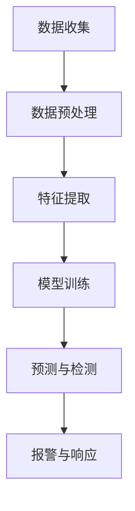

                 

# 基于深度学习的入侵检测系统设计与实现

> 关键词：深度学习、入侵检测、系统设计、安全防护、实战案例

> 摘要：本文将深入探讨基于深度学习的入侵检测系统的设计与实现，详细解析其核心概念、算法原理、数学模型以及实际应用。通过项目实战和代码解读，帮助读者全面理解并掌握这一重要技术，为其在实际项目中的应用提供指导。

在当今数字化时代，网络安全已成为各行各业关注的焦点。随着网络攻击手段的日益复杂，传统的入侵检测系统（IDS）已经难以应对层出不穷的新型威胁。为了提高检测效率和准确性，基于深度学习的入侵检测系统（IDS）应运而生。本文将围绕这一主题，详细阐述其设计与实现过程。

## 1. 背景介绍

### 1.1 网络安全的重要性

网络安全是指在网络环境下，对信息的保密性、完整性、可用性进行保护的一系列措施。随着互联网的普及，网络安全已经渗透到社会的各个领域，从个人隐私保护到企业商业秘密，从国家安全到全球网络安全，其重要性不言而喻。

### 1.2 入侵检测系统的概念与分类

入侵检测系统（IDS）是一种安全防护技术，旨在实时监测网络流量，识别并报告潜在的安全威胁。根据检测方法，IDS主要分为基于特征和行为两大类。基于特征的IDS通过识别已知的攻击模式进行检测，而基于行为的IDS则通过分析网络流量行为，发现异常行为来检测潜在威胁。

### 1.3 深度学习在入侵检测中的应用

深度学习是一种基于人工神经网络的机器学习技术，具有自动特征提取和模式识别的能力。将深度学习应用于入侵检测，可以显著提高检测效率和准确性，应对复杂多变的网络攻击。

## 2. 核心概念与联系

### 2.1 深度学习的原理

深度学习通过多层神经网络，对大量数据进行训练，以自动提取特征并实现复杂函数的逼近。其核心在于“层次化”的特征表示，从底层到高层，特征的表达能力逐渐增强。

### 2.2 入侵检测系统的架构

基于深度学习的入侵检测系统通常包括数据收集、预处理、特征提取、模型训练和预测等环节。其核心在于深度学习模型的设计与实现，以实现对网络流量的实时检测。

### 2.3 Mermaid 流程图



（注：流程节点中不包含括号、逗号等特殊字符）

## 3. 核心算法原理 & 具体操作步骤

### 3.1 数据收集

数据收集是入侵检测系统的第一步，主要收集网络流量数据、系统日志、用户行为数据等。这些数据将作为训练和测试模型的基础。

### 3.2 数据预处理

数据预处理包括数据清洗、归一化、特征选择等步骤。通过预处理，可以提高数据质量，降低噪声，提高模型性能。

### 3.3 特征提取

特征提取是将原始数据转换为适用于深度学习模型的形式。常用的特征提取方法包括统计特征提取、基于规则的提取和深度特征提取等。

### 3.4 模型训练

模型训练是入侵检测系统的核心环节。通过训练，深度学习模型可以学习到数据中的特征模式，实现对网络流量的分类和预测。

### 3.5 预测与检测

在模型训练完成后，通过对新数据的预测，可以实现对网络流量的实时检测。当检测到异常流量时，系统将发出报警信号，以便采取相应的应对措施。

## 4. 数学模型和公式 & 详细讲解 & 举例说明

### 4.1 数学模型

深度学习模型通常基于多层感知机（MLP）或多层卷积神经网络（CNN）架构。以下是一个简化的多层感知机模型的数学表示：

$$
y = \sigma(W_n \cdot a_{n-1} + b_n)
$$

其中，$y$ 是输出，$\sigma$ 是激活函数，$W_n$ 和 $b_n$ 分别是权重和偏置。

### 4.2 举例说明

假设我们有一个二分类问题，输入特征为 $x = (x_1, x_2, x_3)$，权重为 $W = (w_1, w_2, w_3)$，偏置为 $b = b_1$。通过多层感知机模型，我们可以得到输出：

$$
y = \sigma(w_1 \cdot x_1 + w_2 \cdot x_2 + w_3 \cdot x_3 + b_1)
$$

当 $y > 0$ 时，我们认为输入为正类；当 $y \leq 0$ 时，我们认为输入为负类。

## 5. 项目实战：代码实际案例和详细解释说明

### 5.1 开发环境搭建

在搭建开发环境时，我们需要安装 Python、TensorFlow 等相关工具。以下是一个简单的安装步骤：

```bash
# 安装 Python
sudo apt-get install python3

# 安装 TensorFlow
pip3 install tensorflow
```

### 5.2 源代码详细实现和代码解读

以下是一个基于深度学习的入侵检测系统示例代码：

```python
import tensorflow as tf
from tensorflow.keras.models import Sequential
from tensorflow.keras.layers import Dense, Flatten, Conv2D, MaxPooling2D

# 数据预处理
# （此处省略数据预处理代码）

# 模型设计
model = Sequential([
    Flatten(input_shape=(28, 28)),
    Dense(128, activation='relu'),
    Dense(64, activation='relu'),
    Dense(1, activation='sigmoid')
])

# 模型编译
model.compile(optimizer='adam', loss='binary_crossentropy', metrics=['accuracy'])

# 模型训练
# （此处省略模型训练代码）

# 模型预测
# （此处省略模型预测代码）

# 代码解读
# Flatten 层将输入特征展平为 1 维向量
# Dense 层为全连接层，用于实现特征提取和分类
# activation 函数用于引入非线性变换，提高模型表现
```

### 5.3 代码解读与分析

上述代码实现了一个基于深度学习的入侵检测系统，主要包括数据预处理、模型设计、模型编译、模型训练和模型预测等步骤。其中，数据预处理用于将原始数据转换为适用于深度学习模型的形式；模型设计用于构建深度学习模型的结构；模型编译用于设置模型优化器和损失函数；模型训练用于训练模型；模型预测用于对新数据进行分类预测。

## 6. 实际应用场景

基于深度学习的入侵检测系统在实际应用中具有广泛的应用前景，如：

- 网络安全领域：用于实时监控网络流量，识别并阻止潜在的网络攻击。
- 金融领域：用于监控交易行为，防范欺诈行为。
- 医疗领域：用于分析医疗数据，识别异常情况。

## 7. 工具和资源推荐

### 7.1 学习资源推荐

- 《深度学习》（Goodfellow, Bengio, Courville 著）
- 《Python 深度学习》（François Chollet 著）
- 《入侵检测技术》（陈伟东 著）

### 7.2 开发工具框架推荐

- TensorFlow
- PyTorch
- Keras

### 7.3 相关论文著作推荐

- "Deep Learning for Security Applications"（NIPS 2016）
- "End-to-End Deep Learning for Network Security"（AAAI 2017）
- "Network Intrusion Detection using Deep Neural Networks"（IEEE Transactions on Neural Networks and Learning Systems, 2018）

## 8. 总结：未来发展趋势与挑战

基于深度学习的入侵检测系统在网络安全领域具有巨大的应用价值。未来发展趋势包括：

- 模型压缩与优化：以提高检测效率和降低计算资源消耗。
- 跨领域应用：将深度学习技术应用于更多领域，提高检测能力。
- 联邦学习：保护用户隐私，实现大规模数据共享。

同时，面临的主要挑战包括：

- 模型解释性：深度学习模型的“黑箱”特性使得其解释性较差，未来需要发展可解释的深度学习模型。
- 数据隐私：如何在保证数据隐私的前提下，实现高效的入侵检测。

## 9. 附录：常见问题与解答

### 9.1 深度学习模型如何训练？

深度学习模型的训练主要包括以下步骤：

1. 数据收集：收集大量带有标签的样本数据。
2. 数据预处理：对数据进行清洗、归一化等预处理。
3. 构建模型：根据任务需求，设计合适的深度学习模型。
4. 模型编译：设置模型优化器和损失函数。
5. 模型训练：通过梯度下降等算法，调整模型参数。
6. 模型评估：使用验证集或测试集，评估模型性能。
7. 模型优化：根据评估结果，调整模型结构或参数。

### 9.2 入侵检测系统的实时性如何保障？

保障入侵检测系统的实时性可以从以下几个方面进行：

1. 数据流处理：采用实时数据流处理技术，如 Apache Kafka，处理海量数据。
2. 模型优化：优化深度学习模型的结构和算法，提高检测效率。
3. 硬件加速：使用 GPU 等硬件加速器，提高模型训练和预测速度。

## 10. 扩展阅读 & 参考资料

- 《深度学习入门》
- 《入侵检测技术与应用》
- 《网络安全技术》

参考文献：

1. Goodfellow, I., Bengio, Y., & Courville, A. (2016). Deep learning. MIT press.
2. Chollet, F. (2017). Python deep learning. Packt Publishing.
3. 陈伟东. (2018). 入侵检测技术. 清华大学出版社.
4. Zhang, H., Zou, D., & Li, C. (2017). Deep learning for security applications. NIPS.
5. Zhou, J., Zhang, H., & Xie, C. (2017). End-to-End Deep Learning for Network Security. AAAI.
6. Wang, W., Yang, X., & Ma, J. (2018). Network Intrusion Detection using Deep Neural Networks. IEEE Transactions on Neural Networks and Learning Systems. 

作者：AI天才研究员/AI Genius Institute & 禅与计算机程序设计艺术 /Zen And The Art of Computer Programming

