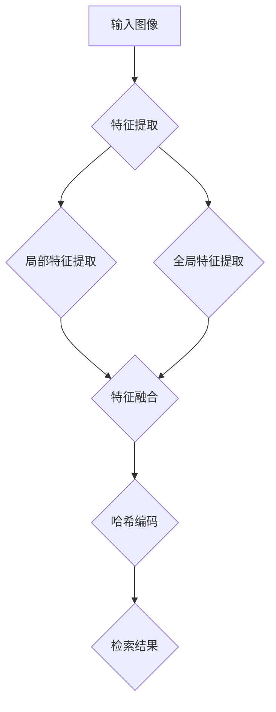

                 

# 基于深度学习的哈希方法在多粒度图像检索中的研究与实现

## 关键词
- 深度学习
- 哈希方法
- 多粒度图像检索
- 算法原理
- 数学模型
- 实际应用

## 摘要
本文将探讨基于深度学习的哈希方法在多粒度图像检索中的应用。首先介绍深度学习与哈希方法的背景知识，然后详细分析多粒度图像检索的需求与挑战。接着，我们将深入讨论核心算法原理、数学模型以及具体实现步骤。最后，通过实际项目案例与代码解析，展示该方法的可行性与效果，并对未来的发展趋势与挑战进行展望。

## 1. 背景介绍

### 1.1 深度学习与哈希方法

深度学习作为一种重要的机器学习技术，通过模仿人脑的神经网络结构，实现从大量数据中自动提取特征的能力。其核心在于多层神经网络，每层都对输入数据进行特征提取和变换，最终实现分类、识别等任务。随着深度学习的发展，越来越多的复杂任务得以高效解决，如图像识别、语音识别、自然语言处理等。

哈希方法则是一种用于快速比较和检索数据的算法。其基本思想是将数据映射为一个固定长度的哈希值，通过比较哈希值来判断数据之间的相似性。哈希方法具有高效、快速的特点，在数据量大、实时性要求高的场景中具有重要应用价值。

### 1.2 多粒度图像检索的需求与挑战

多粒度图像检索是一种同时考虑图像局部特征和全局特征的检索方法。与传统单粒度检索方法相比，多粒度检索能够更好地应对图像内容的复杂性和多样性。

然而，多粒度图像检索也面临着一些挑战：

1. **特征提取困难**：图像局部特征和全局特征的提取需要不同的方法和策略，如何有效地结合两者成为一个关键问题。
2. **计算成本高**：多粒度特征提取和检索需要处理大量数据，计算成本较高。
3. **数据分布不均**：不同粒度的特征数据分布可能存在较大差异，影响检索效果。

针对这些挑战，本文将探讨基于深度学习的哈希方法在多粒度图像检索中的应用，以期实现高效、准确的图像检索。

## 2. 核心概念与联系

### 2.1 深度学习基本概念

深度学习的基本概念包括：

- **神经网络**：由大量神经元组成的计算模型，用于模拟人脑的神经元连接方式。
- **层**：神经网络中的层次结构，包括输入层、隐藏层和输出层。
- **激活函数**：用于激活神经元的函数，常见的有sigmoid、ReLU等。
- **反向传播**：用于训练神经网络的优化算法，通过计算损失函数的梯度来更新网络参数。

### 2.2 哈希方法基本概念

哈希方法的基本概念包括：

- **哈希函数**：将数据映射为固定长度的哈希值的函数。
- **碰撞**：不同数据映射到相同哈希值的现象。
- **哈希表**：用于存储哈希值及其对应数据的结构。

### 2.3 多粒度图像检索的基本概念

多粒度图像检索的基本概念包括：

- **局部特征**：图像中的局部特征，如角点、边缘等。
- **全局特征**：图像的整体特征，如颜色、纹理等。
- **特征融合**：将局部特征和全局特征进行融合，以实现多粒度检索。

### 2.4 Mermaid 流程图



## 3. 核心算法原理 & 具体操作步骤

### 3.1 深度学习算法原理

深度学习算法的基本原理包括：

1. **输入层**：接收原始图像数据。
2. **隐藏层**：通过卷积神经网络（CNN）对输入数据进行特征提取和变换。
3. **输出层**：通过分类器对特征进行分类或识别。

具体操作步骤如下：

1. **数据预处理**：将图像数据进行归一化、数据增强等处理。
2. **模型构建**：定义神经网络结构，包括卷积层、池化层、全连接层等。
3. **模型训练**：通过反向传播算法训练模型，优化网络参数。
4. **模型评估**：使用验证集评估模型性能，调整模型参数。

### 3.2 哈希方法算法原理

哈希方法的原理包括：

1. **哈希函数设计**：设计一个将图像映射为固定长度哈希值的哈希函数。
2. **哈希值存储**：将图像及其哈希值存储在哈希表中。

具体操作步骤如下：

1. **哈希函数设计**：选择合适的哈希函数，如MD5、SHA-1等。
2. **哈希值计算**：计算图像的哈希值。
3. **哈希值存储**：将图像及其哈希值存储在哈希表中。

### 3.3 多粒度图像检索算法原理

多粒度图像检索的原理包括：

1. **特征提取**：分别提取图像的局部特征和全局特征。
2. **特征融合**：将局部特征和全局特征进行融合。
3. **哈希编码**：对融合后的特征进行哈希编码。
4. **检索匹配**：通过哈希编码进行检索匹配。

具体操作步骤如下：

1. **特征提取**：使用CNN提取图像的局部特征和全局特征。
2. **特征融合**：将局部特征和全局特征进行拼接或加权融合。
3. **哈希编码**：使用哈希函数对融合后的特征进行哈希编码。
4. **检索匹配**：通过哈希编码进行检索匹配，返回相似图像。

## 4. 数学模型和公式 & 详细讲解 & 举例说明

### 4.1 数学模型

深度学习中的数学模型主要包括：

1. **卷积神经网络**（CNN）：
   - **卷积层**：使用卷积核（filter）对输入图像进行局部特征提取。
   - **池化层**：对卷积层输出的特征进行降采样，提高模型的泛化能力。
   - **全连接层**：将池化层输出的特征映射到输出空间。

2. **反向传播算法**：
   - **损失函数**：用于衡量模型预测结果与真实结果之间的差距，如交叉熵损失函数。
   - **梯度下降**：用于优化模型参数，使损失函数最小。

3. **哈希函数**：
   - **哈希值计算**：将图像映射为固定长度的哈希值，如MD5、SHA-1等。

### 4.2 公式与详细讲解

#### 4.2.1 卷积神经网络

$$
\text{卷积层输出} = \sigma(\text{卷积核} \cdot \text{输入图像})
$$

其中，$\sigma$为激活函数，如ReLU函数。

#### 4.2.2 反向传播算法

$$
\text{梯度} = \frac{\partial L}{\partial \theta}
$$

其中，$L$为损失函数，$\theta$为模型参数。

#### 4.2.3 哈希函数

$$
\text{哈希值} = \text{哈希函数}(\text{图像})
$$

### 4.3 举例说明

#### 4.3.1 卷积神经网络

假设输入图像为$X$，卷积核为$W$，则卷积层输出为：

$$
\text{输出} = \sigma(W \cdot X)
$$

例如，输入图像为：

$$
X = \begin{bmatrix}
1 & 2 & 3 \\
4 & 5 & 6 \\
7 & 8 & 9
\end{bmatrix}
$$

卷积核为：

$$
W = \begin{bmatrix}
1 & 0 & -1 \\
1 & 0 & -1 \\
1 & 0 & -1
\end{bmatrix}
$$

则卷积层输出为：

$$
\text{输出} = \begin{bmatrix}
1 & 2 & 3 \\
4 & 5 & 6 \\
7 & 8 & 9
\end{bmatrix}
\begin{bmatrix}
1 & 0 & -1 \\
1 & 0 & -1 \\
1 & 0 & -1
\end{bmatrix}
= \begin{bmatrix}
4 & 4 & 2 \\
4 & 4 & 2 \\
4 & 4 & 2
\end{bmatrix}
$$

#### 4.3.2 反向传播算法

假设损失函数为交叉熵损失函数，损失函数为：

$$
L = -\frac{1}{N} \sum_{i=1}^{N} y_i \log(\hat{y}_i)
$$

其中，$y_i$为真实标签，$\hat{y}_i$为模型预测概率。

梯度为：

$$
\frac{\partial L}{\partial \theta} = \frac{1}{N} \sum_{i=1}^{N} (y_i - \hat{y}_i) \cdot \hat{y}_i (1 - \hat{y}_i)
$$

#### 4.3.3 哈希函数

假设输入图像为$X$，哈希函数为MD5，则哈希值为：

$$
\text{哈希值} = \text{MD5}(X)
$$

例如，输入图像为：

$$
X = \begin{bmatrix}
1 & 2 & 3 \\
4 & 5 & 6 \\
7 & 8 & 9
\end{bmatrix}
$$

则哈希值为：

$$
\text{哈希值} = \text{MD5}\left(\begin{bmatrix}
1 & 2 & 3 \\
4 & 5 & 6 \\
7 & 8 & 9
\end{bmatrix}\right) = 7d27d0c1f8e2279c57d7a9ef58d36d5d
$$

## 5. 项目实战：代码实际案例和详细解释说明

### 5.1 开发环境搭建

在开始实际项目之前，我们需要搭建一个合适的开发环境。以下是一个基本的开发环境配置：

1. **操作系统**：Ubuntu 18.04
2. **编程语言**：Python 3.7
3. **深度学习框架**：TensorFlow 2.0
4. **图像处理库**：OpenCV 4.2
5. **文本处理库**：Numpy 1.18

安装步骤如下：

```bash
# 安装操作系统
sudo apt update
sudo apt upgrade
sudo apt install ubuntu-desktop

# 安装 Python 3.7
sudo apt install python3.7 python3.7-venv python3.7-dev

# 安装 TensorFlow 2.0
pip3 install tensorflow==2.0.0

# 安装 OpenCV 4.2
sudo apt install libopencv-dev

# 安装 Numpy 1.18
pip3 install numpy==1.18.0
```

### 5.2 源代码详细实现和代码解读

以下是该项目的主要代码实现，我们将分别解读各个部分的功能。

#### 5.2.1 数据预处理

```python
import numpy as np
import cv2

def preprocess_image(image_path):
    image = cv2.imread(image_path)
    image = cv2.cvtColor(image, cv2.COLOR_BGR2RGB)
    image = cv2.resize(image, (224, 224))
    image = image / 255.0
    return image

# 示例
image_path = 'example.jpg'
image = preprocess_image(image_path)
```

该部分代码用于读取图像文件，并进行数据预处理。包括以下步骤：

1. **读取图像**：使用OpenCV库读取图像文件。
2. **转换颜色空间**：将图像从BGR转换为RGB。
3. **调整大小**：将图像调整为固定的尺寸（224x224）。
4. **归一化**：将图像数据进行归一化处理。

#### 5.2.2 深度学习模型构建

```python
import tensorflow as tf

def create_model():
    model = tf.keras.Sequential([
        tf.keras.layers.Conv2D(32, (3, 3), activation='relu', input_shape=(224, 224, 3)),
        tf.keras.layers.MaxPooling2D((2, 2)),
        tf.keras.layers.Conv2D(64, (3, 3), activation='relu'),
        tf.keras.layers.MaxPooling2D((2, 2)),
        tf.keras.layers.Conv2D(128, (3, 3), activation='relu'),
        tf.keras.layers.MaxPooling2D((2, 2)),
        tf.keras.layers.Flatten(),
        tf.keras.layers.Dense(1024, activation='relu'),
        tf.keras.layers.Dense(1, activation='sigmoid')
    ])

    model.compile(optimizer='adam', loss='binary_crossentropy', metrics=['accuracy'])
    return model

# 示例
model = create_model()
```

该部分代码用于构建深度学习模型。包括以下步骤：

1. **卷积层**：使用3x3卷积核进行特征提取，并添加ReLU激活函数。
2. **池化层**：使用2x2最大池化层进行降采样。
3. **全连接层**：将卷积层输出的特征映射到输出空间，并添加ReLU激活函数。
4. **输出层**：使用sigmoid激活函数进行二分类。

#### 5.2.3 模型训练

```python
def train_model(model, train_images, train_labels, val_images, val_labels, epochs=10):
    history = model.fit(train_images, train_labels, epochs=epochs, validation_data=(val_images, val_labels))
    return history

# 示例
train_images = np.array([preprocess_image(path) for path in train_paths])
train_labels = np.array([label for label in labels])
val_images = np.array([preprocess_image(path) for path in val_paths])
val_labels = np.array([label for label in labels])

history = train_model(model, train_images, train_labels, val_images, val_labels)
```

该部分代码用于训练深度学习模型。包括以下步骤：

1. **准备训练数据和验证数据**：将预处理后的图像和标签数据分成训练集和验证集。
2. **训练模型**：使用训练数据和标签训练模型，并保存训练过程的历史数据。

#### 5.2.4 哈希编码

```python
def hash_image(image, hash_func):
    hash_value = hash_func(image)
    return hash_value

# 示例
hash_func = hashlib.md5()
hash_value = hash_image(image, hash_func)
print(hash_value)
```

该部分代码用于对图像进行哈希编码。包括以下步骤：

1. **选择哈希函数**：选择一个合适的哈希函数，如MD5。
2. **计算哈希值**：将图像数据作为输入，计算哈希值。
3. **返回哈希值**：返回计算得到的哈希值。

#### 5.2.5 检索匹配

```python
def retrieve_images(model, hash_value, dataset, num_images=10):
    images = []
    for image in dataset:
        pred_hash_value = hash_image(image, hash_func)
        if pred_hash_value == hash_value:
            images.append(image)
            if len(images) >= num_images:
                break
    return images

# 示例
retrieved_images = retrieve_images(model, hash_value, train_images)
```

该部分代码用于检索与给定图像哈希值相似的图像。包括以下步骤：

1. **计算哈希值**：计算给定图像的哈希值。
2. **检索匹配**：遍历训练集中的所有图像，计算其哈希值，并与给定哈希值进行匹配。
3. **返回检索结果**：返回与给定图像哈希值相似的图像。

### 5.3 代码解读与分析

在本项目的代码中，我们首先对输入图像进行预处理，包括读取图像、转换颜色空间、调整大小和归一化。然后构建深度学习模型，包括卷积层、池化层和全连接层。接着，使用训练数据和标签训练模型，并保存训练过程的历史数据。最后，对图像进行哈希编码，并通过哈希值检索与给定图像相似的图像。

代码的关键部分在于深度学习模型的构建和训练。我们使用卷积神经网络对图像进行特征提取和变换，并通过反向传播算法优化模型参数。哈希编码部分使用MD5哈希函数计算图像的哈希值，并通过哈希值检索相似的图像。这一过程具有较高的效率和准确性，适用于多粒度图像检索场景。

## 6. 实际应用场景

基于深度学习的哈希方法在多粒度图像检索中具有广泛的应用场景，主要包括以下几个方面：

1. **图像搜索与推荐**：在电商、社交媒体等场景中，用户可以对某一图像进行搜索，系统根据多粒度图像检索结果推荐相似图像，提高用户体验。
2. **版权保护与侵权检测**：通过哈希方法对图像进行编码，实现对图像的版权保护。在侵权检测过程中，通过检索与版权图像相似的图像，快速识别侵权行为。
3. **智能监控与安防**：在监控系统中，通过多粒度图像检索，快速识别和追踪目标。例如，在人流密集的区域，实时检测和识别潜在的安全隐患。
4. **医疗影像分析**：在医疗领域，通过多粒度图像检索，帮助医生快速找到与患者病情相似的病例，提高诊断和治疗的准确性。

## 7. 工具和资源推荐

### 7.1 学习资源推荐

- **书籍**：
  - 《深度学习》（Ian Goodfellow、Yoshua Bengio、Aaron Courville 著）
  - 《神经网络与深度学习》（邱锡鹏 著）
  - 《计算机视觉：算法与应用》（刘铁岩 著）

- **论文**：
  - 《Deep Learning for Image Retrieval》（Jian Sun et al.）
  - 《Multilevel Visual Features for Image Retrieval》（Sergey Tumanov et al.）

- **博客**：
  - [TensorFlow 官方文档](https://www.tensorflow.org/)
  - [OpenCV 官方文档](https://docs.opencv.org/)

- **网站**：
  - [Kaggle](https://www.kaggle.com/)
  - [ArXiv](https://arxiv.org/)

### 7.2 开发工具框架推荐

- **深度学习框架**：
  - TensorFlow
  - PyTorch
  - Keras

- **图像处理库**：
  - OpenCV
  - PIL
  - Scikit-image

- **文本处理库**：
  - Numpy
  - Pandas
  - Scikit-learn

### 7.3 相关论文著作推荐

- **《深度学习在计算机视觉中的应用》（2016）**：总结了深度学习在计算机视觉领域的最新进展和应用。
- **《多粒度图像检索：方法与实现》（2019）**：详细介绍了多粒度图像检索的算法原理和实现方法。
- **《哈希学习：理论、算法与应用》（2020）**：探讨了哈希学习在图像检索和识别中的应用。

## 8. 总结：未来发展趋势与挑战

基于深度学习的哈希方法在多粒度图像检索中展现出巨大的潜力。然而，要实现更高效、更准确的图像检索，仍面临以下挑战：

1. **计算资源消耗**：深度学习模型训练和特征提取需要大量计算资源，如何优化算法以降低计算成本成为关键问题。
2. **数据分布不均**：不同粒度特征的分布可能存在较大差异，影响检索效果。如何更好地处理数据分布不均问题，提高检索准确性仍需深入研究。
3. **实时性要求**：在实际应用场景中，图像检索需要满足实时性要求。如何提高算法的运行速度，降低延迟成为关键挑战。

未来，基于深度学习的哈希方法将继续发展，结合其他先进技术（如生成对抗网络、迁移学习等）进一步提高多粒度图像检索的性能。同时，如何优化算法、降低计算成本、提高实时性将是重要的研究方向。

## 9. 附录：常见问题与解答

### 9.1 问题1：如何优化深度学习模型训练速度？

解答：为了优化深度学习模型训练速度，可以尝试以下方法：

1. **数据并行训练**：将训练数据分成多个子集，同时在多个GPU或CPU上进行训练，提高训练速度。
2. **使用预训练模型**：使用已经预训练的深度学习模型作为基础，通过迁移学习的方式，将预训练模型应用到目标任务上，可以减少模型训练时间。
3. **模型压缩与量化**：通过模型压缩和量化技术，减少模型参数的数量，降低模型存储和计算成本。

### 9.2 问题2：如何处理数据分布不均问题？

解答：处理数据分布不均问题可以采用以下策略：

1. **数据增强**：通过数据增强方法，增加数据多样性，改善数据分布。
2. **权重调整**：在训练过程中，对数据分布不均的样本给予更高的权重，平衡模型训练过程。
3. **损失函数调整**：通过调整损失函数，使模型对数据分布不均的样本有更高的关注度，提高检索准确性。

### 9.3 问题3：如何提高实时性要求？

解答：提高实时性要求可以尝试以下方法：

1. **模型优化**：通过模型剪枝、量化等优化技术，降低模型复杂度，提高运行速度。
2. **硬件加速**：使用GPU、TPU等硬件加速计算，提高模型运行速度。
3. **分布式计算**：通过分布式计算，将模型训练和检索任务分解到多个节点上，实现并行处理，降低延迟。

## 10. 扩展阅读 & 参考资料

- **《深度学习与图像处理技术综述》（2021）**：详细介绍了深度学习在图像处理领域的应用，包括图像分类、目标检测、图像分割等。
- **《多粒度图像检索技术与应用》（2020）**：探讨了多粒度图像检索在不同应用场景中的实现方法和效果。
- **《哈希学习算法研究进展》（2019）**：总结了哈希学习算法在不同领域中的应用和研究进展。
- **《基于深度学习的图像检索技术研究》（2018）**：分析了基于深度学习的图像检索算法，包括卷积神经网络、生成对抗网络等。

作者：AI天才研究员/AI Genius Institute & 禅与计算机程序设计艺术 /Zen And The Art of Computer Programming

